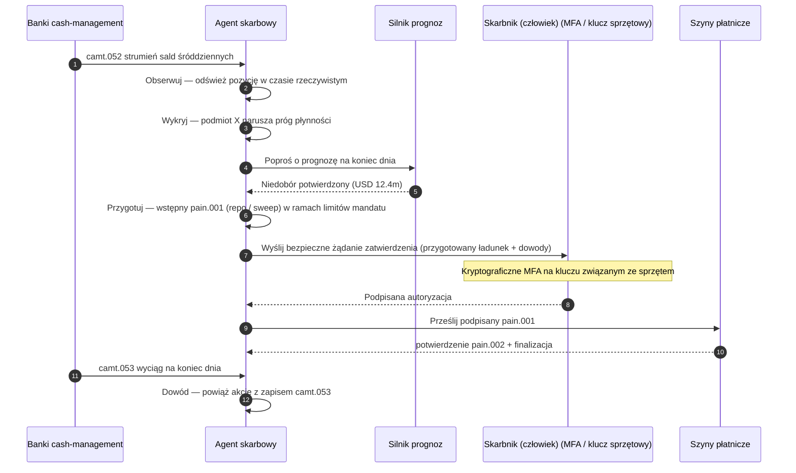

# Indeks Autonomicznego Skarbu 2026: agentowy skarb, programowalna płynność, stokenizowane depozyty i kontrola gotówki w czasie rzeczywistym

<!-- lead-start -->
<aside class="post-lead" aria-label="Podsumowanie artykułu">

<strong>W skrócie.</strong> Indeks autonomicznego skarbu 2026 — pomiar agentowych przepływów, pokrycia programowalnej płynności, integracji stokenizowanych depozytów, orkiestracji płatności w czasie rzeczywistym i automatycznej kontroli gotówki jako jednej tkanki modelu operacyjnego.

<strong>Wnioski kluczowe</strong>

<ul class="post-lead-takeaways">
  <li><strong>Skarb staje się systemem operacyjnym w czasie rzeczywistym.</strong> Statyczne prognozy płynności i wsadowe sweepy przestają być jednostką pomiaru; są nią agentowe przepływy oparte na danych w czasie rzeczywistym.</li>
  <li><strong>Programowalna płynność jest już wykonalna.</strong> Stokenizowane depozyty + szyny w czasie rzeczywistym sprawiają, że dostarczanie płynności na zdarzenie staje się prymitywem przepływu, a nie kwartalną inicjatywą.</li>
  <li><strong>Stokenizowane depozyty to preferowany pieniądz cyfrowy skarbnika.</strong> Ekonomika pieniądza bankowego, programowalność i pewność śróddzienna — bez pytań o ryzyko emitenta i rezerwy stablecoinów.</li>
  <li><strong>Control plane to nowa powierzchnia audytu.</strong> Mandaty, limity, ścieżki ręcznego nadpisania i dowody odwrócenia muszą działać jako prymitywy platformy, a nie ręczne zatwierdzenia per akcja.</li>
  <li><strong>Karta wyników CFO jest per decyzja, nie per kwartał.</strong> Koszt gotówki, redukcja bufora płynności śróddziennej, efektywność FX i dokładność prognozy są mierzone w tempie przepływu.</li>
</ul>

<strong>Powiązane lektury:</strong> <a href="https://sebastienrousseau.com/pl/2026-05-25-programmable-liquidity-ai-tokenised-deposits-real-time-treasury-2026/index.html">Programowalna płynność w 2026: AI, stokenizowane depozyty i orkiestracja skarbu w czasie rzeczywistym</a>, <a href="https://sebastienrousseau.com/pl/2026-05-21-tokenised-deposits-banking-services-status-2026/index.html">Stokenizowane depozyty w 2026: usługi bankowe, konkurencja stablecoinów i status programowalnego pieniądza banku komercyjnego</a>.

</aside>
<!-- lead-end -->

Autonomiczny skarb jest naturalnym punktem zbieżności agentowej AI, płatności hurtowych, stokenizowanych depozytów i płynności w czasie rzeczywistym. W 2026 roku najlepsze architektury skarbowe nie będą jedynie prognozować gotówki; będą rekomendować, wyjaśniać i ostatecznie wykonywać ograniczone działania płynnościowe w poprzek rachunków, walut, szyn i aktywów rozrachunkowych.

---

> **Podsumowanie dla zarządu / Wnioski kluczowe**
>
> - **Skarb przechodzi od raportowania do kontroli.** Salda w czasie rzeczywistym, prognozy, status płatności i ruch płynności stają się częścią jednego przepływu.
> - **Agentowa AI tworzy nowy interfejs skarbu.** Agenci mogą monitorować pozycje, ujawniać anomalie, przygotowywać działania finansujące i eskalować decyzje w ramach zdefiniowanych mandatów.
> - **Programowalny pieniądz zmienia nogę gotówkową.** Stokenizowane depozyty i eksperymenty z hurtowym CBDC otwierają nowe możliwości rozrachunku atomowego, płatności warunkowych i płynności zawsze dostępnej.
> - **Indeks musi mierzyć uprawnienia.** Pytaniem nie jest, czy agent może zaproponować działanie; pytaniem jest, czy uprawnienia, limity, zatwierdzenia i dowody są jasne.
> - **Wartość skarbu jest mierzalna.** Zaoszczędzona płynność, ograniczone śledztwa ręczne, uniknięte niepowodzenia rozrachunku i uwolniony kapitał obrotowy powinny definiować sukces.
>
---

## Dlaczego 2026 to rok, w którym ten indeks ma znaczenie

Stanford AI Index jest użyteczny, ponieważ traktuje szybko zmieniającą się dziedzinę technologii jako coś, co można zmierzyć: produkcja badawcza, wydajność techniczna, odpowiedzialne wdrożenia, ekonomika, adopcja sektorowa, polityka i nastroje społeczne zostają ujęte w jedną ramę ([Stanford HAI ⧉](https://hai.stanford.edu/ai-index/2026-ai-index-report "Raport Stanford AI Index 2026")). Banki i instytucje finansowe potrzebują dziś tej samej dyscypliny wobec infrastruktury. Agentowa AI, bezpieczeństwo kwantowo-odporne, odporność cloud-native i płatności hurtowe nie są już osobnymi ścieżkami innowacji; zbiegają się w jeden model operacyjny.

Praktyczne pytanie dla banku nie brzmi, czy każda dziedzina jest ważna. Brzmi ono, czy instytucja potrafi zmierzyć gotowość w nich wszystkich jednocześnie. Bank może wdrożyć agentową AI i wciąż być kruchy, jeśli jego kryptografia nie jest gotowa na migrację. Może zmodernizować platformy chmurowe i wciąż zawieść, jeśli dane płatnicze pozostają nieustrukturyzowane. Może prowadzić piloty tokenizacji i wciąż generować ryzyko systemowe, jeśli warstwy rozrachunku, płynności, tożsamości i audytu nie są projektowane razem.

## Architektura indeksu 2026

| Warstwa indeksu | Kierunek 2026 | Miara gotowości | Ryzyko przy złym wykonaniu |
|---|---|---|---|
| **Widoczność** | Ujednolicić dane o rachunkach, płatnościach, płynności i ekspozycjach | Pokrycie pozycji gotówkowych w czasie rzeczywistym | Fragmentaryczna widoczność gotówki |
| **Prognozowanie** | Używać AI do prognozowania sald, przepływów i potrzeb finansowania | Dokładność prognozy i wskaźnik wyjątków | Fałszywa pewność na słabych danych |
| **Autonomia** | Nadać agentom ograniczone uprawnienia do rekomendacji i działań | Pokrycie mandatami i jakość zatwierdzeń | Działania nieautoryzowane lub niewyjaśnione |
| **Programowalność** | Wykorzystać stokenizowane depozyty i warunki inteligentne tam, gdzie wnoszą wartość | Przypadki użycia płatności warunkowych i rozrachunku atomowego | Piloty skarbowe napędzane technologią |
| **Kontrole** | Wbudować limity, sankcje, FX, płynność i kontrole audytowe | Dowody kontroli per akcja skarbowa | Ręczny nadzór po wykonaniu |

## Bieżące sygnały do śledzenia

| Sygnał | Co oznacza dla banków | Źródło |
|---|---|---|
| **52% adopcji agentowej AI w usługach finansowych** | Skarb może już absorbować agentowe przepływy przez nadzorowane platformy | [Cambridge CCAF ⧉](https://www.jbs.cam.ac.uk/faculty-research/centres/alternative-finance/publications/2026-global-ai-in-financial-services-report/ "Globalny raport AI w usługach finansowych 2026") |
| **Płatności warunkowe w Project Agorá** | Tokenizacja może umożliwić zdolności płatności warunkowych i zawsze dostępnych | [BIS ⧉](https://www.bis.org/about/bisih/topics/fmis/agora.htm "Project Agorá") |
| **Bank of England — Digital Securities Sandbox** | Obligacje i akcje emitowane w technologii DLT rozliczane są w trybie 「Dostawa za płatność (DvP)」 — noga aktywowa i noga gotówkowa (hurtowy CBDC lub stokenizowane depozyty banków komercyjnych) rozliczają się w tej samej atomowej transakcji, eliminując ryzyko kontrahenta po stronie kapitału | [Bank of England ⧉](https://www.bankofengland.co.uk/financial-stability/digital-securities-sandbox "Digital Securities Sandbox") |
| **Termin adresów strukturalnych SWIFT** | Dane skarbowe muszą być prawidłowo wychwytywane u źródła | [SWIFT ⧉](https://www.swift.com/news-events/news/iso-20022-milestone-november-2026-unstructured-addresses-be-removed "Kamień milowy ISO 20022 — adresy strukturalne, listopad 2026") |
| **Duże instytucje finansowe mają trudność z pomiarem wartości AI** | Automatyzacja skarbu wymaga twardych miar ekonomicznych | [Cambridge CCAF ⧉](https://www.jbs.cam.ac.uk/faculty-research/centres/alternative-finance/publications/2026-global-ai-in-financial-services-report/ "Globalny raport AI w usługach finansowych 2026") |

## Mandat agenta skarbowego

Agent skarbowy nie powinien być projektowany jako asystent ogólnego przeznaczenia. Potrzebuje mandatu: obserwować rachunki, wykrywać wyjątki, prognozować luki finansowania, przygotowywać działania, prosić o zatwierdzenia, wykonywać w ramach limitów i wytwarzać dowody. Każdy krok powinien mieć inny model uprawnień.

Pętla kontrolna przebiega według sekwencji Obserwuj → Wykryj → Prognozuj → Przygotuj → Poproś o zatwierdzenie — i się zatrzymuje. Agent nigdy nie przekracza kryptograficznej granicy autoryzacji samodzielnie. Poniższy diagram śledzi jeden pełny cykl: wielomilionowy śróddzienny niedobór płynności ujawnia się w telemetrii `camt.052`, agent prognozuje pozycję na koniec dnia, przygotowuje repo lub przelew intercompany jako w pełni uformowany `pain.001` i przekazuje go skarbnikowi do kryptograficznego podpisu wieloskładnikowego na kluczu związanym ze sprzętem. Agent następnie przesyła podpisany ładunek; finalizacja ląduje jako potwierdzenie `pain.002`, a kolejne `camt.053` stanowi zapis księgowy.

Sednem jest właśnie ta granica — każda akcja przesuwająca realne pieniądze znajduje się za kryptograficzną bramką, której agent nie jest w stanie samodzielnie pokonać.

## Programowalna płynność

Programowalna płynność to zdolność przesuwania wartości pod warunkami: jeśli próg został przekroczony, jeśli zabezpieczenie jest kwalifikowalne, jeśli kontrahent przeszedł kontrolę, jeśli dostępna jest ostateczność rozrachunku lub jeśli bufor płynności śróddziennej jest zbyt niski. Stokenizowane depozyty i hurtowe platformy rozrachunkowe czynią te wzorce bardziej praktycznymi.

Programowalna nie oznacza poza standardem. Ścieżką wykonania jest `pain.001` — ISO 20022 Customer Credit Transfer Initiation. Przygotowana akcja agenta to w pełni uformowany ładunek `pain.001` kierowany do banku tym samym kanałem, którym posłużyłby się korporacyjny ERP, walidowany względem tej samej schemy, oceniany przez te same silniki fraudowe i sankcyjne oraz potwierdzany w tych samych raportach statusowych `pain.002`. Warstwa warunkowości (próg, kwalifikowalność zabezpieczenia, dostępność finalizacji, dolny próg bufora) działa ponad komunikatem — decyduje *czy* `pain.001` zostanie wysłany, a nie *jaką ma formę*. Platformy skarbowe, które wymyślają autorskie ładunki na wyrażenie warunków, wypadną ze ścieżki konsumowanej przez banki i wrócą do integracji bilateralnych.

## Sala kontroli skarbu

Model operacyjny powinien wyglądać jak sala kontroli: pozycje, prognozy, stany płatności, wykorzystanie limitów, wyjątki, zatwierdzenia i dowody w jednym interfejsie. Indeks powinien karać stosy skarbowe wymagające od zespołów łączenia maili, arkuszy, portali bankowych i odłączonych pulpitów.

Warstwą danych za tym interfejsem jest cash management ISO 20022. Pozycja śróddzienna to `camt.052` — Bank-to-Customer Account Report — strumieniowany z każdego banku cash-management do warstwy obserwacyjnej agenta z częstotliwością publikowaną przez bank (minuty dla dostawców GTB tier-1, koniec cyklu dla długiego ogona). Uzgodnienie na koniec dnia to `camt.053` — Bank-to-Customer Statement — audytowalny zapis, względem którego prognoza agenta jest oceniana następnego ranka. Platformy skarbowe, które odczytują wyciągi z PDF-ów lub przeszukują portale bankowe, nie spełnią 「Poziomu 4」 indeksu; telemetria śróddzienna musi docierać jako strukturalny `camt.052`, by pętla prognozy mogła zamknąć się w czasie pozwalającym działać.

## Co to oznacza dla poszczególnych typów banków

### Globalne banki systemowo istotne

Banki globalne powinny traktować ten indeks jako kartę wyników architektury korporacyjnej. Priorytetem nie jest kolejny proof of concept; jest nim dowód, że autonomiczne przepływy, migracja kryptograficzna, zależność od chmury i modernizacja płatności mogą być zarządzane jako jeden system ryzyka i wartości.

### Banki transakcyjne i banki korporacyjne

Banki transakcyjne powinny skupić się na płatnościach hurtowych, danych strukturalnych, płynności, stokenizowanych depozytach i agentowych usługach skarbowych. Najcenniejszą propozycją dla klienta nie jest sam szybszy ruch pieniądza; jest nim wyjaśnialny, audytowalny, programowalny ruch pieniądza z mniejszą liczbą śledztw i lepszą widocznością kapitału obrotowego.

### Banki regionalne

Banki regionalne powinny używać indeksu, by uniknąć rozrostu programów. Nie muszą prowadzić każdej granicy, ale potrzebują wiarygodnych stanowisk wobec nadzoru AI, inwentaryzacji post-kwantowej, dowodów wyjścia z chmury i gotowości danych płatniczych.

### Fintechy, PSP i dostawcy infrastruktury

Fintechy i dostawcy infrastruktury powinni dostosować mapy drogowe produktów do mierzalnej gotowości banków. Najlepsze propozycje zredukują ryzyko integracji, wzmocnią dowody i ułatwią bankom nadzór nad złożoną infrastrukturą.

## Wnioski

Wartość raportu w formie indeksu polega na tym, że przekłada fragmentaryczną agendę technologiczną na mierzalny model operacyjny. W 2026 roku zwycięzcami infrastruktury finansowej nie będą instytucje z największą liczbą pilotów. Będą nimi instytucje, które potrafią udowodnić gotowość w autonomii, bezpieczeństwie, odporności, rozrachunku, ekonomice i nadzorze jednocześnie.

## Najczęściej zadawane pytania

**Czym jest autonomiczny skarb?**

Autonomiczny skarb to wykorzystanie agentów AI, danych w czasie rzeczywistym i programowalnych płatności do monitorowania, rekomendowania i potencjalnego wykonywania działań skarbowych w ramach zdefiniowanych kontroli.

**Czy agenci skarbowi powinni mieć prawo wykonywać płatności?**

Tylko w wąskich mandatach, z silnymi limitami, jawnymi zatwierdzeniami i pełną audytowalnością. Uprawnienia wykonawcze powinny być zdobywane wraz z dojrzałością.

**Jak stokenizowane depozyty pomagają skarbowi?**

Mogą wspierać programowalny rozrachunek, wykonanie atomowe i potencjalnie lepszą kontrolę płynności śróddziennej, zachowując relacje pieniądza banku komercyjnego.

**Jaki jest pierwszy krok wdrożenia?**

Zbudować widoczność i jakość danych w czasie rzeczywistym, zanim przyzna się autonomię. Agenci nie potrafią bezpiecznie optymalizować gotówki, której nie widzą dokładnie.

## Bibliografia

- Cambridge Centre for Alternative Finance, (2026). [Globalny raport AI w usługach finansowych 2026 ⧉](https://www.jbs.cam.ac.uk/faculty-research/centres/alternative-finance/publications/2026-global-ai-in-financial-services-report/ "Globalny raport AI w usługach finansowych 2026").
- SWIFT, (2026). [Kamień milowy ISO 20022 — adresy strukturalne, listopad 2026 ⧉](https://www.swift.com/news-events/news/iso-20022-milestone-november-2026-unstructured-addresses-be-removed "Kamień milowy ISO 20022 — adresy strukturalne, listopad 2026").
- BIS Innovation Hub, (2026). [Project Agorá ⧉](https://www.bis.org/about/bisih/topics/fmis/agora.htm "Project Agorá").
- Bank of England, (2026). [Kształtowanie cyfrowej przyszłości finansowej Wielkiej Brytanii ⧉](https://www.bankofengland.co.uk/speech/2025/january/sasha-mills-speech-at-the-tokenisation-summit "Kształtowanie cyfrowej przyszłości finansowej Wielkiej Brytanii").

<!-- enrich-start -->
<aside class="author-card" aria-label="O autorze"><strong class="author-card-name"><a href="/about/index.html">Sebastien Rousseau</a></strong>Senior banking technologist piszący o stosowanej AI, infrastrukturze płatniczej, pieniądzu tokenizowanym, ISO 20022, bezpieczeństwie post-kwantowym, cloud-native usługach finansowych i regulowanych rynkach cyfrowych.Ponad 20 lat doświadczenia w HSBC Commercial &amp; Investment Bank, PayPal, Barclays, Shazam, AKQA, Virgin Group. <a href="/about/index.html">Pełny profil</a> &middot; <a href="https://www.linkedin.com/in/sebastienrousseau/" rel="external noopener">LinkedIn</a> &middot; <a href="https://github.com/sebastienrousseau" rel="external noopener">GitHub</a></aside>

Ostatnia weryfikacja <time datetime="2026-06-07">2026-06-07</time>.

<!-- enrich-end -->
