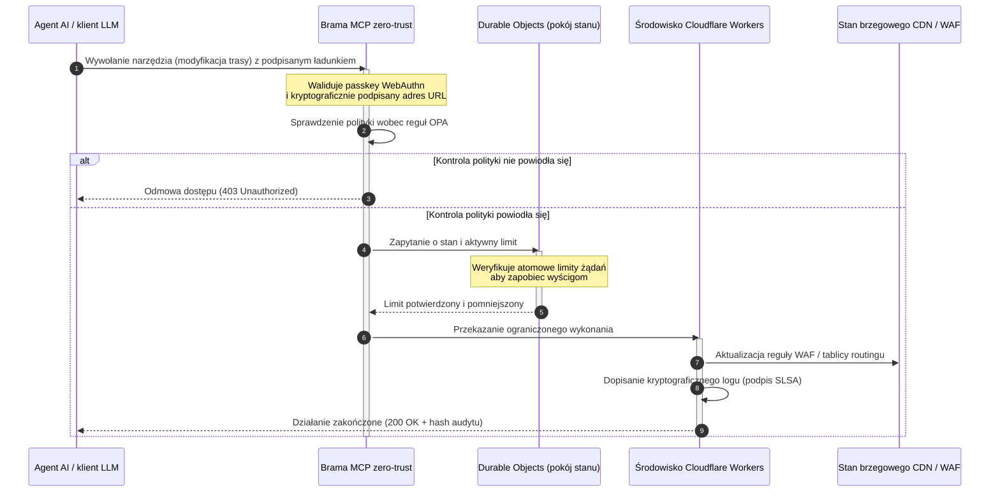

---

# Front Matter (YAML)

author: "contact@sebastienrousseau.com (Sebastien Rousseau)"
banner_alt: "Świecący stos szaf serwerowych w centrum danych nocą — symbolizujący możliwy do inspekcji, sterowalny przez agentów, open-source edge, na którym zbudowano CloudCDN"
banner_height: "1597"
banner_width: "2584"
banner: "https://cloudcdn.pro/stocks/images/alis-po-IdVNRv-5wJo.webp"
cdn: "https://cloudcdn.pro"
charset: "UTF-8"
cname: "sebastienrousseau.com"
copyright: "© Copyright 2025 - 2026 - Sebastien Rousseau. All rights reserved."
date: "11 czerwca 2026"
description: "CloudCDN zamienia CDN w kryptograficznie zabezpieczoną płaszczyznę sterowania na brzegu: brama MCP zero-trust, Durable Objects, SLSA Level 3, dowody pod DORA."
format-detection: "telephone=no"
hreflang: "pl"
icon: "https://cloudcdn.pro/clients/sebastienrousseau/v1/logos/sebastienrousseau.svg"
id: "https://sebastienrousseau.com/pl/2026-06-11-cloudcdn-open-source-blueprint-ai-native-edge-2026"
image_alt: "Czarno-biały portret Sebastiena Rousseau"
image_height: "162"
image_width: "162"
image: "https://cloudcdn.pro/stocks/images/sebastien-rousseau.png"
keywords: "CloudCDN, AI-natywny edge, open-source CDN, serwer MCP, Cloudflare Workers, Durable Objects, zero trust, WebAuthn, podpisane adresy URL, SLSA Level 3, DORA, brzegowa płaszczyzna sterowania"
language: "pl"
last_reviewed: "2026-06-11"
layout: "report"
locale: "pl_PL"
logo_alt: "Logo Sebastiena Rousseau"
logo_height: "44"
logo_width: "44"
logo: "https://cloudcdn.pro/clients/sebastienrousseau/v1/logos/sebastienrousseau.svg"
menu: ""
measurementID: "G-169G4ET5HQ"
name: "Sebastien Rousseau"
permalink: "https://sebastienrousseau.com/pl/2026-06-11-cloudcdn-open-source-blueprint-ai-native-edge-2026"
rating: "general"
referrer: "no-referrer"
robots: "index, follow"
schema: "FAQPage, Article"
seo_title: "CloudCDN: open-source schemat AI-natywnego edge"
short_name: "sebastienrousseau"
subtitle: "Od globalnego CDN jako statycznej pamięci podręcznej do kryptograficznie zabezpieczonej, sterowalnej przez agentów płaszczyzny sterowania na brzegu."
tags: "CloudCDN, open source, CDN, edge, agenci AI, MCP, Cloudflare Workers, Durable Objects, ograniczanie liczby żądań, zero trust, WebAuthn, SLSA, DORA, BCBS 239, Basel III, bankowość cloud-native"
theme-color: "0, 83, 191"
title: "CloudCDN: open-source schemat AI-natywnego edge w 2026"
url: "https://sebastienrousseau.com/pl/2026-06-11-cloudcdn-open-source-blueprint-ai-native-edge-2026"
viewport: "width=device-width, initial-scale=1, shrink-to-fit=no"

# RSS - The RSS feed front matter (YAML).
atom_link: "https://sebastienrousseau.com/2026-06-11-cloudcdn-open-source-blueprint-ai-native-edge-2026/rss.xml"
category: "Technology"
docs: https://validator.w3.org/feed/docs/rss2.html
generator: "Static Site Generator (SSG) (version 0.0.26)"
item_description: "CloudCDN zamienia CDN w kryptograficznie zabezpieczoną płaszczyznę sterowania na brzegu: brama MCP zero-trust, Durable Objects, SLSA Level 3, dowody pod DORA."
item_guid: "https://sebastienrousseau.com/2026-06-11-cloudcdn-open-source-blueprint-ai-native-edge-2026/rss.xml"
item_link: "https://sebastienrousseau.com/2026-06-11-cloudcdn-open-source-blueprint-ai-native-edge-2026/rss.xml"
item_pub_date: "Thu, 11 Jun 2026 06:06:06 +0000"
item_title: "CloudCDN: open-source schemat AI-natywnego edge w 2026"
last_build_date: "Thu, 11 Jun 2026 06:06:06 +0000"
managing_editor: "contact@sebastienrousseau.com (Sebastien Rousseau)"
pub_date: "Thu, 11 Jun 2026 06:06:06 +0000"
ttl: "60"
type: "article"
webmaster: "contact@sebastienrousseau.com"

# Apple - The Apple front matter (YAML).
apple_mobile_web_app_orientations: "portrait"
apple_touch_icon_sizes: "192x192"
apple-mobile-web-app-capable: "yes"
apple-mobile-web-app-status-bar-inset: "black"
apple-mobile-web-app-status-bar-style: "black-translucent"
apple-mobile-web-app-title: "CloudCDN: open-source schemat AI-natywnego edge"
apple-touch-fullscreen: "yes"

# MS Application - The MS Application front matter (YAML).

msapplication-navbutton-color: "0, 83, 191"

# Twitter Card - The Twitter Card front matter (YAML).

twitter_card: "summary_large_image"
twitter_creator: "@wwdseb"
twitter_description: "CloudCDN zamienia CDN w kryptograficznie zabezpieczoną płaszczyznę sterowania na brzegu: brama MCP zero-trust, Durable Objects, SLSA Level 3, dowody pod DORA."
twitter_image: "https://cloudcdn.pro/clients/sebastienrousseau/v1/logos/sebastienrousseau.svg"
twitter_image_alt: "Logo Sebastiena Rousseau"
twitter_site: "@wwdseb"
twitter_title: "CloudCDN: open-source schemat AI-natywnego edge"
twitter_url: "https://sebastienrousseau.com/2026-06-11-cloudcdn-open-source-blueprint-ai-native-edge-2026"

excerpt: "CloudCDN to open-source schemat AI-natywnego edge — brama MCP zero-trust z 42 narzędziami, atomowe ograniczanie liczby żądań w Durable Objects, passkeys WebAuthn, podpisane adresy URL, proweniencja SLSA Level 3 i 3 185 testów przy 100% pokryciu, zmapowane na DORA, BCBS 239 i Basel III."

# Humans.txt - The Humans.txt front matter (YAML).
author_website: "https://sebastienrousseau.com"
author_twitter: "@wwdseb"
author_location: "London, UK"
thanks: "Dziękuję za lekturę!"
site_last_updated: "2026-06-11"
site_standards: "HTML5, CSS3, RSS, Atom, JSON, XML, YAML, Markdown, TOML"
site_components: "Kaishi, Kaishi Builder, Kaishi CLI, Kaishi Templates, Kaishi Themes"
site_software: "Static Site Generator, Rust"

---

# CloudCDN: open-source schemat AI-natywnego edge w 2026

<!-- lead-start: manual -->
<aside class="post-lead" aria-label="Podsumowanie artykułu">

<strong>W skrócie.</strong> Technologię korporacyjną w 2026 roku definiuje zbieg globalnie rozproszonego wykonania serverless i agentowej AI. Standardowe CDN-y — zbudowane do buforowania statycznych plików i podstawowego routingu ruchu — są strukturalnie przestarzałe w erze aktywnej orkiestracji danych w czasie rzeczywistym. CloudCDN to open-source schemat, który przekształca edge w aktywną płaszczyznę sterowania: środowiska wykonawcze serverless, stanowa koordynacja przez Cloudflare Durable Objects oraz brama Model Context Protocol (MCP) w modelu zero-trust, dzięki której autonomiczni agenci AI obsługują infrastrukturę webową wewnątrz ograniczonych, kryptograficznie zabezpieczonych kopert operacyjnych.

<strong>Wnioski kluczowe</strong>

<ul class="post-lead-takeaways">
  <li><strong>Od statycznej pamięci podręcznej do ograniczonej płaszczyzny sterowania.</strong> CloudCDN przesuwa granicę operacyjną na edge, zamieniając węzły CDN w aktywne bramki polityk, które w czasie poniżej milisekundy wykonują decyzje o bezpieczeństwie, routingu i kontroli dostępu.</li>
  <li><strong>Stanowa koordynacja na brzegu.</strong> Cloudflare Durable Objects egzekwują atomowe ograniczanie liczby żądań i koordynację stanu globalnie w czasie rzeczywistym — bez rozproszonych wyścigów i bez systemowego nadużywania limitów między regionami brzegowymi.</li>
  <li><strong>Bezpieczne, agentowe zarządzanie infrastrukturą przez MCP.</strong> Brama zero-trust udostępnia 42 wyspecjalizowane narzędzia MCP, dzięki którym agenci AI inspekcjonują, konfigurują i obsługują infrastrukturę w kryptograficznie podpisanych granicach.</li>
  <li><strong>Bezpieczeństwo łańcucha dostaw jako produkt potoku.</strong> Proweniencja buildów SLSA Level 3 przez Sigstore/Cosign oraz 3 185 testów jednostkowych przy 100% pokryciu w każdym wydaniu.</li>
  <li><strong>Dowody na poziom zarządu, nie panele.</strong> Telemetria brzegowa mapuje się bezpośrednio na odpowiedzialność zarządu z art. 5 DORA, raportowanie ryzyka BCBS 239 i reguły kapitału na ryzyko operacyjne Basel III.</li>
</ul>

<strong>Powiązane artykuły:</strong> <a href="/2026-05-16-best-cloud-infrastructure-architecture-2026/">Najlepsza architektura infrastruktury chmurowej 2026</a> · <a href="/2026-06-05-cloud-native-banking-index-dora-resilience-platform-engineering-2026/">Indeks bankowości cloud-native 2026</a> · <a href="/2026-06-03-agentic-ai-index-banks-autonomy-governance-auditability-2026/">Indeks agentowej AI dla banków 2026</a>

</aside>
<!-- lead-end -->

Debata o CDN jest zakończona. Edge nie jest już pamięcią podręczną; jest płaszczyzną sterowania dla oprogramowania AI-natywnego. Gdy agenci wywołują narzędzia, przenoszą dane, czyszczą pamięci podręczne, żądają podpisanych adresów URL i koordynują przepływy pracy, stary model nieprzejrzystych paneli i własnościowych płaszczyzn sterowania przestaje być niedogodnością, a staje się obciążeniem regulacyjnym. CloudCDN argumentuje za innym modelem: otwartą, możliwą do inspekcji, sterowalną przez agentów platformą brzegową, która traktuje bezpieczeństwo, dostępność, wydajność i audytowalność jako egzekwowalne ustawienia domyślne, a nie obietnice dostawcy.

Punktem odniesienia open source dla tego artykułu jest [cloudcdn.pro ⧉](https://github.com/sebastienrousseau/cloudcdn.pro "cloudcdn.pro"). Repozytorium to wielodzierżawcze, AI-natywne CDN, które można przeczytać od początku do końca i wdrożyć niezależnie: TTFB poniżej 100 ms w PoP-ach Cloudflare, sterowanie MCP, ograniczanie liczby żądań w Durable Objects, dostępność WCAG-AA, podpisane adresy URL, passkeys, SLSA Level 3 oraz 3 185 testów przy 100% pokryciu.

---

> **Podsumowanie dla zarządu / Wnioski kluczowe**
>
> - **Edge staje się granicą operacyjną.** CloudCDN zamienia standardowe węzły CDN w aktywne bramki polityk wykonujące w czasie poniżej milisekundy decyzje o bezpieczeństwie, routingu i kontroli dostępu.
> - **Durable Objects czynią ograniczanie liczby żądań atomowym.** Globalnie spójne egzekwowanie limitów w czasie rzeczywistym zamyka okno wyścigu, które limitery o spójności jedynie ostatecznej pozostawiają otwarte dla atakujących i wadliwie działających agentów.
> - **Agenci obsługują infrastrukturę przez 42 ograniczone narzędzia MCP.** Każde wywołanie jest walidowane wobec passkeys WebAuthn, podpisanych ładunków i polityki OPA, zanim cokolwiek zostanie wykonane.
> - **Łańcuch dostaw jest częścią produktu.** Proweniencja SLSA Level 3 przez Sigstore/Cosign kryptograficznie wiąże każde wydanie z audytowanym kodem źródłowym.
> - **Telemetria jest dowodem zgodności.** Operacje brzegowe mapują się na art. 5 DORA, BCBS 239 i kapitał na ryzyko operacyjne Basel III — bezpośrednio, a nie przez raportowanie po fakcie.
>
---

## Dlaczego ten projekt open source ma znaczenie w 2026 roku

IT korporacyjne w 2026 roku przeszło od statycznego provisioningu infrastruktury do orkiestracji danych w czasie rzeczywistym, sterowanej zdarzeniami. Tę zmianę napędzają dwie siły rynkowe.

Pierwszą jest upowszechnienie agentowej AI. Autonomiczne modele i agenci programowi wykonują dziś złożone zadania operacyjne — automatyczną neutralizację zagrożeń, decyzje routingowe, bilansowanie ksiąg w czasie rzeczywistym. Nie korzystają z paneli. Wywołują narzędzia.

Drugą jest aktywne egzekwowanie [rozporządzenia w sprawie operacyjnej odporności cyfrowej (DORA) ⧉](https://eur-lex.europa.eu/legal-content/EN/TXT/?uri=CELEX%3A32022R2554 "Rozporządzenie (UE) 2022/2554 w sprawie operacyjnej odporności cyfrowej sektora finansowego"). Instytucje bankowe nie mogą już polegać na nieprzejrzystych, własnościowych CDN-ach firm trzecich. Regulatorzy żądają pełnej widoczności łańcucha dostaw oprogramowania, weryfikowalnej zdolności wyjścia i niezmiennych, kryptograficznych ścieżek audytu.

Scentralizowane architektury serwerowe narzucają kary opóźnienia, których orkiestracja w czasie rzeczywistym nie jest w stanie zaabsorbować. Własnościowe CDN-y działają jak czarne skrzynki, wystawiając instytucje na kompromitację łańcucha dostaw, której nie widzą — a tym bardziej nie udokumentują. CloudCDN zamyka tę lukę transparentnym, zero-trust, open-source schematem, który zamienia edge w aktywną płaszczyznę sterowania. Dla dyrektorów technologii przesuwa to rozmowę z kosztu zgodności na zwrot z odporności (Return on Resilience): kapitał zachowany dzięki zautomatyzowanym, gotowym do audytu potokom operacyjnym.

## Soczewka architektoniczna

Architektura CloudCDN jest zorganizowana w pięciu warstwach i zastępuje scentralizowane middleware lokalnymi, stanowymi prymitywami brzegowymi:

| Warstwa | Decyzja projektowa | Dlaczego to ważne | Ryzyko przy złym wykonaniu |
|---|---|---|---|
| **Środowisko wykonawcze edge** | Cloudflare Workers i Pages | Eliminuje opóźnienia scentralizowanych maszyn wirtualnych; wykonuje polityki globalnie w czasie poniżej milisekundy | Zyski wydajnościowe bez dyscypliny polityk prowadzą do chaotycznego dryfu na brzegu |
| **Koordynacja stanu** | Durable Objects | Gwarantuje atomową spójność limitów żądań i wspólnego stanu między regionami w czasie rzeczywistym | Rozproszone wyścigi, nadużywanie zasobów API, omijane limity na perymetrze |
| **Interfejs agenta** | Brama MCP zero-trust | Udostępnia 42 wyspecjalizowane narzędzia MCP, dzięki czemu agenci AI obsługują infrastrukturę w nadzorowanych granicach | Nieograniczone wywoływanie narzędzi i nieautoryzowane zmiany konfiguracji |
| **Kontrola dostępu** | Passkeys WebAuthn i podpisane adresy URL | Zastępuje statyczne hasła podpisami kryptograficznymi dla audytowalnych operacji | Słabo atrybuowane zmiany; kradzież poświadczeń prowadząca do naruszenia perymetru |
| **Bramki jakości** | SLSA Level 3 i 100% pokrycia testami | Matematycznie weryfikuje źródło buildu; blokuje wstrzyknięcie złośliwych zależności | Złośliwy kod wprowadzony przez łańcuch dostaw oprogramowania |

## Operacyjne sygnały do śledzenia

Gotowość brzegowa jest mierzalna. Oto wskaźniki ilościowe, które dowodzą zdolności wykonawczej, a nie intencji:

| Sygnał | Metryka / poziom odniesienia | Odniesienie regulacyjne | Implementacja w platformie |
|---|---|---|---|
| **42 narzędzia MCP** | Ograniczona liczba narzędzi w rejestrze do zautomatyzowanego zarządzania | COBIT 2019 (BAI06) | Brama MCP walidująca podpisy agentów wobec polityk OPA |
| **Durable Objects** | Atomowe egzekwowanie limitów bez przecieków, w czasie poniżej milisekundy | Art. 6 DORA | Durable Objects śledzące globalny stan limitów API |
| **Passkeys i podpisane adresy URL** | 100% sesji administracyjnych weryfikowanych przez FIDO2 WebAuthn | Art. 30 DORA | Kontrole podpisów kryptograficznych osadzone w routerze brzegowym |
| **SLSA Level 3** | Kryptograficznie podpisane manifesty buildów (Sigstore) | Art. 30 DORA | Potoki GitHub Actions generujące podpisane metadane buildów |
| **3 185 testów jednostkowych** | 100% pokrycia; bramki regresji przy każdym wydaniu | NIST CSF 2.0 (PR.DS-01) | Potoki CI zatrzymujące wdrożenie przy każdym niepowodzeniu testu |

## CDN staje się aktywną płaszczyzną sterowania

Tradycyjne CDN-y projektowano wokół pasywnego przyspieszania statycznych treści. CloudCDN redefiniuje ten model. Ze zintegrowanymi Cloudflare Workers i Durable Objects edge działa jako aktywna, stanowa bramka polityk.

Gdy agent AI lub proces automatyczny żąda zmiany konfiguracji infrastruktury albo korekty routingu, nie rozmawia z podatną, scentralizowaną bazą danych. Żądanie jest przechwytywane w najbliższym węźle brzegowym i przeprowadzane przez kontrole tożsamości, polityki i limitów, zanim cokolwiek zostanie wykonane:

Każdy krok tej sekwencji wytwarza atrybuowalny, podpisany zapis. To jest różnica między CDN, który przyspiesza treści, a płaszczyzną sterowania, którą da się nadzorować.

## Dlaczego open source zmienia model zaufania

Dla dyrektorów ds. bezpieczeństwa informacji nieprzejrzyste, własnościowe CDN-y stanowią ryzyko narastające. Sieci brzegowe o zamkniętym kodzie to czarne skrzynki: jeśli dostawca padnie ofiarą wewnętrznej kompromitacji, bank nie ma żadnej widoczności, dopóki naruszenie nie zostanie publicznie ujawnione.

CloudCDN zastępuje tę asymetrię w pełni audytowalnym, open-source modelem zaufania opartym na trzech mechanizmach:

1. **Matematyczna proweniencja buildów.** W ramach SLSA Level 3 każde wydanie jest kryptograficznie powiązane z otwartym repozytorium GitHub. CISO może zweryfikować — matematycznie, a nie kontraktowo — że binarka działająca na globalnych węzłach brzegowych Cloudflare zawiera dokładnie ten audytowany kod źródłowy.
2. **Ciągłe, publiczne audyty bezpieczeństwa.** Baza kodu podlega automatycznym skanom, publicznemu ujawnianiu podatności i recenzowanym audytom kodu. Niejawność nie jest mechanizmem kontroli; jest nim przegląd.
3. **Brak uzależnienia od dostawcy (art. 28 DORA).** DORA wymaga od banków udokumentowania jasnej, przetestowanej strategii wyjścia od krytycznych dostawców zewnętrznych. Ponieważ CloudCDN jest open source i opiera się na standardowych prymitywach serverless, instytucje mogą migrować konfiguracje brzegowe z Cloudflare do innych środowisk serverless lub prywatnych klastrów Kubernetes — i udowodnić tę zdolność regulatorowi.

## Wzorzec edge klasy bankowej

CloudCDN jest zaprojektowany pod standardy zgodności globalnego sektora finansowego i mapuje techniczne operacje brzegowe bezpośrednio na ramy, które nadzorcy faktycznie badają:

- **Zarządzanie ryzykiem modeli ([SR 11-7 amerykańskiego Fed ⧉](https://www.federalreserve.gov/supervisionreg/srletters/sr1107.htm "Wytyczne nadzorcze dotyczące zarządzania ryzykiem modeli") / SS1/23 brytyjskiej PRA).** Autonomiczne modele wykonujące zadania operacyjne podlegają nadzorowi nad ryzykiem modeli. Brama MCP w CloudCDN traktuje narzędzia agentowe jak modele ilościowe: ścisłe granice polityk, logowanie w czasie rzeczywistym i obowiązkowe nadpisania human-in-the-loop dla działań o wysokim wpływie.
- **BCBS 239 (agregacja danych o ryzyku).** Dzięki przechwytywaniu, znakowaniu i strukturyzowaniu danych transakcyjnych na brzegu metryki operacyjne powstają w czasie rzeczywistym — zgodnie z wymaganiami BCBS 239 co do integralności danych, terminowości i identyfikowalności regulacyjnej.
- **Art. 5 DORA (odpowiedzialność zarządu).** Zarząd ponosi ostateczną, osobistą odpowiedzialność za odporność operacyjną. CloudCDN przekłada telemetrię brzegową na skwantyfikowane, weryfikowalne dowody, które dyrektorzy nietechniczni mogą zabrać na audyt dotyczący odpowiedzialności osobistej.
- **Kapitał na ryzyko operacyjne Basel III.** Banki utrzymują kapitał regulacyjny na ryzyko operacyjne. Zautomatyzowane przełączanie awaryjne DR i proweniencja SLSA Level 3 obniżają profil ryzyka operacyjnego instytucji — zachowując kapitał w bilansie, a nie tylko zaliczając audyt.

## Co to oznacza dla poszczególnych typów banków

### Globalne banki o znaczeniu systemowym (G-SIB)

G-SIB-y obsługują ogromne wolumeny transakcji w wielu jurysdykcjach. Priorytetem jest zastąpienie rozdrobnionych, odziedziczonych kontroli perymetrycznych jedną, ujednoliconą płaszczyzną brzegową. Wdrożenie wzorca CloudCDN pozwala G-SIB-owi ujednolicić globalnie polityki bezpieczeństwa, bramy API i nadzór nad agentami — a potoki dowodowe zgodne z DORA generować jako produkt uboczny działania, nie kwartalny zryw.

### Banki transakcyjne i korporacyjne

Dla banków transakcyjnych produkt skierowany do klienta to pakiet szybkości wykonania, bezpieczeństwa i przejrzystości danych. Wzorzec CloudCDN pozwala tym bankom udostępniać skarbnikom korporacyjnym bezpieczne panele API i usługi śledzenia gotówki w czasie rzeczywistym — odporną posturę brzegową, która broni depozytów przedsiębiorstw.

### Banki regionalne i mniejsze

Banki regionalne mierzą się z tymi samymi aktorami zagrożeń co G-SIB-y, nie dysponując ich budżetami inżynieryjnymi. Open-source, bankowej klasy schemat brzegowy dostarcza kontrole od ręki: natychmiastowe dopasowanie regulacyjne bez kosztów licencji własnościowych — i kod źródłowy, by to udowodnić.

## Plan działania dla zarządu

Odporność operacyjna nie jest już niewidoczną metryką IT z zaplecza; jest priorytetem zarządu z przypisaną odpowiedzialnością osobistą. Instytucje, które w 2026 roku utrzymają zaufanie regulatorów, klientów i akcjonariuszy, traktują technologię jako weryfikowalny, obserwowalny zasób.

Mapa drogowa dla liderów technologii jest krótka:

1. **Uznaj dowody za produkt.** Budżetuj zautomatyzowane, samodokumentujące się potoki na brzegu — dowody generowane przez działanie, a nie składane dla audytora.
2. **Przejdź na stanową kontrolę brzegową.** Przenieś ograniczanie liczby żądań, WAF i weryfikację tożsamości ze scentralizowanych serwerów na atomowe prymitywy brzegowe.
3. **Ustanów kryptograficzne granice dla agentów.** Egzekwuj bramy MCP zero-trust z walidacją passkey i OPA dla każdego automatycznego wywołania narzędzia.
4. **Wymagaj audytów buildów open source.** Uczyń proweniencję SLSA Level 3 warunkiem wdrożenia, a nie aspiracją.

## Najczęściej zadawane pytania

**Czy CloudCDN jest gotowy na audyty DORA?**

Tak. CloudCDN jest zaprojektowany tak, by wytwarzać zautomatyzowane dowody zgodności mapujące się bezpośrednio na szablony ITS rejestru informacji (RT.01 do RT.15) oraz klauzule umowne z art. 30 DORA.

**Jaka jest przewaga Durable Objects w ograniczaniu liczby żądań?**

Tradycyjne rozproszone limitery opierają się na spójności ostatecznej, która pozostawia okno opóźnienia możliwe do wykorzystania przez atakujących lub wadliwie działających agentów. Durable Objects gwarantują natychmiastową, atomową spójność globalnie, całkowicie zamykając okno wyścigu.

**Co czyni CloudCDN AI-natywnym?**

Operacje sterowane przez MCP i model kontroli świadomy agentów. Infrastruktura jest obsługiwana przez 42 nadzorowane narzędzia z kryptograficzną tożsamością i granicami polityk — zaprojektowana pod autonomiczne przepływy pracy, a nie wyłącznie pod ludzkie panele.

**Czy otwarty kod zwiększa ryzyko exploitów zero-day?**

Nie. Własnościowe, zamknięte CDN-y polegają na bezpieczeństwie przez niejawność. Baza kodu CloudCDN podlega nieprzerwanie automatycznym testom, publicznej recenzji i walidacji SLSA Level 3 — to weryfikowalnie wyższy próg zaufania.

## Bibliografia

- Parlament Europejski i Rada Unii Europejskiej, (2022). [Rozporządzenie (UE) 2022/2554 w sprawie operacyjnej odporności cyfrowej sektora finansowego (DORA) ⧉](https://eur-lex.europa.eu/legal-content/EN/TXT/?uri=CELEX%3A32022R2554 "Rozporządzenie (UE) 2022/2554 w sprawie operacyjnej odporności cyfrowej sektora finansowego (DORA)"). Bruksela: Dziennik Urzędowy Unii Europejskiej.
- Bazylejski Komitet Nadzoru Bankowego (BCBS), (2013). [Zasady skutecznej agregacji danych o ryzyku i raportowania ryzyka (BCBS 239) ⧉](https://www.bis.org/publ/bcbs239.htm "Zasady skutecznej agregacji danych o ryzyku i raportowania ryzyka (BCBS 239)"). Bazylea: Bank Rozrachunków Międzynarodowych.
- Rada Gubernatorów Systemu Rezerwy Federalnej, (2011). [Wytyczne nadzorcze dotyczące zarządzania ryzykiem modeli (SR Letter 11-7) ⧉](https://www.federalreserve.gov/supervisionreg/srletters/sr1107.htm "Wytyczne nadzorcze dotyczące zarządzania ryzykiem modeli (SR Letter 11-7)"). Waszyngton: Rezerwa Federalna.
- Cloudflare, (2026). [Dokumentacja Durable Objects: stanowa koordynacja na brzegu ⧉](https://developers.cloudflare.com/durable-objects/ "Dokumentacja Durable Objects"). San Francisco: Cloudflare.
- Cloudflare, (2026). [Budowanie agentów AI z MCP, uwierzytelnianiem i Durable Objects ⧉](https://blog.cloudflare.com/building-ai-agents-with-mcp-authn-authz-and-durable-objects/ "Budowanie agentów AI z MCP, uwierzytelnianiem i Durable Objects").
- GitHub, (2026). [repozytorium cloudcdn.pro ⧉](https://github.com/sebastienrousseau/cloudcdn.pro "repozytorium cloudcdn.pro").

<!-- enrich-start -->
<aside class="author-card" aria-label="O autorze"><strong class="author-card-name"><a href="/about/index.html">Sebastien Rousseau</a></strong>Senior banking technologist piszący o stosowanej AI, infrastrukturze płatniczej, pieniądzu tokenizowanym, ISO 20022, bezpieczeństwie post-kwantowym, cloud-native usługach finansowych, open-source infrastrukturze i regulowanych rynkach cyfrowych.Ponad 20 lat doświadczenia w HSBC Commercial &amp; Investment Bank, PayPal, Barclays, Shazam, AKQA, Virgin Group. <a href="/about/index.html">Pełny profil</a> &middot; <a href="https://www.linkedin.com/in/sebastienrousseau/" rel="external noopener">LinkedIn</a> &middot; <a href="https://github.com/sebastienrousseau" rel="external noopener">GitHub</a></aside>

Ostatnia weryfikacja <time datetime="2026-06-11">2026-06-11</time>.

<!-- enrich-end -->
