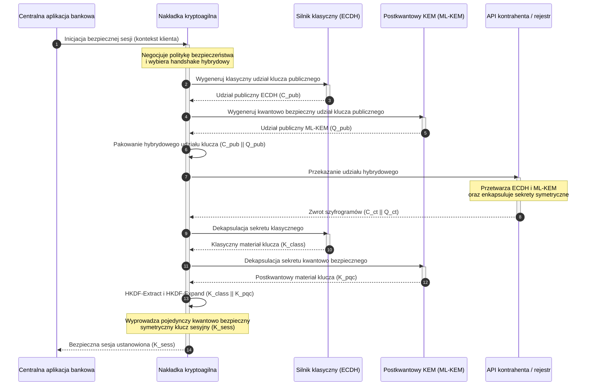

# KyberLib i migracja postkwantowa banków w 2026: od standardów do kodu

<!-- lead-start: manual -->
<aside class="post-lead" aria-label="Podsumowanie artykułu">

<strong>W skrócie.</strong> Infrastruktura bankowa w 2026 roku stoi wobec zagrożenia systemowego o znanym punkcie końcowym: obliczenia w skali kwantowej złamią wymianę kluczy RSA i ECC, która chroni dzisiejszy ruch w tranzycie. Standardy federalne i dokumenty nadzorcze podniosły świadomość; wykonanie techniczne pozostaje zamknięte w silosach. <a href="https://github.com/sebastienrousseau/kyberlib">KyberLib</a> to open source'owy plan inżynierski, który przenosi narrację postkwantową do konkretnego, bezpiecznego pamięciowo kodu Rust — implementując ustandaryzowany przez NIST ML-KEM (FIPS 203) za kryptoagilnymi granicami abstrakcji, tak aby instytucje mogły zmodernizować bezpieczeństwo transportu i enkapsulację kluczy, zanim ataki „Store Now, Decrypt Later" dosięgną ich archiwów.

<strong>Wnioski kluczowe</strong>

<ul class="post-lead-takeaways">
  <li><strong>Od polityki do kodu możliwego do inspekcji.</strong> KyberLib przenosi kryptografię postkwantową z abstrakcyjnych map drogowych do konkretnych, wydajnych, audytowalnych implementacji w Rust.</li>
  <li><strong>Ustandaryzowane wykonanie ML-KEM zgodne z FIPS 203.</strong> Biblioteka implementuje ML-KEM — algorytm ustanawiania kluczy sfinalizowany w NIST FIPS 203 — utrzymując zgodność z globalnymi oczekiwaniami regulacyjnymi.</li>
  <li><strong>Kryptoagilność z założenia.</strong> Stabilne granice abstrakcji pozwalają aplikacjom bankowym wymieniać prymitywy kryptograficzne bez kosztownych, podatnych na błędy przeróbek aplikacji.</li>
  <li><strong>Bezpieczeństwo pamięci dzięki Rust.</strong> Reguły własności egzekwowane w czasie kompilacji eliminują przepełnienia bufora i wycieki pamięci, które nękają dziedziczne biblioteki kryptograficzne oparte na C — przy szybkości abstrakcji o zerowym koszcie.</li>
  <li><strong>Ograniczenie odpowiedzialności powierniczej.</strong> Obserwowalne, testowalne dowody migracji dają dyrektorom zapis „rozsądnych kroków", jakiego wymagają audyty odpowiedzialności osobistej z art. 5 DORA.</li>
</ul>

<strong>Powiązane lektury:</strong> <a href="/2026-05-18-quantum-cryptography-standards-developments-2026/">Reset kryptografii kwantowej w 2026: standardy PQC, atestacja QKD i migracja, której banki nie mogą odkładać</a>, <a href="/2026-05-28-dora-ai-act-data-sovereignty-banking-compliance-stack-2026/">DORA, AI Act i suwerenność danych: stos zgodności banków w 2026</a>, <a href="/2026-05-20-cloud-native-banking-financial-institutions-2026/">Bankowość cloud-native w 2026</a>.

</aside>
<!-- lead-end -->

Migracja postkwantowa przestała być ćwiczeniem planistycznym. W 2026 roku jest aktywnym wymogiem operacyjnym, a luka między intencją regulacyjną a wykonaniem inżynierskim to miejsce, w którym siedzi dziś ryzyko. [KyberLib ⧉](https://github.com/sebastienrousseau/kyberlib "kyberlib") domyka część tej luki: zorientowana produkcyjnie, bezpieczna pamięciowo biblioteka Rust, która implementuje ML-KEM według finalnych parametrów FIPS 203 i opakowuje go w kryptoagilne granice, jakich naprawdę potrzebuje transakcyjny majątek banku.

---

> **Podsumowanie dla zarządu / Wnioski kluczowe**
>
> - **Zagrożenie jest już operacyjne.** Przeciwnicy prowadzą dziś zbieranie typu „Store Now, Decrypt Later"; poufność danych zawodzi retroaktywnie w dniu, w którym pojawi się kryptograficznie istotny komputer kwantowy.
> - **Standardy są finalne.** NIST FIPS 203 (ML-KEM) i FIPS 204 (ML-DSA) dają komitetom audytu jasny, testowalny punkt odniesienia — obrona „czekamy na standardy" już nie istnieje.
> - **KyberLib to plan inżynierski.** Bezpieczny pamięciowo Rust, kompilacja `no_std` dla HSM i kart inteligentnych oraz wzorce hybrydowego handshake'u zachowujące interoperacyjność klasyczną.
> - **Kryptoagilność jest celem trwałym.** Stabilne granice abstrakcji pozwalają zmieniać prymitywy bez przepisywania aplikacji — lekcja, która przetrwa każdy pojedynczy algorytm.
> - **Odpowiedzialność spoczywa na zarządach.** Art. 5 DORA nakłada na dyrektorów odpowiedzialność osobistą; możliwy do inspekcji, obserwowalny kod migracji jest dowodem, który ją zaspokaja.
>
---

## Dlaczego ten projekt open source ma znaczenie w 2026

W miarę jak kryptografia asymetryczna zbliża się do kresu użyteczności, zagrożenie nie czeka na zbudowanie kryptograficznie istotnego komputera kwantowego. Przeciwnicy już teraz prowadzą ataki typu **„Store Now, Decrypt Later" (SNDL)** — przechwytują zaszyfrowane strumienie tranzytowe transakcji bankowości korporacyjnej, tajemnic handlowych i komunikacji instytucjonalnej z zamiarem ich odszyfrowania, gdy zdolności kwantowe dojrzeją. Dla banku każdy klasyczny handshake przechodzący dziś przez sieć to naruszenie poufności z odroczoną datą detonacji.

Regulatorzy odpowiedzieli konkretnymi obowiązkami:

1. **Art. 6 DORA (zarządzanie ryzykiem ICT)** wymaga od instytucji mapowania, identyfikowania i ograniczania podatności w całym majątku kryptograficznym — łącznie z asymetryczną wymianą kluczy ukrytą w middleware, którego nikt nie zinwentaryzował.
2. **NIST FIPS 203 i 204** ustanawiają oficjalne standardy postkwantowe dla enkapsulacji kluczy (ML-KEM) i podpisów cyfrowych (ML-DSA), dając komitetom audytu ustandaryzowany punkt odniesienia, względem którego mierzy się postęp migracji.

Przeprowadzenie tej migracji bez zakłócania działających operacji wymaga wyjścia poza dokumenty polityki w stronę **możliwej do inspekcji, open source'owej infrastruktury kryptograficznej**. [KyberLib ⧉](https://github.com/sebastienrousseau/kyberlib "kyberlib") dostarcza dokładnie to: bezpieczną pamięciowo bibliotekę Rust zgodną z FIPS 203, która przekształca przejście postkwantowe w mierzalny, weryfikowalny potok inżynierski — i przesuwa rozmowę o inwestycjach technologicznych w stronę namacalnego zwrotu z odporności.

## Soczewka architektoniczna

KyberLib stoi za stabilnymi granicami API, izolując centralne aplikacje transakcyjne banku od zmian w niskopoziomowych prymitywach kryptograficznych.

| Warstwa | Decyzja projektowa | Dlaczego ma znaczenie | Ryzyko przy złym wykonaniu |
|---|---|---|---|
| **Prymityw** | Enkapsulacja kluczy ML-KEM zgodna z FIPS 203 | Zastępuje klasyczną wymianę kluczy Diffiego-Hellmana i RSA strukturami kratowymi | Brak zgodności z finalnymi parametrami FIPS 203, prowadzący do niezaliczonych audytów zgodności |
| **Język** | Bezpieczna pamięciowo implementacja w Rust | Eliminuje podatności korupcji pamięci (przepełnienia bufora, use-after-free) endemiczne dla C/C++ | Rozrost zależności podważający integralność łańcucha budowania |
| **Abstrakcja** | Stabilne kryptoagilne granice | Aplikacje wymieniają algorytmy za ujednoliconym interfejsem w miarę ewolucji standardów | Prymitywy wpisane na sztywno, wymuszające ręczne przepisywanie przy każdej przyszłej migracji |
| **Wdrożenie** | Hybrydowe handshake'i szyfrujące | Łączy postkwantowe KEM-y z algorytmami klasycznymi w podwójnie opakowanej kopercie | Utrata interoperacyjności z systemami dziedzicznymi lub cichy dryf konfiguracji |
| **Pewność** | Proweniencja SLSA Level 3 i testy możliwe do inspekcji | Gwarantuje źródło i pochodzenie kodu; przykłady można audytować linia po linii | Teatr bezpieczeństwa — biblioteki typu black box, których błędy implementacyjne ujawniają się dopiero w produkcji |

## Sygnały operacyjne do śledzenia

Wykazanie zgodności postkwantowej przed radami nadzorczymi i regulatorami oznacza śledzenie konkretnych, kwantyfikowalnych metryk:

| Sygnał | Metryka | Odniesienie regulacyjne | Implementacja platformowa |
|---|---|---|---|
| **Zgodność ML-KEM z FIPS 203** | 100% zgodności z finalnymi parametrami (ML-KEM-512/768/1024) | NIST FIPS 203 | Kryptografia kratowa z weryfikacją parametrów kompilowana w modułach KyberLib |
| **Inwentaryzacja kryptograficzna** | Kompletna inwentaryzacja użycia asymetrycznej wymiany kluczy we wszystkich systemach | NIST SP 1800-38 | Zautomatyzowane agenty skanujące, rejestrujące aktywne zestawy szyfrów w centralnym rejestrze |
| **Hybrydowa wymiana kluczy** | Odsetek handshake'ów warstwy transportowej wykonywanych w kopercie hybrydowej | DORA, art. 6 | Proxy sieciowe opakowujące klasyczne handshake'i TLS 1.3 w enkapsulację PQC |
| **Kompilacja `no_std`** | Zdolność kompilacji bez biblioteki standardowej Rust dla celów o ograniczonych zasobach | DORA, art. 30 | Warunkowa kompilacja `no_std` w KyberLib dla sprzętowych modułów bezpieczeństwa (HSM) |
| **Indeks kryptoagilności** | Czas w minutach potrzebny na wymianę prymitywu kryptograficznego w bramie API | UK PRA SS1/23 | Abstrakcyjne rejestry routingu zarządzające przydziałem algorytmów przez zmienne czasu wykonania |

## Dlaczego Rust ma znaczenie dla kryptografii postkwantowej

Implementacja algorytmów postkwantowych takich jak ML-KEM wymaga złożonych, niskopoziomowych operacji matematycznych na pierścieniach wielomianów. Historycznie uruchamianie tych operacji z produkcyjną prędkością oznaczało ręcznie pisany C/C++ lub asembler — dużą powierzchnię ataku dla korupcji pamięci, i to dokładnie w tym kodzie, w którym bank najmniej może sobie pozwolić na błąd.

Rust zmienia postawę bezpieczeństwa inżynierii kryptograficznej na trzy konkretne sposoby:

1. **Bezpieczeństwo pamięci w czasie kompilacji.** Model własności Rust gwarantuje, że przepełnienia bufora, podwójne zwolnienia pamięci i błędy use-after-free są blokowane już na etapie kompilacji. Ma to szczególne znaczenie dla bibliotek postkwantowych, w których rozmiary kluczy i szyfrogramów są znacząco większe niż w odpowiednikach klasycznych.
2. **Deterministyczne abstrakcje o zerowym koszcie.** Rust kompiluje się do natywnego kodu maszynowego bez garbage collectora, więc szybkość wykonania i zużycie pamięci dorównują bibliotekom opartym na C lub je przewyższają, przy zachowaniu bezpieczeństwa.
3. **Kompatybilność z `no_std`.** KyberLib kompiluje się bez biblioteki standardowej Rust, więc działa w ograniczonych środowiskach bare metal — w tym w sprzętowych modułach bezpieczeństwa (HSM) i kartach inteligentnych — utrzymując kryptografię klasy bankowej wewnątrz fizycznych granic bezpieczeństwa.

## Projektowanie architektury kryptoagilnej

Klasycznym trybem awarii migracji kryptograficznych jest wpisywanie na sztywno: założenia specyficzne dla algorytmu osadzone bezpośrednio w logice aplikacji, boleśnie odkrywane na nowo przy każdym przejściu. Trwałym celem na 2026 rok jest **kryptoagilność** — warstwa abstrakcji traktująca algorytmy jako wymienne moduły za stabilnym interfejsem, dzięki czemu kolejna migracja jest zmianą konfiguracji, a nie przepisywaniem całego majątku.

Poniższa sekwencja pokazuje, jak kryptoagilna nakładka KyberLib koordynuje hybrydowy (klasyczny plus postkwantowy) handshake wymiany kluczy:

Koperta hybrydowa to detal istotny operacyjnie. Dopóki prymitywy postkwantowe nie zgromadzą lat produkcyjnego sprawdzenia, klucz sesyjny wyprowadza się zarówno z sekretu klasycznego, jak i postkwantowego: atakujący musi złamać ECDH **i** ML-KEM, aby odzyskać kanał. Kontrahenci, którzy jeszcze nie przeszli migracji, nadal działają; ci, którzy ją przeszli, natychmiast zyskują ochronę opartą na kratach.

## Podręcznik dla zarządu

Bezpieczeństwo postkwantowe nie jest zapleczowym problemem szyfrowania; to kwestia nadzoru korporacyjnego z osobistą stawką. Kadra zarządzająca powinna ujmować migrację przez pryzmat odpowiedzialności powierniczej:

- **Art. 5 DORA (zarządzanie i organizacja)** nakłada na zarząd osobistą odpowiedzialność za bezpieczeństwo ICT. Open source'owe, obserwowalne testy to bezpośredni dowód, o który pyta audyt odpowiedzialności osobistej — „wybraliśmy możliwą do inspekcji implementację FIPS 203 i oto jej przebiegi zgodności" jest odpowiedzią dającą się obronić; „nasz dostawca nas zapewnił" nie jest.
- **Zarządzanie ryzykiem modeli (amerykański Fed SR 11-7 / brytyjska PRA SS1/23)** dotyczy architektur nakładek kryptograficznych w tym samym stopniu co modeli wyceny. Warstwy abstrakcji powinny przechodzić walidację MRM, łącznie z wydajnością w skrajnych scenariuszach zakłóceń.
- **Kapitał na ryzyko operacyjne Basel III** premiuje wykazaną dojrzałość kontroli. Przetestowane hybrydowe handshake'i obniżają długoterminowy profil ryzyka operacyjnego instytucji, redukując premię kapitałową i uwalniając pojemność bilansu dla aktywnego zarządzania skarbem.

## Co to oznacza dla poszczególnych typów banków

### Globalne banki o znaczeniu systemowym (G-SIB)

G-SIB-y prowadzą transakcyjne majątki obciążone systemami dziedzicznymi, więc ich wiążącym ograniczeniem jest odkrywanie: wiedza o tym, gdzie faktycznie zachodzi asymetryczna wymiana kluczy. Pierwszeństwo mają ciągłe inwentaryzacje kryptograficzne według wytycznych NIST SP 1800-38; KyberLib dostarcza następnie ustandaryzowaną, bezpieczną pamięciowo bibliotekę do wykonywania postkwantowej enkapsulacji kluczy w każdym nowoczesnym węźle, który inwentaryzacja ujawni.

### Banki transakcyjne i korporacyjne

Poufność na szynach płatniczych to istota franczyzy. Ponieważ KyberLib kompiluje się do celów bare metal `no_std`, banki transakcyjne mogą wdrażać postkwantowe handshake'i bezpośrednio w brzegowym sprzęcie routingu płatności i zarządzania płynnością — a nie tylko w warstwie aplikacyjnej.

### Banki regionalne i mniejsze

Instytucje regionalne mierzą się z tym samym sponsorowanym przez państwa zbieraniem danych, nie dysponując budżetami badawczymi G-SIB-ów. Możliwa do inspekcji, open source'owa implementacja w Rust daje im natychmiastową, gotową ścieżkę do zgodności z NIST FIPS 203, bez negocjowania map drogowych dostawców typu black box.

## Od map drogowych do kompilującego się kodu

Przejście postkwantowe jest aktywnym zadaniem inżynierskim, a instytucje, które zachowają zaufanie nadzorców, kontrahentów i skarbników korporacyjnych w 2026 roku, to te, które przejdą od abstrakcyjnych map drogowych do obserwowalnego, kompilującego się kodu. Mandat dla kierownictwa wynika z tego wprost: zinwentaryzować dziedziczne punkty wymiany kluczy, wdrożyć hybrydowe handshake'i na kanałach o najwyższej wartości i zbudować stabilne granice abstrakcji, dzięki którym każda przyszła wymiana prymitywu staje się rutyną. KyberLib czyni każdy z tych kroków mierzalną zdolnością operacyjną, a nie zobowiązaniem z prezentacji.

## Najczęściej zadawane pytania

**Czy KyberLib jest zgodny z finalnymi standardami NIST?**

Tak. KyberLib jest zaprojektowany wokół parametrów ML-KEM sfinalizowanych w FIPS 203, dzięki czemu skompilowana biblioteka pozostaje zgodna z federalnymi i globalnymi oczekiwaniami regulacyjnymi.

**Czy biblioteka postkwantowa wymaga specjalistycznego sprzętu?**

Nie. Implementacja KyberLib w Rust kompiluje się na standardowe architektury systemowe. Zdolność `no_std` dodatkowo pozwala jej działać na specjalistycznych sprzętowych modułach bezpieczeństwa (HSM) i kartach inteligentnych tam, gdzie wymagana jest fizyczna kustodia kluczy.

**Jak „Store Now, Decrypt Later" wpływa na bieżącą zgodność?**

Jeśli warstwa transportowa opiera się na klasycznym RSA lub ECC, przeciwnicy mogą przechwytywać ruch już dziś i odszyfrować go, gdy zdolności kwantowe dojrzeją. Hybrydowa wymiana kluczy wdrożona teraz utrzymuje przechwycone dane za ochroną opartą na kratach.

**Dlaczego hybrydowe handshake'i zamiast bezpośredniego przejścia na prymitywy postkwantowe?**

Koperty hybrydowe wyprowadzają klucz sesyjny zarówno z sekretu klasycznego, jak i postkwantowego, więc bezpieczeństwo utrzymuje się, dopóki oba nie zostaną złamane. To zachowuje interoperacyjność z kontrahentami, którzy nie przeszli migracji, podczas gdy nowe prymitywy gromadzą produkcyjne sprawdzenie.

## Bibliografia

- National Institute of Standards and Technology, (2024). [FIPS 203: Module-Lattice-Based Key-Encapsulation Mechanism Standard ⧉](https://www.nist.gov/news-events/news/2024/08/nist-releases-first-3-finalized-post-quantum-encryption-standards "Komunikat NIST o FIPS 203").
- Board of Governors of the Federal Reserve System, (2011). [Supervisory Guidance on Model Risk Management (SR Letter 11-7) ⧉](https://www.federalreserve.gov/supervisionreg/srletters/sr1107.htm "Federal Reserve SR 11-7").
- Parlament Europejski i Rada Unii Europejskiej, (2022). [Rozporządzenie (UE) 2022/2554 w sprawie operacyjnej odporności cyfrowej sektora finansowego (DORA) ⧉](https://eur-lex.europa.eu/legal-content/EN/TXT/?uri=CELEX%3A32022R2554 "Rozporządzenie DORA").
- NIST National Cybersecurity Center of Excellence, (2025). [Migration to Post-Quantum Cryptography (NIST SP 1800-38) ⧉](https://www.nccoe.nist.gov/projects/migration-post-quantum-cryptography "NIST SP 1800-38").
- GitHub, (2026). [Repozytorium open source kyberlib ⧉](https://github.com/sebastienrousseau/kyberlib "Repozytorium kyberlib").

<!-- enrich-start -->
<aside class="author-card" aria-label="O autorze"><strong class="author-card-name"><a href="/about/index.html">Sebastien Rousseau</a></strong>Senior banking technologist piszący o stosowanej AI, infrastrukturze płatniczej, pieniądzu tokenizowanym, ISO 20022, bezpieczeństwie post-kwantowym, cloud-native usługach finansowych i regulowanych rynkach cyfrowych.Ponad 20 lat doświadczenia w HSBC Commercial &amp; Investment Bank, PayPal, Barclays, Shazam, AKQA, Virgin Group. <a href="/about/index.html">Pełny profil</a> &middot; <a href="https://www.linkedin.com/in/sebastienrousseau/" rel="external noopener">LinkedIn</a> &middot; <a href="https://github.com/sebastienrousseau" rel="external noopener">GitHub</a></aside>

Ostatnia weryfikacja <time datetime="2026-06-12">2026-06-12</time>.

<!-- enrich-end -->
