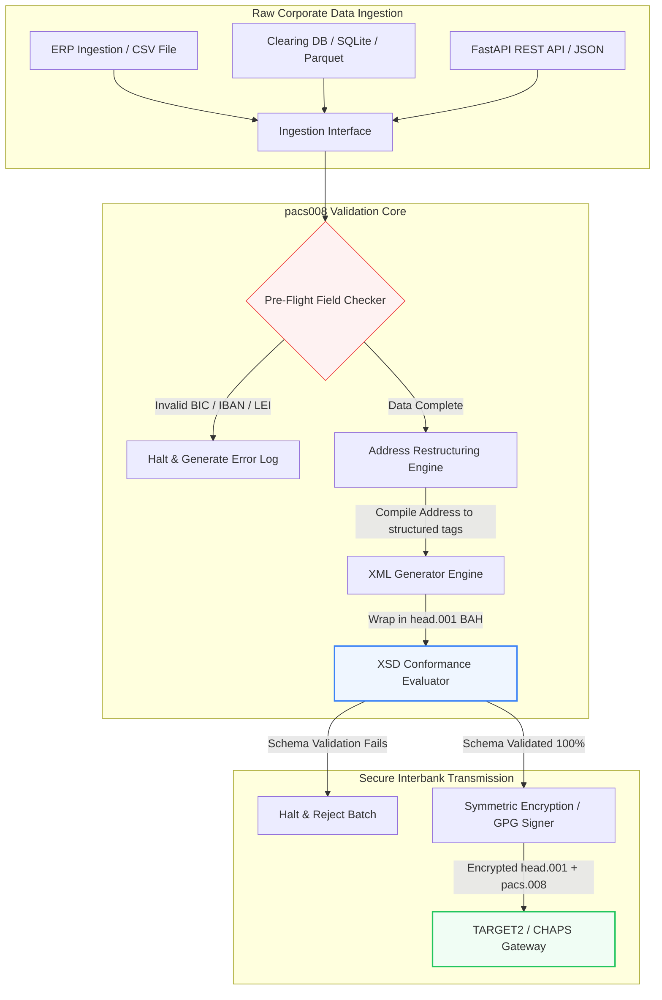

---

# Front Matter (YAML)

author: "contact@sebastienrousseau.com (Sebastien Rousseau)"
banner_alt: "Pracownik biurowy z asystentem głosowym i laptopem — symbol ustrukturyzowanych, czytelnych maszynowo komunikatów płatności międzybankowych, które automatyzacja pacs.008 czyni programowalnymi"
banner_height: "1597"
banner_width: "2584"
banner: "https://cloudcdn.pro/stocks/images/tyler-prahm-lmV3gJSAgbo.webp"
cdn: "https://cloudcdn.pro"
charset: "UTF-8"
cname: "sebastienrousseau.com"
copyright: "© Copyright 2025 - 2026 - Sebastien Rousseau. All rights reserved."
date: "June 15, 2026"
description: "pacs008 to biblioteka Python open source automatyzująca generowanie i walidację komunikatów ISO 20022 pacs.008 FI-to-FI — adresy ustrukturyzowane, koperty BAH head.001, sumy kontrolne BIC/LEI/IBAN, śledzenie UETR przez OpenTelemetry — gotowa na cutover SWIFT listopad 2026."
format-detection: "telephone=no"
hreflang: "pl"
icon: "https://cloudcdn.pro/clients/sebastienrousseau/v1/logos/sebastienrousseau.svg"
id: "https://sebastienrousseau.com/2026-06-15-pacs008-automation-iso-20022-interbank-payments-2026"
image_alt: "Czarno-biały portret Sebastiena Rousseau"
image_height: "162"
image_width: "162"
image: "https://cloudcdn.pro/stocks/images/sebastien-rousseau.png"
keywords: "pacs008, ISO 20022 pacs.008, FI to FI przelew kredytowy klienta, adres ustrukturyzowany, SWIFT CBPR+, BAH head.001, TARGET2, CHAPS, Fedwire, DORA, BCBS 239, Basel III, UETR, walidacja LEI, SEPA VoP"
language: "pl-PL"
last_reviewed: "2026-06-15"
layout: "report"
locale: "pl_PL"
logo_alt: "Logo Sebastiena Rousseau"
logo_height: "44"
logo_width: "44"
logo: "https://cloudcdn.pro/clients/sebastienrousseau/v1/logos/sebastienrousseau.svg"
menu: ""
measurementID: "G-169G4ET5HQ"
name: "Sebastien Rousseau"
permalink: "https://sebastienrousseau.com/2026-06-15-pacs008-automation-iso-20022-interbank-payments-2026"
rating: "general"
referrer: "no-referrer"
robots: "index, follow"
schema: "FAQPage, Article"
seo_title: "Automatyzacja pacs.008 dla ery ISO 20022"
short_name: "sebastienrousseau"
subtitle: "Komunikat pacs.008 jest miejscem, w którym spotykają się dane płatności międzybankowych, adresy ustrukturyzowane, zgodność, routing i operacje rozliczeniowe."
tags: "pacs008, ISO 20022, płatności międzybankowe, płatności wysokokwotowe, Python"
theme-color: "0, 83, 191"
title: "Budowa automatyzacji pacs.008 dla ery ISO 20022 płatności międzybankowych w 2026"
url: "https://sebastienrousseau.com/2026-06-15-pacs008-automation-iso-20022-interbank-payments-2026"
viewport: "width=device-width, initial-scale=1, shrink-to-fit=no"

# RSS - The RSS feed front matter (YAML).
atom_link: "https://sebastienrousseau.com/2026-06-15-pacs008-automation-iso-20022-interbank-payments-2026/rss.xml"
category: "Finance"
docs: https://validator.w3.org/feed/docs/rss2.html
generator: "Static Site Generator (SSG) (version 0.0.26)"
item_description: "pacs008 dostarcza fundament Python open source do automatyzacji komunikatów ISO 20022 FI-to-FI przelewu kredytowego klienta w erze płatności międzybankowych."
item_guid: "https://sebastienrousseau.com/2026-06-15-pacs008-automation-iso-20022-interbank-payments-2026/rss.xml"
item_link: "https://sebastienrousseau.com/2026-06-15-pacs008-automation-iso-20022-interbank-payments-2026/rss.xml"
item_pub_date: "Mon, 15 Jun 2026 06:06:06 +0000"
item_title: "Budowa automatyzacji pacs.008 dla ery ISO 20022 płatności międzybankowych w 2026"
last_build_date: "Mon, 15 Jun 2026 06:06:06 +0000"
managing_editor: "contact@sebastienrousseau.com (Sebastien Rousseau)"
pub_date: "Mon, 15 Jun 2026 06:06:06 +0000"
ttl: "60"
type: "article"
webmaster: "contact@sebastienrousseau.com"

# Apple - The Apple front matter (YAML).
apple_mobile_web_app_orientations: "portrait"
apple_touch_icon_sizes: "192x192"
apple-mobile-web-app-capable: "yes"
apple-mobile-web-app-status-bar-inset: "black"
apple-mobile-web-app-status-bar-style: "black-translucent"
apple-mobile-web-app-title: "Automatyzacja pacs.008 ISO 20022"
apple-touch-fullscreen: "yes"

# MS Application - The MS Application front matter (YAML).

msapplication-navbutton-color: "0, 83, 191"

# Twitter Card - The Twitter Card front matter (YAML).

twitter_card: "summary_large_image"
twitter_creator: "@wwdseb"
twitter_description: "pacs008 dostarcza fundament Python open source do automatyzacji komunikatów ISO 20022 FI-to-FI przelewu kredytowego klienta w erze płatności międzybankowych."
twitter_image: "https://cloudcdn.pro/clients/sebastienrousseau/v1/logos/sebastienrousseau.svg"
twitter_image_alt: "Logo Sebastiena Rousseau"
twitter_site: "@wwdseb"
twitter_title: "Automatyzacja pacs.008 dla ery ISO 20022"
twitter_url: "https://sebastienrousseau.com/2026-06-15-pacs008-automation-iso-20022-interbank-payments-2026"

excerpt: "pacs008 to zestaw narzędzi Python open source, który czyni komunikaty ISO 20022 FI-to-FI przelewu kredytowego klienta programowalnymi — adresy ustrukturyzowane, walidacja, routing, hooki zgodności i termin SWIFT z listopada 2026 wbudowane jako domyślne."

# Humans.txt - The Humans.txt front matter (YAML).
author_website: "https://sebastienrousseau.com"
author_twitter: "@wwdseb"
author_location: "London, UK"
thanks: "Dziękuję za lekturę!"
site_last_updated: "2026-06-15"
site_standards: "HTML5, CSS3, RSS, Atom, JSON, XML, YAML, Markdown, TOML"
site_components: "Kaishi, Kaishi Builder, Kaishi CLI, Kaishi Templates, Kaishi Themes"
site_software: "Static Site Generator, Rust"

---

# Automatyzacja płatności międzybankowych ISO 20022 pacs.008 z open source Python w 2026

<!-- lead-start -->
<aside class="post-lead" aria-label="Streszczenie artykułu">

<strong>W skrócie.</strong> Zgodnie z wytycznymi SWIFT CBPR+, klif adresów ustrukturyzowanych z 14 listopada 2026 wycofuje adresy pocztowe nieustrukturyzowane w TARGET2, CHAPS, Fedwire, Lynx i SEPA. pacs008 to biblioteka Python open source, która automatyzuje generowanie i walidację komunikatów ISO 20022 FI-to-FI przelewu kredytowego klienta (pacs.008), opakowuje płatności w Business Application Headers (BAH head.001) i wpisuje zgodność adresu ustrukturyzowanego w ścieżkę danych, zanim komunikat dotknie sieci rozliczeniowej.

<strong>Wnioski kluczowe</strong>

<ul class="post-lead-takeaways">
  <li><strong>Termin adresu ustrukturyzowanego jest absolutny.</strong> Po 14 listopada 2026 bloki adresów nieustrukturyzowanych zostają wycofane. pacs008 wymusza ustrukturyzowane elementy adresu pocztowego (<code>&lt;TwnNm&gt;</code>, <code>&lt;Ctry&gt;</code>, <code>&lt;PstCd&gt;</code>) na etapie kompilacji danych, aby zapobiec odrzutom na granicy sieci.</li>
  <li><strong>Zunifikowana orkiestracja komunikatu.</strong> Opakowuje rdzeniowy payload płatności pacs.008 w zgodną kopertę Business Application Header (head.001), zapewniając standardowy model przetwarzania round-trip.</li>
  <li><strong>Integralność algorytmiczna.</strong> Wbudowane walidatory BIC i Legal Entity Identifiers (LEI) korzystające z obliczeń sum kontrolnych ISO 7064 Modulo 97-10.</li>
  <li><strong>Śledzenie klasy DORA.</strong> Pełna instrumentacja OpenTelemetry oparta na Unique End-to-End Transaction Reference (UETR) dla logów audytowych w czasie rzeczywistym i kryptograficznych podpisów audytowych.</li>
  <li><strong>Ochrona obowiązków fiducjarnych na poziomie zarządu.</strong> Łączy dokładność komunikatów międzybankowych z artykułem 5 DORA, raportowaniem BCBS 239 i oszczędnościami kapitału w ryzyku operacyjnym Basel III.</li>
</ul>

<strong>Powiązane lektury:</strong> <a href="https://sebastienrousseau.com/2026-05-19-global-wholesale-payments-economics-2026">Globalne płatności wysokokwotowe w 2026: ISO 20022, odnowa RTGS i ekonomika interoperacyjności</a>, <a href="https://sebastienrousseau.com/2026-05-27-ai-operating-system-payments-fraud-routing-resilience-compliance-2026">AI jako system operacyjny płatności: fraud, routing, odporność i zgodność w 2026</a>, <a href="https://sebastienrousseau.com/2026-05-12-iso-20022-pacs008-structured-address-deadline">Termin adresu ustrukturyzowanego pacs.008 z listopada 2026: spojrzenie na sześć miesięcy</a>.

</aside>
<!-- lead-end -->

Pomost między danymi finansowymi z systemów legacy a ustrukturyzowanym komunikatem międzybankowym, zbudowany jako audytowalny pipeline Python z walidacją schematu.

Otwartoźródłowym punktem odniesienia dla tego artykułu jest [pacs008 ⧉](https://github.com/sebastienrousseau/pacs008 "pacs008 — biblioteka Python open source"). Repozytorium pozycjonowane jest jako biblioteka Python automatyzująca komunikaty XML ISO 20022 pacs.008 FI-to-FI przelewu kredytowego klienta.

## Dlaczego ten projekt open source ma znaczenie w 2026

Globalna infrastruktura rozliczeniowa płatności międzybankowych przechodzi najgłębszą modernizację od niemal pół wieku.

W czerwcu 2026 sektor usług finansowych szybko zbliża się do **klifu adresów ustrukturyzowanych SWIFT z 14 listopada 2026**. Od tej daty wytyczne SWIFT CBPR+, wraz z TARGET2, CHAPS, Fedwire i kanadyjskim Lynx, formalnie wycofują nieustrukturyzowane linie adresu pocztowego (czyli wyłącznie `<AdrLine>` wewnątrz bloków `<PstlAdr>`). Wszystkie uczestniczące instytucje finansowe muszą przekazywać adresy w formacie hybrydowym (ustrukturyzowane `<TwnNm>` i `<Ctry>`, maksymalnie dwa elementy `<AdrLine>` na pozostałe dane) lub w pełni ustrukturyzowanym (osobne elementy dla nazwy ulicy, numeru budynku i kodu pocztowego). Każdy komunikat niespełniający tego kryterium zostanie odrzucony na granicy sieci.

Dla instytucji finansowych to przejście tworzy poważne ograniczenia operacyjne:

1. **Kara odrzutu granicznego.** Płatności niespełniające kryteriów adresu ustrukturyzowanego będą natychmiast odrzucane przez sieć, wywołując opóźnienia transakcyjne, blokady płynności i zaległości operacyjne.
2. **SEPA Verification of Payee (VoP).** Wymaga, aby wszyscy dostawcy usług płatniczych (PSP) wewnątrz strefy SEPA weryfikowali zgodność nazwy beneficjenta z IBAN przed wykonaniem przelewu kredytowego, dodając kolejną bramę walidacji do inicjacji komunikatu.

[pacs008](https://github.com/sebastienrousseau/pacs008) rozwiązuje ten problem. Jest lekką biblioteką Python open source, która automatyzuje konwersję surowych danych finansowych w pełni zwalidowane, zgodne ze schematem komunikaty ISO 20022 pacs.008 przelewu kredytowego klienta w obrocie międzybankowym. Łącząc lukę między danymi legacy a ustrukturyzowanymi, pacs008 dostarcza wysoki Return on Resilience (RoR), chroniąc kapitał obrotowy i zabezpieczając wykonanie w czasie rzeczywistym na rachach globalnych.

## Soczewka architektoniczna pacs008 w 2026

Biblioteka pacs008 jest skonstruowana jako odizolowany silnik walidacji i generowania, zapewniający, że surowe wejścia są systematycznie parsowane, wzbogacane i opakowywane w standardowe koperty:

| Warstwa | Decyzja projektowa | Dlaczego ma znaczenie | Ryzyko przy złym wykonaniu |
|---|---|---|---|
| **Warstwa wejścia** | Ingest CSV, JSON, SQLite i Parquet | Wychodzi naprzeciw zespołom integracji bankowej tam, gdzie ich dane już są, eliminując migracje platformowe. | Ingest surowych, niezwalidowanych lub uszkodzonych payloadów. |
| **Warstwa walidacji** | Walidacja pre-flight wobec oficjalnych schematów XSD i niestandardowych reguł biznesowych | Zatrzymuje wykonanie i flaguje błędy zanim plik płatności trafi do sieci rozliczeniowej. | Nieprawidłowe pliki XML wywołujące natychmiastowe odrzuty sieciowe i opóźnienia rozliczenia. |
| **Warstwa koperty BAH** | Automatyczne opakowanie w Business Application Header (head.001) | Standaryzuje dyspozycję i routing komunikatu na podstawie tagu `<MsgDefIdr>`. | Przekazywanie surowych payloadów pacs.008 bez wymaganej koperty zewnętrznej, powodujące odrzut systemu. |
| **Warstwa serializacji** | Standardowe XML i JSON zgodne z ISO (TS 23029) | Umożliwia bezpośrednią translację między payloadami XML i JSON, wspierając nowoczesne REST API i streaming Kafka. | Fragmentaryczne reprezentacje danych naruszające oficjalne wytyczne ISO. |
| **Warstwa obserwowalności** | Śledzenie OpenTelemetry oparte na UETR | Rejestruje szczegółowe ścieżki wykonania i logi, zapewniając audytowalność w czasie rzeczywistym. | Luki w śledzeniu blokujące widoczność operacyjną i audyt. |

## Kluczowe sygnały międzybankowe i kamienie milowe regulacyjne

Aby wykazać odporność operacyjną transakcji, kierownictwo technologii i ryzyka musi śledzić konkretne, mierzalne wskaźniki zgodności:

| Sygnał | Metryka / benchmark operacyjny | Odniesienie G20 / SWIFT / DORA | Implementacja na platformie technicznej |
|---|---|---|---|
| **Zgodność adresu ustrukturyzowanego** | % komunikatów pacs.008 wykorzystujących w pełni ustrukturyzowane pola `<PstlAdr>` z dedykowanymi `<TwnNm>` i `<Ctry>`. | Termin SWIFT SR 2026 | Pre-flight checks schematu w pacs008 odrzucające nieustrukturyzowane linie adresu. |
| **SEPA Verification of Payee** | Walidacja zgodności nazwy beneficjenta z IBAN przed wykonaniem komunikatu. | Regulacja SEPA VoP | Wbudowane klasy pomocnicze VoP wykonujące zapytania pre-walidacji na IBAN/BIC. |
| **Integracja BAH head.001** | Procent wychodzących payloadów płatności pomyślnie opakowanych w Business Application Headers. | Wytyczne TARGET2 / CBPR+ | Podsystem opakowywania BAH automatycznie kompilujący zewnętrzną kopertę XML. |
| **Suma kontrolna LEI Modulo** | Walidacja cyfry kontrolnej ISO 7064 Modulo 97-10 na blokach `<LEI>` dłużnika i wierzyciela. | Mandat Bank of England | Algorytmiczny weryfikator integralności 20-znakowego identyfikatora. |
| **Dokładność śledzenia UETR** | 100% generowanych płatności wstrzykniętych ważnym Unique End-to-End Transaction Reference. | Specyfikacje SWIFT UETR | Automatyczne generowanie i śledzenie 36-znakowego kodu referencyjnego UUIDv4. |

## Dlaczego Python jest idealną rampą wjazdową dla automatyzacji międzybankowej

Nowoczesne huby płatnicze i zespoły operacji skarbu w 2026 polegają mocno na Pythonie do transformacji danych, modelowania finansowego i integracji baz danych ERP.

Wykorzystując bibliotekę Python open source, instytucje uzyskują istotne korzyści:

1. **Niski koszt poznawczy i wysoka interoperacyjność.** Python działa jako spójny pomost. Pozwala programistom pisać proste skrypty, które pobierają surowe instrukcje płatnicze z baz legacy, walidują je wobec złożonych międzynarodowych reguł bankowych i wytwarzają zgodny XML w jednym, zunifikowanym przepływie.
2. **Eliminacja nieprzejrzystych translatorów typu „czarna skrzynka”.** Zastrzeżone portale bankowe często pobierają wysokie opłaty licencyjne za niestandardowe translatory plików płatniczych. Te translatory są nieprzejrzystymi czarnymi skrzynkami, uniemożliwiającymi zespołom bezpieczeństwa audyt sposobu przetwarzania danych czy miejsca przechowywania kluczy. Biblioteka open source poddająca się inspekcji, taka jak pacs008, zapewnia pełną transparentność kodu.
3. **Bezszwowa integracja CI/CD.** pacs008 integruje się bezpośrednio z pipeline'ami ciągłej integracji i wdrożenia, pozwalając programistom automatyzować testowanie plików płatniczych w ramach standardowego cyklu dostawy oprogramowania.

## Projektowanie ograniczonego pipeline'u międzybankowego

Główną podatnością w rozliczeniach międzybankowych jest „niekontrolowane generowanie wsadowe” — wytwarzanie plików bez jasnej, ograniczonej pętli weryfikacji. pacs008 zaprojektowano tak, aby działał jako rdzeniowy silnik walidacji wewnątrz ściśle kontrolowanego, wieloetapowego pipeline'u transakcyjnego.

Poniższy przepływ operacyjny pokazuje, jak surowe dane transakcyjne przechodzą przez pipeline pacs008, aby wygenerować kryptograficznie zabezpieczony, zgodny ze schematem plik pacs.008 opakowany w kopertę BAH:

## Podręcznik dla zarządu i odpowiedzialność fiducjarna

Automatyzacja płatności międzybankowych to kwestia zarządzania ryzykiem i ładu korporacyjnego na poziomie zarządu. Kierownictwo musi traktować jakość danych transakcyjnych przez pryzmat odpowiedzialności fiducjarnej i redukcji ryzyka operacyjnego:

- **Artykuł 5 DORA (Odpowiedzialność zarządu).** Nakłada bezpośrednią, osobistą odpowiedzialność na członków zarządu za odporność i bezpieczeństwo operacji ICT instytucji. Ponieważ rozliczenie międzybankowe jest krytyczną funkcją korporacyjną, zarządy muszą wykazać, że wdrożyły solidne, zwalidowane i zautomatyzowane kontrole transakcyjne zapobiegające zakłóceniom operacyjnym lub opóźnionym płatnościom.
- **BCBS 239 (Agregacja i raportowanie danych o ryzyku).** Wymaga, aby raportowanie transakcji finansowych było dokładne, kompletne i generowane w czasie rzeczywistym. pacs008 wspiera instytucje w spełnieniu BCBS 239, zapewniając, że dane płatnicze są czysto ustrukturyzowane i walidowane u źródła, eliminując luki danych i błędy ręcznych uzgodnień, które trapią arkusze kalkulacyjne z systemów legacy.
- **Łagodzenie obciążeń kapitałowych ryzyka operacyjnego (Basel III).** Zgodnie z wytycznymi Basel III, wysokie wskaźniki błędów płatniczych i narzut interwencji ręcznych zwiększają wymogi kapitałowe ryzyka operacyjnego banku, blokując kapitał, który mógłby zostać wdrożony do kredytowania lub inwestycji. Automatyzacja pipeline'u płatniczego bezpośrednio minimalizuje te premie kapitałowe, chroniąc wartość bilansu.

## Co to oznacza dla poszczególnych typów banków

### Globalne banki o znaczeniu systemowym (G-SIBs)

G-SIBs zarządzają ogromnymi, transgranicznymi wolumenami transakcji korporacyjnych. Ich głównym wyzwaniem jest remediacja nieustrukturyzowanych danych legacy zanim trafią one do sieci rozliczeniowej. Integrując pacs008 w swoich gateway'ach bankowości korporacyjnej, G-SIBs mogą dostarczać klientom korporacyjnym zautomatyzowane narzędzia walidacji, redukując narzut ręcznych napraw płatności i zabezpieczając wykonanie w czasie rzeczywistym w sieci SWIFT.

### Banki transakcyjne i korporacyjne

Dla banków transakcyjnych jakość danych płatniczych to wyróżnik konkurencyjny. Oferując klientom skarbu korporacyjnego inspekcjonowalne narzędzie walidacji open source, takie jak pacs008, banki te mogą przyspieszyć onboarding, zminimalizować odrzuty plików płatniczych i budować zaufanie klienta poprzez wyższe wskaźniki straight-through processing.

### Banki regionalne i mniejsze

Banki regionalne muszą utrzymać zgodność z międzynarodowymi standardami płatności bez ogromnych budżetów technologicznych G-SIBs. pacs008 dostarcza lekkie, ekonomiczne i w pełni zgodne rozwiązanie oparte na Pythonie, umożliwiając mniejszym instytucjom oferowanie nowoczesnych, ustrukturyzowanych zdolności inicjacji płatności bez kosztownych licencji na zastrzeżony middleware.

## Wnioski: mapa drogowa rozliczeń międzybankowych

Nadchodzący termin SWIFT z listopada 2026 dotyczący adresu ustrukturyzowanego stanowi twardą granicę dla operacji skarbu korporacyjnego. Poleganie na arkuszach kalkulacyjnych z systemów legacy, ręcznym wprowadzaniu danych i nieustrukturyzowanych plikach płatniczych to aktywne ryzyko biznesowe.

Aby zabezpieczyć ciągłość transakcji i zminimalizować narzut operacyjny, kierownictwo technologii i finansów powinno wykonać dziś jasną mapę drogową rozliczeń:

1. **Wymuś walidację u źródła.** Wymagaj, aby wszystkie instrukcje płatnicze były walidowane i formatowane zgodnie z oficjalnymi schematami XSD ISO 20022 przed opuszczeniem granic ERP korporacyjnego.
2. **Audytuj pipeline danych.** Odejdź od ręcznego przetwarzania arkuszy kalkulacyjnych i wdroż zautomatyzowane, inspekcjonowalne przepływy oparte na Pythonie z użyciem pacs008.
3. **Wdroż hybrydowe bezpieczeństwo.** Zapewnij, że generowane pliki płatnicze są kryptograficznie podpisywane i szyfrowane przed transmisją, spełniając oczekiwania zero-trust sieci.
4. **Dopasuj do priorytetów fiducjarnych.** Formalnie raportuj metryki automatyzacji płatności i jakości danych zarządowi, ujmując inwestycję jako krytyczny program redukcji ryzyka operacyjnego w ramach DORA.

## Najczęściej zadawane pytania

**Czy pacs008 jest zgodny z nadchodzącymi regułami adresu SWIFT SR 2026?**

Tak. pacs008 jest zaprojektowany tak, aby wspierać ścisły kamień milowy SWIFT z listopada 2026 dotyczący adresu ustrukturyzowanego, wymuszając obowiązkową separację elementów adresu pocztowego (miasto, kraj, kod pocztowy) na dedykowane pola XML ISO 20022.

**Czy pacs008 może opakowywać payloady płatności w Business Application Headers?**

Tak. Ponieważ pacs008 natywnie wspiera opakowanie Business Application Header (BAH head.001), automatycznie kompiluje kopertę zewnętrzną wymaganą przez sieci TARGET2, CHAPS i CBPR+.

**Dlaczego biblioteka open source jest preferowana nad zastrzeżonymi translatorami plików?**

Zastrzeżone translatory są nieprzejrzystymi czarnymi skrzynkami, czyniąc audyty bezpieczeństwa niemożliwymi. Biblioteka open source, recenzowana przez społeczność, taka jak pacs008, oferuje pełną transparentność kodu, pozwalając zespołom bezpieczeństwa zweryfikować, że żadne wrażliwe dane płatnicze nie są ujawniane podczas przetwarzania.

**Jakie identyfikatory waliduje pacs008?**

pacs008 dostarczany jest z wbudowanymi walidatorami Bank Identifier Codes (BIC) i Legal Entity Identifiers (LEI) korzystającymi z obliczeń sum kontrolnych ISO 7064 Modulo 97-10, plus walidacja cyfry kontrolnej IBAN i sprawdzenia unikalności UETR.

## Bibliografia

- SWIFT, (2024). *Kamień milowy ISO 20022 listopad 2026 dotyczący adresu ustrukturyzowanego*. La Hulpe: SWIFT. Dostępne pod: [Kamień milowy ISO 20022 SWIFT ⧉](https://www.swift.com/standards/iso-20022/iso-20022-bytes/call-action-november-2026 "Kamień milowy ISO 20022 SWIFT").
- Basel Committee on Banking Supervision (BCBS), (2013). *Principles for effective risk data aggregation and risk reporting (BCBS 239)*. Basel: Bank for International Settlements. Dostępne pod: [Zasady BCBS 239 ⧉](https://www.bis.org/publ/bcbs239.htm "Zasady BCBS 239").
- European Parliament and Council of the European Union, (2022). *Regulation (EU) 2022/2554 on digital operational resilience for the financial sector (DORA)*. Brussels: Official Journal of the European Union. Dostępne pod: [Regulacja DORA ⧉](https://eur-lex.europa.eu/legal-content/EN/TXT/?uri=CELEX%3A32022R2554 "Regulacja DORA").
- GitHub, (2026). *Repozytorium open source pacs008*. Dostępne pod: [Repozytorium pacs008 ⧉](https://github.com/sebastienrousseau/pacs008 "Repozytorium pacs008").

<!-- enrich-start -->
<aside class="author-card" aria-label="O autorze"><strong class="author-card-name"><a href="/about/index.html">Sebastien Rousseau</a></strong>Senior banking technologist piszący o stosowanej AI, migracji ISO 20022, kryptografii post-kwantowej dla usług finansowych i strukturalnej transformacji płatności wysokokwotowych.Ponad 20 lat doświadczenia w HSBC Commercial &amp; Investment Bank, PayPal, Barclays, Shazam, AKQA, Virgin Group. <a href="/about/index.html">Pełny profil</a> &middot; <a href="https://www.linkedin.com/in/sebastienrousseau/" rel="external noopener">LinkedIn</a> &middot; <a href="https://github.com/sebastienrousseau" rel="external noopener">GitHub</a></aside>

Ostatnia weryfikacja <time datetime="2026-06-15">2026-06-15</time>.

<aside class="related-posts" aria-labelledby="related-heading">
<h2 id="related-heading" class="related-heading">Powiązane lektury</h2>

<article class="related-card"><footer class="related-body"><h3><a href="https://sebastienrousseau.com/2026-05-19-global-wholesale-payments-economics-2026">Globalne płatności wysokokwotowe w 2026: ISO 20022, odnowa RTGS i ekonomika interoperacyjności</a></h3>
<time datetime="2026-05-19">2026-05-19</time>
</footer></article>
<article class="related-card"><footer class="related-body"><h3><a href="https://sebastienrousseau.com/2026-05-27-ai-operating-system-payments-fraud-routing-resilience-compliance-2026">AI jako system operacyjny płatności: fraud, routing, odporność i zgodność w 2026</a></h3>
<time datetime="2026-05-27">2026-05-27</time>
</footer></article>
<article class="related-card"><footer class="related-body"><h3><a href="https://sebastienrousseau.com/2026-05-12-iso-20022-pacs008-structured-address-deadline">Termin adresu ustrukturyzowanego pacs.008 z listopada 2026: spojrzenie na sześć miesięcy</a></h3>
<time datetime="2026-05-12">2026-05-12</time>
</footer></article>

</aside>
<!-- enrich-end -->
