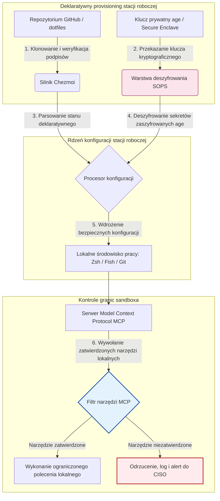

---

# Front Matter (YAML)

author: "contact@sebastienrousseau.com (Sebastien Rousseau)"
banner_alt: "Stacja robocza programisty w przyciemnionym świetle — symbolizująca świadome AI, odtwarzalne i bezpieczne dotfiles dla serwerów MCP, podpisów SLSA, sekretów age/SOPS oraz parytetu wielu powłok"
banner_height: "1597"
banner_width: "2584"
banner: "https://cloudcdn.pro/stocks/images/almas-salakhov-Vq2ap8aFFEs.webp"
cdn: "https://cloudcdn.pro"
charset: "UTF-8"
cname: "sebastienrousseau.com"
copyright: "© Copyright 2025 - 2026 - Sebastien Rousseau. All rights reserved."
date: "June 16, 2026"
description: "Dotfiles świadome AI to wzorzec bezpiecznej, odtwarzalnej stacji roboczej dla ery MCP — deklaratywna konfiguracja przez Chezmoi, sekrety SOPS/age, proweniencja SLSA Level 3, parytet wielu powłok i ograniczone granice sandboxa dla lokalnych agentów AI."
format-detection: "telephone=no"
hreflang: "pl"
icon: "https://cloudcdn.pro/clients/sebastienrousseau/v1/logos/sebastienrousseau.svg"
id: "https://sebastienrousseau.com/2026-06-16-ai-aware-dotfiles-secure-reproducible-workstation-2026"
image_alt: "Czarno-biały portret Sebastiena Rousseau"
image_height: "162"
image_width: "162"
image: "https://cloudcdn.pro/stocks/images/sebastien-rousseau.png"
keywords: "dotfiles, Chezmoi, MCP, Model Context Protocol, SLSA, SOPS, szyfrowanie age, konfiguracja deklaratywna, stacja robocza programisty, DORA art. 5, NIST CSF 2.0, bezpieczeństwo łańcucha dostaw, agentowa AI, parytet wielu powłok, Zsh, Fish, Nushell"
language: "pl-PL"
last_reviewed: "2026-06-16"
layout: "report"
locale: "pl_PL"
logo_alt: "Logo Sebastiena Rousseau"
logo_height: "44"
logo_width: "44"
logo: "https://cloudcdn.pro/clients/sebastienrousseau/v1/logos/sebastienrousseau.svg"
menu: ""
measurementID: "G-169G4ET5HQ"
name: "Sebastien Rousseau"
permalink: "https://sebastienrousseau.com/2026-06-16-ai-aware-dotfiles-secure-reproducible-workstation-2026"
rating: "general"
referrer: "no-referrer"
robots: "index, follow"
schema: "FAQPage, Article"
seo_title: "Dotfiles świadome AI dla bezpiecznej stacji roboczej"
short_name: "sebastienrousseau"
subtitle: "Stacja robocza programisty jest dziś częścią łańcucha dostaw AI; dotfiles wymagają bezpieczeństwa, odtwarzalności, higieny sekretów i workflow świadomych MCP."
tags: "dotfiles, narzędzia programisty, MCP, SLSA, bezpieczna stacja robocza, chezmoi, macOS, Linux, WSL"
theme-color: "0, 83, 191"
title: "Dotfiles świadome AI w 2026: bezpieczna, odtwarzalna stacja robocza programisty dla MCP, SLSA i parytetu wielu powłok"
url: "https://sebastienrousseau.com/2026-06-16-ai-aware-dotfiles-secure-reproducible-workstation-2026"
viewport: "width=device-width, initial-scale=1, shrink-to-fit=no"

# RSS - The RSS feed front matter (YAML).
atom_link: "https://sebastienrousseau.com/2026-06-16-ai-aware-dotfiles-secure-reproducible-workstation-2026/rss.xml"
category: "Technology"
docs: https://validator.w3.org/feed/docs/rss2.html
generator: "Static Site Generator (SSG) (version 0.0.26)"
item_description: "Spojrzenie na deklaratywne dotfiles dla bezpiecznych, odtwarzalnych stacji roboczych programisty w macOS, Linux i WSL — ze świadomością MCP, SLSA, age, SOPS i parytetem wielu powłok."
item_guid: "https://sebastienrousseau.com/2026-06-16-ai-aware-dotfiles-secure-reproducible-workstation-2026/rss.xml"
item_link: "https://sebastienrousseau.com/2026-06-16-ai-aware-dotfiles-secure-reproducible-workstation-2026/rss.xml"
item_pub_date: "Tue, 16 Jun 2026 06:06:06 +0000"
item_title: "Dotfiles świadome AI w 2026: bezpieczna, odtwarzalna stacja robocza programisty dla MCP, SLSA i parytetu wielu powłok"
last_build_date: "Tue, 16 Jun 2026 06:06:06 +0000"
managing_editor: "contact@sebastienrousseau.com (Sebastien Rousseau)"
pub_date: "Tue, 16 Jun 2026 06:06:06 +0000"
ttl: "60"
type: "article"
webmaster: "contact@sebastienrousseau.com"

# Apple - The Apple front matter (YAML).
apple_mobile_web_app_orientations: "portrait"
apple_touch_icon_sizes: "192x192"
apple-mobile-web-app-capable: "yes"
apple-mobile-web-app-status-bar-inset: "black"
apple-mobile-web-app-status-bar-style: "black-translucent"
apple-mobile-web-app-title: "Dotfiles świadome AI dla bezpiecznej stacji roboczej"
apple-touch-fullscreen: "yes"

# MS Application - The MS Application front matter (YAML).

msapplication-navbutton-color: "0, 83, 191"

# Twitter Card - The Twitter Card front matter (YAML).

twitter_card: "summary_large_image"
twitter_creator: "@wwdseb"
twitter_description: "Spojrzenie na deklaratywne dotfiles dla bezpiecznych, odtwarzalnych stacji roboczych programisty w macOS, Linux i WSL — ze świadomością MCP, SLSA, age, SOPS i parytetem wielu powłok."
twitter_image: "https://cloudcdn.pro/clients/sebastienrousseau/v1/logos/sebastienrousseau.svg"
twitter_image_alt: "Logo Sebastiena Rousseau"
twitter_site: "@wwdseb"
twitter_title: "Dotfiles świadome AI dla bezpiecznej stacji roboczej"
twitter_url: "https://sebastienrousseau.com/2026-06-16-ai-aware-dotfiles-secure-reproducible-workstation-2026"

excerpt: "Dotfiles świadome AI w 2026 traktują stację roboczą programisty jako infrastrukturę łańcucha dostaw — deklaratywna konfiguracja zarządzana przez chezmoi ze świadomością MCP, wydania podpisane SLSA, sekrety age/SOPS, uruchamianie w czasie poniżej sekundy oraz parytet macOS/Linux/WSL."

# Humans.txt - The Humans.txt front matter (YAML).
author_website: "https://sebastienrousseau.com"
author_twitter: "@wwdseb"
author_location: "London, UK"
thanks: "Dziękujemy za lekturę!"
site_last_updated: "2026-06-16"
site_standards: "HTML5, CSS3, RSS, Atom, JSON, XML, YAML, Markdown, TOML"
site_components: "Kaishi, Kaishi Builder, Kaishi CLI, Kaishi Templates, Kaishi Themes"
site_software: "Static Site Generator, Rust"

---

# Dotfiles świadome AI w 2026: bezpieczna, odtwarzalna stacja robocza programisty dla MCP, SLSA i parytetu wielu powłok

<!-- lead-start -->
<aside class="post-lead" aria-label="Podsumowanie artykułu">

<strong>W skrócie.</strong> Stacja robocza programisty nie jest już zwykłym endpointem; jest aktywnym uczestnikiem łańcucha dostaw oprogramowania i bezpośrednim interfejsem lokalnej płaszczyzny sterowania AI. Asystenci AI w terminalu i serwery <a href="https://modelcontextprotocol.io">Model Context Protocol (MCP)</a> wykonują lokalne polecenia powłoki, przeglądają repozytoria i bezpośrednio odczytują wrażliwe pliki konfiguracyjne. <a href="https://github.com/sebastienrousseau/dotfiles">Dotfiles Sebastiena Rousseau</a> to deklaratywny framework open source budujący bezpieczne, odtwarzalne stacje robocze w macOS, Linux i Windows Subsystem for Linux (WSL) — integrujący <a href="https://www.chezmoi.io/">Chezmoi</a>, <a href="https://github.com/getsops/sops">SOPS, age</a> oraz proweniencję wydań SLSA Level 3 dla izolacji sekretów bezpiecznej pamięciowo i ograniczonych ścieżek wykonania lokalnych modeli AI.

<strong>Wnioski kluczowe</strong>

<ul class="post-lead-takeaways">
  <li><strong>Stacje robocze to infrastruktura łańcucha dostaw.</strong> Konfiguracje środowisk programisty muszą być traktowane z tą samą deklaratywną rygoryzmem co wdrożenia serwerów produkcyjnych, eliminując ręczny dryf konfiguracji.</li>
  <li><strong>Wyzwanie płaszczyzny sterowania AI.</strong> Modele AI w terminalu oraz narzędzia MCP mogą uzyskać dostęp do lokalnych katalogów. Dotfiles muszą wymuszać ograniczone granice sandboxa, ścisłe listy uprawnień narzędzi i niemodyfikowalne lokalne logi, aby zapobiec wyciekowi danych.</li>
  <li><strong>Absolutny parytet międzyplatformowy.</strong> Identyczna, poniżejsekundowa wydajność powłoki i profile bezpieczeństwa w macOS, Linux (Zsh, Fish, Nushell) i WSL — skracają onboarding programisty z tygodni do minut.</li>
  <li><strong>Kryptograficznie bezpieczna izolacja sekretów.</strong> Szyfrowanie plików przez SOPS i age uniemożliwia wprowadzanie zakodowanych na sztywno poświadczeń (tokenów GitHub, kluczy dostępu chmury) do Git lub odczyt ich przez lokalne LLM-y.</li>
  <li><strong>Wartość fiducjarna na poziomie zarządu.</strong> Przekłada zgodność konfiguracji stacji roboczej na klarowne priorytety zarządu, wspierając DORA art. 5, standardy endpointów NIST CSF 2.0 oraz redukcję ryzyka operacyjnego Basel III.</li>
</ul>

<strong>Powiązane lektury:</strong> <a href="https://sebastienrousseau.com/2026-05-23-agentic-payments-banking-consent-liability-new-payment-ux-2026">Płatności agentowe w bankowości: zgoda, odpowiedzialność i nowy UX płatności w 2026</a>, <a href="https://sebastienrousseau.com/2024-03-12-revolutionising-real-time-speech-recognition-on-macos-with-openai-whisper/index.html">Szybkie rozpoznawanie mowy w czasie rzeczywistym na macOS: OpenAI Whisper</a>, <a href="https://sebastienrousseau.com/2024-02-26-google-gemma-ai-transforming-open-source-ai-development/index.html">Google Gemma AI: transformacja rozwoju AI open source</a>.

</aside>
<!-- lead-end -->

Łączenie deklaratywnej konfiguracji stacji roboczej z bezpiecznymi łańcuchami dostaw oprogramowania w epoce lokalnych modeli AI i agentowych narzędzi programisty.

Punktem odniesienia w open source dla tego artykułu jest [dotfiles ⧉](https://github.com/sebastienrousseau/dotfiles "dotfiles — deklaratywna konfiguracja stacji roboczej"). Repozytorium pozycjonowane jest jako: deklaratywne dotfiles dla macOS, Linux i WSL, oferujące parytet wielu powłok, uruchamianie w czasie poniżej sekundy, wydania podpisane SLSA oraz konfigurację świadomą AI/MCP.

## Dlaczego ten projekt open source ma znaczenie w 2026

W czerwcu 2026 roku stacja robocza programisty jest najsłabszym ogniwem łańcucha dostaw oprogramowania i wysoko cenionym celem zaawansowanych syndykatów cybernetycznych — zarówno państwowych, jak i kryminalnych.

Bezpieczeństwo środowiska programistycznego zmieniło się radykalnie wraz z pojawieniem się asystentów AI do kodu w terminalu (takich jak Claude Code) i adopcją Model Context Protocol (MCP). Lokalne terminale programistów hostują dziś aktywnych, autonomicznych agentów AI zdolnych do:

- Odczytu i edycji lokalnych plików źródłowych.
- Wywoływania lokalnych narzędzi CLI (`git`, `npm`, `aws`, `kubectl`).
- Inspekcji zmiennych środowiskowych powłoki, lokalnych baz danych i ustawień konfiguracji.

Jeśli środowisko lokalne programisty nie ma ścisłych granic, autonomiczne narzędzia AI mogą mimowolnie odczytać wrażliwe dane osobowe, ujawnić poświadczenia chmury publicznym API LLM-ów lub uruchomić złośliwe pakiety podczas zautomatyzowanych buildów.

Na mocy Digital Operational Resilience Act (DORA) oraz NIST Cybersecurity Framework (CSF) 2.0 instytucje finansowe są prawnie zobowiązane do weryfikacji proweniencji i integralności bezpieczeństwa każdego urządzenia uzyskującego dostęp do łańcucha dostaw oprogramowania. „Laptopy-płatki śniegu” — konfigurowane ręcznie, niezauditowane, dryfujące — nie są już zgodne z globalnymi standardami bankowymi.

[Dotfiles Sebastiena Rousseau](https://github.com/sebastienrousseau/dotfiles) rozwiązują ten problem. To open source'owy, deklaratywny framework zarządzania stacją roboczą, który ustanawia bezpieczne, odtwarzalne stacje robocze programisty. Wymuszając ustandaryzowany, audytowalny bazowy stan konfiguracji, projekt zapewnia wysoki Return on Resilience (RoR), skracając czas onboardingu programisty z tygodni do godzin i chroniąc wrażliwe finansowe łańcuchy dostaw przed podatnościami endpointów.

## Soczewka architektoniczna stacji roboczej świadomej AI w 2026

Framework dotfiles działa jako bezpieczny, deklaratywny menedżer środowiska — wszystkie lokalne powłoki, narzędzia i sekrety są systematycznie zarządzane, audytowane i izolowane:

| Warstwa | Decyzja projektowa | Dlaczego ma znaczenie | Ryzyko przy złym wdrożeniu |
|---|---|---|---|
| **Warstwa provisioningu** | Deklaratywne zarządzanie konfiguracją przez Chezmoi | Buduje w pełni odtwarzalne stacje robocze w macOS, Linux i WSL, eliminując dryf. | Konfiguracje typu płatka śniegu z niezauditowanymi, podatnymi lokalnymi stanami. |
| **Warstwa powłoki** | Parytet wielu powłok (Zsh, Fish, Nushell) | Zapewnia identyczne, poniżejsekundowe uruchamianie i spójne zachowanie aliasów w różnych środowiskach. | Niespójności poleceń powłoki powodujące nieoczekiwane wyniki skryptów. |
| **Warstwa sekretów** | Szyfrowanie plików przy użyciu SOPS i age | Zapobiega wprowadzaniu zakodowanych na sztywno poświadczeń i surowych kluczy do Git oraz ich ujawnieniu lokalnym LLM-om. | Poświadczenia wyciekające do publicznych historii repozytoriów lub przejęte przez lokalnych agentów. |
| **Warstwa AI/MCP** | Kontrole granic Model Context Protocol | Ogranicza lokalnych agentów AI do określonej listy zatwierdzonych narzędzi, logując wszystkie lokalne wykonania. | Nieograniczeni agenci AI wykonujący wymykające się spod kontroli lub destrukcyjne polecenia lokalnie. |
| **Warstwa łańcucha dostaw** | Wydania podpisane SLSA i weryfikacja Sigstore | Dowodzi kryptograficznie autentyczności skryptów bootstrap i plików konfiguracyjnych. | Skompromitowane skrypty konfiguracyjne wstrzykujące złośliwe backdoory do środowisk programisty. |

## Kluczowe sygnały bezpieczeństwa i automatyzacji stacji roboczej

Aby utrzymać absolutne bezpieczeństwo w całym majątku programistycznym, Chief Information Security Officers (CISO) i menedżerowie technologii muszą śledzić konkretne, mierzalne wskaźniki operacyjne:

| Sygnał | Metryka / Wzorzec operacyjny | Odniesienie NIST CSF / DORA | Implementacja techniczna |
|---|---|---|---|
| **Odtwarzalność stacji roboczej** | % laptopów programisty w pełni zarządzanych przez deklaratywne repozytoria dotfiles bez dryfu konfiguracji. | NIST CSF 2.0 (PR.DS-01) | Audyty wykrywania dryfu Chezmoi wykonywane automatycznie przy starcie terminala. |
| **Higiena poświadczeń** | Zero niezaszyfrowanych sekretów lub kluczy przechowywanych w postaci jawnej w lokalnych plikach konfiguracyjnych. | DORA art. 6 (Bezpieczeństwo ICT) | Hooki pre-commit Git i skany lokalne odrzucające nieszyfrowane pliki. |
| **Proweniencja buildu** | 100% narzędzi bootstrap stacji roboczej zweryfikowanych za pomocą kryptograficznie podpisanych manifestów. | DORA art. 30 (Łańcuch dostaw) | Weryfikacja Sigstore i SLSA Level 3 wbudowana w pipeline'y konfiguracyjne. |
| **Czas onboardingu programisty** | Czas, jaki upływa od dostarczenia surowego sprzętu do w pełni skonfigurowanego, zgodnego miejsca pracy. | Return on Resilience (RoR) | Zautomatyzowane, deklaratywne skrypty konfiguracyjne kompilujące środowisko w mniej niż 15 minut. |
| **Ograniczony dostęp agenta AI** | Weryfikacja, że lokalne narzędzia AI działają w zdefiniowanych granicach katalogów z domyślnym dostępem tylko do odczytu. | Zarządzanie ryzykiem modeli | Profile konfiguracji MCP ograniczające katalogi narzędzi agenta do zatwierdzonych operacji. |

## Dlaczego konfiguracja deklaratywna jest rdzeniem bezpieczeństwa stacji roboczej

Tradycyjne podejścia do konfiguracji stacji roboczej programisty są wysoce ręczne, co skutkuje „laptopami-płatkami śniegu” — środowiskami, w których konfiguracje dryfują w czasie, gdy programiści instalują własne narzędzia, dostosowują zmienne i modyfikują lokalne skrypty. Ten dryf tworzy kilka krytycznych podatności:

1. **Nieśledzone konfiguracje cieni.** Dryfujące laptopy często uruchamiają przestarzałe, podatne pakiety oprogramowania lub lokalne skrypty omijające korporacyjne narzędzia bezpieczeństwa.
2. **Wyciek sekretów.** Programiści często kodują na sztywno klucze API, tokeny GitHub lub poświadczenia AWS bezpośrednio w skryptach w postaci jawnej lub profilach powłoki, czyniąc je wysoce podatnymi na kradzież.
3. **Nieefektywny onboarding.** Ręczna konfiguracja nowej stacji roboczej programisty może zająć do dwóch tygodni czasu inżynierskiego, wpływając na tempo pracy zespołu.

Poprzez przejście na deklaratywną, modelowo sterowaną konfigurację przy użyciu Chezmoi, całe miejsce pracy programisty staje się odtwarzalnym, kontrolowanym w wersjach systemem zapisu. Każda zmiana, alias, zależność pakietu i domyślne ustawienie bezpieczeństwa jest udokumentowane w Git, walidowane względem polityk zgodności organizacji i kryptograficznie weryfikowane przed wdrożeniem na fizyczny laptop.

## Projektowanie ograniczonego środowiska programisty świadomego AI

Aby zapobiec uzyskaniu przez lokalnych agentów AI i narzędzia MCP nieograniczonego dostępu do lokalnych zasobów, stacja robocza musi działać jako ograniczona płaszczyzna wykonania.

Poniższy przepływ operacyjny pokazuje, jak framework dotfiles koordynuje Chezmoi, SOPS i age, aby odszyfrować i wdrożyć bezpieczne dotfiles, jednocześnie utrzymując izolowaną, sandboksowaną granicę wykonania dla lokalnych agentów AI wywołujących narzędzia MCP:

## Podręcznik zarządu i odpowiedzialność fiducjarna

Bezpieczeństwo stacji roboczej programisty i integralność łańcucha dostaw to krytyczne priorytety zarządu. Kadra kierownicza musi adresować ryzyko środowiska programisty przez pryzmat odpowiedzialności fiducjarnej, zgodności regulacyjnej i ochrony wartości biznesowej:

- **DORA art. 5 (Odpowiedzialność zarządu).** Nakłada na organ zarządzający (zarząd) ostateczną odpowiedzialność za zarządzanie ryzykiem ICT instytucji. Ponieważ stacje robocze programistów stanowią bramę do łańcucha dostaw oprogramowania, członkowie zarządu muszą zweryfikować, że endpointy są bezpieczne, w pełni audytowalne i zarządzane w ramach ścisłych, odtwarzalnych frameworków konfiguracyjnych, aby spełnić audyty regulacyjne.
- **Zgodność z NIST CSF 2.0 (Bezpieczeństwo endpointów).** Wymaga, aby tylko autoryzowane i zwalidowane urządzenia, uruchamiające ustandaryzowane, bezpieczne konfiguracje, mogły uzyskać dostęp do sieci i repozytoriów korporacyjnych. Deklaratywne dotfiles pozwalają zespołom bezpieczeństwa matematycznie udowodnić, że wszystkie środowiska programisty są zgodne ze standardem bezpieczeństwa organizacji, eliminując ryzyko niezauditowanych konfiguracji typu „płatek śniegu”.
- **Ochrona wartości bilansu.** Pojedyncze skompromitowane poświadczenie programisty lub naruszenie łańcucha dostaw może kosztować instytucję miliony dolarów w naprawach, karach regulacyjnych i szkodach reputacyjnych. Przejście na bezpieczne, deklaratywne środowisko programisty bezpośrednio minimalizuje to ryzyko, chroniąc wartość bilansu i zaufanie klientów.

## Co to oznacza według typu banku

### Globalne banki systemowo ważne (G-SIB)

G-SIB-y zarządzają tysiącami stacji roboczych programistów na wielu kontynentach i w wielu jurysdykcjach regulacyjnych. Ich głównym wyzwaniem jest utrzymanie spójności konfiguracji i zapobieganie wyciekowi poświadczeń w ogromnych zespołach inżynierskich. Przyjmując deklaratywny, open source'owy model dotfiles przy użyciu Chezmoi, G-SIB-y mogą ujednolicić bezpieczeństwo endpointów, zautomatyzować audyt zgodności i skrócić czas onboardingu programistów z tygodni do minut w skali globalnej organizacji.

### Banki transakcyjne i korporacyjne

Banki transakcyjne obsługują wrażliwe bramy płatnicze i hurtowe infrastruktury rozliczeniowe. Udowodnienie absolutnej integralności kodu wdrożonego w tych środowiskach produkcyjnych to nienegocjowalny wymóg regulacyjny. Ujednolicenie stacji roboczych programistów w bezpiecznym frameworku dotfiles zgodnym ze SLSA gwarantuje, że łańcuch dostaw oprogramowania jest w pełni audytowany i chroniony przed podatnościami lokalnych endpointów programisty.

### Banki regionalne i mniejsze

Banki regionalne muszą utrzymywać wysokie standardy cyberbezpieczeństwa bez ogromnych budżetów bezpieczeństwa G-SIB-ów. Ten open source'owy framework dotfiles dostarcza lekkie, kosztowo efektywne i wysoce bezpieczne rozwiązanie przyjazne dla Pythona i Rusta, umożliwiając mniejszym instytucjom wdrożenie bezpieczeństwa endpointów i ochrony łańcucha dostaw klasy korporacyjnej bez kosztownych licencji oprogramowania własnościowego.

## Wnioski: mapa drogowa stacji roboczej programisty

Stacja robocza programisty nie jest już urządzeniem peryferyjnym; jest krytyczną płaszczyzną sterowania w łańcuchu dostaw oprogramowania. Pozwalanie ręcznie konfigurowanym, niezauditowanym „laptopom-płatkom śniegu” na dostęp do zasobów korporacyjnych to poważne ryzyko operacyjne i regulacyjne.

Aby zabezpieczyć łańcuch dostaw oprogramowania i chronić endpointy przed podatnościami lokalnych agentów AI, kadra kierownicza technologii i bezpieczeństwa powinna wykonać dziś jasną mapę drogową rozwoju:

1. **Wymuś deklaratywny provisioning.** Wycofuj ręczne, dokumentowo prowadzone procesy konfiguracji i nakaż, by wszystkie środowiska programisty były provisionowane deklaratywnie przy użyciu Chezmoi.
2. **Wymuś higienę sekretów.** Wymuś ścisłe hooki pre-commit i narzędzia skanujące, aby zapewnić zero surowych poświadczeń, kluczy lub tokenów API przechowywanych w postaci jawnej w lokalnych konfiguracjach stacji roboczej.
3. **Ustanów granice sandboxa AI.** Wdroż bezpieczne, ograniczone profile konfiguracji MCP, aby ograniczyć lokalnych asystentów i agentów AI do zatwierdzonych narzędzi i katalogów tylko do odczytu.
4. **Zabezpiecz łańcuch dostaw.** Zapewnij, by wszystkie skrypty bootstrap i konfiguracje środowiska były kryptograficznie weryfikowane za pomocą proweniencji SLSA Level 3 przed wdrożeniem.

## Najczęściej zadawane pytania

**Czym jest Chezmoi i dlaczego używa się go do dotfiles?**

Chezmoi to bezpieczny, deklaratywny menedżer dotfiles open source. Umożliwia programistom zarządzanie lokalnymi konfiguracjami jako repozytorium kontrolowanym w wersjach, zapewniając absolutną spójność i odtwarzalność w różnych systemach operacyjnych (macOS, Linux, WSL).

**Jak framework chroni sekrety?**

Framework używa szyfrowania plików SOPS (Secrets Operations) i age, aby szyfrować wrażliwe poświadczenia (takie jak tokeny GitHub czy klucze dostępu do chmury) bezpośrednio w repozytorium dotfiles. Zapobiega to wprowadzaniu kluczy w postaci jawnej do commitów oraz ich odczytowi przez nieautoryzowanych lokalnych agentów AI.

**Czym jest Model Context Protocol (MCP) i jak wpływa na bezpieczeństwo?**

MCP to otwarty standard, który pozwala modelom AI bezpiecznie wykonywać lokalne narzędzia i uzyskiwać dostęp do plików. Framework dotfiles implementuje ścisłe pliki konfiguracyjne MCP, aby ograniczyć lokalne narzędzia i agentów AI do zatwierdzonych katalogów i poleceń.

**Które powłoki wspiera framework?**

Bash, Zsh, Fish, Nushell i PowerShell — z parytetem w macOS, Linux i WSL, dzięki czemu zachowanie poleceń pozostaje identyczne niezależnie od tego, który terminal otworzy programista.

## Źródła

- Open Source Security Foundation (OpenSSF), (2024). *Supply-chain Levels for Software Artifacts (SLSA)*. Dostępne pod adresem: [Framework SLSA ⧉](https://slsa.dev/ "framework SLSA").
- NIST, (2024). *NIST Cybersecurity Framework 2.0*. Gaithersburg: National Institute of Standards and Technology. Dostępne pod adresem: [NIST CSF 2.0 ⧉](https://www.nist.gov/cyberframework "NIST Cybersecurity Framework 2.0").
- European Parliament and Council of the European Union, (2022). *Rozporządzenie (UE) 2022/2554 w sprawie operacyjnej odporności cyfrowej sektora finansowego (DORA)*. Bruksela: Dziennik Urzędowy Unii Europejskiej. Dostępne pod adresem: [Rozporządzenie DORA ⧉](https://eur-lex.europa.eu/legal-content/EN/TXT/?uri=CELEX%3A32022R2554 "rozporządzenie DORA").
- GitHub, (2026). *Repozytorium open source dotfiles*. Dostępne pod adresem: [Repozytorium dotfiles ⧉](https://github.com/sebastienrousseau/dotfiles "repozytorium dotfiles").

<!-- enrich-start -->
<aside class="author-card" aria-label="O autorze"><strong class="author-card-name"><a href="/about/index.html">Sebastien Rousseau</a></strong>Doświadczony technolog bankowy piszący o stosowanej AI, migracji ISO 20022, kryptografii post-kwantowej dla usług finansowych oraz strukturalnej transformacji płatności hurtowych.Ponad 20 lat doświadczenia w HSBC Commercial &amp; Investment Bank, PayPal, Barclays, Shazam, AKQA, Virgin Group. <a href="/about/index.html">Pełny profil</a> &middot; <a href="https://www.linkedin.com/in/sebastienrousseau/" rel="external noopener">LinkedIn</a> &middot; <a href="https://github.com/sebastienrousseau" rel="external noopener">GitHub</a></aside>

Ostatnio zweryfikowano <time datetime="2026-06-16">2026-06-16</time>.

<aside class="related-posts" aria-labelledby="related-heading">
<h2 id="related-heading" class="related-heading">Powiązane lektury</h2>

<article class="related-card"><footer class="related-body"><h3><a href="https://sebastienrousseau.com/2026-05-23-agentic-payments-banking-consent-liability-new-payment-ux-2026">Płatności agentowe w bankowości: zgoda, odpowiedzialność i nowy UX płatności w 2026</a></h3>
<time datetime="2026-05-23">2026-05-23</time>
</footer></article>
<article class="related-card"><footer class="related-body"><h3><a href="https://sebastienrousseau.com/2024-03-12-revolutionising-real-time-speech-recognition-on-macos-with-openai-whisper/index.html">Szybkie rozpoznawanie mowy w czasie rzeczywistym na macOS: OpenAI Whisper</a></h3>
<time datetime="2024-03-12">2024-03-12</time>
</footer></article>
<article class="related-card"><footer class="related-body"><h3><a href="https://sebastienrousseau.com/2024-02-26-google-gemma-ai-transforming-open-source-ai-development/index.html">Google Gemma AI: transformacja rozwoju AI open source</a></h3>
<time datetime="2024-02-26">2024-02-26</time>
</footer></article>

</aside>
<!-- enrich-end -->
