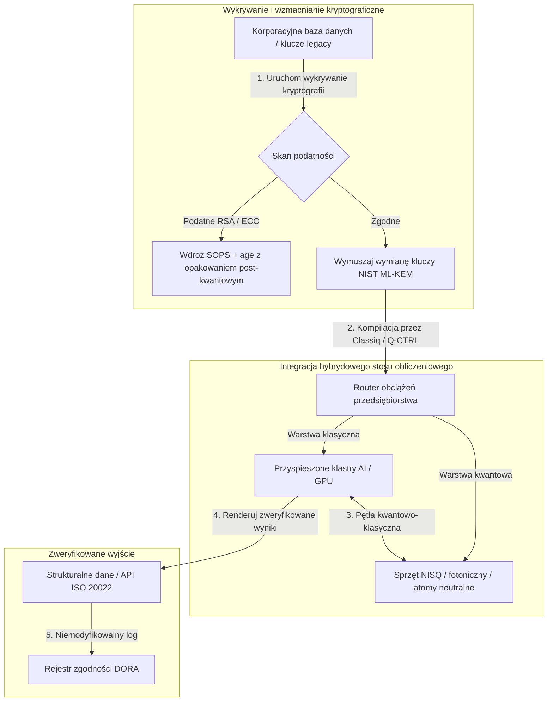

---

# Front Matter (YAML)

author: "contact@sebastienrousseau.com (Sebastien Rousseau)"
banner_alt: "Widok sceny ze szczytu Economist Impact 5th Annual Commercialising Quantum Global 2026 w Londynie — symbolizujący przejście technologii kwantowej od badań w fizyce do gotowych do wdrożenia przepływów pracy w przedsiębiorstwie"
banner_height: "1597"
banner_width: "2584"
banner: "https://cloudcdn.pro/stocks/images/sebastien-rousseau-20260617-5th-commercialising-quantum-2.webp"
cdn: "https://cloudcdn.pro"
charset: "UTF-8"
cname: "sebastienrousseau.com"
copyright: "© Copyright 2025 - 2026 - Sebastien Rousseau. All rights reserved."
date: "June 17, 2026"
description: "Wnioski dla zarządu ze szczytu Economist Impact 5th Annual Commercialising Quantum Global 2026 — fala finansowania 1,3 mld USD, stosy hybrydowe „bez żalu”, pilność migracji kryptografii post-kwantowej, komercjalizacja sensoryki kwantowej i dyrektywa HSBC, że bezczynność to błąd na własne życzenie."
format-detection: "telephone=no"
hreflang: "pl"
icon: "https://cloudcdn.pro/clients/sebastienrousseau/v1/logos/sebastienrousseau.svg"
id: "https://sebastienrousseau.com/2026-06-17-economist-commercialising-quantum-summit-2026"
image_alt: "Czarno-biały portret Sebastiena Rousseau"
image_height: "162"
image_width: "162"
image: "https://cloudcdn.pro/stocks/images/sebastien-rousseau.png"
keywords: "Commercialising Quantum Global 2026, szczyt Economist Impact, kryptografia post-kwantowa, NIST ML-KEM, harvest-now decrypt-later, SNDL, HSBC kwantowe, Philip Intallura, sensoryka kwantowa, nawigacja niezależna od GPS, NQCC, EU Quantum Act, Quantcore, nagroda qBIG, Lord Vallance, hybrydowa kwantowo-klasyczna, DORA art. 6"
language: "pl-PL"
last_reviewed: "2026-06-17"
layout: "report"
locale: "pl_PL"
logo_alt: "Logo Sebastiena Rousseau"
logo_height: "44"
logo_width: "44"
logo: "https://cloudcdn.pro/clients/sebastienrousseau/v1/logos/sebastienrousseau.svg"
menu: ""
measurementID: "G-169G4ET5HQ"
name: "Sebastien Rousseau"
permalink: "https://sebastienrousseau.com/2026-06-17-economist-commercialising-quantum-summit-2026"
rating: "general"
referrer: "no-referrer"
robots: "index, follow"
schema: "FAQPage, Article"
seo_title: "Commercialising Quantum 2026: wnioski dla zarządu"
short_name: "sebastienrousseau"
subtitle: "Technologia kwantowa przeszła od spekulatywnej nauki laboratoryjnej do hybrydowych przepływów pracy w przedsiębiorstwie; zarząd musi odpowiedzieć na 1,3 mld USD finansowania w 2026, natychmiastową migrację post-kwantową i dyrektywę HSBC, by przestać czekać."
tags: "kwantowe, kryptografia post-kwantowa, NIST ML-KEM, harvest-now decrypt-later, sensoryka kwantowa, HSBC, Economist Impact, hybrydowy compute, DORA, EU Quantum Act, NQCC, wnioski ze szczytu"
theme-color: "0, 83, 191"
title: "Od kubitów do zysków: strategiczne wnioski z 5. dorocznego szczytu Economist Commercialising Quantum Global 2026"
url: "https://sebastienrousseau.com/2026-06-17-economist-commercialising-quantum-summit-2026"
viewport: "width=device-width, initial-scale=1, shrink-to-fit=no"

# RSS - The RSS feed front matter (YAML).
atom_link: "https://sebastienrousseau.com/2026-06-17-economist-commercialising-quantum-summit-2026/rss.xml"
category: "Technology"
docs: https://validator.w3.org/feed/docs/rss2.html
generator: "Static Site Generator (SSG) (version 0.0.26)"
item_description: "Wnioski dla zarządu ze szczytu Economist Impact 5th Annual Commercialising Quantum Global 2026 — fala finansowania 1,3 mld USD, stosy hybrydowe „bez żalu”, pilność migracji kryptografii post-kwantowej, komercjalizacja sensoryki kwantowej i dyrektywa HSBC, że bezczynność to błąd na własne życzenie."
item_guid: "https://sebastienrousseau.com/2026-06-17-economist-commercialising-quantum-summit-2026/rss.xml"
item_link: "https://sebastienrousseau.com/2026-06-17-economist-commercialising-quantum-summit-2026/rss.xml"
item_pub_date: "Wed, 17 Jun 2026 06:06:06 +0000"
item_title: "Od kubitów do zysków: strategiczne wnioski z 5. dorocznego szczytu Economist Commercialising Quantum Global 2026"
last_build_date: "Wed, 17 Jun 2026 06:06:06 +0000"
managing_editor: "contact@sebastienrousseau.com (Sebastien Rousseau)"
pub_date: "Wed, 17 Jun 2026 06:06:06 +0000"
ttl: "60"
type: "article"
webmaster: "contact@sebastienrousseau.com"

# Apple - The Apple front matter (YAML).
apple_mobile_web_app_orientations: "portrait"
apple_touch_icon_sizes: "192x192"
apple-mobile-web-app-capable: "yes"
apple-mobile-web-app-status-bar-inset: "black"
apple-mobile-web-app-status-bar-style: "black-translucent"
apple-mobile-web-app-title: "Commercialising Quantum 2026: wnioski dla zarządu"
apple-touch-fullscreen: "yes"

# MS Application - The MS Application front matter (YAML).

msapplication-navbutton-color: "0, 83, 191"

# Twitter Card - The Twitter Card front matter (YAML).

twitter_card: "summary_large_image"
twitter_creator: "@wwdseb"
twitter_description: "Wnioski dla zarządu ze szczytu Economist Impact 5th Annual Commercialising Quantum Global 2026 — fala finansowania 1,3 mld USD, stosy hybrydowe „bez żalu”, pilność migracji kryptografii post-kwantowej, komercjalizacja sensoryki kwantowej i dyrektywa HSBC, że bezczynność to błąd na własne życzenie."
twitter_image: "https://cloudcdn.pro/clients/sebastienrousseau/v1/logos/sebastienrousseau.svg"
twitter_image_alt: "Logo Sebastiena Rousseau"
twitter_site: "@wwdseb"
twitter_title: "Commercialising Quantum 2026: wnioski dla zarządu"
twitter_url: "https://sebastienrousseau.com/2026-06-17-economist-commercialising-quantum-summit-2026"

excerpt: "Szczyt Economist Impact 5th Annual Commercialising Quantum Global 2026 potwierdził zwrot technologii kwantowej w stronę przepływów pracy w przedsiębiorstwie: 1,3 mld USD pozyskane w pięć miesięcy, kryptografia post-kwantowa to fiducjarny problem zarządu w obliczu zbierania danych SNDL, sensoryka kwantowa już dziś jest wdrażana w nawigacji niezależnej od GPS, a Philip Intallura z HSBC wygłosił dyrektywę, że czekanie na sprzęt odporny na błędy jest błędem na własne życzenie."

# Humans.txt - The Humans.txt front matter (YAML).
author_website: "https://sebastienrousseau.com"
author_twitter: "@wwdseb"
author_location: "London, UK"
thanks: "Dziękujemy za lekturę!"
site_last_updated: "2026-06-17"
site_standards: "HTML5, CSS3, RSS, Atom, JSON, XML, YAML, Markdown, TOML"
site_components: "Kaishi, Kaishi Builder, Kaishi CLI, Kaishi Templates, Kaishi Themes"
site_software: "Static Site Generator, Rust"

---

# Od kubitów do zysków: strategiczne wnioski z 5. dorocznego szczytu Economist Commercialising Quantum Global 2026

Gotowość przedsiębiorstwa, migracje kryptografii post-kwantowej, hybrydowe stosy obliczeniowe oraz wyłaniający się komercyjny krajobraz sensoryki i sieci kwantowych.

**W skrócie.** 5. doroczna konferencja Commercialising Quantum Global 2026, zorganizowana przez Economist Impact w dniach 16–17 czerwca 2026 r. w Business Design Centre w Londynie, zgromadziła ponad 1 100 globalnych liderów z sektora przedsiębiorstw, finansów, polityki i badań. Centralnym wątkiem był wyraźny zwrot strukturalny: technologia kwantowa przeszła od spekulatywnej nauki laboratoryjnej do praktycznych, hybrydowych przepływów pracy w przedsiębiorstwie. Wsparta 1,3 mld USD kapitału venture pozyskanego w samych pierwszych pięciu miesiącach 2026 roku, dyskusja w sali zarządu nie koncentruje się już na liczeniu fizycznych kubitów, lecz na ustanowieniu hybrydowych stosów obliczeniowych „bez żalu”, zabezpieczeniu aktywów cyfrowych przed kryptograficznym zagrożeniem „harvest-now, decrypt-later” (SNDL) oraz wdrażaniu krótkoterminowych systemów sensoryki kwantowej dla nawigacji niezależnej od GPS.

## Wnioski kluczowe

- **Zwrot przedsiębiorstwa ku praktycznym przepływom pracy.** Liderzy branży ([Steve Suarez](https://www.linkedin.com/in/stevesuarez) z HorizonX, [Phil Intallura](https://www.linkedin.com/in/intallura) z HSBC) podkreślili, że integracja kwantowa nie jest już problemem fizyki, lecz operacyjnym. Banki i przedsiębiorstwa wdrażają hybrydowe piloty kwantowo-klasyczne, aby przygotować kadry i optymalizować aktywne obciążenia.
- **Kryptografia post-kwantowa (PQC) priorytetem zarządu.** Eksperci ds. bezpieczeństwa i prawa (CMS UK, [Joanne Miller](https://www.linkedin.com/in/joanne-miller-nso) z Microsoft, [Craig Farrell](https://www.linkedin.com/in/craig-farrell) z EY) ostrzegli, że organizacje nie mogą czekać na sprzęt odporny na błędy, by wdrożyć PQC. Zbieranie danych w trybie „harvest-now, decrypt-later” odbywa się już dziś, co czyni migrację do standardów NIST ML-KEM natychmiastową kwestią fiducjarną.
- **Sensoryka kwantowa liderem krótkoterminowej rentowności.** Choć obliczenia odporne na błędy są jeszcze za wiele lat, sensoryka kwantowa ([Matthew Kinsella](https://www.linkedin.com/in/matthewkinsella) z Infleqtion) skaluje się szybko. Zegary kwantowe i czujniki inercyjne są wdrażane w nawigacji niezależnej od GPS, bezpieczeństwie narodowym i ultrastabilnych sieciach energetycznych.
- **Suwerenność, klastry i pilność polityki.** Minister nauki Wielkiej Brytanii [Lord Vallance](https://www.linkedin.com/in/patrick-vallance) i [Lord William Hague](https://www.linkedin.com/in/williamhague) przedstawili misje krajowe mające przekształcić badania w przemysłowe „superklastry” we współpracy z National Quantum Computing Centre (NQCC). Nadchodzący EU Quantum Act dodatkowo podkreśla geopolityczny pęd ku suwerennym mocom obliczeniowym.
- **Quantcore zdobywa nagrodę qBIG.** Spin-out Uniwersytetu w Glasgow, Quantcore, otrzymał nagrodę IOP qBIG za przełomowe komponenty nadprzewodzące oparte na niobie, które działają w wyższych temperaturach niż tradycyjne materiały, znacząco redukując narzut infrastruktury kriogenicznej.

**Powiązane lektury:** [KyberLib i migracja bankowości post-kwantowej w 2026: od standardów do kodu](https://sebastienrousseau.com/2026-06-12-kyberlib-post-quantum-banking-migration-standards-code-2026/), [Indeks odporności bankowej w 2026: AI, chmura, kwanty, płatności i ryzyko koncentracji stron trzecich](https://sebastienrousseau.com/2026-06-08-banking-resilience-index-ai-cloud-quantum-payments-third-party-risk-2026/), [Indeks bankowości cloud-native w 2026: DORA, inżynieria platformowa, suwerenna chmura i odporność operacyjna](https://sebastienrousseau.com/2026-06-05-cloud-native-banking-index-dora-resilience-platform-engineering-2026/).

## 01. Dlaczego szczyt 2026 ma znaczenie dla zarządu

Edycja 2026 szczytu Economist Commercialising Quantum Global oznaczyła trwałą zmianę w sposobie, w jaki świat korporacyjny ocenia deep tech.

Historycznie obliczenia kwantowe były spychane do działów R&D jako wielodekadowe przedsięwzięcie naukowe. W czerwcu 2026 perspektywa ta jest przestarzała. Organizacje muszą przejść od ciekawości „skoncentrowanej na fizyce” do wdrożeń „skoncentrowanych na biznesie”. Powód jest dwojaki:

1. **Konwergencja kwantów i AI.** Stosy HPC łączą obliczenia klasyczne, przyspieszoną AI i węzły NISQ (Noisy Intermediate-Scale Quantum) w jedną, ujednoliconą warstwę obliczeniową. Organizacje, które opóźnią budowę aplikacji gotowych na kwanty, odkryją, że okno na zdobycie przewagi strategicznej zamyka się szybciej, niż oczekiwano.
2. **Pilność geopolityczna i fiducjarna.** Wraz z misyjnym programem kwantowym Wielkiej Brytanii i nadchodzącym EU Quantum Act zdolność kwantowa stała się kwestią suwerenności narodowej i ciągłości korporacyjnej.

Ponadto cyberbezpieczeństwo post-kwantowe nie jest już przyszłym wymogiem zgodności. Zagrożenie atakami „store now, decrypt later” (SNDL) oznacza, że dane korporacyjne przechwycone dziś zostaną odszyfrowane, gdy komercyjne systemy kwantowe się rozskalują, tworząc natychmiastową odpowiedzialność na mocy globalnych mandatów odporności operacyjnej, takich jak Digital Operational Resilience Act (DORA).

## 02. Strategiczna soczewka Commercialising Quantum 2026

Liderzy technologii przedsiębiorstwa muszą zmapować dojrzałość kwantową na pięciu odrębnych warstwach operacyjnych, oceniając horyzonty czasowe i ryzyko bilansowe.

### Tabela 1: Strategiczna soczewka Commercialising Quantum 2026

| Warstwa | Cel korporacyjny | Horyzont czasowy | Kluczowe ryzyko korporacyjne |
| :---- | :---- | :---- | :---- |
| **Sprzęt i kompilator** | Wybór między konkurencyjnymi podejściami (nadprzewodzące, jony pułapkowane, atomy neutralne, fotonika) | 3–5 lat (odporność na błędy) | Zablokowanie się w architekturze bez przyszłości lub zbyt wczesne postawienie na jedną platformę. |
| **Wzmacnianie kryptograficzne** | Wykrywanie i inwentaryzacja zależności kryptograficznych; migracja do NIST ML-KEM | Natychmiast (aktywna migracja) | Systemowe naruszenia danych i niezgodność z DORA i NIST CSF 2.0. |
| **Sensoryka kwantowa** | Wdrażanie nawigacji niezależnej od GPS, ultrastabilnych zegarów i grawimetrów | 1–2 lata (natychmiastowa komercyjna) | Zakłócenia operacyjne logistyki, żeglugi i sieci energetycznych z powodu zagłuszania GPS. |
| **Integracja systemowa** | Łączenie sprzętu kwantowego z istniejącymi klasycznymi centrami danych HPC i superkomputerów | 1–3 lata (faza hybrydowa) | Wysokie opóźnienia, wąskie gardła transferu danych i fragmentaryczne silosy obliczeniowe. |
| **Oprogramowanie przedsiębiorstwa** | Udostępnianie algorytmów kwantowych przez wysokopoziomowe warstwy abstrakcji i API (Classiq, Q-CTRL) | Natychmiast (budowanie kompetencji) | Izolacja kadry i przepływów pracy od rzeczywistego wykonania inżynierskiego. |

## 03. Kluczowe sygnały kwantowe i wyzwalacze dla zarządu

Liderzy technologii muszą monitorować konkretne, mierzalne wskaźniki rynkowe i regulacyjne, aby kierować swoimi inwestycjami kwantowymi.

### Tabela 2: Kluczowe sygnały kwantowe i wyzwalacze dla zarządu

| Sygnał | Metryka ilościowa | Odniesienie regulacyjne / polityczne | Priorytet platformy do działania |
| :---- | :---- | :---- | :---- |
| **Fala finansowania kwantowego** | 1,3 mld USD pozyskane globalnie w pierwszych pięciu miesiącach 2026 | Return on Resilience (RoR) | Przekierować budżety ze spekulatywnych pilotów na hybrydowe obciążenia kwantowo-klasyczne „bez żalu”. |
| **Ekspozycja na deszyfrowanie danych** | 100% danych szyfrowanych przesyłanych kanałami publicznymi narażone na zbieranie SNDL | DORA art. 6 (bezpieczeństwo ICT) | Wdrożyć narzędzia wykrywania kryptografii w celu identyfikacji podatnych kluczy RSA/ECC w całym majątku. |
| **Suwerenna infrastruktura** | Alokacja 2,5 mld GBP w ramach UK National Quantum Strategy | UK Quantum Missions / Lord Vallance | Nawiązać lokalne partnerstwa z krajowymi superklastrami, takimi jak NQCC. |
| **Terminy zgodności** | 14 listopada 2026 — przejście SWIFT na adres strukturalny | Dyrektywa SWIFT SR 2026 | Oczyścić i sformatować bazy danych międzybankowych zgodnie ze strukturalnymi specyfikacjami XML. |

## 04. Pogłębione spojrzenie na kluczowe wątki szczytu

### Kwanty osiągają punkt zwrotny w inwestycjach

Finansowanie venture capital znacząco przyspieszyło, pozyskując **1,3 mld USD** w samych pierwszych pięciu miesiącach 2026 roku. W przeciwieństwie do spekulatywnych cykli hype z poprzednich lat, obecna fala kapitału wspierana jest realnymi, krótkoterminowymi obciążeniami. Prelegenci z Classiq i IBM Quantum Platform pokazali, jak warstwy abstrakcji programowej i zautomatyzowane kompilatory umożliwiają zespołom programistów bez specjalistycznej wiedzy uruchamianie hybrydowych algorytmów kwantowo-klasycznych na dzisiejszej klasycznej infrastrukturze. Strategia „bez żalu” umożliwia organizacjom natychmiastowe budowanie kadr i przepływów pracy gotowych na kwanty.

### Ostrzeżenia prawne i regulacyjne dotyczące „harvest now, decrypt later”

Partnerzy prawni i kierownictwo ds. cyberbezpieczeństwa wywołali intensywne zaangażowanie wokół natychmiastowości ryzyka danych. Przedstawiciele sponsorującej kancelarii CMS UK i CSO Microsoft [Joanne Miller](https://www.linkedin.com/in/joanne-miller-nso) wygłosili ostre ostrzeżenie skierowane do kadry kierowniczej najwyższego szczebla: *czekanie z wdrożeniem kryptografii post-kwantowej do momentu, gdy pojawi się sprzęt odporny na błędy, jest krytycznym uchybieniem fiducjarnym.*

W paradygmacie „store now, decrypt later” (SNDL) wrogie podmioty aktywnie zbierają dziś zaszyfrowane dane korporacyjne z zamiarem ich odszyfrowania, gdy tylko pojawią się kryptograficznie istotne komputery kwantowe. Organizacje muszą wdrożyć ochronę post-kwantową (taką jak NIST ML-KEM) natychmiast, aby chronić długożyciowe zbiory wrażliwych danych, własność intelektualną i historyczne rejestry klientów.

### Realignment hype'u wokół „sensoryki kwantowej”

Choć kwantowe obliczenia odporne na błędy pozostają odległe o lata, szczyt zwrócił uwagę na sensorykę kwantową jako pierwszą naprawdę rentowną falę realnych wdrożeń. Dyrektor generalny [Matthew Kinsella](https://www.linkedin.com/in/matthewkinsella) z Infleqtion szczegółowo omówił, jak zegary kwantowe, czujniki inercyjne i systemy radiowe skalują się szybko w wielu branżach.

Ponieważ technologie te mierzą stałe fizyczne z dokładnością subatomową, umożliwiają **nawigację niezależną od GPS**, ultrastabilne sieci energetyczne i telekomunikację dalekiego zasięgu. Zastosowania te są wysoce istotne dla lotnictwa, transportu morskiego i systemów obronności narodowej zagrożonych narastającym zagłuszaniem GPS.

### Ekosystem i współpraca klastrowa

Brytyjski ekosystem kwantowy wykorzystał szczyt londyński, aby zaprezentować krajowe superklastry innowacji. Aktualizacje na żywo z National Quantum Computing Centre (NQCC) i Digital Catapult pokazały, jak wczesne spin-outy deep tech mogą zasypać „przepaść technologiczną”, integrując sprzęt kwantowy bezpośrednio z klasycznymi centrami danych superkomputerowych.

[Wridhdhisom Karar](https://www.linkedin.com/in/wridhdhisomkarar), współzałożyciel szkockiego startupu kwantowego Quantcore, odebrał prestiżową nagrodę Institute of Physics (IOP) Quantum Business Innovation and Growth (qBIG) za komponenty nadprzewodzące oparte na niobie. Komponenty te działają w wyższych temperaturach niż tradycyjne materiały, znacząco redukując narzut infrastruktury kriogenicznej niezbędnej do skalowania procesorów kwantowych.

### Studium przypadku HSBC: dlaczego czekanie na kwanty to „błąd na własne życzenie”

Spostrzeżenia [**Philipa Intallury, Ph.D.**](https://www.linkedin.com/in/intallura) (Global Head of Quantum Technologies w HSBC, doradcy rządu Wielkiej Brytanii i doradcy zarządu) na 5. dorocznym wydarzeniu Economist Commercialising Quantum (2026) przyniosły mocną dyrektywę dla zarządu: *„Czekanie z rozpoczęciem na kwanty odporne na błędy jest błędem na własne życzenie”.*

Dr Intallura argumentował, że powszechne wśród instytucji finansowych podejście „poczekajmy i zobaczmy” to samobój oparty na trzech błędnych założeniach:

- **Krótkoterminowy ROI jest realny.** W testach empirycznych HSBC przewyższył modele aktualnie działające w produkcji, połączył pracę kwantową z innymi obszarami biznesu, wykorzystał kwanty do pogłębienia relacji z największymi klientami i przyciągnął znaczący nowy biznes do **HSBC Innovation Banking**.
- **Kwanty to stroma krzywa adopcji.** Budowanie kompetencji, ustalanie strategii, zabezpieczanie finansowania i prowadzenie cykli eksperymentów wewnątrz silnie regulowanej organizacji nie jest krótkim przedsięwzięciem. Procesy muszą być systematycznie testowane i adaptowane pod technologię.
- **Kwanty to ekosystem.** Żaden pojedynczy gracz nie dotrze tam samodzielnie. Każdy artykuł badawczy, POC i pilot zrealizowany przez HSBC powstał w ścisłej współpracy z dostawcą rozwiązań kwantowych — a w niektórych przypadkach współpraca obejmuje środowisko akademickie, regulatorów i rządy.

**Końcowa dyrektywa dla zarządu:** *„Zdolności, których będą Państwo potrzebować pierwszego dnia odporności na błędy, to zdolności, które buduje się dziś”.*

## 05. Korporacyjny pipeline integracji kwantowej i kryptografii

Aby zabezpieczyć aktywa cyfrowe i jednocześnie budować gotowość kwantową, przedsiębiorstwo musi ustanowić jasny pipeline integracyjny.

## 06. Podręcznik zarządu: konkretne imperatywy

Aby przełożyć wnioski ze szczytu Commercialising Quantum Global 2026 na natychmiastową wartość biznesową, kadra kierownicza najwyższego szczebla powinna wykonać następujący czterostopniowy podręcznik zarządu:

1. **Nakaż wykrywanie kryptografii.** Polećcie Państwo Chief Information Security Officerowi (CISO) skatalogowanie wszystkich aktywów kryptograficznych, mapując każdy legacy'owy klucz RSA i ECC w całym przedsiębiorstwie w ramach przygotowania do migracji post-kwantowej.
2. **Wdroż strategię hybrydową „bez żalu”.** Niech Państwo unikają czekania na idealny sprzęt. Inwestujcie w oprogramowanie inspirowane kwantami oraz hybrydowe piloty klasyczno-kwantowe, aby rozwijać kadrę wewnętrzną i optymalizować już dziś złożoną logistykę lub portfele ryzyka.
3. **Oceńcie sensorykę kwantową dla logistyki.** Jeśli Państwa organizacja zależy od globalnych łańcuchów dostaw, żeglugi lub infrastruktury krytycznej, aktywnie oceńcie systemy sensoryki kwantowej (takie jak nawigacja niezależna od GPS), aby zmitygować ryzyka zakłóceń geopolitycznych.
4. **Zarejestrujcie się na Insight Hour 30 czerwca.** Upewnijcie się Państwo, że liderzy technologii zarejestrują się na wirtualną **Commercialising Quantum Global Insight Hour** 30 czerwca 2026 r. o godz. 15:00 BST (przy wsparciu IonQ), aby kontynuować śledzenie strategii zarządzania ryzykiem przedsiębiorstwa i alokacji kadr.

## 07. Najczęściej zadawane pytania

**Czym jest „harvest now, decrypt later” (SNDL) i dlaczego ma to znaczenie już dziś?**
SNDL to praktyka przechwytywania i przechowywania zaszyfrowanych danych dziś, z zamiarem ich późniejszego odszyfrowania, gdy pojawią się kryptograficznie istotne komputery kwantowe. Długożyciowe wrażliwe zbiory danych — własność intelektualna, rejestry klientów, komunikacja rządowa — są już dziś celem ataków. Migracja do NIST ML-KEM to decyzja fiducjarna, której zarząd nie może odkładać.

**Dlaczego sensoryka kwantowa jest pierwszą falą komercyjną zamiast obliczeń?**
Sensoryka kwantowa mierzy stałe fizyczne z dokładnością subatomową i nie wymaga sprzętu odpornego na błędy, którego potrzebują obliczenia kwantowe. Zegary kwantowe, grawimetry i czujniki inercyjne są już we wdrożeniach pilotażowych dla nawigacji niezależnej od GPS, ultrastabilnych sieci energetycznych i komunikacji dalekiego zasięgu.

**Czy praca HSBC nad kwantami to tylko R&D, czy też przyniosła mierzalne zwroty?**
Według Philipa Intallury podczas szczytu HSBC przewyższył modele aktualnie działające w produkcji, wykorzystał kwanty do pogłębienia relacji z największymi klientami i przyciągnął znaczący nowy biznes do HSBC Innovation Banking. Praca przeszła z badań do integracji operacyjnej.

## 08. Źródła

- **Economist Impact, (2026).** *5th Annual Commercialising Quantum Global 2026.* Materiały z konferencji na żywo, 16–17 czerwca 2026 r. Londyn: Business Design Centre. Dostępne pod adresem: [Economist Impact](https://events.economist.com/commercialising-quantum/).
- **National Institute of Standards and Technology (NIST), (2024).** *First Three Finalized Post-Quantum Encryption Standards (FIPS 203, 204, and 205).* Gaithersburg: U.S. Department of Commerce. Dostępne pod adresem: [NIST Standards](https://www.nist.gov/news-events/news/2024/08/nist-releases-first-3-finalized-post-quantum-encryption-standards).
- **European Parliament and Council of the European Union, (2022).** *Regulation (EU) 2022/2554 on digital operational resilience for the financial sector (DORA).* Bruksela: Dziennik Urzędowy Unii Europejskiej. Dostępne pod adresem: [DORA Regulation](https://eur-lex.europa.eu/legal-content/EN/TXT/?uri=CELEX%3A32022R2554).
- **SWIFT, (2024).** *ISO 20022 November 2026 Structured Address Milestone.* La Hulpe: SWIFT. Dostępne pod adresem: [SWIFT ISO 20022 milestone](https://www.swift.com/standards/iso-20022/iso-20022-bytes/call-action-november-2026).
