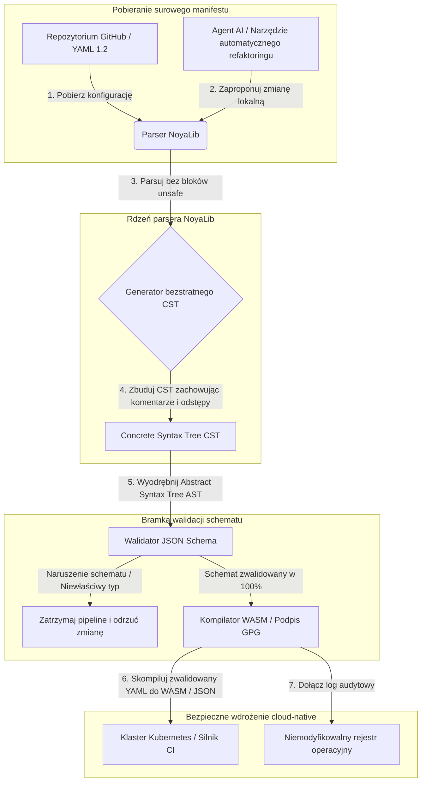

---

# Front Matter (YAML)

author: "contact@sebastienrousseau.com (Sebastien Rousseau)"
banner_alt: "Geometria architektoniczna w dramatycznym świetle — symbolizująca rolę NoyaLib jako nośnego, bezpiecznego parsera YAML w Rust pod CI, Kubernetes, MCP i konfiguracją usług finansowych"
banner_height: "1597"
banner_width: "2584"
banner: "https://cloudcdn.pro/stocks/images/ken-cheung-KonWFWUaAuk.webp"
cdn: "https://cloudcdn.pro"
charset: "UTF-8"
cname: "sebastienrousseau.com"
copyright: "© Copyright 2025 - 2026 - Sebastien Rousseau. All rights reserved."
date: "June 18, 2026"
description: "NoyaLib — parser YAML 1.2 w Rust bez bloków unsafe, 406/406 zgodności, walidacja JSON Schema, bezstratny CST i bindingi MCP/WASM dla finansów."
format-detection: "telephone=no"
hreflang: "pl"
icon: "https://cloudcdn.pro/clients/sebastienrousseau/v1/logos/sebastienrousseau.svg"
id: "https://sebastienrousseau.com/2026-06-18-noyalib-safe-yaml-rust-ai-mcp-financial-infrastructure-2026"
image_alt: "Czarno-biały portret Sebastiena Rousseau"
image_height: "162"
image_width: "162"
image: "https://cloudcdn.pro/stocks/images/sebastien-rousseau.png"
keywords: "bezpieczniejszy parser YAML w Rust, NoyaLib, zgodność ze specyfikacją YAML 1.2, Rust bez unsafe, walidacja JSON Schema, bezstratny Concrete Syntax Tree, CST, MCP, Model Context Protocol, WebAssembly, manifesty Kubernetes, konfiguracja CI/CD, DORA art. 5, BCBS 239, ryzyko operacyjne Basel III, infrastruktura finansowa, bezpieczeństwo konfiguracji, łańcuch dostaw oprogramowania"
language: "pl-PL"
last_reviewed: "2026-06-18"
layout: "report"
locale: "pl_PL"
logo_alt: "Logo Sebastiena Rousseau"
logo_height: "44"
logo_width: "44"
logo: "https://cloudcdn.pro/clients/sebastienrousseau/v1/logos/sebastienrousseau.svg"
menu: ""
measurementID: "G-169G4ET5HQ"
name: "Sebastien Rousseau"
permalink: "https://sebastienrousseau.com/2026-06-18-noyalib-safe-yaml-rust-ai-mcp-financial-infrastructure-2026"
rating: "general"
referrer: "no-referrer"
robots: "index, follow"
schema: "FAQPage, Article"
seo_title: "Bezpieczniejszy parser YAML w Rust dla AI, MCP i finansów"
short_name: "sebastienrousseau"
subtitle: "Bezpieczniejszy stos YAML w Rust — NoyaLib — przekształca YAML 1.2 z wygodnego markupu w kryptograficznie bezpieczną, zgodną ze specyfikacją płaszczyznę kontroli konfiguracji dla agentów AI, MCP, Kubernetes i infrastruktury usług finansowych."
tags: "bezpieczniejszy parser YAML w Rust, NoyaLib, YAML 1.2, Rust bez unsafe, JSON Schema, MCP, WebAssembly, Kubernetes, DORA, BCBS 239, Basel III, infrastruktura finansowa, bezpieczeństwo łańcucha dostaw"
theme-color: "0, 83, 191"
title: "Dlaczego YAML potrzebuje bezpieczniejszego stosu Rust dla AI, MCP i infrastruktury finansowej w 2026"
url: "https://sebastienrousseau.com/2026-06-18-noyalib-safe-yaml-rust-ai-mcp-financial-infrastructure-2026"
viewport: "width=device-width, initial-scale=1, shrink-to-fit=no"

# RSS - The RSS feed front matter (YAML).
atom_link: "https://sebastienrousseau.com/2026-06-18-noyalib-safe-yaml-rust-ai-mcp-financial-infrastructure-2026/rss.xml"
category: "Technology"
docs: https://validator.w3.org/feed/docs/rss2.html
generator: "Static Site Generator (SSG) (version 0.0.26)"
item_description: "NoyaLib — parser YAML 1.2 w Rust bez bloków unsafe, 406/406 zgodności, walidacja JSON Schema, bezstratny CST i bindingi MCP/WASM dla finansów."
item_guid: "https://sebastienrousseau.com/2026-06-18-noyalib-safe-yaml-rust-ai-mcp-financial-infrastructure-2026/rss.xml"
item_link: "https://sebastienrousseau.com/2026-06-18-noyalib-safe-yaml-rust-ai-mcp-financial-infrastructure-2026/rss.xml"
item_pub_date: "Thu, 18 Jun 2026 06:06:06 +0000"
item_title: "Dlaczego YAML potrzebuje bezpieczniejszego stosu Rust dla AI, MCP i infrastruktury finansowej w 2026"
last_build_date: "Thu, 18 Jun 2026 06:06:06 +0000"
managing_editor: "contact@sebastienrousseau.com (Sebastien Rousseau)"
pub_date: "Thu, 18 Jun 2026 06:06:06 +0000"
ttl: "60"
type: "article"
webmaster: "contact@sebastienrousseau.com"

# Apple - The Apple front matter (YAML).
apple_mobile_web_app_orientations: "portrait"
apple_touch_icon_sizes: "192x192"
apple-mobile-web-app-capable: "yes"
apple-mobile-web-app-status-bar-inset: "black"
apple-mobile-web-app-status-bar-style: "black-translucent"
apple-mobile-web-app-title: "Bezpieczniejszy parser YAML w Rust dla AI, MCP i finansów"
apple-touch-fullscreen: "yes"

# MS Application - The MS Application front matter (YAML).

msapplication-navbutton-color: "0, 83, 191"

# Twitter Card - The Twitter Card front matter (YAML).

twitter_card: "summary_large_image"
twitter_creator: "@wwdseb"
twitter_description: "NoyaLib — parser YAML 1.2 w Rust bez bloków unsafe, 406/406 zgodności, walidacja JSON Schema, bezstratny CST i bindingi MCP/WASM dla finansów."
twitter_image: "https://cloudcdn.pro/clients/sebastienrousseau/v1/logos/sebastienrousseau.svg"
twitter_image_alt: "Logo Sebastiena Rousseau"
twitter_site: "@wwdseb"
twitter_title: "Bezpieczniejszy parser YAML w Rust dla AI, MCP i finansów"
twitter_url: "https://sebastienrousseau.com/2026-06-18-noyalib-safe-yaml-rust-ai-mcp-financial-infrastructure-2026"

excerpt: "NoyaLib to bezpieczniejszy stos YAML w Rust — zero bloków unsafe, 406/406 zgodności ze specyfikacją YAML 1.2, bezstratny Concrete Syntax Tree, walidacja JSON Schema (Draft 2020-12) i bindingi MCP/WASM — zaprojektowany pod agentów AI, Kubernetes, CI/CD i płaszczyznę kontroli konfiguracji infrastruktury finansowej."

# Humans.txt - The Humans.txt front matter (YAML).
author_website: "https://sebastienrousseau.com"
author_twitter: "@wwdseb"
author_location: "London, UK"
thanks: "Dziękujemy za lekturę!"
site_last_updated: "2026-06-18"
site_standards: "HTML5, CSS3, RSS, Atom, JSON, XML, YAML, Markdown, TOML"
site_components: "Kaishi, Kaishi Builder, Kaishi CLI, Kaishi Templates, Kaishi Themes"
site_software: "Static Site Generator, Rust"

---

# Dlaczego YAML potrzebuje bezpieczniejszego stosu Rust dla AI, MCP i infrastruktury finansowej w 2026

Bezpieczniejszy stos YAML w Rust ma znaczenie, ponieważ YAML niesie dziś pipeline'y CI/CD, manifesty Kubernetes, reguły [Open Policy Agent](https://www.openpolicyagent.org/) oraz rejestry narzędzi Model Context Protocol (MCP) — a pojedyncze niejednoznaczne parsowanie może rozłożyć system rozliczeniowy, źle skonfigurować grupę bezpieczeństwa albo przyznać lokalnemu agentowi AI niewłaściwe uprawnienia. [NoyaLib](https://github.com/sebastienrousseau/noyalib) to napisany w czystym Rust, pozbawiony bloków unsafe ekosystem parsowania i walidacji [YAML 1.2](https://yaml.org/spec/1.2.2/), zaprojektowany, by ta infrastruktura była bezpieczna domyślnie.

## Szybka odpowiedź

**Czym jest NoyaLib w jednym zdaniu?** NoyaLib to open-source'owy parser YAML 1.2 napisany w czystym Rust z walidacją, bez kodu `unsafe`, ze 100% zgodnością ze specyfikacją na 406 testach oficjalnego pakietu YAML, bezstratnym Concrete Syntax Tree oraz walidacją [JSON Schema](https://json-schema.org/) w czasie rzeczywistym — zaprojektowany, by konfiguracja agentów AI, MCP, Kubernetes i infrastruktury finansowej była bezpieczna domyślnie.

## Streszczenie wykonawcze

YAML wygląda skromnie — dopóki niejednoznaczne parsowanie lub naruszenie schematu nie wywróci wielomiliardowego produkcyjnego systemu rozliczeniowego. W 2026 r. YAML to de facto standard pipeline'ów [CI/CD](https://docs.github.com/en/actions/learn-github-actions/workflow-syntax-for-github-actions), manifestów [Kubernetes](https://kubernetes.io/docs/concepts/configuration/overview/), reguł [Open Policy Agent](https://www.openpolicyagent.org/) i rejestrów narzędzi Model Context Protocol (MCP). Nieprzejrzyste starsze parsery — z lukami pamięci i destrukcyjnym parsowaniem — to ryzyko bezpieczeństwa nie do zaakceptowania. NoyaLib to ekosystem YAML 1.2 napisany w czystym Rust, bez bloków unsafe: 100% zgodności ze specyfikacją na wszystkich 406 testach oficjalnego pakietu, bezstratny Concrete Syntax Tree (CST) zachowujący komentarze i odstępy oraz wbudowana walidacja JSON Schema. Efekt: YAML jako audytowalna, bezpieczna i dostępna dla agentów płaszczyzna kontroli konfiguracji.

## Kluczowe wnioski

- **Konfiguracja jest kodem produkcyjnym.** Pojedynczy źle uformowany plik YAML może błędnie skonfigurować cloud-native'owe grupy bezpieczeństwa lub uprawnienia agenta AI. NoyaLib traktuje YAML jak infrastrukturę krytyczną.
- **Projekt bez unsafe.** Zbudowany w całości w bezpiecznym Rust, bez bloków `unsafe`, NoyaLib eliminuje podatności pamięciowe — przepełnienia bufora, zdalne wykonanie kodu — w bazowych warstwach parsowania.
- **Absolutna zgodność 406/406 ze specyfikacją.** Matematycznie waliduje struktury konfiguracji, eliminując rozbieżności parsowania i dryf strukturalny między staging a produkcją.
- **Bezstratny Concrete Syntax Tree.** W przeciwieństwie do starszych parserów, które odrzucają komentarze i formatowanie, NoyaLib zachowuje odstępy i adnotacje, umożliwiając bezpieczny, dwukierunkowy zautomatyzowany refaktoring przez agentów AI.
- **Wartość fiducjarna na poziomie zarządu.** Łączy integralność konfiguracji z [art. 5 DORA](https://eur-lex.europa.eu/legal-content/EN/TXT/?uri=CELEX%3A32022R2554) i wskaźnikami kapitału na ryzyko operacyjne [Basel III](https://www.bis.org/bcbs/publ/d424.htm), bezpośrednio chroniąc kadrę kierowniczą najwyższego szczebla przed odpowiedzialnością osobistą.

**Powiązane lektury:** [KyberLib i migracja bankowości post-kwantowej w 2026: od standardów do kodu](https://sebastienrousseau.com/2026-06-12-kyberlib-post-quantum-banking-migration-standards-code-2026/), [Indeks bankowości cloud-native w 2026: DORA, inżynieria platformowa, suwerenna chmura i odporność operacyjna](https://sebastienrousseau.com/2026-06-05-cloud-native-banking-index-dora-resilience-platform-engineering-2026/), [Dotfiles świadome AI w 2026: budowa bezpiecznej, odtwarzalnej stacji roboczej deweloperskiej dla MCP, SLSA i wielopowłokowej parytetowości](https://sebastienrousseau.com/2026-06-16-ai-aware-dotfiles-secure-reproducible-workstation-2026/).

## 01. Dlaczego bezpieczniejszy stos YAML w Rust ma znaczenie w 2026

W czerwcu 2026 r. korporacyjne infrastruktury IT są wysoce rozproszone i coraz bardziej zautomatyzowane.

YAML cicho stał się nośnym językiem konfiguracji całego stosu inżynierii oprogramowania. Niesie przepływy continuous-integration (CI), które kompilują artefakty produkcyjne, manifesty [Kubernetes](https://kubernetes.io/docs/concepts/overview/) orkiestrujące globalne klastry cloud-native oraz schematy serwerów [Model Context Protocol](https://modelcontextprotocol.io/) (MCP), które dają lokalnym agentom AI uprawnienia do wykonywania operacji lokalnych.

Starsze parsery YAML — [PyYAML](https://pyyaml.org/), [yaml-cpp](https://github.com/jbeder/yaml-cpp), [libyaml](https://github.com/yaml/libyaml) — niosą dwa ryzyka strukturalne:

1. **Podatności na koercję typów („problem Norwegii").** Starsze parsery często koercują nienawiasowane łańcuchy znaków (kod kraju `NO` na wartość boolean `false`, podobnie `yes`/`no`) — zob. [tag boolean w YAML 1.1 vs 1.2](https://yaml.org/type/bool.html) — powodując krytyczne awarie systemów lub ciche błędne konfiguracje bezpieczeństwa.
2. **Exploity pamięciowe.** Nieprzejrzyste parsery pisane w C/C++ cierpią z powodu wycieków pamięci i przepełnień bufora, które mogą prowadzić do zdalnego wykonania kodu (RCE) na centralnych serwerach build.

[NoyaLib](https://github.com/sebastienrousseau/noyalib) rozwiązuje te wyzwania. To ekosystem parsowania i walidacji YAML 1.2 w czystym Rust, bez bloków unsafe. Osiągając absolutną zgodność 406/406 ze specyfikacją i wymuszając ścisłą walidację JSON Schema już w trakcie parsowania, NoyaLib dostarcza wysoki **Return on Resilience (RoR)** — zapobiega przestojom wywołanym konfiguracją i zabezpiecza łańcuchy dostaw oprogramowania klasy finansowej.

## 02. Soczewka architektoniczna NoyaLib 2026

Ekosystem NoyaLib działa jako bezpieczny, bezstratny parser konfiguracji. Każdy lokalny i chmurowy manifest jest strukturalnie walidowany i chroniony na najniższej warstwie wykonania.

### Tabela 1: Warstwy architektoniczne NoyaLib i mitygacja ryzyka

| Warstwa | Decyzja projektowa | Dlaczego ma to znaczenie | Ryzyko przy niewłaściwej obsłudze |
| ---- | ---- | ---- | ---- |
| **Warstwa parsera** | Parser w czystym Rust zgodny z YAML 1.2, bez bloków `unsafe` | Eliminuje podatności pamięciowe i przepełnienia bufora na najniższej warstwie wykonania. | Zdalne wykonanie kodu (RCE) na centralnych serwerach build. |
| **Warstwa zgodności** | 100% zgodności na 406/406 testach oficjalnego pakietu YAML 1.2 | Eliminuje rozbieżności parsowania i dryf koercji typów między staging a produkcją. | Błędy koercji typów „problemu Norwegii" wyłączające grupy bezpieczeństwa. |
| **Warstwa drzewa składni** | Bezstratny Concrete Syntax Tree (CST) | Zachowuje komentarze, odstępy i kolejność podczas dwukierunkowego parsowania oraz programatycznego refaktoringu. | Zautomatyzowany refaktoring AI niszczący adnotacje deweloperów. |
| **Warstwa walidacji** | Walidacja [JSON Schema (Draft 2020-12)](https://json-schema.org/draft/2020-12/release-notes) podczas parsowania | Wymusza ścisłe modele danych na plikach konfiguracyjnych, zanim trafią one do klastrów produkcyjnych. | Źle uformowane pliki konfiguracji wywołujące awarie klastrów cloud-native. |
| **Warstwa interfejsu** | Bindingi WebAssembly (WASM) i MCP | Pozwala uruchomić walidację konfiguracji bezpośrednio w przeglądarkach, węzłach brzegowych i lokalnych zestawach narzędzi agentów. | Silosy narzędziowe, w których walidacja nie może wykonać się na urządzeniach brzegowych. |

## 03. Kluczowe sygnały bezpieczeństwa stacji roboczej i konfiguracji

Aby utrzymać absolutne bezpieczeństwo w obszarze rozwoju i operacji, Chief Information Security Officer (CISO) musi monitorować konkretne, mierzalne wskaźniki.

### Tabela 2: Sygnały bezpieczeństwa stacji roboczej i konfiguracji

| Sygnał | Metryka / wzorzec operacyjny | Odniesienie NIST CSF / DORA | Wdrożenie na platformie technicznej |
| ---- | ---- | ---- | ---- |
| **Zgodność parsera** | 100% przejścia oficjalnego pakietu testów YAML 1.2 (406/406 testów). | [DORA art. 6](https://eur-lex.europa.eu/legal-content/EN/TXT/?uri=CELEX%3A32022R2554) (bezpieczeństwo ICT) | Rdzeń parsera NoyaLib walidujący wszystkie manifesty przed wykonaniem CI. |
| **Profil bezpieczeństwa pamięci** | Zero bloków `unsafe` Rust w parserze i zależnościach serializatora. | DORA art. 30 (łańcuch dostaw) | Automatyczne kontrole kompilatora ([`forbid(unsafe_code)`](https://doc.rust-lang.org/reference/attributes/diagnostics.html#the-forbid-attribute)) w buildach cargo. |
| **Walidacja schematu** | 100% sparsowanych plików konfiguracji zweryfikowanych względem prawidłowych modeli [JSON Schema](https://json-schema.org/). | [NIST CSF 2.0](https://www.nist.gov/cyberframework) (PR.DS-01) | Bramka walidacji w czasie rzeczywistym wstrzymująca pipeline'y build przy naruszeniach schematu. |
| **Dryf konfiguracji** | Wykrywanie w czasie rzeczywistym i przywracanie lokalnych plików konfiguracji do stanu zwersjonowanego w git. | Return on Resilience (RoR) | Ciągła telemetria logująca wszystkie modyfikacje plików lokalnych. |
| **Kontrola dostępu agenta** | Ograniczone, tylko do odczytu uprawnienia dla lokalnych narzędzi AI operujących przez konfiguracje MCP. | Zarządzanie ryzykiem modelu ([SR 11-7](https://www.federalreserve.gov/supervisionreg/srletters/sr1107.htm)) | Granice serwera MCP ograniczające operacje agenta do zatwierdzonych katalogów. |

## 04. Złudzenie nieprzejrzystego parsowania konfiguracji

Główną podatnością operacji cloud-native jest *nieprzejrzyste parsowanie* — używanie parserów, które odrzucają metadane strukturalne (komentarze, białe znaki, kolejność dokumentów) lub po cichu koercują typy podczas kompilacji. Takie zachowanie wprowadza dwa poważne ryzyka bezpieczeństwa:

1. **Destrukcyjny refaktoring.** Gdy asystent kodowania AI lub zautomatyzowane narzędzie refaktoryzacji aktualizuje manifest wdrożenia, tradycyjne parsery odrzucają komentarze i formatowanie deweloperów, niszcząc kontekst niezbędny do przeglądów ludzkich i forensyki po incydencie.
2. **Rozbieżności parsowania.** Jeśli środowisko staging używa parsera opartego na Pythonie, a produkcja parsera opartego na C, niewielkie różnice w zgodności ze specyfikacją YAML 1.2 mogą sprawić, że ważny manifest staging zawiedzie lub zachowa się inaczej na produkcji, tworząc ukryte podatności bezpieczeństwa.

**Bezstratny Concrete Syntax Tree (CST)** NoyaLib rozwiązuje ten problem. Zachowuje każdy odstęp, komentarz i linię dokumentu w pętli parsuj-i-serializuj. Zautomatyzowani asystenci AI mogą edytować, refaktoryzować i commitować pliki konfiguracji, zachowując 100% adnotacji napisanych przez człowieka — absolutny ślad audytowy.

## 05. Projektowanie ograniczonego pipeline'u konfiguracji AI

Aby zapobiec dotarciu złośliwych zmian konfiguracji do środowisk produkcyjnych, organizacja musi wdrożyć ściśle ograniczony pipeline konfiguracji walidowany schematem.

Poniższy przepływ operacyjny pokazuje, jak NoyaLib parsuje surowy YAML, konstruuje bezstratny CST, waliduje AST względem modelu JSON Schema i kompiluje bindingi WebAssembly dla środowisk przeglądarkowych lub brzegowych.

## 06. Podręcznik zarządu i odpowiedzialność fiducjarna

Bezpieczeństwo konfiguracji i integralność łańcucha dostaw oprogramowania to krytyczne priorytety zarządu. Kadra kierownicza najwyższego szczebla musi podchodzić do zarządzania konfiguracją przez pryzmat obowiązku fiducjarnego i odporności operacyjnej.

- **DORA art. 5 (odpowiedzialność zarządu).** Stanowi, że zarząd ponosi ostateczną, niedelegowalną odpowiedzialność za zarządzanie ryzykiem ICT instytucji. Ponieważ pliki konfiguracji kontrolują krytyczne grupy bezpieczeństwa cloud-native i ścieżki routowania płatności, zarządy muszą weryfikować, że systemy parsujące te manifesty są bezpieczne pamięciowo i w pełni zgodne ze specyfikacją, aby spełnić wymogi audytów regulacyjnych. ([Rozporządzenie (UE) 2022/2554](https://eur-lex.europa.eu/legal-content/EN/TXT/?uri=CELEX%3A32022R2554))
- **BCBS 239 (agregacja i raportowanie danych ryzyka).** Wymaga, aby raportowanie ryzyka i wskaźniki infrastruktury były dokładne, kompletne i generowane pod ścisłymi kontrolami jakości danych. NoyaLib wspiera BCBS 239, parsując i walidując pliki konfiguracji względem ścisłych schematów u źródła, zapobiegając cichym wyciekom danych lub przestojom wywołanym błędną konfiguracją. ([Standard BCBS 239](https://www.bis.org/publ/bcbs239.htm))
- **Mitygacja obciążeń kapitałowych z tytułu ryzyka operacyjnego (Basel III).** Przestoje wywołane konfiguracją bezpośrednio podnoszą obciążenia kapitałowe na ryzyko operacyjne w ramach Basel III, blokując kapitał w bilansie. Standaryzacja korporacyjnego stosu konfiguracji na bezpiecznym parserze w czystym Rust, takim jak NoyaLib, minimalizuje to ryzyko, zachowując kapitał i chroniąc zaufanie klientów. ([Standardy Basel III](https://www.bis.org/bcbs/publ/d424.htm))

## 07. Co to oznacza w zależności od typu banku

### Globalne banki systemowo istotne (G-SIB)

G-SIB-y zarządzają tysiącami mikroserwisów i pipeline'ów wdrożeniowych w wielu jurysdykcjach. Ich podstawowym wyzwaniem jest utrzymanie spójności konfiguracji i zapobieganie dryfowi bezpieczeństwa w masywnych majątkach cloud-native. Standaryzacja na bezpieczniejszym stosie YAML w Rust, takim jak NoyaLib, gwarantuje, że wszystkie manifesty Kubernetes, pipeline'y CI/CD i polityki bezpieczeństwa są parsowane i walidowane w jednolitym, bezpiecznym pamięciowo frameworku — eliminując ryzyko nieaudytowanych konfiguracji typu „snowflake".

### Banki transakcyjne i korporacyjne

Banki transakcyjne obsługują wrażliwe bramki płatności i hurtowe infrastruktury rozliczeniowe. Udowodnienie absolutnego bezpieczeństwa kodu i konfiguracji wdrażanych w tych środowiskach produkcyjnych to wymóg regulacyjny niepodlegający negocjacjom. Integracja NoyaLib gwarantuje, że łańcuch dostaw oprogramowania jest w pełni audytowany, bezstratny i chroniony przed podatnościami parsowania — kontrola mapująca się czysto na art. 6 DORA i sekcję 6 [PCI DSS v4.0](https://www.pcisecuritystandards.org/document_library/).

### Banki regionalne i mniejsze

Banki regionalne muszą utrzymywać wysokie standardy cyberbezpieczeństwa bez budżetów technologicznych skali G-SIB. Open-source'owy framework NoyaLib zapewnia lekkie, opłacalne i wysoce bezpieczne rozwiązanie przyjazne dla Rust, umożliwiając mniejszym instytucjom wdrożenie bezpieczeństwa konfiguracji i ochrony łańcucha dostaw klasy korporacyjnej bez opłat licencyjnych.

## 08. Wnioski: mapa drogowa bezpieczeństwa konfiguracji

Konfiguracje stacji roboczej deweloperskiej i infrastruktury cloud-native to krytyczne płaszczyzny kontroli w łańcuchu dostaw oprogramowania. Dopuszczenie nieaudytowanych, niejednoznacznych lub niebezpiecznych plików konfiguracji do aktywów korporacyjnych to ryzyko operacyjne i regulacyjne nie do zaakceptowania.

Aby zabezpieczyć łańcuch dostaw oprogramowania i chronić punkty końcowe przed podatnościami konfiguracji, kadra kierownicza ds. technologii i bezpieczeństwa powinna wykonać już dziś jasną mapę drogową rozwoju:

1. **Nakaż konfigurację deklaratywną.** Wycofajcie Państwo ręczne, nieaudytowane korekty konfiguracji i wymagajcie, aby wszystkie manifesty były zarządzane jako zwersjonowany, deklaratywny system rekordów.
2. **Wymuście walidację schematu.** Wymuście ścisłe hooki pre-commit i narzędzia skanujące, aby wszystkie pliki konfiguracji były walidowane względem prawidłowych modeli JSON Schema przed wdrożeniem.
3. **Wdrożcie bezstratne dwukierunkowe parsowanie.** Zapewnijcie Państwo, że wszyscy zautomatyzowani asystenci kodowania AI i narzędzia refaktoryzacji używają bezstratnego parsowania, by zachować komentarze, odstępy i kontekst deweloperski.
4. **Zabezpieczcie łańcuch dostaw.** Zapewnijcie, że wszystkie konfiguracje i narzędzia parsujące są kryptograficznie zweryfikowane z użyciem bibliotek w czystym Rust bez unsafe, takich jak NoyaLib, przed wykonaniem. ([Framework SLSA](https://slsa.dev/))

## 09. Najczęściej zadawane pytania

**Czym jest NoyaLib i dlaczego stosuje się go do parsowania YAML?**
NoyaLib to open-source'owy parser YAML 1.2 w czystym Rust, bez bloków unsafe. Osiąga 100% zgodności ze specyfikacją na 406-testowym oficjalnym pakiecie, wymusza ścisłą walidację [JSON Schema](https://json-schema.org/) podczas parsowania i udostępnia bindingi WASM oraz [MCP](https://modelcontextprotocol.io/) — czyniąc go bezpieczniejszym stosem YAML w Rust dla agentów AI, Kubernetes i infrastruktury finansowej.

**Dlaczego projekt bez unsafe jest ważny dla parsowania konfiguracji?**
Podatności pamięciowe — przepełnienia bufora, użycie po zwolnieniu — w starszych parserach pisanych w C/C++ mogą prowadzić do zdalnego wykonania kodu na centralnych serwerach build. Projekt NoyaLib w czystym Rust z dyrektywą [`#![forbid(unsafe_code)]`](https://doc.rust-lang.org/reference/attributes/diagnostics.html#the-forbid-attribute) matematycznie eliminuje te podatności na etapie kompilacji.

**Czym jest bezstratny Concrete Syntax Tree (CST) i dlaczego ma znaczenie?**
Tradycyjne parsery odrzucają komentarze i formatowanie, czyniąc zautomatyzowane edycje przez agentów AI destrukcyjnymi. Bezstratny Concrete Syntax Tree NoyaLib zachowuje każdy komentarz, odstęp i linię dokumentu — dzięki czemu asystenci AI mogą bezpiecznie edytować i refaktoryzować pliki konfiguracji, zachowując kontekst dewelopera, forensykę po incydencie i ślad audytowy.

**Jak NoyaLib mapuje się na DORA, BCBS 239 i Basel III?**
DORA art. 5 nakłada odpowiedzialność za ryzyko ICT na zarząd; BCBS 239 wymaga kontroli jakości danych w raportowaniu ryzyka; Basel III opodatkowuje kapitał na ryzyko operacyjne. NoyaLib dostarcza walidowaną schematem, bezpieczną pamięciowo warstwę parsującą, której te regulacje wymagają od konfiguracji jako kodu — czyniąc mapowanie regulacyjne prostym, a obciążenie kapitałowe na ryzyko operacyjne mniejszym.

## 10. Źródła

- **YAML, (2026).** *Specyfikacja YAML 1.2*. Dostępne pod adresem: [Specyfikacja YAML 1.2](https://yaml.org/spec/1.2.2/).
- **JSON Schema, (2026).** *JSON Schema Draft 2020-12 release notes*. Dostępne pod adresem: [JSON Schema Draft 2020-12](https://json-schema.org/draft/2020-12/release-notes).
- **Parlament Europejski i Rada Unii Europejskiej, (2022).** *Rozporządzenie (UE) 2022/2554 w sprawie operacyjnej odporności cyfrowej sektora finansowego (DORA)*. Bruksela: Dziennik Urzędowy Unii Europejskiej. Dostępne pod adresem: [Rozporządzenie DORA](https://eur-lex.europa.eu/legal-content/EN/TXT/?uri=CELEX%3A32022R2554).
- **Basel Committee on Banking Supervision, (2013).** *Principles for effective risk data aggregation and risk reporting (BCBS 239)*. Bazylea: Bank Rozrachunków Międzynarodowych. Dostępne pod adresem: [Standard BCBS 239](https://www.bis.org/publ/bcbs239.htm).
- **Basel Committee on Banking Supervision, (2017).** *Basel III: finalising post-crisis reforms*. Bazylea: Bank Rozrachunków Międzynarodowych. Dostępne pod adresem: [Standardy Basel III](https://www.bis.org/bcbs/publ/d424.htm).
- **Anthropic, (2025).** *Specyfikacja Model Context Protocol (MCP)*. Dostępne pod adresem: [Model Context Protocol](https://modelcontextprotocol.io/).
- **GitHub, (2026).** *Repozytorium open-source noyalib*. Dostępne pod adresem: [Repozytorium NoyaLib](https://github.com/sebastienrousseau/noyalib).
