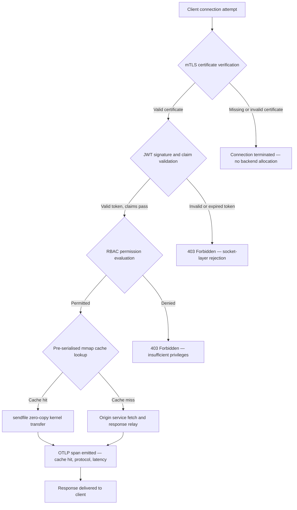

---

# Front Matter (YAML)

author: "contact@sebastienrousseau.com (Sebastien Rousseau)"
banner_alt: "Abstrakcyjny pejzaż nocnego miasta na płytce drukowanej — wizualizacja bankowej krawędzi, gdzie transfery zero-copy na poziomie jądra, uzgodnienia mTLS i walidacja JWT zbiegają się w jednym statycznie zlinkowanym pliku binarnym"
banner_height: "1597"
banner_width: "2584"
banner: "https://cloudcdn.pro/stocks/images/bit-cloud-GlqbGLCPnQ4.webp"
cdn: "https://cloudcdn.pro"
charset: "UTF-8"
cname: "sebastienrousseau.com"
copyright: "© Copyright 2025 - 2026 - Sebastien Rousseau. All rights reserved."
date: "June 20, 2026"
description: "http-handle to statycznie zlinkowany plik binarny Rust, który dostarcza 180 000 żądań na sekundę na bankowej krawędzi z zerowymi zależnościami środowiska uruchomieniowego, zintegrowaną weryfikacją mTLS i JWT, wynegocjowanymi przez ALPN HTTP/2 i HTTP/3 oraz obserwowalnością OTLP — eliminując luki w bezpieczeństwie i odporności pozostawiane przez Nginx i Envoy."
format-detection: "telephone=no"
hreflang: "pl"
icon: "https://cloudcdn.pro/clients/sebastienrousseau/v1/logos/sebastienrousseau.svg"
id: "https://sebastienrousseau.com/2026-06-20-http-handle-zero-dependency-edge-ingress-banking-rust-2026"
image_alt: "Czarno-białe zdjęcie portretowe Sebastiena Rousseau"
image_height: "162"
image_width: "162"
image: "https://cloudcdn.pro/stocks/images/sebastien-rousseau.png"
keywords: "http-handle, Rust edge ingress, proxy bez zależności, infrastruktura bankowa, mTLS JWT, sendfile zero-copy, ALPN HTTP3, zgodność DORA, Bazylea III, obserwowalność OTLP, statyczny plik binarny, ARM64 bankowość, zero trust bankowość, lekki ingress, bezpieczeństwo bankowe Rust"
language: "pl-PL"
last_reviewed: "2026-06-20"
layout: "report"
locale: "pl_PL"
logo_alt: "Logo Sebastiena Rousseau"
logo_height: "44"
logo_width: "44"
logo: "https://cloudcdn.pro/clients/sebastienrousseau/v1/logos/sebastienrousseau.svg"
menu: ""
measurementID: "G-169G4ET5HQ"
name: "Sebastien Rousseau"
permalink: "https://sebastienrousseau.com/2026-06-20-http-handle-zero-dependency-edge-ingress-banking-rust-2026"
rating: "general"
referrer: "no-referrer"
robots: "index, follow"
schema: "FAQPage, Article"
seo_title: "http-handle: Ingress Rust bez zależności dla bankowości przy 180k żądań/s"
short_name: "sebastienrousseau"
subtitle: "Jak jeden statycznie zlinkowany plik binarny Rust dostarcza 180 000 żądań na sekundę z mTLS, JWT i ALPN na bankowej krawędzi — i co oznacza to dla zgodności z DORA i Bazyleą III."
tags: "http-handle, Rust, banking, edge-ingress, mTLS, JWT, ALPN, HTTP3, DORA, Basel-III, zero-copy, sendfile, ARM64, zero-trust, OTLP, observability, open-source, infrastructure"
theme-color: "0, 83, 191"
title: "http-handle: Wysokowydajny Ingress Edge bez Zależności dla Bankowości w 2026"
url: "https://sebastienrousseau.com/2026-06-20-http-handle-zero-dependency-edge-ingress-banking-rust-2026"
viewport: "width=device-width, initial-scale=1, shrink-to-fit=no"

# RSS - The RSS feed front matter (YAML).
atom_link: "https://sebastienrousseau.com/2026-06-20-http-handle-zero-dependency-edge-ingress-banking-rust-2026/rss.xml"
category: "Technology"
docs: https://validator.w3.org/feed/docs/rss2.html
generator: "Static Site Generator (SSG) (version 0.0.40)"
item_description: "http-handle to statycznie zlinkowany plik binarny Rust, który dostarcza 180 000 żądań na sekundę na bankowej krawędzi z zerowymi zależnościami środowiska uruchomieniowego, zintegrowaną weryfikacją mTLS i JWT, wynegocjowanymi przez ALPN HTTP/2 i HTTP/3 oraz obserwowalnością OTLP — eliminując luki w bezpieczeństwie i odporności pozostawiane przez Nginx i Envoy."
item_guid: "https://sebastienrousseau.com/2026-06-20-http-handle-zero-dependency-edge-ingress-banking-rust-2026/rss.xml"
item_link: "https://sebastienrousseau.com/2026-06-20-http-handle-zero-dependency-edge-ingress-banking-rust-2026/rss.xml"
item_pub_date: "Sat, 20 Jun 2026 07:07:07 +0000"
item_title: "http-handle: Wysokowydajny Ingress Edge bez Zależności dla Bankowości w 2026"
last_build_date: "Sat, 20 Jun 2026 07:07:07 +0000"
managing_editor: "contact@sebastienrousseau.com (Sebastien Rousseau)"
pub_date: "Sat, 20 Jun 2026 07:07:07 +0000"
ttl: "60"
type: "article"
webmaster: "contact@sebastienrousseau.com"

# Apple - The Apple front matter (YAML).
apple_mobile_web_app_orientations: "portrait"
apple_touch_icon_sizes: "192x192"
apple-mobile-web-app-capable: "yes"
apple-mobile-web-app-status-bar-inset: "black"
apple-mobile-web-app-status-bar-style: "black-translucent"
apple-mobile-web-app-title: "Bankowa krawędź bez zależności"
apple-touch-fullscreen: "yes"

# MS Application - The MS Application front matter (YAML).

msapplication-navbutton-color: "0, 83, 191"

# Twitter Card - The Twitter Card front matter (YAML).

twitter_card: "summary_large_image"
twitter_creator: "@wwdseb"
twitter_description: "http-handle to statycznie zlinkowany plik binarny Rust, który dostarcza 180 000 żądań na sekundę na bankowej krawędzi z zerowymi zależnościami środowiska uruchomieniowego, mTLS, JWT i obserwowalnością OTLP."
twitter_image: "https://cloudcdn.pro/clients/sebastienrousseau/v1/logos/sebastienrousseau.svg"
twitter_image_alt: "Logo of Sebastien Rousseau"
twitter_site: "@wwdseb"
twitter_title: "http-handle: Ingress Rust bez zależności dla bankowości przy 180k żądań/s"
twitter_url: "https://sebastienrousseau.com/2026-06-20-http-handle-zero-dependency-edge-ingress-banking-rust-2026"

# Humans.txt - The Humans.txt front matter (YAML).
author_website: "https://sebastienrousseau.com"
author_twitter: "@wwdseb"
author_location: "London, UK"
thanks: "Thanks for reading!"
site_last_updated: "2026-06-20"
site_standards: "HTML5, CSS3, RSS, Atom, JSON, XML, YAML, Markdown, TOML"
site_components: "Kaishi, Kaishi Builder, Kaishi CLI, Kaishi Templates, Kaishi Themes"
site_software: "Static Site Generator, Rust"

---

# http-handle: Wysokowydajny Ingress Edge bez Zależności dla Bankowości w 2026

<!-- lead-start -->
<aside class="post-lead" aria-label="Podsumowanie artykułu">

<strong>TL;DR.</strong> http-handle to otwartoźródłowy, statycznie zlinkowany plik binarny Rust, który zastępuje Nginx i Envoy na bankowej krawędzi. Dostarcza 180 000 żądań na sekundę na węzłach ARM64 za pośrednictwem transferów zero-copy <code>sendfile(2)</code> Linuxa, egzekwuje mTLS i walidację JWT na warstwie gniazda sieciowego przed uruchomieniem jakiegokolwiek kodu aplikacji, automatycznie negocjuje HTTP/2 i HTTP/3 przez ALPN oraz wysyła metryki OpenTelemetry natywnie — wszystko bez zależności środowiska uruchomieniowego poza <code>libc</code>.

<strong>Kluczowe wnioski</strong>

<ul class="post-lead-takeaways">
  <li><strong>Problem ciężkich proxy.</strong> Nginx i Envoy niosą drzewa zależności, które poszerzają powierzchnię CVE i komplikują cykle naprawcze ryzyka ICT zgodne z DORA.</li>
  <li><strong>Wydajność zero-copy na dużą skalę.</strong> Wstępnie zserializowane bloki pamięci podręcznej mmap i transfery jądra <code>sendfile(2)</code> utrzymują 180 000 żądań/s na ARM64 z narzutem proxy poniżej milisekundy.</li>
  <li><strong>Bezpieczeństwo na poziomie gniazda, nie aplikacji.</strong> Weryfikacja certyfikatu klienta mTLS, walidacja JWT i ocena RBAC są zakończone przed alokacją jakichkolwiek zasobów backendu dla żądania.</li>
  <li><strong>Wbudowane dostosowanie regulacyjne.</strong> Zmniejszona powierzchnia ataku i audytowalny deployment pojedynczego pliku binarnego bezpośrednio odnoszą się do artykułów 5 i 6 DORA, operacyjnego ryzyka Bazylei III i łańcuchów odpowiedzialności SM&CR.</li>
</ul>

<strong>Powiązane lektury:</strong> <a href="https://sebastienrousseau.com/2026-06-18-noyalib-safe-yaml-rust-ai-mcp-financial-infrastructure-2026">Dlaczego YAML potrzebuje bezpieczniejszego stosu Rust dla AI, MCP i infrastruktury finansowej w 2026</a>, <a href="https://sebastienrousseau.com/2026-06-11-cloudcdn-open-source-blueprint-ai-native-edge-2026">CloudCDN: Otwartoźródłowy plan dla krawędzi natywnej AI w 2026</a>, <a href="https://sebastienrousseau.com/2026-05-16-best-cloud-infrastructure-architecture-2026">Najlepsza architektura infrastruktury chmurowej dla banków i instytucji finansowych w 2026</a>.

</aside>
<!-- lead-end -->

Bankowa krawędź ma problem z zależnościami. Każda instancja Nginx lub Envoy, która kieruje ruchem między klientem a podstawową usługą bankową, niesie ze sobą drzewo zależności: kompilacje OpenSSL, moduły Lua, biblioteki gRPC i warstwy kontenerów — każda potencjalny CVE, każda wymagająca dedykowanego cyklu łatania, każda dodająca wariancję opóźnień komplikującą pomiar SLA. Na mocy [Rozporządzenia o Cyfrowej Odporności Operacyjnej (DORA)](https://eur-lex.europa.eu/eli/reg/2022/2554/oj) ta złożoność jest teraz odpowiedzialnością regulacyjną w takim samym stopniu jak operacyjną.

[http-handle](https://github.com/sebastienrousseau/http-handle) przyjmuje inne podejście. Jest to pojedynczy, statycznie zlinkowany plik binarny Rust z zerowymi zależnościami środowiska uruchomieniowego poza `libc`. Dostarcza 180 000 żądań na sekundę na węzłach ARM64, egzekwuje wzajemne TLS i uwierzytelnianie JWT na warstwie gniazda sieciowego oraz automatycznie negocjuje HTTP/2 i HTTP/3 — wszystko w śladzie wdrożenia poniżej 20 MB pamięci RAM.

## Krótka odpowiedź

**Czym jest http-handle w jednym zdaniu?** http-handle to otwartoźródłowy, statycznie zlinkowany plik binarny Rust, który zastępuje ciężkie kontenery proxy na bankowej krawędzi, dostarczając 180 000 żądań/s na ARM64 za pośrednictwem transferów jądra zero-copy `sendfile(2)` Linuxa, egzekwując mTLS, JWT i RBAC na warstwie gniazda przed dotyknięciem jakichkolwiek zasobów backendu oraz wysyłając natywne metryki [OpenTelemetry](https://opentelemetry.io/) — bez zależności bibliotek środowiska uruchomieniowego poza `libc`.

## Podsumowanie dla kadry kierowniczej

Banki przez dekadę używały Nginx i Envoy na swojej krawędzi. Oba są skuteczne; żaden nie był zaprojektowany dla środowiska regulacyjnego 2026 roku. Obrazy kontenerów nasycone zależnościami generują kolejki CVE, z którymi zespoły ds. zgodności nie mogą nadążyć, a każda aktualizacja wersji biblioteki niesie ryzyko regresji. Artykuły 5 i 6 DORA wymagają, aby ryzyko ICT było zarządzane przez projekt, a nie łatane po wykryciu. Ramy operacyjnego ryzyka Bazylei III penalizują architektury, w których punkty awarii mnożą się wraz ze złożonością systemu.

http-handle eliminuje problem zależności u źródła. Plik binarny jest kompilowany raz, statycznie, bez zewnętrznych wymagań bibliotecznych podczas pracy. Powierzchnia ataku kurczy się do standardowej biblioteki Rust plus `libc`. Egzekwowanie bezpieczeństwa — weryfikacja certyfikatu mTLS, walidacja roszczeń JWT i kontrola dostępu oparta na rolach — jest wykonywane na gnieździe sieciowym przed jakąkolwiek alokacją backendu, sprowadzając granicę Zero Trust do jej najmniejszego możliwego wyrazu. Wydajność wynika z architektury: wstępnie zserializowane bloki pamięci podręcznej mapowane w pamięci połączone z transferami jądra `sendfile(2)` całkowicie usuwają dane ze ścieżki kopiowania CPU-do-pamięci, utrzymując 180 000 żądań/s na sprzęcie ARM64. Rezultatem jest warstwa ingress, która spełnia wymagania odporności DORA, wspiera argumenty redukcji ryzyka operacyjnego Bazylei III i daje starszym liderom IT w ramach SM&CR weryfikowalny, jednoskładnikowy łańcuch odpowiedzialności za infrastrukturę krawędziową.

## Kluczowe wnioski

- **Mniejsze pliki binarne, mniejsze kolejki CVE.** Statycznie zlinkowany pojedynczy plik binarny ma jeden pakiet do łatania, jedno wydanie do walidacji i jeden artefakt do audytu. Nginx ze standardowym zestawem modułów dostarcza ponad 30 zależności bibliotek współdzielonych; każda ma własny cykl życia podatności.
- **Zero-copy to nie optymalizacja — to ograniczenie projektowe.** Przy 180 000 żądaniach/s każda kopia danych w przestrzeni użytkownika wprowadza mierzalną wariancję opóźnień. `sendfile(2)` przenosi zawartość deskryptorów plików do gniazda sieciowego całkowicie w przestrzeni jądra. W połączeniu z blokadami pamięci podręcznej odpowiedzi przypiętymi przez mmap, CPU nigdy nie dotyka ścieżki danych dla buforowanych odpowiedzi.
- **Granica bezpieczeństwa należy do gniazda.** Walidacja JWT i certyfikatów mTLS w oprogramowaniu pośredniczącym aplikacji oznacza, że backend już przydzielił wątki i pamięć przed odrzuceniem żądania. Walidacja na warstwie gniazda zapewnia, że nieuwierzytelnione żądania w ogóle nie zużywają zasobów backendu.
- **OTLP eliminuje lukę obserwowalności.** Natywna integracja OpenTelemetry oznacza, że każde żądanie, każda decyzja uwierzytelniania i każda negocjacja protokołu generuje ustrukturyzowaną telemetrię bez agenta sidecar. Istniejące pulpity nawigacyjne banku pobierają ślady OTLP bezpośrednio.

**Powiązane lektury:** [Dlaczego YAML potrzebuje bezpieczniejszego stosu Rust dla AI, MCP i infrastruktury finansowej w 2026](https://sebastienrousseau.com/2026-06-18-noyalib-safe-yaml-rust-ai-mcp-financial-infrastructure-2026/), [CloudCDN: Otwartoźródłowy plan dla krawędzi natywnej AI w 2026](https://sebastienrousseau.com/2026-06-11-cloudcdn-open-source-blueprint-ai-native-edge-2026/), [Najlepsza architektura infrastruktury chmurowej dla banków i instytucji finansowych w 2026](https://sebastienrousseau.com/2026-05-16-best-cloud-infrastructure-architecture-2026/).

## 01. Problem Ciężkich Proxy w Bankowości

Nginx i Envoy zbudowały krawędź nowoczesnego internetu. Są konfigurowalne, sprawdzone w boju i wspierane przez duże społeczności. Są też wyborami architektonicznymi dokonanymi zanim DORA istniała, zanim ramy operacyjnego ryzyka Bazylei III zażądały wymiernej redukcji złożoności i zanim węzły chmurowe ARM64 zmieniły ekonomię obliczeń wysokiej przepustowości.

Praktyczną konsekwencją jest przepaść między tym, czego banki potrzebują, a tym, co dostarczają ciężkie kontenery proxy.

**Powierzchnia zależności.** Standardowe wdrożenie Envoy wciąga OpenSSL, Abseil, Protobuf, gRPC, Lua i dziesiątki bibliotek wtórnych. Każda ma niezależny cykl życia CVE. Gdy National Vulnerability Database opublikuje krytyczne zalecenie dotyczące OpenSSL, każda instancja Envoy w majątku staje się zegarem zgodności: oceń, załataj, przetestuj, ponownie wdróż i ponownie certyfikuj — w każdym środowisku, w którym działa plik binarny. Na mocy Artykułu 6 DORA banki muszą wykazać, że procesy zarządzania ryzykiem ICT są proporcjonalne, udokumentowane i weryfikowalne. Drzewo zależności wielu bibliotek sprawia, że utrzymanie tego dowodu jest kosztowne.

**Narzut pamięci.** Minimalnie skonfigurowany proces roboczy Nginx zużywa 40–80 MB pamięci rezydentnej przy umiarkowanym obciążeniu. Na dużą skalę — setki węzłów ingress w systemach handlowych, interfejsach API płatności i portalach obsługi klientów — ten narzut kumuluje się w mierzalny koszt infrastruktury bez odpowiadającego korzyści wydajnościowej w porównaniu z dobrze zaprojektowaną alternatywą jednoplikową.

**Szybkość łatania.** Łańcuchy dostaw obrazów kontenerów wprowadzają wielodniowe opóźnienie między publikacją CVE a dotarciem zweryfikowanej łatki do środowiska produkcyjnego. Obraz bazowy musi zostać przebudowany, warstwa aplikacji ponownie nałożona, pełna macierz testów ponownie uruchomiona i potok wdrożenia ponownie wykonany. Dla krytycznych systemów bankowych działających w oknach raportowania incydentów DORA ten cykl jest ryzykiem strukturalnym.

http-handle rozwiązuje wszystkie trzy. Jeden plik binarny. Jedna powierzchnia CVE. Jeden artefakt do łatania. Poniżej 20 MB RAM dla produkcyjnego węzła ingress.

## 02. Obiektyw Architektury http-handle 2026

Plik binarny jest skonstruowany jako pięć współzależnych warstw, każda zaprojektowana w celu wyeliminowania określonej kategorii ryzyka, które gromadzą tradycyjne architektury proxy.

### Tabela 1: Warstwy architektury http-handle i ograniczanie ryzyka

| Warstwa | Decyzja projektowa | Dlaczego ma znaczenie | Ryzyko przy nieprawidłowym zarządzaniu |
| ---- | ---- | ---- | ---- |
| **Rdzeń serwera** | Pojedynczy plik binarny Rust, statycznie zlinkowany, zero zależności poza `libc` | Jeden artefakt do łatania; eliminuje propagację CVE bibliotek w całym majątku | Ataki confusion zależności; akumulacja podatności bibliotek |
| **Silnik akceleracji** | Wstępnie zserializowane bloki pamięci podręcznej mmap i transfery jądra zero-copy `sendfile(2)` | 180 000 żądań/s na ARM64 z narzutem proxy poniżej milisekundy; żadne dane nie wchodzą do przestrzeni użytkownika dla buforowanych odpowiedzi | Wycieki mapowania pamięci; wąskie gardła przestrzeni jądra podczas unieważniania pamięci podręcznej |
| **Bezpieczeństwo kryptograficzne** | Natywny mTLS z obsługą gorącego przeładowania certyfikatów i negocjacją ALPN | Gwarantuje integralność danych i kompatybilność protokołów; rotacja certyfikatów bez upuszczania połączeń | Wygaśnięcie certyfikatu powodujące przestoje usług; słabe domyślne zestawy szyfrów |
| **Warstwa polityki dostępu** | Walidacja JWT i ocena roszczeń RBAC na warstwie gniazda | Nieuwierzytelnione żądania nie zużywają zasobów backendu; Zero Trust egzekwowane na granicy jądra | Ataki confusion algorytmu JWT; błędna konfiguracja RBAC przyznająca zbyt szerokie uprawnienia |
| **Obserwowalność** | Natywna integracja [OpenTelemetry (OTLP)](https://opentelemetry.io/docs/specs/otlp/) | Ustrukturyzowana telemetria bez agentów sidecar; bezpośrednia ingestia do istniejących systemów monitorowania banku | Martwe punkty podczas awarii; niekompletne ślady audytu do raportowania incydentów DORA |

## 03. Kluczowe Sygnały Wydajnościowe i Bezpieczeństwa

Banki obsługujące http-handle na krawędzi muszą instrumentować pięć mierzalnych sygnałów, aby spełnić wymagania sprawozdawczości operacyjnej DORA i wewnętrzne zarządzanie SLA.

### Tabela 2: Benchmarki operacyjne i odwołania regulacyjne

| Sygnał | Benchmark | Odwołanie regulacyjne | Implementacja techniczna |
| ---- | ---- | ---- | ---- |
| **Przepustowość** | ≥ 180 000 żądań/s na węzłach ARM64 przy P99 ≤ 1 ms narzutu proxy | Bazylea III ryzyko operacyjne — redukcja złożoności systemu | `sendfile(2)` + wstępnie zserializowane bloki pamięci podręcznej mmap; bez kopiowania danych przestrzeni użytkownika dla trafień pamięci podręcznej |
| **Powierzchnia ataku** | Zero zależności bibliotek środowiska uruchomieniowego; jeden artefakt binarny na wydanie | [Artykuł 6 DORA](https://eur-lex.europa.eu/eli/reg/2022/2554/oj) — zarządzanie ryzykiem ICT przez projekt | Kompilacja statyczna z `cargo build --release --target aarch64-unknown-linux-musl` |
| **Opóźnienie uwierzytelniania** | Uzgodnienie mTLS + walidacja JWT zakończone przed pierwszym bajtem odpowiedzi backendu | [Artykuł 5 DORA](https://eur-lex.europa.eu/eli/reg/2022/2554/oj) — ochrona bezpieczeństwa ICT | Przechwycenie na warstwie gniazda; ocena roszczeń JWT w Rust sąsiadującym z jądrem przed routingiem backendu |
| **Dostępność certyfikatów** | Gorące przeładowanie certyfikatów mTLS z zerem zerwaných połączeń podczas rotacji | SM&CR odpowiedzialność wyższego kierownictwa za dostępność krawędzi | Obserwator certyfikatów oparty na inotify; atomowa zamiana deskryptora pliku podczas przeładowania |
| **Pokrycie obserwowalności** | 100% żądań generujących zakresy OTLP z wynikiem uwierzytelniania, wersją protokołu i statusem pamięci podręcznej | Artykuł 17 DORA — wykrywanie i raportowanie incydentów | Natywny eksporter OTLP; bez wymaganego sidecar; transport gRPC lub HTTP/Protobuf konfigurowalny |

## 04. Silnik Zero-Copy: mmap i sendfile(2)

Wydajność sieci w bankowości wysokiej częstotliwości — płatności w czasie rzeczywistym, interfejsy API danych rynkowych, usługi tokenów uwierzytelniania — jest ograniczona przez jedno ograniczenie bardziej niż jakiekolwiek inne: koszt przenoszenia bajtów z pamięci masowej do gniazda sieciowego.

Konwencjonalne serwery HTTP odczytują zawartość pliku do bufora przestrzeni użytkownika, a następnie zapisują ten bufor do gniazda. Ta sekwencja wymaga dwóch kopii pamięci i dwóch przełączeń kontekstu między przestrzenią użytkownika a przestrzenią jądra dla każdej odpowiedzi. Przy 180 000 żądaniach na sekundę skumulowany narzut jest znaczny.

http-handle eliminuje obie kopie.

**Bloki pamięci podręcznej mapowane w pamięci.** Po uruchomieniu usługa serializuje statyczną zawartość odpowiedzi do regionów mapowanych w pamięci za pomocą `mmap(2)`. Regiony te są przypięte w pamięci podręcznej stron jądra. Gdy nadchodzi żądanie dotyczące zasobu z pamięci podręcznej, odpowiedź jest już mapowana w pamięci jądra — bez odczytu dysku, bez alokacji bufora.

**Transfer jądra `sendfile(2)`.** Wywołanie systemowe Linux `sendfile(2)` przenosi dane bezpośrednio z deskryptora pliku — lub regionu mapowanego w pamięci — do deskryptora pliku gniazda sieciowego, całkowicie w jądrze. Żaden bajt nie wchodzi do przestrzeni użytkownika. Rola CPU ogranicza się do wydania wywołania systemowego i obsługi zdarzenia zakończenia. Na węzłach ARM64 z tą architekturą http-handle utrzymuje 180 000 żądań/s z narzutem proxy poniżej milisekundy pod stałym obciążeniem.

Dla banków obsługujących uzgodnienia wsadowe na koniec miesiąca, raportowanie płynności śróddziennej lub ruch interfejsów API scoringu fraudów w czasie rzeczywistym, konsekwencja inżynierska jest bezpośrednia: mniej węzłów ARM64 na warstwę ruchu, niższy koszt infrastruktury i mniejsze ryzyko odporności DORA z powodu braków wydajnościowych.

## 05. Warstwa Polityki Dostępu mTLS i JWT

W bankowości uwierzytelnianie na krawędzi to nie funkcja — to wymóg regulacyjny. DORA nakazuje, aby kontrole bezpieczeństwa ICT były proporcjonalne, udokumentowane i weryfikowalne. SM&CR nakłada osobistą odpowiedzialność za decyzje dotyczące bezpieczeństwa infrastruktury na nazwanych starszych menedżerów. Pytanie nie brzmi, czy uwierzytelniać na krawędzi, ale na jakiej warstwie.

http-handle egzekwuje trzyetapową politykę Zero Trust przed alokacją jakichkolwiek zasobów backendu.

**Etap 1: Weryfikacja certyfikatu klienta mTLS.** Podczas uzgodnienia TLS http-handle żąda i waliduje certyfikat klienta względem konfigurowalnego magazynu zaufania. Połączenia bez ważnego certyfikatu kończą się przy uzgodnieniu. Żaden wątek aplikacji nie jest tworzony, żadna pula pamięci nie jest alokowana. Backend nigdy nie widzi żądania.

**Etap 2: Walidacja roszczeń JWT.** Dla połączeń, które przeszły mTLS, http-handle ekstrahuje i waliduje Token Sieciowy JSON z nagłówka `Authorization` na warstwie gniazda. Weryfikacja podpisu, kontrole wygaśnięcia i walidacja wystawcy następują przed dotarciem żądania do warstwy routingu. Ataki confusion algorytmu — gdzie serwer akceptuje algorytm symetryczny, gdy oczekiwany jest klucz asymetryczny — są blokowane przez jawne listy dozwolonych algorytmów w konfiguracji.

**Etap 3: Ocena roszczeń RBAC.** Zwalidowane roszczenia JWT mapują się do tabeli ról w pamięci. Żądania z niewystarczającymi uprawnieniami otrzymują odpowiedź 403 na warstwie polityki dostępu. Usługa backendu nigdy nie jest wywoływana dla nieautoryzowanego ruchu.

To sekwencjonowanie ma znaczenie operacyjne. W tradycyjnym modelu — gdzie uwierzytelnianie jest wykonywane w oprogramowaniu pośredniczącym aplikacji — atakujący może wyczerpać pule wątków backendu nieuwierzytelnionymi żądaniami przed wydaniem pojedynczego odrzucenia. Uwierzytelnianie na warstwie gniazda całkowicie eliminuje ten wektor ataku.

## 06. Routing ALPN i Łańcuch Awaryjny HTTP/3

Ruch bankowy przychodzi przez zróżnicowane warunki sieciowe: korporacyjne łącza światłowodowe dla biurek handlowych, 5G dla klientów bankowości mobilnej, łączność satelitarną dla operacji zdalnych oraz proxy inspekcji TLS w środowiskach regulowanych. Pojedynczy protokół ingress tworzy ograniczenie najniższego wspólnego mianownika.

http-handle używa [Negocjacji Protokołu Warstwy Aplikacji (ALPN)](https://www.rfc-editor.org/rfc/rfc7301), aby automatycznie wybrać optymalny protokół dla każdego połączenia.

**HTTP/2** jest domyślny dla ruchu przeglądarek i interfejsów API przez TCP. Multipleksowane strumienie przez pojedyncze połączenie eliminują blokowanie head-of-line, które HTTP/1.1 wprowadza przy wzorcach równoczesnych żądań.

**HTTP/3 (QUIC)** aktywuje się, gdy sieć obsługuje UDP i klient reklamuje `h3` w swoim rozszerzeniu ALPN. Niezależne multipleksowanie strumieni i migracja połączeń QUIC sprawiają, że jest on materiálně lepszy dla klientów bankowości mobilnej w zatłoczonych sieciach komórkowych, gdzie połączenia TCP często spadają i ponownie łączą się.

**Bezpieczny fallback.** Jeśli negocjacja ALPN nie powiedzie się — ponieważ pośrednie proxy usuwa rozszerzenie lub starszy klient je pomija — http-handle wraca do HTTP/1.1, zachowując wszystkie nagłówki bezpieczeństwa, egzekwowanie mTLS i walidację JWT. Żadna właściwość bezpieczeństwa nie degraduje się podczas fallbacku protokołu.

## 07. Cykl Życia Żądania Zero-Copy

Poniższy diagram pokazuje kompletną ścieżkę żądania od połączenia klienta do dostarczenia odpowiedzi, w tym bramki uwierzytelniania i punkty emisji obserwowalności.

Ścieżka krytyczna dla odpowiedzi z trafienia pamięci podręcznej przechodzi przez trzy bramki bezpieczeństwa i jedno wywołanie systemowe. Żaden bufor przestrzeni użytkownika nie jest alokowany dla treści odpowiedzi. Zakres OTLP przechwytuje wynik uwierzytelniania, wersję protokołu wynegocjowaną przez ALPN, status pamięci podręcznej i opóźnienie end-to-end w jednym ustrukturyzowanym rekordzie.

## 08. Dostosowanie Regulacyjne: DORA, Bazylea III i SM&CR

### Artykuły 5 i 6 DORA — Zarządzanie ryzykiem ICT i ochrona

[Artykuł 5 DORA](https://eur-lex.europa.eu/eli/reg/2022/2554/oj) wymaga od podmiotów finansowych utrzymywania ram zarządzania ryzykiem ICT. Artykuł 6 wymaga od nich wdrożenia środków ochrony i zapobiegania proporcjonalnych do profilu ryzyka ich systemów ICT.

Statycznie zlinkowany pojedynczy plik binarny spełnia oba wymagania skuteczniej niż wielopoziomowy stos kontenerów bibliotecznych. Powierzchnia ataku jest kwantyfikowalna — jeden artefact, jedna zależność (`libc`), jedna powierzchnia CVE — a środki ochrony są strukturalne, a nie proceduralne: egzekwowania mTLS i JWT nie można obejść przez błędną konfigurację, ponieważ są wykonywane na warstwie gniazda przed uruchomieniem jakiejkolwiek konfigurowalnej logiki aplikacji.

### Bazylea III — Wymogi kapitałowe z tytułu ryzyka operacyjnego

[Ramy ryzyka operacyjnego Bazylei III](https://www.bis.org/bcbs/basel3.htm) wiążą wymogi kapitałowe regulacyjne z wykazalną redukcją ryzyka. Banki, które mogą udokumentować mierzalny spadek złożoności systemu i liczby punktów awarii ICT, mają kwantyfikowalny argument za zmniejszoną alokacją kapitału na ryzyko operacyjne. Zastąpienie wielokontenerowego majątku proxy węzłami ingress z pojedynczym plikiem binarnym to dokładnie tego rodzaju redukcja złożoności, która wspiera ten argument — pod warunkiem, że zespół inżynierski może dostarczyć dokumentację atestacyjną.

Auditowalne artefakty wydań http-handle — reprodukowalne kompilacje, manifesty zależności kompatybilne z SBOM i operacyjne dzienniki oparte na OTLP — wspierają łańcuch dokumentacji wymagany przez dyskusje kapitałowe Bazylei III.

### SM&CR — Odpowiedzialność starszego menedżera

[Reżim Starszych Menedżerów i Certyfikacji (SM&CR)](https://www.fca.org.uk/firms/senior-managers-certification-regime) nakłada osobistą odpowiedzialność na nazwanych starszych menedżerów za stan bezpieczeństwa ICT systemów objętych ich odpowiedzialnością. Pojedynczy plik binarny ingress, który gorąco przeładowuje certyfikaty bez przerwy w działaniu usługi, generuje ustrukturyzowane dzienniki audytu przez OTLP i ma jeden wersjonowany artefakt na wdrożenie, daje nazwanym starszym menedżerom weryfikowalny, dokumentowalny łańcuch bezpieczeństwa. Wielopoziomowy stos kontenerów bibliotecznych tego nie zapewnia.

## 09. Co To Oznacza Według Roli

### Zarząd i dyrektorzy generalni

Optymalizacja kapitału regulacyjnego w ramach ryzyka operacyjnego Bazylei III zależy od wykazalnej redukcji złożoności. Zastąpienie Nginx lub Envoy pojedynczym statycznie zlinkowanym plikiem binarnym zmniejsza liczbę punktów awarii ICT w sposób audytowalny i prezentowany nadzorcom ostrożnościowym. Zmniejszona powierzchnia CVE wspiera również renegocjację składek ubezpieczeń cybernetycznych — ubezpieczyciele wyceniają na podstawie wykazalnych wskaźników powierzchni ataku, a plik binarny ingress z jedną zależnością to konkretny punkt danych.

### Dyrektorzy ds. bezpieczeństwa informacji i dyrektorzy ds. ryzyka

Zgodność z DORA wymaga, aby środki ochrony ICT były proporcjonalne i weryfikowalne. Egzekwowanie mTLS i JWT na warstwie gniazda zapewnia weryfikowalną, nieomijającą bramkę uwierzytelniania na krawędzi. Gorąca rotacja certyfikatów eliminuje ryzyko okna serwisowego, które niosą tradycyjne aktualizacje certyfikatów. Model kompilacji bez zależności oznacza, że gdy zostanie opublikowane krytyczne zalecenie dotyczące `libc`, cały majątek może zostać przebudowany, przetestowany i ponownie wdrożony z jednego artefaktu źródłowego Rust w godzinach, a nie dniach.

### Inżynieria i zarządzanie IT

180 000 żądań/s na standardowym węźle ARM64 zmienia rozmowę o wymiarowaniu infrastruktury dla interfejsów API płatności i usług uwierzytelniania. Natywna integracja OTLP eliminuje potrzebę eksporterów Prometheus, agentów sidecar lub niestandardowych nadajników logów. Model wdrożenia Kubernetes to standardowy pod — poniżej 20 MB pamięci RAM, bez uprzywilejowanych uprawnień kontenera, bez dostępu do sieci hosta. Gorące przeładowanie certyfikatów działa bez narzutu restartu kroczącego Kubernetes.

## FAQ

**Jak http-handle obsługuje rotację certyfikatów pod obciążeniem?**
Plik binarny monitoruje ścieżki plików certyfikatów za pomocą obserwatora inotify. Po wykryciu nowych plików certyfikatów i klucza wykonuje atomową zamianę aktywnego kontekstu TLS — istniejące połączenia kończą się przy użyciu poprzedniego certyfikatu, podczas gdy nowe połączenia natychmiast używają obróconego. Żadne połączenie nie jest przerywane. Nie jest wymagane okno serwisowe.

**Czy http-handle może działać wewnątrz klastra Kubernetes jako kontroler ingress?**
Tak. Plik binarny działa jako samodzielny pod ze standardową adnotacją usługi ingress. Wymagania dotyczące zasobów wynoszą poniżej 20 MB pamięci RAM przy pełnej przepustowości, bez uprzywilejowanych uprawnień kontenera i bez wymogu dostępu do sieci hosta. Może również działać jako sidecar w siatkach usług, gdzie egzekwowanie mTLS na warstwie sidecar jest preferowane nad scentralizowanym uwierzytelnianiem bramy.

**Jaki jest mierzalny wkład opóźnienia samego proxy?**
Dla odpowiedzi z trafienia pamięci podręcznej narzut proxy — od akceptacji gniazda do zakończenia `sendfile(2)` — wynosi poniżej milisekundy na sprzęcie ARM64. Dla odpowiedzi z pominięcia pamięci podręcznej wymagających pobrania z upstream, narzut to ta sama wartość poniżej milisekundy plus czas odpowiedzi origin. Sam proxy nie dodaje opóźnienia kolejkowania, ponieważ uwierzytelnianie odbywa się synchronicznie na warstwie gniazda bez alokacji puli wątków przed zakończeniem walidacji poświadczeń.

**Jak http-handle pasuje do architektury Zero Trust obok istniejącej bramy API?**
http-handle działa na granicy warstwy OSI 4/7: egzekwuje mTLS warstwy transportowej i waliduje JWT warstwy aplikacji przed routingiem do usług upstream. Może siedzieć przed pełną bramą API — absorbując nieuwierzytelniony ruch zanim dotrze do droższej warstwy przetwarzania bramy — lub całkowicie zastąpić bramę dla usług, których polityka dostępu jest w pełni wyrażalna w roszczeniach JWT.

**Czy wynik binarny jest reprodukowalny do celów audytu łańcucha dostaw?**
Tak. Kompilacja jest reprodukowalna z przypiętą wersją łańcucha narzędzi Rust i zablokowanym `Cargo.lock`. Generowanie SBOM za pośrednictwem `cargo cyclonedx` tworzy bill of materials zgodny z CycloneDX dla każdego wydania. Oba artefakty mogą być publikowane do wewnętrznego łańcucha narzędzi analizy składu oprogramowania banku i spełniają wymagania dokumentacji ryzyka łańcucha dostaw DORA.

## Podsumowanie

Bankowa krawędź nie potrzebuje więcej funkcji — potrzebuje mniej komponentów, każdy robiący mniej i robiący to w sposób weryfikowalny. http-handle redukuje warstwę ingress do jej nieredukowalnego minimum: jeden plik binarny Rust, który egzekwuje uwierzytelnianie na gnieździe, przenosi dane bez ich kopiowania i raportuje wszystko, co robi, w ustrukturyzowanej telemetrii. Dla banków navigujących terminami zgodności z DORA, przeglądami optymalizacji kapitału Bazylei III i wymaganiami odpowiedzialności SM&CR, ta prostota to nie preferencja inżynieryjna — to argument regulacyjny.

[Kod źródłowy http-handle](https://github.com/sebastienrousseau/http-handle) jest dostępny na podwójnej licencji MIT i Apache 2.0.

---

*Odniesienia*

Basel Committee on Banking Supervision (2011). *Basel III: A global regulatory framework for more resilient banks and banking systems*. Bank for International Settlements. Available at: [https://www.bis.org/publ/bcbs189.pdf](https://www.bis.org/publ/bcbs189.pdf)

European Parliament and Council (2022). Regulation (EU) 2022/2554 on digital operational resilience for the financial sector (DORA). Available at: [https://eur-lex.europa.eu/legal-content/EN/TXT/?uri=CELEX:32022R2554](https://eur-lex.europa.eu/legal-content/EN/TXT/?uri=CELEX:32022R2554)

Financial Conduct Authority (2015). *Senior Managers and Certification Regime (SM&CR)*. Available at: [https://www.fca.org.uk/firms/senior-managers-certification-regime](https://www.fca.org.uk/firms/senior-managers-certification-regime)

Internet Engineering Task Force (2014). *RFC 7301: Transport Layer Security (TLS) Application-Layer Protocol Negotiation Extension*. Available at: [https://www.rfc-editor.org/rfc/rfc7301](https://www.rfc-editor.org/rfc/rfc7301)

OpenTelemetry Authors (2024). *OpenTelemetry Protocol Specification (OTLP)*. Available at: [https://opentelemetry.io/docs/specs/otlp/](https://opentelemetry.io/docs/specs/otlp/)
