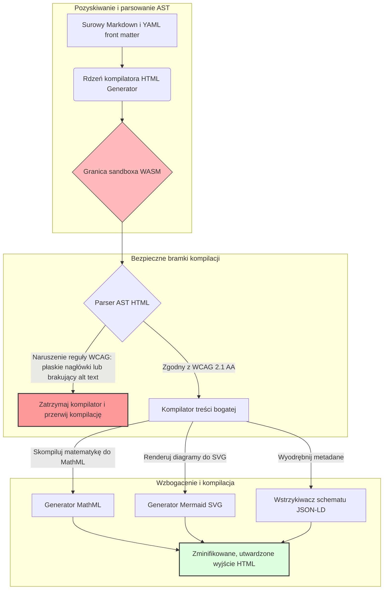

---

# Front Matter (YAML)

author: "contact@sebastienrousseau.com (Sebastien Rousseau)"
banner_alt: "Geometria architektoniczna w strukturalnym świetle — symbol roli HTML Generator jako skompilowanego potoku Markdown-to-HTML dla dostępnej, zoptymalizowanej pod SEO i odizolowanej infrastruktury publikowania"
banner_height: "1597"
banner_width: "2584"
banner: "https://cloudcdn.pro/stocks/images/markus-winkler-IrRbSND5EUc-unsplash-1200.webp"
cdn: "https://cloudcdn.pro"
charset: "UTF-8"
cname: "sebastienrousseau.com"
copyright: "© Copyright 2025 - 2026 - Sebastien Rousseau. All rights reserved."
date: "June 20, 2026"
description: "HTML Generator to biblioteka Rust, która przekształca Markdown w HTML zgodny z WCAG, gotowy pod SEO i wzbogacony o JSON-LD — dostępność jako kod, obsługa MathML i Mermaid oraz sandboxowa egzekucja WebAssembly dla bezpiecznego publikowania korporacyjnego."
format-detection: "telephone=no"
hreflang: "pl"
icon: "https://cloudcdn.pro/clients/sebastienrousseau/v1/logos/sebastienrousseau.svg"
id: "https://sebastienrousseau.com/2026-06-20-html-generator-accessible-seo-structured-markdown-rust-2026"
image_alt: "Czarno-białe zdjęcie portretowe Sebastiena Rousseau"
image_height: "162"
image_width: "162"
image: "https://cloudcdn.pro/stocks/images/sebastienrousseau.webp"
keywords: "html-generator, Rust Markdown do HTML, dostępność jako kod, WCAG 2.1 AA, HTML gotowy pod SEO, JSON-LD, MathML, Mermaid, WebAssembly, EAA, DORA, ADA Title III, dostępne publikowanie, sandboxowe parsowanie, open source"
language: "pl-PL"
last_reviewed: "2026-06-20"
layout: "report"
locale: "pl_PL"
logo_alt: "Logo Sebastiena Rousseau"
logo_height: "44"
logo_width: "44"
logo: "https://cloudcdn.pro/clients/sebastienrousseau/v1/logos/sebastienrousseau.svg"
menu: ""
measurementID: "G-169G4ET5HQ"
name: "Sebastien Rousseau"
permalink: "https://sebastienrousseau.com/2026-06-20-html-generator-accessible-seo-structured-markdown-rust-2026"
rating: "general"
referrer: "no-referrer"
robots: "index, follow"
schema: "FAQPage, Article"
seo_title: "Dostępność jako kod: Markdown do HTML AAA z Rust w 2026"
short_name: "sebastienrousseau"
subtitle: "Transformacja korporacyjnego publikowania w sieci, dokumentacji produktowej i portali klienckich — od niedostępnych plików tekstowych do wysoce ustrukturyzowanych, zgodnych z regulacjami i odizolowanych zasobów cyfrowych."
tags: "html-generator, Rust, Markdown, dostępność, WCAG, SEO, JSON-LD, MathML, Mermaid, WebAssembly, EAA, DORA, ADA, AI-discovery, RAG, open source, infrastruktura bankowa"
theme-color: "0, 83, 191"
title: "Przekształcanie Markdown w dostępny, zoptymalizowany pod SEO i ustrukturyzowany HTML z Rust w 2026"
url: "https://sebastienrousseau.com/2026-06-20-html-generator-accessible-seo-structured-markdown-rust-2026"
viewport: "width=device-width, initial-scale=1, shrink-to-fit=no"

# RSS - The RSS feed front matter (YAML).
atom_link: "https://sebastienrousseau.com/2026-06-20-html-generator-accessible-seo-structured-markdown-rust-2026/rss.xml"
category: "Technology"
docs: https://validator.w3.org/feed/docs/rss2.html
generator: "Static Site Generator (SSG) (version 0.0.40)"
item_description: "HTML Generator to biblioteka Rust, która przekształca Markdown w HTML zgodny z WCAG, gotowy pod SEO i wzbogacony o JSON-LD — dostępność jako kod, obsługa MathML i Mermaid oraz sandboxowa egzekucja WebAssembly dla bezpiecznego publikowania korporacyjnego."
item_guid: "https://sebastienrousseau.com/2026-06-20-html-generator-accessible-seo-structured-markdown-rust-2026/rss.xml"
item_link: "https://sebastienrousseau.com/2026-06-20-html-generator-accessible-seo-structured-markdown-rust-2026/rss.xml"
item_pub_date: "Sat, 20 Jun 2026 06:06:06 +0000"
item_title: "Przekształcanie Markdown w dostępny, zoptymalizowany pod SEO i ustrukturyzowany HTML z Rust w 2026"
last_build_date: "Sat, 20 Jun 2026 06:06:06 +0000"
managing_editor: "contact@sebastienrousseau.com (Sebastien Rousseau)"
pub_date: "Sat, 20 Jun 2026 06:06:06 +0000"
ttl: "60"
type: "article"
webmaster: "contact@sebastienrousseau.com"

# Apple - The Apple front matter (YAML).
apple_mobile_web_app_orientations: "portrait"
apple_touch_icon_sizes: "192x192"
apple-mobile-web-app-capable: "yes"
apple-mobile-web-app-status-bar-inset: "black"
apple-mobile-web-app-status-bar-style: "black-translucent"
apple-mobile-web-app-title: "Markdown do HTML AAA z Rust"
apple-touch-fullscreen: "yes"

# MS Application - The MS Application front matter (YAML).

msapplication-navbutton-color: "0, 83, 191"

# Twitter Card - The Twitter Card front matter (YAML).

twitter_card: "summary_large_image"
twitter_creator: "@wwdseb"
twitter_description: "HTML Generator to biblioteka Rust, która przekształca Markdown w HTML zgodny z WCAG, gotowy pod SEO i wzbogacony o JSON-LD — dostępność jako kod, obsługa MathML i Mermaid oraz sandboxowa egzekucja WebAssembly dla bezpiecznego publikowania korporacyjnego."
twitter_image: "https://cloudcdn.pro/clients/sebastienrousseau/v1/logos/sebastienrousseau.svg"
twitter_image_alt: "Logo Sebastiena Rousseau"
twitter_site: "@wwdseb"
twitter_title: "Dostępność jako kod: Markdown do HTML AAA z Rust"
twitter_url: "https://sebastienrousseau.com/2026-06-20-html-generator-accessible-seo-structured-markdown-rust-2026"

# Humans.txt - The Humans.txt front matter (YAML).
author_website: "https://sebastienrousseau.com"
author_twitter: "@wwdseb"
author_location: "London, UK"
thanks: "Dziękujemy za lekturę!"
site_last_updated: "2026-06-20"
site_standards: "HTML5, CSS3, RSS, Atom, JSON, XML, YAML, Markdown, TOML"
site_components: "Kaishi, Kaishi Builder, Kaishi CLI, Kaishi Templates, Kaishi Themes"
site_software: "Static Site Generator, Rust"

---

# Przekształcanie Markdown w dostępny, zoptymalizowany pod SEO i ustrukturyzowany HTML z Rust w 2026

<!-- lead-start -->
<aside class="post-lead" aria-label="Streszczenie artykułu">

<strong>TL;DR.</strong> HTML Generator to czysty kompilator Markdown-to-HTML napisany w Rust, który wymusza WCAG 2.1 AA na etapie kompilacji, wstrzykuje zgodny ze schematem JSON-LD, natywnie renderuje MathML i Mermaid SVG oraz izoluje parsowanie wewnątrz sandboxa WebAssembly — przekształcając publikowanie w bramkowaną kompilacją płaszczyznę kontroli dla dostępności, SEO i bezpieczeństwa ICT.

<strong>Kluczowe wnioski</strong>

<ul class="post-lead-takeaways">
  <li><strong>Szybka odpowiedź.</strong> Czym jest HTML Generator w jednym zdaniu?</li>
  <li><strong>Streszczenie wykonawcze.</strong> Renderowanie Markdown wydaje się trywialne; uzyskanie HTML na poziomie produkcyjnym to problem zgodności z regulacjami.</li>
  <li><strong>01. Dlaczego kompilator HTML ukierunkowany na dostępność ma znaczenie w 2026 roku.</strong> EAA i ADA Title III przesunęły dostępność z higieny inżynierskiej do odpowiedzialności powierniczej.</li>
  <li><strong>02. Architektura HTML Generator w 2026 roku.</strong> Wieloetapowy, bramkowany kompilacją potok od surowego Markdown do utwardzonego wyjścia HTML.</li>
</ul>

<strong>Powiązane artykuły:</strong> <a href="https://sebastienrousseau.com/2026-06-18-noyalib-safe-yaml-rust-ai-mcp-financial-infrastructure-2026">Dlaczego YAML potrzebuje bezpieczniejszego stosu Rust dla AI, MCP i infrastruktury finansowej w 2026 roku</a>, <a href="https://sebastienrousseau.com/2026-06-17-static-site-generator-secure-default-ai-era-publishing-2026">Bezpieczny domyślnie Static Site Generator dla publikowania w erze AI w 2026 roku</a>, <a href="https://sebastienrousseau.com/2026-06-11-cloudcdn-open-source-blueprint-ai-native-edge-2026">CloudCDN: Open-Source Blueprint dla natywnej AI w 2026 roku</a>.

</aside>
<!-- lead-end -->

W 2026 roku treści internetowe są przetwarzane przez crawler'y wyszukiwarek AI, wyszukiwarki oparte na LLM i potoki Retrieval-Augmented Generation (RAG) w równym stopniu, co przez ludzkich czytelników. Płaski lub zdeformowany HTML zakłóca parsowanie przez crawlery, czyniąc korporacyjne badania i dokumentację niewidocznymi dla nowoczesnych paradygmatów wyszukiwania — a brak zgodności z rygorystycznymi globalnymi regulacjami, takimi jak [Europejski Akt o Dostępności (EAA)](https://www.accessibility-act.eu/) i [US ADA Title III](https://www.ada.gov/topics/title-iii/), stanowi jednoznaczną odpowiedzialność cywilną. [HTML Generator](https://github.com/sebastienrousseau/html-generator) to wysokowydajna biblioteka Rust zaprojektowana, aby wypełnić te luki — na poziomie kompilatora, nie w łatkach po wdrożeniu.

## Szybka odpowiedź

**Czym jest HTML Generator w jednym zdaniu?** HTML Generator to otwartoźródłowy, czysty kompilator Markdown-to-HTML napisany w Rust, który wymusza [WCAG 2.1 AA](https://www.w3.org/TR/WCAG21/) na etapie kompilacji, automatycznie generuje semantyczne punkty orientacyjne i atrybuty ARIA, wstrzykuje zgodne ze schematem metadane [JSON-LD](https://json-ld.org/) z nagłówka YAML front matter, renderuje diagramy Mermaid i matematykę do dostępnych SVG i MathML oraz działa wewnątrz sandboxa [WebAssembly](https://webassembly.org/) — przekształcając korporacyjne publikowanie w bramkowaną kompilacją, powierniczo-jakościową płaszczyznę kontroli.

## Streszczenie wykonawcze

Renderowanie Markdown wydaje się trywialne. HTML na poziomie produkcyjnym to problem zgodności z regulacjami. W czerwcu 2026 roku każdy punkt kontaktu korporacyjnego — portale relacji inwestorskich, zgłoszenia regulacyjne, dokumentacja kliencka, referencje API, zasoby marketingowe — jest parsowany zarówno przez ludzi, jak i maszyny. Na każdej stronie zderzają się dwa naciski: [EAA](https://www.accessibility-act.eu/) i [ADA Title III](https://www.ada.gov/topics/title-iii/) czynią dostępność prawnym zagrożeniem na poziomie zarządu, podczas gdy pozyskiwanie danych przez AI i potoki RAG premiują ustrukturyzowane, czytelne maszynowo wyjście. Standardowe biblioteki Markdown produkują płaski HTML, który nie spełnia żadnego z tych wymogów. HTML Generator traktuje generowanie dokumentów jako potok bramkowany kompilacją: walidacja WCAG jest błędem kompilacji, JSON-LD pochodzi z nagłówka YAML front matter bez ręcznego oznaczania, MathML i Mermaid renderują się dostępnie, a cały silnik jest dostarczany jako cel WebAssembly — dzięki czemu parsowanie niezaufanych dokumentów pozostaje w sandboxie odizolowanym od hosta.

## Kluczowe wnioski

- **Dostępność jako kod to nowa linia bazowa.** EAA nakłada obowiązki dostępności dla konsumenckich usług cyfrowych. HTML Generator ocenia drzewo dokumentu na etapie kompilacji, automatycznie generując semantyczne punkty orientacyjne i atrybuty ARIA — mniej poprawek po wdrożeniu, mniejsze budżety na rekompensaty, żaden brakujący alt-text nie trafia do produkcji.
- **Dane strukturalne dla wykrywalności AI.** Nowoczesne wyszukiwanie i RAG zależy od metadanych czytelnych maszynowo. Kompilator parsuje YAML front matter i wstrzykuje [JSON-LD zgodny ze Schema.org](https://schema.org/) bezpośrednio do nagłówka dokumentu, czyniąc treść w pełni interpretowalną przez [Google Rich Results](https://developers.google.com/search/docs/appearance/structured-data/intro-structured-data), [Bing Webmaster](https://www.bing.com/webmasters) i crawlery oparte na LLM.
- **Doskonałość treści technicznych.** Publikowanie techniczne to nie płaski tekst. HTML Generator kompiluje surowe rozszerzenia matematyczne Markdown do dostępnego [MathML](https://www.w3.org/Math/) i renderuje diagramy [Mermaid.js](https://mermaid.js.org/) do responsywnych SVG — zachowując strukturę zgodną z WCAG zamiast degradować do nieprzezroczystych obrazów.
- **Sandboxowanie WebAssembly.** Parsowanie niezaufanego Markdown stanowi zagrożenie bezpieczeństwa. Poprzez targetowanie [WASM](https://webassembly.org/), HTML Generator wykonuje się wewnątrz izolowanego sandboxa, który zapobiega arbitralnemu wykonaniu kodu i chroni system hosta — bezpośrednio spełniając obowiązki bezpieczeństwa ICT wynikające z [DORA Article 6](https://eur-lex.europa.eu/legal-content/EN/TXT/?uri=CELEX%3A32022R2554).
- **Ochrona powiernicza dla zarządów.** Niezgodność techniczna weszła do sal zarządów. Standaryzacja na silniku HTML bramkowanym kompilacją chroni dyrektorów i wyższe kierownictwo przed osobistą odpowiedzialnością cywilną i regulacyjną wynikającą z DORA, EAA i ADA Title III.

**Powiązane artykuły:** [Dlaczego YAML potrzebuje bezpieczniejszego stosu Rust dla AI, MCP i infrastruktury finansowej w 2026 roku](https://sebastienrousseau.com/2026-06-18-noyalib-safe-yaml-rust-ai-mcp-financial-infrastructure-2026/), [Bezpieczny domyślnie Static Site Generator dla publikowania w erze AI w 2026 roku](https://sebastienrousseau.com/2026-06-17-static-site-generator-secure-default-ai-era-publishing-2026/), [CloudCDN: Open-Source Blueprint dla natywnej AI w 2026 roku](https://sebastienrousseau.com/2026-06-11-cloudcdn-open-source-blueprint-ai-native-edge-2026/).

## 01. Dlaczego kompilator HTML ukierunkowany na dostępność ma znaczenie w 2026 roku

Korporacyjne zasoby internetowe, biblioteki dokumentacji i centra pomocy produktowej stanowią krytyczne cyfrowe punkty kontaktu. Podlegają teraz dwóm intensywnym, przecinającym się naciskom.

Pierwszy to **pozyskiwanie danych i wykrywalność przez AI**. Treści są coraz częściej przetwarzane przez duże modele językowe i potoki Retrieval-Augmented Generation. Płaski lub zdeformowany HTML dezorientuje parsowanie crawlerów, czyniąc korporacyjne badania i dokumentację niewidocznymi dla nowoczesnych paradygmatów wyszukiwania — w tym [Google Search Generative Experience](https://blog.google/products/search/generative-ai-search/), przeglądania przez [ChatGPT](https://chat.openai.com/) i korporacyjnych agentów RAG.

Drugi to **rygorystyczne globalne prawo dostępności**. Na mocy [Europejskiego Aktu o Dostępności](https://www.accessibility-act.eu/) (w pełni obowiązującego od czerwca 2025 roku) i [US ADA Title III](https://www.ada.gov/topics/title-iii/), korporacyjne platformy publikowania muszą gwarantować pełną cyfrową dostępność. Brak spełnienia wymogów [WCAG 2.1 AA](https://www.w3.org/TR/WCAG21/) nie jest już błędem inżynierskim — jest odpowiedzialnością cywilną i regulacyjną, która skutkuje ugodami opiewającymi na miliony dolarów.

[HTML Generator](https://github.com/sebastienrousseau/html-generator) bezpośrednio odpowiada na oba te naciski. To bezpieczna wątkowo biblioteka Rust zaprojektowana do transformacji Markdown w dostępny, zoptymalizowany pod SEO, ustrukturyzowany HTML. Traktując generowanie dokumentów jako potok bramkowany kompilacją, silnik dostarcza wysoki **Return on Resilience (RoR)** — chroniąc bilanse przed postępowaniami z tytułu dostępności, jednocześnie maksymalizując czytelność maszynową dla wykrywalności przez AI.

## 02. Architektura HTML Generator w 2026 roku

Framework jest zaprojektowany jako bezpieczny, wieloetapowy potok kompilacji, który przekształca surowy tekst Markdown w kryptograficznie zweryfikowane, wysoce dostępne zasoby statyczne.

### Tabela 1: Warstwy architektury HTML Generator i ograniczanie ryzyka

| Warstwa | Decyzja projektowa | Dlaczego ma znaczenie | Ryzyko przy nieprawidłowej obsłudze |
| ---- | ---- | ---- | ---- |
| **Warstwa wejściowa** | Parser Markdown i YAML front matter | Spotyka autorów tam, gdzie pracują; oddziela prozę od metadanych strukturalnych. | Niespójne metadane, uszkodzone mapy stron, luki w indeksowaniu. |
| **Warstwa strukturalna** | Automatyczny spis treści i semantyczne punkty orientacyjne z tagami ARIA | Tworzy nawigowalne, dostępne drzewa dokumentów przez konstrukcję. | Płaski HTML, który łamie czytniki ekranu i narusza WCAG. |
| **Warstwa treści bogatej** | Natywne renderowanie MathML i Mermaid.js SVG | Kompiluje formuły i diagramy do dostępnych SVG i MathML. | Opóźnienie renderowania JS po stronie klienta i uszkodzone wyjście dla technologii wspomagających. |
| **Warstwa SEO i danych** | Zintegrowane generowanie JSON-LD i metadanych strukturalnych | Wstrzykuje zgodny z [Schema.org](https://schema.org/) JSON-LD bezpośrednio do nagłówka. | Błędna interpretacja autora, kontekstu i licencjonowania przez wyszukiwarki i crawlery AI. |
| **Warstwa środowiska uruchomieniowego** | Natywny kompilator Rust z celem WebAssembly | Umożliwia bezpieczne, sandboxowe wykonanie na serwerach, węzłach brzegowych i w przeglądarkach. | Arbitralne wykonanie kodu podczas parsowania niezaufanego Markdown. |

## 03. Kluczowe sygnały bezpieczeństwa sieci i dostępności

Aby zweryfikować, że publicznie dostępne zasoby publikowania spełniają nowoczesne audyty regulacyjne i bezpieczeństwa, dyrektorzy ds. technologii muszą monitorować konkretne, mierzalne wskaźniki.

### Tabela 2: Sygnały bezpieczeństwa sieci i dostępności

| Sygnał | Wskaźnik / benchmark operacyjny | Odniesienie EAA / DORA / W3C | Implementacja techniczna |
| ---- | ---- | ---- | ---- |
| **Zgodność z dostępnością** | 100% skompilowanych stron zwalidowanych względem reguł WCAG 2.1 AA. | [EAA](https://www.accessibility-act.eu/) i [ADA Title III](https://www.ada.gov/topics/title-iii/) | Parser HTML na etapie kompilacji oceniający tagi alt obrazów i semantyczne punkty orientacyjne. |
| **Sandbox wykonania WASM** | 100% niezaufanych danych wejściowych Markdown skompilowanych w izolowanym środowisku uruchomieniowym WebAssembly. | [DORA Article 6](https://eur-lex.europa.eu/legal-content/EN/TXT/?uri=CELEX%3A32022R2554) (bezpieczeństwo ICT) | Izolacja środowiska parsowania od serwera hosta. |
| **Pokrycie metadanymi strukturalnymi** | 100% opublikowanych artykułów wstrzykniętych z ważnymi, zgodnymi ze schematem nagłówkami JSON-LD. | Specyfikacje [Schema.org](https://schema.org/) | Automatyczne parsowanie front matter i konwersja do obiektów JSON-LD. |
| **Przepustowość kompilacji** | Docelowa liczba stron na sekundę powyżej 10 000 na sprzęcie klasy commodity. | Return on Resilience (RoR) | Wysoce zrównoleglony kompilator AST Rust. |
| **Weryfikacja rich snippet** | Zero błędów parsowania w testach [Google Rich Results](https://search.google.com/test/rich-results) i [Schema validator](https://validator.schema.org/). | Wytyczne Google Search | Strukturalna walidacja wygenerowanego JSON-LD podczas potoku kompilacji. |

## 04. Mit prostego renderowania Markdown

Powszechnym błędem wśród menedżerów technologii jest przekonanie, że konwersja Markdown do HTML to proste ćwiczenie zastępowania tekstu. Wiele standardowych bibliotek przekłada formatowanie Markdown na płaski, nieustrukturyzowany HTML. Wyjście renderuje się dla wzrokowego czytelnika w przeglądarce, ale stanowi pułapkę zgodności z regulacjami.

Płaskiemu HTML z reguły brakuje trzech rzeczy.

1. **Prawidłowych hierarchii nagłówków.** Standardowy Markdown nie wymusza kolejności nagłówków. Przejście z `<h1>` do `<h4>` narusza WCAG 2.1 AA i łamie nawigację po dokumencie dla czytników ekranu.
2. **Jawnej semantyki tabel.** Standardowe tabele Markdown rzadko są renderowane z prawidłowymi zakresami `<th>` i atrybutami `<tbody>` wymaganymi do dostępnego parsowania.
3. **Metadanych czytelnych maszynowo.** Standardowy HTML pozbawiony jest haków JSON-LD, od których zależą nowoczesne platformy wyszukiwania AI i systemy pozyskiwania RAG.

HTML Generator rozwiązuje ten problem, parsując Markdown do **Abstract Syntax Tree (AST)**. Silnik ocenia strukturę dokumentu przed emisją HTML, walidując zagnieżdżanie nagłówków, wstrzykując odpowiednie atrybuty ARIA i upewniając się, że każdy zasób multimedialny niesie tekst alternatywny — przekształcając dostępność z ręcznego audytu w zagwarantowany niezmiennik czasu kompilacji.

## 05. Projektowanie potoku kompilacji dostępności jako kodu

Aby zapobiec dotarciu niedostępnych lub niezaindeksowanych zasobów do publicznego wdrożenia, dostępność musi stanowić ścisłą bramkę kompilatora. Poniższy potok pokazuje, jak HTML Generator ocenia Markdown, uruchamia walidację izolowaną WebAssembly i emituje utwardzony, ustrukturyzowany HTML.

## 06. Podręcznik zarządu i odpowiedzialność powiernicza

Nowoczesna dostępność i zgodność z bezpieczeństwem sieci to kwestie zarządów niepodlegające negocjacjom. Wyższe kierownictwo musi podchodzić do infrastruktury publikowania przez pryzmat ryzyka prawnego, ochrony finansowej i narażenia regulacyjnego.

- **Europejski Akt o Dostępności (EAA).** Nakłada bezpośrednie, prawnie wiążące mandaty zgodności na publiczne i prywatne portale cyfrowe. Niezgodność może skutkować dotkliwymi karami finansowymi, postępowaniem cywilnym i natychmiastowym wycofaniem zasobu z rynku UE. Integrując dostępność jako kod, zarządy mogą certyfikować, że niezgodny kod nie może trafić do wdrożenia — przekształcając reaktywną naprawę w strukturalną tarczę prawną.
- **DORA Article 6 (Bezpieczne środowiska ICT).** Ustanawia ścisłe zasady dla bezpieczeństwa środowiska ICT. Poprzez izolację kompilacji Markdown wewnątrz sandboxa WebAssembly, organizacje zapewniają, że parsowanie dokumentacji przesłanej przez klientów lub kanałów partnerskich nie może narażać serwerów hosta na arbitralne wykonanie kodu — chroniąc krytyczne portale bankowe.
- **Redukcja kosztów audytów zgodności.** Tradycyjna zgodność z dostępnością opiera się na kosztownych, retrospektywnych audytach po wdrożeniu — dziesiątki tysięcy dolarów rocznie na witrynę. Implementacja walidacji WCAG jako bloku czasu kompilacji eliminuje te retrospektywne koszty, przesuwając budżet zgodności z obrony ku innowacjom.

## 07. Znaczenie według typu banku i przedsiębiorstwa

### Globalnie systemowo ważne banki (G-SIBs)

G-SIBs zarządzają rozległymi, wielojęzycznymi publicznymi zasobami, które publikują tysiące artykułów badawczych, ujawnień regulacyjnych i dokumentów relacji inwestorskich w wielu jurysdykcjach. Ich wyzwaniem jest skala i parytet wielojęzyczny. Cel WebAssembly HTML Generator i wysokowydajny silnik Rust pozwalają aktualizować, kompilować i wdrażać globalnie wielkoskalowe, zlokalizowane biblioteki badawcze w ciągu sekund — bez opóźnień renderowania i regresji dostępności.

### Banki transakcyjne i korporacyjne

Dla banków transakcyjnych portale klienckie, centra dokumentacji i przewodniki API dla deweloperów stanowią krytyczne cyfrowe punkty kontaktu. Kompilacja tych zasobów przez HTML Generator oznacza, że kanały skierowane do klientów nie niosą żadnego narażenia XSS, żadnych wektorów przejęcia zależności i żadnych deficytów dostępności — zachowując zaufanie instytucjonalne i redukując powierzchnię sporów sądowych.

### Banki regionalne i fintechy

Banki regionalne i zwinne fintechy konkurują na cyfrowym doświadczeniu bez budżetów inżynierskich G-SIBs. HTML Generator daje tym zespołom gotowy potok publikowania na poziomie korporacyjnym, pozwalając mniejszym zasobom dostarczać dostępne, zoptymalizowane pod SEO i sandboxowe zasoby wytrzymujące kontrolę zarówno regulatorów, jak i potencjalnych klientów korporacyjnych.

## 08. Plan działania dla infrastruktury publikowania

Publiczne zasoby internetowe korporacji stanowią kluczowy element odporności operacyjnej. Poleganie na powolnych, dynamicznie podatnych, opartych na bazach danych silnikach internetowych — lub niepodpisanych zasobach statycznych — jest niedopuszczalnym ryzykiem biznesowym.

Aby zabezpieczyć publiczne cyfrowe punkty kontaktu i chronić bilanse przed postępowaniami z tytułu dostępności, dyrektorzy ds. technologii i bezpieczeństwa powinni realizować jasny plan działania.

1. **Przejście na architektury statyczne.** Wycofaj starsze dynamiczne platformy CMS dla zasobów badawczych, marketingowych i dokumentacyjnych. Przenieś treści do potoków bramkowanych kompilacją, takich jak HTML Generator.
2. **Wymuszaj dostępność na etapie kompilacji.** Implementuj dostępność jako kod. Automatycznie przerywaj potoki kompilacji przy każdym naruszeniu WCAG 2.1 AA.
3. **Izoluj parsowanie w WebAssembly.** Sandboxuj całe parsowanie dokumentów i treści wewnątrz środowiska uruchomieniowego WASM, aby niezaufane dane wejściowe nigdy nie dotykały systemów hosta.
4. **Wstrzykuj bogate metadane JSON-LD.** Zapewnij, że każdy opublikowany zasób niesie zgodne ze schematem nagłówki JSON-LD w celu maksymalizacji wykrywalności przez AI.

## 09. Najczęściej zadawane pytania

**Jak HTML Generator wymusza dostępność?**

Parsuje wygenerowany HTML Abstract Syntax Tree na etapie kompilacji, oceniając dokument względem reguł [WCAG 2.1 AA](https://www.w3.org/TR/WCAG21/). Jeśli reguła jest naruszona — brakujący atrybut alt, pominięcie nagłówka, nieoznaczone pole formularza — kompilator zatrzymuje kompilację, traktując dostępność jako niezmiennik czasu kompilacji, a nie zadanie audytu po wdrożeniu.

**Dlaczego izolacja WebAssembly jest ważna?**

[WebAssembly](https://webassembly.org/) pozwala silnikowi parsowania Markdown wykonywać się wewnątrz izolowanego sandboxa, oddzielonego od serwera hosta. Nawet gdy wrogi aktor przesyła spreparowany dokument Markdown zaprojektowany do wykorzystania podatności parsera, wykonanie jest uwięzione — chroniąc systemy hosta i spełniając obowiązki bezpieczeństwa ICT wynikające z DORA Article 6.

**Jak JSON-LD wpływa na wykrywalność w wyszukiwarkach w 2026 roku?**

[JSON-LD](https://json-ld.org/) dostarcza ustrukturyzowane, czytelne maszynowo metadane w nagłówku dokumentu. [Google Rich Results](https://developers.google.com/search/docs/appearance/structured-data/intro-structured-data), crawlery Bing i agenci wyszukiwania oparci na LLM natychmiast identyfikują autora, licencję, datę publikacji i kontekst semantyczny — omijając niejednoznaczność standardowego HTML i zwiększając powierzchnię w wyszukiwaniu napędzanym AI.

**Kto jest odbiorcą HTML Generator?**

Budowniczowie witryn statycznych, zespoły dokumentacji, autorzy techniczni, deweloperzy Rust i inżynierowie platform dostarczający zasoby krytyczne pod względem dostępności lub skierowane do regulatorów. Jest również żywotną warstwą przetwarzania treści wewnątrz większych bezpiecznych potoków publikowania, takich jak [Static Site Generator (SSG)](https://github.com/sebastienrousseau/static-site-generator).

## 10. Referencje

- World Wide Web Consortium (W3C), 2024. [Wytyczne dotyczące dostępności treści internetowych (WCAG) 2.1 ⧉](https://www.w3.org/TR/WCAG21/ "Web Content Accessibility Guidelines 2.1").
- Schema.org, 2026. [Specyfikacje danych strukturalnych Schema.org ⧉](https://schema.org/ "Schema.org structured-data specifications").
- Parlament Europejski i Rada Unii Europejskiej, 2022. [Rozporządzenie (UE) 2022/2554 w sprawie operacyjnej odporności cyfrowej sektora finansowego (DORA) ⧉](https://eur-lex.europa.eu/legal-content/EN/TXT/?uri=CELEX%3A32022R2554 "DORA Regulation").
- Komisja Europejska, 2025. [Europejski Akt o Dostępności ⧉](https://www.accessibility-act.eu/ "European Accessibility Act").
- Departament Sprawiedliwości USA, 2024. [ADA Title III ⧉](https://www.ada.gov/topics/title-iii/ "ADA Title III").
- WebAssembly Community Group, 2026. [Specyfikacja WebAssembly ⧉](https://webassembly.org/ "WebAssembly").
- GitHub, 2026. [Repozytorium HTML Generator ⧉](https://github.com/sebastienrousseau/html-generator "HTML Generator open-source repository").

<!-- enrich-start -->
<aside class="author-card" aria-label="O autorze"><strong class="author-card-name"><a href="/about/index.html">Sebastien Rousseau</a></strong>Starszy technolog bankowy piszący o stosowanej AI, infrastrukturze płatniczej, tokenizowanych pieniądzach, ISO 20022, bezpieczeństwie post-kwantowym, cloud-native usługach finansowych, infrastrukturze open-source i regulowanych rynkach cyfrowych.Ponad 20 lat doświadczenia w HSBC Commercial &amp; Investment Bank, PayPal, Barclays, Shazam, AKQA, Virgin Group. <a href="/about/index.html">Pełny profil</a> &middot; <a href="https://www.linkedin.com/in/sebastienrousseau/" rel="external noopener">LinkedIn</a> &middot; <a href="https://github.com/sebastienrousseau" rel="external noopener">GitHub</a></aside>

Ostatnia weryfikacja <time datetime="2026-06-20">2026-06-20</time>.

<!-- enrich-end -->
