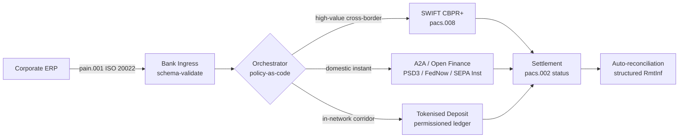

---

# Front Matter (YAML)

author: "contact@sebastienrousseau.com (Sebastien Rousseau)"
banner_alt: "Kontenerowiec w głębokowodnym porcie o świcie — symbolizujący wielotorowy, transgraniczny przepływ wartości korporacyjnej przez ISO 20022, otwarte finanse i sieci rozliczeniowe oparte na zdepozytowanych tokenach w 2026"
banner_height: "1597"
banner_width: "2584"
banner: "https://cloudcdn.pro/stocks/images/viktor-forgacs-KxVRDiFdTVo.webp"
cdn: "https://cloudcdn.pro"
charset: "UTF-8"
cname: "sebastienrousseau.com"
copyright: "© Copyright 2025 - 2026 - Sebastien Rousseau. All rights reserved."
date: "24 czerwca 2026"
description: "Jak ISO 20022, A2A, otwarte finanse w ramach PSD3/FiDA i tokenizowane depozyty przekształcają transgraniczny treasury korporacyjny obok SWIFT w 2026."
format-detection: "telephone=no"
hreflang: "pl"
icon: "https://cloudcdn.pro/clients/sebastienrousseau/v1/logos/sebastienrousseau.svg"
id: "https://sebastienrousseau.com/2026-06-24-cross-border-iso-20022-open-finance-tokenised-deposits-treasury-2026"
image_alt: "Czarno-biały portret Sebastiena Rousseau"
image_height: "162"
image_width: "162"
image: "https://cloudcdn.pro/stocks/images/sebastienrousseau.webp"
keywords: "płatności transgraniczne, ISO 20022, otwarte finanse, PSD3, FiDA, tokenizowane depozyty, stablecoiny, A2A, treasury, CIB, Nexi, Mastercard, multi-rail, pacs.008, pain.001, SWIFT, FedNow, SEPA Instant, RTP, CBPR+"
language: "pl-PL"
last_reviewed: "2026-06-24"
layout: "report"
locale: "pl_PL"
logo_alt: "Logo Sebastiena Rousseau"
logo_height: "44"
logo_width: "44"
logo: "https://cloudcdn.pro/clients/sebastienrousseau/v1/logos/sebastienrousseau.svg"
menu: ""
measurementID: "G-169G4ET5HQ"
name: "Sebastien Rousseau"
permalink: "https://sebastienrousseau.com/2026-06-24-cross-border-iso-20022-open-finance-tokenised-deposits-treasury-2026"
rating: "general"
referrer: "no-referrer"
robots: "index, follow"
schema: "FAQPage, Article"
seo_title: "Transgranicznie 2026: ISO 20022, otwarte finanse, tokeny"
short_name: "sebastienrousseau"
subtitle: "Transgraniczny treasury korporacyjny w 2026 działa na wielotorowej mechanice — ISO 20022 jako wspólna gramatyka, A2A i otwarte finanse jako tor obsługujący klienta, tokenizowane depozyty jako hurtowa noga rozliczeniowa, a SWIFT wciąż jako kotwica długiego ogona."
tags: "płatności transgraniczne, ISO 20022, otwarte finanse, PSD3, FiDA, tokenizowane depozyty, A2A, treasury, CIB, multi-rail, pacs.008, pain.001, SWIFT, FedNow, SEPA Instant, RTP, CBPR+"
theme-color: "0, 83, 191"
title: "Transgranicznie 2026: ISO 20022, otwarte finanse i tokenizowane depozyty w treasury korporacyjnym"
url: "https://sebastienrousseau.com/2026-06-24-cross-border-iso-20022-open-finance-tokenised-deposits-treasury-2026"
viewport: "width=device-width, initial-scale=1, shrink-to-fit=no"

# RSS - The RSS feed front matter (YAML).
atom_link: "https://sebastienrousseau.com/2026-06-24-cross-border-iso-20022-open-finance-tokenised-deposits-treasury-2026/rss.xml"
category: "Technology"
docs: https://validator.w3.org/feed/docs/rss2.html
generator: "Static Site Generator (SSG) (version 0.0.26)"
item_description: "Jak ISO 20022, A2A, otwarte finanse w ramach PSD3/FiDA i tokenizowane depozyty przekształcają transgraniczny treasury korporacyjny obok SWIFT w 2026."
item_guid: "https://sebastienrousseau.com/2026-06-24-cross-border-iso-20022-open-finance-tokenised-deposits-treasury-2026/rss.xml"
item_link: "https://sebastienrousseau.com/2026-06-24-cross-border-iso-20022-open-finance-tokenised-deposits-treasury-2026/rss.xml"
item_pub_date: "Wed, 24 Jun 2026 07:07:07 +0000"
item_title: "Transgranicznie 2026: ISO 20022, otwarte finanse i tokenizowane depozyty w treasury korporacyjnym"
last_build_date: "Wed, 24 Jun 2026 06:06:06 +0000"
managing_editor: "contact@sebastienrousseau.com (Sebastien Rousseau)"
pub_date: "Wed, 24 Jun 2026 07:07:07 +0000"
ttl: "60"
type: "article"
webmaster: "contact@sebastienrousseau.com"

# Apple - The Apple front matter (YAML).
apple_mobile_web_app_orientations: "portrait"
apple_touch_icon_sizes: "192x192"
apple-mobile-web-app-capable: "yes"
apple-mobile-web-app-status-bar-inset: "black"
apple-mobile-web-app-status-bar-style: "black-translucent"
apple-mobile-web-app-title: "Transgranicznie 2026: ISO 20022, otwarte finanse, tokeny"
apple-touch-fullscreen: "yes"

# MS Application - The MS Application front matter (YAML).

msapplication-navbutton-color: "0, 83, 191"

# Twitter Card - The Twitter Card front matter (YAML).

twitter_card: "summary_large_image"
twitter_creator: "@wwdseb"
twitter_description: "Jak ISO 20022, A2A, otwarte finanse w ramach PSD3/FiDA i tokenizowane depozyty przekształcają transgraniczny treasury korporacyjny obok SWIFT w 2026."
twitter_image: "https://cloudcdn.pro/clients/sebastienrousseau/v1/logos/sebastienrousseau.svg"
twitter_image_alt: "Logo Sebastiena Rousseau"
twitter_site: "@wwdseb"
twitter_title: "Transgranicznie 2026: ISO 20022, otwarte finanse, tokeny"
twitter_url: "https://sebastienrousseau.com/2026-06-24-cross-border-iso-20022-open-finance-tokenised-deposits-treasury-2026"

excerpt: "Transgraniczny treasury korporacyjny w 2026 to wielotorowy problem inżynierski. ISO 20022 jest wspólną gramatyką, A2A i otwarte finanse w ramach PSD3/FiDA są torem obsługującym klienta, tokenizowane depozyty realizują hurtową nogę rozliczeniową, a SWIFT wciąż kotwiczy długi ogon. Ciekawa praca toczy się w warstwie orkiestracji, nie w modelu."

# Humans.txt - The Humans.txt front matter (YAML).
author_website: "https://sebastienrousseau.com"
author_twitter: "@wwdseb"
author_location: "London, UK"
thanks: "Dziękujemy za lekturę!"
site_last_updated: "2026-06-24"
site_standards: "HTML5, CSS3, RSS, Atom, JSON, XML, YAML, Markdown, TOML"
site_components: "Kaishi, Kaishi Builder, Kaishi CLI, Kaishi Templates, Kaishi Themes"
site_software: "Static Site Generator, Rust"

---

# Transgranicznie 2026: ISO 20022, otwarte finanse i tokenizowane depozyty w treasury korporacyjnym

<!-- lead-start -->
<aside class="post-lead" aria-label="Podsumowanie artykułu">

<strong>TL;DR.</strong> Transgraniczny treasury korporacyjny w 2026 działa równolegle na czterech torach — SWIFT CBPR+, instant A2A w ramach PSD3/FiDA, tokenizowane depozyty oraz tory stablecoinów — spiętych przez ISO 20022 jako wspólną gramatykę. Praca dla zespołów CIB i treasury korporacyjnego to orkiestracja, nie wybór toru.

<strong>Kluczowe wnioski</strong>

<ul class="post-lead-takeaways">
  <li><strong>Multi-rail to standard.</strong> Żaden pojedynczy tor nie rozlicza każdego korytarza, każdej wielkości transakcji, każdej godziny granicznej. Treasury wybiera tor per płatność, nie per bank.</li>
  <li><strong>ISO 20022 to lingua franca.</strong> pacs.008, pacs.009 i pain.001 niosą teraz dane remitencji przez RTGS, instant, A2A i tory tokenizowanych depozytów — czyniąc decyzje routingowe opartymi na danych, a nie zablokowanymi w torze.</li>
  <li><strong>Otwarte finanse poszerzają perymetr.</strong> PSD3 i FiDA pchają model open bankingu do emerytur, ubezpieczeń i danych treasury; Nexi i Mastercard budują warstwę orkiestracji, którą konsumują korporacje.</li>
  <li><strong>Tokenizowane depozyty to noga hurtowa.</strong> Tokenizowane depozyty emitowane przez banki i zintegrowane tory stablecoinów siedzą pod torem instant obsługującym klienta i rozliczają nogę hurtową w czasie bliskim T+0.</li>
</ul>

<strong>Powiązane lektury:</strong> <a href="https://sebastienrousseau.com/2026-06-07-autonomous-treasury-index-programmable-liquidity-tokenised-deposits-2026">Indeks autonomicznego treasury 2026: programowalna płynność i tokenizowane depozyty</a>, <a href="https://sebastienrousseau.com/2026-06-15-pacs008-automation-iso-20022-interbank-payments-2026">Automatyzacja pacs.008: płatności międzybankowe ISO 20022 w 2026</a>.

</aside>
<!-- lead-end -->

> **Streszczenie wykonawcze.** Transgraniczny treasury korporacyjny w 2026 to problem inżynierski wielu torów, zanim stanie się problemem zarządzania relacjami. PSD3 oraz rozporządzenie o dostępie do danych finansowych (FiDA) poszerzają perymetr open bankingu o dane treasury korporacyjnego; przełączenie SWIFT MT/MX w listopadzie 2026 sprawia, że pacs.008 zgodny z CBPR+ staje się jedynym wykonalnym formatem międzybankowym dla płatności transgranicznych; tokenizowane depozyty i regulowane tory stablecoinów obsługują hurtową nogę rozliczeniową w czasie bliskim T+0 wewnątrz sieci typu permissioned. CIB, który wygrywa ten cykl, nie jest tym, który wybiera pojedynczy tor; jest tym, który projektuje warstwę orkiestracji spinającą je razem. Niniejszy artykuł omawia architekturę czterech torów (A2A w ramach PSD3, SWIFT CBPR+, tokenizowane depozyty bankowe, regulowane stablecoiny) — co każdy tor robi dobrze, gdzie przebiegają granice ekspozycji kredytowej i co warstwa orkiestracji policy-as-code nad nimi musi egzekwować, aby korporacja widziała jedną płatność, a nadzorca jeden audytowalny ślad.

Europejska korporacja przemysłowa płaci brazylijskiemu dostawcy 4,2 mln EUR w środę rano. Stacja robocza treasury nie wybiera banku. Wybiera tor — sekwencję torów. Instrukcja po stronie klienta trafia do komunikatu pain.001 A2A, routowanego przez dostawcę otwartych finansów w ramach PSD3. Bank prowadzi ją przez dwie jurysdykcje korespondenckie na tokenizowanych depozytach wewnątrz prywatnej sieci CIB. Długi ogon — uporządkowanie faktury 80 000 USD wobec sub-dostawcy bez relacji tokenizowanego depozytu — wciąż jedzie SWIFT CBPR+ jako pacs.008. Klient widzi jedną płatność. Architektura widzi cztery tory. ISO 20022 jest jedynym powodem, dla którego to się trzyma kupy.

Taki model operacyjny opisuje Mastercard, mówiąc o [ewolucji od open bankingu do otwartych finansów](https://www.mastercard.com/us/en/news-and-trends/Insights/2026/open-banking-to-open-finance-the-evolution-of-financial-data.html "Mastercard: od open bankingu do otwartych finansów, ewolucja danych finansowych") — dane i płatności zlane w jedną warstwę orkiestracji, z torem wybieranym przez system, nie przez klienta. Ciekawe pytanie dla senior banking technologist nie brzmi: który tor wygrywa. Brzmi: jak zaprojektowana, zarządzana i rekoncyliowana jest warstwa orkiestracji.

## 01. Od kart do A2A — przesunięcie ku otwartym finansom

Tory kartowe nie odchodzą. Są przeformułowywane.

W 2025 i wchodząc w 2026, [PSD3 oraz rozporządzenie o dostępie do danych finansowych (FiDA)](https://www.consultancy.uk/news/42202/orchestrating-open-banking-for-platform-growth-2026-outlook "Consultancy.uk: orkiestracja open bankingu dla wzrostu platform, perspektywa 2026") rozszerzyły obowiązek open bankingu poza rachunki płatnicze — na emerytury, kredyty hipoteczne, oszczędności, ubezpieczenia i dane treasury korporacyjnego. Konsekwencja dla treasury korporacyjnego jest bezpośrednia: relationship manager CIB może teraz konsumować pełny obraz płynności korporacji rozłożony na wiele banków przez jeden kontrakt API, na polecenie korporacji.

Dwóch operatorów widocznie buduje warstwę orkiestracji, którą będą konsumować korporacje. Nexi rozszerzyła swój zasięg acquiringowy na inicjację A2A w korytarzach SEPA Instant i paneuropejskich RTGS, w pełni natywnie w ISO 20022 end-to-end. Platforma otwartych finansów Mastercard — zakotwiczona na przejęciach Aiia i Finicity — dostarcza warstwę agregacji danych i zgody, z inicjacją płatności wystawianą przez tę samą strukturę API, która wcześniej obsługiwała autoryzacje kartowe.

Przesunięcie ma znaczenie z trzech powodów:

1. **Ekonomika jednostkowa.** A2A inicjowane w ramach PSD3 wyciąga interchange z płatności. Dla wysokokwotowych przepływów B2B oszczędność jest istotna; dla niskokwotowych przepływów konsumenckich stos kosztów merchanta się zapada.
2. **Jakość danych.** A2A pod ISO 20022 niesie ustrukturyzowane dane remitencji, których karty nigdy nie mogły. Wskaźniki auto-rekoncyliacji powyżej 95% są dziś poziomem wejścia.
3. **Model ryzyka.** A2A to credit transfer, nie autoryzacja karty. Powierzchnia fraudu, model chargebacków i model sporów — wszystkie inne. Zespoły treasury korporacyjnego muszą zrozumieć, że warstwa ochrony klienta jest odbudowywana, nie dziedziczona.

CIB sprzedający w 2026 propozycję multi-rail sprzedaje orkiestrację — nie dostęp. Dostęp jest teraz regulowany.

## 02. ISO 20022 jako lingua franca między torami

Powodem, dla którego multi-rail w ogóle działa, jest to, że format komunikatu jest teraz spójny między torami.

Komitet BIS ds. Płatności i Infrastruktur Rynkowych (CPMI) postawił argument architektoniczny jasno w swoich [wymogach harmonizacji ISO 20022 dla usprawnienia płatności transgranicznych](https://www.bis.org/cpmi/publ/d230.pdf "BIS CPMI: wymogi harmonizacji ISO 20022 dla usprawnienia płatności transgranicznych"). Przełączenie na CBPR+ w listopadzie 2025 zamknęło erę MT103 / MT202 dla transgranicznego komunikowania międzybankowego. Od tego punktu każdy główny tor — SWIFT, FedNow, SEPA Instant, RTP oraz główne systemy płatności natychmiastowych w Azji i Ameryce Łacińskiej — mówi tą samą gramatyką pacs.008 / pacs.009 / pain.001.

Praktyczne konsekwencje dla treasury korporacyjnego:

- **Routing oparty na danych.** Stacja robocza treasury może odczytać pain.001 raz i zdecydować o torze per płatność na podstawie korytarza, wielkości transakcji, godziny granicznej i relacji kontrahenta — bez przemapowywania komunikatu.
- **Dane remitencji przeżywają hop.** Ustrukturyzowane pola remitencji (`<RmtInf><Strd>`) przechodzą przez nogi korespondenckie bez ucięcia. Wskaźniki auto-rekoncyliacji rosną, bo dane nie giną już na granicy toru.
- **Sankcyjny screening staje się audytowalny.** Ustrukturyzowane pola `<Dbtr>` / `<Cdtr>` / `<DbtrAgt>` / `<CdtrAgt>` z referencjami LEI zastępują screening po wolnym tekście. Wskaźniki trafień spadają. Kolejki śledcze się kurczą.

Diagram poniżej śledzi pojedynczy pain.001 przez wejście banku, do orkiestratora policy-as-code i dalej do tego toru, którego wymaga korytarz i wielkość transakcji — jeden komunikat, wiele torów, bez przemapowywania.

Kosztem tej spójności jest dyscyplina inżynierska. ISO 20022 jest permisywne. Dwa banki mogą być w pełni zgodne z CBPR+, a wciąż produkować komunikaty pacs.008 różniące się użyciem pól, zestawem znaków i strukturą danych remitencji. CIB, który wygrywa na transgranicznym w 2026, wymusza ostrzejszy profil komunikatu, niż wymaga standard — i odrzuca na parsowaniu, nie na rozliczeniu.

## 03. Tokenizowane depozyty i stabilne tory

Hurtowa noga rozliczeniowa to miejsce, gdzie opowieść o torach robi się ciekawa.

Obraz 2026, dobrze uchwycony w [analizie Trade Treasury Payments dotyczącej automatyzacji, torów awaryjnych, ISO 20022 i stablecoinów](https://tradetreasurypayments.com/articles/automation-contingency-rails-iso-20022-and-stablecoins-the-2026-trends-reshaping-corporate-finance-and-b2b-payments "Trade Treasury Payments: automatyzacja, tory awaryjne, ISO 20022 i stablecoiny, trendy 2026 przekształcające finanse korporacyjne i płatności B2B"), dzieli warstwę rozliczenia hurtowego na dwa strukturalnie różne modele.

**Tokenizowane depozyty emitowane przez banki.** Bank komercyjny emituje tokenizowane zobowiązanie na permissioned ledger — JPM Coin, token depozytowy HSBC powiązany z Orion, główne europejskie odpowiedniki CIB. Token jest bezpośrednim roszczeniem wobec banku emitującego. Rozliczenie jest bliskie T+0 wewnątrz sieci. Compliance jest odpowiedzialnością banku emitującego. Tor jest w pełni regulowany, w pełni śledzalny i ograniczony do uczestników, których emitent on-boardował.

**Zintegrowane tory stablecoinów.** Regulowany stablecoin — w pełni zarezerwowany, audytowany i operujący pod MiCA lub równoważnym reżimem regionalnym — rozlicza korytarz, do którego bankowe tokenizowane depozyty jeszcze nie docierają. Token jest roszczeniem wobec rezerwy, nie wobec bilansu banku. Compliance jest dzielone między emitenta, on-ramp i off-ramp.

Te dwa modele nie konkurują. Są ułożone w stos. Produkt transgraniczny CIB w 2026 typowo używa tokenizowanych depozytów bankowych dla nogi w sieci i regulowanego stablecoina dla korytarza, gdzie tor w sieci się kończy. Korporacja widzi jedną płatność ISO 20022. Opowieść rozliczeniowa pod spodem jest wielo-tokenowa.

Pytanie na poziomie zarządu jest tym samym, które komitety ryzyka operacyjnego zadają od pierwszych pilotaży programowalnej płynności: kto niesie ekspozycję kredytową na token i jak długo? Tokenizowane depozyty dają czystą odpowiedź — bank emitujący, do momentu wypalenia. Zintegrowane tory stablecoinów dają bardziej zniuansowaną — rezerwa, z zastrzeżeniem cyklu audytowego i gwarancji wykupu. Zespół treasury, który nie dokumentuje odpowiedzi per tor per korytarz, nosi niezmierzone ryzyko kredytowe na swoim bilansie.

## 04. Stos autonomicznego treasury

Nad warstwą torów siedzi warstwa orkiestracji. Nad warstwą orkiestracji siedzi warstwa agentów.

Architekturę przedstawiłem szczegółowo w [Indeksie autonomicznego treasury 2026: programowalna płynność i tokenizowane depozyty](https://sebastienrousseau.com/2026-06-07-autonomous-treasury-index-programmable-liquidity-tokenised-deposits-2026 "Sebastien Rousseau: Indeks autonomicznego treasury 2026"). Krótka wersja: agentowy treasury w 2026 to warstwa orkiestracji, wyrażona jako polityka w postaci kodu, z ograniczonymi agentami wykonującymi się w jej granicach.

Stos to:

1. **Warstwa torów.** SWIFT CBPR+, instant A2A, tokenizowane depozyty, regulowane stablecoiny. Każdy tor ma opublikowany profil, tablicę godzin granicznych, krzywą kosztów i model finalności rozliczenia.
2. **Warstwa orkiestracji.** ISO 20022 na wejściu, ISO 20022 na wyjściu. Decyzja o torze per płatność na podstawie korytarza, wielkości transakcji, godziny granicznej, relacji kontrahenta i polityki. Polityka jest wersjonowana, podpisana i audytowalna.
3. **Warstwa agentów.** Ograniczeni agenci treasury wykonują politykę orkiestracji z granicami wywołań narzędzi, logami audytowymi i wyłącznikami awaryjnymi. Agent nie wybiera toru. Polityka wybiera tor. Agent wykonuje politykę.
4. **Warstwa rekoncyliacji.** Komunikaty ISO 20022 pacs.008 / pacs.002 / camt.054 rekoncyliują się względem oryginalnej instrukcji pain.001, z ustrukturyzowanymi danymi remitencji domykającymi pętlę bez interwencji ręcznej.

CIB sprzedający ten stos w 2026 sprzedaje cztery rzeczy naraz — i wycenia je osobno. Korporacja kupująca go kupuje opcjonalność między torami, z jednym standardem komunikatu, jedną warstwą polityk, jednym feedem rekoncyliacyjnym. Taka jest zmiana architektoniczna. Cała reszta to szczegół implementacji.

## Najczęściej zadawane pytania

**Czy „otwarte finanse" to po prostu rebrandowany open banking?**
Nie. Open banking w ramach PSD2 obejmował rachunki płatnicze. PSD3 i rozporządzenie o dostępie do danych finansowych (FiDA) rozszerzają obowiązek udostępniania danych o emerytury, kredyty hipoteczne, oszczędności, ubezpieczenia oraz dane treasury korporacyjnego. Konsekwencja dla treasury korporacyjnego jest bezpośrednia: relationship manager CIB może teraz konsumować pełny obraz płynności korporacji rozłożony na wiele banków przez jeden kontrakt API, na polecenie korporacji, a nie tylko historię jej rachunku płatniczego.

**Dlaczego warstwa orkiestracji jest architektonicznym centrum uwagi, a nie tor?**
Bo tory się komodyzują. SWIFT CBPR+ pacs.008, A2A w ramach PSD3, tokenizowane depozyty i regulowane stablecoiny — wszystkie niosą tę samą gramatykę ISO 20022 na poziomie komunikatu. To, co różnicuje CIB w 2026, to silnik policy-as-code, który wybiera tor per płatność na podstawie korytarza, wielkości transakcji, wymogu finalności rozliczenia i relacji kontrahenta — i który zapisuje wybór w telemetrii audytowej, o jaką nadzorca zapyta. Bez tego silnika multi-rail to po prostu opcjonalność bez ładu korporacyjnego.

**Gdzie przebiega granica ekspozycji kredytowej na nodze tokenizowanego depozytu?**
Tokenizowane depozyty bankowe na permissioned ledger to bezpośrednie roszczenie wobec banku emitującego — ekspozycja kredytowa kończy się przy wypaleniu. Regulowane tory stablecoinów (nadzorowane przez MiCA w UE, reżim dyskusyjny Bank of England w UK, analogiczne gdzie indziej) to roszczenie wobec rezerwy, z oknem ekspozycji uzależnionym od cyklu audytowego i warunków gwarancji wykupu. Zespół treasury, który nie dokumentuje odpowiedzi per tor per korytarz, nosi niezmierzone ryzyko kredytowe na swoim bilansie.

**Co dzieje się ze SWIFT w tej architekturze?**
SWIFT nie znika — kotwiczy długi ogon. Korytarze, do których tokenizowane depozyty bankowe jeszcze nie docierają (większość relacji z sub-dostawcami na rynkach wschodzących, większość niskoczęstotliwościowych / niskokwotowych przepływów transgranicznych) oraz korytarze, gdzie korporacja lub bank wymagają śladu audytowego korespondenckiego CBPR+, jadą dalej po SWIFT pacs.008. Architektura 2026 to „SWIFT + nowe tory", nie „nowe tory zamiast SWIFT".

**Co kupuje korporacja, kupując ten stos?**
Opcjonalność między torami, z jednym standardem komunikatu (ISO 20022), jedną warstwą polityk (silnik orkiestracji) i jednym feedem rekoncyliacyjnym (status pacs.002 + potwierdzenie camt.054 + ustrukturyzowane wyciągi camt.053). Korporacja nie płaci za cztery oddzielne podłączenia do torów. Płaci za warstwę orkiestracji, która sprawia, że cztery tory zachowują się operacyjnie jak jeden — i za ślad audytowy, który pozwala jej odpowiedzieć „którym torem przejechała ta płatność 4,2 mln EUR i dlaczego?" nazajutrz po kolejnym zapytaniu nadzorczym.

## Wnioski

Transgraniczny treasury korporacyjny w 2026 to wielotorowy problem inżynierski. ISO 20022 jest gramatyką, która czyni multi-rail wykonalnym. PSD3 i FiDA poszerzają perymetr danych i wymuszają wejście otwartych finansów w przepływ pracy treasury korporacyjnego. Tokenizowane depozyty i regulowane stablecoiny realizują hurtową nogę rozliczeniową. SWIFT wciąż kotwiczy długi ogon.

CIB, który wygrywa, to ten, który buduje warstwę orkiestracji — nie ten, który wybiera pojedynczy tor i stawia franczyzę na nim. Zespół treasury korporacyjnego, który wygrywa, to ten, który dokumentuje ekspozycję kredytową per tor per korytarz, wymusza ostrzejszy profil ISO 20022, niż wymaga regulator, i traktuje decyzję o torze jak politykę, a nie ocenę per płatność.

Ciekawa praca toczy się w warstwie orkiestracji. Budujcie ją Państwo starannie.

## Bibliografia

Bank for International Settlements, Committee on Payments and Market Infrastructures (2023). *Harmonised ISO 20022 data requirements for enhancing cross-border payments* (CPMI Papers No. 230). Dostępne pod adresem: [https://www.bis.org/cpmi/publ/d230.htm](https://www.bis.org/cpmi/publ/d230.htm "BIS CPMI 230 — Harmonised ISO 20022 data requirements")

Bank for International Settlements (2024). *Project Agorá: cross-border payments with tokenised commercial bank deposits and central bank money*. BIS Innovation Hub. Dostępne pod adresem: [https://www.bis.org/about/bisih/topics/fmis/agora.htm](https://www.bis.org/about/bisih/topics/fmis/agora.htm "BIS Project Agorá")

Bank of England (2023). *Regulatory regime for systemic payment systems using stablecoins and related service providers — Discussion Paper*. Dostępne pod adresem: [https://www.bankofengland.co.uk/paper/2023/dp/regulatory-regime-for-systemic-payment-systems-using-stablecoins-and-related-service-providers](https://www.bankofengland.co.uk/paper/2023/dp/regulatory-regime-for-systemic-payment-systems-using-stablecoins-and-related-service-providers "Bank of England — Regulatory regime for stablecoins discussion paper")

European Commission (2023). *Proposal for a Directive on payment services and electronic money services (PSD3)*. Dostępne pod adresem: [https://finance.ec.europa.eu/regulation-and-supervision/financial-services-legislation/implementing-and-delegated-acts/payment-services-directive_en](https://finance.ec.europa.eu/regulation-and-supervision/financial-services-legislation/implementing-and-delegated-acts/payment-services-directive_en "European Commission — Payment Services Directive proposal")

European Parliament and Council (2023). *Regulation (EU) 2023/1114 on markets in crypto-assets (MiCA)*. Dostępne pod adresem: [https://eur-lex.europa.eu/eli/reg/2023/1114/oj](https://eur-lex.europa.eu/eli/reg/2023/1114/oj "Regulation (EU) 2023/1114 — Markets in Crypto-Assets (MiCA)")

Financial Action Task Force (2023). *International standards on combating money laundering and the financing of terrorism — Recommendation 16 on wire transfers*. Dostępne pod adresem: [https://www.fatf-gafi.org/en/publications/Fatfrecommendations/Fatf-recommendations.html](https://www.fatf-gafi.org/en/publications/Fatfrecommendations/Fatf-recommendations.html "FATF Recommendations")

International Organization for Standardization (2020). *ISO 17442 Financial services — Legal entity identifier (LEI)*. Dostępne pod adresem: [https://www.gleif.org/en/about-lei/iso-17442-the-lei-code-structure](https://www.gleif.org/en/about-lei/iso-17442-the-lei-code-structure "ISO 17442 — Legal Entity Identifier")

SWIFT (2024). *Cross-Border Payments and Reporting Plus (CBPR+) usage guidelines*. Dostępne pod adresem: [https://www.swift.com/standards/iso-20022/iso-20022-programme](https://www.swift.com/standards/iso-20022/iso-20022-programme "SWIFT CBPR+ usage guidelines")

<!-- enrich-start -->
<aside class="author-card" aria-label="O autorze"><strong class="author-card-name"><a href="/about/index.html">Sebastien Rousseau</a></strong>Senior banking technologist piszący o stosowanym AI, migracji ISO 20022, kryptografii post-kwantowej dla usług finansowych i strukturalnej transformacji płatności hurtowych.Ponad 20 lat doświadczenia w HSBC Commercial &amp; Investment Bank, PayPal, Barclays, Shazam, AKQA, Virgin Group. <a href="/about/index.html">Pełny profil</a> &middot; <a href="https://www.linkedin.com/in/sebastienrousseau/" rel="external noopener">LinkedIn</a> &middot; <a href="https://github.com/sebastienrousseau" rel="external noopener">GitHub</a></aside>

Ostatnio zweryfikowano <time datetime="2026-06-24">2026-06-24</time>.

<!-- enrich-end -->
