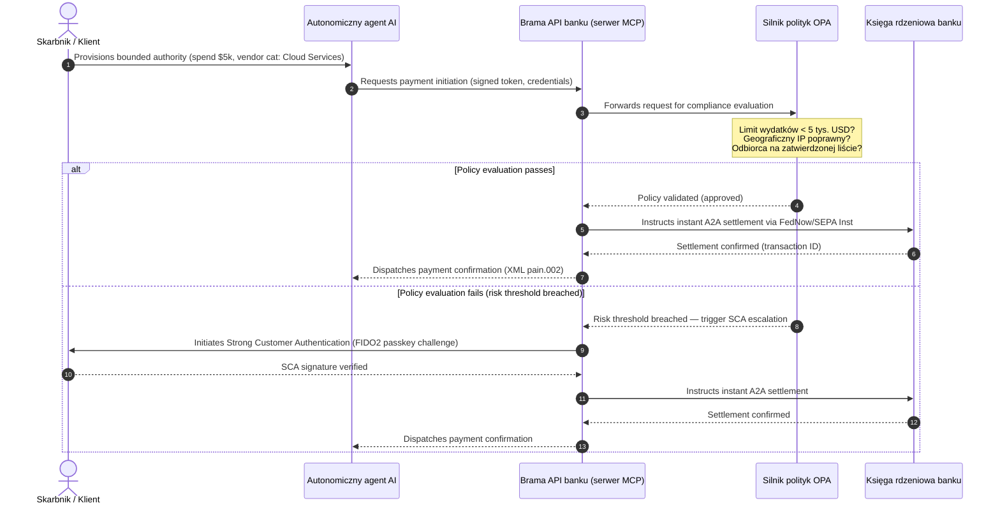

# Perspektywa płatności globalnych 2026: model operacyjny, ryzyko i przychody w świecie agentowym, niewidocznym i czasu rzeczywistego

Cykl płatności globalnych 2026 definiują trzy zbieżne siły — handel agentowy, niewidoczne płatności wbudowane oraz wykonanie w czasie rzeczywistym — oparte na tokenizowanej ujednoliconej księdze w ramach Project Agorá oraz sztywnym terminie listopadowego 2026 przełączenia SWIFT na adres ustrukturyzowany.

<!-- lead-start -->
<aside class="post-lead" aria-label="Article summary">

<strong>TL;DR.</strong> Krajobraz płatności 2026 odszedł od migracji komunikatów na rzecz wielowymiarowego modelu operacyjnego, w którym ryzyko i przychody dyktuje wykonanie w czasie rzeczywistym. Tekst syntetyzuje perspektywy 2026 J.P. Morgan, Global Payments, HSBC oraz Payments Association w czteropunktowy plan operacyjny G-SIB, obejmujący handel agentowy inicjowany przez modele, zawsze dostępne API treasury, tokenizowane ujednolicone księgi w ramach BIS Project Agorá oraz termin 14/15 listopada 2026 r. dla adresu ustrukturyzowanego SWIFT.

<strong>Kluczowe wnioski</strong>

<ul class="post-lead-takeaways">
  <li><strong>Handel agentowy otwiera obszar delegowanej odpowiedzialności.</strong> Autonomiczne agenty AI mają pośredniczyć w 3-5 bilionach USD rocznego handlu do 2030 roku. Banki muszą zdefiniować kontrolę dostępu MCP, delegowanie SCA w ramach PSD3/PSR oraz odpowiedzialność za KYC/AML w wieloagentowych łańcuchach płatniczych.</li>
  <li><strong>Zawsze dostępna płynność staje się podstawą operacyjną i regulacyjną.</strong> API treasury 24/7 oraz rachunki wirtualne minimalizują zamrożoną gotówkę i podnoszą poziom odporności. W przypadku API skarbcowych w czasie rzeczywistym o znaczeniu systemowym, dostępność na poziomie pięciu dziewiątek (99,999 %) staje się wewnętrznym celem inżynierskim, który banki same sobie stawiają, aby wykazać przed organami nadzoru odporność na poziomie DORA. Samo DORA nie nakazuje uniwersalnego progu pięciu dziewiątek; obejmuje zarządzanie ryzykiem ICT, zgłaszanie incydentów, testy odporności, ryzyko stron trzecich oraz nadzór nad krytycznymi dostawcami ICT.</li>
  <li><strong>Tokenizacja awansowała do regulowanych ujednoliconych ksiąg.</strong> Project Agorá to największe publiczno-prywatne ramy dla tokenizowanych depozytów banków komercyjnych i rezerw banku centralnego. Banki potrzebują pięcioetapowej ścieżki tokenizacji z jasnym ujęciem prudencjalnym.</li>
  <li><strong>Przełączenie na adres ustrukturyzowany 14/15 listopada 2026 r. ma sztywny termin.</strong> Swift CBPR+ usuwa nieustrukturyzowany blok `<AdrLine>` od 14 listopada 2026 r.; rulebooki EPC SEPA dopuszczają adres nieustrukturyzowany tylko do 15 listopada 2026 r. Wymagane jest czyste zarządzanie danymi przez zespoły produktu, technologii i compliance.</li>
</ul>

<strong>Powiązane lektury:</strong> <a href="https://sebastienrousseau.com/2026-06-23-iso-20022-pain001-programmable-liquidity-autonomic-treasury-2026">From Pain.001 to Programmable Liquidity: ISO 20022 as the Autonomic Nervous System of Treasury in 2026</a>, <a href="https://sebastienrousseau.com/2026-06-24-cross-border-iso-20022-open-finance-tokenised-deposits-treasury-2026">Cross-Border 2026: ISO 20022, Open Finance and Tokenised Deposits in Corporate Treasury</a>, <a href="https://sebastienrousseau.com/2026-06-25-quantum-dawn-cib-kyberlib-quantum-resilient-payments-stack-2026">Quantum Dawn for CIB: From KyberLib to a Quantum-Resilient Payments Stack</a>.

</aside>
<!-- lead-end -->

Dla globalnych banków transakcyjnych cykl 2026-2028 to okno strukturalne. Nowoczesna infrastruktura płatnicza nie jest już narzędziem administracyjnym — stanowi rdzeń strategii technologicznej klasy bankowej. Wewnątrz G-SIB i głównych instytucji regionalnych technologia, regulacja i oczekiwania klientów zbiegły się na jednej płaszczyźnie operacyjnej.

Cykl definiują trzy siły, każda odpowiadająca bezpośrednio kwestii na poziomie zarządu.

- **Handel agentowy** — dystrybucja kanałów, projekt produktu, przypisanie odpowiedzialności oraz Model Risk Management pod nadzorem regulacyjnym.
- **Płatności niewidoczne** — doświadczenie klienta, z ryzykiem dezintermediacji, gdy banki nie wbudują swojej księgi w front-endy korporacyjne i akceptanckie.
- **Wykonanie w czasie rzeczywistym** — prędkość kapitału, z konsekwencjami dla zarządzania płynnością, ryzyka kredytowego, odporności operacyjnej i obrony przed oszustwami.

Stawka finansowa jest istotna. Oszustwa skalują się pod względem szybkości i wyrafinowania; terminy regulacyjne są sztywne; banki, które proaktywnie modernizują systemy rdzeniowe, odblokowują znaczące możliwości przychodów z opłat. Koszt bezczynności jest przeciwny: natychmiastowe odrzucenia transakcji, wąskie gardła operacyjne, kary regulacyjne i szybka erozja udziału w rynku.

## Drabina pewności — co jest datowane, regulowane lub prognozowane

Nie każdy element tego raportu niesie tę samą pewność. Pytanie na poziomie zarządu brzmi, które delty to terminy, które to oczekiwania nadzorcze, a które wciąż pozostają projekcjami rynkowymi — bo odpowiedź zmienia rozmowę budżetową.

| Kategoria | Przykłady |
| --- | --- |
| **Twarde terminy** | Przełączenie Swift CBPR+ na adres ustrukturyzowany (14 listopada 2026 r.); rulebooki EPC SEPA (15 listopada 2026 r.) |
| **Obowiązki regulacyjne** | DORA — ryzyko ICT + testy odporności + nadzór nad stronami trzecimi (UE); delegowanie SCA w ramach PSD3/PSR; MRM zgodnie z SR 11-7 + PRA SS1/23 |
| **Wysoce prawdopodobne przesunięcia rynkowe** | API skarbcowe czasu rzeczywistego, obrona przed oszustwami sterowana AI, płynność oparta na API, oszustwa biometryczne napędzane deepfake |
| **Opcje strategiczne** | Depozyty tokenizowane, ujednolicone księgi w ramach Project Agorá, korytarze handlu agentowego, ciągłe FX (Wire 365) |
| **Prognozy** | `$3-$5 trillion` rocznych przepływów handlu agentowego do 2030 r. (bazowa prognoza McKinsey) |

Dwa górne wiersze traktuj jako fakty compliance, które generują linię budżetową niezależnie od tego, czy bank pochwyci jakąkolwiek część potencjału. Dwa dolne wiersze traktuj jako opcje strategiczne — wysokie przekonanie co do kierunku, ale gdzie moment wykonania jest wyborem zarządu, a nie wpisem w kalendarzu regulatora.

## Zbieżność globalnych autorytetów płatniczych

Raport syntetyzuje perspektywy płatności i handlu 2026 czterech autorytatywnych głosów branżowych — [J.P. Morgan Payments](https://www.jpmorgan.com/payments/newsroom/payments-outlook-2026-trends-report-released "J.P. Morgan Payments — Outlook 2026"), [Global Payments](https://investors.globalpayments.com/news-events/press-releases/detail/497/global-payments-releases-its-2026-commerce-and-payment "Global Payments — 2026 Commerce and Payment Trends Report"), HSBC oraz The Payments Association — i triangulauje je z [Mapą drogową G20 dla wzmocnienia płatności transgranicznych](https://www.fsb.org/2026/03/fsb-kicks-off-new-implementation-phase-to-enhance-cross-border-payments-through-public-private-partnership/ "FSB — cross-border payments implementation phase, March 2026").

Każda organizacja podchodzi do ekosystemu z innego kąta rynkowego, ale ich ustalenia zbiegają się na trzech niezmiennikach.

1. **Natychmiastowe szyny napędzane API to standard.** Modele wsadowego przetwarzania są marginalizowane w przepływach transgranicznych i wysokokwotowych; prędkość transakcji w tych segmentach dyktuje zawsze dostępna komunikacja czasu rzeczywistego.
2. **AI to zarówno zagrożenie, jak i obrona.** Narzędzia generatywne i deepfake skalują oszustwa transakcyjne, wymuszając wielowarstwowe, czasu rzeczywistego kontry oparte na uczeniu maszynowym.
3. **Tokenizacja to infrastruktura gotowa do produkcji.** Księgi się ujednolicają, by hostować tokenizowane zobowiązania komercyjne i hurtowe cyfrowe waluty banków centralnych.

| Raport | Główni odbiorcy | Fokus | Kluczowy filar | Konsekwencje dla banku |
| --- | --- | --- | --- | --- |
| **J.P. Morgan Payments** | Corporate treasurers, G-SIBs | Real-time liquidity, fraud | APIs, AI biometrics | Rebuild liquidity, FX, and risk systems for continuous 365-day settlement. |
| **Global Payments** | Merchants, e-commerce | POS evolution, omnichannel | Agentic commerce, frictionless checkout | Build secure, API-gated merchant payment corridors for autonomous AI agents. |
| **HSBC Insights** | Multinational corporates | ERP integrations (SAP/Oracle), real-time cash | Treasury-as-a-Service, cash visibility | Monetise transactional API suites and embed real-time cash ledger reporting at source. |
| **The Payments Association** | Fintechs, payment institutions | Stablecoins, tokenisation, global regulation | Regulated digital assets, policy compliance | Prepare balance sheets for tokenised deposits and navigate PSD3/PSR liability structures. |

Cztery perspektywy faktycznie definiują stos operacyjny sektora prywatnego działający na publicznej infrastrukturze polityki G20, przekładając intencję polityczną na konkretne decyzje dotyczące płynności, tokenizacji, danych i kontroli oszustw wewnątrz banków.

## Filar 1 — Handel agentowy i płatności niewidoczne

Handel agentowy to przejście od checkoutu kliknij-aby-kupić sterowanego człowiekiem do autonomicznej inicjacji transakcji sterowanej modelem. Prognozy branżowe zbiegają się na 3-5 bilionach USD rocznego handlu pośredniczonego przez autonomicznych agentów do 2030 — niski jednocyfrowy udział globalnego wolumenu płatności wykonywany bez kliknięcia "kup" przez człowieka.

Ekosystem detaliczny i komercyjny ma odpowiadającą lukę. Wyraźna większość konsumentów oczekuje obecnie płatności niemal bez tarcia, a mniej niż połowa akceptantów priorytetowo potraktowała jednoklikowy checkout lub katalogi produktów dostępne przez API. Agenty AI nie mogą nawigować po wielostronicowych legacy ekranach checkoutu zaprojektowanych dla ludzkich oczu; potrzebują ustrukturyzowanych uścisków API maszyna-do-maszyny.

### Priorytety banku i wpływ operacyjny

- **Odpowiedzialność KYC i AML.** Banki muszą zdefiniować, kto ponosi obowiązek compliance wewnątrz agentowego łańcucha transakcyjnego. Jeśli osobisty agent AI konsumenta inicjuje transakcję przez agentowy checkout akceptanta, bank musi zweryfikować, że pierwotne delegowane uprawnienia są kryptograficznie związane z głównym posiadaczem rachunku.
- **Przeprojektowanie odpowiedzialności i obciążeń zwrotnych.** Schematy kartowe i szyny A2A zaprojektowano wokół ludzkiej autoryzacji. Gdy agent AI dokona błędnego zakupu — na przykład zamawiając niewłaściwy zapas przemysłowy z powodu błędu parsowania danych — banki muszą jasno przypisać odpowiedzialność między konsumenta, dostawcę agenta i akceptanta.
- **Ocena ryzyka przepływów agentowych.** Silniki routingu płatności muszą dynamicznie oceniać ryzyko płatności agentowych, stosując wyższe wymogi rezerw lub stawki interchange dla transakcji inicjowanych nieludzko do czasu ustalenia stabilnej historii rozliczeń.

### Ograniczone działanie i ograniczone uprawnienia

Aby złagodzić "nieograniczone działanie" — agent zakupów korporacyjnych uruchamiający nieskończoną rekurencyjną pętlę zakupów z powodu usterki oprogramowania — banki muszą wdrożyć **bramki API o ograniczonych uprawnieniach**. Bramki egzekwują limity na poziomie polityki w trzech wymiarach.

1. **Wielopoziomowe limity finansowe** — wydatki agenta ograniczone wielkością transakcji, dziennym skumulowanym wolumenem i kategorią akceptanta.
2. **Zabezpieczenia świadome kontekstu** — drugorzędne sygnały (pora dnia, geolokalizacja IP, częstotliwość transakcji) oceniane zanim księga zwolni środki.
3. **Eskalacja z udziałem człowieka** — obowiązkowa autoryzacja człowieka uruchamiana przez Strong Customer Authentication (SCA) w ramach PSD3 / PSR za każdym razem, gdy transakcja przekracza progi ryzyka.

Poniższa sekwencja Mermaid pokazuje docelową architekturę, którą wiele banków rozpozna jako agentowy przepływ płatności o ograniczonych uprawnieniach.

### Model Context Protocol (MCP)

Aby połączyć zlokalizowane modele AI z bankowymi warstwami wykonania, branża standaryzuje się wokół [Model Context Protocol (MCP)](https://modelcontextprotocol.io "Model Context Protocol — open standard for LLM tool integration") — otwartego protokołu, który pozwala LLM-om wywoływać jasno zakresowane, audytowalne narzędzia i API bez surowego dostępu do systemów rdzeniowych.

Opakowanie API bankowych (inicjacja płatności, zapytanie o saldo, weryfikacja strony) wewnątrz serwera MCP trzyma LLM-y z dala od tabel bazy danych i kontroli root systemu. Model wchodzi w interakcję z księgą wyłącznie przez ustrukturyzowane, audytowane endpointy z limitami przepustowości — bezpieczeństwo egzekwowane na granicy wykonania narzędzi agentowych, a nie zakopane wewnątrz modelu.

## Filar 2 — Transformacja treasury i ponownie wyobrażona płynność

Prędkość bankowości transakcyjnej w 2026 wyznacza przejście od wsadowego przetwarzania końca dnia do zawsze dostępnych, czasu rzeczywistego operacji treasury. Korporacje wielonarodowe nie tolerują już zamrożonej gotówki — płynności bezczynnej na rachunkach lokalnych przez weekendy lub święta, ponieważ systemy rozliczeń są zamknięte.

### Argumenty ekonomiczne za płynnością czasu rzeczywistego

J.P. Morgan i HSBC raportują, że korporacje z zaawansowanymi możliwościami gotówki i danych czasu rzeczywistego mają istotnie większe szanse pokonać konkurencję pod względem wzrostu przychodów i efektywności kapitałowej, głównie poprzez redukcję zamrożonej płynności i optymalizację cykli kapitału obrotowego.

Aby uchwycić tę wartość, banki dostarczają **produkty API Treasury-as-a-Service (TaaS)**, które pozwalają korporacyjnym ERP (SAP, Oracle) wpinać się bezpośrednio w księgę banku.

- **API sald czasu rzeczywistego** używające schematu `camt.052` — zastępujące protokoły transferu plików natychmiastowym, sterowanym zdarzeniami raportowaniem pozycji gotówkowej.
- **API masowej inicjacji płatności** używające `pain.001` — bezpośrednie wykonanie straight-through partii płatności do dostawców z księgi ERP.
- **API ciągłego FX** — silniki treasury blokują algorytmiczne kursy wymiany w czasie rzeczywistym dla rozliczeń transgranicznych, eliminując ryzyko nocnej luki rynkowej.
- **API rachunków wirtualnych** — korporacje dynamicznie uruchamiają i wycofują tysiące subkont dla automatycznego dopasowywania należności i separacji księgowej.

### Odporność operacyjna i DORA

Oferowanie zawsze dostępnej płynności przekształca profil ryzyka banku. W przypadku API skarbcowych w czasie rzeczywistym o znaczeniu systemowym, dostępność na poziomie pięciu dziewiątek (99,999 %) staje się wewnętrznym celem inżynierskim, który banki same sobie stawiają, aby wykazać przed organami nadzoru odporność na poziomie DORA. Samo DORA nie nakazuje uniwersalnego progu pięciu dziewiątek; obejmuje zarządzanie ryzykiem ICT, zgłaszanie incydentów, testy odporności, ryzyko stron trzecich oraz nadzór nad krytycznymi dostawcami ICT.

W ramach [Digital Operational Resilience Act (DORA)](https://eur-lex.europa.eu/legal-content/EN/TXT/?uri=CELEX%3A32022R2554 "Regulation (EU) 2022/2554 — Digital Operational Resilience Act") nie jest to wskaźnik IT — to ścisły wymóg regulacyjny. Regulatorzy oczekują, że banki udowodnią, że powierzchnia API treasury czasu rzeczywistego i baza danych księgi mogą wchłonąć poważne-ale-wiarygodne ataki cybernetyczne, awarie sieci i zakłócenia hyperscalerów bez przerywania krytycznych płatności ani naruszania systemowej płynności. To wymaga geograficznie nadmiarowych architektur baz danych multi-cloud active-active, warstw wykrywania zagrożeń w czasie rzeczywistym i automatycznego failover — widocznych w linii kosztów zmian, nie tylko w teczce audytowej.

### Ciągłe FX i innowacja transgraniczna

Treasury czasu rzeczywistego nie może żyć wewnątrz granicy jednej waluty. G-SIB wdrażają infrastrukturę ciągłego FX — platforma [Wire 365](https://www.jpmorgan.com/insights/payments/fx-cross-border/wire-365-global-clearing "J.P. Morgan — Wire 365 global clearing reinvented") J.P. Morgan przetwarza płatności transgraniczne i konwersje FX w dowolny dzień roku, poza tradycyjnymi godzinami RTGS banków centralnych. Ta warstwa łączy się bezpośrednio z systemami depozytów tokenizowanych i ujednoliconej księgi omawianymi w Filarze 3.

## Filar 3 — Depozyty tokenizowane i ujednolicona księga

Tokenizacja awansowała z odizolowanych pilotów proof-of-concept do skalowanej infrastruktury monetarnej klasy bankowej. Fokus przesunął się z prywatnych stablecoinów i spekulacyjnych kryptoaktywów na **tokenizowane depozyty banków komercyjnych** i **hurtowe cyfrowe waluty banków centralnych (wCBDC)** działające na programowalnych ujednoliconych księgach.

Ramą referencyjną jest [Project Agorá](https://www.bis.org/about/bisih/topics/fmis/agora.htm "BIS Project Agorá — tokenisation of wholesale cross-border payments") — duża współpraca publiczno-prywatna zwołana przez BIS i IIF, obejmująca **ośmiu banków centralnych** i ponad 40 prywatnych instytucji finansowych (zgodnie ze stroną BIS Agorá, zaktualizowaną 27 maja 2026 r.). Projekt bada, jak tokenizowane depozyty banków komercyjnych integrują się z tokenizowanymi hurtowymi CBDC na wspólnej programowalnej księdze, by wyeliminować tarcia rozliczeń transgranicznych, skoordynować kontrole compliance i umożliwić atomową finalność 24/7.

### Pięcioetapowa ścieżka tokenizacji

Dla G-SIB i głównych banków regionalnych tokenizacja to stopniowa ścieżka od optymalizacji wewnętrznej do otwartej rynkowej interoperacyjności.

1. **Wewnętrzna płynność treasury** — tokenizacja wewnętrznych korporacyjnych sald gotówkowych (np. JPM Coin lub równoważnych prywatnych ksiąg bankowych), by umożliwić natychmiastowy, 24/7 transgraniczny transfer i netting w obrębie własnych oddziałów banku.
2. **Ograniczone wielobankowe korytarze** — zamknięte, regulowane konsorcja (sandbox Project Agorá), by testować rozliczenia międzybankowe i wspólny stan księgi w odrębnych instytucjach.
3. **Ciągłe programowalne FX** — kontrakty smart na ujednoliconej księdze wykonują natychmiastowe FX Payment-versus-Payment (PvP), eliminując ryzyko rozliczeń między strefami czasowymi.
4. **Tokenizowane aktywa świata rzeczywistego (RWA)** — noga tokenizowanej gotówki integruje się z tokenizowanymi papierami wartościowymi, długiem lub księgami handlowymi dla natychmiastowej finalności Delivery-versus-Payment (DvP), redukując blokadę kapitału z dni do milisekund.
5. **Regulowana publiczna/hybrydowa interoperacyjność** — bezpieczne owijki gateway pozwalają instytucjonalnej płynności bezpiecznie wchodzić w interakcję z otwartymi sieciami publicznymi.

### Implikacje prudencjalne i bilansowe

Tokenizowaną gotówkę trzeba ostrożnie prowadzić przez ramy prudencjalne. Nadzorcy podkreślają, że depozyt tokenizowany musi być ekonomicznie równoważny tradycyjnemu depozytowi banku komercyjnego — co oznacza niezabezpieczone zobowiązanie w bilansie banku z tym samym pokryciem ubezpieczeniem depozytów.

Operacyjnie depozyty tokenizowane wprowadzają ryzyka, których klasyczne modele stress-testów płynności nie były budowane symulować. Kontrakty smart wykonują programowalne wypłaty z prędkościami i wolumenami niewychwytywanymi przez założenia legacy. W ramach Basel III banki muszą zapewnić, że silnik ryzyka potrafi modelować programowalne odpływy gotówki i że tokenizowana księga interoperuje czysto z legacy systemami RTGS przez dzienny cykl płynności.

### Stablecoiny vs depozyty tokenizowane — pozycja zniuansowana

Prywatne w pełni rezerwowane stablecoiny (USDC itp.) nadal zdobywają udział rynkowy w detalicznych remisach transgranicznych i zdecentralizowanym handlu, ale brakuje im zdolności kreacji kredytu i finalności rozliczeń komercyjnego systemu bankowego.

Zamiast konkurować na szynach detalicznych, banki transakcyjne ustanawiają custody, emitują własne regulowane tokenizowane instrumenty zobowiązań i budują bezpieczne bramki on/off-ramp. Klienci korporacyjni zyskują elastyczność programistyczną, jednocześnie utrzymując kapitał w regulowanym perymetrze.

### Pytania, które zarząd powinien zadać o pieniądz tokenizowany

- **Udział w ujednoliconej księdze.** Jaki jest nasz aktywny strategiczny plan udziału w hurtowych publiczno-prywatnych inicjatywach ujednoliconej księgi, takich jak Project Agorá?
- **Modelowanie bilansu i ryzyka.** Czy nasze silniki ryzyka i ramy adekwatności kapitałowej zaktualizowały stress-testing, by uwzględnić prędkość odpływów tokenów wyzwalanych kontraktami smart?
- **Segmenty klientów pierwszego ruchu.** Które z naszych segmentów klientów treasury korporacyjnego i bankowości komercyjnej skorzystałyby natychmiast z programowalnego, tokenizowanego rozliczenia DvP/PvP?

## Filar 4 — Dane ustrukturyzowane i obrona przed oszustwami

Zgodność infrastrukturalna w 2026 jest zdominowana przez **przełączenie na adres ustrukturyzowany 14/15 listopada 2026 r.** ustanowione w ramach [SWIFT Standards Release (SR) 2026](https://www.swift.com/standards/iso-20022/removal-unstructured-address "SWIFT — Removal of unstructured address, November 2026"). Swift CBPR+ usuwa nieustrukturyzowany blok `<AdrLine>` od 14 listopada 2026 r.; rulebooki EPC SEPA dopuszczają adres nieustrukturyzowany tylko do 15 listopada 2026 r. Każdy komunikat transgraniczny lub krajowy zawierający adres nieustrukturyzowany tam, gdzie oczekiwane są elementy ustrukturyzowane, zostanie opóźniony lub odrzucony przez sieć.

Większość instytucji zna datę. Wiele traktuje to jako powierzchowne ćwiczenie mapowania na warstwie interfejsu. Rzeczywistość to głębsze wyzwanie jakości danych i zarządzania danymi. Aby uniknąć katastrofalnych wskaźników odrzuceń, operacje płatności potrzebują jasnych ram zarządzania międzyfunkcyjnego.

- **Produkt i operacje.** Przechwytywanie danych u źródła. Cyfrowe portale dla klientów, interfejsy onboardingowe i pola wejściowe korporacyjnych ERP muszą egzekwować ustrukturyzowane pola adresu (`<StrtNm>`, `<PstCd>`, `<TwnNm>`, `<Ctry>`) w punkcie inicjacji płatności.
- **Technologia.** Parsowanie, mapowanie, walidacja schematu. Silniki walidacji blokują legacy pliki zanim trafią do interfejsu SWIFT. Lokalnie wdrażane modele uczenia maszynowego parsują legacy nieustrukturyzowane bloki adresu na tagi zgodne z XML pod `<PstlAdr>`.
- **Compliance i ryzyko.** Sankcyjne przesiewanie, monitorowanie transakcji i logika AML zaktualizowane, by przetwarzać ustrukturyzowane pola XML — obniżając wskaźniki fałszywie pozytywne i ręczne dochodzenia.

### Uzasadnienie biznesowe danych ustrukturyzowanych

Traktowany jako koszt compliance, program danych ustrukturyzowanych jest drogi. Traktowany jako enabler przychodów, sam się spłaca.

1. **Zaawansowane decyzje kredytowe.** Ustrukturyzowane dane fakturowe, remisowe i dłużnika ostatecznego pozwalają bankom budować zautomatyzowane, precyzyjne programy finansowania kapitału obrotowego i faktoringu w łańcuchu dostaw dla klientów korporacyjnych.
2. **Automatyczne dopasowywanie należności.** Ekspozycja ustrukturyzowanych identyfikatorów strony i faktury wspiera premium produkty rekoncyliacji gotówki i pulingu rachunków wirtualnych, generując nowe przychody z opłat transakcyjnych.
3. **Możliwa do monetyzacji analityka transakcji.** Banki pakują i sprzedają granularne dashboardy analityki płynności i wzorców zakupowych czasu rzeczywistego dyrektorom finansowym i skarbnikom korporacyjnym.

### Warstwowa obrona AI przed oszustwami

W miarę przyspieszania prędkości transakcji do czasu rzeczywistego techniki oszustw się skalują. [Raport Entrust o oszustwach tożsamościowych 2026](https://www.entrust.com/resources/reports/identity-fraud-report "Entrust 2026 Identity Fraud Report") szacuje deepfake na **jedną na pięć prób oszustwa biometrycznego**; wcześniejsza analiza Entrust umieszczała deepfake na poziomie **40 % prób oszustwa biometrycznego wideo** w szczególności.

Obroną jest **trzywarstwowy model AI antyfraudowy**.

1. **Warstwa tożsamości.** Biometrycznie weryfikowane passkeys [FIDO2](https://fidoalliance.org/fido2/ "FIDO Alliance — FIDO2 specification"), kryptograficznie podpisane sprzętowe wiązanie urządzeń i zdecentralizowane portfele cyfrowej tożsamości zabezpieczające dostęp do płatności.
2. **Warstwa behawioralna.** Ciągła biometria behawioralna — tempo nawigacji sesji, kadencja pisania, orientacja urządzenia — by wykryć zautomatyzowane wykonanie botów lub próby przejęcia sesji.
3. **Warstwa transakcyjna.** Ustrukturyzowane pola ISO 20022 zasilają silniki ryzyka uczenia maszynowego czasu rzeczywistego, krzyżując metadane transakcji z dzieloną siecią inteligencji konsorcjum, by zidentyfikować podejrzane transakcje w milisekundach od inicjacji.

Aby zadowolić nadzorców, modele AI warstwy transakcyjnej zawierają ścisłe **parametry wyjaśnialności** i działają w ramach dedykowanego programu Model Risk Management (MRM). Regulatorzy oczekują, że banki wyjaśnią konkretne punkty danych i logikę algorytmiczną, które uruchomiły zautomatyzowaną blokadę lub alert oszustwa, zgodnie z [US Federal Reserve SR 11-7](https://www.federalreserve.gov/frrs/guidance/supervisory-guidance-on-model-risk-management.htm "US Federal Reserve — Supervisory Guidance on Model Risk Management, SR 11-7") i [PRA SS1/23](https://www.bankofengland.co.uk/prudential-regulation/publication/2023/may/model-risk-management-principles-for-banks-ss "Bank of England PRA SS1/23 — Model Risk Management principles for banks") Banku Anglii.

## Agenda zarządu 2026-2028

Aby zrealizować cztery filary, organy zarządcze G-SIB i banków regionalnych powinny zorganizować inwestycje operacyjne i technologiczne wzdłuż jasnej trzyhoryzontowej mapy drogowej.

### Horyzont 1 — Natychmiastowa zgodność i utwardzenie rdzenia (0-12 miesięcy)

- **Fokus.** Standaryzacja jakości danych ISO 20022 i zabezpieczenie podstawowych ścieżek transakcyjnych czasu rzeczywistego.
- **Wskaźnik sukcesu (KPI).** Zero odrzuceń adresu nieustrukturyzowanego na SWIFT i SEPA po przełączeniu 14/15 listopada 2026 r.
- **Sponsor wykonawczy.** Chief Operating Officer / Head of Payment Operations.
- **Typ dostarczanego efektu.** Ruch bez żalu. Aktualizacje schematu bazy danych rdzeniowej i silnik walidacji SWIFT SR 2026.

### Horyzont 2 — Automatyzacja i zabezpieczenia agentowe (12-24 miesięcy)

- **Fokus.** Ograniczone agentowe bramki API i ciągła architektura obrony przed oszustwami.
- **Wskaźnik sukcesu (KPI).** 100% transakcji API maszyna-do-maszyny i inicjowanych przez AI walidowanych przez sprzętowe wiązanie FIDO2 i silniki polityk o ograniczonych uprawnieniach.
- **Sponsor wykonawczy.** Chief Information Officer / Chief Risk Officer.
- **Typ dostarczanego efektu.** Ruch bez żalu (obrona przed oszustwami) plus opcja strategiczna (handel agentowy). Wdrożenie MCP i trzywarstwowa AI antyfraudowa.

### Horyzont 3 — Tokenizacja platformy i ujednolicone księgi (24-36 miesięcy)

- **Fokus.** Przejście aktywów treasury na depozyty tokenizowane i udział we wspólnych transgranicznych księgach.
- **Wskaźnik sukcesu (KPI).** Co najmniej 15% wolumenu rozliczeń korporacyjnego treasury wysokokwotowego przetwarzane natywnie przez instrumenty depozytów tokenizowanych lub ustalenia ujednoliconej księgi (np. korytarze Project Agorá).
- **Sponsor wykonawczy.** Group Treasurer / Head of Transaction Banking.
- **Typ dostarczanego efektu.** Opcja strategiczna. Programowalna infrastruktura księgi, reguły płynności kontraktów smart, adaptery rozliczeń DvP/PvP.

## Co zrobić w poniedziałek rano — sześciopunktowa lista kontrolna dla banków

Mapa trzyhoryzontowa to plan cyklu. Poniższa lista kontrolna to to, co CIO, COO lub Head of Transaction Banking może mieć na stole do końca następnego tygodnia roboczego, niezależnie od tego, jak dojrzała jest reszta programu.

1. **Zinwentaryzuj ekspozycję na adres nieustrukturyzowany** według kanału i typu komunikatu. Każda legacy ścieżka plikowa, każdy legacy endpoint API, każdy korporacyjny ERP, który nadal emituje swobodny tekst `<AdrLine>`. Rezultat: liczba, właściciel i data remediacji na źródło.
2. **Ustanów taksonomię ryzyka płatności agentowych.** Kategoryzuj przepływy inicjowane nieludzko według metody inicjacji (agent konsumenta, agent akceptanta, agent zakupów korporacyjnych), typu kontrahenta i szyny. Rezultat: jednostronicowa taksonomia i ticket do silnika routingu.
3. **Zdefiniuj limity polityki delegowanych uprawnień dla płatności inicjowanych przez AI.** Wielopoziomowe limity według wielkości transakcji, kategorii akceptanta, geografii. Rezultat: szkic specyfikacji polityki-jako-kod, którą silnik OPA może egzekwować.
4. **Zmapuj krytyczne dla DORA API skarbcowe i zależności od stron trzecich.** Które API znajdują się w inwentarzu scenariuszy poważnych-ale-wiarygodnych; od jakich stron trzecich zależą; które kontrakty już spełniają DORA Article 28. Rezultat: wiersz w rejestrze krytycznych dostawców ICT na każde API.
5. **Zidentyfikuj dwa przypadki użycia depozytów tokenizowanych z mierzalną wartością skarbcową.** Wewnętrzny netting międzyoddziałowy i pojedynczy korytarz przyległy do Project Agorá to realistyczne pierwsze dwa. Rezultat: wymiarowany business case dla każdego, z właścicielem i 90-dniową datą decyzyjną.
6. **Zbuduj ramę kontroli ryzyka modelu dla oszustw i decyzji agentowych.** Zmapuj każdy model ML w ścieżkach oszustw i płatności agentowych do oczekiwań SR 11-7 / PRA SS1/23: udokumentowany cel, linia danych, wyjaśnialność, monitoring, ścieżka nadpisania. Rezultat: jednostronicowa macierz kontroli MRM na model.

Sensem tej listy nie jest, że którykolwiek z punktów jest nowatorski. Sensem jest, że jest na tyle krótka, by zacząć w tym tygodniu, na tyle obserwowalna, by śledzić na kolejnym komitecie wykonawczym, i strukturalnie zgodna z czterema filarami, by wczesne prace zasilały program, a nie z nim konkurowały.

## FAQ

**Czy handel agentowy rzeczywiście osiągnie 3-5 bilionów USD do 2030?**
Bazowa prognoza McKinsey wskazuje na 5 bilionów USD sprzedaży handlu agentowego do 2030, przy zakresie niezależnych prognoz koncentrującym się między 3 a 5 bilionami USD. Wariancja odzwierciedla, jak agresywnie akceptanci dostarczają maszynowo czytelne API checkoutu i jak szybko banki pozwalają agentom transakcjonować w ramach delegowania SCA — wąskie gardło jest po stronie banku i akceptanta, nie po stronie zdolności agenta.

**Czy przełączenie SWIFT 14/15 listopada 2026 r. dotyczy również krajowych przepływów SEPA?**
Tak. Wymóg adresu ustrukturyzowanego dotyczy CBPR+ transgranicznych i komunikatów płatniczych SEPA. Banki obsługujące obie szyny potrzebują jednego kanonicznego schematu adresu powyżej interfejsu SWIFT, nie dwóch równoległych mapowań.

**Czy depozyt tokenizowany to to samo co stablecoin?**
Nie. Depozyt tokenizowany to niezabezpieczone zobowiązanie w bilansie regulowanego banku, z tym samym pokryciem ubezpieczeniem depozytów co depozyt tradycyjny. Stablecoin jest zwykle w pełni rezerwowanym instrumentem emitowanym przez podmiot niebankowy, bez zdolności kreacji kredytu. Projekt Project Agorá zakłada, że depozyty tokenizowane stoją obok hurtowych CBDC na wspólnej programowalnej księdze; stablecoiny nie występują w hurtowej nodze rozliczeniowej.

**Jak Project Agorá odnosi się do istniejących pilotów wCBDC?**
Agorá to rama integrująca. Krajowe eksperymenty wCBDC obejmują nogę pieniądza banku centralnego; Agorá wprowadza tokenizowane depozyty komercyjne na tę samą programowalną księgę, by rozliczenie transgraniczne było atomowe między obydwoma typami pieniądza. Ośmiu uczestniczących banków centralnych i ponad 40 prywatnych instytucji czyni go największym publiczno-prywatnym poligonem projektowym dla architektury hurtowego pieniądza tokenizowanego.

**Jaka jest minimalna postawa zgodności DORA dla API TaaS?**
Geograficznie nadmiarowe wdrożenie active-active, udokumentowane poważne-ale-wiarygodne scenariusze cyber z nazwanymi właścicielami w ramach SM&CR (UK) i przetestowany failover, który nie przerywa krytycznych płatności. Bez tego produkt TaaS jest zobowiązaniem regulacyjnym zanim stanie się linią przychodową.

## Bibliografia

- Bank for International Settlements (BIS) Innovation Hub. (2026). *Project Agorá: exploring tokenisation of wholesale cross-border payments*. [BIS Project Agorá](https://www.bis.org/about/bisih/topics/fmis/agora.htm).
- Deutsche Bank. (2026). *Digital Money: a perspective on stablecoins, tokenised deposits and CBDCs*. [Deutsche Bank Flow](https://flow.db.com/publications/flow-white-papers-and-guides/digital-money-a-perspective-on-stablecoins-tokenised-deposits-and-cbdcs).
- European Parliament and Council. (2022). *Regulation (EU) 2022/2554 on Digital Operational Resilience (DORA)*. [DORA Regulation](https://eur-lex.europa.eu/legal-content/EN/TXT/?uri=CELEX%3A32022R2554).
- Financial Stability Board. (2026). *FSB kicks off new implementation phase to enhance cross-border payments*. [FSB statement](https://www.fsb.org/2026/03/fsb-kicks-off-new-implementation-phase-to-enhance-cross-border-payments-through-public-private-partnership/).
- Global Payments. (2025). *2026 Commerce and Payment Trends Report — press release*. [Global Payments press release](https://investors.globalpayments.com/news-events/press-releases/detail/497/global-payments-releases-its-2026-commerce-and-payment).
- J.P. Morgan Payments. (2026). *Payments Outlook 2026 Trends Report Released*. [J.P. Morgan Newsroom](https://www.jpmorgan.com/payments/newsroom/payments-outlook-2026-trends-report-released).
- J.P. Morgan Insights. (2026). *5 Payment Trends to Watch for in 2026*. [J.P. Morgan Trends](https://www.jpmorgan.com/insights/payments/trends-innovation/five-payment-trends-in-2026).
- J.P. Morgan FX & Cross-Border. (2026). *Wire 365: Global Clearing Reinvented*. [J.P. Morgan FX Wire 365](https://www.jpmorgan.com/insights/payments/fx-cross-border/wire-365-global-clearing).
- SWIFT. (2026). *ISO 20022 milestone for November 2026: unstructured addresses to be removed*. [SWIFT ISO 20022 Milestone](https://www.swift.com/news-events/news/iso-20022-milestone-november-2026-unstructured-addresses-be-removed).
- SWIFT Standards. (2026). *Removal of unstructured address*. [SWIFT Standards](https://www.swift.com/standards/iso-20022/removal-unstructured-address).
- Bank of England. (2023). *Supervisory Statement (SS1/23) — Model Risk Management principles for banks*. [Bank of England PRA SS1/23](https://www.bankofengland.co.uk/prudential-regulation/publication/2023/may/model-risk-management-principles-for-banks-ss).
- US Federal Reserve. (2011). *Supervisory Guidance on Model Risk Management (SR 11-7)*. [SR 11-7](https://www.federalreserve.gov/frrs/guidance/supervisory-guidance-on-model-risk-management.htm).
- McKinsey & Company. (2025). *McKinsey forecast: $5 trillion in agentic commerce sales by 2030* (via Digital Commerce 360). [McKinsey agentic forecast](https://www.digitalcommerce360.com/2025/10/20/mckinsey-forecast-5-trillion-agentic-commerce-sales-2030/).
- HSBC Business. (2026). *HSBC Business Insights*. [HSBC Insights](https://www.business.hsbc.com/en-gb/insights).
- Bright Defense. (2026). *Deepfake Statistics: A Growing Security Concern*. [Deepfake fraud statistics](https://www.brightdefense.com/resources/deepfake-statistics/).
- European Banking Authority. (2019). *Guidelines on outsourcing arrangements (EBA/GL/2019/02)*. [EBA Outsourcing Guidelines](https://www.eba.europa.eu/regulation-and-policy/internal-governance/guidelines-on-outsourcing-arrangements).

<!-- enrich-start -->
<aside class="author-card" aria-label="About the author"><strong class="author-card-name"><a href="/about/index.html">Sebastien Rousseau</a></strong>Starszy technolog bankowy piszący o stosowanej AI, migracji ISO 20022, kryptografii postkwantowej dla usług finansowych oraz strukturalnej transformacji płatności hurtowych.Ponad 20 lat doświadczenia w HSBC Commercial &amp; Investment Bank, PayPal, Barclays, Shazam, AKQA, Virgin Group. <a href="/about/index.html">Pełny profil</a> &middot; <a href="https://www.linkedin.com/in/sebastienrousseau/" rel="external noopener">LinkedIn</a> &middot; <a href="https://github.com/sebastienrousseau" rel="external noopener">GitHub</a></aside>

Ostatnio zweryfikowano <time datetime="2026-06-25">2026-06-25</time>.

<!-- enrich-end -->
