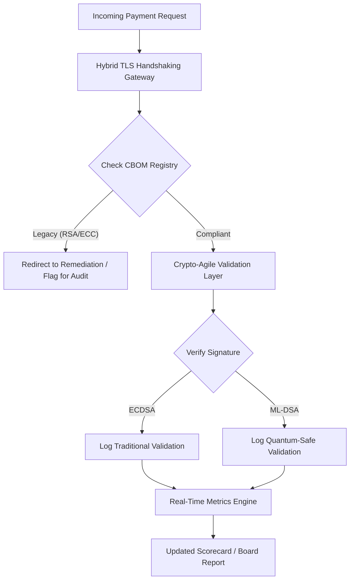

# Karta Wyników Bezpieczeństwa Post-Kwantowego 2026: framework metryk dla zarządu dla fiducjarnej kryptograficznej zwinności

<aside class="post-lead" aria-label="Streszczenie artykułu">

<strong>TL;DR.</strong> Na czerwiec 2026 r. kryptografia post-kwantowa (PQC) przeszła z eksperymentalnego problemu technicznego do podstawowego obowiązku fiducjarnego. Zarządy muszą teraz nadzorować systematyczną migrację starszego szyfrowania do standardów NIST FIPS 203 i 204, aby ograniczyć systemowe ryzyko finansowe i operacyjne w ramach DORA.

<strong>Kluczowe wnioski</strong>

<ul class="post-lead-takeaways">
  <li><strong>Wyrównanie G20 i twarde terminy.</strong> Międzynarodowe organy regulacyjne wyznaczyły późne lata 2020. jako twardy termin przejść kwantowo-odpornych, wymagając od instytucji wykazania mierzalnego postępu migracji.</li>
  <li><strong>Cryptographic Bill of Materials (CBOM).</strong> Analogicznie do BOM oprogramowania, CBOM to żywy, zautomatyzowany inwentarz wszystkich aktywów kryptograficznych — niezbędny do zapewnienia widoczności w łańcuchu dostaw.</li>
  <li><strong>Ekspozycja Harvest-Now-Decrypt-Later (HNDL).</strong> Przeciwnicy przechwytują i przechowują dziś szyfrowane dane wysokowartościowych płatności hurtowych; ograniczenie tego ryzyka wymaga natychmiastowego wdrożenia hybrydowych architektur PQC.</li>
  <li><strong>Nadzór fiducjarny przez kryptograficzną zwinność.</strong> Kryptograficzna zwinność to mierzalna metryka nadzoru. Zdolność do wymiany prymitywów kryptograficznych bez re-inżynierii systemów rdzeniowych (przy użyciu bibliotek takich jak KyberLib) to obecnie odpowiedzialność na poziomie zarządu w ramach SM&CR.</li>
</ul>

<strong>Powiązane lektury:</strong> <a href="https://sebastienrousseau.com/2026-06-12-kyberlib-post-quantum-banking-migration-standards-code-2026">KyberLib i migracja bankowości post-kwantowej w 2026</a>, <a href="https://sebastienrousseau.com/2023-11-19-crystals-kyber-the-safeguarding-algorithm-in-a-quantum-age/index.html">CRYSTALS-Kyber: algorytm ochrony w erze kwantowej</a>.

</aside>
Bezpieczeństwo post-kwantowe nie jest już projektem badawczym. „Zegar nadzorczy" tyka w stronę terminów egzekucyjnych pod koniec lat 2020. Finalizacja [NIST FIPS 203 (ML-KEM)](https://csrc.nist.gov/pubs/fips/203/final) i [NIST FIPS 204 (ML-DSA)](https://csrc.nist.gov/pubs/fips/204/final) skodyfikowała standardy enkapsulacji kluczy i podpisów cyfrowych.

Organy regulacyjne oczekują obecnie, że banki Tier-1 wyjdą poza programy pilotażowe. W 2026 r. fokus przesunął się na industrializację tych standardów. Brak wykazania jasnej ścieżki migracji niesie znaczące sankcje regulacyjne na mocy [Digital Operational Resilience Act (DORA)](https://eur-lex.europa.eu/eli/reg/2022/2554/oj) oraz potencjalną osobistą odpowiedzialność członków zarządu, którzy ignorują przewidywalne zagrożenie deszyfracji wspomaganej kwantowo.

## 01. Karta wyników kwantowych dla zarządu

Poniższe metryki dostarczają zarządom standaryzowany framework do oceny gotowości kwantowej i kondycji kryptograficznej w obszarach Commercial and Investment Banking (CIB).

### Tabela 1: metryki Karty Wyników PQC i tolerancje

| Metryka | Wzór matematyczny | Tolerancje zatwierdzone przez zarząd | Ryzyko przy przekroczeniu tolerancji |
| ---- | ---- | ---- | ---- |
| **Inventory Completeness Percentage (ICP)** | (Zidentyfikowane aktywa kryptograficzne / Szacowane aktywa łącznie) × 100 | > 98% | Szare szyfrowanie i ślepe plamy w ścieżkach danych wysokowartościowego rozliczania. |
| **HNDL Exposure Rate (HER)** | (Dane długożyciowe na starszej kryptografii / Całość danych długożyciowych) × 100 | < 5% | Trwałe naruszenie tajemnic handlowych, ksiąg długu suwerennego i rejestrów płatności hurtowych. |
| **NIST Migration Progress Rate (MPR)** | (Systemy używające FIPS 203/204 / Krytyczne systemy łącznie) × 100 | > 60% (do końca 2026 r.) | Brak zgodności regulacyjnej i wykluczenie z grona kontrahentów zgodnych z G20. |
| **Crypto-Agility Readiness Index (CARI)** | (Aplikacje z abstrakcyjną warstwą kryptografii / Aplikacje rdzeniowe łącznie) × 100 | > 85% | Poważny dług techniczny i niezdolność do reakcji na przyszłe wycofania algorytmów. |

## 02. Cryptographic Bill of Materials (CBOM)

Metryka ICP jest wyjściowo ustanawiana przez kompleksową **fazę odkrywania CBOM**. To zautomatyzowany proces identyfikujący każdy endpoint kryptograficzny w przedsiębiorstwie.

- **Odkrywanie endpointów:** skanowanie sieci wewnętrznych i chmurowych pod kątem aktywnych sesji TLS w celu identyfikacji użycia starszego RSA lub ECC.
- **Inwentarz kluczy:** mapowanie par kluczy publicznych/prywatnych do ich właścicieli oraz mapowanie dokładnych dat wygaśnięcia.
- **Mapowanie zależności:** identyfikacja bibliotek i API stron trzecich opartych na wycofanych algorytmach.

Ta faza odkrywania tworzy pojedyncze źródło prawdy, umożliwiając CISO raportowanie kondycji kryptograficznej z taką samą granularnością jak wynik finansowy.

## 03. Eliminacja ekspozycji HNDL w płatnościach hurtowych

Przeciwnicy aktywnie atakują płatności hurtowe i długożyciowe bazy danych korporacyjnych. Ataki „Harvest-Now-Decrypt-Later" (HNDL) polegają na przechwytywaniu i archiwizacji dzisiejszego ruchu szyfrowanego.

Nawet jeśli cryptographically relevant quantum computer (CRQC) jeszcze dziś nie istnieje, dane przechwycone teraz będą podatne w przyszłości. Ograniczenie tego ryzyka wymaga priorytetowej migracji danych długożyciowych (np. rejestrów tożsamości, 30-letnich kontraktów obligacji i archiwów prawnych), co bezpośrednio obniża metrykę HER. Modernizacja kanałów płatności do hybrydowego szyfrowania PQC-tradycyjnego (przy użyciu ML-KEM obok X25519) zapewnia natychmiastową obronę przed zagrożeniami archiwizacyjnymi.

## 04. Operacjonalizacja kryptograficznej zwinności przez dobrze zaprojektowane interfejsy

Kryptograficzna zwinność realizuje się przez abstrakcje inżynieryjne. Nowoczesne biblioteki takie jak [KyberLib](https://sebastienrousseau.com/2026-06-12-kyberlib-post-quantum-banking-migration-standards-code-2026) pokazują, jak deweloperzy mogą wdrażać moduły kwantowo-odporne bez przepisywania całego stosu aplikacyjnego.

- **Abstrakcyjne wrappery:** aplikacje wywołują generyczną funkcję `encrypt()` lub `sign()` zamiast procedur specyficznych dla algorytmu.
- **Wymiana w czasie wykonania:** podstawowy moduł można podmienić z ECDSA na ML-DSA przez zmianę konfiguracji, a nie złożone wdrożenia kodu.

Ta architektura gwarantuje, że jeśli konkretny algorytm PQC zostanie w przyszłości złamany, organizacja może wykonać zwrot w godziny zamiast lat.

## 05. Workflow walidacji wejścia kwantowo-odpornego

Poniższy diagram ilustruje cykl życia danych wchodzących w bezpieczny perymetr w kwantowo-zwinnym środowisku bankowym.

## Wnioski

Majątek kryptograficzny banku Tier-1 to już nie sprawa CISO. To infrastruktura fiducjarna. NIST FIPS 203 i 204 ustalają algorytmy; art. 5 DORA wyznacza powierzchnię odpowiedzialności; SM&CR przypisuje ją wskazanemu z imienia członkowi kadry kierowniczej. Powyższa karta wyników — Inventory Completeness, HNDL Exposure, Migration Progress, Crypto-Agility — daje zarządowi cztery liczby potrzebne do nadzorowania tego majątku bez konieczności czytania kodu kryptograficznego.

Liczbą, która ma największe znaczenie, jest HNDL Exposure. Każdy rekord zaszyfrowany starszym algorytmem leżący dziś w archiwum płatności hurtowych będzie czytelny w dniu, w którym dostarczony zostanie pierwszy cryptographically relevant quantum computer. Odliczanie jest ciche i asymetryczne: obrońcy mogą działać tylko na danych, które posiadają, przeciwnicy mogą działać na danych, które wyeksfiltrowali lata temu. 30-letni kontrakt obligacji korporacyjnej zaszyfrowany RSA-2048 w 2024 r. to kontrakt, który traci gwarancję poufności w dniu uruchomienia CRQC.

[KyberLib](https://sebastienrousseau.com/2026-06-12-kyberlib-post-quantum-banking-migration-standards-code-2026) i jego odpowiedniki przekuwają to z wieloletniego przepisywania platformy w zmianę konfiguracji. Zadaniem zarządu nie jest pisanie kodu. Zadaniem zarządu jest żądać, by Crypto-Agility Readiness Index — udział aplikacji rdzeniowych za abstrakcyjnym interfejsem kryptograficznym — przekroczył 85% w ciągu dwunastu miesięcy, i czytać kwartalną kartę wyników.

<aside class="author-card" aria-label="O autorze"><strong class="author-card-name"><a href="/about/index.html">Sebastien Rousseau</a></strong>Starszy technolog bankowy piszący o stosowanej AI, migracji ISO 20022, kryptografii post-kwantowej dla usług finansowych i strukturalnej transformacji płatności hurtowych.Ponad 20 lat doświadczenia w HSBC Commercial & Investment Bank, PayPal, Barclays, Shazam. <a href="https://www.linkedin.com/in/sebastienrousseau/" rel="external noopener">LinkedIn</a> &middot; <a href="https://github.com/sebastienrousseau" rel="external noopener">GitHub</a></aside>

Ostatnio sprawdzono <time datetime="2026-06-29">2026-06-29</time>.

