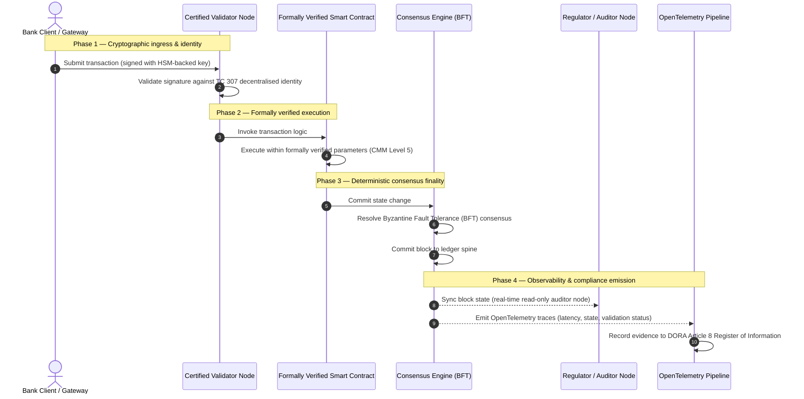

# Od dowodu do prawdy: dlaczego certyfikowane blockchainy zdefiniują kolejną erę zaufania bankowego

## Podsumowanie strategiczne (w skrócie)

Bankowość hurtowa i globalne transakcje znajdują się w 2026 roku w historycznym punkcie zwrotnym. W miarę jak usługi finansowe przechodzą na natywnie cyfrowe sieci rozliczeniowe działające w czasie rzeczywistym, a sztuczna inteligencja wprowadza probabilistyczny niedeterminizm, tradycyjne analogowe, retrospektywne modele atestacji (takie jak statyczne audyty oparte na podmiocie) przestają spełniać nowoczesne wymogi zarządzania ryzykiem i obowiązków powierniczych.

Komitet Techniczny ISO/IEC TC 307 ustanowił znormalizowaną podstawę dla technologii rozproszonego rejestru. Prawdziwe wdrożenie instytucjonalne wymaga jednak przejścia od opisowych wytycznych do nakazowej, niezależnie certyfikowalnej atestacji blockchaina. Oceniając ład rejestru, integralność konsensusu, bezpieczeństwo inteligentnych kontraktów i zwinność kryptograficzną według rygorystycznego pięciopoziomowego modelu dojrzałości zdolności (CMM), banki mogą przejść od fragmentarycznych, specyficznych dla dostawcy założeń do certyfikowalnej, możliwej do audytu przez zarząd prawdy finansowej.

## Najważniejsze wnioski

* **Powiernicza luka tarcia**: potrafimy dziś certyfikować bank (Bazylea III), chmurę (ISO 27001) i systemy ładu SI (ISO 42001), ale nie potrafimy jeszcze certyfikować rozproszonego rejestru, który coraz częściej decyduje o tym, co jest prawdą. Ta asymetria stanowi poważną podatność operacyjną.  
* **DORA wymusza bezpośrednią odpowiedzialność powierniczą**: na mocy art. 5 DORA zarządy banków ponoszą bezpośrednią, niedelegowalną odpowiedzialność osobistą za odporność operacyjną wszystkich wdrożeń stron trzecich i rejestrów, z surowymi sankcjami osobistymi w ramach reżimu SM&CR za uchybienia.  
* **Kręgosłup audytowy SI**: tam, gdzie uczenie maszynowe generuje niepowtarzalne, probabilistyczne wyniki, certyfikowany blockchain zapewnia deterministyczne uchwycenie stanu. Zapisywanie w łańcuchu wersji modeli, danych wejściowych i decyzji walidacyjnych spełnia ISO 42001 oraz standardy zarządzania ryzykiem modelu.  
* **Indeks Certyfikowanych Blockchainów**: indeks ten formalizuje ład, konsensus, inteligentne kontrakty i obserwowalność w weryfikowalną, gotową do audytu kartę wyników w skali CMM od 0 do 5, przekładając miary inżynierskie na zatwierdzone przez zarząd deklaracje apetytu na ryzyko.

## 01. Powiernicza luka tarcia w bankowości cyfrowej

W klasycznej bankowości zaufanie jest relacyjne, instytucjonalne i retrospektywne. Opiera się na niezależnych audytorach zewnętrznych badających stan finansowy w ustalonych momentach i uzgadniających rozbieżności między silosami rejestrów bilateralnych. Na działających w czasie rzeczywistym, sterowanych API rynkach 2026 roku model ten wprowadza zaporowe opóźnienia i ryzyka strukturalne.

Gdy transakcje rozliczają się natychmiast, śróddzienne pule płynności są dynamicznie zarządzane przez bramki API, a własność aktywów jest tokenizowana we współdzielonych rejestrach, audyty retrospektywne stają się ćwiczeniami śledczymi, a nie kontrolami prewencyjnymi. Powiernicy nie mogą już poprzestawać na certyfikowaniu podmiotu prawnego. Muszą certyfikować samo cyfrowe podłoże.

Obecnie banki działają w warunkach rażącej asymetrii architektonicznej:

1. **Certyfikowana infrastruktura chmurowa**: węzły sprzętowe, zwirtualizowane kontenery i fizyczne centra danych są walidowane wobec kontroli ISO/IEC 27001 i SOC 2 Type II.  
2. **Certyfikowane procesy zarządcze**: polityki ryzyka operacyjnego, plany ciągłości działania i wdrożenia algorytmiczne podlegają rygorystycznym ramom ryzyka.  
3. **Niecertyfikowane silniki rejestru**: mechanizmy rozproszonego konsensusu, łańcuchy dostaw węzłów walidujących, granice inteligentnych kontraktów i modele ładu sieci pozostawia się niecertyfikowanym, dostosowanym lub specyficznym dla konsorcjum założeniom.

Ta asymetria jest krytycznym punktem awarii. Bank może uruchomić zwalidowaną aplikację w bezpiecznym, certyfikowanym ISO 27001 kontenerze chmurowym, ale jeśli ten kontener zapisuje do rozproszonego rejestru ze scentralizowaną kontrolą walidatorów, podatnymi parametrami konsensusu lub niezaudytowanymi inteligentnymi kontraktami, integralność transakcji jest naruszona. Aby zniwelować tę lukę, sam silnik rejestru musi stać się certyfikowalnym obiektem atestacji.

## 02. Podstawa normalizacyjna ISO/IEC TC 307

Fundamentalną pracę niezbędną do normalizacji rozproszonych rejestrów prowadzi Komitet Techniczny ISO/IEC TC 307 (Technologie blockchain i rozproszonego rejestru). Zamiast traktować blockchain jako odizolowany protokół techniczny, TC 307 podchodzi do niego jak do instytucjonalnej infrastruktury zaufania, organizując swoją pracę wokół pięciu głównych filarów:

1. **Taksonomia i słownictwo (ISO 22739)**: ustanawia wspólną nomenklaturę, zapewniając spójne definicje prawne i operacyjne w różnych jurysdykcjach, schematach finansowych i instytucjach.  
2. **Architektura referencyjna (ISO/TR 23245)**: definiuje granice, warstwy, przepływy danych i komponenty funkcjonalne zgodnego systemu rozproszonego rejestru.  
3. **Bezpieczeństwo, prywatność i inteligentne kontrakty (ISO/TR 23244 / ISO 23613)**: ustanawia bazowe wytyczne bezpieczeństwa dla systemów aktywów cyfrowych i szczegółowo opisuje najlepsze praktyki łagodzenia podatności inteligentnych kontraktów oraz ładu ich cyklu życia.  
4. **Ramy interoperacyjności**: dotyczą mechanizmów wymiany danych i aktywów między heterogenicznymi sieciami rejestrów, zapobiegając powstawaniu odizolowanych stokenizowanych silosów.  
5. **Tożsamość zdecentralizowana i kotwice zaufania**: integruje oparte na rejestrze identyfikatory kryptograficzne z formalnymi infrastrukturami klucza publicznego (PKI) i rejestrami autoryzowanymi przez państwo.

Łącznie TC 307 sygnalizuje przejście DLT od dostosowanego wyboru inżynierskiego do znormalizowanej dyscypliny architektonicznej. TC 307 pozostaje jednak głównie opisowy. Definiuje, jak wygląda doskonałość (wytyczne), lecz nie dostarcza nakazowego protokołu weryfikacji (atestacji), którego oficerowie ryzyka i nadzorcy potrzebują, aby autoryzować wdrożenia produkcyjne funkcji krytycznych lub istotnych (CIF).

## 03. Wytyczne a atestacja: rozróżnienie powiernicze

Uczestnicy rynków finansowych nie wdrażają technologii dlatego, że jest innowacyjna czy elegancka; wdrażają ją wtedy, gdy można nią zarządzać, audytować ją, bronić i uzgadniać z wymogami rezerw kapitałowych. Dlatego normalizacja w bankowości naturalnie rozkłada się na dwie warstwy:

* **Wytyczne (ramy)**: zarysowują najlepsze praktyki, cele referencyjne i wskazówki architektoniczne (np. ISO/IEC TC 307, ramy NIST).  
* **Atestacja (dowód)**: dostarcza niezależnych, ciągłych i weryfikowalnych przez stronę trzecią dowodów, że ramy są wdrożone i działają zgodnie z założeniem (np. certyfikacja ISO 27001, audyty SOC 2, kontrole regulacyjne).

Poleganie na niecertyfikowanym konsensusie rejestru przy jednoczesnym certyfikowaniu infrastruktury chmurowej to krytyczna luka regulacyjna. Blockchain „niezmienny" nie jest bynajmniej „instytucjonalnie zaufany". Niezmienność gwarantuje jedynie, że wprowadzone dane pozostają niezmienione; nie weryfikuje, czy węzły walidujące są bezpieczne, czy protokół konsensusu jest odporny na zmowę, czy logika inteligentnych kontraktów jest matematycznie poprawna oraz czy zarządzanie kluczami kryptograficznymi spełnia mandaty postkwantowe.

Aby zamknąć tę lukę, Indeks Certyfikowanych Blockchainów 2026 formalizuje te wymogi w wymierny model dojrzałości zdolności (CMM), zmapowany na globalne regulacje bankowe.

## 04. Indeks Certyfikowanych Blockchainów 2026

Aby umożliwić kierownictwu wyższego szczebla ocenę i certyfikację platform rejestrowych, indeks ten strukturyzuje infrastrukturę rozproszonego rejestru w pięć audytowalnych warstw operacyjnych, ocenianych w skali CMM od 0 do 5.

## Tabela 1: architektura Indeksu Certyfikowanych Blockchainów

| Warstwa indeksu | Poziom dojrzałości (CMM) | Miara techniczna i operacyjna | Odniesienie do kontroli regulacyjnej / powierniczej |
| ---- | ---- | ---- | ---- |
| **Ład rejestru** | **Poziom 0**: konsorcjum ad hoc**Poziom 3**: zautomatyzowana weryfikacja i rotacja walidatorów**Poziom 5**: zdecentralizowane, wielostronne kryptograficzne zakotwiczenie tożsamości | % węzłów walidujących obsługiwanych przez zweryfikowane podmioty finansowe; średni czas rozstrzygnięcia sporów walidatorów; rozkład geograficzny węzłów | **DORA art. 5** (Ład i organizacja); **CPMI-IOSCO PFMI Zasada 2** (Ład) i **Zasada 3** (Ramy kompleksowego zarządzania ryzykiem) |
| **Integralność konsensusu** | **Poziom 0**: pojedynczy węzeł lub nieprzejrzysty PoW**Poziom 3**: zaudytowany BFT z deterministyczną finalnością**Poziom 5**: wielojurysdykcyjny, formalnie zweryfikowany konsensus z ciągłym monitorowaniem opóźnień | maks. tolerowalne opóźnienie konsensusu; próg odporności na zmowę; SLA dostępności przy symulowanej partycji węzłów | **DORA art. 6** (Ramy zarządzania ryzykiem ICT); **CPMI-IOSCO PFMI Zasada 8** (Ostateczność rozrachunku) |
| **Tożsamość i kryptografia** | **Poziom 0**: słabe klucze RSA / ECDSA**Poziom 3**: multipodpis z zarządzaniem kluczami opartym na HSM**Poziom 5**: hybrydowe klucze kwantoodporne (FIPS 203 ML-KEM) i bramki prywatności o wiedzy zerowej | % transakcji rejestru podpisanych kluczami opartymi na HSM; wynik gotowości do migracji PQC; opóźnienie dowodów ZK | **NIST FIPS 203 / 204**; **ISO/IEC 27001** (Zarządzanie bezpieczeństwem informacji) |
| **Atestacja inteligentnych kontraktów** | **Poziom 0**: niezaudytowane skrypty Solidity**Poziom 3**: zautomatyzowana walidacja kompilatora i audyt zewnętrzny**Poziom 5**: formalnie zweryfikowane, niezmienne inteligentne kontrakty z aktualizacjami typu bezpiecznik | % inteligentnych kontraktów z matematyczną weryfikacją formalną; liczba ostrzeżeń kompilatora; pokrycie skanów podatności | **Wytyczne EBA w sprawie outsourcingu** (paragrafy 81, 113-117); **DORA art. 30** (Minimalne klauzule umowne) |
| **Audyt i obserwowalność** | **Poziom 0**: ręczne zbieranie logów**Poziom 3**: ustrukturyzowane ślady OTel i węzły audytora tylko do odczytu**Poziom 5**: zautomatyzowane, ciągłe uzgadnianie z rejestrem z art. 8 | % transakcji objętych śladami OpenTelemetry; opóźnienie od zatwierdzenia bloku do synchronizacji węzła audytora | **BCBS 239** (Agregacja danych o ryzyku); **DORA art. 8** (Rejestr informacji / schematy ITS) |

## Tabela 2: kluczowe sygnały zaufania zmapowane na globalne standardy bankowe

| Sygnał / punkt odniesienia | Miara | Wpływ na platformy bankowe | Źródło regulacyjne |
| ---- | ---- | ---- | ---- |
| **Postęp ISO/IEC TC 307** | Przejście od raportów technicznych ISO/TR do formalnych schematów certyfikacji | Ustanawia pierwsze znormalizowane ramy certyfikacji silników rozproszonego rejestru | **ISO/IEC JTC 1 / SC 44** (Technologie rozproszonego rejestru) |
| **Faza prototypowa Projektu Agorá** | Ponad 40 uczestniczących banków komercyjnych; test ujednoliconego rejestru stokenizowanych depozytów | Przesuwa rozliczenia transgraniczne z komunikatów (SWIFT) na atomowy stokenizowany rozrachunek | **Centrum Innowacji Banku Rozrachunków Międzynarodowych (BIS)** |
| **Audyt strony trzeciej DORA art. 30** | 100 % dostawców węzłów i hostów infrastruktury zaudytowanych według kryteriów bezpieczeństwa | Eliminuje „cień węzłów walidujących"; nakazuje pełną przejrzystość łańcucha dostaw | **Europejskie Urzędy Nadzoru (ESA)** |
| **ISO/IEC 42001 (ład SI)** | Logi modeli i treningu SI uczynione kryptograficznie niezmiennymi w łańcuchu | Wykorzystuje blockchain jako niezmienny rejestr dowodowy („kręgosłup audytowy") dla uczenia maszynowego | **ISO/IEC 42001:2023** (Technologia informacyjna — Sztuczna inteligencja) |
| **Adekwatność kapitałowa Bazylea III** | Redukcja buforów kapitałowych na ryzyko operacyjne w oparciu o udokumentowaną redukcję złożoności | Znormalizowane ramy ryzyka operacyjnego bezpośrednio uznają zweryfikowaną odporność rejestru | **Bazylejski Komitet Nadzoru Bankowego (BCBS)** |

## 05. „Kręgosłup audytowy" SI: inteligencja probabilistyczna na infrastrukturze deterministycznej

Jedną z najpotężniejszych ról strategicznych certyfikowanego blockchaina w 2026 roku jest działanie jako **„kręgosłup audytowy"** dla wdrożeń sztucznej inteligencji. Nowoczesne systemy finansowe są coraz bardziej probabilistyczne. Ocena zdolności kredytowej, wykrywanie oszustw w czasie rzeczywistym, handel algorytmiczny i autonomiczne interakcje z klientami napędzane są przez modele uczenia maszynowego, które ewoluują, dryfują i dostosowują się w czasie. Modele te są niedeterministyczne: przy tych samych danych wejściowych w dwóch różnych momentach mogą dawać różne wyniki z powodu dynamicznych wag i ciągłego treningu.

Ten niedeterminizm rodzi głębokie wyzwanie w zakresie ładu na mocy **ISO/IEC 42001 (ład SI)** i standardów zarządzania ryzykiem modelu (MRM) (takich jak **SR 11-7 amerykańskiej Rezerwy Federalnej** i **SS1/23 brytyjskiego PRA**): *jak audytować, wyjaśniać i bronić decyzji, które nie są ściśle odtwarzalne?*

Certyfikowany rozproszony rejestr stanowi deterministyczną przeciwwagę. Tam, gdzie modele SI działają probabilistycznie, certyfikowany blockchain zapisuje ich parametry deterministycznie, ustanawiając niezmienialny kręgosłup dowodowy:

* **Wersjonowanie modeli i zakotwiczanie wag**: każda wdrożona wersja modelu, jej powiązane wagi i sumy kontrolne danych treningowych są haszowane i zapisywane w rejestrze w czasie budowy, spełniając wymogi łańcucha dostaw **SLSA Level 3**.  
* **Kontekstowe logowanie danych wejściowych**: gdy model SI wykonuje krytyczną decyzję (np. zatwierdza pożyczkę lub oznacza transakcję), dokładne dane kontekstowe i hasze modelu są zapisywane w rejestrze, tworząc odporną na manipulacje historię.  
* **Audytowalność bez dostępu do kodu**: jeśli regulator zapyta „dlaczego wasz model odrzucił ten wniosek kredytowy 3 czerwca?", bank nie musi ujawniać swojego zastrzeżonego kodu ani próbować odtworzyć dokładnego stanu modelu. Przedstawia kryptograficznie podpisany zapis w łańcuchu danych wejściowych, wag i stanu walidacji.

Kotwicząc probabilistyczne decyzje modeli uczenia maszynowego w deterministycznym konsensusie certyfikowanego blockchaina, instytucja tworzy możliwą do obrony, odtwarzalną i niezależnie weryfikowalną oś czasu działań zautomatyzowanych.

## 06. Wizualizacja certyfikowanego potoku od konsensusu do audytu

Poniższy diagram sekwencji ilustruje cykl życia transakcji przechodzącej przez certyfikowaną platformę blockchain, pokazując, jak bramki walidacyjne, integralność konsensusu, wykonanie inteligentnych kontraktów i emisja telemetrii łączą się, aby wytworzyć gotowy dla zarządu dowód regulacyjny:

Ścieżka krytyczna tej sekwencji transakcyjnej wymaga, aby każdy krok walidacji, wykonania i konsensusu był podpisany kryptograficznie, zapewniając pochodzenie od końca do końca. Węzeł audytora regulatora synchronizuje stan bloków w czasie rzeczywistym, eliminując potrzebę retrospektywnego, ręcznego uzgadniania finansowego.

## 07. Podręcznik zarządu dla kadry kierowniczej

Aby pomyślnie przejść od zaufania organizacyjnego do zaufania infrastrukturalnego, kadra kierownicza i menedżerowie wyższego szczebla banków powinni niezwłocznie wykonać cztery kluczowe dyrektywy:

1. **Uczynienie audytów rejestru obowiązkowymi w zarządzaniu ryzykiem przedsiębiorstwa (ERM)**: egzekwowanie polityki, zgodnie z którą żadna platforma rozproszonego rejestru — prywatna, publiczna czy konsorcjalna — nie może zostać wdrożona dla funkcji krytycznych lub istotnych (CIF) bez zaudytowania wobec pięciowarstwowej **architektury Indeksu Certyfikowanych Blockchainów** (minimum CMM Poziom 3).  
2. **Integracja blockchainów jako kręgosłupa dowodowego SI ISO 42001**: polecenie dyrektorowi ds. ryzyka i głównemu architektowi SI zintegrowania wszystkich modeli uczenia maszynowego o dużym wpływie z certyfikowanym blockchainem, tworząc odporny na manipulacje rejestr audytowy wersji modeli, wag, danych wejściowych i decyzji.  
3. **Audyt łańcucha dostaw węzłów walidujących (DORA art. 30)**: wymóg, aby dział zakupów audytował wszystkie podmioty zewnętrzne hostujące węzły walidujące lub zarządzające hostingiem chmurowym dla sieci DLT, nakazując te same standardy cyberbezpieczeństwa i odporności operacyjnej co dla wewnętrznych węzłów chmurowych banku.  
4. **Dostosowanie architektur rejestru do CPMI-IOSCO i BCBS 239**: polecenie zespołowi inżynierii platformy dostosowania telemetrii wyjściowej rejestru bezpośrednio do wymogów raportowania danych **BCBS 239** oraz zapewnienia, że parametry konsensusu i ostateczności rozrachunku ściśle odpowiadają **Zasadom 8 i 9 CPMI-IOSCO**.

## 08. Najczęściej zadawane pytania

**Czy ISO/IEC TC 307 to standard certyfikacji?**  
Nie. ISO/IEC TC 307 to komitet techniczny ustanawiający słownictwo, architektury referencyjne i wytyczne bezpieczeństwa. Choć definiuje „jak wygląda doskonałość" (wytyczne), branża musi zoperacjonalizować te dokumenty w formalne, audytowalne schematy certyfikacji (atestacja), aby zadowolić nadzorców bankowych.

**W jaki sposób certyfikowany blockchain wspiera zgodność z DORA?**  
Na mocy art. 5 DORA zarządy banków ponoszą bezpośrednią osobistą odpowiedzialność za odporność technologiczną. Certyfikowany blockchain dostarcza weryfikowalny kryptograficzny dowód integralności konsensusu, kontroli łańcucha dostaw walidatorów i bezpieczeństwa inteligentnych kontraktów, dając członkom zarządu udokumentowane „rozsądne kroki" niezbędne do obrony przed roszczeniami z tytułu osobistej odpowiedzialności w ramach SM&CR.

Jaka jest różnica między tradycyjnym audytem rejestru a audytem certyfikowanego blockchaina?  
Tradycyjny audyt jest retrospektywny: weryfikuje ręczne zapisy i statyczne pliki po rozliczeniu transakcji. Audyt certyfikowanego blockchaina jest ciągły i w czasie rzeczywistym; węzły walidujące, silnik konsensusu BFT i formalnie zweryfikowane inteligentne kontrakty są certyfikowane do deterministycznego wykonywania transakcji, emitując ustrukturyzowaną telemetrię (OpenTelemetry), która nieustannie waliduje kondycję systemu.

Czy blockchainy publiczne można certyfikować do użytku bankowego?  
W większości jurysdykcji czysto bezuprawnieniowe blockchainy publiczne nie spełniają regulacji bankowych z powodu braku weryfikacji tożsamości walidatorów, nieprzewidywalnych kosztów transakcji i niedeterministycznej finalności (np. probabilistyczne rozgałęzienia proof-of-work/stake). Certyfikowane blockchainy w bankowości zazwyczaj wykorzystują korporacyjne architektury uprawnieniowe lub silnie regulowane architektury publiczno-hybrydowe, w których operatorzy węzłów walidujących są zidentyfikowanymi i zaudytowanymi podmiotami finansowymi.

## 09. Bibliografia

* Bazylejski Komitet Nadzoru Bankowego (BCBS), 2013. *Principles for effective risk data aggregation and reporting (BCBS 239)*. Bazylea: Bank Rozrachunków Międzynarodowych. Dostępne pod: [https://www.bis.org/publ/bcbs239.pdf](https://www.bis.org/publ/bcbs239.pdf).  
* Committee on Payments and Market Infrastructures oraz Technical Committee of the International Organization of Securities Commissions (CPMI-IOSCO), 2012. *Principles for financial market infrastructures*. Bazylea: Bank Rozrachunków Międzynarodowych. Dostępne pod: [https://www.bis.org/cpmi/publ/d101.htm](https://www.bis.org/cpmi/publ/d101.htm).  
* Europejski Urząd Nadzoru Bankowego (EBA), 2019. *EBA/GL/2019/02 — Guidelines on outsourcing arrangements*. Paryż: EBA. Dostępne pod: [https://www.eba.europa.eu/regulation-and-policy/internal-governance/guidelines-on-outsourcing-arrangements](https://www.eba.europa.eu/regulation-and-policy/internal-governance/guidelines-on-outsourcing-arrangements).  
* Parlament Europejski i Rada Unii Europejskiej, 2022. *Rozporządzenie (UE) 2022/2554 w sprawie operacyjnej odporności cyfrowej sektora finansowego (DORA)*. Bruksela: Dziennik Urzędowy Unii Europejskiej. Dostępne pod: [https://eur-lex.europa.eu/legal-content/PL/TXT/?uri=CELEX%3A32022R2554](https://eur-lex.europa.eu/legal-content/PL/TXT/?uri=CELEX%3A32022R2554).  
* ISO/IEC JTC 1/SC 42, 2023. *ISO/IEC 42001:2023 — Information technology — Artificial intelligence — Management system*. Genewa: Międzynarodowa Organizacja Normalizacyjna. Dostępne pod: [https://www.iso.org/standard/81230.html](https://www.iso.org/standard/81230.html).  
* Komitet Techniczny ISO/IEC 307, 2020. *ISO/IEC 22739:2020 — Blockchain and distributed ledger technologies — Vocabulary*. Genewa: Międzynarodowa Organizacja Normalizacyjna. Dostępne pod: [https://www.iso.org/standard/73771.html](https://www.iso.org/standard/73771.html).  
* National Institute of Standards and Technology (NIST), 2026. *First Three Finalized Post-Quantum Encryption Standards (FIPS 203, 204, and 205)*. Gaithersburg: U.S. Department of Commerce. Dostępne pod: [https://www.nist.gov/news-events/news/2024/08/nist-releases-first-3-finalized-post-quantum-encryption-standards](https://www.nist.gov/news-events/news/2024/08/nist-releases-first-3-finalized-post-quantum-encryption-standards).
