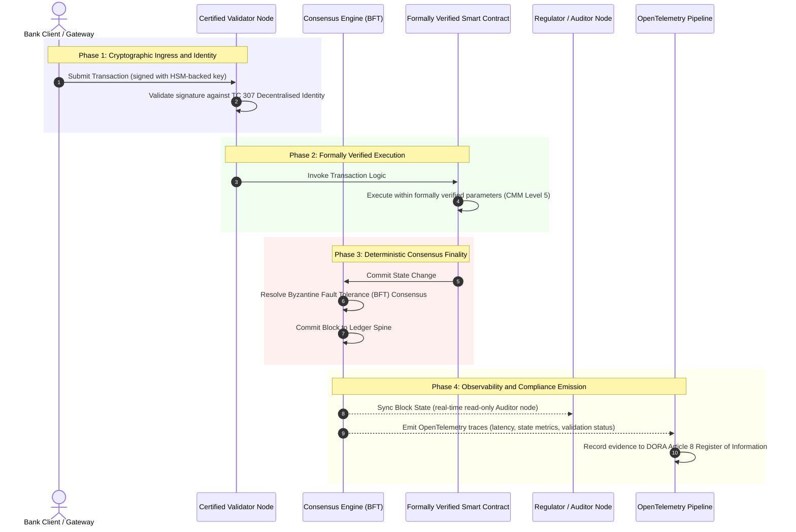

# Od dowodu do prawdy: dlaczego certyfikowane blockchainy zdefiniują nową erę zaufania w bankowości

**Niezmienny to nie to samo co zaufany.** Gdy bankowość hurtowa przechodzi na rozrachunek w czasie rzeczywistym i probabilistyczną AI, księga decydująca o tym, co jest prawdą, stała się jedyną warstwą, której banki wciąż nie potrafią certyfikować. Certyfikują podmiot na podstawie Basel III, chmurę na podstawie ISO 27001 oraz swoją AI na podstawie ISO 42001, ale rozproszona księga, jej governance, konsensus, kryptografia i inteligentne kontrakty pozostawione są założeniom specyficznym dla dostawcy. Ten raport dowodzi, że zamknięcie tej luki fiducjarnej wymaga przejścia od wytycznych ISO/IEC TC 307 do preskryptywnego zapewnienia: oceny księgi względem 5-poziomowego Indeksu Certyfikowanego Blockchaina, który zamienia metryki inżynierskie w prawdę audytowalną przez zarząd i możliwą do obrony wobec DORA.

<!-- lead-start -->
<aside class="post-lead" aria-label="Streszczenie artykułu">

<strong>W skrócie.</strong> Banki certyfikują podmiot, chmurę i swoją AI, ale nie księgę, która coraz częściej rozstrzyga o tym, co jest prawdą. ISO/IEC TC 307 daje wytyczne, a nie zapewnienie. 5-poziomowy Indeks Certyfikowanego Blockchaina ocenia governance księgi, integralność konsensusu, tożsamość i kryptografię, zapewnienie inteligentnych kontraktów oraz obserwowalność względem modelu dojrzałości, zamykając lukę fiducjarną i dając probabilistycznej AI deterministyczny kręgosłup audytu.

<strong>Kluczowe wnioski</strong>

<ul class="post-lead-takeaways">
  <li><strong>Fiducjarna luka tarcia.</strong> Bank (Basel III), chmurę (ISO 27001) i system zarządzania AI (ISO 42001) można certyfikować; rozproszonej księgi, która decyduje o tym, co jest prawdą, jeszcze nie. Ta asymetria to realna podatność operacyjna.</li>
  <li><strong>DORA czyni to osobistym.</strong> Na mocy DORA Article 5 zarządy banków ponoszą bezpośrednią, niedelegowalną odpowiedzialność za odporność wdrożeń podmiotów trzecich i księgi, z osobistymi sankcjami SM&amp;CR za uchybienia.</li>
  <li><strong>Kręgosłup audytu AI.</strong> Uczenie maszynowe jest niereprodukowalne; certyfikowany blockchain deterministycznie utrwala w łańcuchu wersje modeli, dane wejściowe i decyzje walidacyjne, spełniając ISO 42001 oraz standardy zarządzania ryzykiem modelowym.</li>
  <li><strong>Indeks Certyfikowanego Blockchaina.</strong> Governance, konsensus, kryptografia, inteligentne kontrakty i obserwowalność stają się kartą wyników CMM w skali 0-5, która przekłada metryki inżynierskie na zatwierdzone przez zarząd Oświadczenia o Apetycie na Ryzyko.</li>
</ul>

<strong>Powiązane lektury:</strong> <a href="https://sebastienrousseau.com/2026-07-02-certified-blockchains-banking-trust-tc307-assurance-2026">Certyfikowane blockchainy i zaufanie w bankowości: zapewnienie TC 307</a>, <a href="https://sebastienrousseau.com/2026-07-24-global-payments-outlook-operating-model-risk-revenue">Globalne perspektywy płatności 2026</a>.

</aside>
<!-- lead-end -->

> **Streszczenie dla zarządu**
>
> - **Bankowość hurtowa znajduje się w punkcie zwrotnym.** Rozliczenia w czasie rzeczywistym i probabilistyczna AI łamią analogowy, retrospektywny model zapewnienia: statyczne audyty oparte na podmiocie nie spełniają już współczesnych wymogów zarządzania ryzykiem ani wymogów fiducjarnych.
> - **TC 307 to poziom bazowy, nie certyfikat.** ISO/IEC TC 307 ustandaryzowało słownictwo, architekturę referencyjną i wytyczne bezpieczeństwa dla rozproszonych ksiąg, ale ma charakter opisowy. Definiuje, jak wygląda dobro; nie dostarcza preskryptywnej weryfikacji, której specjaliści ds. ryzyka i nadzorcy potrzebują, by autoryzować wdrożenie produkcyjne.
> - **Zapewnienie oznacza ocenę księgi.** Governance, integralność konsensusu, bezpieczeństwo inteligentnych kontraktów i zwinność kryptograficzna, ocenione względem rygorystycznego 5-poziomowego modelu dojrzałości, przenoszą banki od fragmentarycznych, specyficznych dla dostawcy założeń do certyfikowalnej, audytowalnej przez zarząd prawdy finansowej.
> - **Księga jest kręgosłupem audytu dla AI.** Zakotwiczenie wersji modeli, danych wejściowych i decyzji walidacyjnych w deterministycznym konsensusie daje niereprodukowalnemu uczeniu maszynowemu możliwy do obrony, rekonstruowalny zapis dowodowy na mocy ISO 42001, SR 11-7 i PRA SS1/23.

## Fiducjarna luka tarcia w bankowości cyfrowej

W klasycznej bankowości zaufanie jest relacyjne, instytucjonalne i retrospektywne. Opiera się na niezależnych audytorach zewnętrznych przeglądających stan finansowy w statycznych momentach czasu, uzgadniających rozbieżności między dwustronnymi silosami ksiąg. Na rynkach 2026 roku, działających w czasie rzeczywistym i sterowanych API, model ten wprowadza nieakceptowalne opóźnienia i ryzyka strukturalne.

Gdy transakcje rozliczają się natychmiast, śróddzienne pule płynności są zarządzane dynamicznie przez bramy API, a własność aktywów jest tokenizowana w współdzielonych księgach, audyty retrospektywne stają się ćwiczeniami śledczymi, a nie kontrolami prewencyjnymi. Fiducjariusze nie mogą już polegać wyłącznie na certyfikacji podmiotu korporacyjnego. Muszą certyfikować samo cyfrowe podłoże.

Obecnie banki działają w warunkach rażącej asymetrii architektonicznej:

1. **Certyfikowana infrastruktura chmurowa**: Węzły sprzętowe, zwirtualizowane kontenery i fizyczne centra danych są walidowane względem kontroli ISO/IEC 27001 i SOC 2 Type II.  
2. **Certyfikowane procesy zarządcze**: Polityki ryzyka operacyjnego, plany ciągłości działania i wdrożenia algorytmiczne podlegają rygorystycznym ramom ryzyka.  
3. **Niecertyfikowane silniki księgowe**: Rdzeniowe mechanizmy konsensusu rozproszonego, łańcuchy dostaw węzłów walidujących, granice inteligentnych kontraktów i modele governance sieci pozostawione są niecertyfikowanym, autorskim lub konsorcyjnym założeniom.

Ta asymetria jest głównym punktem awarii. Bank może uruchomić zwalidowaną aplikację wewnątrz bezpiecznego, certyfikowanego według ISO 27001 kontenera chmurowego, ale jeśli ten kontener zapisuje do rozproszonej księgi ze scentralizowaną kontrolą walidatorów, podatnymi parametrami konsensusu lub niezaudytowanymi inteligentnymi kontraktami, integralność transakcji jest naruszona. Aby zniwelować tę lukę, sam silnik księgowy musi stać się certyfikowalnym obiektem zapewnienia.

## Poziom bazowy standaryzacji ISO/IEC TC 307

Fundamentalne prace niezbędne do standaryzacji rozproszonych ksiąg są prowadzone przez Komitet Techniczny ISO/IEC 307 (TC 307\) (Blockchain and distributed ledger technologies). Zamiast traktować blockchain jako izolowany protokół techniczny, TC 307 podchodzi do niego jako do instytucjonalnej infrastruktury zaufania, organizując swoje prace wokół pięciu głównych filarów:

1. **Taksonomia i słownictwo (ISO 22739\)**: Ustanawia wspólną nomenklaturę, zapewniając spójne definicje prawne i operacyjne w różnych jurysdykcjach, schematach finansowych i instytucjach.  
2. **Architektura referencyjna (ISO/TR 23245\)**: Definiuje granice, warstwy, przepływy danych i komponenty funkcjonalne zgodnego systemu rozproszonej księgi.  
3. **Bezpieczeństwo, prywatność i inteligentne kontrakty (ISO/TR 23244 / ISO 23613\)**: Ustanawia bazowe wytyczne bezpieczeństwa dla systemów aktywów cyfrowych oraz szczegółowo opisuje najlepsze praktyki ograniczania podatności inteligentnych kontraktów i governance cyklu życia.  
4. **Ramy interoperacyjności**: Adresuje mechanizmy wymiany danych i aktywów między heterogenicznymi sieciami ksiąg, zapobiegając powstawaniu izolowanych silosów tokenizowanych.  
5. **Zdecentralizowana tożsamość i kotwice zaufania**: Integruje kryptograficzne identyfikatory oparte na księdze z formalnymi infrastrukturami klucza publicznego (PKI) i rejestrami autoryzowanymi przez państwo.

Łącznie TC 307 sygnalizuje przejście DLT od autorskiego wyboru inżynierskiego do ustandaryzowanej dyscypliny architektonicznej. Jednak TC 307 pozostaje przede wszystkim opisowy. Definiuje, jak wygląda dobro (wytyczne), ale nie dostarcza preskryptywnego protokołu weryfikacji (zapewnienia), którego specjaliści ds. ryzyka i nadzorcy wymagają, aby autoryzować wdrożenia produkcyjne funkcji krytycznych lub istotnych (CIFs).

## Wytyczne a zapewnienie: rozróżnienie fiducjarne

Uczestnicy rynku finansowego nie wdrażają technologii dlatego, że jest innowacyjna czy elegancka; wdrażają ją, gdy da się nią zarządzać, poddać ją audytowi, obronić i uzgodnić z wymogami rezerw kapitałowych. Dlatego standaryzacja w bankowości naturalnie rozkłada się na dwie warstwy:

* **Wytyczne (ramy)**: Zarysowują najlepsze praktyki, cele referencyjne i wytyczne architektoniczne (np. ISO/IEC TC 307, ramy NIST).  
* **Zapewnienie (dowód)**: Dostarcza niezależnego, ciągłego i weryfikowalnego przez podmiot trzeci dowodu, że ramy są wdrożone i działają zgodnie z projektem (np. certyfikacja ISO 27001, audyty SOC 2, kontrole regulacyjne).

Poleganie na niecertyfikowanym konsensusie księgi przy jednoczesnej certyfikacji infrastruktury chmurowej to krytyczna luka regulacyjna. Blockchain, który jest „niezmienny”, nie jest z konieczności „zaufany instytucjonalnie”. Niezmienność gwarantuje jedynie, że wprowadzone dane pozostają niezmienione; nie weryfikuje, czy węzły walidujące są bezpieczne, czy protokół konsensusu jest odporny na zmowę, czy logika inteligentnego kontraktu jest matematycznie poprawna, ani czy zarządzanie kluczami kryptograficznymi spełnia mandaty postkwantowe.

Aby zamknąć tę lukę, Indeks Certyfikowanego Blockchaina 2026 formalizuje te wymogi w wymierny model dojrzałości (CMM) odwzorowany na globalne regulacje bankowe.

## Indeks Certyfikowanego Blockchaina 2026

Aby umożliwić kadrze kierowniczej wyższego szczebla ocenę i certyfikację platform księgowych, indeks ten strukturyzuje infrastrukturę rozproszonej księgi w pięć audytowalnych warstw operacyjnych, ocenianych w skali CMM od 0 do 5.

### Tabela 1: Architektura Indeksu Certyfikowanego Blockchaina

| Warstwa indeksu | Poziom dojrzałości (CMM) | Metryka techniczna i operacyjna | Referencja kontroli regulacyjnej / fiducjarnej |
| ---- | ---- | ---- | ---- |
| **Governance księgi** | **Level 0**: Doraźne konsorcjum**Level 3**: Zautomatyzowana weryfikacja i rotacja walidatorów**Level 5**: Zdecentralizowane, wielostronne kryptograficzne kotwiczenie tożsamości | % węzłów walidujących obsługiwanych przez zweryfikowane podmioty finansowe; średni czas rozstrzygnięcia sporów walidatorów; rozkład geograficzny węzłów | **DORA Article 5** (Governance and Organisation); **CPMI-IOSCO PFMI Principle 2** (Governance) i **Principle 3** (Framework for the comprehensive management of risks) |
| **Integralność konsensusu** | **Level 0**: Pojedynczy węzeł lub nieprzejrzysty POW**Level 3**: Zaudytowany BFT z deterministyczną ostatecznością**Level 5**: Wielojurysdykcyjny, formalnie zweryfikowany konsensus z ciągłym monitorowaniem opóźnień | Maksymalne tolerowane opóźnienie konsensusu; próg odporności na zmowę; SLA dostępności przy symulowanej partycji węzłów | **DORA Article 6** (ICT Risk Management Framework); **CPMI-IOSCO PFMI Principle 8** (Settlement Finality) |
| **Tożsamość i kryptografia** | **Level 0**: Słabe klucze RSA / ECDSA**Level 3**: Multi-sig z zarządzaniem kluczami wspieranym przez HSM**Level 5**: Kwantowo odporne klucze hybrydowe (FIPS 203 ML-KEM) i bramki prywatności z dowodem zerowej wiedzy | % transakcji księgi podpisanych kluczami wspieranymi przez HSM; wskaźnik gotowości migracji PQC; opóźnienie dowodu ZK | **NIST FIPS 203 / 204**; **ISO/IEC 27001** (Information Security Management) |
| **Zapewnienie inteligentnych kontraktów** | **Level 0**: Niezaudytowane skrypty solidity**Level 3**: Zautomatyzowana walidacja kompilatora i audyt zewnętrzny**Level 5**: Formalnie zweryfikowane, niezmienne inteligentne kontrakty z aktualizacjami typu circuit-breaker | % inteligentnych kontraktów z matematyczną weryfikacją formalną; liczba ostrzeżeń kompilatora; pokrycie skanowaniem podatności | **EBA Guidelines on Outsourcing Arrangements** (Paragraphs 81, 113-117); **DORA Article 30** (Minimum Contractual Clauses) |
| **Audyt i obserwowalność** | **Level 0**: Ręczne przeszukiwanie logów**Level 3**: Ustrukturyzowane ślady OTel i węzły audytorów tylko do odczytu**Level 5**: Zautomatyzowane, ciągłe uzgadnianie z rejestrem Article 8 | % transakcji objętych śladami OpenTelemetry; opóźnienie od zatwierdzenia bloku księgi do synchronizacji węzła audytora | **BCBS 239** (Risk Data Aggregation); **DORA Article 8** (Register of Information / ITS Schemas) |

### Tabela 2: Kluczowe sygnały zaufania odwzorowane na globalne standardy bankowe

| Sygnał / punkt odniesienia | Metryka | Wpływ na platformy bankowe | Źródło regulacyjne |
| ---- | ---- | ---- | ---- |
| **Postęp ISO/IEC TC 307** | Przejście od raportów technicznych ISO/TR do formalnych schematów certyfikacji | Ustanawia pierwsze ustandaryzowane ramy certyfikacji silników rozproszonej księgi | **ISO/IEC JTC 1 / SC 44** (Distributed Ledger Technologies) |
| **Faza prototypowa Project Agorá** | 40+ uczestniczących banków komercyjnych; testowanie ujednoliconej księgi tokenizowanych depozytów | Przenoszenie rozliczeń transgranicznych z komunikatów (SWIFT) na atomowy rozrachunek tokenizowany | **Bank for International Settlements (BIS) Innovation Hub** |
| **Audyt podmiotu trzeciego DORA Article 30** | 100% dostawców węzłów i hostów infrastruktury zaudytowanych względem kryteriów bezpieczeństwa | Eliminuje „węzły walidujące widmo”; wymaga pełnej przejrzystości łańcucha dostaw | **European Supervisory Authorities (ESA)** |
| **ISO/IEC 42001 (AI Governance)** | Kryptograficznie unieruchomione logi modeli AI i treningu w łańcuchu | Wykorzystuje blockchain jako niezmienną księgę dowodową („kręgosłup audytu”) dla uczenia maszynowego | **ISO/IEC 42001:2023** (Information technology, Artificial intelligence) |
| **Adekwatność kapitałowa Basel III** | Redukcja buforów kapitałowych ryzyka operacyjnego w oparciu o udokumentowaną redukcję złożoności | Ustandaryzowane ramy ryzyka operacyjnego bezpośrednio uwzględniają zweryfikowaną odporność księgi | **Basel Committee on Banking Supervision (BCBS)** |

## „Kręgosłup audytu” dla AI: probabilistyczna inteligencja na deterministycznej infrastrukturze

Jedną z najpotężniejszych strategicznych ról certyfikowanego blockchaina w 2026 roku jest pełnienie funkcji **„kręgosłupa audytu”** dla wdrożeń sztucznej inteligencji. Nowoczesne systemy finansowe są coraz bardziej probabilistyczne. Scoring kredytowy, wykrywanie oszustw w czasie rzeczywistym, handel algorytmiczny i autonomiczne interakcje z klientem są napędzane przez modele uczenia maszynowego, które ewoluują, dryfują i adaptują się w czasie. Modele te są niedeterministyczne: dla tego samego wejścia w dwóch różnych momentach mogą dać różne wyniki z powodu dynamicznych wag i ciągłego treningu.

Ten niedeterminizm wprowadza głębokie wyzwanie w zakresie governance na mocy **ISO/IEC 42001 (AI Governance)** oraz standardów zarządzania ryzykiem modelowym (MRM) (takich jak **US Federal Reserve SR 11-7** i **UK PRA SS1/23**): *Jak audytować, wyjaśniać i bronić decyzji, które nie są ściśle reprodukowalne?*

Certyfikowana rozproszona księga zapewnia deterministyczną przeciwwagę. Podczas gdy modele AI działają probabilistycznie, certyfikowany blockchain deterministycznie rejestruje ich parametry, ustanawiając niezmienny kręgosłup dowodowy:

* **Wersjonowanie modeli i kotwiczenie wag**: Każda wdrożona wersja modelu, jej powiązane wagi i sumy kontrolne danych treningowych są haszowane i zapisywane do księgi w czasie budowania, spełniając wymogi łańcucha dostaw **SLSA Level 3**.  
* **Logowanie wejść kontekstowych**: Gdy model AI podejmuje krytyczną decyzję (np. zatwierdzenie kredytu lub oznaczenie transakcji), dokładne wejścia kontekstowe i hasze modelu są zapisywane do księgi, tworząc historię z widocznymi śladami manipulacji.  
* **Audytowalność bez dostępu do kodu**: Jeśli regulator zapyta: „Dlaczego wasz model odrzucił ten wniosek kredytowy 3 czerwca?”, bank nie musi ujawniać zastrzeżonego kodu ani próbować odtworzyć dokładnego stanu modelu. Przedstawia kryptograficznie podpisany, zapisany w łańcuchu rekord księgi zawierający wejścia, wagi i stan walidacji.

Zakotwiczając probabilistyczne decyzje modeli uczenia maszynowego w deterministycznym konsensusie certyfikowanego blockchaina, instytucja tworzy możliwą do obrony, rekonstruowalną i niezależnie weryfikowalną oś czasu działań zautomatyzowanych.

## Wizualizacja certyfikowanego potoku od konsensusu do audytu

Poniższy diagram sekwencji ilustruje cykl życia transakcji przechodzącej przez certyfikowaną platformę blockchain, pokazując, jak bramki walidacji, integralność konsensusu, wykonanie inteligentnego kontraktu i emisja telemetrii zazębiają się, aby wytworzyć gotowy dla zarządu dowód regulacyjny:

Ścieżka krytyczna tej sekwencji transakcyjnej wymaga, aby każdy krok walidacji, wykonania i konsensusu był kryptograficznie podpisany, zapewniając proweniencję od końca do końca. Węzeł audytora regulatora synchronizuje stan bloku w czasie rzeczywistym, eliminując potrzebę retrospektywnego, ręcznego uzgadniania finansowego.

## Podręcznik zarządu dla kadry kierowniczej wyższego szczebla

Aby skutecznie zarządzać przejściem od zaufania organizacyjnego do zaufania infrastrukturalnego, kadra zarządzająca banków i kierownictwo wyższego szczebla powinni niezwłocznie wykonać cztery kluczowe dyrektywy:

1. **Nakazać audyty księgi w ramach zarządzania ryzykiem przedsiębiorstwa (ERM)**: Wprowadzić w życie politykę, zgodnie z którą żadna platforma rozproszonej księgi, prywatna, publiczna czy konsorcyjna, nie może zostać wdrożona dla funkcji krytycznych lub istotnych (CIFs), o ile nie została zaudytowana względem 5-warstwowej **Architektury Indeksu Certyfikowanego Blockchaina** (minimum CMM Level 3).  
2. **Zintegrować blockchainy jako kręgosłup dowodowy AI zgodny z ISO 42001**: Polecić dyrektorowi ds. ryzyka i głównemu architektowi AI zintegrowanie wszystkich modeli uczenia maszynowego o dużym wpływie z certyfikowanym blockchainem, tworząc księgę audytu z widocznymi śladami manipulacji obejmującą wersje modeli, wagi, wejścia i decyzje.  
3. **Zaudytować łańcuch dostaw węzłów walidujących (DORA Article 30\)**: Wymagać od działu zakupów zaudytowania wszystkich podmiotów trzecich hostujących węzły walidujące lub zarządzających hostingiem chmurowym dla sieci DLT, nakazując zgodność z tymi samymi standardami cyberbezpieczeństwa i odporności operacyjnej, które stosuje się do wewnętrznych węzłów chmurowych banku.  
4. **Zharmonizować architektury księgi z CPMI-IOSCO i BCBS 239**: Polecić zespołowi inżynierii platformy zharmonizowanie telemetrii wyjściowej księgi bezpośrednio z wymogami raportowania danych **BCBS 239** oraz zapewnienie, że parametry konsensusu i ostateczności rozrachunku ściśle spełniają **CPMI-IOSCO Principles 8 and 9**.

## Najczęściej zadawane pytania

**Czy ISO/IEC TC 307 jest standardem certyfikacyjnym?**  
Nie. ISO/IEC TC 307 to komitet techniczny, który ustanawia słownictwo, architektury referencyjne i wytyczne bezpieczeństwa. Choć definiuje „jak wygląda dobro” (wytyczne), branża musi zoperacjonalizować te dokumenty w formalne, audytowalne schematy certyfikacji (zapewnienie), aby zadowolić nadzorców bankowych.

**Jak certyfikowany blockchain wspiera zgodność z DORA?**  
Na mocy DORA Article 5 zarządy banków ponoszą bezpośrednią, osobistą odpowiedzialność za odporność technologiczną. Certyfikowany blockchain dostarcza weryfikowalny, kryptograficzny dowód integralności konsensusu, kontroli łańcucha dostaw walidatorów i bezpieczeństwa inteligentnych kontraktów, dając członkom zarządu udokumentowane „rozsądne kroki” niezbędne do obrony przed roszczeniami o osobistą odpowiedzialność SM\&CR.

**Jaka jest różnica między tradycyjnym audytem księgi a audytem certyfikowanego blockchaina?**  
Tradycyjny audyt jest retrospektywny, weryfikuje ręczne wpisy i statyczne pliki po rozliczeniu transakcji. Audyt certyfikowanego blockchaina jest ciągły i prowadzony w czasie rzeczywistym; węzły walidujące, silnik konsensusu BFT i formalnie zweryfikowane inteligentne kontrakty są certyfikowane do deterministycznego wykonywania transakcji, emitując ustrukturyzowaną telemetrię (OpenTelemetry), która nieprzerwanie waliduje kondycję systemu.

**Czy publiczne blockchainy mogą być certyfikowane do użytku bankowego?**  
W większości jurysdykcji czysto bezuprawnieniowe publiczne blockchainy nie spełniają regulacji bankowych z powodu braku weryfikacji tożsamości walidatorów, nieprzewidywalnych kosztów gazu/transakcji oraz niedeterministycznej ostateczności (np. probabilistyczne forki proof-of-work/stake). Certyfikowane blockchainy w bankowości zazwyczaj wykorzystują korporacyjne architektury uprawnieniowe lub silnie regulowane hybrydy publiczne, w których operatorzy węzłów walidujących są zidentyfikowanymi i zaudytowanymi podmiotami finansowymi.

## Bibliografia

* Basel Committee on Banking Supervision (BCBS), 2013\. *Principles for effective risk data aggregation and reporting (BCBS 239\)*. Basel: Bank for International Settlements. Dostępne pod adresem: [Basel Committee on Banking Supervision (BCBS), 2013\.](https://www.bis.org/publ/bcbs239.pdf "Basel Committee on Banking Supervision (BCBS), 2013\.").  
* Committee on Payments and Market Infrastructures and Technical Committee of the International Organisation of Securities Commissions (CPMI-IOSCO), 2012\. *Principles for financial market infrastructures*. Basel: Bank for International Settlements. Dostępne pod adresem: [Committee on Payments and Market Infrastructures and Technical Committee of the International Organisation of Securities Commissions (CPMI-IOSCO), 2012\.](https://www.bis.org/cpmi/publ/d101.htm "Committee on Payments and Market Infrastructures and Technical Committee of the International Organisation of Securities Commissions (CPMI-IOSCO), 2012\.").  
* European Banking Authority (EBA), 2019\. *EBA/GL/2019/02, Guidelines on outsourcing arrangements*. Paris: EBA. Dostępne pod adresem: [European Banking Authority (EBA), 2019\.](https://www.eba.europa.eu/regulation-and-policy/internal-governance/guidelines-on-outsourcing-arrangements "European Banking Authority (EBA), 2019\.").  
* European Parliament and Council of the European Union, 2022\. *Regulation (EU) 2022/2554 on digital operational resilience for the financial sector (DORA)*. Brussels: Official Journal of the European Union. Dostępne pod adresem: [European Parliament and Council of the European Union, 2022\.](https://eur-lex.europa.eu/legal-content/EN/TXT/?uri=CELEX%3A32022R2554 "European Parliament and Council of the European Union, 2022\.").  
* ISO/IEC JTC 1/SC 42, 2023\. *ISO/IEC 42001:2023, Information technology, Artificial intelligence, Management system*. Geneva: International Organisation for Standardisation. Dostępne pod adresem: [ISO/IEC JTC 1/SC 42, 2023\.](https://www.iso.org/standard/81230.html "ISO/IEC JTC 1/SC 42, 2023\.").  
* ISO/IEC Technical Committee 307, 2020\. *ISO/IEC 22739:2020, Blockchain and distributed ledger technologies, Vocabulary*. Geneva: International Organisation for Standardisation. Dostępne pod adresem: [ISO/IEC Technical Committee 307, 2020\.](https://www.iso.org/standard/73771.html "ISO/IEC Technical Committee 307, 2020\.").  
* National Institute of Standards and Technology (NIST), 2026\. *First Three Finalised Post-Quantum Encryption Standards (FIPS 203, 204, and 205\)*. Gaithersburg: U.S. Department of Commerce. Dostępne pod adresem: [National Institute of Standards and Technology (NIST), 2026\.](https://www.nist.gov/news-events/news/2024/08/nist-releases-first-3-finalized-post-quantum-encryption-standards "National Institute of Standards and Technology (NIST), 2026\.").
