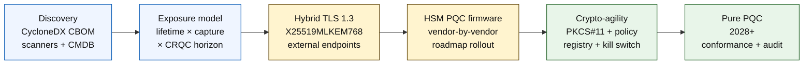

# O Índice de Banca Quantum-Safe em 2026: Criptografia Pós-Quântica, QKD, Crypto-Agility e Risco Harvest-Now-Decrypt-Later

<!-- lead-start: manual -->
<aside class="post-lead" aria-label="Resumo do artigo">

<strong>TL;DR.</strong> Banca quantum-safe em 2026 é um programa de entrega com prazo fixado pela interseção de duas curvas — tempo de confidencialidade dos dados que a instituição mantém hoje e o horizonte de chegada de um Cryptographically Relevant Quantum Computer (CRQC). NIST FIPS 203 / 204 / 205 estão finais desde agosto de 2024; a CNSA 2.0 fixa o estado final federal dos EUA em 2033; harvest-now-decrypt-later já está em curso sobre dados de longa duração. O Quantum Scorecard de nível de board rastreia quatro percentuais exatos: completude do inventário, exposição HNDL, progresso de migração NIST e prontidão de crypto-agility.

<strong>Pontos-chave</strong>

<ul class="post-lead-takeaways">
  <li><strong>O debate sobre algoritmos fechou em 13 de agosto de 2024.</strong> ML-KEM (FIPS 203), ML-DSA (FIPS 204) e SLH-DSA (FIPS 205) são as respostas. Bancos que ainda rodam avaliações internas para "escolher o vencedor" estão 18 meses atrasados.</li>
  <li><strong>Harvest-now-decrypt-later já se aplica.</strong> Tudo com tempo de confidencialidade além da chegada plausível de um CRQC — hipotecas de 30 anos, underwriting de seguros de vida, gravações de transações MiFID II / GDPR, arquivos de retenção de M&amp;A — precisa migrar para encapsulamento híbrido quantum-safe agora, não quando um CRQC for anunciado.</li>
  <li><strong>O inventário é a maturidade que destrava tudo.</strong> Um Cryptographic Bill of Materials (CBOM) — protocolo, biblioteca, certificado, partição de HSM, dependência de fornecedor, dono da aplicação, tempo de classificação do dado — é pré-condição para todo o resto. Meça frescor, não cobertura.</li>
  <li><strong>TLS 1.3 híbrido é o deploy de 2026.</strong> O hybrid key share X25519MLKEM768 é o que Chrome / Firefox / Cloudflare / Akamai já negociam hoje. TLS puro com ML-KEM espera firmware de HSM e prontidão de CA.</li>
  <li><strong>Crypto-agility é o entregável durável.</strong> Abstração PKCS#11, chaves rotuladas, registro de políticas mapeando serviço de negócio ao conjunto de algoritmos permitidos. Sem isso, a próxima transição de algoritmo é mais um programa plurianual.</li>
</ul>
</aside>
<!-- lead-end -->

Banca quantum-safe em 2026 trata de migração operacional, não de especulação. O NIST finalizou os três primeiros padrões de criptografia pós-quântica, e os bancos precisam mapear quais sistemas dependem de RSA, ECC, TLS, assinaturas, HSMs, certificados, canais de pagamento, arquivos e dados confidenciais de longa duração. A pergunta do índice é simples: a instituição consegue trocar a criptografia antes que a ameaça vire operacional?

---

> **Sumário Executivo / Pontos-chave**
>
> - **Os padrões do NIST agora são concretos.** FIPS 203 define ML-KEM para encapsulamento de chave, FIPS 204 define ML-DSA para assinaturas e FIPS 205 define SLH-DSA como padrão de assinatura stateless baseado em hash.
> - **Inventário é o primeiro portão de maturidade.** Um banco não migra o que não consegue encontrar: certificados, chaves, protocolos, aplicações, fornecedores, HSMs, APIs, arquivos e sistemas embarcados precisam ser mapeados.
> - **Crypto-agility é o objetivo durável.** A meta não é uma troca pontual de algoritmo; é poder mudar primitivas criptográficas sem redesenhar aplicações inteiras.
> - **Dados de longa duração mudam a urgência.** O risco harvest-now-decrypt-later significa que dados capturados hoje podem virar legíveis amanhã se permanecerem valiosos por tempo suficiente.
> - **QKD é um complemento especializado.** A distribuição quântica de chaves pode ser relevante para canais de altíssimo valor, mas não substitui a migração PQC em toda a instituição.
>
---

## Por Que 2026 É o Ano em Que Este Índice Importa

Três mudanças em 2024-2025 transformaram quantum-safe em programa bancário mensurável, deixando de ser apenas tema de monitoramento. Primeiro, o NIST finalizou os principais padrões pós-quânticos em 13 de agosto de 2024: [FIPS 203 (ML-KEM) ⧉](https://nvlpubs.nist.gov/nistpubs/FIPS/NIST.FIPS.203.pdf "FIPS 203 — Module-Lattice-Based Key-Encapsulation Mechanism"), [FIPS 204 (ML-DSA) ⧉](https://nvlpubs.nist.gov/nistpubs/FIPS/NIST.FIPS.204.pdf "FIPS 204 — Module-Lattice-Based Digital Signature Standard"), [FIPS 205 (SLH-DSA) ⧉](https://nvlpubs.nist.gov/nistpubs/FIPS/NIST.FIPS.205.pdf "FIPS 205 — Stateless Hash-Based Digital Signature Standard"). O debate de seleção de algoritmo fechou naquela data; bancos ainda rodando workstreams internos sobre "qual esquema vence" em 2026 estão 18 meses atrasados.

Segundo, a [CNSA 2.0 da NSA ⧉](https://media.defense.gov/2022/Sep/07/2003071834/-1/-1/0/CSA_CNSA_2.0_ALGORITHMS_.PDF "Commercial National Security Algorithm Suite 2.0") fixou o estado final federal dos EUA em 2033, com cortes intermediários a partir de 2027 para assinatura de software e firmware e 2030 para navegadores e sistemas operacionais. Qualquer banco com exposição a contrapartes federais dos EUA — FedNow, operações do Treasury, contas de clientes federais — fica dentro desse perímetro para os sistemas que tocam dado federal. O relógio deixou de ser abstrato.

Terceiro, [Harvest-Now-Decrypt-Later (HNDL) ⧉](https://csrc.nist.gov/Projects/post-quantum-cryptography "Programa de criptografia pós-quântica do NIST") é o argumento de risco que sustenta a urgência. Adversários sofisticados já estão capturando mensagens de pagamento protegidas por TLS, envelopes SWIFT, documentação KYC e cifrotexto de arquivos de longa duração nos principais centros financeiros. O dado capturado em 2026 só precisa continuar sensível no momento da decriptação — para hipotecas de 30 anos, underwriting de seguro de vida, gravações de transações MiFID II / GDPR e arquivos de retenção de M&A, essa janela vai bem além de qualquer estimativa plausível para um Cryptographically Relevant Quantum Computer (CRQC). O adversário não precisa de um computador quântico hoje. Precisa dele antes do dado deixar de importar.

O Índice de Banca Quantum-Safe mede se a sua instituição entrega a migração antes dessa interseção chegar. O trabalho deixou de ser sobre migrar ou não; é sobre fechar a migração dentro de um cronograma defensável.

## A Arquitetura do Índice 2026

| Camada do Índice | Direção 2026 | Métrica de Prontidão | Risco se Mal Conduzida |
|---|---|---|---|
| **Inventário** | Mapear ativos criptográficos, protocolos, certificados, fornecedores e classes de dados | Percentual do parque inventariado | Dependências quânticas vulneráveis desconhecidas |
| **Exposição** | Classificar sistemas por tempo de confidencialidade e criticidade transacional | Ativos de alto risco por valor e tempo de vida | Migração mal priorizada |
| **Migração** | Adotar padrões híbridos e PQC-ready alinhados aos padrões do NIST | Prontidão ML-KEM e ML-DSA | Re-plataforma emergencial sob prazo |
| **Crypto-agility** | Separar lógica de aplicação das primitivas criptográficas | Cobertura cripto controlada por política | Algoritmos hard-coded em todo o parque |
| **Assurance** | Testar interoperabilidade, performance, suporte de HSM, certificados e prontidão de fornecedor | Taxa de aprovação em testes e backlog de exceções | Canais quebrados ou controles de fallback fracos |

### O Quantum Scorecard de Nível de Board

Um scorecard crível de prontidão quântica exige rastrear percentuais exatos, não apenas status de projetos:

1. **Completude do Inventário:** O percentual de aplicações tier-1 com Cryptographic Bill of Materials (CBOM) totalmente mapeado.
2. **Exposição HNDL:** O volume de dados confidenciais de longa duração (por exemplo, PII e segredos comerciais) trafegado em redes sem encapsulamento híbrido quantum-safe.
3. **Progresso de Migração NIST:** O percentual de chaves de criptografia assimétrica e assinaturas digitais migradas para os padrões FIPS 203 (ML-KEM) e FIPS 204 (ML-DSA).
4. **Prontidão de Crypto-Agility:** O percentual de sistemas críticos onde algoritmos criptográficos podem ser rotacionados via política centralizada sem precisar recompilar código.

## Sinais Atuais a Monitorar

| Sinal | O Que Significa para Bancos | Fonte |
|---|---|---|
| **FIPS 203 ML-KEM** | Padrão NIST primário para estabelecimento geral de chave de criptografia | [NIST ⧉](https://www.nist.gov/news-events/news/2024/08/nist-releases-first-3-finalized-post-quantum-encryption-standards "Primeiros três padrões finalizados de criptografia pós-quântica") |
| **FIPS 204 ML-DSA** | Padrão NIST primário para assinaturas digitais | [NIST ⧉](https://www.nist.gov/news-events/news/2024/08/nist-releases-first-3-finalized-post-quantum-encryption-standards "Primeiros três padrões finalizados de criptografia pós-quântica") |
| **FIPS 205 SLH-DSA** | Alternativa de assinatura baseada em hash e desenho de backup | [NIST ⧉](https://www.nist.gov/news-events/news/2024/08/nist-releases-first-3-finalized-post-quantum-encryption-standards "Primeiros três padrões finalizados de criptografia pós-quântica") |
| **Integração imediata recomendada** | O NIST orienta administradores a já iniciar a integração dos padrões porque a integração completa leva tempo | [NIST ⧉](https://www.nist.gov/news-events/news/2024/08/nist-releases-first-3-finalized-post-quantum-encryption-standards "Primeiros três padrões finalizados de criptografia pós-quântica") |
| **Programas quânticos bancários estão se expandindo** | Grandes bancos exploram tecnologias quânticas enquanto preparam transições PQC | [Quantum Insider ⧉](https://thequantuminsider.com/2026/03/27/15-plus-global-banks-probing-the-wonderful-world-of-quantum-technologies/ "Visão geral de bancos globais explorando tecnologias quânticas") |

## A Migração Começa pelo Razão da Criptografia

A sequência de migração já é bem compreendida. Cada portão produz a evidência que destrava o próximo; pular ou comprimir um portão é o que gera o risco de re-plataforma emergencial que aparece na coluna de falhas da Arquitetura do Índice.

O primeiro entregável não é um algoritmo novo; é um cryptographic bill of materials (CBOM). Os bancos precisam de um inventário vivo que conecte serviços de negócio a algoritmos, bibliotecas, certificados, tamanhos de chave, HSMs, tempos de vida de dado, fornecedores e responsáveis operacionais. Sem esse razão, a migração quantum-safe vira chute.

O conjunto de registros do CBOM precisa capturar, para cada primitiva criptográfica: o protocolo ou a interface (TLS 1.3, IPsec, SSH, formato de mensagem de pagamento proprietário), o algoritmo e o parâmetro (RSA-2048, ECDH P-256, ML-KEM-768, ML-DSA-65), a biblioteca e a versão (OpenSSL 3.4, hash de commit do BoringSSL, build do SDK do fornecedor), o limite de hardware (partição de HSM, TPM, secure enclave ou nenhum), a identidade do certificado quando se aplica, o dono da aplicação e o tempo de classificação do dado. Ferramentas que entram em produção em 2025-2026 — IBM Quantum Safe Inventory, a especificação open-source [CycloneDX CBOM ⧉](https://cyclonedx.org/capabilities/cbom/ "CycloneDX Cryptography Bill of Materials"), scanners corporativos da CryptoNext / Sandbox / PQShield — integram-se em pipelines de CMDB existentes. Nenhuma delas é completa por si só; conte com um ciclo de construção de CBOM de 12 a 18 meses mesmo com tooling de fornecedor e headcount dedicado.

A métrica a acompanhar é o frescor, não a cobertura. Um CBOM com dois meses de atraso é pior que nenhum CBOM, porque dá à equipe de segurança falsa confiança sobre o que já foi migrado.

## Híbrido Primeiro, Ágil Sempre

A maioria dos bancos não vai trocar tudo de uma vez. O padrão realista é deploy híbrido, com mecanismos clássicos e pós-quânticos rodando em paralelo enquanto fornecedores, protocolos, certificados e tooling operacional amadurecem. O alvo de longo prazo é crypto-agility: escolhas criptográficas controladas por política, que mudam sem reconstruir a aplicação de negócio.

[Inserir Componente Interativo: Calculadora de Risco Harvest-Now-Decrypt-Later (HNDL) — Ferramenta com sliders onde executivos informam tempo de vida do dado vs. cronograma quântico estimado para visualizar a janela de exposição.]

> **Insight central:** Se o seu dado precisa permanecer confidencial por 10 anos e um Cryptographically Relevant Quantum Computer (CRQC) está a 7 anos, o seu prazo de migração não vence em 7 anos — venceu há 3 anos.

Na prática, isso significa TLS 1.3 com o hybrid key share `X25519MLKEM768` em endpoints externos (Chrome / Firefox / Cloudflare / Akamai já suportam hoje), cadeias de assinatura clássica até HSM e infraestrutura de CA acompanharem, e uma camada de abstração PKCS#11 que permite ao registro de políticas rotacionar algoritmos sem recompilar aplicações de negócio. Crypto-agility é o que determina se a próxima transição de algoritmo (quando, não se) será uma rotação de seis semanas ou outro programa de sete anos.

## Onde o QKD Se Encaixa

A distribuição quântica de chaves entra no índice como opção para canais de alta sensibilidade, especialmente infraestrutura de mercado financeiro, conectividade com banco central e fluxos institucionais extremamente sensíveis. Deve ser tratada como complemento ao PQC, não como desculpa para adiar a migração corporativa.

## O Que Isto Significa por Tipo de Banco

### Bancos de Importância Sistêmica Global

O problema duro é escala: dezenas de milhares de endpoints TLS, centenas de partições de HSM, dezenas de autoridades certificadoras internas, centenas de aplicações de negócio com primitivas criptográficas embutidas e SDKs de fornecedor que o banco não pode modificar. O investimento não é outro piloto; é o tooling do CBOM, a camada de abstração PKCS#11 conectada em cada novo build, o plano de consolidação de HSM que escolhe um fornecedor para liderar o firmware PQC e aceita uma cauda plurianual nos demais, e o registro de políticas que vira a superfície durável de crypto-agility muito depois da migração FIPS 203 / 204 / 205 fechar.

### Bancos de Transação e Corporativos

O escopo de migração é mais estreito que no nível G-SIB, mas a exposição HNDL é aguda: mensageria SWIFT transfronteiriça, dados de pagamento estruturados com PII de contraparte corporativa, plataformas de troca de documentos com documentação de trade finance e arquivos de reporting de longa retenção. Priorize TLS híbrido em todo endpoint voltado ao cliente e PQC em repouso para arquivos de retenção. Pressione accountability de fornecedor de HSM — a equipe de plataforma de banco corporativo tem alavanca direta de procurement que a equipe de tecnologia wholesale costuma não ter.

### Bancos Regionais

Compre o stack do fornecedor que já tem as primitivas de crypto-agility. Escolha um core banking cujo fornecedor publique um CBOM e se comprometa com prazos de suporte a ML-KEM / ML-DSA. Valide se o roadmap de HSM do fornecedor está alinhado ao prazo de migração do banco. A capacidade de engenharia para construir crypto-agility do zero leva anos; o fornecedor amortiza esse custo entre vários clientes e o banco herda o benefício. O trabalho de validação — checar se as afirmações do fornecedor sobrevivem ao processo de MRM da instituição — é o escopo interno legítimo.

### Fintechs, PSPs e Provedores de Infraestrutura

A pergunta competitiva para fornecedores que vendem para bancos em 2026 não é "você suporta PQC". É "você consegue produzir um CBOM CycloneDX para a sua plataforma, uma matriz de suporte por fornecedor de HSM e um SLA escrito de rotação de algoritmo". Fornecedores que responderem sim passam pelos portões de procurement tier-1 em 2026-2027. Os que não conseguirem perdem o ciclo de renovação para um concorrente que conseguir.

## Conclusão

Banca quantum-safe em 2026 não é tema de monitoramento; é programa de entrega com prazo fixado pela interseção de duas curvas — tempo de confidencialidade dos dados que a instituição mantém hoje e horizonte de chegada de um Cryptographically Relevant Quantum Computer. As instituições que parecerem críveis a reguladores e contrapartes em 2030 são as que iniciaram a construção do CBOM em 2024, fizeram o deploy de TLS híbrido em todo endpoint externo até o fim de 2026 e engenharam crypto-agility em cada novo build desde o dia um. As que não fizeram vão descobrir se a janela de migração já fechou para o dado que o adversário está colhendo hoje.

Meça a migração como mede qualquer programa operacional: escopo conhecido, sequenciamento priorizado, prazos comprometidos, registros de exceção honestos. Quanto mais duro olhar para o próprio parque, menor a janela de migração parece.

## Perguntas Frequentes

**O que um banco deve inventariar primeiro?**

Comece por TLS exposto externamente, canais de pagamento, autenticação de cliente, conectividade interbancária, serviços apoiados em HSM, arquivos de longo prazo e sistemas que tratam dados confidenciais com vida útil longa.

**PQC é só uma questão de cybersecurity?**

Não. Afeta pagamentos, identidade, evidência legal, assinatura de transações, confiança do cliente, retenção de dados, gestão de fornecedores e resiliência operacional.

**O que significa crypto-agility?**

Crypto-agility é a capacidade de mudar primitivas criptográficas via política e controles de plataforma em vez de alterações hard-coded na aplicação.

**Bancos devem esperar mais padrões?**

Não. O NIST orienta administradores a começar a integrar os primeiros padrões finais agora, porque a integração completa leva tempo.

## Referências

- NIST, (2026). [Primeiros três padrões finalizados de criptografia pós-quântica ⧉](https://www.nist.gov/news-events/news/2024/08/nist-releases-first-3-finalized-post-quantum-encryption-standards "Primeiros três padrões finalizados de criptografia pós-quântica").

<!-- enrich-start -->
<aside class="author-card" aria-label="Sobre o autor"><strong class="author-card-name"><a href="/about/index.html">Sebastien Rousseau</a></strong>Tecnólogo bancário sênior, escreve sobre IA aplicada, infraestrutura de pagamentos, moeda tokenizada, ISO 20022, segurança pós-quântica, serviços financeiros nativos em nuvem e mercados digitais regulados.Mais de 20 anos no HSBC Commercial &amp; Investment Bank, PayPal, Barclays, Shazam, AKQA, Virgin Group. <a href="/about/index.html">Perfil completo</a> &middot; <a href="https://www.linkedin.com/in/sebastienrousseau/" rel="external noopener">LinkedIn</a> &middot; <a href="https://github.com/sebastienrousseau" rel="external noopener">GitHub</a></aside>

Última revisão <time datetime="2026-06-04">2026-06-04</time>.

<!-- enrich-end -->
