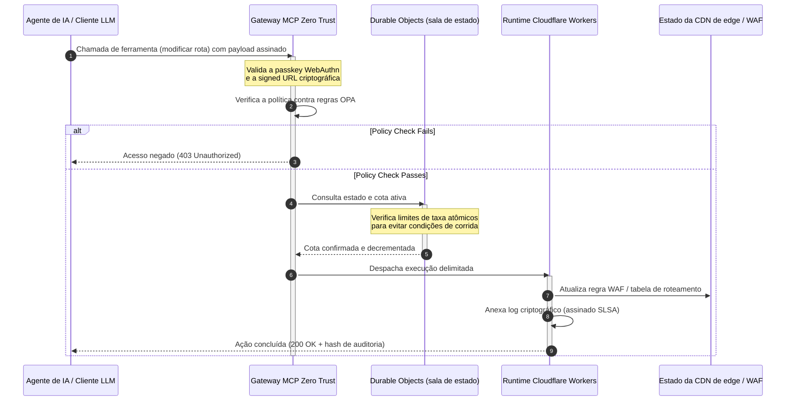

---

# Front Matter (YAML)

author: "contact@sebastienrousseau.com (Sebastien Rousseau)"
banner_alt: "Rack de data center iluminado à noite — simbolizando a edge inspecionável, controlável por agente e de código aberto sobre a qual o CloudCDN é construído"
banner_height: "1597"
banner_width: "2584"
banner: "https://cloudcdn.pro/stocks/images/alis-po-IdVNRv-5wJo.webp"
cdn: "https://cloudcdn.pro"
charset: "UTF-8"
cname: "sebastienrousseau.com"
copyright: "© Copyright 2025 - 2026 - Sebastien Rousseau. All rights reserved."
date: "11 de junho de 2026"
description: "CloudCDN transforma a CDN em um plano de controle de edge seguro e controlável por agente: gateway MCP zero trust, Durable Objects, SLSA Level 3 e evidência DORA."
format-detection: "telephone=no"
hreflang: "pt-br"
icon: "https://cloudcdn.pro/clients/sebastienrousseau/v1/logos/sebastienrousseau.svg"
id: "https://sebastienrousseau.com/pt-br/2026-06-11-cloudcdn-open-source-blueprint-ai-native-edge-2026"
image_alt: "Retrato em preto e branco de Sebastien Rousseau"
image_height: "162"
image_width: "162"
image: "https://cloudcdn.pro/stocks/images/sebastien-rousseau.png"
keywords: "CloudCDN, edge AI-nativa, CDN de código aberto, servidor MCP, Cloudflare Workers, Durable Objects, zero trust, WebAuthn, signed URLs, SLSA Level 3, DORA, plano de controle de edge"
language: "pt-br"
last_reviewed: "2026-06-11"
layout: "report"
locale: "pt_BR"
logo_alt: "Logo de Sebastien Rousseau"
logo_height: "44"
logo_width: "44"
logo: "https://cloudcdn.pro/clients/sebastienrousseau/v1/logos/sebastienrousseau.svg"
menu: ""
measurementID: "G-169G4ET5HQ"
name: "Sebastien Rousseau"
permalink: "https://sebastienrousseau.com/pt-br/2026-06-11-cloudcdn-open-source-blueprint-ai-native-edge-2026"
rating: "general"
referrer: "no-referrer"
robots: "index, follow"
schema: "FAQPage, Article"
seo_title: "CloudCDN: blueprint de código aberto da edge AI-nativa"
short_name: "sebastienrousseau"
subtitle: "Levando a CDN global do cache de conteúdo estático a um plano de controle de edge criptograficamente seguro e controlável por agente."
tags: "CloudCDN, código aberto, CDN, edge, agentes de IA, MCP, Cloudflare Workers, Durable Objects, limitação de taxa, zero trust, WebAuthn, SLSA, DORA, BCBS 239, Basel III, bancos cloud-native"
theme-color: "0, 83, 191"
title: "CloudCDN: um blueprint de código aberto para a edge AI-nativa em 2026"
url: "https://sebastienrousseau.com/pt-br/2026-06-11-cloudcdn-open-source-blueprint-ai-native-edge-2026"
viewport: "width=device-width, initial-scale=1, shrink-to-fit=no"

# RSS - The RSS feed front matter (YAML).
atom_link: "https://sebastienrousseau.com/2026-06-11-cloudcdn-open-source-blueprint-ai-native-edge-2026/rss.xml"
category: "Technology"
docs: https://validator.w3.org/feed/docs/rss2.html
generator: "Static Site Generator (SSG) (version 0.0.26)"
item_description: "CloudCDN transforma a CDN em um plano de controle de edge seguro e controlável por agente: gateway MCP zero trust, Durable Objects, SLSA Level 3 e evidência DORA."
item_guid: "https://sebastienrousseau.com/2026-06-11-cloudcdn-open-source-blueprint-ai-native-edge-2026/rss.xml"
item_link: "https://sebastienrousseau.com/2026-06-11-cloudcdn-open-source-blueprint-ai-native-edge-2026/rss.xml"
item_pub_date: "Thu, 11 Jun 2026 06:06:06 +0000"
item_title: "CloudCDN: um blueprint de código aberto para a edge AI-nativa em 2026"
last_build_date: "Thu, 11 Jun 2026 06:06:06 +0000"
managing_editor: "contact@sebastienrousseau.com (Sebastien Rousseau)"
pub_date: "Thu, 11 Jun 2026 06:06:06 +0000"
ttl: "60"
type: "article"
webmaster: "contact@sebastienrousseau.com"

# Apple - The Apple front matter (YAML).
apple_mobile_web_app_orientations: "portrait"
apple_touch_icon_sizes: "192x192"
apple-mobile-web-app-capable: "yes"
apple-mobile-web-app-status-bar-inset: "black"
apple-mobile-web-app-status-bar-style: "black-translucent"
apple-mobile-web-app-title: "CloudCDN: blueprint de código aberto da edge AI-nativa"
apple-touch-fullscreen: "yes"

# MS Application - The MS Application front matter (YAML).

msapplication-navbutton-color: "0, 83, 191"

# Twitter Card - The Twitter Card front matter (YAML).

twitter_card: "summary_large_image"
twitter_creator: "@wwdseb"
twitter_description: "CloudCDN transforma a CDN em um plano de controle de edge seguro e controlável por agente: gateway MCP zero trust, Durable Objects, SLSA Level 3 e evidência DORA."
twitter_image: "https://cloudcdn.pro/clients/sebastienrousseau/v1/logos/sebastienrousseau.svg"
twitter_image_alt: "Logo de Sebastien Rousseau"
twitter_site: "@wwdseb"
twitter_title: "CloudCDN: blueprint de código aberto da edge AI-nativa"
twitter_url: "https://sebastienrousseau.com/2026-06-11-cloudcdn-open-source-blueprint-ai-native-edge-2026"

excerpt: "CloudCDN é um blueprint de código aberto para a edge AI-nativa — gateway MCP zero trust com 42 ferramentas, limitação de taxa atômica via Durable Objects, passkeys WebAuthn, signed URLs, proveniência SLSA Level 3 e 3.185 testes com 100% de cobertura, mapeados a DORA, BCBS 239 e Basel III."

# Humans.txt - The Humans.txt front matter (YAML).
author_website: "https://sebastienrousseau.com"
author_twitter: "@wwdseb"
author_location: "London, UK"
thanks: "Obrigado pela leitura!"
site_last_updated: "2026-06-11"
site_standards: "HTML5, CSS3, RSS, Atom, JSON, XML, YAML, Markdown, TOML"
site_components: "Kaishi, Kaishi Builder, Kaishi CLI, Kaishi Templates, Kaishi Themes"
site_software: "Static Site Generator, Rust"

---

# CloudCDN: um blueprint de código aberto para a edge AI-nativa em 2026

<!-- lead-start: manual -->
<aside class="post-lead" aria-label="Resumo do artigo">

<strong>TL;DR.</strong> A tecnologia empresarial em 2026 é definida pela convergência entre execução serverless globalmente distribuída e IA agêntica. CDNs convencionais — construídas para cache de arquivos estáticos e roteamento básico de tráfego — estão estruturalmente obsoletas em uma era de orquestração ativa de dados em tempo real. O CloudCDN é um blueprint de código aberto que reposiciona a edge como um plano de controle ativo: runtimes serverless, coordenação stateful via Cloudflare Durable Objects e um gateway zero trust do Model Context Protocol (MCP) que permite a agentes autônomos de IA operar a infraestrutura web dentro de envelopes operacionais delimitados e protegidos criptograficamente.

<strong>Pontos-chave</strong>

<ul class="post-lead-takeaways">
  <li><strong>Do cache estático ao plano de controle delimitado.</strong> O CloudCDN move a fronteira operacional para a edge, convertendo nós de CDN em portões de política ativos que executam decisões de segurança, roteamento e controle de acesso em frações de milissegundo.</li>
  <li><strong>Coordenação stateful na edge.</strong> Cloudflare Durable Objects aplicam limitação de taxa atômica e coordenação de estado em tempo real, globalmente — sem condições de corrida distribuídas, sem abuso sistêmico de cotas entre regiões de edge.</li>
  <li><strong>Gestão agêntica segura da infraestrutura via MCP.</strong> Um gateway zero trust expõe 42 ferramentas MCP especializadas, permitindo que agentes de IA inspecionem, configurem e operem a infraestrutura sob limites assinados criptograficamente.</li>
  <li><strong>Segurança da cadeia de suprimentos como entregável do pipeline.</strong> Proveniência de build SLSA Level 3 via Sigstore/Cosign e 3.185 testes unitários com 100% de cobertura em cada release.</li>
  <li><strong>Evidência em nível de conselho, não dashboards.</strong> A telemetria de edge mapeia diretamente para a responsabilização do conselho do Artigo 5 da DORA, o reporte de risco do BCBS 239 e as regras de capital de risco operacional de Basel III.</li>
</ul>

<strong>Leitura relacionada:</strong> <a href="/2026-05-16-best-cloud-infrastructure-architecture-2026/">Arquitetura de infraestrutura cloud em 2026</a> · <a href="/2026-06-05-cloud-native-banking-index-dora-resilience-platform-engineering-2026/">Índice de bancos cloud-native em 2026</a> · <a href="/2026-06-03-agentic-ai-index-banks-autonomy-governance-auditability-2026/">Índice de IA agêntica para bancos em 2026</a>

</aside>
<!-- lead-end -->

O debate sobre CDN acabou. A edge já não é um cache; é o plano de controle do software AI-nativo. À medida que agentes fazem chamadas de ferramenta, movem dados, purgam caches, solicitam signed URLs e coordenam fluxos de trabalho, o velho modelo de painéis opacos e planos de controle proprietários deixa de ser um incômodo e se torna um passivo regulatório. O CloudCDN defende um modelo diferente: uma plataforma de edge aberta, inspecionável e controlável por agente, que trata segurança, acessibilidade, desempenho e auditabilidade como padrões aplicáveis, não como promessas de fornecedor.

O ponto de referência de código aberto deste artigo é [cloudcdn.pro ⧉](https://github.com/sebastienrousseau/cloudcdn.pro "cloudcdn.pro"). O repositório é uma CDN multi-tenant e AI-nativa que pode ser lida de ponta a ponta e implantada de forma independente: TTFB inferior a 100 ms nos PoPs da Cloudflare, controle via MCP, limitação de taxa com Durable Objects, acessibilidade WCAG-AA, signed URLs, passkeys, SLSA Level 3 e 3.185 testes com 100% de cobertura.

---

> **Resumo executivo / Pontos-chave**
>
> - **A edge torna-se a fronteira operacional.** O CloudCDN converte nós de CDN convencionais em portões de política ativos que executam segurança, roteamento e controle de acesso em frações de milissegundo.
> - **Durable Objects tornam a limitação de taxa atômica.** A aplicação de cotas em tempo real e globalmente consistente fecha a janela de condição de corrida que limitadores de consistência eventual deixam aberta a atacantes e agentes com mau funcionamento.
> - **Agentes operam a infraestrutura por meio de 42 ferramentas MCP delimitadas.** Cada invocação é validada contra passkeys WebAuthn, payloads assinados e política OPA antes de qualquer execução.
> - **A cadeia de suprimentos faz parte do produto.** A proveniência SLSA Level 3 via Sigstore/Cosign vincula criptograficamente cada release ao seu código-fonte auditado.
> - **Telemetria é evidência de conformidade.** As operações de edge mapeiam para o Artigo 5 da DORA, o BCBS 239 e o capital de risco operacional de Basel III — diretamente, não por relatórios a posteriori.
>
---

## Por que este projeto de código aberto importa em 2026

A TI corporativa em 2026 passou do provisionamento estático de infraestrutura para a orquestração de dados em tempo real, orientada a eventos. Duas forças de mercado impulsionam essa mudança.

A primeira é a proliferação da IA agêntica. Modelos autônomos e agentes de software já executam tarefas operacionais complexas — mitigação automatizada de ameaças, decisões de roteamento, balanceamento de ledger em tempo real. Eles não usam dashboards. Eles fazem chamadas de ferramenta.

A segunda é a aplicação ativa do [Regulamento de Resiliência Operacional Digital (DORA) ⧉](https://eur-lex.europa.eu/legal-content/EN/TXT/?uri=CELEX%3A32022R2554 "Regulamento (UE) 2022/2554 relativo à resiliência operacional digital do setor financeiro"). Instituições bancárias já não podem depender de CDNs de terceiros opacas e proprietárias. Os reguladores exigem visibilidade completa da cadeia de suprimentos de software, capacidade de saída verificável e trilhas de auditoria criptográficas inalteráveis.

Arquiteturas de servidor centralizadas impõem penalidades de latência que a orquestração em tempo real não absorve. CDNs proprietárias funcionam como caixas-pretas que expõem as instituições a comprometimentos da cadeia de suprimentos que elas não conseguem ver, muito menos evidenciar. O CloudCDN fecha essa lacuna com um blueprint transparente, zero trust e de código aberto que transforma a edge em um plano de controle ativo. Para executivos de tecnologia, ele desloca a conversa do custo da conformidade para o Return on Resilience: capital preservado por pipelines operacionais automatizados e prontos para auditoria.

## Lente de arquitetura

A arquitetura do CloudCDN está estruturada em cinco camadas, substituindo middleware centralizado por primitivas de edge stateful e localizadas:

| Camada | Decisão de design | Por que importa | Risco se mal gerida |
|---|---|---|---|
| **Runtime de edge** | Cloudflare Workers e Pages | Elimina a latência de VMs centralizadas; executa políticas em frações de milissegundo, globalmente | Ganhos de desempenho sem disciplina de política produzem deriva caótica na edge |
| **Coordenação de estado** | Durable Objects | Garante consistência atômica e em tempo real para limites de taxa e estado compartilhado entre regiões | Condições de corrida distribuídas, abuso de recursos de API, cotas de perímetro contornadas |
| **Interface de agente** | Gateway MCP zero trust | Expõe 42 ferramentas MCP especializadas para que agentes de IA operem a infraestrutura sob limites governados | Invocação ilimitada de ferramentas e mudanças de configuração não autorizadas |
| **Controle de acesso** | Passkeys WebAuthn e signed URLs | Substitui senhas estáticas por assinaturas criptográficas para operações auditáveis | Mudanças mal atribuídas; roubo de credenciais levando a violação de perímetro |
| **Portões de qualidade** | SLSA Level 3 e 100% de cobertura de testes | Verifica matematicamente a origem do build; bloqueia injeção maliciosa de dependências | Código malicioso inserido pela cadeia de suprimentos de software |

## Sinais operacionais a acompanhar

A prontidão de edge é mensurável. Estes são os indicadores quantitativos que demonstram capacidade de execução, não intenção:

| Sinal | Métrica / Benchmark | Referência regulatória | Implementação na plataforma |
|---|---|---|---|
| **42 ferramentas MCP** | Registro delimitado de ferramentas para gestão automatizada | COBIT 2019 (BAI06) | Gateway MCP validando assinaturas de agentes contra políticas OPA |
| **Durable Objects** | Aplicação atômica de cotas em frações de milissegundo, sem vazamento | Artigo 6 da DORA | Durable Objects rastreando o estado global de cotas de API |
| **Passkeys e signed URLs** | 100% das sessões administrativas verificadas via FIDO2 WebAuthn | Artigo 30 da DORA | Verificações de assinatura criptográfica embutidas no roteador de edge |
| **SLSA Level 3** | Manifestos de build assinados criptograficamente (Sigstore) | Artigo 30 da DORA | Pipelines do GitHub Actions gerando metadados de build assinados |
| **3.185 testes unitários** | 100% de cobertura; portões de regressão em cada release | NIST CSF 2.0 (PR.DS-01) | Pipelines de CI interrompendo a implantação em qualquer falha de teste |

## A CDN torna-se um plano de controle ativo

As CDNs tradicionais foram projetadas em torno da aceleração passiva de conteúdo estático. O CloudCDN redefine o modelo. Com Cloudflare Workers e Durable Objects integrados, a edge funciona como um portão de política ativo e stateful.

Quando um agente de IA ou um processo automatizado solicita uma mudança de configuração de infraestrutura ou um ajuste de roteamento, ele não fala com um banco de dados centralizado e vulnerável. A solicitação é interceptada no nó de edge mais próximo e passa por verificações de identidade, política e cota antes de qualquer execução:

Cada etapa dessa sequência produz um registro atribuível e assinado. Essa é a diferença entre uma CDN que acelera conteúdo e um plano de controle que pode ser governado.

## Por que o código aberto muda o modelo de confiança

Para Chief Information Security Officers, CDNs proprietárias opacas representam um risco que se acumula. Redes de edge de código fechado são caixas-pretas: se o fornecedor sofre um comprometimento interno, o banco tem visibilidade zero até que a violação seja divulgada publicamente.

O CloudCDN substitui essa assimetria por um modelo de confiança totalmente auditável e de código aberto, baseado em três mecanismos:

1. **Proveniência matemática de build.** Sob SLSA Level 3, cada release é vinculada criptograficamente ao seu repositório GitHub de código aberto. Um CISO pode verificar — matematicamente, não contratualmente — que o binário em execução nos nós de edge globais da Cloudflare contém exatamente o código-fonte auditado.
2. **Auditorias de segurança contínuas e públicas.** O código é submetido a varreduras automatizadas, divulgação pública de vulnerabilidades e auditorias de código revisadas por pares. Obscuridade não é controle; revisão é.
3. **Sem vendor lock-in (Artigo 28 da DORA).** A DORA exige que os bancos comprovem uma estratégia de saída clara e testada de provedores terceiros críticos. Como o CloudCDN é de código aberto e construído sobre primitivas serverless padrão, as instituições podem migrar configurações de edge da Cloudflare para outros runtimes serverless ou clusters Kubernetes privados — e evidenciar essa capacidade ao regulador.

## O padrão de edge em nível bancário

O CloudCDN é projetado para atender aos padrões de conformidade do setor financeiro global, mapeando operações técnicas de edge diretamente para os frameworks que os supervisores de fato examinam:

- **Gestão de risco de modelos ([SR 11-7 do Fed dos EUA ⧉](https://www.federalreserve.gov/supervisionreg/srletters/sr1107.htm "Orientação de supervisão sobre gestão de risco de modelos") / SS1/23 do PRA britânico).** Modelos autônomos que executam tarefas operacionais caem sob a governança de risco de modelos. O gateway MCP do CloudCDN trata ferramentas agênticas como modelos quantitativos: limites estritos de política, registro em tempo real e aprovação humana obrigatória (human-in-the-loop) para ações de alto impacto.
- **BCBS 239 (agregação de dados de risco).** Ao capturar, etiquetar e estruturar dados de transação na edge, as métricas operacionais são geradas em tempo real — atendendo aos requisitos do BCBS 239 de integridade de dados, tempestividade e rastreabilidade regulatória.
- **Artigo 5 da DORA (responsabilização do conselho).** O conselho carrega a responsabilidade pessoal final pela resiliência operacional. O CloudCDN traduz a telemetria de edge em evidência quantificada e verificável que conselheiros não técnicos podem levar a uma auditoria de responsabilidade pessoal.
- **Capital de risco operacional de Basel III.** Os bancos mantêm capital regulatório contra risco operacional. Failover automatizado de DR e proveniência SLSA Level 3 reduzem o perfil de risco operacional da instituição — preservando capital no balanço, não apenas satisfazendo uma auditoria.

## O que isso significa por tipo de banco

### Bancos globais sistemicamente importantes (G-SIBs)

Os G-SIBs processam volumes massivos de transações em múltiplas jurisdições. A prioridade é substituir controles de perímetro legados e fragmentados por um único plano de edge unificado. Implantar o padrão CloudCDN permite a um G-SIB padronizar políticas de segurança, gateways de API e governança agêntica globalmente — e gerar pipelines de evidência em conformidade com a DORA como subproduto da operação, não como uma correria trimestral.

### Bancos transacionais e corporativos

Para bancos transacionais, o produto voltado ao cliente é um pacote de velocidade de execução, segurança e transparência de dados. O padrão CloudCDN permite que esses bancos exponham dashboards de API seguros e serviços de rastreamento de caixa em tempo real a tesoureiros corporativos — uma postura de edge resiliente que defende depósitos corporativos.

### Bancos regionais e de menor porte

Bancos regionais enfrentam os mesmos atores de ameaça que os G-SIBs, sem os orçamentos de engenharia. Um blueprint de edge de código aberto e em nível bancário entrega os controles prontos: alinhamento regulatório imediato sem custos de licença proprietária, e o código-fonte para comprová-lo.

## O playbook do conselho

A resiliência operacional deixou de ser uma métrica invisível de TI de back-office; é uma prioridade de conselho com responsabilidade pessoal associada. As instituições que mantêm a confiança de reguladores, clientes e acionistas em 2026 tratam a tecnologia como um ativo verificável e observável.

O roteiro para líderes seniores de tecnologia é curto:

1. **Exija evidência como produto.** Orce pipelines automatizados e autodocumentados na edge — evidência gerada pela operação, não montada para o auditor.
2. **Migre para controle stateful na edge.** Tire limitação de taxa, WAF e verificação de identidade dos servidores centralizados e leve-os a primitivas atômicas de edge.
3. **Estabeleça limites agênticos criptográficos.** Imponha gateways MCP zero trust com validação de passkey e OPA para cada invocação automatizada de ferramenta.
4. **Exija auditorias de build de código aberto.** Faça da proveniência de build SLSA Level 3 uma condição de implantação, não uma aspiração.

## Perguntas frequentes

**O CloudCDN está pronto para auditorias da DORA?**

Sim. O CloudCDN é projetado para produzir evidência de conformidade automatizada que mapeia diretamente para os templates ITS do Registro de Informações (RT.01 a RT.15) e para as cláusulas contratuais do Artigo 30 da DORA.

**Qual é a vantagem de usar Durable Objects para limitação de taxa?**

Limitadores de taxa distribuídos tradicionais dependem de consistência eventual, o que deixa uma janela de latência que atacantes ou agentes com mau funcionamento podem explorar. Durable Objects garantem consistência imediata e atômica globalmente, fechando por completo a janela de condição de corrida.

**O que torna o CloudCDN AI-nativo?**

Suas operações controladas por MCP e seu modelo de controle consciente de agentes. A infraestrutura é operada por meio de 42 ferramentas governadas, com identidade criptográfica e limites de política — projetada para fluxos de trabalho autônomos, não apenas para dashboards humanos.

**Código aberto aumenta o risco de exploits de dia zero?**

Não. CDNs proprietárias de código fechado dependem de segurança por obscuridade. O código do CloudCDN é submetido continuamente a testes automatizados, revisão pública por pares e validação SLSA Level 3 — um limiar de confiança verificavelmente mais alto.

## Referências

- Parlamento Europeu e Conselho da União Europeia, (2022). [Regulamento (UE) 2022/2554 relativo à resiliência operacional digital do setor financeiro (DORA) ⧉](https://eur-lex.europa.eu/legal-content/EN/TXT/?uri=CELEX%3A32022R2554 "Regulamento (UE) 2022/2554 relativo à resiliência operacional digital do setor financeiro (DORA)"). Bruxelas: Jornal Oficial da União Europeia.
- Comitê de Supervisão Bancária da Basileia (BCBS), (2013). [Princípios para a agregação eficaz de dados de risco e o reporte de riscos (BCBS 239) ⧉](https://www.bis.org/publ/bcbs239.htm "Princípios para a agregação eficaz de dados de risco e o reporte de riscos (BCBS 239)"). Basileia: Bank for International Settlements.
- Board of Governors of the Federal Reserve System, (2011). [Orientação de supervisão sobre gestão de risco de modelos (SR Letter 11-7) ⧉](https://www.federalreserve.gov/supervisionreg/srletters/sr1107.htm "Orientação de supervisão sobre gestão de risco de modelos (SR Letter 11-7)"). Washington D.C.: Federal Reserve.
- Cloudflare, (2026). [Documentação de Durable Objects: coordenação stateful na edge ⧉](https://developers.cloudflare.com/durable-objects/ "Documentação de Durable Objects"). San Francisco: Cloudflare.
- Cloudflare, (2026). [Construindo agentes de IA com MCP, autenticação e Durable Objects ⧉](https://blog.cloudflare.com/building-ai-agents-with-mcp-authn-authz-and-durable-objects/ "Construindo agentes de IA com MCP, autenticação e Durable Objects").
- GitHub, (2026). [Repositório cloudcdn.pro ⧉](https://github.com/sebastienrousseau/cloudcdn.pro "Repositório cloudcdn.pro").

<!-- enrich-start -->
<aside class="author-card" aria-label="Sobre o autor"><strong class="author-card-name"><a href="/about/index.html">Sebastien Rousseau</a></strong>Tecnólogo bancário sênior, escreve sobre IA aplicada, infraestrutura de pagamentos, moeda tokenizada, ISO 20022, segurança pós-quântica, serviços financeiros cloud-native e mercados digitais regulados.Mais de 20 anos no HSBC Commercial &amp; Investment Bank, PayPal, Barclays, Shazam, AKQA, Virgin Group. <a href="/about/index.html">Perfil completo</a> &middot; <a href="https://www.linkedin.com/in/sebastienrousseau/" rel="external noopener">LinkedIn</a> &middot; <a href="https://github.com/sebastienrousseau" rel="external noopener">GitHub</a></aside>

Última revisão <time datetime="2026-06-11">2026-06-11</time>.

<!-- enrich-end -->
