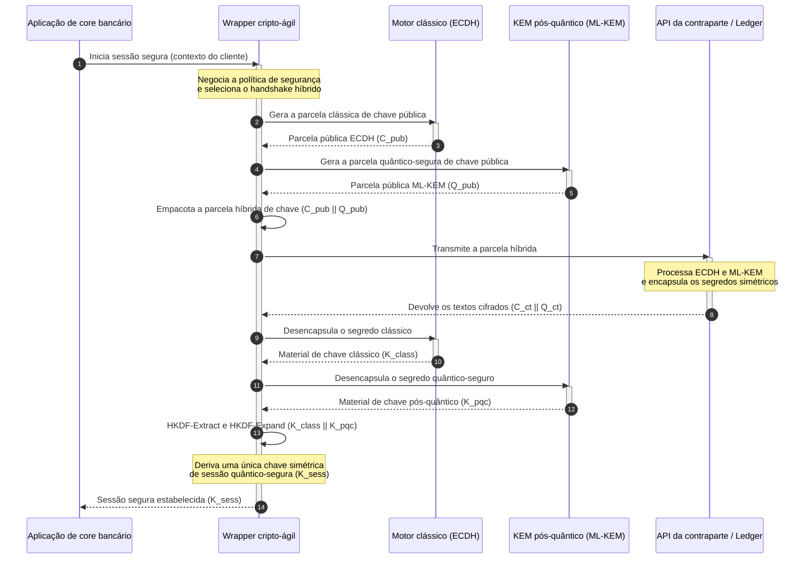

# KyberLib e a migração pós-quântica bancária em 2026: dos padrões ao código

<!-- lead-start: manual -->
<aside class="post-lead" aria-label="Resumo do artigo">

<strong>TL;DR.</strong> A infraestrutura bancária em 2026 enfrenta uma ameaça sistêmica com desfecho conhecido: a computação em escala quântica quebrará a troca de chaves RSA e ECC que protege o tráfego em trânsito de hoje. Padrões federais e documentos de política dos supervisores elevaram a consciência do problema; a execução técnica continua fragmentada. A <a href="https://github.com/sebastienrousseau/kyberlib">KyberLib</a> é um blueprint de engenharia de código aberto que move a narrativa pós-quântica para código Rust concreto e seguro em memória — implementando o ML-KEM padronizado pelo NIST (FIPS 203) por trás de fronteiras de abstração cripto-ágeis, para que as instituições atualizem a segurança de transporte e o encapsulamento de chave antes que os ataques de "Store Now, Decrypt Later" alcancem seus arquivos.

<strong>Pontos-chave</strong>

<ul class="post-lead-takeaways">
  <li><strong>Da política ao código inspecionável.</strong> A KyberLib tira a criptografia pós-quântica dos roadmaps estratégicos abstratos e a leva a implementações Rust concretas, auditáveis e de alto desempenho.</li>
  <li><strong>Execução padronizada do ML-KEM do FIPS 203.</strong> A biblioteca implementa o ML-KEM — o algoritmo de estabelecimento de chaves finalizado no NIST FIPS 203 —, mantendo a conformidade alinhada às expectativas regulatórias globais.</li>
  <li><strong>Cripto-agilidade por design.</strong> Fronteiras de abstração estáveis permitem que aplicações bancárias troquem primitivas criptográficas sem reescritas caras e propensas a erro.</li>
  <li><strong>Segurança de memória garantida pelo Rust.</strong> As regras de ownership em tempo de compilação eliminam os buffer overflows e os vazamentos de memória que assolam bibliotecas criptográficas legadas em C, à velocidade de abstrações de custo zero.</li>
  <li><strong>Mitigação da responsabilidade fiduciária.</strong> Evidência de migração observável e testável dá aos conselheiros o registro de "medidas razoáveis" que as auditorias de responsabilização pessoal do Artigo 5 da DORA exigem.</li>
</ul>

<strong>Leitura relacionada:</strong> <a href="/2026-05-18-quantum-cryptography-standards-developments-2026/">Padrões de criptografia quântica 2026</a> · <a href="/2026-05-28-dora-ai-act-data-sovereignty-banking-compliance-stack-2026/">Stack de conformidade DORA + AI Act</a> · <a href="/2026-05-20-cloud-native-banking-financial-institutions-2026/">Banco cloud-native</a>

</aside>
<!-- lead-end -->

A migração pós-quântica deixou de ser um exercício de planejamento. Em 2026 ela é uma exigência operacional ativa, e a lacuna entre a intenção regulatória e a execução de engenharia é onde o risco agora reside. A [KyberLib ⧉](https://github.com/sebastienrousseau/kyberlib "kyberlib") fecha parte dessa lacuna: uma biblioteca Rust orientada a produção, segura em memória, que implementa o ML-KEM segundo os parâmetros finalizados do FIPS 203 e o envolve nas fronteiras cripto-ágeis de que o parque transacional de um banco realmente precisa.

---

> **Sumário executivo / Pontos-chave**
>
> - **A ameaça já é operacional.** Adversários executam hoje a coleta de "Store Now, Decrypt Later"; a confidencialidade dos dados falha retroativamente no dia em que um computador quântico criptograficamente relevante chegar.
> - **Os padrões estão finalizados.** O NIST FIPS 203 (ML-KEM) e o FIPS 204 (ML-DSA) dão aos comitês de auditoria um referencial claro e testável — a defesa de "aguardar os padrões" deixou de existir.
> - **A KyberLib é o blueprint de engenharia.** Rust seguro em memória, compilação `no_std` para HSMs e smart cards, e padrões de handshake híbrido que preservam a interoperabilidade clássica.
> - **A cripto-agilidade é o objetivo durável.** Fronteiras de abstração estáveis permitem trocar primitivas sem reescrever aplicações — a lição que sobrevive a qualquer algoritmo isolado.
> - **Os conselhos carregam a responsabilidade.** O Artigo 5 da DORA atribui responsabilidade pessoal aos conselheiros; código de migração inspecionável e observável é a evidência que a satisfaz.
>
---

## Por que este projeto de código aberto importa em 2026

À medida que a criptografia assimétrica se aproxima da obsolescência, a ameaça não espera a construção de um computador quântico criptograficamente relevante. Adversários executam agora ataques de **"Store Now, Decrypt Later" (SNDL)** — coletando fluxos cifrados em trânsito de transações bancárias corporativas, segredos comerciais e comunicações institucionais com a intenção de decifrá-los quando as capacidades quânticas amadurecerem. Para um banco, cada handshake clássico que cruza a rede hoje é uma violação de confidencialidade com data de detonação adiada.

Os reguladores responderam com obrigações concretas:

1. **O Artigo 6 da DORA (gestão de risco de TIC)** exige que as instituições mapeiem, identifiquem e mitiguem vulnerabilidades em todo o seu parque criptográfico — incluindo a troca de chaves assimétrica enterrada em middleware que ninguém inventariou.
2. **Os NIST FIPS 203 e 204** estabelecem os padrões pós-quânticos oficiais para encapsulamento de chave (ML-KEM) e assinaturas digitais (ML-DSA), dando aos comitês de auditoria um referencial padronizado contra o qual o progresso da migração é medido.

Executar essa migração sem interromper as operações em produção exige ir além dos documentos de política e chegar a uma **infraestrutura criptográfica de código aberto e inspecionável**. A [KyberLib ⧉](https://github.com/sebastienrousseau/kyberlib "kyberlib") entrega exatamente isso: uma biblioteca Rust segura em memória, em conformidade com o FIPS 203, que converte a transição pós-quântica em um pipeline de engenharia mensurável e verificável — e desloca a conversa sobre investimento em tecnologia para um retorno sobre resiliência tangível.

## Lente de arquitetura

A KyberLib fica atrás de fronteiras de API estáveis, isolando as aplicações transacionais centrais de um banco das mudanças nas primitivas criptográficas de baixo nível.

| Camada | Decisão de design | Por que importa | Risco se mal conduzida |
|---|---|---|---|
| **Primitiva** | Encapsulamento de chave ML-KEM do FIPS 203 | Substitui a troca de chaves clássica Diffie-Hellman e RSA por estruturas baseadas em reticulados | Não conformidade com os parâmetros finalizados do FIPS 203, levando à reprovação em auditorias de conformidade |
| **Linguagem** | Implementação em Rust com segurança de memória | Elimina as vulnerabilidades de corrupção de memória (buffer overflows, use-after-free) endêmicas em C/C++ | Proliferação de dependências comprometendo a integridade da cadeia de build |
| **Abstração** | Fronteiras cripto-ágeis estáveis | Aplicações trocam algoritmos por trás de uma interface unificada conforme os padrões evoluem | Primitivas fixadas no código forçando reescritas manuais em cada migração futura |
| **Implantação** | Handshakes de criptografia híbrida | Combina KEMs pós-quânticos com algoritmos clássicos em um envelope de duplo encapsulamento | Perda de interoperabilidade legada ou desvio silencioso de configuração |
| **Garantia** | Proveniência SLSA Level 3 e testes inspecionáveis | Garante a origem e a proveniência do código; os exemplos podem ser auditados linha a linha | Teatro de segurança — bibliotecas caixa-preta cujos erros de implementação aparecem em produção |

## Sinais operacionais a acompanhar

Demonstrar conformidade pós-quântica a conselhos de supervisão e reguladores significa acompanhar métricas específicas e quantificáveis:

| Sinal | Métrica | Referência regulatória | Implementação na plataforma |
|---|---|---|---|
| **Conformidade ML-KEM com o FIPS 203** | 100% de conformidade com os parâmetros finalizados (ML-KEM-512/768/1024) | NIST FIPS 203 | Criptografia de reticulados com parâmetros verificados compilada nos módulos da KyberLib |
| **Inventário criptográfico** | Inventário completo do uso de troca de chaves assimétrica em todos os sistemas | NIST SP 1800-38 | Agentes de varredura automatizados registrando as cipher suites ativas em um registro central |
| **Troca de chaves híbrida** | Percentual de handshakes da camada de transporte executados em envelope híbrido | Artigo 6 da DORA | Proxies de rede encapsulando handshakes TLS 1.3 clássicos em encapsulamento PQC |
| **Compilação `no_std`** | Capacidade de compilar sem a biblioteca padrão do Rust para alvos restritos | Artigo 30 da DORA | Compilação condicional `no_std` na KyberLib para Hardware Security Modules |
| **Índice de cripto-agilidade** | Tempo em minutos para trocar uma primitiva criptográfica no API gateway | UK PRA SS1/23 | Registros de roteamento abstraídos gerenciando a alocação de algoritmos via variáveis de runtime |

## Por que Rust importa para a criptografia pós-quântica

Implementar algoritmos pós-quânticos como o ML-KEM exige operações matemáticas complexas de baixo nível sobre anéis de polinômios. Historicamente, executar essas operações em velocidade de produção significava C/C++ ou assembly escritos à mão — uma grande superfície de ataque para corrupção de memória, exatamente no código que um banco menos pode se permitir errar.

O Rust muda a postura de segurança da engenharia criptográfica de três formas concretas:

1. **Segurança de memória em tempo de compilação.** O modelo de ownership do Rust garante que buffer overflows, double frees e erros de use-after-free sejam impedidos em tempo de compilação. Isso importa de forma aguda em bibliotecas pós-quânticas, nas quais chaves e textos cifrados são significativamente maiores do que seus equivalentes clássicos.
2. **Abstrações determinísticas de custo zero.** O Rust compila para código de máquina nativo sem garbage collector, de modo que a velocidade de execução e a pegada de memória igualam ou superam as bibliotecas baseadas em C, preservando a segurança.
3. **Compatibilidade `no_std`.** A KyberLib compila sem a biblioteca padrão do Rust e roda em ambientes restritos e bare-metal — incluindo Hardware Security Modules e smart cards —, mantendo a criptografia de nível bancário dentro dos perímetros de segurança física.

## Projetando uma arquitetura cripto-ágil

O modo clássico de falha em migrações criptográficas é a fixação no código: premissas específicas de algoritmo embutidas diretamente na lógica de aplicação, redescobertas dolorosamente a cada transição. O objetivo durável para 2026 é a **cripto-agilidade** — uma camada de abstração que trata algoritmos como módulos substituíveis por trás de uma interface estável, de modo que a próxima migração seja uma mudança de configuração e não uma reescrita de todo o parque.

A sequência abaixo mostra como o wrapper cripto-ágil da KyberLib coordena um handshake híbrido (clássico mais pós-quântico) de troca de chaves:

O envelope híbrido é o detalhe operacionalmente importante. Até que as primitivas pós-quânticas acumulem anos de escrutínio em produção, a chave de sessão deriva tanto do segredo clássico quanto do pós-quântico: um atacante precisa quebrar ECDH **e** ML-KEM para recuperar o canal. Contrapartes que ainda não migraram continuam operando; as que migraram ganham imediatamente a proteção baseada em reticulados.

## O playbook do conselho

A segurança pós-quântica não é uma preocupação de criptografia de retaguarda; é uma questão de governança de conselho com riscos pessoais. Os gestores seniores devem enquadrar a migração pela responsabilidade fiduciária:

- **O Artigo 5 da DORA (governança e organização)** atribui ao conselho de administração a responsabilidade pessoal pela segurança de TIC. Testes abertos e observáveis são a evidência direta que uma auditoria de responsabilização pessoal solicita — "selecionamos uma implementação inspecionável do FIPS 203 e aqui estão suas execuções de conformidade" é uma resposta defensável; "nosso fornecedor nos garantiu" não é.
- **A gestão de risco de modelos (SR 11-7 do Fed americano / SS1/23 da PRA britânica)** aplica-se a arquiteturas de wrapper criptográfico tanto quanto a modelos de precificação. As camadas de abstração devem passar pela validação de risco de modelos, incluindo o desempenho sob cenários de disrupção extrema.
- **O capital de risco operacional de Basel III** recompensa maturidade de controle demonstrada. Handshakes híbridos testados reduzem o perfil de risco operacional de longo prazo da instituição, aparando o prêmio de capital e liberando capacidade de balanço para a atuação ativa da tesouraria.

## O que isso significa por tipo de banco

### Bancos globais sistemicamente importantes (G-SIBs)

Os G-SIBs operam parques transacionais carregados de legado, de modo que sua restrição vinculante é a descoberta: saber onde a troca de chaves assimétrica de fato acontece. Inventários criptográficos contínuos sob a orientação do NIST SP 1800-38 vêm primeiro; a KyberLib fornece, em seguida, a biblioteca padronizada e segura em memória para executar o encapsulamento de chave pós-quântico em cada nó moderno que o inventário revelar.

### Bancos transacionais e corporativos

A confidencialidade nos trilhos de pagamento é a franquia. Como a KyberLib compila para alvos `no_std` bare-metal, os bancos transacionais podem implantar handshakes pós-quânticos diretamente no hardware de roteamento de pagamentos e de gestão de liquidez na borda — não apenas na camada de aplicação.

### Bancos regionais e de menor porte

As instituições regionais enfrentam a mesma coleta patrocinada por Estados sem os orçamentos de pesquisa dos G-SIBs. Uma implementação Rust inspecionável e de código aberto lhes dá um caminho imediato e pronto para a conformidade com o NIST FIPS 203, sem negociar roadmaps de fornecedores caixa-preta.

## De roadmaps a código que compila

A transição pós-quântica é uma tarefa de engenharia ativa, e as instituições que mantiverem a confiança de supervisores, contrapartes e tesoureiros corporativos ao longo de 2026 serão as que passarem de roadmaps abstratos a código observável que compila. O mandato executivo decorre diretamente disso: auditar os pontos legados de troca de chaves, implantar handshakes híbridos nos canais de maior valor e construir as fronteiras de abstração estáveis que tornam rotineira cada futura troca de primitiva. A KyberLib transforma cada um desses passos em uma capacidade operacional mensurável, e não em um compromisso de slides.

## Perguntas frequentes

**A KyberLib está em conformidade com os padrões finalizados do NIST?**

Sim. A KyberLib é projetada em torno dos parâmetros do ML-KEM finalizados no FIPS 203, mantendo a biblioteca compilada alinhada às expectativas regulatórias federais e globais.

**Uma biblioteca pós-quântica exige hardware especializado?**

Não. A implementação em Rust da KyberLib compila para arquiteturas de sistema padrão. Sua capacidade `no_std` permite, adicionalmente, que rode em Hardware Security Modules especializados e smart cards onde a custódia física das chaves é exigida.

**Como o "Store Now, Decrypt Later" afeta a conformidade atual?**

Se a camada de transporte depende de RSA ou ECC clássicos, adversários podem coletar o tráfego hoje e decifrá-lo quando a capacidade quântica amadurecer. A troca de chaves híbrida implantada agora mantém os dados capturados sob proteção baseada em reticulados.

**Por que handshakes híbridos em vez de migrar direto para primitivas pós-quânticas?**

Os envelopes híbridos derivam a chave de sessão de um segredo clássico e de um pós-quântico, de modo que a segurança se mantém a menos que ambos sejam quebrados. Isso preserva a interoperabilidade com contrapartes não migradas enquanto as novas primitivas acumulam escrutínio em produção.

## Referências

- National Institute of Standards and Technology, (2024). [FIPS 203: padrão de mecanismo de encapsulamento de chave baseado em reticulados modulares ⧉](https://www.nist.gov/news-events/news/2024/08/nist-releases-first-3-finalized-post-quantum-encryption-standards "Anúncio do NIST FIPS 203").
- Board of Governors of the Federal Reserve System, (2011). [Orientação supervisória sobre gestão de risco de modelos (SR Letter 11-7) ⧉](https://www.federalreserve.gov/supervisionreg/srletters/sr1107.htm "Federal Reserve SR 11-7").
- European Parliament and Council of the European Union, (2022). [Regulamento (UE) 2022/2554 relativo à resiliência operacional digital do setor financeiro (DORA) ⧉](https://eur-lex.europa.eu/legal-content/EN/TXT/?uri=CELEX%3A32022R2554 "Regulamento DORA").
- NIST National Cybersecurity Center of Excellence, (2025). [Migração para a criptografia pós-quântica (NIST SP 1800-38) ⧉](https://www.nccoe.nist.gov/projects/migration-post-quantum-cryptography "NIST SP 1800-38").
- GitHub, (2026). [Repositório de código aberto kyberlib ⧉](https://github.com/sebastienrousseau/kyberlib "Repositório kyberlib").

<!-- enrich-start -->
<aside class="author-card" aria-label="Sobre o autor"><strong class="author-card-name"><a href="/about/index.html">Sebastien Rousseau</a></strong>Tecnólogo bancário sênior, escreve sobre IA aplicada, infraestrutura de pagamentos, moeda tokenizada, ISO 20022, segurança pós-quântica, serviços financeiros cloud-native e mercados digitais regulados.Mais de 20 anos no HSBC Commercial &amp; Investment Bank, PayPal, Barclays, Shazam, AKQA, Virgin Group. <a href="/about/index.html">Perfil completo</a> &middot; <a href="https://www.linkedin.com/in/sebastienrousseau/" rel="external noopener">LinkedIn</a> &middot; <a href="https://github.com/sebastienrousseau" rel="external noopener">GitHub</a></aside>

Última revisão <time datetime="2026-06-12">2026-06-12</time>.

<!-- enrich-end -->
