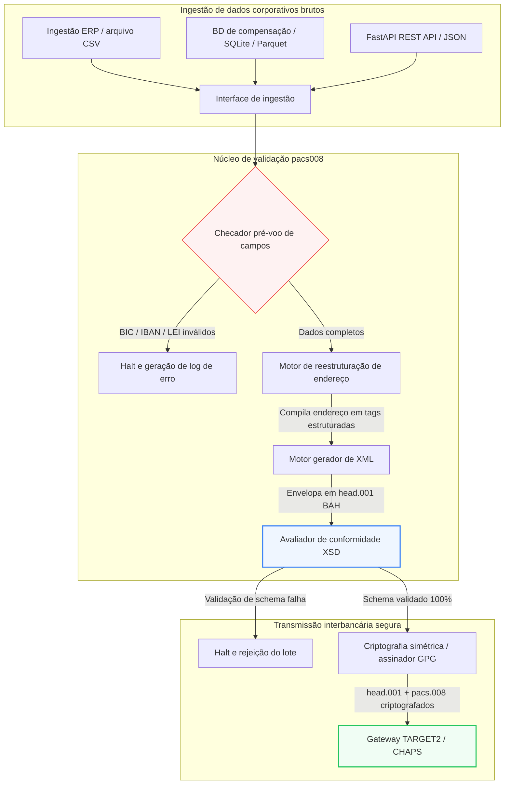

---

# Front Matter (YAML)

author: "contact@sebastienrousseau.com (Sebastien Rousseau)"
banner_alt: "Profissional com assistente de voz e laptop em escritório — simbolizando as mensagens estruturadas e legíveis por máquina de pagamentos interbancários que a automação pacs.008 torna programáveis"
banner_height: "1597"
banner_width: "2584"
banner: "https://cloudcdn.pro/stocks/images/tyler-prahm-lmV3gJSAgbo.webp"
cdn: "https://cloudcdn.pro"
charset: "UTF-8"
cname: "sebastienrousseau.com"
copyright: "© Copyright 2025 - 2026 - Sebastien Rousseau. All rights reserved."
date: "June 15, 2026"
description: "pacs008 é uma biblioteca Python de código aberto que automatiza a geração e validação de mensagens ISO 20022 pacs.008 FI-to-FI — endereços estruturados, envelope BAH head.001, checksums BIC/LEI/IBAN, rastreamento UETR via OpenTelemetry — pronta para o corte SWIFT de novembro de 2026."
format-detection: "telephone=no"
hreflang: "pt-br"
icon: "https://cloudcdn.pro/clients/sebastienrousseau/v1/logos/sebastienrousseau.svg"
id: "https://sebastienrousseau.com/2026-06-15-pacs008-automation-iso-20022-interbank-payments-2026"
image_alt: "Retrato em preto e branco de Sebastien Rousseau"
image_height: "162"
image_width: "162"
image: "https://cloudcdn.pro/stocks/images/sebastienrousseau.webp"
keywords: "pacs008, ISO 20022 pacs.008, transferência de crédito de cliente FI-to-FI, endereço estruturado, SWIFT CBPR+, BAH head.001, TARGET2, CHAPS, Fedwire, DORA, BCBS 239, Basileia III, UETR, validação LEI, SEPA VoP"
language: "pt-BR"
last_reviewed: "2026-06-15"
layout: "report"
locale: "pt_BR"
logo_alt: "Logo de Sebastien Rousseau"
logo_height: "44"
logo_width: "44"
logo: "https://cloudcdn.pro/clients/sebastienrousseau/v1/logos/sebastienrousseau.svg"
menu: ""
measurementID: "G-169G4ET5HQ"
name: "Sebastien Rousseau"
permalink: "https://sebastienrousseau.com/2026-06-15-pacs008-automation-iso-20022-interbank-payments-2026"
rating: "general"
referrer: "no-referrer"
robots: "index, follow"
schema: "FAQPage, Article"
seo_title: "Automação pacs.008 para a era ISO 20022"
short_name: "sebastienrousseau"
subtitle: "A mensagem pacs.008 é onde dados de pagamento interbancário, endereços estruturados, compliance, roteamento e operações de liquidação se encontram."
tags: "pacs008, ISO 20022, pagamentos interbancários, pagamentos atacado, Python"
theme-color: "0, 83, 191"
title: "Automação pacs.008 para a era interbancária ISO 20022 em 2026"
url: "https://sebastienrousseau.com/2026-06-15-pacs008-automation-iso-20022-interbank-payments-2026"
viewport: "width=device-width, initial-scale=1, shrink-to-fit=no"

# RSS - The RSS feed front matter (YAML).
atom_link: "https://sebastienrousseau.com/2026-06-15-pacs008-automation-iso-20022-interbank-payments-2026/rss.xml"
category: "Finance"
docs: https://validator.w3.org/feed/docs/rss2.html
generator: "Static Site Generator (SSG) (version 0.0.26)"
item_description: "pacs008 oferece uma base Python de código aberto para automatizar mensagens ISO 20022 pacs.008 de transferência de crédito de cliente FI-to-FI na era dos pagamentos interbancários."
item_guid: "https://sebastienrousseau.com/2026-06-15-pacs008-automation-iso-20022-interbank-payments-2026/rss.xml"
item_link: "https://sebastienrousseau.com/2026-06-15-pacs008-automation-iso-20022-interbank-payments-2026/rss.xml"
item_pub_date: "Mon, 15 Jun 2026 06:06:06 +0000"
item_title: "Automação pacs.008 para a era interbancária ISO 20022 em 2026"
last_build_date: "Mon, 15 Jun 2026 06:06:06 +0000"
managing_editor: "contact@sebastienrousseau.com (Sebastien Rousseau)"
pub_date: "Mon, 15 Jun 2026 06:06:06 +0000"
ttl: "60"
type: "article"
webmaster: "contact@sebastienrousseau.com"

# Apple - The Apple front matter (YAML).
apple_mobile_web_app_orientations: "portrait"
apple_touch_icon_sizes: "192x192"
apple-mobile-web-app-capable: "yes"
apple-mobile-web-app-status-bar-inset: "black"
apple-mobile-web-app-status-bar-style: "black-translucent"
apple-mobile-web-app-title: "Automação pacs.008 ISO 20022"
apple-touch-fullscreen: "yes"

# MS Application - The MS Application front matter (YAML).

msapplication-navbutton-color: "0, 83, 191"

# Twitter Card - The Twitter Card front matter (YAML).

twitter_card: "summary_large_image"
twitter_creator: "@wwdseb"
twitter_description: "pacs008 oferece uma base Python de código aberto para automatizar mensagens ISO 20022 pacs.008 de transferência de crédito de cliente FI-to-FI na era dos pagamentos interbancários."
twitter_image: "https://cloudcdn.pro/clients/sebastienrousseau/v1/logos/sebastienrousseau.svg"
twitter_image_alt: "Logo de Sebastien Rousseau"
twitter_site: "@wwdseb"
twitter_title: "Automação pacs.008 para a era ISO 20022"
twitter_url: "https://sebastienrousseau.com/2026-06-15-pacs008-automation-iso-20022-interbank-payments-2026"

excerpt: "pacs008 é um toolkit Python de código aberto que torna programáveis as mensagens ISO 20022 pacs.008 de transferência de crédito de cliente FI-to-FI — endereços estruturados, validação, roteamento, ganchos de compliance e o prazo SWIFT de novembro de 2026 incorporados como padrão."

# Humans.txt - The Humans.txt front matter (YAML).
author_website: "https://sebastienrousseau.com"
author_twitter: "@wwdseb"
author_location: "London, UK"
thanks: "Obrigado pela leitura!"
site_last_updated: "2026-06-15"
site_standards: "HTML5, CSS3, RSS, Atom, JSON, XML, YAML, Markdown, TOML"
site_components: "Kaishi, Kaishi Builder, Kaishi CLI, Kaishi Templates, Kaishi Themes"
site_software: "Static Site Generator, Rust"

---

# Automatizando pagamentos interbancários ISO 20022 pacs.008 com Python de código aberto em 2026

<!-- lead-start -->
<aside class="post-lead" aria-label="Resumo do artigo">

<strong>TL;DR.</strong> Sob as diretrizes SWIFT CBPR+, o Corte de Endereço Estruturado de 14 de novembro de 2026 desativa endereços postais não estruturados em TARGET2, CHAPS, Fedwire, Lynx e SEPA. pacs008 é uma biblioteca Python de código aberto que automatiza a geração e validação de mensagens ISO 20022 de transferência de crédito de cliente FI-to-FI (pacs.008), envelopa pagamentos em Business Application Headers (BAH head.001) e incorpora a conformidade de endereço estruturado no caminho dos dados antes que a mensagem chegue à rede de compensação.

<strong>Pontos-chave</strong>

<ul class="post-lead-takeaways">
  <li><strong>O prazo do Endereço Estruturado é absoluto.</strong> Após 14 de novembro de 2026, blocos de endereço não estruturados são aposentados. pacs008 impõe elementos de endereço postal estruturado (<code>&lt;TwnNm&gt;</code>, <code>&lt;Ctry&gt;</code>, <code>&lt;PstCd&gt;</code>) no momento da compilação dos dados para evitar rejeições na fronteira.</li>
  <li><strong>Orquestração unificada de mensagens.</strong> Envelopa o payload pacs.008 em um Business Application Header (head.001) em conformidade, fornecendo um modelo padrão de processamento ida-e-volta.</li>
  <li><strong>Integridade algorítmica.</strong> Validadores nativos para BICs e Legal Entity Identifiers (LEIs) usando cálculos de checksum ISO 7064 Modulo 97-10.</li>
  <li><strong>Rastreabilidade no nível DORA.</strong> Instrumentação OpenTelemetry completa ancorada na Unique End-to-End Transaction Reference (UETR) para logs de auditoria em tempo real e assinaturas criptográficas de auditoria.</li>
  <li><strong>Preservação fiduciária no nível do conselho.</strong> Alinha a precisão das mensagens interbancárias com o Artigo 5 da DORA, o reporte BCBS 239 e a economia de capital de Risco Operacional sob Basileia III.</li>
</ul>

<strong>Leitura complementar:</strong> <a href="https://sebastienrousseau.com/2026-05-19-global-wholesale-payments-economics-2026">Pagamentos atacado globais em 2026: ISO 20022, renovação de RTGS e a economia da interoperabilidade</a>, <a href="https://sebastienrousseau.com/2026-05-27-ai-operating-system-payments-fraud-routing-resilience-compliance-2026">IA como sistema operacional dos pagamentos: fraude, roteamento, resiliência e compliance em 2026</a>, <a href="https://sebastienrousseau.com/2026-05-12-iso-20022-pacs008-structured-address-deadline">O prazo pacs.008 de endereço estruturado em novembro de 2026: uma visão de seis meses</a>.

</aside>
<!-- lead-end -->

Conectando dados financeiros legados a mensagens interbancárias estruturadas por meio de um pipeline Python auditável e validado por schema.

A referência de código aberto para este artigo é [pacs008 ⧉](https://github.com/sebastienrousseau/pacs008 "pacs008 — biblioteca Python de código aberto"). O repositório é posicionado como uma biblioteca Python para automatizar mensagens XML pacs.008 ISO 20022 de transferência de crédito de cliente FI-to-FI.

## Por que este projeto de código aberto importa em 2026

A infraestrutura global de compensação de pagamentos interbancários vive a modernização mais profunda em quase meio século.

Em junho de 2026, o setor de serviços financeiros se aproxima rapidamente do **Corte de Endereço Estruturado SWIFT de 14 de novembro de 2026**. A partir dessa data, as diretrizes SWIFT CBPR+, juntamente com TARGET2, CHAPS, Fedwire e Lynx (Canadá), desativam oficialmente as linhas de endereço postal não estruturadas (uso exclusivo de `<AdrLine>` dentro de blocos `<PstlAdr>`). Todas as instituições financeiras participantes devem transmitir endereços em formato híbrido (`<TwnNm>` e `<Ctry>` estruturados, com no máximo dois elementos `<AdrLine>` para detalhes remanescentes) ou em formato totalmente estruturado (elementos individuais para nome de rua, número do edifício e código postal). Qualquer mensagem que não atenda a esse critério será rejeitada na fronteira da rede.

Para as instituições financeiras, essa transição cria restrições operacionais relevantes:

1. **A penalidade de rejeição na fronteira.** Pagamentos que falharem em atender aos critérios de endereço estruturado sofrerão rejeições imediatas da rede, gerando atrasos transacionais, bloqueios de liquidez e filas operacionais.
2. **SEPA Verification of Payee (VoP).** Exige que todos os Payment Service Providers (PSPs) dentro da zona SEPA verifiquem a correspondência entre nome do beneficiário e IBAN antes de executar transferências de crédito, adicionando outra barreira de validação à iniciação da mensagem.

[pacs008](https://github.com/sebastienrousseau/pacs008) resolve esse problema. É uma biblioteca Python de código aberto e leve que automatiza a conversão de dados financeiros brutos em mensagens pacs.008 de transferência de crédito de cliente interbancário ISO 20022 totalmente validadas e em conformidade com o schema. Ao conectar a lacuna entre dados legados e estruturados, pacs008 entrega um Retorno sobre Resiliência (RoR) elevado, preservando capital de giro e garantindo execução em tempo real nos trilhos globais.

## A lente de arquitetura pacs008 2026

A biblioteca pacs008 é estruturada como um motor isolado de validação e geração, garantindo que entradas brutas sejam sistematicamente analisadas, enriquecidas e envelopadas em formatos padrão:

| Camada | Decisão de design | Por que importa | Risco se mal conduzida |
|---|---|---|---|
| **Camada de entrada** | Ingestão de CSV, JSON, SQLite e Parquet | Encontra os times de integração bancária onde seus dados já residem, evitando migrações de plataforma. | Ingestão de payloads brutos, não validados ou corrompidos. |
| **Camada de validação** | Validação pré-voo contra schemas XSD oficiais e regras de negócio customizadas | Interrompe a execução e sinaliza erros antes de o arquivo de pagamento ser transmitido à rede de compensação. | Arquivos XML inválidos que disparam rejeições imediatas e atrasos na compensação. |
| **Camada de envelope BAH** | Envelope automático Business Application Header (head.001) | Padroniza o despacho e roteamento das mensagens com base na tag `<MsgDefIdr>`. | Transmissão de payloads pacs.008 brutos sem o envelope externo obrigatório, causando rejeição do sistema. |
| **Camada de serialização** | Suporte a XML padrão e JSON em conformidade com ISO (TS 23029) | Permite tradução direta entre payloads XML e JSON, suportando APIs REST modernas e streaming Kafka. | Representações de dados fragmentadas em violação às diretrizes ISO oficiais. |
| **Camada de observabilidade** | Tracing OpenTelemetry ancorado na UETR | Captura caminhos de execução e logs detalhados, fornecendo auditabilidade em tempo real. | Lacunas de tracing que bloqueiam visibilidade operacional e auditoria. |

## Sinais interbancários e marcos regulatórios

Para demonstrar resiliência operacional transacional, gestores seniores de tecnologia e risco precisam acompanhar indicadores de compliance específicos e quantificáveis:

| Sinal | Métrica / benchmark operacional | Referência G20 / SWIFT / DORA | Implementação técnica na plataforma |
|---|---|---|---|
| **Conformidade de endereço estruturado** | % de mensagens pacs.008 utilizando campos `<PstlAdr>` totalmente estruturados com `<TwnNm>` e `<Ctry>` designados. | Prazo SWIFT SR 2026 | Checagens de schema pré-voo em pacs008 que rejeitam linhas de endereço não estruturadas. |
| **SEPA Verification of Payee** | Validação de correspondência entre nome do beneficiário e IBAN antes da execução da mensagem. | Regulação SEPA VoP | Classes auxiliares VoP nativas que executam consultas de pré-validação em IBAN/BIC. |
| **Integração BAH head.001** | Percentual de payloads de pagamento de saída envelopados com sucesso em Business Application Headers. | Diretrizes TARGET2 / CBPR+ | Subsistema de wrapping BAH que compila o envelope XML externo automaticamente. |
| **LEI Modulo Checksum** | Validação de dígito verificador ISO 7064 Modulo 97-10 sobre os blocos `<LEI>` de devedor e credor. | Mandato do Bank of England | Verificador algorítmico que confere a integridade do identificador de 20 caracteres. |
| **Precisão de rastreamento UETR** | 100% dos pagamentos gerados injetados com uma Unique End-to-End Transaction Reference válida. | Especificações SWIFT UETR | Geração e tracing automatizados do código UUIDv4 de 36 caracteres. |

## Por que Python é a porta de entrada ideal para a automação interbancária

Hubs modernos de pagamento e times de operações de tesouraria em 2026 dependem fortemente de Python para transformação de dados, modelagem financeira e integração de bases ERP.

Ao alavancar uma biblioteca Python de código aberto, as instituições obtêm vantagens significativas:

1. **Baixa carga cognitiva e alta interoperabilidade.** Python atua como uma ponte coesa. Permite que desenvolvedores escrevam scripts simples que extraem instruções de pagamento brutas de bases legadas, validem contra regras bancárias internacionais complexas e gerem XML em conformidade em um único fluxo unificado.
2. **Eliminação de tradutores opacos "caixa-preta".** Portais bancários proprietários frequentemente cobram licenças altas por tradutores de arquivos de pagamento customizados. Esses tradutores são caixas-pretas proprietárias, impossibilitando que times de segurança auditem como os dados são processados ou onde as chaves são armazenadas. Uma biblioteca de código aberto e inspecionável como pacs008 garante transparência total do código.
3. **Integração CI/CD direta.** pacs008 integra-se diretamente a pipelines de integração e entrega contínua, permitindo que desenvolvedores automatizem o teste de arquivos de pagamento como parte do ciclo padrão de entrega de software.

## Projetando um pipeline interbancário delimitado

Uma vulnerabilidade importante na compensação interbancária é a "geração de lote descontrolada" — gerar arquivos sem um loop de verificação claro e delimitado. pacs008 foi projetado para operar como o motor de validação central dentro de um pipeline transacional multietapas estritamente controlado.

O fluxo operacional abaixo mostra como dados transacionais brutos passam pelo pipeline pacs008 para gerar um arquivo pacs.008 criptograficamente seguro, em conformidade com o schema e envelopado em BAH:

## O playbook do conselho e responsabilidade fiduciária

A automação de pagamentos interbancários é uma questão de gestão de risco e governança corporativa no nível do conselho. Gestores seniores devem tratar a qualidade dos dados transacionais sob a ótica da responsabilidade fiduciária e da redução de risco operacional:

- **Artigo 5 da DORA (responsabilização do conselho).** Atribui responsabilidade direta e pessoal aos membros do conselho pela resiliência e segurança das operações de TIC da instituição. Como a compensação interbancária é uma função corporativa crítica, os conselhos precisam demonstrar que implementaram controles transacionais robustos, validados e automatizados para evitar disrupções operacionais ou atrasos em pagamentos.
- **BCBS 239 (Agregação e reporte de dados de risco).** Exige que o reporte de transações financeiras seja preciso, completo e gerado em tempo real. pacs008 ajuda as instituições a atingir conformidade com BCBS 239 ao garantir que os dados de pagamento sejam estruturados e validados na fonte, eliminando lacunas de dados e erros de conciliação manual que afetam planilhas legadas.
- **Mitigação dos encargos de capital por risco operacional (Basileia III).** Sob as diretrizes de Basileia III, altas taxas de erro em pagamentos e a sobrecarga de intervenção manual aumentam os requisitos de capital por risco operacional do banco, imobilizando capital que poderia ser destinado a crédito ou investimento. Automatizar o pipeline de pagamentos minimiza diretamente esses prêmios de capital, preservando valor de balanço.

## O que isso significa por tipo de banco

### Bancos sistemicamente importantes em nível global (G-SIBs)

G-SIBs administram volumes massivos de transações corporativas transfronteiriças. Seu principal desafio é a remediação de dados legados não estruturados antes que cheguem à rede de compensação. Ao integrar pacs008 a seus gateways de banking corporativo, G-SIBs podem oferecer utilidades de validação automatizadas a seus clientes corporativos, reduzindo a sobrecarga de reparos manuais de pagamentos e garantindo execução em tempo real na rede SWIFT.

### Bancos de transação e corporativos

Para bancos de transação, a qualidade dos dados de pagamento é um diferencial competitivo. Ao oferecer uma ferramenta de validação inspecionável e de código aberto como pacs008 aos clientes de tesouraria corporativa, esses bancos podem acelerar o onboarding, minimizar rejeições de arquivos de pagamento e construir confiança do cliente por meio de taxas superiores de straight-through processing.

### Bancos regionais e menores

Bancos regionais precisam manter conformidade com padrões de pagamento internacionais sem os orçamentos de tecnologia massivos dos G-SIBs. pacs008 oferece uma solução baseada em Python leve, custo-efetiva e totalmente em conformidade, permitindo que instituições menores ofereçam capacidades modernas de iniciação de pagamentos estruturados sem licenças caras de middleware proprietário.

## Conclusão: o roteiro de compensação interbancária

O prazo SWIFT de novembro de 2026 para endereço estruturado representa uma fronteira rígida para operações de tesouraria corporativa. Depender de planilhas legadas, entrada manual de dados e arquivos de pagamento não estruturados é um risco de negócio ativo.

Para garantir continuidade transacional e minimizar sobrecarga operacional, gestores seniores de tecnologia e finanças devem executar um roteiro de compensação claro hoje:

1. **Imponha a validação na fonte.** Exija que todas as instruções de pagamento sejam validadas e formatadas conforme os schemas XSD oficiais ISO 20022 antes de deixarem as fronteiras do ERP corporativo.
2. **Audite o pipeline de dados.** Abandone o processamento manual em planilhas e implemente fluxos automatizados e inspecionáveis em Python usando pacs008.
3. **Implemente segurança híbrida.** Garanta que os arquivos de pagamento gerados sejam assinados criptograficamente e criptografados antes da transmissão, atendendo às expectativas de rede zero-trust.
4. **Alinhe às prioridades fiduciárias.** Reporte formalmente ao conselho métricas de automação de pagamentos e qualidade de dados, enquadrando o investimento como um programa crítico de redução de risco operacional sob DORA.

## Perguntas frequentes

**O pacs008 está em conformidade com as próximas regras de endereço SWIFT SR 2026?**

Sim. pacs008 foi projetado para suportar o rigoroso marco de endereço estruturado SWIFT de novembro de 2026, impondo a separação obrigatória dos elementos de endereço postal (cidade, país, código postal) nos campos XML ISO 20022 designados.

**O pacs008 pode envelopar payloads de pagamento em Business Application Headers?**

Sim. Como pacs008 suporta nativamente o envelope Business Application Header (BAH head.001), ele compila automaticamente o envelope externo exigido por TARGET2, CHAPS e redes CBPR+.

**Por que uma biblioteca de código aberto é preferível a tradutores de arquivo proprietários?**

Tradutores proprietários são caixas-pretas opacas, tornando auditorias de segurança impossíveis. Uma biblioteca revisada por pares e de código aberto como pacs008 oferece transparência total do código, permitindo que times de segurança verifiquem que nenhum dado sensível de pagamento é exposto durante o processamento.

**Quais identificadores o pacs008 valida?**

pacs008 vem com validadores nativos para Bank Identifier Codes (BICs) e Legal Entity Identifiers (LEIs) usando cálculos de checksum ISO 7064 Modulo 97-10, além de validação de dígito verificador IBAN e checagens de unicidade UETR.

## Referências

- SWIFT, (2024). *ISO 20022 November 2026 Structured Address Milestone*. La Hulpe: SWIFT. Disponível em: [Marco ISO 20022 SWIFT ⧉](https://www.swift.com/standards/iso-20022/iso-20022-bytes/call-action-november-2026 "Marco ISO 20022 SWIFT").
- Basel Committee on Banking Supervision (BCBS), (2013). *Principles for effective risk data aggregation and risk reporting (BCBS 239)*. Basel: Bank for International Settlements. Disponível em: [Princípios BCBS 239 ⧉](https://www.bis.org/publ/bcbs239.htm "Princípios BCBS 239").
- European Parliament and Council of the European Union, (2022). *Regulation (EU) 2022/2554 on digital operational resilience for the financial sector (DORA)*. Brussels: Official Journal of the European Union. Disponível em: [Regulação DORA ⧉](https://eur-lex.europa.eu/legal-content/EN/TXT/?uri=CELEX%3A32022R2554 "Regulação DORA").
- GitHub, (2026). *pacs008 open-source repository*. Disponível em: [Repositório pacs008 ⧉](https://github.com/sebastienrousseau/pacs008 "Repositório pacs008").

<!-- enrich-start -->
<aside class="author-card" aria-label="Sobre o autor"><strong class="author-card-name"><a href="/about/index.html">Sebastien Rousseau</a></strong>Tecnólogo bancário sênior escrevendo sobre IA aplicada, migração ISO 20022, criptografia pós-quântica para serviços financeiros e a transformação estrutural dos pagamentos atacado.Mais de 20 anos no HSBC Commercial &amp; Investment Bank, PayPal, Barclays, Shazam, AKQA, Virgin Group. <a href="/about/index.html">Perfil completo</a> &middot; <a href="https://www.linkedin.com/in/sebastienrousseau/" rel="external noopener">LinkedIn</a> &middot; <a href="https://github.com/sebastienrousseau" rel="external noopener">GitHub</a></aside>

Última revisão <time datetime="2026-06-15">2026-06-15</time>.

<aside class="related-posts" aria-labelledby="related-heading">
<h2 id="related-heading" class="related-heading">Leitura complementar</h2>

<article class="related-card"><footer class="related-body"><h3><a href="https://sebastienrousseau.com/2026-05-19-global-wholesale-payments-economics-2026">Pagamentos atacado globais em 2026: ISO 20022, renovação de RTGS e a economia da interoperabilidade</a></h3>
<time datetime="2026-05-19">2026-05-19</time>
</footer></article>
<article class="related-card"><footer class="related-body"><h3><a href="https://sebastienrousseau.com/2026-05-27-ai-operating-system-payments-fraud-routing-resilience-compliance-2026">IA como sistema operacional dos pagamentos: fraude, roteamento, resiliência e compliance em 2026</a></h3>
<time datetime="2026-05-27">2026-05-27</time>
</footer></article>
<article class="related-card"><footer class="related-body"><h3><a href="https://sebastienrousseau.com/2026-05-12-iso-20022-pacs008-structured-address-deadline">O prazo pacs.008 de endereço estruturado em novembro de 2026: uma visão de seis meses</a></h3>
<time datetime="2026-05-12">2026-05-12</time>
</footer></article>

</aside>
<!-- enrich-end -->
