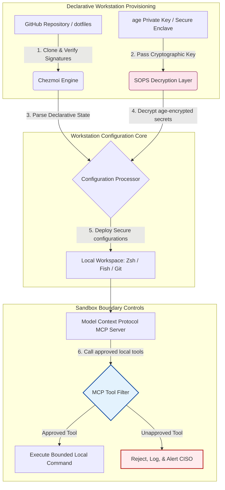

---

# Front Matter (YAML)

author: "contact@sebastienrousseau.com (Sebastien Rousseau)"
banner_alt: "Estação de trabalho do desenvolvedor em luz baixa — simbolizando dotfiles cientes de IA, reprodutíveis e seguros para servidores MCP, assinatura SLSA, segredos age/SOPS e paridade multi-shell"
banner_height: "1597"
banner_width: "2584"
banner: "https://cloudcdn.pro/stocks/images/almas-salakhov-Vq2ap8aFFEs.webp"
cdn: "https://cloudcdn.pro"
charset: "UTF-8"
cname: "sebastienrousseau.com"
copyright: "© Copyright 2025 - 2026 - Sebastien Rousseau. All rights reserved."
date: "June 16, 2026"
description: "Dotfiles cientes de IA são um padrão de estação de trabalho seguro e reprodutível para a era MCP — configuração declarativa via Chezmoi, segredos SOPS/age, proveniência SLSA Nível 3, paridade multi-shell e limites de sandbox para agentes de IA locais."
format-detection: "telephone=no"
hreflang: "pt-br"
icon: "https://cloudcdn.pro/clients/sebastienrousseau/v1/logos/sebastienrousseau.svg"
id: "https://sebastienrousseau.com/2026-06-16-ai-aware-dotfiles-secure-reproducible-workstation-2026"
image_alt: "Retrato em preto e branco de Sebastien Rousseau"
image_height: "162"
image_width: "162"
image: "https://cloudcdn.pro/stocks/images/sebastien-rousseau.png"
keywords: "dotfiles, Chezmoi, MCP, Model Context Protocol, SLSA, SOPS, criptografia age, configuração declarativa, estação de trabalho do desenvolvedor, DORA Artigo 5, NIST CSF 2.0, segurança da cadeia de suprimentos, IA agêntica, paridade multi-shell, Zsh, Fish, Nushell"
language: "pt-BR"
last_reviewed: "2026-06-16"
layout: "report"
locale: "pt_BR"
logo_alt: "Logo de Sebastien Rousseau"
logo_height: "44"
logo_width: "44"
logo: "https://cloudcdn.pro/clients/sebastienrousseau/v1/logos/sebastienrousseau.svg"
menu: ""
measurementID: "G-169G4ET5HQ"
name: "Sebastien Rousseau"
permalink: "https://sebastienrousseau.com/2026-06-16-ai-aware-dotfiles-secure-reproducible-workstation-2026"
rating: "general"
referrer: "no-referrer"
robots: "index, follow"
schema: "FAQPage, Article"
seo_title: "Dotfiles cientes de IA para estação de trabalho segura"
short_name: "sebastienrousseau"
subtitle: "A estação de trabalho do desenvolvedor agora faz parte da cadeia de suprimentos de IA; dotfiles exigem segurança, reprodutibilidade, higiene de segredos e fluxos cientes de MCP."
tags: "dotfiles, ferramentas de desenvolvimento, MCP, SLSA, estação de trabalho segura, chezmoi, macOS, Linux, WSL"
theme-color: "0, 83, 191"
title: "Dotfiles cientes de IA em 2026: construindo uma estação de trabalho segura e reprodutível para MCP, SLSA e paridade multi-shell"
url: "https://sebastienrousseau.com/2026-06-16-ai-aware-dotfiles-secure-reproducible-workstation-2026"
viewport: "width=device-width, initial-scale=1, shrink-to-fit=no"

# RSS - The RSS feed front matter (YAML).
atom_link: "https://sebastienrousseau.com/2026-06-16-ai-aware-dotfiles-secure-reproducible-workstation-2026/rss.xml"
category: "Technology"
docs: https://validator.w3.org/feed/docs/rss2.html
generator: "Static Site Generator (SSG) (version 0.0.26)"
item_description: "Uma análise de dotfiles declarativos para estações de trabalho do desenvolvedor seguras e reprodutíveis em macOS, Linux e WSL, com consciência MCP, SLSA, age, SOPS e paridade multi-shell."
item_guid: "https://sebastienrousseau.com/2026-06-16-ai-aware-dotfiles-secure-reproducible-workstation-2026/rss.xml"
item_link: "https://sebastienrousseau.com/2026-06-16-ai-aware-dotfiles-secure-reproducible-workstation-2026/rss.xml"
item_pub_date: "Tue, 16 Jun 2026 06:06:06 +0000"
item_title: "Dotfiles cientes de IA em 2026: construindo uma estação de trabalho segura e reprodutível para MCP, SLSA e paridade multi-shell"
last_build_date: "Tue, 16 Jun 2026 06:06:06 +0000"
managing_editor: "contact@sebastienrousseau.com (Sebastien Rousseau)"
pub_date: "Tue, 16 Jun 2026 06:06:06 +0000"
ttl: "60"
type: "article"
webmaster: "contact@sebastienrousseau.com"

# Apple - The Apple front matter (YAML).
apple_mobile_web_app_orientations: "portrait"
apple_touch_icon_sizes: "192x192"
apple-mobile-web-app-capable: "yes"
apple-mobile-web-app-status-bar-inset: "black"
apple-mobile-web-app-status-bar-style: "black-translucent"
apple-mobile-web-app-title: "Dotfiles cientes de IA para estação de trabalho segura"
apple-touch-fullscreen: "yes"

# MS Application - The MS Application front matter (YAML).

msapplication-navbutton-color: "0, 83, 191"

# Twitter Card - The Twitter Card front matter (YAML).

twitter_card: "summary_large_image"
twitter_creator: "@wwdseb"
twitter_description: "Uma análise de dotfiles declarativos para estações de trabalho do desenvolvedor seguras e reprodutíveis em macOS, Linux e WSL, com consciência MCP, SLSA, age, SOPS e paridade multi-shell."
twitter_image: "https://cloudcdn.pro/clients/sebastienrousseau/v1/logos/sebastienrousseau.svg"
twitter_image_alt: "Logo de Sebastien Rousseau"
twitter_site: "@wwdseb"
twitter_title: "Dotfiles cientes de IA para estação de trabalho segura"
twitter_url: "https://sebastienrousseau.com/2026-06-16-ai-aware-dotfiles-secure-reproducible-workstation-2026"

excerpt: "Dotfiles cientes de IA em 2026 tratam a estação de trabalho do desenvolvedor como infraestrutura da cadeia de suprimentos — configuração declarativa gerenciada por chezmoi com consciência MCP, releases assinados por SLSA, segredos age/SOPS, inicialização sub-segundo e paridade macOS/Linux/WSL."

# Humans.txt - The Humans.txt front matter (YAML).
author_website: "https://sebastienrousseau.com"
author_twitter: "@wwdseb"
author_location: "London, UK"
thanks: "Obrigado pela leitura!"
site_last_updated: "2026-06-16"
site_standards: "HTML5, CSS3, RSS, Atom, JSON, XML, YAML, Markdown, TOML"
site_components: "Kaishi, Kaishi Builder, Kaishi CLI, Kaishi Templates, Kaishi Themes"
site_software: "Static Site Generator, Rust"

---

# Dotfiles cientes de IA em 2026: construindo uma estação de trabalho segura e reprodutível para MCP, SLSA e paridade multi-shell

<!-- lead-start -->
<aside class="post-lead" aria-label="Resumo do artigo">

<strong>TL;DR.</strong> A estação de trabalho do desenvolvedor deixou de ser apenas um endpoint; é participante ativa da cadeia de suprimentos de software e interface direta para o plano de controle de IA local. Assistentes de IA baseados em terminal e servidores <a href="https://modelcontextprotocol.io">Model Context Protocol (MCP)</a> executam comandos shell locais, inspecionam repositórios e leem arquivos de configuração sensíveis diretamente. O <a href="https://github.com/sebastienrousseau/dotfiles">Dotfiles de Sebastien Rousseau</a> é um framework declarativo de código aberto que constrói estações de trabalho seguras e reprodutíveis em macOS, Linux e Windows Subsystem for Linux (WSL) — integrando <a href="https://www.chezmoi.io/">Chezmoi</a>, <a href="https://github.com/getsops/sops">SOPS, age</a> e proveniência de build SLSA Nível 3 para isolamento de segredos com memória segura e caminhos de execução limitados para modelos de IA locais.

<strong>Pontos-chave</strong>

<ul class="post-lead-takeaways">
  <li><strong>Estações de trabalho são infraestrutura da cadeia de suprimentos.</strong> Configurações de ambiente do desenvolvedor exigem o mesmo rigor declarativo das implantações em servidores de produção, eliminando o desvio de configuração manual.</li>
  <li><strong>O desafio do plano de controle de IA.</strong> Modelos de IA baseados em terminal e ferramentas MCP podem acessar diretórios locais. Os dotfiles precisam impor limites de sandbox, listas estritas de permissões de ferramentas e logs locais inalteráveis para impedir vazamentos de dados.</li>
  <li><strong>Paridade absoluta entre plataformas.</strong> Desempenho idêntico, sub-segundo, e perfis de segurança consistentes em macOS, Linux (Zsh, Fish, Nushell) e WSL, reduzindo o tempo de onboarding de semanas para minutos.</li>
  <li><strong>Isolamento criptográfico de segredos.</strong> Criptografia de arquivos com SOPS e age impede que credenciais embutidas (tokens GitHub, chaves de acesso à nuvem) sejam commitadas no Git ou lidas por LLMs locais.</li>
  <li><strong>Valor fiduciário no nível do conselho.</strong> Converte a conformidade da configuração da estação de trabalho em prioridades claras para o conselho, sustentando o DORA Artigo 5, os padrões de endpoint do NIST CSF 2.0 e a redução de Risco Operacional sob Basileia III.</li>
</ul>

<strong>Leituras relacionadas:</strong> <a href="https://sebastienrousseau.com/2026-05-23-agentic-payments-banking-consent-liability-new-payment-ux-2026">Agentic Payments in Banking: Consent, Liability, and the New Payment UX in 2026</a>, <a href="https://sebastienrousseau.com/2024-03-12-revolutionising-real-time-speech-recognition-on-macos-with-openai-whisper/index.html">Fast Real-Time Speech Recognition on macOS: OpenAI Whisper</a>, <a href="https://sebastienrousseau.com/2024-02-26-google-gemma-ai-transforming-open-source-ai-development/index.html">Google Gemma AI: Transforming Open-Source AI Development</a>.

</aside>
<!-- lead-end -->

Conectando a configuração declarativa da estação de trabalho a cadeias de suprimentos de software seguras numa era de modelos de IA locais e ferramentas agênticas de desenvolvimento.

A referência de código aberto deste artigo é [dotfiles ⧉](https://github.com/sebastienrousseau/dotfiles "dotfiles — configuração declarativa da estação de trabalho"). O repositório é posicionado como: dotfiles declarativos para macOS, Linux e WSL, oferecendo paridade multi-shell, inicialização sub-segundo, releases assinados por SLSA e configuração ciente de IA/MCP.

## Por que este projeto de código aberto importa em 2026

Em junho de 2026, a estação de trabalho do desenvolvedor é o elo mais fraco da cadeia de suprimentos de software e um alvo de alto valor para sindicatos cibernéticos criminosos e patrocinados por Estados.

A segurança do ambiente de desenvolvimento mudou radicalmente com a ascensão dos assistentes de programação por IA baseados em terminal (como o Claude Code) e a adoção do Model Context Protocol (MCP). Terminais locais agora hospedam agentes de IA autônomos e ativos, capazes de:

- Ler e editar arquivos-fonte locais.
- Chamar ferramentas CLI locais (`git`, `npm`, `aws`, `kubectl`).
- Inspecionar variáveis de ambiente do shell, bancos de dados locais e configurações.

Se o ambiente local do desenvolvedor não tiver limites estritos, essas ferramentas autônomas de IA podem ler dados pessoais sensíveis sem querer, vazar credenciais de nuvem para APIs públicas de LLM ou executar pacotes maliciosos durante builds automatizados.

Sob o Digital Operational Resilience Act (DORA) e o NIST Cybersecurity Framework (CSF) 2.0, as instituições financeiras são legalmente obrigadas a verificar a proveniência e a integridade de segurança de cada dispositivo que acessa a cadeia de suprimentos de software. "Laptops snowflake" — configurações manuais, não auditadas e em deriva — não cumprem mais os padrões bancários globais.

O [Dotfiles de Sebastien Rousseau](https://github.com/sebastienrousseau/dotfiles) resolve esse problema. É um framework declarativo de gestão de estação de trabalho, de código aberto, que estabelece estações de trabalho seguras e reprodutíveis. Ao impor uma base de configuração padronizada e auditável, o projeto entrega Retorno em Resiliência (RoR) elevado, reduzindo o onboarding do desenvolvedor de semanas para horas e protegendo cadeias de suprimentos financeiras sensíveis contra vulnerabilidades de endpoint.

## A lente de arquitetura da estação de trabalho ciente de IA em 2026

O framework de dotfiles opera como um gerenciador de ambiente declarativo e seguro — todos os shells, ferramentas e segredos locais são gerenciados, auditados e isolados de forma sistemática:

| Camada | Decisão de design | Por que importa | Risco se mal conduzida |
|---|---|---|---|
| **Camada de provisionamento** | Gestão declarativa de configuração via Chezmoi | Constrói estações de trabalho completamente reprodutíveis em macOS, Linux e WSL, eliminando o desvio. | Configurações snowflake com estados locais vulneráveis e não auditados. |
| **Camada de shell** | Paridade multi-shell (Zsh, Fish, Nushell) | Garante inicialização idêntica, sub-segundo, e comportamento consistente de aliases entre ambientes diferentes. | Inconsistências de comandos shell causando resultados inesperados em scripts. |
| **Camada de segredos** | Criptografia de arquivos com SOPS e age | Impede que credenciais embutidas e chaves brutas sejam commitadas no Git ou expostas a LLMs locais. | Credenciais vazadas em históricos de repositórios públicos ou comprometidas por agentes locais. |
| **Camada de IA/MCP** | Controles de fronteira do Model Context Protocol | Restringe agentes de IA locais a uma lista específica de ferramentas aprovadas, registrando todas as execuções locais. | Agentes de IA sem limites executando comandos descontrolados ou destrutivos localmente. |
| **Camada da cadeia de suprimentos** | Releases assinados por SLSA e verificação via Sigstore | Comprova criptograficamente a autenticidade de scripts de bootstrap e arquivos de configuração. | Scripts de setup comprometidos injetando backdoors maliciosos nos ambientes do desenvolvedor. |

## Sinais-chave de segurança e automação da estação de trabalho

Para manter segurança absoluta em todo o parque de desenvolvimento, Chief Information Security Officers (CISOs) e gestores de tecnologia precisam acompanhar indicadores operacionais específicos e quantificáveis:

| Sinal | Métrica / Benchmark operacional | Referência NIST CSF / DORA | Implementação técnica na plataforma |
|---|---|---|---|
| **Reprodutibilidade da estação de trabalho** | % de laptops de desenvolvedor totalmente gerenciados via repositórios declarativos de dotfiles sem desvio de configuração. | NIST CSF 2.0 (PR.DS-01) | Auditorias de detecção de desvio do Chezmoi executadas automaticamente na inicialização do terminal. |
| **Higiene de credenciais** | Zero segredos ou chaves não criptografados armazenados em texto plano nos arquivos de configuração local. | DORA Artigo 6 (Segurança ICT) | Hooks de pre-commit do Git e varreduras locais rejeitando arquivos não criptografados. |
| **Proveniência do build** | 100% dos utilitários de bootstrap da estação de trabalho verificados via manifestos assinados criptograficamente. | DORA Artigo 30 (Cadeia de Suprimentos) | Verificação Sigstore e SLSA Nível 3 embutida nos pipelines de setup. |
| **Tempo de onboarding do desenvolvedor** | Tempo decorrido entre o provisionamento do hardware bruto e um espaço de desenvolvimento totalmente configurado e em conformidade. | Retorno em Resiliência (RoR) | Scripts de setup declarativos automatizados que compilam o ambiente em menos de 15 minutos. |
| **Acesso limitado do agente de IA** | Verificação de que ferramentas de IA locais operam dentro de limites de diretório definidos com padrões somente leitura. | Model Risk Management | Perfis de configuração MCP restringindo os catálogos de ferramentas do agente a operações aprovadas. |

## Por que a configuração declarativa é o núcleo da segurança da estação de trabalho

Abordagens tradicionais de setup da estação de trabalho do desenvolvedor são altamente manuais, resultando em "laptops snowflake" — ambientes em que as configurações entram em desvio com o tempo, à medida que desenvolvedores instalam ferramentas personalizadas, ajustam variáveis e modificam scripts locais. Esse desvio cria diversas vulnerabilidades críticas:

1. **Configurações sombra não rastreadas.** Laptops em deriva muitas vezes executam pacotes de software desatualizados e vulneráveis ou scripts locais que driblam as ferramentas corporativas de segurança.
2. **Vazamento de segredos.** Desenvolvedores frequentemente embutem chaves de API, tokens GitHub ou credenciais AWS diretamente em scripts em texto plano ou perfis de shell, tornando-os altamente vulneráveis a roubo.
3. **Onboarding ineficiente.** Configurar manualmente uma nova estação de trabalho pode consumir até duas semanas de tempo de engenharia, impactando a velocidade da equipe.

Ao migrar para uma configuração declarativa e orientada por modelo via Chezmoi, todo o espaço de trabalho do desenvolvedor passa a ser um sistema de registro versionado e reprodutível. Cada alteração, alias, dependência de pacote e padrão de segurança fica documentado no Git, validado contra as políticas de conformidade da organização e verificado criptograficamente antes de ser aplicado ao laptop físico.

## Projetando um ambiente de desenvolvimento limitado para IA

Para impedir que agentes de IA locais e ferramentas MCP obtenham acesso ilimitado a ativos locais, a estação de trabalho precisa operar como um plano de execução limitado.

O fluxo operacional abaixo mostra como o framework de dotfiles coordena Chezmoi, SOPS e age para descriptografar e implantar dotfiles seguros enquanto mantém uma fronteira de execução isolada e em sandbox para agentes de IA locais que chamam ferramentas MCP:

## O manual para o conselho e a responsabilidade fiduciária

A segurança da estação de trabalho do desenvolvedor e a integridade da cadeia de suprimentos são prioridades críticas no conselho. Os gestores seniores devem tratar o risco do ambiente de desenvolvimento pela lente da responsabilidade fiduciária, da conformidade regulatória e da preservação do valor de negócio:

- **DORA Artigo 5 (Responsabilidade do conselho).** Determina que o órgão de administração (o conselho) assume a responsabilidade última pela gestão de risco ICT da instituição. Como as estações de trabalho do desenvolvedor são a porta de entrada da cadeia de suprimentos de software, os conselheiros precisam verificar se os endpoints são seguros, totalmente auditáveis e geridos sob frameworks de configuração estritos e reprodutíveis, para satisfazer auditorias regulatórias.
- **Conformidade com NIST CSF 2.0 (segurança de endpoint).** Exige que apenas dispositivos autorizados e validados, executando configurações padronizadas e seguras, possam acessar redes corporativas e repositórios. Dotfiles declarativos permitem que as equipes de segurança comprovem matematicamente que todos os ambientes de desenvolvimento estão em conformidade com a baseline de segurança da organização, eliminando o risco de setups "snowflake" não auditados.
- **Preservação do valor do balanço.** Uma única credencial de desenvolvedor comprometida ou uma violação na cadeia de suprimentos pode custar milhões de dólares à instituição em remediação, multas regulatórias e dano reputacional. Migrar para um ambiente de desenvolvimento declarativo e seguro reduz esse risco diretamente, preservando valor do balanço e protegendo a confiança do cliente.

## O que isso significa por tipo de banco

### Bancos sistemicamente importantes globais (G-SIBs)

G-SIBs gerenciam milhares de estações de trabalho de desenvolvedor em vários continentes e jurisdições regulatórias. Seu principal desafio é manter a consistência de configuração e impedir vazamento de credenciais em equipes de engenharia massivas. Ao adotar um modelo declarativo de dotfiles de código aberto via Chezmoi, G-SIBs padronizam a segurança de endpoint, automatizam a auditoria de conformidade e reduzem o onboarding do desenvolvedor de semanas para minutos em toda a organização global.

### Bancos de transação e bancos corporativos

Bancos de transação operam gateways de pagamento sensíveis e infraestruturas de clearing wholesale. Comprovar a integridade absoluta do código implantado nesses ambientes de produção é uma exigência regulatória inegociável. Padronizar as estações de trabalho do desenvolvedor sob um framework de dotfiles seguro e compatível com SLSA garante que a cadeia de suprimentos de software seja totalmente auditada e protegida contra vulnerabilidades em endpoints locais do desenvolvedor.

### Bancos regionais e de menor porte

Bancos regionais precisam manter altos padrões de cibersegurança sem os orçamentos massivos dos G-SIBs. Este framework de dotfiles de código aberto oferece uma solução leve, custo-efetiva e altamente segura, amigável a Python e Rust, permitindo que instituições menores implementem segurança de endpoint e proteção da cadeia de suprimentos de nível corporativo sem licenças de software proprietário caras.

## Conclusão: o roteiro da estação de trabalho do desenvolvedor

A estação de trabalho do desenvolvedor não é mais um dispositivo periférico; é um plano de controle crítico da cadeia de suprimentos de software. Permitir que "laptops snowflake" configurados manualmente e não auditados acessem ativos corporativos é um risco operacional e regulatório severo.

Para proteger a cadeia de suprimentos de software e blindar os endpoints contra vulnerabilidades de agentes de IA locais, gestores seniores de tecnologia e segurança devem executar um roteiro claro de desenvolvimento hoje:

1. **Tornar obrigatório o provisionamento declarativo.** Eliminar gradualmente processos de setup manuais e baseados em documentação e tornar obrigatório que todos os ambientes do desenvolvedor sejam provisionados declarativamente via Chezmoi.
2. **Impor higiene de segredos.** Aplicar hooks de pre-commit estritos e utilitários de varredura para garantir zero credenciais, chaves ou tokens de API brutos armazenados em texto plano nas configurações das estações de trabalho.
3. **Estabelecer fronteiras de sandbox para IA.** Implementar perfis de configuração MCP seguros e limitados para restringir assistentes e agentes de programação por IA locais a ferramentas e diretórios aprovados e somente leitura.
4. **Proteger a cadeia de suprimentos.** Garantir que todos os scripts de bootstrap e configurações de ambiente sejam verificados criptograficamente via proveniência SLSA Nível 3 antes da implantação.

## Perguntas frequentes

**O que é o Chezmoi e por que é usado para dotfiles?**

Chezmoi é um gerenciador declarativo de dotfiles, seguro e de código aberto. Permite que desenvolvedores gerenciem suas configurações locais como um repositório versionado, garantindo consistência absoluta e reprodutibilidade entre diferentes sistemas operacionais (macOS, Linux, WSL).

**Como o framework protege os segredos?**

O framework usa criptografia de arquivos SOPS (Secrets Operations) e age para criptografar credenciais sensíveis (como tokens GitHub ou chaves de acesso à nuvem) diretamente dentro do repositório de dotfiles. Isso impede que chaves sejam commitadas em texto plano ou lidas por agentes de IA locais não autorizados.

**O que é o Model Context Protocol (MCP) e como ele afeta a segurança?**

MCP é um padrão aberto que permite que modelos de IA executem ferramentas locais e acessem arquivos com segurança. O framework de dotfiles implementa arquivos de configuração MCP estritos para restringir ferramentas e agentes de IA locais a diretórios e comandos aprovados.

**Quais shells o framework suporta?**

Bash, Zsh, Fish, Nushell e PowerShell — com paridade entre macOS, Linux e WSL, de modo que o comportamento dos comandos permaneça idêntico em qualquer terminal que o desenvolvedor abra.

## Referências

- Open Source Security Foundation (OpenSSF), (2024). *Supply-chain Levels for Software Artifacts (SLSA)*. Disponível em: [framework SLSA ⧉](https://slsa.dev/ "framework SLSA").
- NIST, (2024). *NIST Cybersecurity Framework 2.0*. Gaithersburg: National Institute of Standards and Technology. Disponível em: [NIST CSF 2.0 ⧉](https://www.nist.gov/cyberframework "NIST Cybersecurity Framework 2.0").
- Parlamento Europeu e Conselho da União Europeia, (2022). *Regulamento (UE) 2022/2554 sobre resiliência operacional digital no setor financeiro (DORA)*. Bruxelas: Jornal Oficial da União Europeia. Disponível em: [Regulamento DORA ⧉](https://eur-lex.europa.eu/legal-content/EN/TXT/?uri=CELEX%3A32022R2554 "regulamento DORA").
- GitHub, (2026). *repositório de código aberto dotfiles*. Disponível em: [repositório dotfiles ⧉](https://github.com/sebastienrousseau/dotfiles "repositório dotfiles").

<!-- enrich-start -->
<aside class="author-card" aria-label="Sobre o autor"><strong class="author-card-name"><a href="/about/index.html">Sebastien Rousseau</a></strong>Tecnólogo bancário sênior, escreve sobre IA aplicada, migração ISO 20022, criptografia pós-quântica para serviços financeiros e a transformação estrutural dos pagamentos wholesale.Mais de 20 anos no HSBC Commercial &amp; Investment Bank, PayPal, Barclays, Shazam, AKQA, Virgin Group. <a href="/about/index.html">Perfil completo</a> &middot; <a href="https://www.linkedin.com/in/sebastienrousseau/" rel="external noopener">LinkedIn</a> &middot; <a href="https://github.com/sebastienrousseau" rel="external noopener">GitHub</a></aside>

Última revisão <time datetime="2026-06-16">2026-06-16</time>.

<aside class="related-posts" aria-labelledby="related-heading">
<h2 id="related-heading" class="related-heading">Leituras relacionadas</h2>

<article class="related-card"><footer class="related-body"><h3><a href="https://sebastienrousseau.com/2026-05-23-agentic-payments-banking-consent-liability-new-payment-ux-2026">Agentic Payments in Banking: Consent, Liability, and the New Payment UX in 2026</a></h3>
<time datetime="2026-05-23">2026-05-23</time>
</footer></article>
<article class="related-card"><footer class="related-body"><h3><a href="https://sebastienrousseau.com/2024-03-12-revolutionising-real-time-speech-recognition-on-macos-with-openai-whisper/index.html">Fast Real-Time Speech Recognition on macOS: OpenAI Whisper</a></h3>
<time datetime="2024-03-12">2024-03-12</time>
</footer></article>
<article class="related-card"><footer class="related-body"><h3><a href="https://sebastienrousseau.com/2024-02-26-google-gemma-ai-transforming-open-source-ai-development/index.html">Google Gemma AI: Transforming Open-Source AI Development</a></h3>
<time datetime="2024-02-26">2024-02-26</time>
</footer></article>

</aside>
<!-- enrich-end -->
