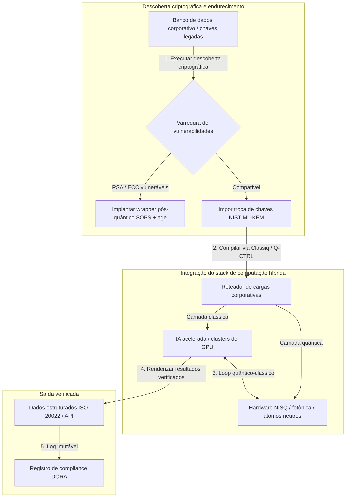

---

# Front Matter (YAML)

author: "contact@sebastienrousseau.com (Sebastien Rousseau)"
banner_alt: "Vista do palco do summit Economist Impact 5th Annual Commercialising Quantum Global 2026, em Londres — simbolizando a transição da tecnologia quântica da pesquisa em física para fluxos de trabalho prontos para a empresa"
banner_height: "1597"
banner_width: "2584"
banner: "https://cloudcdn.pro/stocks/images/sebastien-rousseau-20260617-5th-commercialising-quantum-2.webp"
cdn: "https://cloudcdn.pro"
charset: "UTF-8"
cname: "sebastienrousseau.com"
copyright: "© Copyright 2025 - 2026 - Sebastien Rousseau. All rights reserved."
date: "June 17, 2026"
description: "Conclusões para o conselho do summit Economist Impact 5th Annual Commercialising Quantum Global 2026 — surto de US$ 1,3 bi em funding, stacks híbridos sem arrependimento, urgência da migração para criptografia pós-quântica, comercialização de sensoriamento quântico e a diretiva do HSBC de que esperar é um erro não forçado."
format-detection: "telephone=no"
hreflang: "pt-br"
icon: "https://cloudcdn.pro/clients/sebastienrousseau/v1/logos/sebastienrousseau.svg"
id: "https://sebastienrousseau.com/2026-06-17-economist-commercialising-quantum-summit-2026"
image_alt: "Retrato em preto e branco de Sebastien Rousseau"
image_height: "162"
image_width: "162"
image: "https://cloudcdn.pro/stocks/images/sebastien-rousseau.png"
keywords: "Commercialising Quantum Global 2026, summit Economist Impact, criptografia pós-quântica, NIST ML-KEM, harvest-now decrypt-later, SNDL, HSBC quantum, Philip Intallura, sensoriamento quântico, navegação independente de GPS, NQCC, EU Quantum Act, Quantcore, prêmio qBIG, Lord Vallance, híbrido quântico-clássico, DORA Artigo 6"
language: "pt-BR"
last_reviewed: "2026-06-17"
layout: "report"
locale: "pt_BR"
logo_alt: "Logo de Sebastien Rousseau"
logo_height: "44"
logo_width: "44"
logo: "https://cloudcdn.pro/clients/sebastienrousseau/v1/logos/sebastienrousseau.svg"
menu: ""
measurementID: "G-169G4ET5HQ"
name: "Sebastien Rousseau"
permalink: "https://sebastienrousseau.com/2026-06-17-economist-commercialising-quantum-summit-2026"
rating: "general"
referrer: "no-referrer"
robots: "index, follow"
schema: "FAQPage, Article"
seo_title: "Commercialising Quantum 2026: conclusões para o conselho"
short_name: "sebastienrousseau"
subtitle: "A computação quântica deixou a ciência especulativa de laboratório e entrou em fluxos corporativos híbridos; o conselho precisa responder a US$ 1,3 bi em funding em 2026, à migração pós-quântica imediata e à diretiva do HSBC de parar de esperar."
tags: "quantum, criptografia pós-quântica, NIST ML-KEM, harvest-now decrypt-later, sensoriamento quântico, HSBC, Economist Impact, computação híbrida, DORA, EU Quantum Act, NQCC, conclusões do summit"
theme-color: "0, 83, 191"
title: "De qubits a lucros: conclusões estratégicas do 5º Annual Commercialising Quantum Global 2026 da Economist"
url: "https://sebastienrousseau.com/2026-06-17-economist-commercialising-quantum-summit-2026"
viewport: "width=device-width, initial-scale=1, shrink-to-fit=no"

# RSS - The RSS feed front matter (YAML).
atom_link: "https://sebastienrousseau.com/2026-06-17-economist-commercialising-quantum-summit-2026/rss.xml"
category: "Technology"
docs: https://validator.w3.org/feed/docs/rss2.html
generator: "Static Site Generator (SSG) (version 0.0.26)"
item_description: "Conclusões para o conselho do summit Economist Impact 5th Annual Commercialising Quantum Global 2026 — surto de US$ 1,3 bi em funding, stacks híbridos sem arrependimento, urgência da migração para criptografia pós-quântica, comercialização de sensoriamento quântico e a diretiva do HSBC de que esperar é um erro não forçado."
item_guid: "https://sebastienrousseau.com/2026-06-17-economist-commercialising-quantum-summit-2026/rss.xml"
item_link: "https://sebastienrousseau.com/2026-06-17-economist-commercialising-quantum-summit-2026/rss.xml"
item_pub_date: "Wed, 17 Jun 2026 06:06:06 +0000"
item_title: "De qubits a lucros: conclusões estratégicas do 5º Annual Commercialising Quantum Global 2026 da Economist"
last_build_date: "Wed, 17 Jun 2026 06:06:06 +0000"
managing_editor: "contact@sebastienrousseau.com (Sebastien Rousseau)"
pub_date: "Wed, 17 Jun 2026 06:06:06 +0000"
ttl: "60"
type: "article"
webmaster: "contact@sebastienrousseau.com"

# Apple - The Apple front matter (YAML).
apple_mobile_web_app_orientations: "portrait"
apple_touch_icon_sizes: "192x192"
apple-mobile-web-app-capable: "yes"
apple-mobile-web-app-status-bar-inset: "black"
apple-mobile-web-app-status-bar-style: "black-translucent"
apple-mobile-web-app-title: "Commercialising Quantum 2026: conclusões"
apple-touch-fullscreen: "yes"

# MS Application - The MS Application front matter (YAML).

msapplication-navbutton-color: "0, 83, 191"

# Twitter Card - The Twitter Card front matter (YAML).

twitter_card: "summary_large_image"
twitter_creator: "@wwdseb"
twitter_description: "Conclusões para o conselho do summit Economist Impact 5th Annual Commercialising Quantum Global 2026 — surto de US$ 1,3 bi em funding, stacks híbridos sem arrependimento, urgência da migração para criptografia pós-quântica, comercialização de sensoriamento quântico e a diretiva do HSBC de que esperar é um erro não forçado."
twitter_image: "https://cloudcdn.pro/clients/sebastienrousseau/v1/logos/sebastienrousseau.svg"
twitter_image_alt: "Logo de Sebastien Rousseau"
twitter_site: "@wwdseb"
twitter_title: "Commercialising Quantum 2026: conclusões para o conselho"
twitter_url: "https://sebastienrousseau.com/2026-06-17-economist-commercialising-quantum-summit-2026"

excerpt: "O summit Economist Impact 5th Annual Commercialising Quantum Global 2026 confirmou a virada da computação quântica para fluxos corporativos: US$ 1,3 bi captados em cinco meses, criptografia pós-quântica como questão fiduciária de conselho sob o ataque SNDL, sensoriamento quântico já em produção para navegação independente de GPS e a diretiva de Philip Intallura, do HSBC, de que esperar por hardware tolerante a falhas é um erro não forçado."

# Humans.txt - The Humans.txt front matter (YAML).
author_website: "https://sebastienrousseau.com"
author_twitter: "@wwdseb"
author_location: "London, UK"
thanks: "Obrigado pela leitura!"
site_last_updated: "2026-06-17"
site_standards: "HTML5, CSS3, RSS, Atom, JSON, XML, YAML, Markdown, TOML"
site_components: "Kaishi, Kaishi Builder, Kaishi CLI, Kaishi Templates, Kaishi Themes"
site_software: "Static Site Generator, Rust"

---

# De qubits a lucros: conclusões estratégicas do 5º Annual Commercialising Quantum Global 2026 da Economist

Maturidade corporativa, migrações de criptografia pós-quântica, stacks de computação híbrida e o cenário comercial emergente do sensoriamento e da rede quântica.

**TL;DR.** A 5ª edição do Commercialising Quantum Global 2026, sediada pela Economist Impact entre 16 e 17 de junho de 2026, no Business Design Centre, em Londres, reuniu mais de 1.100 lideranças globais de empresas, finanças, política pública e pesquisa. O tema central marcou uma virada estrutural clara: a tecnologia quântica saiu da ciência especulativa de laboratório e migrou para fluxos corporativos híbridos e práticos. Sustentada por US$ 1,3 bilhão em capital de risco captados apenas nos primeiros cinco meses de 2026, a discussão de conselho não trata mais de contar qubits físicos, mas de estabelecer stacks híbridos "sem arrependimento", proteger ativos digitais contra a ameaça criptográfica "harvest-now, decrypt-later" (SNDL) e implantar sistemas de sensoriamento quântico de curto prazo para navegação independente de GPS.

## Conclusões-chave

- **Virada corporativa para fluxos práticos.** Lideranças do setor ([Steve Suarez](https://www.linkedin.com/in/stevesuarez), da HorizonX, e [Phil Intallura](https://www.linkedin.com/in/intallura), do HSBC) reforçaram que a integração quântica deixou de ser problema de física e passou a ser problema operacional. Bancos e empresas estão implantando pilotos híbridos quântico-clássicos para preparar talento e otimizar cargas de trabalho ativas.
- **A criptografia pós-quântica (PQC) é prioridade de conselho.** Especialistas em segurança e jurídico (CMS UK, [Joanne Miller](https://www.linkedin.com/in/joanne-miller-nso), da Microsoft, e [Craig Farrell](https://www.linkedin.com/in/craig-farrell), da EY) alertaram que as organizações não podem esperar por hardware tolerante a falhas para implantar PQC. A coleta "harvest-now, decrypt-later" já ocorre hoje, tornando a migração para os padrões NIST ML-KEM uma questão fiduciária imediata.
- **O sensoriamento quântico lidera a rentabilidade de curto prazo.** Enquanto a computação tolerante a falhas ainda está a anos de distância, o sensoriamento quântico ([Matthew Kinsella](https://www.linkedin.com/in/matthewkinsella), da Infleqtion) escala rapidamente. Relógios quânticos e sensores inerciais já são implantados em navegação independente de GPS, segurança nacional e redes de energia ultraestáveis.
- **Soberania, clusters e urgência política.** O ministro britânico de Ciência, [Lord Vallance](https://www.linkedin.com/in/patrick-vallance), e [Lord William Hague](https://www.linkedin.com/in/williamhague) detalharam missões nacionais para converter pesquisa em "superclusters" industriais coordenados com o National Quantum Computing Centre (NQCC). O futuro EU Quantum Act reforça a corrida geopolítica por capacidade soberana de computação.
- **Quantcore vence o prêmio qBIG.** O spin-out da University of Glasgow Quantcore conquistou o prêmio IOP qBIG por seus componentes supercondutores à base de nióbio, que operam em temperaturas mais altas do que os materiais tradicionais, reduzindo significativamente o overhead de infraestrutura criogênica.

**Leituras relacionadas:** [KyberLib e a migração bancária pós-quântica em 2026: dos padrões ao código](https://sebastienrousseau.com/2026-06-12-kyberlib-post-quantum-banking-migration-standards-code-2026/), [O Índice de Resiliência Bancária em 2026: IA, nuvem, quântica, pagamentos e risco de concentração de terceiros](https://sebastienrousseau.com/2026-06-08-banking-resilience-index-ai-cloud-quantum-payments-third-party-risk-2026/), [O Índice Bancário Cloud Native em 2026: DORA, engenharia de plataforma, nuvem soberana e resiliência operacional](https://sebastienrousseau.com/2026-06-05-cloud-native-banking-index-dora-resilience-platform-engineering-2026/).

## 01. Por que o summit de 2026 importa para o conselho

A edição de 2026 do Commercialising Quantum Global, da Economist, marcou uma mudança permanente na forma como o mundo corporativo avalia deep tech.

Historicamente, a computação quântica ficou relegada às áreas de P&D, tratada como empreendimento científico de várias décadas. Em junho de 2026, essa visão está obsoleta. As organizações precisam migrar da curiosidade "centrada em física" para a implementação "centrada em negócio". A razão é dupla:

1. **A convergência quântica-IA.** Stacks de high-performance computing (HPC) estão fundindo IA clássica acelerada e nós NISQ (Noisy Intermediate-Scale Quantum) em uma única camada de computação unificada. Organizações que adiarem a construção de aplicações quantum-ready descobrirão que a janela para capturar vantagem estratégica está se fechando mais rápido do que o esperado.
2. **Urgência geopolítica e fiduciária.** Com o programa quântico britânico orientado por missões e o futuro EU Quantum Act, a capacidade quântica virou questão de soberania nacional e continuidade corporativa.

Além disso, a cibersegurança pós-quântica deixou de ser requisito futuro de compliance. A ameaça de ataques adversariais "store now, decrypt later" (SNDL) significa que dados corporativos interceptados hoje serão descriptografados quando sistemas quânticos comerciais escalarem, gerando responsabilidade imediata sob mandatos globais de resiliência operacional como o Digital Operational Resilience Act (DORA).

## 02. A lente estratégica Commercialising Quantum 2026

Líderes de tecnologia corporativa precisam mapear a maturidade quântica em cinco camadas operacionais distintas, avaliando horizontes de prazo e riscos de balanço.

### Tabela 1: a lente estratégica Commercialising Quantum 2026

| Camada | Foco corporativo | Prazo / horizonte | Principal risco corporativo |
| ---- | ---- | ---- | ---- |
| **Hardware e compilador** | Escolha entre abordagens concorrentes (supercondutores, íons aprisionados, átomos neutros, fotônica) | 3 – 5 anos (tolerância a falhas) | Travar-se em arquitetura sem saída ou apostar cedo demais em uma única plataforma. |
| **Endurecimento criptográfico** | Descoberta e inventário de dependências criptográficas; migração para NIST ML-KEM | Imediato (migração ativa) | Vazamentos sistêmicos de dados e falhas de compliance sob DORA e NIST CSF 2.0. |
| **Sensoriamento quântico** | Implantação de navegação independente de GPS, relógios ultraestáveis e gravímetros | 1 – 2 anos (comercial imediato) | Disrupção operacional de logística, navegação marítima e redes de energia por jamming de GPS. |
| **Integração de sistemas** | Conexão de hardware quântico aos data centres clássicos de HPC e supercomputação existentes | 1 – 3 anos (fase híbrida) | Alta latência, gargalos de transferência de dados e silos computacionais fragmentados. |
| **Software corporativo** | Exposição de algoritmos quânticos por camadas de abstração de alto nível e APIs (Classiq, Q-CTRL) | Imediato (formação de competências) | Isolamento de talento e fluxos de trabalho da execução real de engenharia. |

## 03. Sinais quânticos-chave e gatilhos de conselho

Líderes de tecnologia precisam monitorar métricas de mercado e regulatórias específicas e quantificáveis para orientar seus investimentos quânticos.

### Tabela 2: sinais quânticos-chave e gatilhos de conselho

| Sinal | Métrica quantitativa | Referência regulatória / política | Prioridade acionável de plataforma |
| ---- | ---- | ---- | ---- |
| **Surto de funding quântico** | US$ 1,3 bilhão captados globalmente nos primeiros cinco meses de 2026 | Return on Resilience (RoR) | Realocar orçamentos de pilotos especulativos para cargas híbridas quântico-clássicas "sem arrependimento". |
| **Exposição à descriptografia de dados** | 100% dos dados criptografados transmitidos em canais públicos expostos à coleta SNDL | DORA Artigo 6 (segurança ICT) | Implementar ferramentas de descoberta criptográfica para identificar chaves RSA/ECC vulneráveis em todo o parque. |
| **Infraestrutura soberana** | Alocação de £2,5 bilhões da UK National Quantum Strategy | UK Quantum Missions / Lord Vallance | Estabelecer parcerias locais com superclusters nacionais como o NQCC. |
| **Prazos de compliance** | Corte para endereços estruturados do SWIFT em 14 de novembro de 2026 | Diretiva SWIFT SR 2026 | Limpar e formatar bases interbancárias para atender às especificações XML estruturadas. |

## 04. Mergulho nos temas centrais do summit

### A computação quântica atinge ponto de inflexão de investimento

O funding de venture capital acelerou significativamente, captando **US$ 1,3 bilhão** apenas nos primeiros cinco meses de 2026. Diferentemente dos ciclos especulativos de hype dos anos anteriores, a onda atual de capital está sustentada por cargas reais e de curto prazo. Palestrantes da Classiq e da IBM Quantum Platform demonstraram como camadas de abstração de software e compiladores automatizados permitem que equipes de desenvolvedores não especialistas executem algoritmos híbridos quântico-clássicos sobre a infraestrutura clássica de hoje. Essa estratégia "sem arrependimento" permite que as organizações formem talento quantum-ready e fluxos de trabalho imediatamente.

### Alertas jurídicos e regulatórios sobre "harvest now, decrypt later"

Parceiros jurídicos e executivos de cibersegurança provocaram forte engajamento sobre a imediatez do risco de dados. Representantes do escritório patrocinador CMS UK e da CSO da Microsoft [Joanne Miller](https://www.linkedin.com/in/joanne-miller-nso) entregaram um alerta direto à alta gestão: *esperar a chegada de hardware tolerante a falhas antes de implantar criptografia pós-quântica é uma falha fiduciária crítica.*

Sob o paradigma "store now, decrypt later" (SNDL), atores hostis estão coletando ativamente dados corporativos criptografados hoje, com a intenção de descriptografá-los assim que surgirem computadores quânticos criptograficamente relevantes. As organizações precisam implantar proteções pós-quânticas (como NIST ML-KEM) imediatamente para proteger conjuntos de dados sensíveis de longa duração, propriedade intelectual e registros históricos de clientes.

### O realinhamento de hype do "sensoriamento quântico"

Enquanto a computação quântica tolerante a falhas ainda está a anos de distância, o summit destacou o sensoriamento quântico como a primeira onda realmente lucrativa de implantação no mundo real. O Chief Executive [Matthew Kinsella](https://www.linkedin.com/in/matthewkinsella), da Infleqtion, detalhou como relógios quânticos, sensores inerciais e sistemas de radiofrequência escalam rapidamente em múltiplas indústrias.

Como essas tecnologias medem constantes físicas com precisão subatômica, elas viabilizam **navegação independente de GPS**, redes de energia ultraestáveis e telecomunicações de espaço profundo. Tais aplicações são altamente relevantes para aviação, transporte marítimo e sistemas de defesa nacional diante das crescentes ameaças de jamming de GPS.

### Ecossistema e colaboração de cluster

O ecossistema quântico britânico aproveitou o summit londrino para mostrar superclusters domésticos de inovação. Atualizações ao vivo do National Quantum Computing Centre (NQCC) e do Digital Catapult detalharam como spin-outs deep-tech em estágio inicial podem cruzar o "divisor tecnológico" integrando hardware quântico diretamente em data centres clássicos de supercomputação.

[Wridhdhisom Karar](https://www.linkedin.com/in/wridhdhisomkarar), cofundador da startup quântica escocesa Quantcore, recebeu o prestigioso prêmio Quantum Business Innovation and Growth (qBIG) do Institute of Physics (IOP) pelos componentes supercondutores à base de nióbio da empresa. Esses componentes operam em temperaturas mais altas do que os materiais tradicionais, reduzindo significativamente o overhead de infraestrutura criogênica exigido para escalar processadores quânticos.

### O caso HSBC: por que esperar pela computação quântica é um "erro não forçado"

As contribuições de [**Philip Intallura, Ph.D.**](https://www.linkedin.com/in/intallura) (Global Head of Quantum Technologies do HSBC, conselheiro do governo britânico e Board Advisor) no 5º Annual Commercialising Quantum Event (2026) da Economist entregaram uma diretiva contundente ao conselho: *"Esperar pela computação quântica tolerante a falhas antes de começar é um erro não forçado."*

Dr. Intallura argumentou que a postura comum de "esperar para ver", adotada por instituições financeiras, é um gol contra construído sobre três premissas equivocadas:

- **O ROI de curto prazo é real.** Em testes empíricos, o HSBC superou modelos atualmente em produção, conectou trabalho quântico a outras áreas do negócio, usou a computação quântica para aprofundar relacionamentos com alguns de seus maiores clientes e atraiu novos negócios relevantes para o **HSBC Innovation Banking**.
- **A curva de adoção da computação quântica é íngreme.** Construir capacidade, definir estratégia, garantir orçamento e rodar ciclos de experimentação dentro de uma organização altamente regulada não é tarefa curta. Os processos precisam ser sistematicamente testados e adaptados à tecnologia.
- **A computação quântica é um ecossistema.** Nenhum player chega lá sozinho. Cada artigo de pesquisa, POC e piloto que o HSBC executou foi feito em colaboração estreita com um provedor quântico — e, em alguns casos, a colaboração se estende à academia, aos reguladores e ao governo.

**Diretiva de fechamento para o conselho:** *"A capacidade de que você vai precisar no primeiro dia da tolerância a falhas é a capacidade que você constrói agora."*

## 05. Pipeline corporativo de integração quântica e criptografia

Para proteger ativos digitais enquanto constrói prontidão quântica, a empresa precisa estabelecer um pipeline de integração claro.

## 06. O manual do conselho: imperativos acionáveis

Para traduzir as conclusões do Commercialising Quantum Global 2026 em valor de negócio imediato, a alta gestão deve executar o seguinte manual de conselho em quatro passos:

1. **Determinar a descoberta criptográfica.** Encarregar o Chief Information Security Officer (CISO) de catalogar todos os ativos criptográficos, mapeando cada chave RSA e ECC legada da empresa para preparar a migração pós-quântica.
2. **Implantar uma estratégia híbrida "sem arrependimento".** Não espere pelo hardware perfeito. Invista em software de inspiração quântica e em pilotos híbridos clássico-quânticos para formar talento interno e otimizar logística complexa ou carteiras de risco já hoje.
3. **Avaliar sensoriamento quântico para logística.** Se sua organização depende de cadeias de suprimento globais, navegação marítima ou infraestrutura crítica, avalie ativamente sistemas de sensoriamento quântico (como navegação independente de GPS) para mitigar riscos de disrupção geopolítica.
4. **Inscreva-se na Insight Hour de 30 de junho.** Garanta que seus líderes de tecnologia se inscrevam na **Commercialising Quantum Global Insight Hour** virtual em 30 de junho de 2026, às 15h BST (com apoio da IonQ), para continuar acompanhando estratégias de gestão de risco corporativo e alocação de talento.

## 07. Perguntas frequentes

**O que é "harvest now, decrypt later" (SNDL) e por que importa hoje?**
SNDL é a prática de interceptar e armazenar dados criptografados hoje, com a intenção de descriptografá-los mais tarde, quando computadores quânticos criptograficamente relevantes estiverem disponíveis. Conjuntos sensíveis de dados de longa duração — propriedade intelectual, registros de clientes, comunicações governamentais — já são alvo. Migrar para o NIST ML-KEM é uma decisão fiduciária que o conselho não pode adiar.

**Por que o sensoriamento quântico é a primeira onda comercial em vez da computação?**
Sensores quânticos medem constantes físicas com precisão subatômica e não exigem o hardware tolerante a falhas necessário à computação quântica. Relógios quânticos, gravímetros e sensores inerciais já estão em implantação piloto para navegação independente de GPS, redes de energia ultraestáveis e comunicações de espaço profundo.

**O trabalho quântico do HSBC é apenas P&D ou entregou retornos mensuráveis?**
Segundo Philip Intallura no summit, o HSBC superou modelos atualmente em produção, usou a computação quântica para aprofundar relacionamentos com seus maiores clientes e atraiu novos negócios relevantes para o HSBC Innovation Banking. O trabalho avançou da pesquisa para a integração operacional.

## 08. Referências

- **Economist Impact, (2026).** *5th Annual Commercialising Quantum Global 2026.* Anais ao vivo da conferência, 16–17 de junho de 2026. Londres: Business Design Centre. Disponível em: [Economist Impact](https://events.economist.com/commercialising-quantum/).
- **National Institute of Standards and Technology (NIST), (2024).** *First Three Finalized Post-Quantum Encryption Standards (FIPS 203, 204 e 205).* Gaithersburg: U.S. Department of Commerce. Disponível em: [NIST Standards](https://www.nist.gov/news-events/news/2024/08/nist-releases-first-3-finalized-post-quantum-encryption-standards).
- **Parlamento Europeu e Conselho da União Europeia, (2022).** *Regulamento (UE) 2022/2554 sobre resiliência operacional digital no setor financeiro (DORA).* Bruxelas: Jornal Oficial da União Europeia. Disponível em: [Regulamento DORA](https://eur-lex.europa.eu/legal-content/EN/TXT/?uri=CELEX%3A32022R2554).
- **SWIFT, (2024).** *Marco de endereço estruturado ISO 20022 de novembro de 2026.* La Hulpe: SWIFT. Disponível em: [marco SWIFT ISO 20022](https://www.swift.com/standards/iso-20022/iso-20022-bytes/call-action-november-2026).
