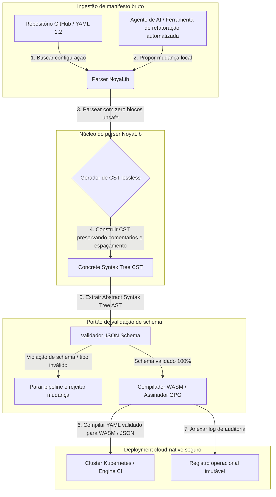

---

# Front Matter (YAML)

author: "contact@sebastienrousseau.com (Sebastien Rousseau)"
banner_alt: "Geometria arquitetônica sob iluminação dramática — simbolizando o papel da NoyaLib como parser YAML em Rust seguro e estrutural sob CI, Kubernetes, MCP e a configuração de serviços financeiros"
banner_height: "1597"
banner_width: "2584"
banner: "https://cloudcdn.pro/stocks/images/ken-cheung-KonWFWUaAuk.webp"
cdn: "https://cloudcdn.pro"
charset: "UTF-8"
cname: "sebastienrousseau.com"
copyright: "© Copyright 2025 - 2026 - Sebastien Rousseau. All rights reserved."
date: "June 18, 2026"
description: "NoyaLib, parser YAML 1.2 em Rust com zero unsafe, conformidade 406/406, validação JSON Schema, CST lossless e bindings MCP/WASM para infraestrutura financeira."
format-detection: "telephone=no"
hreflang: "pt-br"
icon: "https://cloudcdn.pro/clients/sebastienrousseau/v1/logos/sebastienrousseau.svg"
id: "https://sebastienrousseau.com/2026-06-18-noyalib-safe-yaml-rust-ai-mcp-financial-infrastructure-2026"
image_alt: "Retrato em preto e branco de Sebastien Rousseau"
image_height: "162"
image_width: "162"
image: "https://cloudcdn.pro/stocks/images/sebastien-rousseau.png"
keywords: "parser YAML seguro em Rust, NoyaLib, conformidade YAML 1.2, Rust zero unsafe, validação JSON Schema, Concrete Syntax Tree lossless, CST, MCP, Model Context Protocol, WebAssembly, manifestos Kubernetes, configuração CI/CD, DORA Artigo 5, BCBS 239, risco operacional Basel III, infraestrutura financeira, segurança de configuração, cadeia de suprimentos de software"
language: "pt-BR"
last_reviewed: "2026-06-18"
layout: "report"
locale: "pt_BR"
logo_alt: "Logo de Sebastien Rousseau"
logo_height: "44"
logo_width: "44"
logo: "https://cloudcdn.pro/clients/sebastienrousseau/v1/logos/sebastienrousseau.svg"
menu: ""
measurementID: "G-169G4ET5HQ"
name: "Sebastien Rousseau"
permalink: "https://sebastienrousseau.com/2026-06-18-noyalib-safe-yaml-rust-ai-mcp-financial-infrastructure-2026"
rating: "general"
referrer: "no-referrer"
robots: "index, follow"
schema: "FAQPage, Article"
seo_title: "Parser YAML em Rust seguro para AI, MCP e finanças"
short_name: "sebastienrousseau"
subtitle: "Um stack YAML em Rust mais seguro — NoyaLib — transforma YAML 1.2 de marcação de conveniência em plano de controle de configuração criptograficamente seguro, em conformidade com a especificação, para agentes de AI, MCP, Kubernetes e infraestrutura de serviços financeiros."
tags: "parser YAML seguro em Rust, NoyaLib, YAML 1.2, Rust zero unsafe, JSON Schema, MCP, WebAssembly, Kubernetes, DORA, BCBS 239, Basel III, infraestrutura financeira, segurança da cadeia de suprimentos"
theme-color: "0, 83, 191"
title: "Por que YAML precisa de um stack em Rust mais seguro para AI, MCP e infraestrutura financeira em 2026"
url: "https://sebastienrousseau.com/2026-06-18-noyalib-safe-yaml-rust-ai-mcp-financial-infrastructure-2026"
viewport: "width=device-width, initial-scale=1, shrink-to-fit=no"

# RSS - The RSS feed front matter (YAML).
atom_link: "https://sebastienrousseau.com/2026-06-18-noyalib-safe-yaml-rust-ai-mcp-financial-infrastructure-2026/rss.xml"
category: "Technology"
docs: https://validator.w3.org/feed/docs/rss2.html
generator: "Static Site Generator (SSG) (version 0.0.26)"
item_description: "NoyaLib, parser YAML 1.2 em Rust com zero unsafe, conformidade 406/406, validação JSON Schema, CST lossless e bindings MCP/WASM para infraestrutura financeira."
item_guid: "https://sebastienrousseau.com/2026-06-18-noyalib-safe-yaml-rust-ai-mcp-financial-infrastructure-2026/rss.xml"
item_link: "https://sebastienrousseau.com/2026-06-18-noyalib-safe-yaml-rust-ai-mcp-financial-infrastructure-2026/rss.xml"
item_pub_date: "Thu, 18 Jun 2026 06:06:06 +0000"
item_title: "Por que YAML precisa de um stack em Rust mais seguro para AI, MCP e infraestrutura financeira em 2026"
last_build_date: "Thu, 18 Jun 2026 06:06:06 +0000"
managing_editor: "contact@sebastienrousseau.com (Sebastien Rousseau)"
pub_date: "Thu, 18 Jun 2026 06:06:06 +0000"
ttl: "60"
type: "article"
webmaster: "contact@sebastienrousseau.com"

# Apple - The Apple front matter (YAML).
apple_mobile_web_app_orientations: "portrait"
apple_touch_icon_sizes: "192x192"
apple-mobile-web-app-capable: "yes"
apple-mobile-web-app-status-bar-inset: "black"
apple-mobile-web-app-status-bar-style: "black-translucent"
apple-mobile-web-app-title: "Parser YAML em Rust seguro para AI, MCP e finanças"
apple-touch-fullscreen: "yes"

# MS Application - The MS Application front matter (YAML).

msapplication-navbutton-color: "0, 83, 191"

# Twitter Card - The Twitter Card front matter (YAML).

twitter_card: "summary_large_image"
twitter_creator: "@wwdseb"
twitter_description: "NoyaLib, parser YAML 1.2 em Rust com zero unsafe, conformidade 406/406, validação JSON Schema, CST lossless e bindings MCP/WASM para infraestrutura financeira."
twitter_image: "https://cloudcdn.pro/clients/sebastienrousseau/v1/logos/sebastienrousseau.svg"
twitter_image_alt: "Logo de Sebastien Rousseau"
twitter_site: "@wwdseb"
twitter_title: "Parser YAML em Rust seguro para AI, MCP e finanças"
twitter_url: "https://sebastienrousseau.com/2026-06-18-noyalib-safe-yaml-rust-ai-mcp-financial-infrastructure-2026"

excerpt: "NoyaLib é um stack YAML em Rust mais seguro — zero blocos unsafe, conformidade 406/406 com YAML 1.2, Concrete Syntax Tree lossless, validação JSON Schema (Draft 2020-12) e bindings MCP/WASM — engenheirado para agentes de AI, Kubernetes, CI/CD e o plano de controle de configuração por trás da infraestrutura financeira."

# Humans.txt - The Humans.txt front matter (YAML).
author_website: "https://sebastienrousseau.com"
author_twitter: "@wwdseb"
author_location: "London, UK"
thanks: "Obrigado pela leitura!"
site_last_updated: "2026-06-18"
site_standards: "HTML5, CSS3, RSS, Atom, JSON, XML, YAML, Markdown, TOML"
site_components: "Kaishi, Kaishi Builder, Kaishi CLI, Kaishi Templates, Kaishi Themes"
site_software: "Static Site Generator, Rust"

---

# Por que YAML precisa de um stack em Rust mais seguro para AI, MCP e infraestrutura financeira em 2026

Um stack YAML em Rust mais seguro importa porque o YAML hoje carrega pipelines CI/CD, manifestos Kubernetes, regras do [Open Policy Agent](https://www.openpolicyagent.org/) e registros de ferramentas do Model Context Protocol (MCP) — e uma única leitura ambígua pode quebrar um sistema de compensação, configurar incorretamente um security group ou entregar a um agente de AI local as permissões erradas. A [NoyaLib](https://github.com/sebastienrousseau/noyalib) é um ecossistema puro em Rust, com zero unsafe, de parsing e validação [YAML 1.2](https://yaml.org/spec/1.2.2/) engenheirado para tornar essa infraestrutura segura por padrão.

## Resposta rápida

**O que é a NoyaLib em uma frase?** A NoyaLib é um ecossistema de parsing e validação YAML 1.2 puro em Rust, open-source, com zero código `unsafe`, conformidade de 100% com o conjunto oficial de 406 testes do YAML, Concrete Syntax Tree lossless e validação [JSON Schema](https://json-schema.org/) em tempo real — engenheirado para tornar segura por padrão a configuração de agentes de AI, MCP, Kubernetes e infraestrutura financeira.

## Sumário executivo

YAML parece humilde até que uma leitura ambígua ou violação de schema derrube um sistema de compensação de produção que move bilhões. Em 2026, YAML é o padrão de fato para pipelines [CI/CD](https://docs.github.com/en/actions/learn-github-actions/workflow-syntax-for-github-actions), manifestos [Kubernetes](https://kubernetes.io/docs/concepts/configuration/overview/), regras do [Open Policy Agent](https://www.openpolicyagent.org/) e registros de ferramentas do Model Context Protocol (MCP). Parsers legados opacos — com vulnerabilidades de memória e parsing destrutivo — são um risco de segurança inaceitável. A NoyaLib é um ecossistema YAML 1.2 puro em Rust, com zero unsafe: conformidade de 100% nos 406 testes oficiais, Concrete Syntax Tree (CST) lossless que preserva comentários e espaçamento, e validação JSON Schema embutida. O resultado é o YAML recolocado como plano de controle de configuração auditável, seguro e acessível por agentes.

## Conclusões-chave

- **Configuração é código de produção.** Um único arquivo YAML mal-formado pode configurar incorretamente security groups cloud-native ou permissões de agentes de AI. A NoyaLib trata YAML como infraestrutura crítica.
- **Design zero unsafe.** Construída inteiramente em Rust seguro, com zero blocos `unsafe`, a NoyaLib elimina vulnerabilidades de memória — buffer overflows, RCE — nas camadas centrais de parsing.
- **Conformidade absoluta 406/406.** Valida matematicamente as estruturas de configuração, eliminando discrepâncias de parsing e desvios estruturais entre staging e produção.
- **Concrete Syntax Tree lossless.** Diferentemente de parsers legados que descartam comentários e formatação, a NoyaLib preserva espaçamento e anotações, viabilizando refatoração automatizada segura, com round-trip, por agentes de AI.
- **Valor fiduciário em nível de conselho.** Conecta a integridade de configuração ao [DORA Artigo 5](https://eur-lex.europa.eu/legal-content/EN/TXT/?uri=CELEX%3A32022R2554) e às métricas de capital de risco operacional do [Basel III](https://www.bis.org/bcbs/publ/d424.htm), protegendo diretamente a alta gestão de responsabilidade pessoal.

**Leituras relacionadas:** [KyberLib e a migração bancária pós-quântica em 2026: dos padrões ao código](https://sebastienrousseau.com/2026-06-12-kyberlib-post-quantum-banking-migration-standards-code-2026/), [O Índice Bancário Cloud Native em 2026: DORA, engenharia de plataforma, nuvem soberana e resiliência operacional](https://sebastienrousseau.com/2026-06-05-cloud-native-banking-index-dora-resilience-platform-engineering-2026/), [Dotfiles AI-aware em 2026: construindo uma estação de trabalho de desenvolvedor segura e reproduzível para MCP, SLSA e paridade multi-shell](https://sebastienrousseau.com/2026-06-16-ai-aware-dotfiles-secure-reproducible-workstation-2026/).

## 01. Por que um stack YAML em Rust mais seguro importa em 2026

Em junho de 2026, as infraestruturas corporativas de TI estão altamente distribuídas e cada vez mais automatizadas.

YAML virou, silenciosamente, a linguagem de configuração estrutural de todo o stack de engenharia de software. Ele carrega os fluxos de integração contínua (CI) que compilam artefatos de produção, os manifestos [Kubernetes](https://kubernetes.io/docs/concepts/overview/) que orquestram clusters cloud-native globais e os schemas de servidor do [Model Context Protocol](https://modelcontextprotocol.io/) (MCP) que dão aos agentes de AI locais permissão para executar operações no host.

Parsers YAML legados — [PyYAML](https://pyyaml.org/), [yaml-cpp](https://github.com/jbeder/yaml-cpp), [libyaml](https://github.com/yaml/libyaml) — carregam dois riscos estruturais:

1. **Vulnerabilidades de coerção de tipo (o "problema Noruega").** Parsers legados coagem com frequência strings não-aspeadas (o código do país `NO` vira booleano `false`, `yes`/`no` idem) — veja a [tag booleana YAML 1.1 vs 1.2](https://yaml.org/type/bool.html) — provocando falhas críticas de sistema ou configurações incorretas silenciosas de segurança.
2. **Exploits de segurança de memória.** Parsers opacos escritos em C/C++ sofrem com exploits de memory leak e buffer overflow, que podem levar à execução remota de código (RCE) em servidores de build centrais.

A [NoyaLib](https://github.com/sebastienrousseau/noyalib) resolve esses desafios. É um ecossistema YAML 1.2 puro em Rust, com zero unsafe, de parsing e validação. Ao alcançar conformidade absoluta 406/406 e impor validação JSON Schema estrita diretamente no parse, a NoyaLib entrega alto **Return on Resilience (RoR)** — evitando downtime induzido por configuração e protegendo cadeias de suprimentos de software em nível financeiro.

## 02. A lente de arquitetura NoyaLib 2026

O ecossistema NoyaLib opera como um parser de configuração lossless e seguro. Cada manifesto local e de nuvem é estruturalmente validado e protegido na camada de execução mais baixa.

### Tabela 1: camadas de arquitetura da NoyaLib e mitigação de risco

| Camada | Decisão de design | Por que importa | Risco se mal-administrada |
| ---- | ---- | ---- | ---- |
| **Camada de parser** | Parser puro em Rust, conforme YAML 1.2, com zero blocos `unsafe` | Elimina vulnerabilidades de segurança de memória e buffer overflows na camada de execução mais baixa. | Execução remota de código (RCE) em servidores de build centrais. |
| **Camada de conformidade** | Conformidade de 100% nos 406/406 testes oficiais da suite YAML 1.2 | Elimina discrepâncias de parsing e desvios de coerção de tipo entre staging e produção. | Erros do "problema Noruega" desativando security groups. |
| **Camada de árvore sintática** | Concrete Syntax Tree (CST) lossless | Preserva comentários, espaçamento e ordenação durante parsing round-trip e refatoração programática. | Refatoração automatizada por AI destruindo anotações do desenvolvedor. |
| **Camada de validação** | Validação [JSON Schema (Draft 2020-12)](https://json-schema.org/draft/2020-12/release-notes) durante o parsing | Impõe modelos de dados estritos sobre arquivos de configuração antes que cheguem aos clusters de produção. | Arquivos de configuração mal-formados derrubando clusters cloud-native. |
| **Camada de interface** | Bindings WebAssembly (WASM) e MCP | Permite que a validação de configuração rode diretamente em navegadores, nós de edge e toolkits de agente locais. | Silos de tooling onde a validação não roda em dispositivos de edge. |

## 03. Sinais-chave de segurança de estação de trabalho e configuração

Para manter segurança absoluta em todo o parque de desenvolvimento e operações, Chief Information Security Officers (CISOs) precisam monitorar métricas específicas e quantificáveis.

### Tabela 2: sinais de segurança de estação de trabalho e configuração

| Sinal | Métrica / benchmark operacional | Referência NIST CSF / DORA | Implementação técnica de plataforma |
| ---- | ---- | ---- | ---- |
| **Conformidade do parser** | Taxa de aprovação de 100% na suite oficial de testes YAML 1.2 (406/406). | [DORA Artigo 6](https://eur-lex.europa.eu/legal-content/EN/TXT/?uri=CELEX%3A32022R2554) (segurança ICT) | Núcleo do parser NoyaLib validando todos os manifestos antes da execução de CI. |
| **Perfil de segurança de memória** | Zero blocos `unsafe` de Rust nas dependências de parser e serializador. | DORA Artigo 30 (cadeia de suprimentos) | Verificações automatizadas do compilador ([`forbid(unsafe_code)`](https://doc.rust-lang.org/reference/attributes/diagnostics.html#the-forbid-attribute)) em builds cargo. |
| **Validação de schema** | 100% dos arquivos de configuração parseados verificados contra modelos válidos de [JSON Schema](https://json-schema.org/). | [NIST CSF 2.0](https://www.nist.gov/cyberframework) (PR.DS-01) | Portão de validação em tempo real que interrompe pipelines de build em violações de schema. |
| **Drift de configuração** | Detecção e recuperação em tempo real de arquivos de configuração locais ao estado versionado em git. | Return on Resilience (RoR) | Telemetria contínua registrando todas as modificações de arquivos locais. |
| **Controle de acesso de agente** | Permissões limitadas e somente leitura para ferramentas de AI locais operando via configurações MCP. | Gestão de risco de modelo ([SR 11-7](https://www.federalreserve.gov/supervisionreg/srletters/sr1107.htm)) | Fronteiras de servidor MCP restringindo operações de agente a diretórios aprovados. |

## 04. A falácia do parsing opaco de configuração

Uma vulnerabilidade importante em operações cloud-native é o *parsing opaco* — usar parsers que descartam metadados estruturais (comentários, whitespace, ordenação de documento) ou coagem tipos silenciosamente durante a compilação. Esse comportamento introduz dois riscos severos de segurança:

1. **Refatoração destrutiva.** Quando um assistente de codificação por AI ou uma ferramenta de refatoração automatizada atualiza um manifesto de deployment, parsers tradicionais descartam comentários e formatação do desenvolvedor, destruindo o contexto necessário para revisões humanas e forense pós-incidente.
2. **Discrepâncias de parsing.** Se um ambiente de staging usa um parser baseado em Python e a produção roda um parser em C, pequenas diferenças na conformidade com a especificação YAML 1.2 podem fazer um manifesto válido em staging falhar ou se comportar diferente em produção, criando vulnerabilidades de segurança ocultas.

A **Concrete Syntax Tree (CST) lossless** da NoyaLib resolve isso. Ela preserva cada espaço, comentário e linha de documento durante o loop parse-e-serializa. Assistentes automatizados de AI conseguem editar, refatorar e commitar arquivos de configuração preservando 100% das anotações escritas por humanos — uma trilha de auditoria absoluta.

## 05. Projetando um pipeline de configuração de AI limitado

Para impedir que mudanças maliciosas de configuração cheguem a ambientes de produção, a organização precisa implementar um pipeline de configuração estritamente limitado e validado por schema.

O fluxo operacional abaixo mostra como a NoyaLib parseia YAML bruto, constrói uma CST lossless, valida o AST contra um modelo JSON Schema e compila bindings WebAssembly para ambientes de navegador ou edge.

## 06. O manual do conselho e a responsabilidade fiduciária

Segurança de configuração e integridade da cadeia de suprimentos de software são prioridades críticas de conselho. A alta gestão precisa abordar a gestão de configuração pela lente do dever fiduciário e da resiliência operacional.

- **DORA Artigo 5 (responsabilidade do conselho).** Determina que o conselho carrega responsabilidade última e indelegável pela gestão do risco ICT da instituição. Como arquivos de configuração controlam security groups cloud-native críticos e rotas de pagamento, os conselhos precisam verificar que os sistemas que parseiam esses manifestos são memory-safe e totalmente conformes à especificação, para atender a auditorias regulatórias. ([Regulamento (UE) 2022/2554](https://eur-lex.europa.eu/legal-content/EN/TXT/?uri=CELEX%3A32022R2554))
- **BCBS 239 (agregação e reporte de dados de risco).** Exige que o reporte de risco e as métricas de infraestrutura sejam precisos, completos e gerados sob controles estritos de qualidade de dados. A NoyaLib apoia o BCBS 239 ao parsear e validar arquivos de configuração contra schemas estritos na origem, evitando vazamentos silenciosos de dados ou paradas induzidas por configuração incorreta. ([Padrão BCBS 239](https://www.bis.org/publ/bcbs239.htm))
- **Mitigação dos encargos de capital de risco operacional (Basel III).** Paradas induzidas por configuração inflam diretamente os encargos de capital de risco operacional sob o Basel III, prendendo capital de balanço. Padronizar o stack corporativo de configuração em um parser puro em Rust e seguro como a NoyaLib minimiza esse risco, preservando capital e protegendo a confiança do cliente. ([Padrões Basel III](https://www.bis.org/bcbs/publ/d424.htm))

## 07. O que isso significa por tipo de banco

### Bancos globalmente sistêmicos (G-SIBs)

Os G-SIBs gerenciam milhares de microsserviços e pipelines de deployment em múltiplas jurisdições. Seu principal desafio é manter consistência de configuração e impedir drift de segurança em parques cloud-native enormes. Padronizar em um stack YAML em Rust mais seguro como a NoyaLib garante que todos os manifestos Kubernetes, pipelines CI/CD e políticas de segurança sejam parseados e validados sob um framework uniforme e memory-safe — eliminando o risco de configurações "snowflake" não auditadas.

### Bancos de transação e corporate

Bancos de transação operam gateways de pagamento sensíveis e infraestruturas de compensação atacadista. Provar a segurança absoluta do código e configuração implantados nesses ambientes de produção é demanda regulatória inegociável. Integrar a NoyaLib garante que a cadeia de suprimentos de software seja totalmente auditada, lossless e protegida contra vulnerabilidades de parsing — um controle que mapeia diretamente para o DORA Artigo 6 e a seção 6 do [PCI DSS v4.0](https://www.pcisecuritystandards.org/document_library/).

### Bancos regionais e menores

Bancos regionais precisam manter altos padrões de cibersegurança sem os orçamentos de tecnologia em escala G-SIB. O framework open-source NoyaLib oferece uma solução leve, custo-efetiva e altamente segura, compatível com Rust, permitindo que instituições menores implementem segurança de configuração e proteção de cadeia de suprimentos em nível corporativo sem taxas proprietárias de licenciamento.

## 08. Conclusão: o roadmap de segurança de configuração

A estação de trabalho do desenvolvedor e as configurações de infraestrutura cloud-native são planos de controle críticos na cadeia de suprimentos de software. Permitir que arquivos de configuração não auditados, ambíguos ou inseguros cheguem aos ativos corporativos é um risco operacional e regulatório inaceitável.

Para proteger a cadeia de suprimentos de software e blindar endpoints contra vulnerabilidades de configuração, gestores seniores de tecnologia e segurança devem executar um roadmap claro de desenvolvimento hoje:

1. **Mandate configuração declarativa.** Elimine ajustes manuais e não auditados de configuração e exija que todos os manifestos sejam geridos como sistema de registro declarativo e versionado.
2. **Imponha validação de schema.** Aplique pre-commit hooks estritos e utilitários de scanning para garantir que todos os arquivos de configuração sejam validados contra modelos JSON Schema válidos antes do deployment.
3. **Implemente round-tripping lossless.** Garanta que todos os assistentes automatizados de AI e ferramentas de refatoração usem parsing lossless para preservar comentários, espaçamento e contexto do desenvolvedor.
4. **Proteja a cadeia de suprimentos.** Garanta que todas as configurações e utilitários de parsing sejam verificados criptograficamente usando bibliotecas puras em Rust, com zero unsafe, como a NoyaLib, antes da execução. ([Framework SLSA](https://slsa.dev/))

## 09. Perguntas frequentes

**O que é a NoyaLib e por que é usada para parsing YAML?**
A NoyaLib é um parser YAML 1.2 open-source, puro em Rust e com zero unsafe. Ela atinge conformidade de 100% na suite oficial de 406 testes, impõe validação [JSON Schema](https://json-schema.org/) estrita durante o parsing e expõe bindings WASM e [MCP](https://modelcontextprotocol.io/) — tornando-se um stack YAML em Rust mais seguro para agentes de AI, Kubernetes e infraestrutura financeira.

**Por que o design zero unsafe importa para o parsing de configuração?**
Vulnerabilidades de segurança de memória — buffer overflows, use-after-free — em parsers legados escritos em C/C++ podem levar à execução remota de código em servidores de build centrais. O design puro em Rust da NoyaLib com [`#![forbid(unsafe_code)]`](https://doc.rust-lang.org/reference/attributes/diagnostics.html#the-forbid-attribute) elimina matematicamente essas vulnerabilidades em tempo de compilação.

**O que é uma Concrete Syntax Tree (CST) lossless e por que isso importa?**
Parsers tradicionais descartam comentários e formatação, tornando destrutivas as edições automatizadas por agentes de AI. A Concrete Syntax Tree lossless da NoyaLib preserva cada comentário, espaço e linha de documento — para que assistentes de AI possam editar e refatorar arquivos de configuração com segurança, mantendo intactos o contexto do desenvolvedor, a forense pós-incidente e a trilha de auditoria.

**Como a NoyaLib mapeia para DORA, BCBS 239 e Basel III?**
O DORA Artigo 5 coloca a responsabilidade pelo risco ICT no conselho; o BCBS 239 exige controles de qualidade de dados no reporte de risco; o Basel III taxa capital de risco operacional. A NoyaLib fornece a camada de parse memory-safe e validada por schema que essas regulações exigem para configuração como código — tornando o mapeamento regulatório direto e menor o encargo de capital de risco operacional.

## 10. Referências

- **YAML, (2026).** *Especificação YAML 1.2*. Disponível em: [Especificação YAML 1.2](https://yaml.org/spec/1.2.2/).
- **JSON Schema, (2026).** *Notas de release do JSON Schema Draft 2020-12*. Disponível em: [JSON Schema Draft 2020-12](https://json-schema.org/draft/2020-12/release-notes).
- **Parlamento Europeu e Conselho da União Europeia, (2022).** *Regulamento (UE) 2022/2554 sobre resiliência operacional digital no setor financeiro (DORA)*. Bruxelas: Jornal Oficial da União Europeia. Disponível em: [Regulamento DORA](https://eur-lex.europa.eu/legal-content/EN/TXT/?uri=CELEX%3A32022R2554).
- **Basel Committee on Banking Supervision, (2013).** *Principles for effective risk data aggregation and risk reporting (BCBS 239)*. Basel: Bank for International Settlements. Disponível em: [Padrão BCBS 239](https://www.bis.org/publ/bcbs239.htm).
- **Basel Committee on Banking Supervision, (2017).** *Basel III: finalising post-crisis reforms*. Basel: Bank for International Settlements. Disponível em: [Padrões Basel III](https://www.bis.org/bcbs/publ/d424.htm).
- **Anthropic, (2025).** *Especificação do Model Context Protocol (MCP)*. Disponível em: [Model Context Protocol](https://modelcontextprotocol.io/).
- **GitHub, (2026).** *Repositório open-source noyalib*. Disponível em: [Repositório NoyaLib](https://github.com/sebastienrousseau/noyalib).
