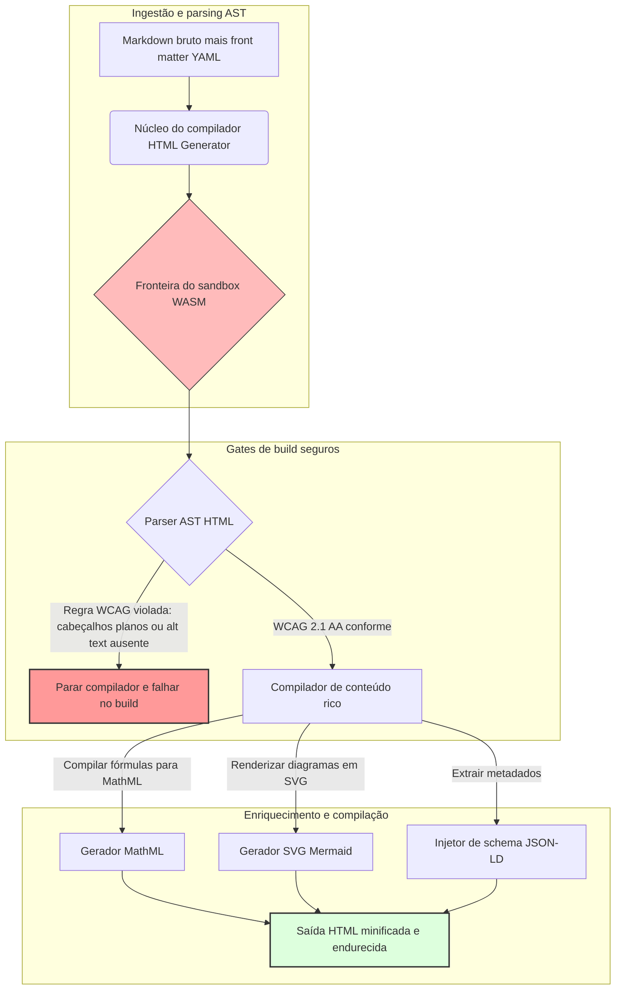

---

# Front Matter (YAML)

author: "contact@sebastienrousseau.com (Sebastien Rousseau)"
banner_alt: "Geometria arquitetônica sob luz estruturada — simbolizando o papel do HTML Generator como pipeline Markdown-para-HTML com controle em tempo de compilação para infraestrutura de publicação acessível, otimizada para SEO e com sandbox"
banner_height: "1597"
banner_width: "2584"
banner: "https://cloudcdn.pro/api/transform?url=/stocks/images/markus-winkler-IrRbSND5EUc-unsplash.webp&w=1200&format=webp&q=80"
cdn: "https://cloudcdn.pro"
charset: "UTF-8"
cname: "sebastienrousseau.com"
copyright: "© Copyright 2025 - 2026 - Sebastien Rousseau. All rights reserved."
date: "June 20, 2026"
description: "HTML Generator é uma biblioteca Rust que transforma Markdown em HTML acessível conforme WCAG, otimizado para SEO e enriquecido com JSON-LD — acessibilidade como código, suporte a MathML e Mermaid, e execução em sandbox WebAssembly para publicação corporativa segura."
format-detection: "telephone=no"
hreflang: "pt-br"
icon: "https://cloudcdn.pro/clients/sebastienrousseau/v1/logos/sebastienrousseau.svg"
id: "https://sebastienrousseau.com/2026-06-20-html-generator-accessible-seo-structured-markdown-rust-2026"
image_alt: "Retrato em preto e branco de Sebastien Rousseau"
image_height: "162"
image_width: "162"
image: "https://cloudcdn.pro/stocks/images/sebastien-rousseau.png"
keywords: "html-generator, Rust Markdown para HTML, acessibilidade como código, WCAG 2.1 AA, HTML otimizado para SEO, JSON-LD, MathML, Mermaid, WebAssembly, EAA, DORA, ADA Title III, publicação acessível, parsing em sandbox, código aberto"
language: "pt-BR"
last_reviewed: "2026-06-20"
layout: "report"
locale: "pt_BR"
logo_alt: "Logotipo de Sebastien Rousseau"
logo_height: "44"
logo_width: "44"
logo: "https://cloudcdn.pro/clients/sebastienrousseau/v1/logos/sebastienrousseau.svg"
menu: ""
measurementID: "G-169G4ET5HQ"
name: "Sebastien Rousseau"
permalink: "https://sebastienrousseau.com/2026-06-20-html-generator-accessible-seo-structured-markdown-rust-2026"
rating: "general"
referrer: "no-referrer"
robots: "index, follow"
schema: "FAQPage, Article"
seo_title: "Acessibilidade como Código: Markdown para HTML AAA com Rust em 2026"
short_name: "sebastienrousseau"
subtitle: "Transformando a publicação web corporativa, documentação de produtos e portais de clientes de arquivos de texto inacessíveis em ativos digitais altamente estruturados, conformes e com sandbox."
tags: "html-generator, Rust, Markdown, acessibilidade, WCAG, SEO, JSON-LD, MathML, Mermaid, WebAssembly, EAA, DORA, ADA, descoberta por IA, RAG, código aberto, infraestrutura bancária"
theme-color: "0, 83, 191"
title: "Transformando Markdown em HTML Acessível, Otimizado para SEO e Estruturado com Rust em 2026"
url: "https://sebastienrousseau.com/2026-06-20-html-generator-accessible-seo-structured-markdown-rust-2026"
viewport: "width=device-width, initial-scale=1, shrink-to-fit=no"

# RSS - The RSS feed front matter (YAML).
atom_link: "https://sebastienrousseau.com/2026-06-20-html-generator-accessible-seo-structured-markdown-rust-2026/rss.xml"
category: "Technology"
docs: https://validator.w3.org/feed/docs/rss2.html
generator: "Static Site Generator (SSG) (version 0.0.40)"
item_description: "HTML Generator é uma biblioteca Rust que transforma Markdown em HTML acessível conforme WCAG, otimizado para SEO e enriquecido com JSON-LD — acessibilidade como código, suporte a MathML e Mermaid, e execução em sandbox WebAssembly para publicação corporativa segura."
item_guid: "https://sebastienrousseau.com/2026-06-20-html-generator-accessible-seo-structured-markdown-rust-2026/rss.xml"
item_link: "https://sebastienrousseau.com/2026-06-20-html-generator-accessible-seo-structured-markdown-rust-2026/rss.xml"
item_pub_date: "Sat, 20 Jun 2026 06:06:06 +0000"
item_title: "Transformando Markdown em HTML Acessível, Otimizado para SEO e Estruturado com Rust em 2026"
last_build_date: "Sat, 20 Jun 2026 06:06:06 +0000"
managing_editor: "contact@sebastienrousseau.com (Sebastien Rousseau)"
pub_date: "Sat, 20 Jun 2026 06:06:06 +0000"
ttl: "60"
type: "article"
webmaster: "contact@sebastienrousseau.com"

# Apple - The Apple front matter (YAML).
apple_mobile_web_app_orientations: "portrait"
apple_touch_icon_sizes: "192x192"
apple-mobile-web-app-capable: "yes"
apple-mobile-web-app-status-bar-inset: "black"
apple-mobile-web-app-status-bar-style: "black-translucent"
apple-mobile-web-app-title: "Markdown para HTML AAA com Rust"
apple-touch-fullscreen: "yes"

# MS Application - The MS Application front matter (YAML).

msapplication-navbutton-color: "0, 83, 191"

# Twitter Card - The Twitter Card front matter (YAML).

twitter_card: "summary_large_image"
twitter_creator: "@wwdseb"
twitter_description: "HTML Generator é uma biblioteca Rust que transforma Markdown em HTML acessível conforme WCAG, otimizado para SEO e enriquecido com JSON-LD — acessibilidade como código, suporte a MathML e Mermaid, e execução em sandbox WebAssembly para publicação corporativa segura."
twitter_image: "https://cloudcdn.pro/clients/sebastienrousseau/v1/logos/sebastienrousseau.svg"
twitter_image_alt: "Logotipo de Sebastien Rousseau"
twitter_site: "@wwdseb"
twitter_title: "Acessibilidade como Código: Markdown para HTML AAA com Rust"
twitter_url: "https://sebastienrousseau.com/2026-06-20-html-generator-accessible-seo-structured-markdown-rust-2026"

# Humans.txt - The Humans.txt front matter (YAML).
author_website: "https://sebastienrousseau.com"
author_twitter: "@wwdseb"
author_location: "London, UK"
thanks: "Obrigado pela leitura!"
site_last_updated: "2026-06-20"
site_standards: "HTML5, CSS3, RSS, Atom, JSON, XML, YAML, Markdown, TOML"
site_components: "Kaishi, Kaishi Builder, Kaishi CLI, Kaishi Templates, Kaishi Themes"
site_software: "Static Site Generator, Rust"

---

# Transformando Markdown em HTML Acessível, Otimizado para SEO e Estruturado com Rust em 2026

<!-- lead-start -->
<aside class="post-lead" aria-label="Resumo do artigo">

<strong>TL;DR.</strong> HTML Generator é um compilador Markdown-para-HTML em Rust puro que impõe WCAG 2.1 AA em tempo de compilação, injeta JSON-LD conforme Schema.org, renderiza MathML e SVG Mermaid nativamente, e isola o parsing dentro de um sandbox WebAssembly — transformando a publicação em um plano de controle com gate de compilação para acessibilidade, SEO e segurança de TIC.

<strong>Principais conclusões</strong>

<ul class="post-lead-takeaways">
  <li><strong>Resposta direta.</strong> O que é o HTML Generator em uma frase?</li>
  <li><strong>Sumário executivo.</strong> Renderizar Markdown parece trivial; produzir HTML de qualidade para publicação é um problema de conformidade.</li>
  <li><strong>01. Por que um compilador HTML com acessibilidade em primeiro lugar importa em 2026.</strong> A EAA e ADA Title III converteram acessibilidade de higiene de engenharia em responsabilidade fiduciária.</li>
  <li><strong>02. A arquitetura do HTML Generator em 2026.</strong> Um pipeline de compilação em múltiplos estágios, do Markdown bruto ao HTML endurecido.</li>
</ul>

<strong>Leitura relacionada:</strong> <a href="https://sebastienrousseau.com/2026-06-18-noyalib-safe-yaml-rust-ai-mcp-financial-infrastructure-2026">Por que o YAML Precisa de uma Stack Rust mais Segura para IA, MCP e Infraestrutura Financeira em 2026</a>, <a href="https://sebastienrousseau.com/2026-06-17-static-site-generator-secure-default-ai-era-publishing-2026">Um Static Site Generator Seguro por Padrão para Publicação na Era da IA em 2026</a>, <a href="https://sebastienrousseau.com/2026-06-11-cloudcdn-open-source-blueprint-ai-native-edge-2026">CloudCDN: Um Blueprint Open Source para o Edge cloud-native com IA em 2026</a>.

</aside>
<!-- lead-end -->

Em 2026, o conteúdo web é consumido tanto por crawlers de busca com IA, mecanismos de busca baseados em LLM e pipelines de Retrieval-Augmented Generation (RAG) quanto por leitores humanos. HTML plano ou malformado compromete a descoberta por máquinas, enquanto o não cumprimento de regulamentações globais rigorosas como o [Ato Europeu de Acessibilidade (EAA)](https://www.accessibility-act.eu/) e o [ADA Title III dos EUA](https://www.ada.gov/topics/title-iii/) é hoje uma responsabilidade civil inequívoca. O [HTML Generator](https://github.com/sebastienrousseau/html-generator) é uma biblioteca Rust de alto desempenho projetada para fechar essas lacunas — no compilador, não em correções pós-implantação.

## Resposta direta

**O que é o HTML Generator em uma frase?** HTML Generator é um compilador open source Markdown-para-HTML em Rust puro que impõe [WCAG 2.1 AA](https://www.w3.org/TR/WCAG21/) em tempo de compilação, gera marcos semânticos e atributos ARIA automaticamente, injeta metadados [JSON-LD](https://json-ld.org/) conformes ao Schema.org a partir do front matter YAML, renderiza diagramas Mermaid e fórmulas matemáticas em SVG acessível e MathML, e executa dentro de um sandbox [WebAssembly](https://webassembly.org/) — transformando a publicação corporativa em um plano de controle com gate de compilação, de nível fiduciário.

## Sumário executivo

Renderizar Markdown parece trivial. HTML de qualidade para publicação é um problema de conformidade. Em junho de 2026, cada ponto de contato corporativo — portais de relações com investidores, arquivamentos regulatórios, documentação de clientes, referências de API, ativos de marketing — é processado por humanos e máquinas. Duas pressões colidem em cada página: [EAA](https://www.accessibility-act.eu/) e [ADA Title III](https://www.ada.gov/topics/title-iii/) tornam acessibilidade uma exposição legal de nível de conselho, enquanto a ingestão por IA e pipelines RAG recompensam saídas estruturadas e legíveis por máquinas. Bibliotecas Markdown padrão produzem HTML plano que falha nos dois requisitos. O HTML Generator trata a geração de documentos como um pipeline com gate de compilação: a validação WCAG é um erro de build, JSON-LD vem do front matter YAML sem marcação manual, MathML e Mermaid renderizam de forma acessível, e todo o motor é entregue como alvo WebAssembly para que o parsing de documentos não confiáveis permaneça isolado do host.

## Principais conclusões

- **Acessibilidade como código é o novo padrão.** A EAA exige acessibilidade para serviços digitais ao consumidor. O HTML Generator avalia a árvore do documento em tempo de compilação, gerando marcos semânticos e atributos ARIA automaticamente — menos correções pós-implantação, menos orçamentos de remediação, nenhum alt-text ausente chegando à produção.
- **Dados estruturados para descoberta por IA.** Busca moderna e RAG dependem de metadados legíveis por máquinas. O compilador analisa o front matter YAML e injeta [JSON-LD conforme Schema.org](https://schema.org/) diretamente no cabeçalho do documento, tornando o conteúdo totalmente interpretável por [Google Rich Results](https://developers.google.com/search/docs/appearance/structured-data/intro-structured-data), [Bing Webmaster](https://www.bing.com/webmasters) e crawlers baseados em LLM.
- **Excelência em conteúdo técnico.** Publicação técnica não é texto plano. O HTML Generator compila extensões matemáticas do Markdown bruto em [MathML](https://www.w3.org/Math/) acessível e renderiza diagramas [Mermaid.js](https://mermaid.js.org/) em SVG responsivo — ambos preservando a estrutura conforme WCAG em vez de recorrer a imagens opacas.
- **Sandboxing WebAssembly.** Analisar Markdown não confiável é um risco de segurança. Ao ter [WASM](https://webassembly.org/) como alvo, o HTML Generator executa dentro de um sandbox isolado que impede a execução arbitrária de código e protege o sistema host — atendendo diretamente às obrigações de segurança de TIC do [DORA Artigo 6](https://eur-lex.europa.eu/legal-content/EN/TXT/?uri=CELEX%3A32022R2554).
- **Proteção fiduciária para conselhos.** A não conformidade técnica chegou à sala do conselho. Padronizar em um motor HTML com gate de compilação protege diretores e alta administração de exposição civil e regulatória pessoal sob DORA, EAA e ADA Title III.

**Leitura relacionada:** [Por que o YAML Precisa de uma Stack Rust mais Segura para IA, MCP e Infraestrutura Financeira em 2026](https://sebastienrousseau.com/2026-06-18-noyalib-safe-yaml-rust-ai-mcp-financial-infrastructure-2026/), [Um Static Site Generator Seguro por Padrão para Publicação na Era da IA em 2026](https://sebastienrousseau.com/2026-06-17-static-site-generator-secure-default-ai-era-publishing-2026/), [CloudCDN: Um Blueprint Open Source para o Edge cloud-native com IA em 2026](https://sebastienrousseau.com/2026-06-11-cloudcdn-open-source-blueprint-ai-native-edge-2026/).

## 01. Por que um Compilador HTML com Acessibilidade em Primeiro Lugar Importa em 2026

Os ativos web corporativos, bibliotecas de documentação e centrais de ajuda de produtos são pontos de contato digitais críticos. Estão agora sujeitos a duas pressões intensas e convergentes.

A primeira é a **ingestão e descoberta por IA**. O conteúdo é cada vez mais processado por grandes modelos de linguagem e pipelines de Retrieval-Augmented Generation. HTML plano ou malformado confunde o parsing dos crawlers, deixando pesquisas e documentações corporativas invisíveis para os paradigmas de busca modernos — incluindo o [Google Search Generative Experience](https://blog.google/products/search/generative-ai-search/), a navegação do [ChatGPT](https://chat.openai.com/) e agentes RAG corporativos.

A segunda é a **legislação global rigorosa de acessibilidade**. Sob o [Ato Europeu de Acessibilidade](https://www.accessibility-act.eu/) (plenamente aplicável desde junho de 2025) e o [ADA Title III dos EUA](https://www.ada.gov/topics/title-iii/), as plataformas de publicação corporativa devem garantir acessibilidade digital completa. O não cumprimento de [WCAG 2.1 AA](https://www.w3.org/TR/WCAG21/) não é mais um descuido de engenharia; é uma responsabilidade civil e regulatória que produziu acordos de vários milhões de dólares.

O [HTML Generator](https://github.com/sebastienrousseau/html-generator) aborda ambas as pressões diretamente. É uma biblioteca Rust thread-safe projetada para transformar Markdown em HTML acessível, otimizado para SEO e estruturado. Ao tratar a geração de documentos como um pipeline com gate de compilação, o motor entrega um alto **Return on Resilience (RoR)** — protegendo balanços patrimoniais de litígios de acessibilidade enquanto maximiza a legibilidade por máquinas para descoberta por IA.

## 02. A Arquitetura do HTML Generator em 2026

O framework é projetado como um pipeline de compilação seguro e em múltiplos estágios que converte texto Markdown bruto em ativos estáticos altamente acessíveis e com verificação criptográfica.

### Tabela 1: Camadas de arquitetura do HTML Generator e mitigação de riscos

| Camada | Decisão de design | Por que importa | Risco se mal gerenciado |
| ---- | ---- | ---- | ---- |
| **Camada de entrada** | Parser de Markdown mais front matter YAML | Atende os redatores onde estão; separa o texto dos metadados estruturais. | Metadados inconsistentes, sitemaps quebrados, lacunas de indexação. |
| **Camada de estrutura** | Sumário automático e marcos semânticos com tags ARIA | Produz árvores de documentos navegáveis e acessíveis por construção. | HTML plano que quebra leitores de tela e viola WCAG. |
| **Camada de conteúdo rico** | Renderização nativa de MathML e SVG Mermaid.js | Compila fórmulas e diagramas em SVG acessível e MathML. | Atraso de renderização JS no lado do cliente e saída quebrada para tecnologias assistivas. |
| **Camada de SEO e dados** | Geração integrada de JSON-LD e metadados estruturados | Injeta JSON-LD conforme [Schema.org](https://schema.org/) diretamente no cabeçalho. | Mecanismos de busca e crawlers de IA interpretando erroneamente autor, contexto e licenciamento. |
| **Camada de runtime** | Compilador Rust nativo com alvo WebAssembly | Permite execução segura e em sandbox em servidores, nós de edge e navegadores. | Execução arbitrária de código durante o parsing de Markdown não confiável. |

## 03. Principais Sinais de Segurança Web e Acessibilidade

Para verificar que os ativos de publicação públicos satisfazem auditorias regulatórias e de segurança modernas, os gestores sêniors de tecnologia devem monitorar métricas específicas e quantificáveis.

### Tabela 2: Sinais de segurança web e acessibilidade

| Sinal | Métrica / referência operacional | Referência EAA / DORA / W3C | Implementação técnica |
| ---- | ---- | ---- | ---- |
| **Conformidade de acessibilidade** | 100% das páginas compiladas validadas contra as regras WCAG 2.1 AA. | [EAA](https://www.accessibility-act.eu/) e [ADA Title III](https://www.ada.gov/topics/title-iii/) | Parser HTML em tempo de build avaliando tags alt de imagens e marcos semânticos. |
| **Sandbox de execução WASM** | 100% das entradas Markdown não confiáveis compiladas em um runtime WebAssembly isolado. | [DORA Artigo 6](https://eur-lex.europa.eu/legal-content/EN/TXT/?uri=CELEX%3A32022R2554) (segurança de TIC) | Isolamento do ambiente de parsing do servidor host. |
| **Cobertura de metadados estruturados** | 100% dos artigos publicados injetados com cabeçalhos JSON-LD válidos e conformes ao Schema.org. | Especificações [Schema.org](https://schema.org/) | Parsing automático do front matter e conversão em objetos JSON-LD. |
| **Throughput de compilação** | Meta de páginas por segundo acima de 10.000 em hardware comum. | Return on Resilience (RoR) | Compilador AST Rust altamente paralelizado. |
| **Verificação de rich snippets** | Zero erros de parsing em execuções do [Google Rich Results](https://search.google.com/test/rich-results) e do [Schema validator](https://validator.schema.org/). | Diretrizes do Google Search | Validação estrutural do JSON-LD gerado durante o pipeline de build. |

## 04. O Mito da Renderização Simples de Markdown

Um equívoco comum entre gestores de tecnologia é que converter Markdown em HTML é um exercício simples de substituição de texto. Muitas bibliotecas padrão traduzem a formatação Markdown em HTML plano e não estruturado. A saída renderiza para um leitor com visão em um navegador, mas representa uma armadilha de conformidade.

O HTML plano tipicamente carece de três coisas.

1. **Hierarquias de cabeçalhos corretas.** O Markdown padrão não impõe a ordem dos cabeçalhos. Pular de um `<h1>` para um `<h4>` viola WCAG 2.1 AA e quebra a navegação do documento para leitores de tela.
2. **Semântica explícita de tabelas.** As tabelas Markdown padrão raramente são renderizadas com os atributos corretos de escopo `<th>` e `<tbody>` necessários para parsing acessível.
3. **Metadados legíveis por máquinas.** O HTML padrão carece dos ganchos JSON-LD dos quais as plataformas de busca modernas com IA e os sistemas de ingestão RAG dependem.

O HTML Generator resolve isso analisando Markdown em uma **Abstract Syntax Tree (AST)**. O motor avalia a estrutura do documento antes de emitir HTML, validando o aninhamento de cabeçalhos, injetando atributos ARIA apropriados e verificando que cada ativo de mídia carrega texto alternativo — transformando acessibilidade de uma auditoria manual em um invariante garantido em tempo de compilação.

## 05. Projetando um Pipeline de Build com Acessibilidade como Código

Para impedir que ativos inacessíveis ou não indexados cheguem à implantação pública, a acessibilidade deve ser um gate rigoroso do compilador. O pipeline a seguir mostra como o HTML Generator avalia o Markdown, executa validação isolada em WebAssembly e emite HTML endurecido e estruturado.

## 06. O Plano de Ação do Conselho e a Responsabilidade Fiduciária

Conformidade moderna de acessibilidade e segurança web são questões inegociáveis para o conselho. A alta administração deve abordar a infraestrutura de publicação pela ótica do risco jurídico, preservação financeira e exposição regulatória.

- **O Ato Europeu de Acessibilidade (EAA).** Impõe mandatos de conformidade diretamente vinculantes a portais digitais públicos e privados. O não cumprimento pode gerar penalidades financeiras severas, litígios civis e retirada imediata do ativo do mercado europeu. Ao integrar acessibilidade como código, os conselhos podem certificar que código não conforme não pode ser entregue — convertendo remediação reativa em um escudo legal estrutural.
- **DORA Artigo 6 (Ambientes de TIC Seguros).** Estabelece regras rigorosas para segurança de ambientes de TIC. Ao isolar a compilação de Markdown dentro de um sandbox WebAssembly, as organizações garantem que o parsing de documentação enviada por clientes ou feeds de parceiros não possa expor servidores host à execução arbitrária de código, protegendo portais bancários críticos.
- **Redução de custos em auditorias de conformidade.** A conformidade de acessibilidade tradicional depende de auditorias retrospectivas pós-implantação caras — dezenas de milhares de dólares anualmente por site. Implementar validação WCAG como um bloqueio em tempo de compilação elimina esses custos retrospectivos, deslocando o orçamento de conformidade da defesa para a inovação.

## 07. O que Isso Significa por Tipo de Banco / Empresa

### Bancos Globais Sistemicamente Importantes (G-SIBs)

Os G-SIBs operam extensos ativos públicos multilíngues que publicam milhares de artigos de pesquisa, divulgações regulatórias e documentos de relações com investidores em múltiplas jurisdições. Seu desafio é escala e paridade multilíngue. O alvo WebAssembly do HTML Generator e o motor Rust de alto throughput permitem que bibliotecas de pesquisa localizadas em grande escala sejam atualizadas, compiladas e implantadas globalmente em segundos — sem atraso de renderização ou regressão de acessibilidade.

### Bancos de Transações e Corporativos

Para bancos de transações, portais de clientes, hubs de documentação e guias de API de desenvolvedores são pontos de contato digitais críticos. Compilar esses ativos através do HTML Generator significa que os canais voltados ao cliente não carregam exposição a XSS, nenhum vetor de sequestro de dependência e nenhum déficit de acessibilidade — preservando a confiança institucional e reduzindo a superfície de litígios.

### Bancos Regionais e Fintechs

Bancos regionais e fintechs ágeis competem em experiência digital sem os orçamentos de engenharia dos G-SIBs. O HTML Generator oferece a esses times um pipeline de publicação de nível corporativo out-of-the-box, permitindo que ativos menores entreguem conteúdo acessível, otimizado para SEO e em sandbox que resiste ao escrutínio tanto de reguladores quanto de potenciais clientes corporativos.

## 08. O Roadmap de Infraestrutura de Publicação

Os ativos web públicos corporativos são um componente central da resiliência operacional. Depender de motores web dinâmicos lentos e vulneráveis baseados em banco de dados — ou de ativos estáticos não assinados — é um risco de negócio inaceitável.

Para proteger os pontos de contato digitais públicos e resguardar os balanços patrimoniais de litígios de acessibilidade, os gestores sêniors de tecnologia e segurança devem executar um roadmap claro.

1. **Transição para arquiteturas estáticas.** Desativar plataformas CMS dinâmicas legadas para ativos de pesquisa, marketing e documentação. Migrar o conteúdo para pipelines com gate de compilação como o HTML Generator.
2. **Impor acessibilidade em tempo de compilação.** Implementar acessibilidade como código. Falhar pipelines de compilação automaticamente em qualquer violação de WCAG 2.1 AA.
3. **Isolar o parsing em WebAssembly.** Colocar todo o parsing de documentos e conteúdo em sandbox dentro de um runtime WASM para que entradas não confiáveis nunca toquem os sistemas host.
4. **Injetar metadados JSON-LD ricos.** Garantir que cada ativo publicado carregue cabeçalhos JSON-LD conformes ao Schema.org para maximizar a descoberta por IA.

## 09. Perguntas Frequentes

**Como o HTML Generator impõe acessibilidade?**

Ele analisa a Abstract Syntax Tree HTML gerada em tempo de build, avaliando o documento contra as regras [WCAG 2.1 AA](https://www.w3.org/TR/WCAG21/). Se uma regra for violada — um atributo alt ausente, um salto de cabeçalho, um controle de formulário sem rótulo — o compilador interrompe o build, tratando acessibilidade como um invariante em tempo de compilação e não como uma tarefa de auditoria pós-implantação.

**Por que o isolamento WebAssembly é importante?**

O [WebAssembly](https://webassembly.org/) permite que o motor de parsing de Markdown execute dentro de um sandbox isolado, segregado do servidor host. Mesmo quando um agente hostil envia um documento Markdown elaborado para explorar vulnerabilidades do parser, a execução fica contida — protegendo os sistemas host e atendendo às obrigações de segurança de TIC do DORA Artigo 6.

**Como o JSON-LD beneficia a descoberta por busca em 2026?**

O [JSON-LD](https://json-ld.org/) fornece metadados estruturados e legíveis por máquinas no cabeçalho do documento. O [Google Rich Results](https://developers.google.com/search/docs/appearance/structured-data/intro-structured-data), crawlers do Bing e agentes de busca baseados em LLM identificam autor, licença, data de publicação e contexto semântico imediatamente — contornando a ambiguidade do HTML padrão e aumentando a superfície na descoberta orientada por IA.

**Qual é o público-alvo do HTML Generator?**

Construtores de sites estáticos, equipes de documentação, redatores técnicos, desenvolvedores Rust e engenheiros de plataforma que entregam ativos críticos de acessibilidade ou voltados a reguladores. É também uma camada viável de processamento de conteúdo dentro de pipelines de publicação segura maiores, como o [Static Site Generator (SSG)](https://github.com/sebastienrousseau/static-site-generator).

## 10. Referências

- World Wide Web Consortium (W3C), 2024. [Diretrizes de Acessibilidade para Conteúdo Web (WCAG) 2.1 ⧉](https://www.w3.org/TR/WCAG21/ "Web Content Accessibility Guidelines 2.1").
- Schema.org, 2026. [Especificações de dados estruturados Schema.org ⧉](https://schema.org/ "Schema.org structured-data specifications").
- Parlamento Europeu e Conselho da União Europeia, 2022. [Regulamento (UE) 2022/2554 sobre resiliência operacional digital para o setor financeiro (DORA) ⧉](https://eur-lex.europa.eu/legal-content/EN/TXT/?uri=CELEX%3A32022R2554 "DORA Regulation").
- Comissão Europeia, 2025. [Ato Europeu de Acessibilidade ⧉](https://www.accessibility-act.eu/ "European Accessibility Act").
- Departamento de Justiça dos EUA, 2024. [ADA Title III ⧉](https://www.ada.gov/topics/title-iii/ "ADA Title III").
- WebAssembly Community Group, 2026. [Especificação WebAssembly ⧉](https://webassembly.org/ "WebAssembly").
- GitHub, 2026. [Repositório HTML Generator ⧉](https://github.com/sebastienrousseau/html-generator "HTML Generator open-source repository").

<!-- enrich-start -->
<aside class="author-card" aria-label="Sobre o autor"><strong class="author-card-name"><a href="/about/index.html">Sebastien Rousseau</a></strong>Tecnólogo sênior do setor bancário, escrevendo sobre IA aplicada, infraestrutura de pagamentos, dinheiro tokenizado, ISO 20022, segurança pós-quântica, serviços financeiros cloud-native, infraestrutura open source e mercados digitais regulados.Mais de 20 anos no HSBC Commercial &amp; Investment Bank, PayPal, Barclays, Shazam, AKQA, Virgin Group. <a href="/about/index.html">Perfil completo</a> &middot; <a href="https://www.linkedin.com/in/sebastienrousseau/" rel="external noopener">LinkedIn</a> &middot; <a href="https://github.com/sebastienrousseau" rel="external noopener">GitHub</a></aside>

Última revisão em <time datetime="2026-06-20">2026-06-20</time>.

<!-- enrich-end -->
