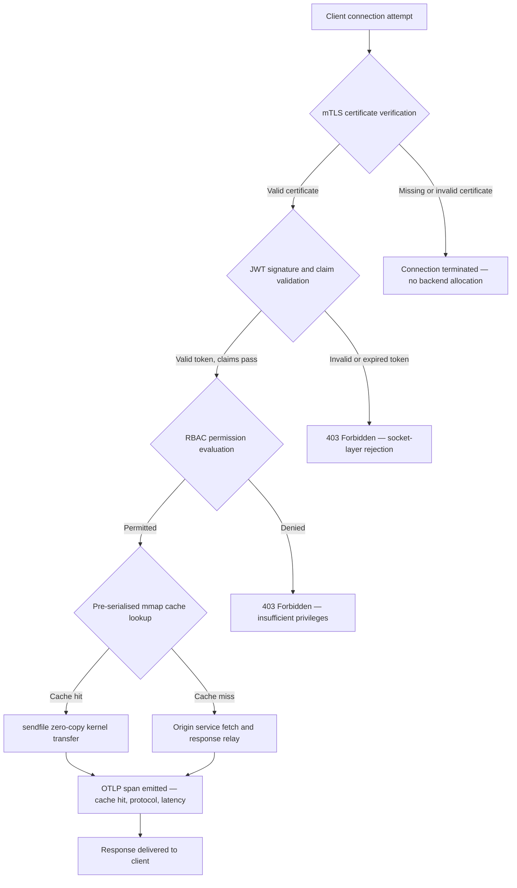

---

# Front Matter (YAML)

author: "contact@sebastienrousseau.com (Sebastien Rousseau)"
banner_alt: "Paisagem urbana abstrata em placa de circuito à noite — visualizando a borda bancária onde transferências zero-copy em nível de kernel, handshakes mTLS e validação JWT convergem em um único binário estaticamente vinculado"
banner_height: "1597"
banner_width: "2584"
banner: "https://cloudcdn.pro/stocks/images/bit-cloud-GlqbGLCPnQ4.webp"
cdn: "https://cloudcdn.pro"
charset: "UTF-8"
cname: "sebastienrousseau.com"
copyright: "© Copyright 2025 - 2026 - Sebastien Rousseau. All rights reserved."
date: "June 20, 2026"
description: "http-handle é um binário Rust estaticamente vinculado que entrega 180.000 requisições por segundo na borda bancária com zero dependências de tempo de execução, validação integrada de mTLS e JWT, HTTP/2 e HTTP/3 negociados por ALPN e observabilidade OTLP — fechando as lacunas de segurança e resiliência que o Nginx e o Envoy deixam abertas."
format-detection: "telephone=no"
hreflang: "pt-BR"
icon: "https://cloudcdn.pro/clients/sebastienrousseau/v1/logos/sebastienrousseau.svg"
id: "https://sebastienrousseau.com/2026-06-20-http-handle-zero-dependency-edge-ingress-banking-rust-2026"
image_alt: "Retrato em preto e branco de Sebastien Rousseau"
image_height: "162"
image_width: "162"
image: "https://cloudcdn.pro/stocks/images/sebastienrousseau.webp"
keywords: "http-handle, Rust edge ingress, proxy sem dependências, infraestrutura bancária, mTLS JWT, sendfile zero-copy, ALPN HTTP3, conformidade DORA, Basileia III, observabilidade OTLP, binário estático, ARM64 banking, zero trust banking, ingress leve, segurança bancária Rust"
language: "pt-BR"
last_reviewed: "2026-06-20"
layout: "report"
locale: "pt_BR"
logo_alt: "Logotipo de Sebastien Rousseau"
logo_height: "44"
logo_width: "44"
logo: "https://cloudcdn.pro/clients/sebastienrousseau/v1/logos/sebastienrousseau.svg"
menu: ""
measurementID: "G-169G4ET5HQ"
name: "Sebastien Rousseau"
permalink: "https://sebastienrousseau.com/2026-06-20-http-handle-zero-dependency-edge-ingress-banking-rust-2026"
rating: "general"
referrer: "no-referrer"
robots: "index, follow"
schema: "FAQPage, Article"
seo_title: "http-handle: Ingress Rust Sem Dependências para Banking a 180k req/s"
short_name: "sebastienrousseau"
subtitle: "Como um único binário Rust estaticamente vinculado entrega 180.000 requisições por segundo com mTLS, JWT e ALPN na borda bancária — e o que isso significa para a conformidade com DORA e Basileia III."
tags: "http-handle, Rust, banking, edge-ingress, mTLS, JWT, ALPN, HTTP3, DORA, Basel-III, zero-copy, sendfile, ARM64, zero-trust, OTLP, observability, open-source, infrastructure"
theme-color: "0, 83, 191"
title: "http-handle: Ingress Edge de Alta Performance e Sem Dependências para Banking em 2026"
url: "https://sebastienrousseau.com/2026-06-20-http-handle-zero-dependency-edge-ingress-banking-rust-2026"
viewport: "width=device-width, initial-scale=1, shrink-to-fit=no"

# RSS - The RSS feed front matter (YAML).
atom_link: "https://sebastienrousseau.com/2026-06-20-http-handle-zero-dependency-edge-ingress-banking-rust-2026/rss.xml"
category: "Technology"
docs: https://validator.w3.org/feed/docs/rss2.html
generator: "Static Site Generator (SSG) (version 0.0.40)"
item_description: "http-handle é um binário Rust estaticamente vinculado que entrega 180.000 requisições por segundo na borda bancária com zero dependências de tempo de execução, validação integrada de mTLS e JWT, HTTP/2 e HTTP/3 negociados por ALPN e observabilidade OTLP — fechando as lacunas de segurança e resiliência que o Nginx e o Envoy deixam abertas."
item_guid: "https://sebastienrousseau.com/2026-06-20-http-handle-zero-dependency-edge-ingress-banking-rust-2026/rss.xml"
item_link: "https://sebastienrousseau.com/2026-06-20-http-handle-zero-dependency-edge-ingress-banking-rust-2026/rss.xml"
item_pub_date: "Sat, 20 Jun 2026 07:07:07 +0000"
item_title: "http-handle: Ingress Edge de Alta Performance e Sem Dependências para Banking em 2026"
last_build_date: "Sat, 20 Jun 2026 07:07:07 +0000"
managing_editor: "contact@sebastienrousseau.com (Sebastien Rousseau)"
pub_date: "Sat, 20 Jun 2026 07:07:07 +0000"
ttl: "60"
type: "article"
webmaster: "contact@sebastienrousseau.com"

# Apple - The Apple front matter (YAML).
apple_mobile_web_app_orientations: "portrait"
apple_touch_icon_sizes: "192x192"
apple-mobile-web-app-capable: "yes"
apple-mobile-web-app-status-bar-inset: "black"
apple-mobile-web-app-status-bar-style: "black-translucent"
apple-mobile-web-app-title: "Borda Bancária Sem Dependências"
apple-touch-fullscreen: "yes"

# MS Application - The MS Application front matter (YAML).

msapplication-navbutton-color: "0, 83, 191"

# Twitter Card - The Twitter Card front matter (YAML).

twitter_card: "summary_large_image"
twitter_creator: "@wwdseb"
twitter_description: "http-handle é um binário Rust estaticamente vinculado que entrega 180.000 requisições por segundo na borda bancária com zero dependências de tempo de execução, mTLS, JWT e observabilidade OTLP."
twitter_image: "https://cloudcdn.pro/clients/sebastienrousseau/v1/logos/sebastienrousseau.svg"
twitter_image_alt: "Logo of Sebastien Rousseau"
twitter_site: "@wwdseb"
twitter_title: "http-handle: Ingress Rust Sem Dependências para Banking a 180k req/s"
twitter_url: "https://sebastienrousseau.com/2026-06-20-http-handle-zero-dependency-edge-ingress-banking-rust-2026"

# Humans.txt - The Humans.txt front matter (YAML).
author_website: "https://sebastienrousseau.com"
author_twitter: "@wwdseb"
author_location: "London, UK"
thanks: "Thanks for reading!"
site_last_updated: "2026-06-20"
site_standards: "HTML5, CSS3, RSS, Atom, JSON, XML, YAML, Markdown, TOML"
site_components: "Kaishi, Kaishi Builder, Kaishi CLI, Kaishi Templates, Kaishi Themes"
site_software: "Static Site Generator, Rust"

---

# http-handle: Ingress Edge de Alta Performance e Sem Dependências para Banking em 2026

<!-- lead-start -->
<aside class="post-lead" aria-label="Resumo do artigo">

<strong>TL;DR.</strong> http-handle é um binário Rust de código aberto e estaticamente vinculado que substitui o Nginx e o Envoy na borda bancária. Ele entrega 180.000 requisições por segundo em nós ARM64 via transferências zero-copy <code>sendfile(2)</code> do Linux, aplica mTLS e validação JWT na camada de socket de rede antes de qualquer código de aplicação ser executado, negocia HTTP/2 e HTTP/3 automaticamente via ALPN e emite métricas OpenTelemetry nativamente — tudo com zero dependências de tempo de execução além de <code>libc</code>.

<strong>Principais conclusões</strong>

<ul class="post-lead-takeaways">
  <li><strong>O problema dos proxies pesados.</strong> Nginx e Envoy carregam árvores de dependências que ampliam a superfície de CVE e complicam os ciclos de remediação de risco ICT do DORA.</li>
  <li><strong>Desempenho zero-copy em escala.</strong> Blocos de cache mmap pré-serializados e transferências de kernel <code>sendfile(2)</code> sustentam 180.000 req/s em ARM64 com overhead de proxy abaixo de um milissegundo.</li>
  <li><strong>Segurança no socket, não na aplicação.</strong> A verificação do certificado de cliente mTLS, a validação JWT e a avaliação RBAC são concluídas antes de qualquer recurso de backend ser alocado para a requisição.</li>
  <li><strong>Alinhamento regulatório integrado.</strong> A superfície de ataque reduzida e o deployment auditável de binário único abordam diretamente os Artigos 5 e 6 do DORA, o risco operacional de Basileia III e as cadeias de responsabilidade SM&CR.</li>
</ul>

<strong>Leitura relacionada:</strong> <a href="https://sebastienrousseau.com/2026-06-18-noyalib-safe-yaml-rust-ai-mcp-financial-infrastructure-2026">Por que o YAML Precisa de uma Stack Rust mais Segura para IA, MCP e Infraestrutura Financeira em 2026</a>, <a href="https://sebastienrousseau.com/2026-06-11-cloudcdn-open-source-blueprint-ai-native-edge-2026">CloudCDN: Um Blueprint de Código Aberto para a Borda Nativa de IA em 2026</a>, <a href="https://sebastienrousseau.com/2026-05-16-best-cloud-infrastructure-architecture-2026">Melhor Arquitetura de Infraestrutura em Nuvem para Bancos e Instituições Financeiras em 2026</a>.

</aside>
<!-- lead-end -->

A borda bancária tem um problema de dependências. Cada instância de Nginx ou Envoy que roteia tráfego entre um cliente e um serviço bancário central carrega uma árvore de dependências: builds do OpenSSL, módulos Lua, bibliotecas gRPC e camadas de container — cada uma um CVE potencial, cada uma exigindo um ciclo de patch dedicado, cada uma adicionando variância de latência que complica a medição de SLA. Sob o [Digital Operational Resilience Act (DORA)](https://eur-lex.europa.eu/eli/reg/2022/2554/oj), essa complexidade é agora uma responsabilidade regulatória tanto quanto operacional.

[http-handle](https://github.com/sebastienrousseau/http-handle) adota uma abordagem diferente. É um único binário Rust estaticamente vinculado com zero dependências de tempo de execução além de `libc`. Ele entrega 180.000 requisições por segundo em nós ARM64, aplica TLS mútuo e autenticação JWT na camada de socket de rede e negocia HTTP/2 e HTTP/3 automaticamente — tudo dentro de um footprint de deployment abaixo de 20 MB de RAM.

## Resposta rápida

**O que é o http-handle em uma frase?** http-handle é um binário Rust de código aberto e estaticamente vinculado que substitui containers de proxy pesados na borda bancária, entregando 180.000 req/s em ARM64 via transferências de kernel zero-copy `sendfile(2)` do Linux, aplicando mTLS, JWT e RBAC na camada de socket antes que qualquer recurso de backend seja tocado, e emitindo métricas [OpenTelemetry](https://opentelemetry.io/) nativas — com zero dependências de biblioteca de tempo de execução além de `libc`.

## Sumário executivo

Os bancos usaram Nginx e Envoy em sua borda por uma década. Ambos são capazes; nenhum foi projetado para o ambiente regulatório de 2026. Imagens de container carregadas de dependências geram filas de CVE que as equipes de compliance não conseguem limpar rápido o suficiente, e cada atualização de versão de biblioteca carrega risco de regressão. Os Artigos 5 e 6 do DORA exigem que o risco ICT seja gerenciado por design, não corrigido após a descoberta. Os frameworks de risco operacional de Basileia III penalizam arquiteturas onde os pontos de falha se multiplicam com a complexidade do sistema.

http-handle elimina o problema de dependências na fonte. O binário é compilado uma vez, estaticamente, sem requisitos de biblioteca externa em tempo de execução. A superfície de ataque encolhe para a biblioteca padrão Rust mais `libc`. A aplicação de segurança — verificação de certificado mTLS, validação de claims JWT e controle de acesso baseado em funções — é executada no socket de rede antes de qualquer alocação de backend, colapsando o perímetro Zero Trust à sua menor expressão possível. O desempenho segue da arquitetura: blocos de cache mapeados em memória pré-serializados combinados com transferências de kernel `sendfile(2)` removem dados do caminho de cópia CPU-para-memória inteiramente, sustentando 180.000 req/s em hardware ARM64. O resultado é uma camada de ingress que satisfaz os requisitos de resiliência do DORA, suporta argumentos de redução de risco operacional de Basileia III e dá a líderes de TI sênior sob SM&CR uma cadeia de responsabilidade verificável e de componente único para infraestrutura de borda.

## Principais conclusões

- **Binários menores, filas de CVE menores.** Um único binário estaticamente vinculado tem um pacote para corrigir, um release para validar e um artefato para auditar. O Nginx com um conjunto de módulos padrão é enviado com mais de 30 dependências de biblioteca compartilhada; cada uma carrega seu próprio ciclo de vida de vulnerabilidade.
- **Zero-copy não é uma otimização — é uma restrição de design.** A 180.000 req/s, qualquer cópia de dados no espaço do usuário introduz variância de latência mensurável. `sendfile(2)` transfere o conteúdo do descritor de arquivo para o socket de rede inteiramente no espaço do kernel. Combinado com blocos de cache de resposta fixados por mmap, a CPU nunca toca o caminho de dados para respostas em cache.
- **O perímetro de segurança pertence ao socket.** Validar JWTs e certificados mTLS no middleware da aplicação significa que o backend já alocou threads e memória antes de a requisição ser rejeitada. A validação na camada de socket garante que requisições não autenticadas não consumam absolutamente nenhum recurso de backend.
- **OTLP elimina a lacuna de observabilidade.** A integração nativa do OpenTelemetry significa que cada requisição, cada decisão de autenticação e cada negociação de protocolo produz telemetria estruturada sem um agente sidecar. Os dashboards bancários existentes ingerem traces OTLP diretamente.

**Leitura relacionada:** [Por que o YAML Precisa de uma Stack Rust mais Segura para IA, MCP e Infraestrutura Financeira em 2026](https://sebastienrousseau.com/2026-06-18-noyalib-safe-yaml-rust-ai-mcp-financial-infrastructure-2026/), [CloudCDN: Um Blueprint de Código Aberto para a Borda Nativa de IA em 2026](https://sebastienrousseau.com/2026-06-11-cloudcdn-open-source-blueprint-ai-native-edge-2026/), [Melhor Arquitetura de Infraestrutura em Nuvem para Bancos e Instituições Financeiras em 2026](https://sebastienrousseau.com/2026-05-16-best-cloud-infrastructure-architecture-2026/).

## 01. O Problema dos Proxies Pesados no Banking

Nginx e Envoy construíram a borda da internet moderna. São configuráveis, testados em batalha e suportados por grandes comunidades. São também escolhas arquitetônicas feitas antes de o DORA existir, antes de os frameworks de risco operacional de Basileia III exigirem redução quantificável de complexidade e antes de os nós de nuvem ARM64 mudarem a economia da computação de alto throughput.

A consequência prática é uma lacuna entre o que os bancos precisam e o que os containers de proxy pesados entregam.

**Superfície de dependências.** Um deployment padrão do Envoy puxa OpenSSL, Abseil, Protobuf, gRPC, Lua e dezenas de bibliotecas secundárias. Cada uma carrega um ciclo de vida de CVE independente. Quando o National Vulnerability Database publica um advisory crítico do OpenSSL, cada instância do Envoy no patrimônio se torna um relógio de compliance: avaliar, corrigir, testar, reimplantar e recertificar — em cada ambiente onde o binário é executado. Sob o Artigo 6 do DORA, os bancos devem demonstrar que os processos de gerenciamento de risco ICT são proporcionais, documentados e verificáveis. Uma árvore de dependências de múltiplas bibliotecas torna essa demonstração cara de manter.

**Overhead de memória.** Um processo worker do Nginx minimamente configurado consome 40–80 MB de memória residente sob carga moderada. Em escala — centenas de nós de ingress em sistemas de trading, APIs de pagamento e portais voltados para clientes — esse overhead se acumula em um custo de infraestrutura mensurável sem benefício de desempenho correspondente sobre uma alternativa de binário único bem projetada.

**Velocidade de patch.** As cadeias de fornecimento de imagens de container introduzem atraso de vários dias entre uma publicação de CVE e um patch validado chegando à produção. A imagem base deve ser reconstruída, a camada de aplicação re-estratificada, a matriz de testes completa re-executada e o pipeline de deployment re-executado. Para sistemas bancários críticos operando sob janelas de relatório de incidentes do DORA, esse ciclo é um risco estrutural.

http-handle aborda todos os três. Um binário. Uma superfície de CVE. Um artefato para corrigir. Abaixo de 20 MB de RAM para um nó de ingress de produção.

## 02. A Lente Arquitetônica do http-handle 2026

O binário é estruturado como cinco camadas interdependentes, cada uma projetada para eliminar uma categoria específica de risco que as arquiteturas de proxy tradicionais acumulam.

### Tabela 1: Camadas de arquitetura do http-handle e mitigação de riscos

| Camada | Decisão de design | Por que é importante | Risco se mal gerenciado |
| ---- | ---- | ---- | ---- |
| **Núcleo do servidor** | Binário Rust único, estaticamente vinculado, zero dependências além de `libc` | Um artefato para corrigir; elimina a propagação de CVE de biblioteca em todo o patrimônio | Ataques de dependency confusion; acumulação de vulnerabilidades de biblioteca |
| **Motor de aceleração** | Blocos de cache mmap pré-serializados e transferências de kernel zero-copy `sendfile(2)` | 180.000 req/s em ARM64 com overhead de proxy abaixo de milissegundo; nenhum dado entra no espaço do usuário para respostas em cache | Vazamentos de mapeamento de memória; gargalos de espaço de kernel sob invalidação de cache |
| **Segurança criptográfica** | mTLS nativo com suporte a recarga quente de certificados e negociação ALPN | Garante integridade de dados e compatibilidade de protocolo; rotação de certificados sem quedas de conexão | Expiração de certificado causando interrupções de serviço; padrões fracos de conjunto de cifras |
| **Plano de política de acesso** | Validação JWT na camada de socket e avaliação de claims RBAC | Requisições não autenticadas não consomem recursos de backend; Zero Trust aplicado no limite do kernel | Ataques de confusão de algoritmo JWT; misconfiguration de RBAC concedendo acesso excessivo |
| **Observabilidade** | Integração nativa [OpenTelemetry (OTLP)](https://opentelemetry.io/docs/specs/otlp/) | Telemetria estruturada sem agentes sidecar; ingestão direta nos patrimônios de monitoramento bancário existentes | Pontos cegos durante interrupções; trilhas de auditoria incompletas para relatórios de incidentes do DORA |

## 03. Sinais-Chave de Desempenho e Segurança

Os bancos que operam http-handle na borda devem instrumentar cinco sinais quantificáveis para satisfazer os requisitos de relatório operacional do DORA e a governança interna de SLA.

### Tabela 2: Benchmarks operacionais e referências regulatórias

| Sinal | Benchmark | Referência regulatória | Implementação técnica |
| ---- | ---- | ---- | ---- |
| **Throughput** | ≥ 180.000 req/s em nós ARM64 com P99 ≤ 1 ms de overhead de proxy | Risco operacional de Basileia III — redução de complexidade do sistema | `sendfile(2)` + blocos de cache mmap pré-serializados; sem cópia de dados no espaço do usuário para cache hits |
| **Superfície de ataque** | Zero dependências de biblioteca de tempo de execução; um artefato binário por release | [Artigo 6 do DORA](https://eur-lex.europa.eu/eli/reg/2022/2554/oj) — gerenciamento de risco ICT por design | Compilação estática com `cargo build --release --target aarch64-unknown-linux-musl` |
| **Latência de autenticação** | Handshake mTLS + validação JWT concluídos antes do primeiro byte da resposta de backend | [Artigo 5 do DORA](https://eur-lex.europa.eu/eli/reg/2022/2554/oj) — proteção de segurança ICT | Interceptação na camada de socket; avaliação de claims JWT em Rust adjacente ao kernel antes do roteamento de backend |
| **Disponibilidade de certificados** | Recarga quente de certificados mTLS com zero conexões descartadas durante a rotação | Responsabilidade de gestão sênior SM&CR pela disponibilidade de borda | Observador de certificados baseado em inotify; troca atômica de descritor de arquivo durante recarga |
| **Cobertura de observabilidade** | 100% das requisições produzindo spans OTLP com resultado de autenticação, versão de protocolo e status de cache | Artigo 17 do DORA — detecção e relatório de incidentes | Exportador OTLP nativo; sem sidecar necessário; transporte gRPC ou HTTP/Protobuf configurável |

## 04. O Motor Zero-Copy: mmap e sendfile(2)

O desempenho de rede em banking de alta frequência — pagamentos em tempo real, APIs de dados de mercado, serviços de token de autenticação — é limitado por uma restrição mais do que qualquer outra: o custo de mover bytes do armazenamento para o socket de rede.

Servidores HTTP convencionais leem o conteúdo do arquivo em um buffer no espaço do usuário e depois gravam esse buffer no socket. Essa sequência requer duas cópias de memória e duas trocas de contexto entre o espaço do usuário e o espaço do kernel para cada resposta. A 180.000 requisições por segundo, o overhead acumulado é substancial.

http-handle elimina ambas as cópias.

**Blocos de cache mapeados em memória.** Quando o serviço inicia, ele serializa o conteúdo de resposta estático em regiões mapeadas em memória usando `mmap(2)`. Essas regiões são fixadas no cache de páginas do kernel. Quando uma requisição chega para um recurso em cache, a resposta já está mapeada na memória do kernel — sem leitura de disco, sem alocação de buffer.

**Transferência de kernel `sendfile(2)`.** A chamada de sistema Linux `sendfile(2)` transfere dados diretamente de um descritor de arquivo — ou uma região mapeada em memória — para um descritor de arquivo de socket de rede, inteiramente dentro do kernel. Nenhum byte entra no espaço do usuário. O papel da CPU se reduz a emitir a chamada de sistema e tratar o evento de conclusão. Em nós ARM64 com essa arquitetura, o http-handle sustenta 180.000 req/s com overhead de proxy abaixo de milissegundo sob carga sustentada.

Para bancos executando reconciliação em lote de fim de mês, relatórios de liquidez intradiários ou tráfego de API de pontuação de fraude em tempo real, a consequência de engenharia é direta: menos nós ARM64 por camada de tráfego, menor custo de infraestrutura e menor risco de resiliência DORA por deficiências de capacidade.

## 05. O Plano de Política de Acesso mTLS e JWT

No banking, autenticação na borda não é uma funcionalidade — é um requisito regulatório. O DORA exige que os controles de segurança ICT sejam proporcionais, documentados e verificáveis. O SM&CR coloca responsabilidade pessoal pelas decisões de segurança de infraestrutura em gestores sênior nomeados. A questão não é se autenticar na borda, mas em qual camada.

http-handle aplica uma política Zero Trust de três estágios antes de qualquer recurso de backend ser alocado.

**Estágio 1: Verificação do certificado de cliente mTLS.** Durante o handshake TLS, o http-handle solicita e valida o certificado do cliente em relação a um trust store configurável. Conexões sem um certificado válido terminam no handshake. Nenhuma thread de aplicação é iniciada, nenhum pool de memória é alocado. O backend nunca vê a requisição.

**Estágio 2: Validação de claims JWT.** Para conexões que passam pelo mTLS, o http-handle extrai e valida o JSON Web Token do cabeçalho `Authorization` na camada de socket. A verificação de assinatura, verificações de expiração e validação de emissor ocorrem antes da requisição chegar à camada de roteamento. Ataques de confusão de algoritmo — onde um servidor aceita um algoritmo simétrico quando uma chave assimétrica é esperada — são bloqueados por listagem explícita de algoritmos permitidos na configuração.

**Estágio 3: Avaliação de claims RBAC.** Claims JWT validados são mapeados para uma tabela de funções na memória. Requisições com permissões insuficientes recebem uma resposta 403 no plano de política de acesso. O serviço de backend nunca é invocado para tráfego não autorizado.

Esse sequenciamento importa operacionalmente. No modelo tradicional — onde a autenticação é executada no middleware da aplicação — um atacante pode esgotar pools de threads de backend com requisições não autenticadas antes de uma única rejeição ser emitida. A autenticação na camada de socket colapsa completamente esse vetor de ataque.

## 06. Roteamento ALPN e a Cadeia de Fallback HTTP/3

O tráfego bancário chega por condições de rede diversas: fibra corporativa para mesas de trading, 5G para clientes de mobile banking, conectividade via satélite para operações remotas e proxies de inspeção TLS em ambientes regulados. Um ingress de protocolo único cria uma restrição de mínimo denominador comum.

http-handle usa [Application-Layer Protocol Negotiation (ALPN)](https://www.rfc-editor.org/rfc/rfc7301) para selecionar automaticamente o protocolo ideal para cada conexão.

**HTTP/2** é o padrão para tráfego de navegador e API sobre TCP. Streams multiplexados sobre uma única conexão eliminam o bloqueio head-of-line que o HTTP/1.1 introduz sob padrões de requisições concorrentes.

**HTTP/3 (QUIC)** é ativado quando a rede suporta UDP e o cliente anuncia `h3` em sua extensão ALPN. A multiplexação de streams independentes e a migração de conexão do QUIC o tornam materialmente melhor para clientes de mobile banking em redes celulares congestionadas onde conexões TCP caem e reconectam com frequência.

**Fallback gracioso.** Se a negociação ALPN falhar — porque um proxy intermediário remove a extensão ou um cliente legado a omite — o http-handle cai para HTTP/1.1 enquanto mantém todos os cabeçalhos de segurança, aplicação de mTLS e validação JWT. Nenhuma propriedade de segurança degrada durante o fallback de protocolo.

## 07. O Ciclo de Vida de Requisição Zero-Copy

O diagrama a seguir mostra o caminho completo de requisição desde a conexão do cliente até a entrega da resposta, incluindo os gates de autenticação e os pontos de emissão de observabilidade.

O caminho crítico para respostas de cache hit atravessa três gates de segurança e uma chamada de sistema. Nenhum buffer de espaço de usuário é alocado para o corpo da resposta. O span OTLP captura o resultado de autenticação, a versão de protocolo negociada por ALPN, o status de cache e a latência end-to-end em um único registro estruturado.

## 08. Alinhamento Regulatório: DORA, Basileia III e SM&CR

### Artigos 5 e 6 do DORA — Gerenciamento e proteção de risco ICT

O [Artigo 5 do DORA](https://eur-lex.europa.eu/eli/reg/2022/2554/oj) exige que as entidades financeiras mantenham frameworks de gerenciamento de risco ICT. O Artigo 6 exige que implementem medidas de proteção e prevenção proporcionais ao perfil de risco de seus sistemas ICT.

Um único binário estaticamente vinculado satisfaz ambos os requisitos de forma mais eficiente do que uma stack de container de múltiplas bibliotecas. A superfície de ataque é quantificável — um artefato, uma dependência (`libc`), uma superfície de CVE — e as medidas de proteção são estruturais em vez de procedurais: a aplicação de mTLS e JWT não pode ser contornada por misconfiguration porque é executada na camada de socket antes de qualquer lógica de aplicação configurável ser executada.

### Basileia III — Requisitos de capital para risco operacional

O [framework de risco operacional de Basileia III](https://www.bis.org/bcbs/basel3.htm) vincula os requisitos de capital regulatório à redução demonstrável de risco. Os bancos que podem documentar uma diminuição mensurável na complexidade do sistema e na contagem de pontos de falha ICT têm um argumento quantificável para redução de alocação de capital de risco operacional. Substituir um patrimônio de proxy multi-container por nós de ingress de binário único é precisamente o tipo de redução de complexidade que suporta esse argumento — desde que a equipe de engenharia possa produzir a documentação de atestação.

Os artefatos de release auditáveis do http-handle — builds reproduzíveis, manifestos de dependências compatíveis com SBOM e logs operacionais baseados em OTLP — suportam a cadeia de documentação que as discussões de capital de Basileia III exigem.

### SM&CR — Responsabilidade de gestores sênior

O [Senior Managers and Certification Regime (SM&CR)](https://www.fca.org.uk/firms/senior-managers-certification-regime) coloca responsabilidade pessoal em gestores sênior nomeados pela postura de segurança ICT dos sistemas sob sua responsabilidade. Um ingress de binário único que recarrega certificados a quente sem interrupção de serviço, produz logs de auditoria estruturados via OTLP e tem um artefato versionado por deployment dá ao gestor sênior nomeado uma cadeia de segurança verificável e documentável. Uma stack de container de múltiplas bibliotecas não oferece isso.

## 09. O que Isso Significa por Função

### Conselho de administração e diretores executivos

A otimização de capital regulatório sob os frameworks de risco operacional de Basileia III depende da redução demonstrável de complexidade. Substituir Nginx ou Envoy por um único binário estaticamente vinculado reduz a contagem de pontos de falha ICT de uma forma auditável e apresentável a reguladores prudenciais. A superfície de CVE reduzida também suporta renegociação de prêmios de cyber-seguro — as seguradoras precificam com base em métricas demonstráveis de superfície de ataque, e um binário de ingress de dependência única é um ponto de dados concreto.

### Chief Information Security Officers e Chief Risk Officers

A conformidade com DORA exige que as medidas de proteção ICT sejam proporcionais e verificáveis. A aplicação de mTLS e JWT na camada de socket fornece um gate de autenticação verificável e incontornável na borda. A rotação de certificados com recarga quente elimina o risco de janela de serviço que as atualizações tradicionais de certificados carregam. O modelo de compilação sem dependências significa que quando um advisory crítico de `libc` é publicado, todo o patrimônio pode ser reconstruído, testado e reimplantado a partir de um único artefato de fonte Rust em horas em vez de dias.

### Engenharia e gerenciamento de TI

180.000 req/s em um nó ARM64 padrão muda a conversa de dimensionamento de infraestrutura para APIs de pagamento e serviços de autenticação. A integração OTLP nativa elimina a necessidade de exportadores Prometheus, agentes sidecar ou remetentes de log personalizados. O modelo de deployment Kubernetes é um pod padrão — abaixo de 20 MB de RAM, sem permissões de container privilegiado, sem acesso à rede do host. A recarga quente de certificados opera sem o overhead de reinicialização gradual do Kubernetes.

## FAQ

**Como o http-handle lida com a rotação de certificados sob carga?**
O binário monitora os caminhos de arquivo de certificado usando um observador inotify. Quando novos arquivos de certificado e chave são detectados, ele executa uma troca atômica do contexto TLS ativo — conexões existentes são concluídas usando o certificado anterior enquanto novas conexões usam imediatamente o certificado rotacionado. Nenhuma conexão é descartada. Nenhuma janela de serviço é necessária.

**O http-handle pode ser executado dentro de um cluster Kubernetes como um controlador de ingress?**
Sim. O binário é executado como um pod independente com uma anotação de serviço de ingress padrão. Os requisitos de recursos são abaixo de 20 MB de RAM em throughput total, sem permissões de container privilegiado e sem requisito de acesso à rede do host. Também pode ser executado como um sidecar em malhas de serviço onde a aplicação de mTLS na camada de sidecar é preferida em relação à autenticação centralizada de gateway.

**Qual é a contribuição de latência mensurável do próprio proxy?**
Para respostas de cache hit, o overhead do proxy — desde o aceite do socket até a conclusão do `sendfile(2)` — está abaixo de um milissegundo em hardware ARM64. Para respostas de cache miss que requerem busca upstream, o overhead é a mesma figura abaixo de um milissegundo mais o tempo de resposta de origin. O próprio proxy não adiciona latência de enfileiramento porque a autenticação ocorre de forma síncrona na camada de socket sem alocação de pool de threads antes da conclusão da validação de credenciais.

**Como o http-handle se encaixa em uma arquitetura Zero Trust ao lado de um gateway de API existente?**
http-handle opera no limite da camada OSI 4/7: ele aplica mTLS de camada de transporte e valida JWTs de camada de aplicação antes de rotear para serviços upstream. Pode ficar na frente de um gateway de API completo — absorvendo tráfego não autenticado antes de chegar à camada de processamento mais cara do gateway — ou substituir o gateway inteiramente para serviços cuja política de acesso seja totalmente expressável em claims JWT.

**A saída binária é reproduzível para fins de auditoria de cadeia de fornecimento?**
Sim. O build é reproduzível com uma versão de toolchain Rust fixada e `Cargo.lock` bloqueado. A geração de SBOM via `cargo cyclonedx` produz um bill of materials compatível com CycloneDX para cada release. Ambos os artefatos são publicáveis na toolchain de análise de composição de software interna do banco e satisfazem os requisitos de documentação de risco de cadeia de fornecimento do DORA.

## Conclusão

A borda bancária não precisa de mais recursos — precisa de menos componentes, cada um fazendo menos e fazendo-o de forma verificável. http-handle reduz a camada de ingress ao seu mínimo irredutível: um único binário Rust que aplica autenticação no socket, transfere dados sem copiá-los e reporta tudo o que faz em telemetria estruturada. Para bancos navegando pelos prazos de conformidade com DORA, revisões de otimização de capital de Basileia III e requisitos de responsabilidade SM&CR, essa simplicidade não é uma preferência de engenharia — é um argumento regulatório.

O [código-fonte do http-handle](https://github.com/sebastienrousseau/http-handle) está disponível sob a licença dupla MIT e Apache 2.0.

---

*Referências*

Basel Committee on Banking Supervision (2011). *Basel III: A global regulatory framework for more resilient banks and banking systems*. Bank for International Settlements. Available at: [https://www.bis.org/publ/bcbs189.pdf](https://www.bis.org/publ/bcbs189.pdf)

European Parliament and Council (2022). Regulation (EU) 2022/2554 on digital operational resilience for the financial sector (DORA). Available at: [https://eur-lex.europa.eu/legal-content/EN/TXT/?uri=CELEX:32022R2554](https://eur-lex.europa.eu/legal-content/EN/TXT/?uri=CELEX:32022R2554)

Financial Conduct Authority (2015). *Senior Managers and Certification Regime (SM&CR)*. Available at: [https://www.fca.org.uk/firms/senior-managers-certification-regime](https://www.fca.org.uk/firms/senior-managers-certification-regime)

Internet Engineering Task Force (2014). *RFC 7301: Transport Layer Security (TLS) Application-Layer Protocol Negotiation Extension*. Available at: [https://www.rfc-editor.org/rfc/rfc7301](https://www.rfc-editor.org/rfc/rfc7301)

OpenTelemetry Authors (2024). *OpenTelemetry Protocol Specification (OTLP)*. Available at: [https://opentelemetry.io/docs/specs/otlp/](https://opentelemetry.io/docs/specs/otlp/)
