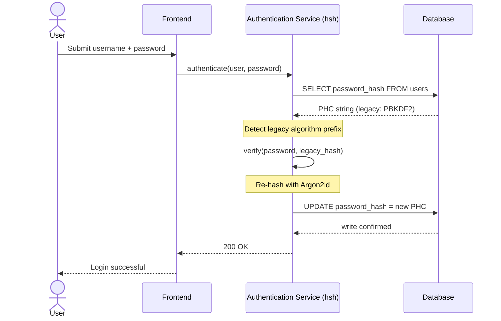
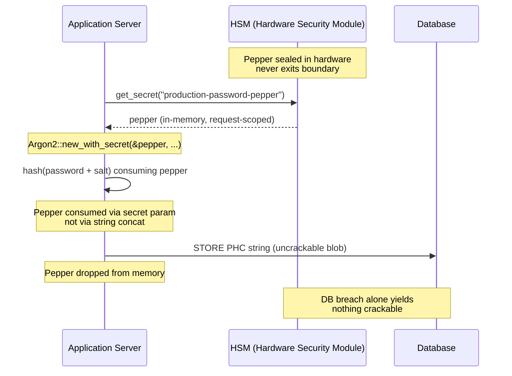

---
# Front Matter (YAML)
author: "contact@sebastienrousseau.com (Sebastien Rousseau)"
banner_alt: "Close-up do terminal de um desenvolvedor exibindo a saída do compilador Rust — a disciplina visível de um substrato criptográfico memory-safe e auditável sob um parque de autenticação bancária corporativa"
banner_height: "1597"
banner_width: "2584"
banner: "https://cloudcdn.pro/stocks/images/rustlogs.webp"
cdn: "https://cloudcdn.pro"
charset: "UTF-8"
cname: "sebastienrousseau.com"
copyright: "© Copyright 2025 - 2026 - Sebastien Rousseau. All rights reserved."
date: "June 22, 2026"
description: "hsh é um framework criptográfico puro em Rust que permite a bancos tier-1 migrar hashes de senhas legados para Argon2id com zero downtime, integrando peppering via HSM e eliminando vulnerabilidades de memória em FFI baseado em C para atender ao DORA."
format-detection: "telephone=no"
hreflang: "pt-br"
icon: "https://cloudcdn.pro/clients/sebastienrousseau/v1/logos/sebastienrousseau.svg"
id: "https://sebastienrousseau.com/2026-06-22-hsh-zero-downtime-cryptographic-stewardship-rust-banking-2026"
image_alt: "Retrato em preto e branco de Sebastien Rousseau"
image_height: "162"
image_width: "162"
image: "https://cloudcdn.pro/stocks/images/sebastienrousseau.webp"
keywords: "hsh, criptografia em Rust, hashing de senhas, Argon2id, segurança bancária, interlock HSM, conformidade DORA, Basel III, migração com zero downtime, memory safety, PBKDF2, scrypt, cyber recovery"
language: "pt-BR"
last_reviewed: "2026-06-22"
layout: "report"
locale: "pt_BR"
logo_alt: "Logo de Sebastien Rousseau"
logo_height: "44"
logo_width: "44"
logo: "https://cloudcdn.pro/clients/sebastienrousseau/v1/logos/sebastienrousseau.svg"
measurementID: "G-169G4ET5HQ"
name: "Sebastien Rousseau"
permalink: "https://sebastienrousseau.com/2026-06-22-hsh-zero-downtime-cryptographic-stewardship-rust-banking-2026"
rating: "general"
referrer: "no-referrer"
robots: "index, follow"
schema: "FAQPage, Article"
seo_title: "hsh: stewardship criptográfico zero-downtime em Rust para bancos"
short_name: "sebastienrousseau"
subtitle: "Como um framework criptográfico puro em Rust permite que bancos atualizem senhas legadas para Argon2id com interlock HSM — e o que isso significa para conformidade com DORA e Basel III."
tags: "hsh, Rust, banking, cryptography, Argon2id, HSM, DORA, Basel-III, security, open-source, operational-resilience"
theme-color: "0, 83, 191"
title: "Gestão de senhas em bancos corporativos: hashing multi-algoritmo e upgrades com hsh"
url: "https://sebastienrousseau.com/2026-06-22-hsh-zero-downtime-cryptographic-stewardship-rust-banking-2026"
viewport: "width=device-width, initial-scale=1, shrink-to-fit=no"

# RSS
atom_link: "https://sebastienrousseau.com/2026-06-22-hsh-zero-downtime-cryptographic-stewardship-rust-banking-2026/rss.xml"
category: "Technology"
generator: "Static Site Generator (SSG) (version 0.0.40)"
item_description: "hsh é um framework criptográfico puro em Rust que permite a bancos tier-1 migrar hashes de senhas legados para Argon2id com zero downtime, integrando peppering via HSM e eliminando vulnerabilidades de memória em FFI baseado em C para atender ao DORA."
item_pub_date: "Mon, 22 Jun 2026 07:07:07 +0000"
item_title: "Gestão de senhas em bancos corporativos: hashing multi-algoritmo e upgrades com hsh"
pub_date: "Mon, 22 Jun 2026 07:07:07 +0000"
type: "article"

# Twitter Card
twitter_card: "summary_large_image"
twitter_creator: "@wwdseb"
twitter_description: "hsh permite a bancos tier-1 migrar hashes de senhas legados para Argon2id com zero downtime, interlocks HSM e Rust memory-safe."
twitter_image: "https://cloudcdn.pro/clients/sebastienrousseau/v1/logos/sebastienrousseau.svg"
twitter_title: "hsh: stewardship criptográfico zero-downtime em Rust"
twitter_url: "https://sebastienrousseau.com/2026-06-22-hsh-zero-downtime-cryptographic-stewardship-rust-banking-2026"

excerpt: "Na era da descriptografia acelerada por GPU e dos mandatos do DORA, a deterioração criptográfica é risco sistêmico. Cada hash legado PBKDF2 ou scrypt em uma base de dados bancária é uma contagem regressiva até o comprometimento. hsh entrega upgrades memory-safe com zero downtime..."

# Added by fix_hsh_frontmatter.py (template completeness)
apple_mobile_web_app_orientations: "portrait"
apple_touch_icon_sizes: "192x192"
apple-mobile-web-app-capable: "yes"
apple-mobile-web-app-status-bar-inset: "black"
apple-mobile-web-app-status-bar-style: "black-translucent"
apple-touch-fullscreen: "yes"
author_location: "London, United Kingdom"
author_twitter: "@wwdseb"
author_website: "https://sebastienrousseau.com"
docs: https://validator.w3.org/feed/docs/rss2.html
item_guid: "https://sebastienrousseau.com/2026-06-22-hsh-zero-downtime-cryptographic-stewardship-rust-banking-2026/rss.xml"
item_link: "https://sebastienrousseau.com/2026-06-22-hsh-zero-downtime-cryptographic-stewardship-rust-banking-2026/rss.xml"
last_build_date: "Mon, 22 Jun 2026 06:06:06 +0000"
managing_editor: "contact@sebastienrousseau.com (Sebastien Rousseau)"
menu: "active"
msapplication-navbutton-color: "0, 83, 191"
site_components: "Kaishi, Kaishi Builder, Kaishi CLI, Kaishi Templates, Kaishi Themes"
site_last_updated: "2023-07-05"
site_software: "Static Site Generator, Rust"
site_standards: "HTML5, CSS3, RSS, Atom, JSON, XML, YAML, Markdown, TOML"
ttl: "60"
twitter_site: "@wwdseb"
webmaster: "contact@sebastienrousseau.com"
apple-mobile-web-app-title: "hsh: Rust password hashing"
thanks: "Obrigado pela leitura!"
twitter_image_alt: "Retrato em preto e branco de Sebastien Rousseau"
---

# Gestão de senhas em bancos corporativos: hashing multi-algoritmo e upgrades com hsh

<!-- lead-start: manual -->
<aside class="post-lead" aria-label="Resumo do artigo">
<p class="post-lead-tldr"><strong>TL;DR.</strong> O <a href="https://github.com/sebastienrousseau/hsh">hsh</a> é um framework criptográfico open-source, puro em Rust, que permite a bancos tier-1 migrar hashes de senhas legados para padrões modernos como Argon2id sem interrupção de serviço. Ao integrar peppering ancorado em HSM e impor estrita segurança de memória sem wrappers FFI baseados em C, ele fecha as vulnerabilidades de deterioração criptográfica que ameaçam diretamente a conformidade com DORA e Basel III.</p>
<p class="post-lead-heading"><strong>Pontos principais</strong></p>
<ul class="post-lead-takeaways">
  <li><strong>O problema da deterioração criptográfica.</strong> Algoritmos legados como PBKDF2 enfraquecem exponencialmente conforme o hardware acelera, ampliando a superfície de ataque para campanhas de credential-stuffing e força bruta offline.</li>
  <li><strong>Migração com zero downtime.</strong> O padrão <code>verify_and_upgrade</code> recalcula hashes das credenciais dos usuários de forma transparente durante eventos normais de login, eliminando o risco operacional de migrações em massa da base de dados.</li>
  <li><strong>Interlock de hardware e peppering.</strong> Os hashes são envolvidos por Hardware Security Modules (HSMs) ou arquiteturas KMS em nuvem, garantindo que uma violação isolada da base de dados não produza candidatos a senha quebráveis.</li>
  <li><strong>Memory safety como linha de base regulatória.</strong> Reescrito inteiramente em Rust seguro e imposto via higiene estrita de dependências, o hsh elimina os riscos de buffer overflow e cadeia de suprimentos inerentes às bibliotecas criptográficas legadas baseadas em C.</li>
</ul>
<p class="post-lead-related"><strong>Leituras relacionadas:</strong> <a href="https://sebastienrousseau.com/2026-06-20-http-handle-zero-dependency-edge-ingress-banking-rust-2026">http-handle: ingress de edge de alta performance e zero dependências para bancos em 2026</a>, <a href="https://sebastienrousseau.com/2026-06-07-autonomous-treasury-index-programmable-liquidity-tokenised-deposits-2026/index.html">O Índice de Tesouraria Autônoma em 2026</a>.</p>
</aside>
<!-- lead-end -->

> **Resumo executivo.** A autenticação bancária construída contra um modelo de ameaças de 2018 já não serve ao regime regulatório de 2026. Quebra acelerada por GPU, densidade ASIC e o horizonte pós-quântico que se aproxima colapsaram a margem de segurança do PBKDF2 e do scrypt de parâmetros iniciais; o Artigo 5 do DORA transformou essa deterioração em responsabilidade prestada ao conselho. O hsh, framework open-source puro em Rust, ataca o problema em três camadas em paralelo: um dispatcher `verify_and_upgrade` que recalcula uma credencial armazenada para os parâmetros Argon2id atuais a cada login bem-sucedido, sem janela de manutenção; uma camada de peppering com interlock de HSM ou KMS que faz com que uma violação isolada da base de dados não renda nada quebrável; e uma cadeia de suprimentos memory-safe que elimina a superfície de ataque por foreign-function-interface inerente às bibliotecas criptográficas baseadas em C. O resultado é um substrato que satisfaz o DORA, a disciplina de risco operacional do Basel III, a responsabilidade de gestor sênior do SM&CR e o horizonte de migração pós-quântica do NIST IR 8547 — sem o programa de reset em massa historicamente exigido para atualizar um parque de autenticação.

A maior parte da autenticação em bancos corporativos ainda repousa sobre uma camada de senhas endurecida contra um modelo de ameaça de 2018. O hardware que a quebra evoluiu. Conforme as GPU farms ganham escala e os computadores quânticos criptograficamente relevantes (CRQCs) se aproximam, hashing legado — PBKDF2, scrypt inicial — se deteriora a cada hora de compute que os atacantes gastam na fila de quebra offline. A deterioração é silenciosa: nada na base de dados de produção avisa que o hash forte de ontem já não é.

Sob o [Digital Operational Resilience Act (DORA)](https://eur-lex.europa.eu/eli/reg/2022/2554/oj "Regulamento (UE) 2022/2554 — Digital Operational Resilience Act"), deixar ativos criptográficos legados e não rotacionados em produção deixou de ser dívida técnica. É responsabilidade regulatória nomeada.

O [hsh](https://github.com/sebastienrousseau/hsh "hsh — framework de hashing de senhas puro em Rust") fecha essa lacuna. Framework puro em Rust, ele gerencia múltiplos formatos de hash lado a lado e atualiza credenciais fracas em pleno voo durante sessões de login ativas. A infraestrutura de autenticação se alinha aos mandatos de resiliência de 2026 sem janela de manutenção, sem reset forçado, sem um único segundo de downtime.

## 01. O problema da deterioração criptográfica em bancos

Para entender a necessidade de um framework como o hsh, é preciso entender o ciclo de vida de um hash de senha. Algoritmos não envelhecem com elegância; eles se deterioram em relação ao hardware disponível para quebrá-los.

**A diferença de aceleração ASIC/GPU.** Algoritmos como PBKDF2 foram projetados para serem computacionalmente caros em CPUs. Hoje, atacantes usam GPUs altamente paralelizadas para executar ataques de dicionário offline. Um hash legado gerado em 2018 é vastamente mais fraco diante de um adversário de 2026.

**O risco de migração big-bang.** Quando um CISO decide migrar de PBKDF2 para um algoritmo memory-hard como o Argon2id, não dá para reverter os hashes para recriptografá-los. Soluções tradicionais — forçar resets de senha de milhões de usuários — geram fricção massiva com clientes e risco operacional.

**A cadeia de suprimentos de bibliotecas C.** Historicamente, middleware bancário depende de bibliotecas como `argonautica` ou bindings C brutos para hashing. Essas bibliotecas carregam um risco oculto de cadeia de suprimentos: um único buffer overflow no módulo de autenticação pode levar à execução remota de código (RCE) na camada mais privilegiada do stack bancário.

### Comparação de algoritmos — resistência a hardware e superfície de ajuste

Os três algoritmos que um banco realisticamente encontra em um corpus de migração diferem menos pela escolha de primitiva criptográfica e mais por como envelhecem sob pressão de hardware. A tabela abaixo resume a postura prática.

| Algoritmo | Memory-hard | Resistência a GPU / ASIC | Superfície de ajuste | Status em 2026 |
| ---- | ---- | ---- | ---- | ---- |
| **PBKDF2** | Não | Baixa — vetoriza em GPU; submilissegundo por palpite em hardware comum. | Apenas contagem de iterações. | Legado. Aceitável somente como fallback do lado da verificação durante a migração. |
| **scrypt** | Sim (modesto) | Média — o custo de memória derrota GPU farms simples; amortizável em ASIC em escala. | `N` (CPU/memória), `r` (tamanho de bloco), `p` (paralelismo). | Deprecado para greenfield. Ativo em corpora de migração. |
| **Argon2id** | Sim (alto) | Alta — memory- e time-hard; resiste a ataques de canal lateral e TMTO. | Custo de memória (`m`), custo de tempo (`t`), paralelismo (`p`), segredo (pepper). | Padrão recomendado. OWASP, draft NIST SP 800-63B-4, FedRAMP. |

A conclusão para o plano de migração é estreita: PBKDF2 é um estado *do lado da verificação*, não um destino *do lado da escrita*. Cada login bem-sucedido em um registro PBKDF2 deve produzir um registro Argon2id na saída.

## 02. A lente de arquitetura hsh 2026

O framework é estruturado em cinco camadas centrais, cada uma projetada para mitigar uma categoria específica de risco operacional.

### Tabela 1: camadas de arquitetura hsh e mitigação de risco

| Camada | Decisão de design | Por que importa | Risco se mal-administrada |
| ---- | ---- | ---- | ---- |
| **Primitivas criptográficas** | Formato PHC String unificado suportando Argon2id, scrypt e PBKDF2 | Fornece resistência best-in-class a ataques de GPU, mantendo compatibilidade retroativa. | Silos de dados; algoritmos fracos permitindo 100B+ palpites/segundo offline. |
| **Motor de políticas** | Dispatch `verify_and_upgrade` | Automatiza a transição de políticas legadas para modernas dinamicamente no login. | Deterioração de segurança; usuários ativos permanecendo em tipos de hash legados facilmente quebráveis. |
| **Interlock de hardware** | Capacidades de "peppering" com HSM e Cloud KMS | Garante que uma violação isolada da base de dados não exponha candidatos a senha. | Ataques de força bruta offline bem-sucedidos após violação por SQL injection. |
| **Higiene de segurança** | Imposição de `deny.toml` e Rust puro | Bloqueia inteiramente FFI inseguro e dependências externas em C não confiáveis. | Ataques catastróficos de cadeia de suprimentos e CVEs de corrupção de memória. |

## 03. O caminho de re-hash com zero downtime

O padrão `verify_and_upgrade` resolve a migração de dados por meio de um sistema de dispatch inteligente, ciente de estado, que requer zero downtime da base de dados.

Quando um usuário envia suas credenciais, o hsh lê a string Password Hashing Competition (PHC) armazenada. Se ela contém um hash legado (por exemplo, uma configuração desatualizada de PBKDF2), o sistema executa o seguinte fluxo:

1. **Identificação:** Faz parse do algoritmo legado e seus parâmetros específicos.
2. **Verificação:** Valida a senha candidata contra o hash legado.
3. **Upgrade em tempo real:** Após match bem-sucedido, ele pega a senha candidata em texto-claro em memória e imediatamente calcula um novo hash usando a política altamente segura Argon2id.
4. **Persistência:** Retorna a nova string PHC para a aplicação bancária, que sobrescreve o registro legado na base de dados.

O processo é inteiramente transparente para o usuário final. Ele migra efetivamente as contas mais ativas para o nível mais alto de segurança no primeiro dia, reduzindo drasticamente a superfície de ataque do banco de forma orgânica ao longo do tempo.

A sequência abaixo mostra o que acontece durante um único evento de login quando o registro armazenado está em um algoritmo legado. O usuário não vê nada mudar; o parque de autenticação do banco se fortalece em um registro.



### Padrão de implementação — dispatch `verify_and_upgrade`

A superfície de integração dentro de um serviço de autenticação é pequena. O caminho de código legado permanece como fallback; o novo caminho de código é o dispatcher.

```rust
use hsh::{Hasher, UpgradeResult};

struct UserRecord {
    username: String,
    password_hash: String, // PHC string
}

async fn authenticate(user: UserRecord, password_attempt: &str) -> Result<bool, AuthError> {
    let hasher = Hasher::new();
    match hasher.verify_and_upgrade(password_attempt, &user.password_hash) {
        Ok(UpgradeResult::Verified(is_valid)) => Ok(is_valid),
        Ok(UpgradeResult::Upgraded(new_hash)) => {
            db::update_user_hash(&user.username, new_hash).await?;
            Ok(true)
        }
        Err(_) => Err(AuthError::InvalidCredentials),
    }
}
```

Três propriedades importam:

- **Consciência de estado.** O `verify_and_upgrade` inspeciona o prefixo da string PHC. Se o marcador de algoritmo for legado, o framework dispara o re-hash automaticamente contra a política Argon2id configurada. Sem ramificação no código chamador.
- **Atomicidade.** O re-hash acontece apenas após a verificação legada ter sucesso, dentro do mesmo evento de autenticação. Não há job batch separado, nem janela de migração agendada, nem migração em massa destrutiva para reverter.
- **Persistência.** A variante `UpgradeResult::Upgraded` carrega a nova string PHC. A aplicação a persiste pelo mesmo caminho de dados que já existe para o registro legado — sem superfície de escrita paralela, sem protocolo de escrita em duas fases.

**Modos de falha.** Se a escrita na base de dados falhar ou o KMS estiver brevemente inalcançável durante a escrita do upgrade, a sessão ainda assim tem sucesso contra o hash legado e o registro permanece no algoritmo antigo. O próximo login bem-sucedido tenta o upgrade novamente. Não há estado meio-migrado e nenhuma falha visível ao usuário — a migração é monotônica entre eventos de login, e o custo por registro de um upgrade falho é exatamente uma tentativa extra no próximo login.

## 04. Hashes peppered via interlock HSM / KMS

O hashing-padrão de senhas protege contra vazamentos diretos da base de dados, mas se um atacante obtém a base completa (hashes e salts), ele pode executar quebra offline.

O hsh introduz uma camada robusta de segurança "peppered". Ao integrar com Hardware Security Modules (HSMs) ou serviços nativos de nuvem de Key Management Services (KMS), a saída final do Argon2id é envolvida criptograficamente com uma chave de alta entropia que nunca deixa a fronteira do hardware seguro. Se a base de usuários é exfiltrada, o atacante possui apenas blobs criptografados. Ele não consegue começar a quebrar senhas sem também violar a infraestrutura de HSM fisicamente isolada do banco.

O diagrama de arquitetura abaixo traça o caminho do segredo. O pepper nunca chega à base de dados; a base de dados nunca guarda nada endereçável por si só. Os dois repositórios podem falhar de forma independente — o sistema só perde confidencialidade se ambos falharem juntos.



### Padrão de implementação — Argon2id peppered ancorado em HSM

O pepper é obtido do HSM no momento da requisição, não de um arquivo de configuração. O `Argon2::new_with_secret` o consome pelo parâmetro de segredo do algoritmo, não via concatenação de strings.

```rust
use argon2::{
    Argon2, Algorithm, Version, Params,
    PasswordHasher, PasswordVerifier,
    password_hash::{PasswordHash, SaltString, rand_core::OsRng},
};

async fn authenticate_with_hsm(
    user: UserRecord,
    password_attempt: &str,
) -> Result<bool, AuthError> {
    let pepper = hsm::client::get_secret("production-password-pepper").await?;
    let hasher = Argon2::new_with_secret(
        &pepper,
        Algorithm::Argon2id,
        Version::V0x13,
        Params::default(),
    )
    .map_err(|_| AuthError::Internal)?;

    let parsed = PasswordHash::new(&user.password_hash)
        .map_err(|_| AuthError::InvalidCredentials)?;
    if hasher.verify_password(password_attempt.as_bytes(), &parsed).is_ok() {
        if is_legacy_hash(&user.password_hash) {
            let new_hash = hasher
                .hash_password(
                    password_attempt.as_bytes(),
                    &SaltString::generate(&mut OsRng),
                )
                .map_err(|_| AuthError::Internal)?
                .to_string();
            db::update_user_hash(&user.username, new_hash).await?;
        }
        return Ok(true);
    }
    Err(AuthError::InvalidCredentials)
}
```

Três consequências alinhadas ao DORA decorrem deste formato:

- **Rotação de chaves como problema de gestão de chaves.** O pepper vive atrás da fronteira HSM/KMS, não na base de dados. A rotação torna-se uma mudança de gestão de chaves, não uma campanha de re-hash sobre o estado de usuários. Hashes novos vinculam-se à versão atual do pepper; hashes antigos verificam-se sob sua versão vinculada até serem atualizados naturalmente.
- **Segregação de funções.** A identidade de serviço que lê o pepper precisa ser auditável e ter privilégio mínimo. Uma exfiltração total da base de dados sem o grant HSM correspondente não rende nada quebrável. Um comprometimento de grant HSM sem a base de dados não rende nada endereçável. O raio de impacto de qualquer falha isolada é limitado.
- **Evitar bugs de length-extension e de concatenação.** Usar o parâmetro de segredo do Argon2 em vez de concatenação de strings remove uma classe inteira de armadilhas criptográficas — length-extension, concatenação UTF-8 mal-tipada, bugs de ordenação de salt/pepper — da superfície de implementação.

## 05. Alinhamento regulatório: DORA, Basel III e SM&CR

- **DORA Artigos 5 e 6:** Exigem que entidades financeiras mantenham frameworks de gestão de risco ICT. Uma estratégia que depende de hashes de senha legados e não rotacionados, com uma década de idade, viola esses princípios. O hsh entrega um mecanismo documentado e automatizado para elevar continuamente as proteções criptográficas.
- **Basel III:** Vincula capital regulatório à probabilidade e severidade de eventos de perda. Ao implementar Argon2id com interlock HSM, a severidade de uma violação de base de dados é drasticamente reduzida, sustentando argumentos quantificáveis para menor alocação de capital de risco operacional.
- **Responsabilidade SM&CR:** Aprovar uma arquitetura que remedia ativamente a deterioração criptográfica dá a gestores seniores nomeados uma cadeia verificável e documentável de redução de risco.

## Perguntas frequentes

**O hsh está pronto para produção em um caminho de autenticação bancária tier-1?**
A biblioteca é open-source, documentada e exercita Argon2id pela mesma crate `argon2` que sustenta o ecossistema de hashing de senhas RustCrypto. A adoção tier-1 segue a due-diligence do próprio banco: revisão de código independente, atestação de build reproduzível, pinagem da árvore de dependências, testes de integração com fornecedores de HSM e sign-off de Risco Operacional. O hsh entrega o substrato; o banco certifica o deployment.

**Como o `verify_and_upgrade` evita o risco de migração em massa?**
O verificador inspeciona a string PHC no momento do parse, executa o algoritmo legado para validar a senha e — se o algoritmo armazenado ou o conjunto de parâmetros estiver abaixo do piso atual — recalcula o hash do texto-claro sob Argon2id com o pepper HSM vinculado e escreve a nova string PHC de volta atomicamente. O usuário tem um login normal. O parque se fortalece em um registro por autenticação bem-sucedida. Sem campanha de reset, sem janela de manutenção, sem evento de risco operacional.

**O que acontece com contas dormentes que nunca fazem login?**
Registros que nunca se autenticam nunca recalculam o hash. Os bancos endereçam isso com duas políticas complementares: um limiar de dormência documentado (frequentemente 18–24 meses) após o qual a conta é administrativamente rotacionada sob uma campanha controlada de reset, e uma execução sintética de re-hash durante manutenção agendada para contas em cohorts definidas (alto valor, alto privilégio, regulamentadas). Ambas são políticas, não comportamentos da biblioteca; o hsh registra a decisão de dispatch em telemetria de auditoria para que o dono operacional possa provar cobertura.

**O pepper HSM introduz um ponto único de falha no caminho de autenticação?**
O mesmo HSM que assina mensagens de pagamento e rotaciona chaves ancoradas em KMS já está no caminho. O risco é idêntico à postura existente do banco; o hsh o herda em vez de introduzi-lo. As mitigações são padrão: pares HSM em HA, regiões KMS hot-spare, obtenção de pepper escopada à requisição com fallback por circuit-breaker para modo somente-leitura, e runbook operacional explícito para indisponibilidade de HSM. O pepper é o parâmetro de segredo do `argon2`, consumido em processo e descartado da memória após uso.

**Onde o hsh se posiciona em relação à migração pós-quântica?**
O hsh é um framework de hashing de senhas e segredos, não uma primitiva de key-encapsulation ou assinatura. A transição PQC documentada no [NIST IR 8547](https://csrc.nist.gov/pubs/ir/8547/ipd "Transition to Post-Quantum Cryptography Standards") foca em estabelecimento de chaves (ML-KEM, FIPS 203) e assinaturas (ML-DSA, FIPS 204; SLH-DSA, FIPS 205). A camada de hashing que o hsh cobre é amplamente ortogonal a essa migração. As duas convergem no nível de substrato — ambas querem uma cadeia de suprimentos criptográfica memory-safe, auditável e de build reproduzível — que é exatamente a postura que o hsh viabiliza hoje.

## Conclusão

Hashing de senhas no estilo "deploy-and-forget" acabou. O DORA moveu a passividade criptográfica de dívida técnica para responsabilidade regulatória nomeada, e a curva do hardware fica mais íngreme a cada ano. A contribuição do hsh não é um algoritmo mais forte — o Argon2id já está disponível há anos. A contribuição é a maquinaria operacional para migrar para ele sem agendar downtime, sem forçar resets de usuário e sem confiar em shims FFI baseados em C no caminho de autenticação do banco.

O [código-fonte do hsh](https://github.com/sebastienrousseau/hsh "hsh — framework de hashing de senhas puro em Rust, licença dupla MIT e Apache 2.0") está disponível sob licença dupla MIT e Apache 2.0.

## Referências

Basel Committee on Banking Supervision (2011). *Basel III: A global regulatory framework for more resilient banks and banking systems*. Bank for International Settlements. Disponível em: [https://www.bis.org/publ/bcbs189.pdf](https://www.bis.org/publ/bcbs189.pdf "Basel III: A global regulatory framework for more resilient banks and banking systems")

Biryukov, A., Dinu, D., Khovratovich, D., e Josefsson, S. (2021). *RFC 9106: Argon2 Memory-Hard Function for Password Hashing and Proof-of-Work Applications*. Internet Engineering Task Force. Disponível em: [https://datatracker.ietf.org/doc/html/rfc9106](https://datatracker.ietf.org/doc/html/rfc9106 "RFC 9106 — Argon2 Memory-Hard Function for Password Hashing")

Parlamento Europeu e Conselho (2022). *Regulamento (UE) 2022/2554 sobre resiliência operacional digital para o setor financeiro (DORA)*. Disponível em: [https://eur-lex.europa.eu/eli/reg/2022/2554/oj](https://eur-lex.europa.eu/eli/reg/2022/2554/oj "Regulamento (UE) 2022/2554 — DORA")

Financial Conduct Authority (2015). *Senior Managers and Certification Regime (SM&CR)*. Disponível em: [https://www.fca.org.uk/firms/senior-managers-certification-regime](https://www.fca.org.uk/firms/senior-managers-certification-regime "Senior Managers and Certification Regime")

National Institute of Standards and Technology (2024). *Initial Public Draft — Transition to Post-Quantum Cryptography Standards (NIST IR 8547)*. Disponível em: [https://csrc.nist.gov/pubs/ir/8547/ipd](https://csrc.nist.gov/pubs/ir/8547/ipd "NIST IR 8547 — Transition to Post-Quantum Cryptography Standards")

OWASP Foundation (2024). *Password Storage Cheat Sheet*. Disponível em: [https://cheatsheetseries.owasp.org/cheatsheets/Password_Storage_Cheat_Sheet.html](https://cheatsheetseries.owasp.org/cheatsheets/Password_Storage_Cheat_Sheet.html "OWASP Password Storage Cheat Sheet")

<!-- enrich-start -->
<aside class="author-card" aria-label="Sobre o autor"><span class="author-card-body"><strong class="author-card-name"><a href="/about/index.html">Sebastien Rousseau</a></strong><span class="author-card-bio">Tecnólogo bancário sênior escrevendo sobre AI aplicada, migração ISO 20022, criptografia pós-quântica para serviços financeiros e a transformação estrutural dos pagamentos atacadistas.</span><span class="author-credentials">20+ anos em HSBC Commercial &amp; Investment Bank, PayPal, Barclays, Shazam, AKQA, Virgin Group. <a href="/about/index.html">Perfil completo</a> &middot; <a href="https://www.linkedin.com/in/sebastienrousseau/" rel="external noopener">LinkedIn</a> &middot; <a href="https://github.com/sebastienrousseau" rel="external noopener">GitHub</a></span></span></aside>
<p class="post-reviewed">Última revisão <time datetime="2026-06-22">2026-06-22</time>.</p>
<!-- enrich-end -->
