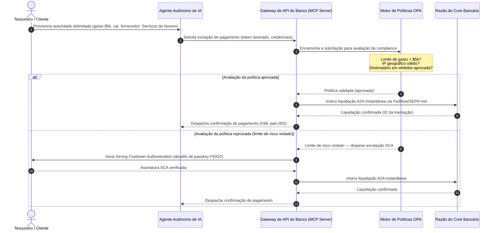

# Perspectivas Globais de Pagamentos 2026: Modelo Operacional, Risco e Receita em um Mundo Agêntico, Invisível e em Tempo Real

O ciclo global de pagamentos de 2026 é definido por três forças convergentes — comércio agêntico, pagamentos integrados invisíveis e execução em tempo real — assentadas sobre um razão unificado tokenizado no âmbito do Project Agorá e uma migração obrigatória do SWIFT para endereços estruturados em novembro de 2026.

<!-- lead-start -->
<aside class="post-lead" aria-label="Article summary">

<strong>Resumo executivo.</strong> O cenário de pagamentos de 2026 deixou de ser uma migração de mensageria e passou a um modelo operacional multidimensional em que risco e receita são ditados pela execução em tempo real. Este texto sintetiza as perspectivas de 2026 do J.P. Morgan, Global Payments, HSBC e Payments Association em um plano operacional para G-SIBs com quatro pilares, cobrindo comércio agêntico iniciado por modelos, APIs de tesouraria sempre ativas, razões unificados tokenizados sob o Project Agorá do BIS e o prazo de 14 de novembro de 2026 para endereços estruturados no SWIFT.

<strong>Principais conclusões</strong>

<ul class="post-lead-takeaways">
  <li><strong>O comércio agêntico abre uma fronteira de responsabilidade delegada.</strong> Projeta-se que agentes autônomos de IA intermediarão $3-$5 trillion em comércio anual até 2030. Os bancos precisam definir a gestão de acesso via MCP, a delegação de SCA sob PSD3/PSR e a titularidade de KYC/AML dentro de cadeias de pagamento com múltiplos agentes.</li>
  <li><strong>A liquidez sempre disponível tornou-se uma linha de base operacional e regulatória.</strong> APIs de tesouraria 24/7 e contas virtuais minimizam o caixa preso e elevam o patamar de resiliência. Sob a DORA, produtos de liquidez em tempo real precisam ser sustentados por infraestrutura geo-redundante e ativo-ativo capaz de sustentar 99.999% de disponibilidade.</li>
  <li><strong>A tokenização chegou aos razões unificados regulados.</strong> O Project Agorá é a maior estrutura público-privada para depósitos comerciais tokenizados e reservas de bancos centrais. Os bancos precisam de uma jornada de tokenização em cinco etapas, com tratamento prudencial explícito.</li>
  <li><strong>A migração para endereços estruturados em 14 de novembro de 2026 tem data firme.</strong> Campos de endereço postal não estruturados em mensagens CBPR+ e SEPA gerarão rejeições imediatas. Exige-se governança de dados limpa entre as equipes de produto, tecnologia e compliance.</li>
</ul>

<strong>Leitura relacionada:</strong> <a href="https://sebastienrousseau.com/2026-06-23-iso-20022-pain001-programmable-liquidity-autonomic-treasury-2026">From Pain.001 to Programmable Liquidity: ISO 20022 as the Autonomic Nervous System of Treasury in 2026</a>, <a href="https://sebastienrousseau.com/2026-06-24-cross-border-iso-20022-open-finance-tokenised-deposits-treasury-2026">Cross-Border 2026: ISO 20022, Open Finance and Tokenised Deposits in Corporate Treasury</a>, <a href="https://sebastienrousseau.com/2026-06-25-quantum-dawn-cib-kyberlib-quantum-resilient-payments-stack-2026">Quantum Dawn for CIB: From KyberLib to a Quantum-Resilient Payments Stack</a>.

</aside>
<!-- lead-end -->

Para os bancos transacionais globais, o ciclo de 2026-2028 é uma janela estrutural. A infraestrutura moderna de pagamentos deixou de ser um utilitário administrativo — ela é o núcleo da estratégia tecnológica de nível bancário. Dentro dos G-SIBs e das grandes instituições regionais, tecnologia, regulação e expectativa do cliente convergiram para um único plano operacional.

Três forças definem este ciclo, e cada uma se vincula diretamente a uma preocupação do C-Level.

- **Comércio agêntico** — distribuição por canais, desenho de produto, atribuição de responsabilidade e Gestão de Risco de Modelos sob escrutínio supervisório.
- **Pagamentos invisíveis** — experiência do cliente, com risco de desintermediação onde os bancos não conseguem embutir o razão nas interfaces de empresas e comerciantes.
- **Execução em tempo real** — velocidade do capital, com mudança consequente na gestão de liquidez, no risco de crédito, na resiliência operacional e na defesa contra fraudes.

As apostas financeiras são materiais. A fraude escala em velocidade e sofisticação; os prazos regulatórios são rígidos; e os bancos que modernizam proativamente seus sistemas centrais destravam oportunidades substanciais de receita por tarifas. O custo da inação é o oposto: rejeições imediatas de transações, gargalos operacionais, sanções regulatórias e erosão acelerada de participação de mercado.

## A convergência das autoridades globais de pagamentos

Este relatório sintetiza as perspectivas de pagamentos e comércio de 2026 produzidas por quatro vozes autoritativas do setor — [J.P. Morgan Payments](https://www.jpmorgan.com/payments/newsroom/payments-outlook-2026-trends-report-released "J.P. Morgan Payments — Outlook 2026"), [Global Payments](https://investors.globalpayments.com/news-events/press-releases/detail/497/global-payments-releases-its-2026-commerce-and-payment "Global Payments — 2026 Commerce and Payment Trends Report"), HSBC e The Payments Association — e as triangula com o [Roadmap do G20 para Aprimorar Pagamentos Transfronteiriços](https://www.fsb.org/2026/03/fsb-kicks-off-new-implementation-phase-to-enhance-cross-border-payments-through-public-private-partnership/ "FSB — cross-border payments implementation phase, March 2026").

Cada organização aborda o ecossistema sob um ângulo de mercado distinto, mas suas conclusões convergem em três invariantes.

1. **Os trilhos instantâneos orientados por API são a linha de base.** Modelos legados de processamento em lote ficam marginalizados nos fluxos transfronteiriços e de alto valor; a velocidade transacional nesses segmentos é ditada pela mensageria sempre ativa em tempo real.
2. **A IA é ameaça e defesa.** Ferramentas generativas e deepfakes escalam a fraude transacional, exigindo contradefesas de aprendizado de máquina multicamadas em tempo real.
3. **A tokenização é infraestrutura pronta para produção.** Os razões estão se unificando para hospedar passivos comerciais tokenizados e moedas digitais de banco central de atacado.

| Relatório | Público primário | Foco | Pilar central | Implicação para o banco |
| --- | --- | --- | --- | --- |
| **J.P. Morgan Payments** | Tesoureiros corporativos, G-SIBs | Liquidez em tempo real, fraude | APIs, biometria de IA | Reconstruir sistemas de liquidez, FX e risco para liquidação contínua de 365 dias. |
| **Global Payments** | Comerciantes, e-commerce | Evolução de POS, omnichannel | Comércio agêntico, checkout sem fricção | Construir corredores de pagamento seguros, com gateway de API, para agentes autônomos de IA. |
| **HSBC Insights** | Multinacionais | Integrações com ERP (SAP/Oracle), caixa em tempo real | Treasury-as-a-Service, visibilidade de caixa | Monetizar suítes de APIs transacionais e embutir o reporte do razão de caixa em tempo real na origem. |
| **The Payments Association** | Fintechs, instituições de pagamento | Stablecoins, tokenização, regulação global | Ativos digitais regulados, conformidade com políticas | Preparar balanços para depósitos tokenizados e navegar as estruturas de responsabilidade do PSD3/PSR. |

As quatro perspectivas definem, efetivamente, a pilha operacional do setor privado que roda sobre a infraestrutura de políticas públicas do G20, traduzindo a intenção regulatória em decisões concretas dentro dos bancos sobre liquidez, tokenização, dados e controle de fraude.

## Pilar 1 — Comércio agêntico e pagamentos invisíveis

O comércio agêntico é a transição do checkout dirigido por humanos, do clicar-para-comprar, para a iniciação autônoma de transações dirigida por modelos. As projeções do setor convergem para $3-$5 trillion de comércio anual intermediado por agentes autônomos até 2030 — uma fatia de um dígito baixo do volume global de pagamentos executado sem ninguém clicar em "comprar".

O ecossistema de varejo e comercial apresenta uma lacuna correspondente. Uma clara maioria dos consumidores hoje espera pagamentos quase sem fricção, mas menos de metade dos comerciantes priorizou o checkout em um clique ou catálogos de produtos acessíveis por API. Os agentes de IA não conseguem navegar telas legadas de checkout com múltiplas páginas pensadas para olhos humanos; precisam de handshakes estruturados via API, máquina-a-máquina.

### Prioridades bancárias e impacto operacional

- **Titularidade de KYC e AML.** Os bancos precisam definir quem detém a obrigação de compliance dentro de uma cadeia agêntica de transações. Se o agente pessoal de IA de um consumidor inicia uma transação no checkout agêntico de um comerciante, o banco precisa verificar se a autoridade delegada de origem está criptograficamente vinculada ao titular principal da conta.
- **Redesenho de responsabilidade e contestação.** Os esquemas de cartão e os trilhos A2A foram desenhados em torno da autorização humana. Quando um agente de IA faz uma compra equivocada — adquirindo inventário industrial incorreto por causa de um erro de parsing de dados, por exemplo — os bancos precisam alocar a responsabilidade com clareza entre consumidor, provedor do agente e comerciante.
- **Classificação de risco dos fluxos agênticos.** Os motores de roteamento de pagamento precisam classificar dinamicamente o risco dos pagamentos agênticos, aplicando exigências de reserva ou tarifas de interchange mais altas a transações não iniciadas por humanos enquanto não houver um histórico estável de liquidação.

### Ação delimitada e autoridade delimitada

Para mitigar a "ação não delimitada" — um agente corporativo de compras rodando um laço recursivo infinito de aquisição por causa de um bug de software — os bancos precisam implantar **gates de API com autoridade delimitada**. Esses gates aplicam limites de política em três dimensões.

1. **Limites financeiros em camadas** — gasto do agente restringido por tamanho de transação, valor cumulativo diário e categoria do comerciante.
2. **Salvaguardas sensíveis ao contexto** — sinais secundários (hora do dia, geolocalização por IP, frequência transacional) avaliados antes de o razão liberar fundos.
3. **Escalação com humano no laço** — autorização humana obrigatória disparada via Strong Customer Authentication (SCA) sob o PSD3 / PSR sempre que uma transação exceder limites de risco.

A sequência Mermaid abaixo mostra a arquitetura-alvo que muitos bancos reconhecerão como o fluxo de pagamento agêntico com autoridade delimitada.

### O Model Context Protocol (MCP)

Para conectar modelos locais de IA às camadas de execução governadas pelo banco, o setor está padronizando em torno do [Model Context Protocol (MCP)](https://modelcontextprotocol.io "Model Context Protocol — open standard for LLM tool integration") — um protocolo aberto que permite a LLMs invocarem ferramentas e APIs auditáveis com escopo claramente delimitado, sem acesso bruto aos sistemas centrais.

Encapsular APIs bancárias (iniciação de pagamento, consulta de saldo, verificação de contrapartes) dentro de um MCP server mantém os LLMs longe das tabelas do banco de dados e dos controles de root do sistema. O modelo interage com o razão apenas por meio de endpoints estruturados, auditados e com rate-limiting — segurança aplicada na fronteira da execução agêntica das ferramentas, em vez de enterrada dentro do modelo.

## Pilar 2 — Transformação da tesouraria e a liquidez reimaginada

A velocidade do transaction banking em 2026 é determinada pela mudança do processamento em lote de fim de dia para operações de tesouraria sempre ativas, em tempo real. As multinacionais não toleram mais caixa preso — liquidez parada em contas locais durante fins de semana ou feriados porque os sistemas de liquidação estão fechados.

### A tese econômica para a liquidez em tempo real

J.P. Morgan e HSBC relatam que as corporações com recursos avançados de caixa e dados em tempo real têm probabilidade materialmente maior de superar os pares em crescimento de receita e eficiência de capital, sobretudo ao reduzir a liquidez presa e otimizar os ciclos de capital de giro.

Para capturar esse valor, os bancos entregam **produtos de API Treasury-as-a-Service (TaaS)** que conectam os ERPs corporativos (SAP, Oracle) diretamente ao razão do banco.

- **APIs de saldo em tempo real** com o schema `camt.052` — substituindo protocolos de transferência de arquivos pelo reporte instantâneo, baseado em eventos, da posição de caixa.
- **APIs de iniciação de pagamentos em lote** com `pain.001` — execução direta e straight-through de batches de pagamentos a fornecedores a partir do razão do ERP.
- **APIs de FX contínuo** — motores de tesouraria travam taxas algorítmicas de câmbio em tempo real para liquidação transfronteiriça, eliminando o risco de gap de mercado overnight.
- **APIs de contas virtuais** — corporações abrem e encerram dinamicamente milhares de subcontas para conciliação automatizada de recebíveis e segregação no razão.

### Resiliência operacional e DORA

Oferecer liquidez sempre ativa transforma o perfil de risco do banco. A plataforma precisa sustentar **99.999% de disponibilidade operacional** sob carga contínua em tempo real.

Sob a [Digital Operational Resilience Act (DORA)](https://eur-lex.europa.eu/legal-content/EN/TXT/?uri=CELEX%3A32022R2554 "Regulation (EU) 2022/2554 — Digital Operational Resilience Act"), isso não é um KPI de TI — é uma exigência regulatória estrita. Os reguladores esperam que os bancos provem que a superfície de APIs da tesouraria em tempo real e o banco de dados do razão suportam ciberataques severos-mas-plausíveis, indisponibilidades de rede e disrupções de hyperscalers sem interromper pagamentos críticos ou comprometer a liquidez sistêmica. Isso exige arquiteturas de banco de dados multi-cloud geo-redundantes e ativo-ativo, camadas de detecção de ameaças em tempo real e failover automatizado — visíveis na linha de custo de mudança, não apenas no dossiê de auditoria.

### FX contínuo e inovação transfronteiriça

A tesouraria em tempo real não pode viver dentro de uma fronteira de moeda única. Os G-SIBs estão implantando infraestrutura de FX contínua — a plataforma [Wire 365](https://www.jpmorgan.com/insights/payments/fx-cross-border/wire-365-global-clearing "J.P. Morgan — Wire 365 global clearing reinvented") do J.P. Morgan processa pagamentos transfronteiriços e conversões cambiais em qualquer dia do ano, além do horário tradicional dos RTGS de bancos centrais. Essa camada se entrelaça diretamente com os sistemas de depósito tokenizado e razão unificado tratados no Pilar 3.

## Pilar 3 — Depósitos tokenizados e o razão unificado

A tokenização saiu de pilotos isolados de prova de conceito para uma infraestrutura monetária escalada, de nível bancário. O foco migrou de stablecoins privadas e criptoativos especulativos para **depósitos comerciais tokenizados** e **moedas digitais de banco central de atacado (wCBDCs)** rodando em razões unificados programáveis.

A estrutura de referência é o [Project Agorá](https://www.bis.org/about/bisih/topics/fmis/agora.htm "BIS Project Agorá — tokenisation of wholesale cross-border payments") — uma grande colaboração público-privada convocada pelo BIS e pelo IIF, envolvendo sete bancos centrais e mais de 40 instituições financeiras privadas. O projeto explora como depósitos comerciais tokenizados se integram a wCBDCs tokenizadas em um razão programável compartilhado, eliminando a fricção da liquidação transfronteiriça, coordenando verificações de compliance e habilitando a finalidade atômica 24/7.

### A jornada de tokenização em cinco etapas

Para G-SIBs e grandes bancos regionais, a tokenização é uma jornada gradual da otimização interna até a interoperabilidade em mercado aberto.

1. **Liquidez interna de tesouraria** — tokenizar saldos internos de caixa corporativo (por exemplo, JPM Coin ou razões equivalentes de bancos privados) para habilitar transferência e netting transfronteiriços instantâneos 24/7 entre as próprias filiais do banco.
2. **Corredores multibancos delimitados** — consórcios fechados e regulados (a sandbox do Project Agorá) para testar a liquidação interbancária e o estado compartilhado do razão entre instituições distintas.
3. **FX programável contínuo** — smart contracts no razão unificado executam FX Payment-versus-Payment (PvP) instantâneo, eliminando o risco de liquidação entre fusos horários.
4. **Ativos do mundo real tokenizados (RWAs)** — a perna de caixa tokenizada se integra aos razões tokenizados de títulos, dívida ou trade para finalidade Delivery-versus-Payment (DvP) instantânea, reduzindo a imobilização de capital de dias para milissegundos.
5. **Interoperabilidade pública/híbrida regulada** — gateways seguros permitem que a liquidez institucional interaja com segurança com redes públicas abertas.

### Implicações prudenciais e de balanço

A liquidação em caixa tokenizado precisa ser conduzida com cuidado pelos arcabouços prudenciais. Os supervisores reforçam que um depósito tokenizado precisa ser economicamente equivalente a um depósito comercial tradicional — ou seja, um passivo não garantido no balanço do banco com a mesma cobertura de garantia de depósitos.

Operacionalmente, os depósitos tokenizados introduzem riscos que os modelos clássicos de estresse de liquidez não foram concebidos para simular. Smart contracts executam saques programáveis em velocidades e volumes que as premissas legadas não capturam. Sob o Basel III, os bancos precisam garantir que o motor de risco modele run-offs programáveis de caixa e que o razão tokenizado interopere de forma limpa com os sistemas RTGS legados ao longo do ciclo diário de liquidez.

### Stablecoins versus depósitos tokenizados — uma posição matizada

As stablecoins privadas integralmente lastreadas (USDC, etc.) continuam ganhando participação no envio transfronteiriço de varejo e no comércio descentralizado, mas não têm capacidade de criação de crédito nem a finalidade de liquidação do sistema bancário comercial.

Em vez de competirem nos trilhos de varejo, os bancos transacionais estão estruturando custódia, emitindo seus próprios instrumentos de passivo tokenizado regulado e construindo gateways seguros de on/off-ramp. Os clientes corporativos ganham flexibilidade de programação mantendo o capital dentro do perímetro regulado.

### Perguntas que um conselho deveria fazer sobre dinheiro tokenizado

- **Participação em razão unificado.** Qual é nosso roadmap estratégico ativo para participar de iniciativas público-privadas de razão unificado de atacado, como o Project Agorá?
- **Modelagem de balanço e risco.** Nossos motores de risco e arcabouços de adequação de capital atualizaram os testes de estresse para incorporar a velocidade dos run-offs de tokens disparados por smart contracts?
- **Segmentos de clientes pioneiros.** Quais segmentos de tesouraria corporativa e commercial banking se beneficiariam imediatamente de liquidação DvP/PvP programável e tokenizada?

## Pilar 4 — Dados estruturados e defesa contra fraudes

O compliance de infraestrutura em 2026 é dominado pela **migração para endereços estruturados em 14 de novembro de 2026** estabelecida no [SWIFT Standards Release (SR) 2026](https://www.swift.com/standards/iso-20022/removal-unstructured-address "SWIFT — Removal of unstructured address, November 2026"). A partir dessa data, as redes de pagamento CBPR+ e SEPA deixam de aceitar blocos de endereço postal totalmente não estruturados em texto livre (`<AdrLine>`) nas mensagens de pagamento. Qualquer mensagem transfronteiriça ou doméstica que carregue um endereço não estruturado onde se esperam elementos estruturados será atrasada ou rejeitada pela rede.

A maioria das instituições conhece a data. Muitas a tratam como um exercício superficial de mapeamento na camada de interface. A realidade é um desafio mais profundo de qualidade e governança de dados. Para evitar taxas catastróficas de rejeição, as operações de pagamento precisam de uma estrutura clara de governança transversal.

- **Produto e operações.** Captura de dados na origem. Portais digitais voltados ao cliente, interfaces de onboarding e campos de entrada nos ERPs corporativos precisam impor campos de endereço estruturado (`<StrtNm>`, `<PstCd>`, `<TwnNm>`, `<Ctry>`) no momento da iniciação do pagamento.
- **Tecnologia.** Parsing, mapeamento, validação de schema. Motores de validação bloqueiam arquivos legados antes de atingirem a interface SWIFT. Modelos de aprendizado de máquina implantados localmente fazem o parsing dos blocos legados de endereço não estruturado para tags em conformidade com XML sob `<PstlAdr>`.
- **Compliance e risco.** Triagem de sanções, monitoramento de transações e lógica de AML atualizadas para ingerir os campos estruturados em XML — reduzindo as taxas de falsos positivos e as investigações manuais.

### A tese de negócio para dados estruturados

Tratado como custo de compliance, o programa de dados estruturados é caro. Tratado como habilitador de receita, ele se paga.

1. **Tomada de decisão de crédito avançada.** Dados estruturados de fatura, remessa e devedor final permitem aos bancos construírem programas automatizados e precisos de financiamento de capital de giro e factoring de faturas em cadeia de suprimentos para clientes corporativos.
2. **Conciliação automatizada de recebíveis.** Expor identificadores estruturados de contrapartes e faturas sustenta produtos premium de conciliação de caixa e pooling de contas virtuais, gerando nova receita de tarifas transacionais.
3. **Analytics transacional monetizável.** Os bancos empacotam e vendem dashboards granulares de liquidez em tempo real e padrões de compras a CFOs corporativos e tesoureiros.

### Uma defesa antifraude em IA em camadas

Conforme a velocidade transacional acelera para o tempo real, as técnicas de fraude escalam. Pesquisas recentes indicam que deepfakes respondem por cerca de 40 % das tentativas de fraude biométrica, com mídia sintética sendo cada vez mais usada para burlar controles de reconhecimento facial e de voz em onboarding e em fluxos de pagamento.

A defesa é um **modelo antifraude de IA em três camadas**.

1. **Camada de identidade.** Passkeys [FIDO2](https://fidoalliance.org/fido2/ "FIDO Alliance — FIDO2 specification") com verificação biométrica, vinculação criptográfica de hardware ao dispositivo e carteiras descentralizadas de ID digital para proteger o acesso ao pagamento.
2. **Camada comportamental.** Biometria comportamental contínua — ritmo de navegação na sessão, cadência de digitação, orientação do dispositivo — para detectar execução automatizada por bots ou tentativas de sequestro de sessão.
3. **Camada transacional.** Os campos estruturados do ISO 20022 alimentam motores de risco de aprendizado de máquina em tempo real, cruzando metadados de transação com inteligência consorciada em nível de rede para identificar transações suspeitas em milissegundos a partir da iniciação.

Para satisfazer os supervisores, os modelos de IA da camada transacional incorporam **parâmetros estritos de explicabilidade** e operam sob um programa dedicado de Gestão de Risco de Modelos (MRM). Os reguladores esperam que os bancos expliquem os pontos de dado específicos e a lógica algorítmica que dispararam um bloqueio automático ou um alerta de fraude, em linha com o [SR 11-7 do US Federal Reserve](https://www.federalreserve.gov/frrs/guidance/supervisory-guidance-on-model-risk-management.htm "US Federal Reserve — Supervisory Guidance on Model Risk Management, SR 11-7") e com o [PRA SS1/23](https://www.bankofengland.co.uk/prudential-regulation/publication/2023/may/model-risk-management-principles-for-banks-ss "Bank of England PRA SS1/23 — Model Risk Management principles for banks") do Bank of England.

## Agenda para o conselho 2026-2028

Para executar nos quatro pilares, os órgãos de gestão de G-SIBs e bancos regionais precisam organizar investimentos operacionais e tecnológicos ao longo de um roadmap claro de três horizontes.

### Horizonte 1 — Compliance imediato e fortalecimento do core (0-12 meses)

- **Foco.** Padronizar a qualidade dos dados ISO 20022 e proteger os caminhos básicos de transação em tempo real.
- **Indicador de sucesso (KPI).** Zero rejeições por endereço não estruturado no SWIFT e SEPA após a migração de 14 de novembro de 2026.
- **Responsável executivo.** Chief Operating Officer / Head of Payment Operations.
- **Tipo de entregável.** Movimento sem arrependimento. Atualizações de schema dos bancos de dados centrais e o motor de validação SWIFT SR 2026.

### Horizonte 2 — Automação e salvaguardas agênticas (12-24 meses)

- **Foco.** Gates de API agêntica com autoridade delimitada e arquitetura contínua de defesa antifraude.
- **Indicador de sucesso (KPI).** 100 % das transações de API máquina-a-máquina e iniciadas por IA validadas via vinculação de hardware FIDO2 e motores de política de autoridade delimitada.
- **Responsável executivo.** Chief Information Officer / Chief Risk Officer.
- **Tipo de entregável.** Movimento sem arrependimento (defesa antifraude) somado a opção estratégica (comércio agêntico). Implantação de MCP e a IA antifraude de três camadas.

### Horizonte 3 — Tokenização da plataforma e razões unificados (24-36 meses)

- **Foco.** Migrar ativos de tesouraria para depósitos tokenizados e participar de razões transfronteiriços compartilhados.
- **Indicador de sucesso (KPI).** Ao menos 15 % do volume de liquidação de tesouraria corporativa de alto valor processado nativamente via instrumentos de depósito tokenizado ou arranjos de razão unificado (por exemplo, corredores do Project Agorá).
- **Responsável executivo.** Group Treasurer / Head of Transaction Banking.
- **Tipo de entregável.** Opção estratégica. Infraestrutura de razão programável, regras de liquidez em smart contracts, adaptadores de liquidação DvP/PvP.

## FAQ

**O comércio agêntico realmente atingirá $3-$5 trillion até 2030?**
A linha de base da McKinsey aponta para $5 trillion em vendas de comércio agêntico até 2030, com uma série de projeções independentes se concentrando entre $3 trillion e $5 trillion. A variância reflete a agressividade com que os comerciantes entregam APIs de checkout legíveis por máquina e a velocidade com que os bancos permitem que agentes transacionem sob delegação de SCA — o gargalo está do lado do banco e do comerciante, não da capacidade do agente.

**A migração SWIFT de 14 de novembro de 2026 também se aplica aos fluxos SEPA domésticos?**
Sim. A exigência de endereço estruturado se aplica ao CBPR+ transfronteiriço e às mensagens de pagamento SEPA. Bancos que operam ambos os trilhos precisam de um único schema canônico de endereço a montante da interface SWIFT, não de dois mapeamentos paralelos.

**Um depósito tokenizado é o mesmo que uma stablecoin?**
Não. Um depósito tokenizado é um passivo não garantido no balanço de um banco regulado, com a mesma cobertura de garantia de depósitos de um depósito tradicional. Uma stablecoin é, tipicamente, um instrumento integralmente lastreado emitido por uma não-instituição bancária, sem capacidade de criação de crédito. O desenho do Project Agorá assume que depósitos tokenizados coexistem com wCBDCs em um razão programável compartilhado; as stablecoins não figuram na perna de liquidação de atacado.

**Como o Project Agorá se relaciona com os pilotos existentes de wCBDC?**
O Agorá é a estrutura integradora. Os experimentos nacionais de wCBDC cobrem a perna do dinheiro de banco central; o Agorá traz os depósitos comerciais tokenizados para o mesmo razão programável para que a liquidação transfronteiriça seja atômica entre os dois tipos de moeda. Os sete bancos centrais participantes e mais de 40 instituições privadas o tornam o maior terreno público-privado de desenho da arquitetura de dinheiro tokenizado de atacado.

**Qual a postura mínima de conformidade com a DORA para uma API TaaS?**
Implantação ativo-ativo geo-redundante, cenários cibernéticos severos-mas-plausíveis documentados com responsáveis nomeados sob o SM&CR (Reino Unido) e failover testado que não interrompa pagamentos críticos. Sem isso, o produto TaaS é um passivo regulatório antes de ser uma linha de receita.

## Referências

- Bank for International Settlements (BIS) Innovation Hub. (2026). *Project Agorá: exploring tokenisation of wholesale cross-border payments*. [BIS Project Agorá](https://www.bis.org/about/bisih/topics/fmis/agora.htm).
- Deutsche Bank. (2026). *Digital Money: a perspective on stablecoins, tokenised deposits and CBDCs*. [Deutsche Bank Flow](https://flow.db.com/publications/flow-white-papers-and-guides/digital-money-a-perspective-on-stablecoins-tokenised-deposits-and-cbdcs).
- European Parliament and Council. (2022). *Regulation (EU) 2022/2554 on Digital Operational Resilience (DORA)*. [DORA Regulation](https://eur-lex.europa.eu/legal-content/EN/TXT/?uri=CELEX%3A32022R2554).
- Financial Stability Board. (2026). *FSB kicks off new implementation phase to enhance cross-border payments*. [FSB statement](https://www.fsb.org/2026/03/fsb-kicks-off-new-implementation-phase-to-enhance-cross-border-payments-through-public-private-partnership/).
- Global Payments. (2025). *2026 Commerce and Payment Trends Report — press release*. [Global Payments press release](https://investors.globalpayments.com/news-events/press-releases/detail/497/global-payments-releases-its-2026-commerce-and-payment).
- J.P. Morgan Payments. (2026). *Payments Outlook 2026 Trends Report Released*. [J.P. Morgan Newsroom](https://www.jpmorgan.com/payments/newsroom/payments-outlook-2026-trends-report-released).
- J.P. Morgan Insights. (2026). *5 Payment Trends to Watch for in 2026*. [J.P. Morgan Trends](https://www.jpmorgan.com/insights/payments/trends-innovation/five-payment-trends-in-2026).
- J.P. Morgan FX & Cross-Border. (2026). *Wire 365: Global Clearing Reinvented*. [J.P. Morgan FX Wire 365](https://www.jpmorgan.com/insights/payments/fx-cross-border/wire-365-global-clearing).
- SWIFT. (2026). *ISO 20022 milestone for November 2026: unstructured addresses to be removed*. [SWIFT ISO 20022 Milestone](https://www.swift.com/news-events/news/iso-20022-milestone-november-2026-unstructured-addresses-be-removed).
- SWIFT Standards. (2026). *Removal of unstructured address*. [SWIFT Standards](https://www.swift.com/standards/iso-20022/removal-unstructured-address).
- Bank of England. (2023). *Supervisory Statement (SS1/23) — Model Risk Management principles for banks*. [Bank of England PRA SS1/23](https://www.bankofengland.co.uk/prudential-regulation/publication/2023/may/model-risk-management-principles-for-banks-ss).
- US Federal Reserve. (2011). *Supervisory Guidance on Model Risk Management (SR 11-7)*. [SR 11-7](https://www.federalreserve.gov/frrs/guidance/supervisory-guidance-on-model-risk-management.htm).
- McKinsey & Company. (2025). *McKinsey forecast: $5 trillion in agentic commerce sales by 2030* (via Digital Commerce 360). [McKinsey agentic forecast](https://www.digitalcommerce360.com/2025/10/20/mckinsey-forecast-5-trillion-agentic-commerce-sales-2030/).
- HSBC Business. (2026). *HSBC Business Insights*. [HSBC Insights](https://www.business.hsbc.com/en-gb/insights).
- Bright Defense. (2026). *Deepfake Statistics: A Growing Security Concern*. [Deepfake fraud statistics](https://www.brightdefense.com/resources/deepfake-statistics/).
- European Banking Authority. (2019). *Guidelines on outsourcing arrangements (EBA/GL/2019/02)*. [EBA Outsourcing Guidelines](https://www.eba.europa.eu/regulation-and-policy/internal-governance/guidelines-on-outsourcing-arrangements).

<!-- enrich-start -->
<aside class="author-card" aria-label="About the author"><strong class="author-card-name"><a href="/about/index.html">Sebastien Rousseau</a></strong>Tecnólogo bancário sênior que escreve sobre IA aplicada, migração para ISO 20022, criptografia pós-quântica para serviços financeiros e a transformação estrutural dos pagamentos de atacado.Mais de 20 anos no HSBC Commercial &amp; Investment Bank, PayPal, Barclays, Shazam, AKQA, Virgin Group. <a href="/about/index.html">Perfil completo</a> &middot; <a href="https://www.linkedin.com/in/sebastienrousseau/" rel="external noopener">LinkedIn</a> &middot; <a href="https://github.com/sebastienrousseau" rel="external noopener">GitHub</a></aside>

Última revisão em <time datetime="2026-06-25">2026-06-25</time>.

<!-- enrich-end -->
