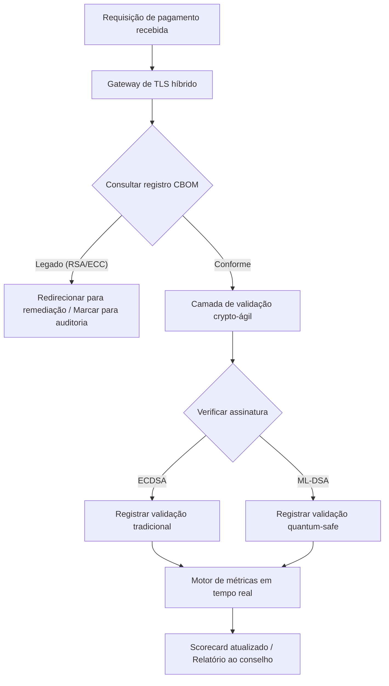

# Scorecard de Segurança Pós-Quântica 2026: framework de métricas em nível de conselho para a agilidade criptográfica fiduciária

<aside class="post-lead" aria-label="Resumo do artigo">

<strong>TL;DR.</strong> Em junho de 2026, a criptografia pós-quântica (PQC) deixou de ser preocupação técnica experimental e tornou-se obrigação fiduciária primária. Os conselhos precisam agora supervisionar a migração sistemática da criptografia legada para os padrões NIST FIPS 203 e 204, mitigando riscos financeiros e operacionais sistêmicos sob o DORA.

<strong>Pontos-chave</strong>

<ul class="post-lead-takeaways">
  <li><strong>Alinhamento G20 e prazos rígidos.</strong> Reguladores internacionais fixaram o final da década como prazo rígido para transições quantum-safe, exigindo das instituições progresso de migração quantificável.</li>
  <li><strong>O Cryptographic Bill of Materials (CBOM).</strong> Análogo a um software BOM, um CBOM é um inventário vivo e automatizado de todos os ativos criptográficos, necessário para garantir visibilidade ao longo da cadeia de suprimentos.</li>
  <li><strong>Exposição Harvest-Now-Decrypt-Later (HNDL).</strong> Adversários estão interceptando e armazenando dados criptografados de pagamentos atacadistas de alto valor; mitigar essa ameaça exige deployment imediato de arquiteturas PQC híbridas.</li>
  <li><strong>Governança fiduciária via crypto-agilidade.</strong> Crypto-agilidade é métrica de governança mensurável. A capacidade de trocar primitivas criptográficas sem reengenharia do sistema central (usando bibliotecas como a KyberLib) é hoje responsabilidade em nível de conselho sob o SM&CR.</li>
</ul>

<strong>Leituras relacionadas:</strong> <a href="https://sebastienrousseau.com/2026-06-12-kyberlib-post-quantum-banking-migration-standards-code-2026">KyberLib e a migração bancária pós-quântica em 2026</a>, <a href="https://sebastienrousseau.com/2023-11-19-crystals-kyber-the-safeguarding-algorithm-in-a-quantum-age/index.html">CRYSTALS-Kyber: o algoritmo de proteção na era quântica</a>.

</aside>
A segurança pós-quântica não é mais um projeto de pesquisa. O "relógio supervisório" avança em direção aos prazos de aplicação do final da década. A finalização do [NIST FIPS 203 (ML-KEM)](https://csrc.nist.gov/pubs/fips/203/final) e do [NIST FIPS 204 (ML-DSA)](https://csrc.nist.gov/pubs/fips/204/final) codificou os padrões para encapsulamento de chaves e assinaturas digitais.

Os órgãos reguladores agora esperam que bancos Tier-1 ultrapassem programas piloto. Em 2026, o foco mudou para a industrialização desses padrões. A incapacidade de demonstrar um caminho claro de migração acarreta penalidades regulatórias significativas sob o [Digital Operational Resilience Act (DORA)](https://eur-lex.europa.eu/eli/reg/2022/2554/oj) e potencial responsabilidade pessoal para diretores que ignorem a ameaça previsível de descriptografia habilitada pelo quântico.

## 01. O Scorecard Quântico em Nível de Conselho

As métricas a seguir entregam um framework padronizado para que conselhos avaliem prontidão quântica e saúde criptográfica em todo o parque de Commercial and Investment Banking (CIB).

### Tabela 1: métricas e tolerâncias do scorecard PQC

| Métrica | Fórmula matemática | Tolerâncias aprovadas pelo conselho | Risco fora da tolerância |
| ---- | ---- | ---- | ---- |
| **Inventory Completeness Percentage (ICP)** | (Ativos Criptográficos Identificados / Total Estimado de Ativos) × 100 | > 98% | Criptografia paralela e pontos cegos em caminhos de compensação de alto valor. |
| **HNDL Exposure Rate (HER)** | (Dados de Longa Duração em Criptografia Legada / Total de Dados de Longa Duração) × 100 | < 5% | Comprometimento permanente de segredos comerciais, livros de dívida soberana e registros de pagamentos atacadistas. |
| **NIST Migration Progress Rate (MPR)** | (Sistemas rodando FIPS 203/204 / Total de Sistemas Críticos) × 100 | > 60% (até o fim de 2026) | Não conformidade regulatória e exclusão de contrapartes alinhadas ao G20. |
| **Crypto-Agility Readiness Index (CARI)** | (Aplicações com Camadas Criptográficas Abstratas / Total de Aplicações Core) × 100 | > 85% | Dívida técnica severa e incapacidade de responder a futuras descontinuações de algoritmos. |

## 02. O Cryptographic Bill of Materials (CBOM)

A métrica ICP é estabelecida por meio de uma **fase de descoberta CBOM** abrangente. Trata-se de um processo automatizado que identifica todos os endpoints criptográficos dentro da empresa.

- **Descoberta de endpoints:** varredura de redes internas e cloud em busca de sessões TLS ativas para identificar uso legado de RSA ou ECC.
- **Inventário de chaves:** mapeamento de pares de chaves pública/privada para seus respectivos donos e suas datas exatas de expiração.
- **Mapeamento de dependências:** identificação de bibliotecas e APIs de terceiros que dependem de algoritmos descontinuados.

Essa fase de descoberta cria uma única fonte da verdade, permitindo que o CISO reporte saúde criptográfica com a mesma granularidade do desempenho financeiro.

## 03. Eliminando a exposição HNDL em pagamentos atacadistas

Adversários atacam ativamente pagamentos atacadistas e bases corporativas de dados de longa duração. Esses ataques "Harvest-Now-Decrypt-Later" (HNDL) envolvem a interceptação e o arquivamento do tráfego criptografado de hoje.

Mesmo que um cryptographically relevant quantum computer (CRQC) não exista hoje, os dados interceptados agora estarão vulneráveis no futuro. Mitigar isso exige migração de alta prioridade dos dados de longa duração (por exemplo, registros de identidade, contratos de bonds de 30 anos e arquivos jurídicos), o que reduz diretamente a métrica HER. Atualizar canais de pagamento para criptografia híbrida PQC-tradicional (usando ML-KEM em conjunto com X25519) fornece defesa imediata contra ameaças de arquivamento.

## 04. Operacionalizando a crypto-agilidade por meio de interfaces bem projetadas

Crypto-agilidade se concretiza por meio de abstrações de engenharia. Bibliotecas modernas como a [KyberLib](https://sebastienrousseau.com/2026-06-12-kyberlib-post-quantum-banking-migration-standards-code-2026) demonstram como desenvolvedores podem implementar módulos quantum-safe sem reescrever toda a pilha aplicacional.

- **Wrappers abstratos:** aplicações chamam uma função genérica `encrypt()` ou `sign()` em vez de rotinas específicas de algoritmo.
- **Troca em runtime:** o módulo subjacente pode ser substituído de ECDSA para ML-DSA via mudança de configuração, em vez de deployments de código complexos.

Essa arquitetura garante que, se um algoritmo PQC específico for comprometido no futuro, a organização possa girar em horas, não em anos.

## 05. O workflow de validação de ingress quantum-safe

O diagrama a seguir ilustra o ciclo de vida dos dados que entram no perímetro seguro em um ambiente bancário quantum-ágil.

## Conclusão

O parque criptográfico de um banco Tier-1 não é mais assunto do CISO. É infraestrutura fiduciária. NIST FIPS 203 e 204 fixam os algoritmos; o Artigo 5 do DORA fixa a superfície de responsabilidade; o SM&CR a prende a um gestor sênior nomeado. O scorecard acima — Inventory Completeness, HNDL Exposure, Migration Progress, Crypto-Agility — entrega ao conselho os quatro números necessários para governar esse parque sem precisar ler o código criptográfico.

O número que mais importa é o HNDL Exposure. Todo registro com criptografia legada que hoje está parado em um arquivo de pagamentos atacadistas será legível no dia em que o primeiro cryptographically relevant quantum computer for entregue. A contagem regressiva é silenciosa e assimétrica: defensores só conseguem agir sobre os dados que possuem, adversários conseguem agir sobre dados que já exfiltraram anos atrás. Um contrato de bond corporativo de 30 anos criptografado com RSA-2048 em 2024 é um contrato que perde sua garantia de confidencialidade no dia em que um CRQC entrar em operação.

A [KyberLib](https://sebastienrousseau.com/2026-06-12-kyberlib-post-quantum-banking-migration-standards-code-2026) e seus pares transformam isso de uma reescrita de plataforma de múltiplos anos em uma mudança de configuração. A função do conselho não é escrever o código. A função do conselho é exigir que o Crypto-Agility Readiness Index — a parcela de aplicações core por trás de uma interface criptográfica abstrata — atravesse os 85 % em doze meses, e ler o scorecard trimestral.

<aside class="author-card" aria-label="Sobre o autor"><strong class="author-card-name"><a href="/about/index.html">Sebastien Rousseau</a></strong>Tecnólogo bancário sênior escrevendo sobre AI aplicada, migração para ISO 20022, criptografia pós-quântica para serviços financeiros e a transformação estrutural dos pagamentos atacadistas.20+ anos entre HSBC Commercial & Investment Bank, PayPal, Barclays, Shazam. <a href="https://www.linkedin.com/in/sebastienrousseau/" rel="external noopener">LinkedIn</a> &middot; <a href="https://github.com/sebastienrousseau" rel="external noopener">GitHub</a></aside>

Última revisão <time datetime="2026-06-29">2026-06-29</time>.

