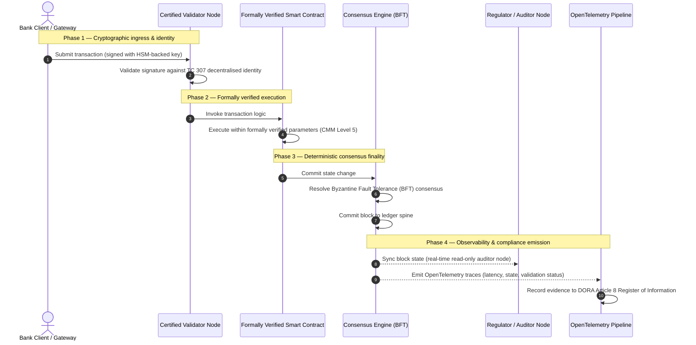

# Da evidência à verdade: por que as blockchains certificadas definirão a próxima era da confiança bancária

## Resumo estratégico (o essencial)

O banco de atacado e as transações globais encontram-se, em 2026, em um ponto de inflexão histórico. À medida que os serviços financeiros migram para redes de compensação nativamente digitais e em tempo real, e à medida que a inteligência artificial introduz um não determinismo probabilístico, os modelos de asseguração tradicionais — analógicos e retrospectivos (como as auditorias estáticas baseadas na entidade) — deixam de atender às exigências modernas de gestão de riscos e de responsabilidade fiduciária.

O Comitê Técnico ISO/IEC TC 307 estabeleceu uma base normalizada para as tecnologias de registro distribuído. No entanto, uma verdadeira adoção institucional exige a passagem de uma orientação descritiva para uma asseguração de blockchain prescritiva e certificável de forma independente. Ao pontuar a governança do registro, a integridade do consenso, a segurança dos contratos inteligentes e a agilidade criptográfica em relação a um rigoroso Modelo de Maturidade de Capacidades (CMM) de cinco níveis, os bancos podem sair de suposições fragmentadas e específicas de cada fornecedor para uma verdade financeira certificável e auditável pelo conselho.

## Pontos principais

* **A lacuna de atrito fiduciário**: hoje sabemos certificar o banco (Basileia III), a nuvem (ISO 27001) e os sistemas de governança de IA (ISO 42001), mas ainda não sabemos certificar o registro distribuído que cada vez mais determina o que é verdadeiro. Essa assimetria é uma vulnerabilidade operacional de primeira ordem.  
* **A DORA impõe responsabilidade fiduciária direta**: nos termos do artigo 5 da DORA, os conselhos de administração dos bancos assumem responsabilidade pessoal direta e indelegável pela resiliência operacional de todas as implantações de terceiros e de registros, com severas sanções pessoais no âmbito do regime SM&CR em caso de falha.  
* **A espinha dorsal de auditoria da IA**: onde o aprendizado de máquina produz resultados probabilísticos e não reproduzíveis, uma blockchain certificada fornece uma captura determinística de estado. Registrar on-chain as versões dos modelos, as entradas e as decisões de validação satisfaz a ISO 42001 e os padrões de gestão do risco de modelo.  
* **O Índice de Blockchains Certificadas**: este índice formaliza governança, consenso, contratos inteligentes e observabilidade em um scorecard verificável e pronto para auditoria, em uma escala CMM de 0 a 5, traduzindo métricas de engenharia em declarações de apetite ao risco aprovadas pelo conselho.

## 01. A lacuna de atrito fiduciário no banco digital

No banco clássico, a confiança é relacional, institucional e retrospectiva. Depende de auditores terceiros independentes que examinam o estado financeiro em instantes fixos, reconciliando discrepâncias entre silos de registros bilaterais. Nos mercados em tempo real e orientados por API de 2026, esse modelo introduz latências proibitivas e riscos estruturais.

Quando as transações são liquidadas instantaneamente, as reservas de liquidez intradiária são geridas dinamicamente por gateways de API e a propriedade dos ativos é tokenizada em registros compartilhados, as auditorias retrospectivas tornam-se exercícios forenses em vez de controles preventivos. Os fiduciários não podem mais se limitar a certificar a entidade jurídica. Precisam certificar o próprio substrato digital.

Atualmente, os bancos operam sob uma assimetria arquitetural flagrante:

1. **Infraestrutura de nuvem certificada**: os nós de hardware, os contêineres virtualizados e os data centers físicos são validados em relação aos controles ISO/IEC 27001 e SOC 2 Type II.  
2. **Processos de gestão certificados**: as políticas de risco operacional, os planos de continuidade de negócios e as implantações algorítmicas são regidos por estruturas de risco rigorosas.  
3. **Motores de registro não certificados**: os mecanismos de consenso distribuído, as cadeias de suprimentos dos nós validadores, os limites dos contratos inteligentes e os modelos de governança de rede ficam sujeitos a suposições não certificadas, sob medida ou específicas de cada consórcio.

Essa assimetria é um ponto de falha crítico. Um banco pode executar um aplicativo validado dentro de um contêiner de nuvem seguro e certificado ISO 27001, mas se esse contêiner gravar em um registro distribuído com controle centralizado de validadores, parâmetros de consenso vulneráveis ou contratos inteligentes não auditados, a integridade da transação fica comprometida. Para fechar essa lacuna, o próprio motor de registro precisa se tornar um objeto de asseguração certificável.

## 02. A base de normalização ISO/IEC TC 307

O trabalho de base necessário para normalizar os registros distribuídos é conduzido pelo Comitê Técnico ISO/IEC TC 307 (Tecnologias de blockchain e de registro distribuído). Em vez de tratar a blockchain como um protocolo técnico isolado, o TC 307 a aborda como uma infraestrutura de confiança institucional, organizando seu trabalho em cinco pilares fundamentais:

1. **Taxonomia e vocabulário (ISO 22739)**: estabelece uma nomenclatura comum, garantindo definições jurídicas e operacionais coerentes entre jurisdições, esquemas financeiros e instituições.  
2. **Arquitetura de referência (ISO/TR 23245)**: define os limites, camadas, fluxos de dados e componentes funcionais de um sistema de registro distribuído conforme.  
3. **Segurança, privacidade e contratos inteligentes (ISO/TR 23244 / ISO 23613)**: estabelece diretrizes de segurança de base para sistemas de ativos digitais e detalha as melhores práticas para a mitigação de vulnerabilidades dos contratos inteligentes e a governança de seu ciclo de vida.  
4. **Estruturas de interoperabilidade**: aborda os mecanismos de troca de dados e ativos entre redes de registro heterogêneas, evitando a formação de silos tokenizados isolados.  
5. **Identidade descentralizada e âncoras de confiança**: integra os identificadores criptográficos baseados no registro a infraestruturas de chave pública (PKI) formais e registros autorizados pelo Estado.

No conjunto, o TC 307 sinaliza a transição da DLT de uma escolha de engenharia sob medida para uma disciplina arquitetural normalizada. Contudo, o TC 307 permanece essencialmente descritivo. Define como é a excelência (orientação), mas não fornece o protocolo de verificação prescritivo (asseguração) de que os responsáveis por risco e os supervisores precisam para autorizar implantações em produção de funções críticas ou importantes (CIF).

## 03. Orientação versus asseguração: a distinção fiduciária

Os participantes dos mercados financeiros não adotam uma tecnologia por ser inovadora ou elegante; adotam-na quando ela pode ser governada, auditada, defendida e reconciliada com os requisitos de reserva de capital. Por isso a normalização bancária se resolve naturalmente em duas camadas:

* **Orientação (a estrutura)**: descreve as melhores práticas, as metas de referência e as diretrizes arquiteturais (por ex. ISO/IEC TC 307, estruturas do NIST).  
* **Asseguração (a prova)**: fornece evidências independentes, contínuas e verificáveis por terceiros de que a estrutura está implementada e funcionando conforme projetado (por ex. certificação ISO 27001, auditorias SOC 2, exames regulatórios).

Apoiar-se em um consenso de registro não certificado enquanto se certifica a infraestrutura de nuvem é uma lacuna regulatória crítica. Uma blockchain "imutável" não é necessariamente "institucionalmente confiável". A imutabilidade garante apenas que o dado inserido permaneça inalterado; não verifica se os nós validadores são seguros, se o protocolo de consenso é resiliente à conluio, se a lógica dos contratos inteligentes é matematicamente sólida ou se a gestão de chaves criptográficas cumpre os mandatos pós-quânticos.

Para fechar essa lacuna, o Índice de Blockchains Certificadas 2026 formaliza esses requisitos em um Modelo de Maturidade de Capacidades (CMM) quantificável, mapeado às regulamentações bancárias mundiais.

## 04. O Índice de Blockchains Certificadas 2026

Para que a alta administração possa avaliar e certificar suas plataformas de registro, este índice estrutura a infraestrutura de registro distribuído em cinco camadas operacionais auditáveis, pontuadas em uma escala CMM de 0 a 5.

## Tabela 1: a arquitetura do Índice de Blockchains Certificadas

| Camada do índice | Nível de maturidade (CMM) | Métrica técnica e operacional | Referência de controle regulatório / fiduciário |
| :---- | :---- | :---- | :---- |
| **Governança do registro** | **Nível 0**: consórcio ad hoc**Nível 3**: verificação e rotação automatizadas de validadores**Nível 5**: ancoragem de identidade criptográfica descentralizada e multipartidária | % de nós validadores operados por entidades financeiras verificadas; tempo médio de resolução de disputas entre validadores; distribuição geográfica dos nós | **DORA artigo 5** (Governança e organização); **CPMI-IOSCO PFMI Princípio 2** (Governança) e **Princípio 3** (Estrutura para a gestão integral de riscos) |
| **Integridade do consenso** | **Nível 0**: nó único ou PoW opaco**Nível 3**: BFT auditado com finalidade determinística**Nível 5**: consenso multijurisdicional, formalmente verificado, com monitoramento contínuo da latência | latência de consenso máxima tolerável; limiar de resistência à conluio; SLA de disponibilidade sob partição simulada de nós | **DORA artigo 6** (Estrutura de gestão do risco de TIC); **CPMI-IOSCO PFMI Princípio 8** (Definitividade da liquidação) |
| **Identidade e criptografia** | **Nível 0**: chaves RSA / ECDSA fracas**Nível 3**: multiassinatura com gestão de chaves apoiada por HSM**Nível 5**: chaves híbridas resistentes ao quantum (FIPS 203 ML-KEM) e portões de privacidade de conhecimento zero | % de transações do registro assinadas com chaves apoiadas por HSM; pontuação de prontidão para a migração PQC; latência das provas ZK | **NIST FIPS 203 / 204**; **ISO/IEC 27001** (Gestão da segurança da informação) |
| **Asseguração dos contratos inteligentes** | **Nível 0**: scripts Solidity não auditados**Nível 3**: validação automatizada do compilador e auditoria externa**Nível 5**: contratos inteligentes imutáveis e formalmente verificados, com atualizações tipo disjuntor | % de contratos inteligentes com verificação formal matemática; número de avisos do compilador; cobertura das varreduras de vulnerabilidade | **Diretrizes da EBA sobre terceirização** (parágrafos 81, 113-117); **DORA artigo 30** (Cláusulas contratuais mínimas) |
| **Auditoria e observabilidade** | **Nível 0**: extração manual de logs**Nível 3**: rastros OTel estruturados e nós auditores somente leitura**Nível 5**: reconciliação automatizada e contínua com o registro do artigo 8 | % de transações cobertas por rastros OpenTelemetry; latência entre a validação do bloco e a sincronização do nó auditor | **BCBS 239** (Agregação de dados de risco); **DORA artigo 8** (Registro de informações / esquemas ITS) |

## Tabela 2: sinais de confiança chave mapeados aos padrões bancários mundiais

| Sinal / referência | Métrica | Impacto nas plataformas bancárias | Fonte regulatória |
| :---- | :---- | :---- | :---- |
| **Progresso ISO/IEC TC 307** | Passagem de relatórios técnicos ISO/TR para esquemas de certificação formais | Estabelece a primeira estrutura normalizada para certificar motores de registro distribuído | **ISO/IEC JTC 1 / SC 44** (Tecnologias de registro distribuído) |
| **Fase de protótipo do Projeto Agorá** | Mais de 40 bancos comerciais participantes; teste de um registro unificado de depósitos tokenizados | Desloca a compensação transfronteiriça da mensageria (SWIFT) para a liquidação atômica tokenizada | **Innovation Hub do Banco de Compensações Internacionais (BIS)** |
| **Auditoria de terceiros DORA artigo 30** | 100 % dos provedores de nós e hosts de infraestrutura auditados segundo critérios de segurança | Elimina os "nós validadores sombra"; exige transparência total da cadeia de suprimentos | **Autoridades Europeias de Supervisão (ESA)** |
| **ISO/IEC 42001 (governança de IA)** | Logs de modelos e de treinamento de IA tornados imutáveis criptograficamente on-chain | Emprega a blockchain como registro probatório imutável ("espinha dorsal de auditoria") para o aprendizado de máquina | **ISO/IEC 42001:2023** (Tecnologia da informação — Inteligência artificial) |
| **Adequação de capital Basileia III** | Redução dos colchões de capital para risco operacional com base em redução documentada da complexidade | As estruturas normalizadas de risco operacional creditam diretamente a resiliência verificada do registro | **Comitê de Basileia de Supervisão Bancária (BCBS)** |

## 05. A "espinha dorsal de auditoria" da IA: inteligência probabilística sobre infraestrutura determinística

Um dos papéis estratégicos mais poderosos de uma blockchain certificada em 2026 é atuar como **"espinha dorsal de auditoria"** das implantações de inteligência artificial. Os sistemas financeiros modernos são cada vez mais probabilísticos. A pontuação de crédito, a detecção de fraudes em tempo real, a negociação algorítmica e as interações autônomas com clientes são movidas por modelos de aprendizado de máquina que evoluem, derivam e se adaptam ao longo do tempo. Esses modelos são não determinísticos: dada a mesma entrada em dois momentos distintos, podem produzir saídas diferentes devido a pesos dinâmicos e a um treinamento contínuo.

Esse não determinismo impõe um profundo desafio de governança sob a **ISO/IEC 42001 (governança de IA)** e os padrões de gestão do risco de modelo (MRM) (como a **SR 11-7 do Federal Reserve dos EUA** e a **SS1/23 da PRA britânica**): *como auditar, explicar e defender decisões que não são estritamente reproduzíveis?*

Um registro distribuído certificado fornece o contrapeso determinístico. Onde os modelos de IA operam de forma probabilística, a blockchain certificada registra seus parâmetros de forma determinística, estabelecendo uma espinha dorsal probatória inalterável:

* **Versionamento de modelos e ancoragem de pesos**: cada versão de modelo implantada, seus pesos associados e as somas de verificação de seus dados de treinamento são submetidos a hash e gravados no registro no momento da build, satisfazendo os requisitos de cadeia de suprimentos **SLSA Level 3**.  
* **Registro contextual de entradas**: quando um modelo de IA executa uma decisão crítica (por ex. aprovar um empréstimo ou sinalizar uma transação), as entradas contextuais exatas e os hashes do modelo são gravados no registro, criando um histórico à prova de adulteração.  
* **Auditabilidade sem acesso ao código**: se um regulador perguntar "por que seu modelo rejeitou este pedido de crédito em 3 de junho?", o banco não precisa expor seu código proprietário nem tentar recriar o estado exato do modelo. Apresenta o registro on-chain, assinado criptograficamente, das entradas, dos pesos e do estado de validação.

Ao ancorar as decisões probabilísticas dos modelos de aprendizado de máquina ao consenso determinístico de uma blockchain certificada, a instituição cria uma linha do tempo das ações automatizadas defensável, reconstruível e verificável de forma independente.

## 06. Visualizando o pipeline certificado do consenso à auditoria

O diagrama de sequência a seguir ilustra o ciclo de vida de uma transação que atravessa uma plataforma de blockchain certificada, mostrando como os portões de validação, a integridade do consenso, a execução dos contratos inteligentes e a emissão de telemetria se entrelaçam para produzir evidências regulatórias prontas para o conselho:

O caminho crítico dessa sequência transacional exige que cada etapa de validação, execução e consenso seja assinada criptograficamente, garantindo uma proveniência de ponta a ponta. O nó auditor do regulador sincroniza o estado dos blocos em tempo real, eliminando a necessidade de reconciliação financeira manual e retrospectiva.

## 07. O manual do conselho para altos executivos

Para navegar com êxito a transição da confiança organizacional para a confiança infraestrutural, os executivos e a alta administração dos bancos devem executar imediatamente quatro diretrizes-chave:

1. **Tornar obrigatórias as auditorias de registro na gestão de riscos corporativos (ERM)**: impor uma política segundo a qual nenhuma plataforma de registro distribuído — privada, pública ou de consórcio — possa ser implantada para funções críticas ou importantes (CIF) sem ter sido auditada em relação à **arquitetura do Índice de Blockchains Certificadas** de cinco camadas (CMM Nível 3 no mínimo).  
2. **Integrar as blockchains como espinha dorsal probatória da IA ISO 42001**: instruir o diretor de riscos e o arquiteto-chefe de IA a integrar todos os modelos de aprendizado de máquina de alto impacto a uma blockchain certificada, criando um registro de auditoria à prova de adulteração de versões de modelos, pesos, entradas e decisões.  
3. **Auditar a cadeia de suprimentos dos nós validadores (DORA artigo 30)**: exigir que a área de compras audite todas as entidades terceiras que hospedam nós validadores ou gerenciam a hospedagem em nuvem de redes DLT, impondo os mesmos padrões de cibersegurança e resiliência operacional aplicados aos nós de nuvem internos do banco.  
4. **Alinhar as arquiteturas de registro à CPMI-IOSCO e ao BCBS 239**: instruir a equipe de engenharia da plataforma a alinhar a telemetria de saída do registro diretamente aos requisitos de reporte de dados do **BCBS 239** e garantir que os parâmetros de consenso e de finalidade da liquidação cumpram rigorosamente os **Princípios 8 e 9 da CPMI-IOSCO**.

## 08. Perguntas frequentes

**A ISO/IEC TC 307 é uma norma de certificação?**  
Não. A ISO/IEC TC 307 é um comitê técnico que estabelece vocabulário, arquiteturas de referência e diretrizes de segurança. Embora defina "como é a excelência" (orientação), o setor precisa operacionalizar esses documentos em esquemas de certificação formais e auditáveis (asseguração) para satisfazer os supervisores bancários.

**Como uma blockchain certificada apoia a conformidade com a DORA?**  
Nos termos do artigo 5 da DORA, os conselhos dos bancos assumem responsabilidade pessoal direta pela resiliência tecnológica. Uma blockchain certificada fornece evidências criptográficas e verificáveis da integridade do consenso, do controle da cadeia de suprimentos de validadores e da segurança dos contratos inteligentes, dando aos membros do conselho as "medidas razoáveis" documentáveis necessárias para se defender de alegações de responsabilidade pessoal no âmbito do SM&CR.

Qual é a diferença entre uma auditoria de registro tradicional e uma auditoria de blockchain certificada?  
Uma auditoria tradicional é retrospectiva: verifica lançamentos manuais e arquivos estáticos após a liquidação das transações. Uma auditoria de blockchain certificada é contínua e em tempo real; os nós validadores, o motor de consenso BFT e os contratos inteligentes formalmente verificados são certificados para executar transações de forma determinística, emitindo telemetria estruturada (OpenTelemetry) que valida continuamente a saúde do sistema.

As blockchains públicas podem ser certificadas para uso bancário?  
Na maioria das jurisdições, as blockchains públicas puramente sem permissão não satisfazem as regulamentações bancárias devido à ausência de verificação de identidade dos validadores, a custos de transação imprevisíveis e a uma finalidade não determinística (por ex. forks probabilísticos de proof-of-work/stake). As blockchains certificadas no setor bancário costumam utilizar arquiteturas empresariais com permissão ou híbridas públicas fortemente reguladas, nas quais os operadores dos nós validadores são entidades financeiras identificadas e auditadas.

## 09. Referências

* Comitê de Basileia de Supervisão Bancária (BCBS), 2013. *Principles for effective risk data aggregation and reporting (BCBS 239)*. Basileia: Banco de Compensações Internacionais. Disponível em: [https://www.bis.org/publ/bcbs239.pdf](https://www.bis.org/publ/bcbs239.pdf).  
* Committee on Payments and Market Infrastructures e Technical Committee of the International Organization of Securities Commissions (CPMI-IOSCO), 2012. *Principles for financial market infrastructures*. Basileia: Banco de Compensações Internacionais. Disponível em: [https://www.bis.org/cpmi/publ/d101a.pdf](https://www.bis.org/cpmi/publ/d101a.pdf).  
* Autoridade Bancária Europeia (EBA), 2019. *EBA/GL/2019/02 — Guidelines on outsourcing arrangements*. Paris: EBA. Disponível em: [https://www.eba.europa.eu/regulation-and-policy/internal-governance/guidelines-on-outsourcing-arrangements](https://www.eba.europa.eu/regulation-and-policy/internal-governance/guidelines-on-outsourcing-arrangements).  
* Parlamento Europeu e Conselho da União Europeia, 2022. *Regulamento (UE) 2022/2554 sobre a resiliência operacional digital do setor financeiro (DORA)*. Bruxelas: Jornal Oficial da União Europeia. Disponível em: [https://eur-lex.europa.eu/legal-content/PT/TXT/?uri=CELEX%3A32022R2554](https://eur-lex.europa.eu/legal-content/PT/TXT/?uri=CELEX%3A32022R2554).  
* ISO/IEC JTC 1/SC 42, 2023. *ISO/IEC 42001:2023 — Information technology — Artificial intelligence — Management system*. Genebra: Organização Internacional de Normalização. Disponível em: [https://www.iso.org/standard/81230.html](https://www.iso.org/standard/81230.html).  
* Comitê Técnico ISO/IEC 307, 2020. *ISO/IEC 22739:2020 — Blockchain and distributed ledger technologies — Vocabulary*. Genebra: Organização Internacional de Normalização. Disponível em: [https://www.iso.org/standard/73771.html](https://www.iso.org/standard/73771.html).  
* National Institute of Standards and Technology (NIST), 2026. *First Three Finalized Post-Quantum Encryption Standards (FIPS 203, 204, and 205)*. Gaithersburg: U.S. Department of Commerce. Disponível em: [https://www.nist.gov/news-events/news/2024/08/nist-releases-first-3-finalized-post-quantum-encryption-standards](https://www.nist.gov/news-events/news/2024/08/nist-releases-first-3-finalized-post-quantum-encryption-standards).
