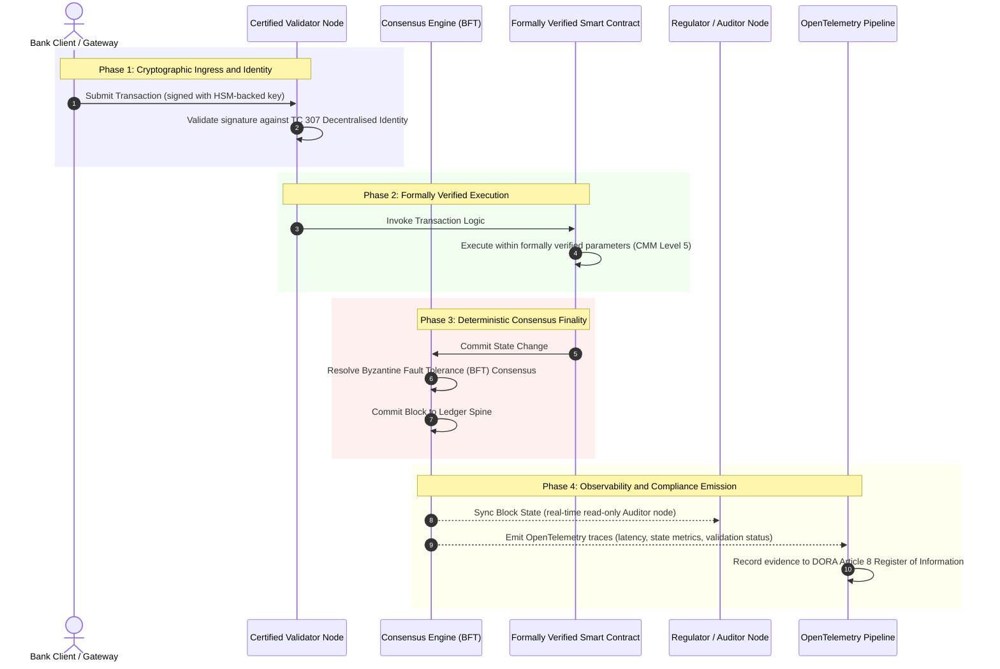

# Da Evidência à Verdade: Por que os Blockchains Certificados Vão Definir a Próxima Era da Confiança Bancária

**Imutável não é o mesmo que confiável.** À medida que a banca de atacado migra para a liquidação em tempo real e a IA probabilística, o livro-razão que decide o que é verdade tornou-se a única camada que os bancos ainda não conseguem certificar. Eles certificam a entidade sob o Basel III, a nuvem sob a ISO 27001 e a sua IA sob a ISO 42001, mas o livro-razão distribuído, a sua governança, o consenso, a criptografia e os contratos inteligentes ficam entregues a pressupostos específicos de cada fornecedor. Este relatório sustenta que fechar essa lacuna fiduciária exige passar da orientação da ISO/IEC TC 307 para uma asseguração prescritiva: pontuar o livro-razão contra um Índice de Blockchain Certificado de 5 níveis que converte métricas de engenharia em verdade auditável pelo conselho e defensável sob a DORA.

<!-- lead-start -->
<aside class="post-lead" aria-label="Resumo do artigo">

<strong>Resumo.</strong> Os bancos certificam a entidade, a nuvem e a sua IA, mas não o livro-razão que cada vez mais determina o que é verdade. A ISO/IEC TC 307 fornece orientação, não asseguração. Um Índice de Blockchain Certificado de 5 níveis pontua a governança do livro-razão, a integridade do consenso, a identidade e a criptografia, a asseguração de contratos inteligentes e a observabilidade contra um Modelo de Maturidade de Capacidade, fechando a lacuna fiduciária e dando à IA probabilística uma espinha dorsal de auditoria determinística.

<strong>Principais conclusões</strong>

<ul class="post-lead-takeaways">
  <li><strong>A lacuna friccional fiduciária.</strong> O banco (Basel III), a nuvem (ISO 27001) e o sistema de governança de IA (ISO 42001) podem ser certificados; o livro-razão distribuído que decide o que é verdade ainda não pode. Essa assimetria é uma vulnerabilidade operacional real.</li>
  <li><strong>A DORA torna a questão pessoal.</strong> Sob o DORA Artigo 5, os conselhos de administração dos bancos assumem responsabilidade direta e indelegável pela resiliência de implantações de terceiros e de livro-razão, com penalidades pessoais SM&amp;CR em caso de falha.</li>
  <li><strong>A espinha dorsal de auditoria de IA.</strong> O aprendizado de máquina não é reproduzível; um blockchain certificado captura versões de modelos, entradas e decisões de validação de forma determinística na cadeia, satisfazendo a ISO 42001 e as normas de gestão de risco de modelos.</li>
  <li><strong>O Índice de Blockchain Certificado.</strong> Governança, consenso, criptografia, contratos inteligentes e observabilidade tornam-se um placar CMM de 0 a 5 que traduz métricas de engenharia em Declarações de Apetite ao Risco aprovadas pelo conselho.</li>
</ul>

<strong>Leitura relacionada:</strong> <a href="https://sebastienrousseau.com/2026-07-02-certified-blockchains-banking-trust-tc307-assurance-2026">Blockchains Certificados e Confiança Bancária: Asseguração da TC 307</a>, <a href="https://sebastienrousseau.com/2026-07-24-global-payments-outlook-operating-model-risk-revenue">Perspectiva Global de Pagamentos de 2026</a>.

</aside>
<!-- lead-end -->

> **Sumário Executivo**
>
> - **A banca de atacado está num ponto de inflexão.** A compensação em tempo real e a IA probabilística rompem o modelo de asseguração analógico e retrospectivo: auditorias estáticas, baseadas na entidade, já não atendem às exigências modernas de gestão de risco ou fiduciárias.
> - **A TC 307 é uma linha de base, não um certificado.** A ISO/IEC TC 307 padronizou o vocabulário, a arquitetura de referência e a orientação de segurança para livros-razão distribuídos, mas é descritiva. Ela define como é o bom desempenho; não fornece a verificação prescritiva de que gestores de risco e supervisores precisam para autorizar a implantação em produção.
> - **Asseguração significa pontuar o livro-razão.** Governança, integridade do consenso, segurança de contratos inteligentes e agilidade criptográfica, pontuadas contra um rigoroso Modelo de Maturidade de Capacidade de 5 níveis, levam os bancos de pressupostos fragmentados e específicos de cada fornecedor para uma verdade financeira certificável e auditável pelo conselho.
> - **O livro-razão é a espinha dorsal de auditoria da IA.** Ancorar versões de modelos, entradas e decisões de validação a um consenso determinístico dá ao aprendizado de máquina não reproduzível um registro probatório defensável e reconstruível sob a ISO 42001, o SR 11-7 e a PRA SS1/23.

## A Lacuna Friccional Fiduciária na Banca Digital

Na banca clássica, a confiança é relacional, institucional e retrospectiva. Ela depende de auditores independentes e externos que revisam o estado financeiro em pontos estáticos no tempo, reconciliando divergências entre silos de livro-razão bilaterais. Nos mercados de 2026, orientados por API e em tempo real, esse modelo introduz latências proibitivas e riscos estruturais.

Quando as transações liquidam instantaneamente, os fundos de liquidez intradiários são geridos dinamicamente por gateways de API e a titularidade de ativos é tokenizada em livros-razão compartilhados, as auditorias retrospectivas tornam-se exercícios forenses em vez de controles preventivos. Os fiduciários já não podem confiar apenas na certificação da pessoa jurídica. Eles precisam certificar o próprio substrato digital.

Atualmente, os bancos operam sob uma assimetria arquitetônica gritante:

1. **Infraestrutura de Nuvem Certificada**: nós de hardware, contêineres virtualizados e datacenters físicos são validados contra os controles ISO/IEC 27001 e SOC 2 Type II.  
2. **Processos de Gestão Certificados**: políticas de risco operacional, planos de continuidade de negócios e implantações algorítmicas são governados sob estruturas de risco rigorosas.  
3. **Motores de Livro-Razão Não Certificados**: os mecanismos centrais de consenso distribuído, as cadeias de suprimentos de nós validadores, as fronteiras dos contratos inteligentes e os modelos de governança de rede ficam entregues a pressupostos não certificados, personalizados ou específicos de cada consórcio.

Essa assimetria é um grande ponto de falha. Um banco pode executar uma aplicação validada dentro de um contêiner de nuvem seguro e certificado pela ISO 27001, mas se esse contêiner grava num livro-razão distribuído com controle centralizado de validadores, parâmetros de consenso vulneráveis ou contratos inteligentes não auditados, a integridade da transação fica comprometida. Para superar essa lacuna, o próprio motor do livro-razão precisa tornar-se um objeto de asseguração certificável.

## A Linha de Base de Padronização da ISO/IEC TC 307

O trabalho fundamental necessário para padronizar os livros-razão distribuídos está sendo estabelecido pelo Comitê Técnico 307 da ISO/IEC (TC 307\) (Blockchain e tecnologias de livro-razão distribuído). Em vez de tratar o blockchain como um protocolo técnico isolado, a TC 307 aborda-o como uma infraestrutura institucional de confiança, organizando o seu trabalho em torno de cinco pilares centrais:

1. **Taxonomia e Vocabulário (ISO 22739\)**: estabelece uma nomenclatura comum, garantindo definições jurídicas e operacionais consistentes entre diferentes jurisdições, esquemas financeiros e instituições.  
2. **Arquitetura de Referência (ISO/TR 23245\)**: define as fronteiras, camadas, fluxos de dados e componentes funcionais de um sistema de livro-razão distribuído em conformidade.  
3. **Segurança, Privacidade e Contratos Inteligentes (ISO/TR 23244 / ISO 23613\)**: estabelece diretrizes de segurança de referência para sistemas de ativos digitais e detalha as melhores práticas para mitigação de vulnerabilidades e governança do ciclo de vida de contratos inteligentes.  
4. **Estruturas de Interoperabilidade**: aborda os mecanismos de troca de dados e ativos entre redes de livro-razão heterogêneas, evitando a formação de silos tokenizados isolados.  
5. **Identidade Descentralizada e Âncoras de Confiança**: integra identificadores criptográficos baseados no livro-razão com infraestruturas formais de chave pública (PKI) e registros autorizados pelo Estado.

Coletivamente, a TC 307 sinaliza a transição da DLT de uma escolha de engenharia personalizada para uma disciplina arquitetônica padronizada. No entanto, a TC 307 permanece principalmente descritiva. Ela define como é o bom desempenho (orientação), mas não fornece o protocolo de verificação prescritivo (asseguração) que gestores de risco e supervisores exigem para autorizar implantações em produção de funções críticas ou importantes (CIFs).

## Orientação vs. Asseguração: A Distinção Fiduciária

Os participantes do mercado financeiro não implantam tecnologia porque ela é inovadora ou elegante; eles a implantam quando ela pode ser governada, auditada, defendida e reconciliada com os requisitos de reserva de capital. É por isso que a padronização na banca naturalmente se resolve em duas camadas:

* **Orientação (A Estrutura)**: descreve as melhores práticas, metas de referência e diretrizes arquitetônicas (por exemplo, ISO/IEC TC 307, estruturas do NIST).  
* **Asseguração (A Prova)**: fornece evidências independentes, contínuas e verificáveis por terceiros de que a estrutura está implementada e operando conforme projetada (por exemplo, certificação ISO 27001, auditorias SOC 2, exames regulatórios).

Confiar num consenso de livro-razão não certificado enquanto se certifica a infraestrutura de nuvem é uma lacuna regulatória crítica. Um blockchain que é "imutável" não é necessariamente "institucionalmente confiável". A imutabilidade apenas garante que os dados inseridos permaneçam inalterados; ela não verifica que os nós validadores sejam seguros, que o protocolo de consenso seja resiliente contra conluio, que a lógica do contrato inteligente seja matematicamente sólida ou que a gestão de chaves criptográficas cumpra os mandatos pós-quânticos.

Para fechar essa lacuna, o Índice de Blockchain Certificado de 2026 formaliza esses requisitos num Modelo de Maturidade de Capacidade (CMM) quantificável, mapeado para as regulamentações bancárias globais.

## O Índice de Blockchain Certificado de 2026

Para permitir que a alta administração avalie e certifique as suas plataformas de livro-razão, este índice estrutura a infraestrutura de livro-razão distribuído em cinco camadas operacionais auditáveis, pontuadas numa escala CMM de 0 a 5.

### Tabela 1: A Arquitetura do Índice de Blockchain Certificado

| Camada do Índice | Nível de Maturidade de Capacidade (CMM) | Métrica Técnica e Operacional | Referência de Controle Regulatório / Fiduciário |
| ---- | ---- | ---- | ---- |
| **Governança do Livro-Razão** | **Nível 0**: Consórcio ad-hoc**Nível 3**: Verificação e rotação automatizadas de validadores**Nível 5**: Ancoragem de identidade criptográfica descentralizada e multipartidária | % de nós validadores operados por entidades financeiras verificadas; tempo médio para resolver disputas de validadores; distribuição geográfica dos nós | **DORA Article 5** (Governança e Organização); **CPMI-IOSCO PFMI Princípio 2** (Governança) e **Princípio 3** (Estrutura para a gestão abrangente de riscos) |
| **Integridade do Consenso** | **Nível 0**: Nó único ou POW opaco**Nível 3**: BFT auditado com finalidade determinística**Nível 5**: Consenso multijurisdicional, formalmente verificado, com monitoramento contínuo de latência | Latência máxima tolerável do consenso; limiar de resistência a conluio; SLA de disponibilidade sob partição simulada de nós | **DORA Article 6** (Estrutura de Gestão de Risco de TIC); **CPMI-IOSCO PFMI Princípio 8** (Finalidade da Liquidação) |
| **Identidade e Criptografia** | **Nível 0**: Chaves RSA / ECDSA fracas**Nível 3**: Multiassinatura com gestão de chaves respaldada por HSM**Nível 5**: Chaves híbridas resistentes a quântica (FIPS 203 ML-KEM) e portões de privacidade de conhecimento zero | % de transações do livro-razão assinadas com chaves respaldadas por HSM; pontuação de prontidão para migração PQC; latência de prova ZK | **NIST FIPS 203 / 204**; **ISO/IEC 27001** (Gestão de Segurança da Informação) |
| **Asseguração de Contratos Inteligentes** | **Nível 0**: Scripts solidity não auditados**Nível 3**: Validação automatizada de compilador e auditoria externa**Nível 5**: Contratos inteligentes formalmente verificados e imutáveis com atualizações por disjuntor | % de contratos inteligentes com verificação formal matemática; contagem de avisos do compilador; cobertura de varredura de vulnerabilidades | **Diretrizes da EBA sobre Acordos de Terceirização** (Parágrafos 81, 113-117); **DORA Article 30** (Cláusulas Contratuais Mínimas) |
| **Auditoria e Observabilidade** | **Nível 0**: Coleta manual de logs**Nível 3**: Rastreamentos OTel estruturados e nós auditores somente leitura**Nível 5**: Reconciliação automatizada e contínua ao registro do Artigo 8 | % de transações cobertas por rastreamentos OpenTelemetry; latência entre a confirmação do bloco no livro-razão e a sincronização do nó auditor | **BCBS 239** (Agregação de Dados de Risco); **DORA Article 8** (Registro de Informação / Esquemas ITS) |

### Tabela 2: Principais Sinais de Confiança Mapeados para os Padrões Bancários Globais

| Sinal / Referência | Métrica | Impacto nas Plataformas Bancárias | Fonte Regulatória |
| ---- | ---- | ---- | ---- |
| **Progresso da ISO/IEC TC 307** | Transição de relatórios técnicos ISO/TR para esquemas formais de certificação | Estabelece a primeira estrutura padronizada para certificar motores de livro-razão distribuído | **ISO/IEC JTC 1 / SC 44** (Tecnologias de Livro-Razão Distribuído) |
| **Fase de Protótipo do Projeto Agorá** | 40+ bancos comerciais participantes; teste de livro-razão unificado de depósitos tokenizados | Migração da compensação transfronteiriça de mensageria (SWIFT) para a liquidação atômica tokenizada | **Centro de Inovação do Banco de Compensações Internacionais (BIS)** |
| **Auditoria de Terceiros do DORA Article 30** | 100% dos provedores de nós e hosts de infraestrutura auditados contra critérios de segurança | Elimina "nós validadores fantasma"; exige total transparência na cadeia de suprimentos | **Autoridades Europeias de Supervisão (ESA)** |
| **ISO/IEC 42001 (Governança de IA)** | Modelo de IA e logs de treinamento tornados criptograficamente imutáveis na cadeia | Emprega o blockchain como o livro-razão probatório imutável ("espinha dorsal de auditoria") para o aprendizado de máquina | **ISO/IEC 42001:2023** (Tecnologia da informação, Inteligência artificial) |
| **Adequação de Capital do Basel III** | Redução dos amortecedores de capital de risco operacional com base na redução documentada de complexidade | As estruturas padronizadas de risco operacional creditam diretamente a resiliência verificada do livro-razão | **Comitê de Basileia sobre Supervisão Bancária (BCBS)** |

## A "Espinha Dorsal de Auditoria" da IA: Inteligência Probabilística sobre Infraestrutura Determinística

Um dos papéis estratégicos mais poderosos para um blockchain certificado em 2026 é atuar como uma **"Espinha Dorsal de Auditoria"** para implantações de inteligência artificial. Os sistemas financeiros modernos são cada vez mais probabilísticos. A pontuação de crédito, a detecção de fraudes em tempo real, a negociação algorítmica e as interações autônomas com clientes são conduzidas por modelos de aprendizado de máquina que evoluem, sofrem desvios e se adaptam ao longo do tempo. Esses modelos são não determinísticos: dada a mesma entrada em dois momentos diferentes, eles podem produzir saídas diferentes devido a pesos dinâmicos e treinamento contínuo.

Esse não determinismo introduz um profundo desafio de governança sob a **ISO/IEC 42001 (Governança de IA)** e as normas de **Gestão de Risco de Modelos (MRM)** (como o **SR 11-7 do Federal Reserve dos EUA** e a **PRA SS1/23 do Reino Unido**): *como auditar, explicar e defender decisões que não são estritamente reproduzíveis?*

Um livro-razão distribuído certificado fornece o contrapeso determinístico. Enquanto os modelos de IA operam de forma probabilística, o blockchain certificado registra os seus parâmetros de forma determinística, estabelecendo uma espinha probatória inalterável:

* **Versionamento de Modelo e Ancoragem de Pesos**: cada versão de modelo implantada, os seus pesos associados e as somas de verificação dos seus dados de treinamento são hasheados e gravados no livro-razão no momento da compilação, satisfazendo os requisitos de cadeia de suprimentos do **SLSA Nível 3**.  
* **Registro de Entradas Contextuais**: quando um modelo de IA executa uma decisão crítica (por exemplo, aprovar um empréstimo ou sinalizar uma transação), as entradas contextuais exatas e os hashes do modelo são gravados no livro-razão, criando um histórico à prova de adulteração.  
* **Auditabilidade sem Acesso ao Código**: se um regulador perguntar "Por que o seu modelo rejeitou esta solicitação de crédito em 3 de junho?", o banco não precisa expor código proprietário nem tentar recriar o estado exato do modelo. Ele apresenta o registro do livro-razão na cadeia, criptograficamente assinado, com as entradas, os pesos e o estado de validação.

Ao ancorar as decisões probabilísticas dos modelos de aprendizado de máquina ao consenso determinístico de um blockchain certificado, a instituição cria uma linha do tempo defensável, reconstruível e verificável de forma independente das ações automatizadas.

## Visualizando o Pipeline Certificado de Consenso a Auditoria

O diagrama de sequência a seguir ilustra o ciclo de vida de uma transação que passa por uma plataforma de blockchain certificado, demonstrando como os portões de validação, a integridade do consenso, a execução do contrato inteligente e a emissão de telemetria se interligam para produzir evidências regulatórias prontas para o conselho:

O caminho crítico para essa sequência transacional exige que cada etapa de validação, execução e consenso seja criptograficamente assinada, garantindo a proveniência de ponta a ponta. O nó auditor do regulador sincroniza o estado do bloco em tempo real, eliminando a necessidade de reconciliação financeira retrospectiva e manual.

## O Manual de Sala de Reuniões para Gestores Seniores

Para gerir com êxito a mudança da confiança organizacional para a confiança infraestrutural, executivos e gestores seniores dos bancos devem executar imediatamente quatro diretivas essenciais:

1. **Exigir Auditorias de Livro-Razão na Gestão de Risco Corporativo (ERM)**: aplicar uma política segundo a qual nenhuma plataforma de livro-razão distribuído, seja privada, pública ou baseada em consórcio, possa ser implantada para funções críticas ou importantes (CIFs) a menos que tenha sido auditada contra a **Arquitetura do Índice de Blockchain Certificado** de 5 camadas (CMM Nível 3 no mínimo).  
2. **Integrar Blockchains como a Espinha Probatória de IA da ISO 42001**: orientar o Diretor de Risco e o Arquiteto Líder de IA a integrar todos os modelos de aprendizado de máquina de alto impacto a um blockchain certificado, criando um livro-razão de auditoria à prova de adulteração das versões de modelos, pesos, entradas e decisões.  
3. **Auditar a Cadeia de Suprimentos de Nós Validadores (DORA Article 30\)**: exigir que a divisão de compras audite todas as entidades terceiras que hospedam nós validadores ou gerenciam a hospedagem em nuvem para redes DLT, impondo conformidade com os mesmos padrões de cibersegurança e resiliência operacional aplicados aos nós de nuvem internos do banco.  
4. **Alinhar as Arquiteturas de Livro-Razão com o CPMI-IOSCO e o BCBS 239**: instruir a equipe de engenharia de plataforma a alinhar a telemetria de saída do livro-razão diretamente com os requisitos de relatório de dados do **BCBS 239**, e garantir que os parâmetros de consenso e finalidade da liquidação cumpram estritamente os **Princípios 8 e 9 do CPMI-IOSCO**.

## Perguntas Frequentes

**A ISO/IEC TC 307 é um padrão de certificação?**  
Não. A ISO/IEC TC 307 é um comitê técnico que estabelece vocabulário, arquiteturas de referência e diretrizes de segurança. Embora defina "como é o bom desempenho" (orientação), o setor precisa operacionalizar esses documentos em esquemas de certificação formais e auditáveis (asseguração) para satisfazer os supervisores bancários.

**Como um blockchain certificado apoia a conformidade com a DORA?**  
Sob o DORA Artigo 5, os conselhos de administração dos bancos assumem responsabilidade direta e pessoal pela resiliência tecnológica. Um blockchain certificado fornece evidências criptográficas verificáveis de integridade do consenso, controle da cadeia de suprimentos de validadores e segurança de contratos inteligentes, dando aos membros do conselho as "medidas razoáveis" documentáveis necessárias para se defender contra reivindicações de responsabilidade pessoal sob o SM\&CR.

**Qual é a diferença entre uma auditoria de livro-razão tradicional e uma auditoria de blockchain certificado?**  
Uma auditoria tradicional é retrospectiva, verificando lançamentos manuais e arquivos estáticos depois que as transações foram compensadas. Uma auditoria de blockchain certificado é contínua e em tempo real; os nós validadores, o motor de consenso BFT e os contratos inteligentes formalmente verificados são certificados para executar transações de forma determinística, emitindo telemetria estruturada (OpenTelemetry) que valida continuamente a integridade do sistema.

**Blockchains públicos podem ser certificados para uso bancário?**  
Na maioria das jurisdições, os blockchains públicos puramente sem permissão não satisfazem as regulamentações bancárias devido à ausência de verificação de identidade dos validadores, aos custos imprevisíveis de gás/transação e à finalidade não determinística (por exemplo, bifurcações probabilísticas de prova de trabalho/participação). Os blockchains certificados na banca normalmente utilizam arquiteturas corporativas com permissão ou arquiteturas públicas-híbridas altamente reguladas, nas quais os operadores dos nós validadores são entidades financeiras identificadas e auditadas.

## Referências

* Comitê de Basileia sobre Supervisão Bancária (BCBS), 2013\. *Principles for effective risk data aggregation and reporting (BCBS 239\)*. Basileia: Banco de Compensações Internacionais. Disponível em: [Comitê de Basileia sobre Supervisão Bancária (BCBS), 2013\.](https://www.bis.org/publ/bcbs239.pdf "Comitê de Basileia sobre Supervisão Bancária (BCBS), 2013\.").  
* Comitê de Pagamentos e Infraestruturas de Mercado e Comitê Técnico da Organização Internacional das Comissões de Valores Mobiliários (CPMI-IOSCO), 2012\. *Principles for financial market infrastructures*. Basileia: Banco de Compensações Internacionais. Disponível em: [Comitê de Pagamentos e Infraestruturas de Mercado e Comitê Técnico da Organização Internacional das Comissões de Valores Mobiliários (CPMI-IOSCO), 2012\.](https://www.bis.org/cpmi/publ/d101a.pdf "Comitê de Pagamentos e Infraestruturas de Mercado e Comitê Técnico da Organização Internacional das Comissões de Valores Mobiliários (CPMI-IOSCO), 2012\.").  
* Autoridade Bancária Europeia (EBA), 2019\. *EBA/GL/2019/02, Guidelines on outsourcing arrangements*. Paris: EBA. Disponível em: [Autoridade Bancária Europeia (EBA), 2019\.](https://www.eba.europa.eu/regulation-and-policy/internal-governance/guidelines-on-outsourcing-arrangements "Autoridade Bancária Europeia (EBA), 2019\.").  
* Parlamento Europeu e Conselho da União Europeia, 2022\. *Regulation (EU) 2022/2554 on digital operational resilience for the financial sector (DORA)*. Bruxelas: Jornal Oficial da União Europeia. Disponível em: [Parlamento Europeu e Conselho da União Europeia, 2022\.](https://eur-lex.europa.eu/legal-content/EN/TXT/?uri=CELEX%3A32022R2554 "Parlamento Europeu e Conselho da União Europeia, 2022\.").  
* ISO/IEC JTC 1/SC 42, 2023\. *ISO/IEC 42001:2023, Information technology, Artificial intelligence, Management system*. Genebra: Organização Internacional de Normalização. Disponível em: [ISO/IEC JTC 1/SC 42, 2023\.](https://www.iso.org/standard/81230.html "ISO/IEC JTC 1/SC 42, 2023\.").  
* Comitê Técnico 307 da ISO/IEC, 2020\. *ISO/IEC 22739:2020, Blockchain and distributed ledger technologies, Vocabulary*. Genebra: Organização Internacional de Normalização. Disponível em: [Comitê Técnico 307 da ISO/IEC, 2020\.](https://www.iso.org/standard/73771.html "Comitê Técnico 307 da ISO/IEC, 2020\.").  
* Instituto Nacional de Padrões e Tecnologia (NIST), 2026\. *First Three Finalised Post-Quantum Encryption Standards (FIPS 203, 204, and 205\)*. Gaithersburg: Departamento de Comércio dos EUA. Disponível em: [Instituto Nacional de Padrões e Tecnologia (NIST), 2026\.](https://www.nist.gov/news-events/news/2024/08/nist-releases-first-3-finalised-post-quantum-encryption-standards "Instituto Nacional de Padrões e Tecnologia (NIST), 2026\.").

