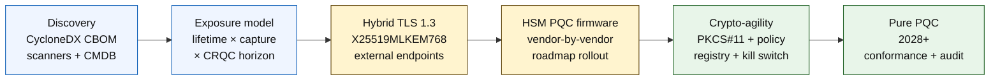

# Indexul Băncii Sigure Cuantic în 2026: criptografie post-cuantică, QKD, agilitate criptografică și riscul harvest-now-decrypt-later

<!-- lead-start: manual -->
<aside class="post-lead" aria-label="Rezumatul articolului">

<strong>Pe scurt.</strong> Băncile sigure cuantic în 2026 reprezintă un program de livrare cu un termen-limită stabilit de intersecția a două curbe — durata de confidențialitate a datelor pe care instituția le deține astăzi și orizontul de apariție a unui Computer Cuantic Relevant Criptografic (CRQC). NIST FIPS 203 / 204 / 205 sunt finale din august 2024; CNSA 2.0 stabilește starea finală federală americană la 2033; harvest-now-decrypt-later are loc deja pe datele de lungă durată. Tabloul Cuantic la Nivel de Consiliu urmărește patru procente exacte: completitudinea inventarului, expunerea HNDL, progresul migrării NIST, pregătirea pentru agilitate criptografică.

<strong>Concluzii esențiale</strong>

<ul class="post-lead-takeaways">
  <li><strong>Dezbaterea algoritmilor s-a încheiat pe 13 august 2024.</strong> ML-KEM (FIPS 203), ML-DSA (FIPS 204), SLH-DSA (FIPS 205) sunt răspunsurile. Băncile care încă rulează evaluări interne pentru a „alege câștigătorul" sunt cu 18 luni în urmă.</li>
  <li><strong>Harvest-now-decrypt-later se aplică deja.</strong> Orice element cu o durată de confidențialitate care depășește apariția credibilă a unui CRQC — ipoteci pe 30 de ani, subscrierea asigurărilor de viață, înregistrări de tranzacții MiFID II / GDPR, arhive de retenție M&amp;A — trebuie să treacă la încapsularea hibridă sigură cuantic acum, nu când se anunță un CRQC.</li>
  <li><strong>Inventarul este maturitatea-poartă.</strong> O Listă a Materialelor Criptografice (CBOM) — protocol, bibliotecă, certificat, partiție HSM, dependență de furnizor, proprietar de aplicație, durata clasificării datelor — este precondiția pentru tot restul. Urmăriți prospețimea, nu acoperirea.</li>
  <li><strong>TLS 1.3 hibrid este implementarea pentru 2026.</strong> Cheia partajată hibridă X25519MLKEM768 este ceea ce Chrome / Firefox / Cloudflare / Akamai negociază efectiv astăzi. TLS pur ML-KEM așteaptă firmware-ul HSM și pregătirea autorităților de certificare.</li>
  <li><strong>Agilitatea criptografică este livrabilul durabil.</strong> Abstracție PKCS#11, chei etichetate, registru de politici care mapează serviciul de afaceri la setul de algoritmi permiși. Fără ea, următoarea tranziție de algoritm devine un alt program de mai mulți ani.</li>
</ul>
</aside>
<!-- lead-end -->

Băncile sigure cuantic în 2026 înseamnă migrare operațională, nu speculație. NIST a finalizat primele trei standarde de criptografie post-cuantică, iar băncile trebuie acum să înțeleagă care sisteme depind de RSA, ECC, TLS, semnături, HSM-uri, certificate, canale de plată, arhive și date confidențiale de lungă durată. Întrebarea-index este simplă: poate instituția să înlocuiască criptografia înainte ca amenințarea să devină operațională?

---

> **Rezumat executiv / Concluzii esențiale**
>
> - **Standardele NIST sunt acum concrete.** FIPS 203 definește ML-KEM pentru încapsularea cheilor, FIPS 204 definește ML-DSA pentru semnături, iar FIPS 205 definește SLH-DSA ca standard de semnătură bazat pe hash fără stare.
> - **Inventarul este prima poartă de maturitate.** O bancă nu poate migra ceea ce nu poate găsi: certificatele, cheile, protocoalele, aplicațiile, furnizorii, HSM-urile, API-urile, arhivele și sistemele încorporate trebuie cartografiate.
> - **Agilitatea criptografică este obiectivul durabil.** Scopul nu este un schimb de algoritm unic; este capacitatea de a schimba primitivele criptografice fără a reproiecta aplicații întregi.
> - **Datele de lungă durată schimbă urgența.** Riscul harvest-now-decrypt-later înseamnă că datele capturate astăzi pot deveni lizibile mai târziu dacă rămân valoroase suficient timp.
> - **QKD este un complement specializat.** Distribuția cheilor cuantice poate fi relevantă pentru canalele de cea mai mare valoare, dar nu înlocuiește migrarea PQC la nivel de instituție.
>
---

## De ce 2026 este anul în care acest index contează

Trei schimbări din 2024-2025 au transformat siguranța cuantică dintr-un punct de observație de cercetare într-un program bancar măsurabil. În primul rând, NIST a finalizat standardele post-cuantice primare pe 13 august 2024: [FIPS 203 (ML-KEM) ⧉](https://nvlpubs.nist.gov/nistpubs/FIPS/NIST.FIPS.203.pdf "FIPS 203 — Module-Lattice-Based Key-Encapsulation Mechanism"), [FIPS 204 (ML-DSA) ⧉](https://nvlpubs.nist.gov/nistpubs/FIPS/NIST.FIPS.204.pdf "FIPS 204 — Module-Lattice-Based Digital Signature Standard"), [FIPS 205 (SLH-DSA) ⧉](https://nvlpubs.nist.gov/nistpubs/FIPS/NIST.FIPS.205.pdf "FIPS 205 — Stateless Hash-Based Digital Signature Standard"). Dezbaterea privind selecția algoritmilor s-a încheiat la acea dată; băncile care în 2026 încă rulează fluxuri interne de tipul „care schemă câștigă" sunt cu 18 luni în urmă.

În al doilea rând, [CNSA 2.0 al NSA ⧉](https://media.defense.gov/2022/Sep/07/2003071834/-1/-1/0/CSA_CNSA_2.0_ALGORITHMS_.PDF "Commercial National Security Algorithm Suite 2.0") a stabilit starea finală federală americană la 2033, cu termene intermediare începând din 2027 pentru semnarea software și firmware, 2030 pentru browsere și sisteme de operare. Orice bancă cu expunere la contrapărți federale americane — FedNow, operațiuni de trezorerie, conturi de clienți federali — se află în acest perimetru pentru sistemele care ating date federale. Ceasul nu mai este abstract.

În al treilea rând, [Harvest-Now-Decrypt-Later (HNDL) ⧉](https://csrc.nist.gov/Projects/post-quantum-cryptography "Programul NIST de criptografie post-cuantică") este argumentul de risc portant pentru urgență. Adversari sofisticați captează deja mesaje de plată protejate TLS, plicuri SWIFT, documentație KYC și cifrutexte de arhivă de lungă durată în marile centre financiare. Datele capturate în 2026 trebuie doar să rămână sensibile la confidențialitate în momentul decriptării — pentru ipotecile pe 30 de ani, subscrierea asigurărilor de viață, înregistrările de tranzacții MiFID II / GDPR și arhivele de retenție M&A, această fereastră se extinde mult dincolo de orice estimare credibilă pentru un Computer Cuantic Relevant Criptografic (CRQC). Adversarul nu are nevoie de un computer cuantic astăzi. Are nevoie de unul înainte ca datele să înceteze să mai conteze.

Indexul Băncii Sigure Cuantic măsoară dacă instituția dumneavoastră poate livra migrarea înainte ca acea intersecție să se producă. Munca nu mai este despre a decide dacă să migrați; este despre a finaliza migrarea într-un calendar apărabil.

## Arhitectura indexului 2026

| Strat-index | Direcție 2026 | Metrică de pregătire | Risc dacă este gestionat greșit |
|---|---|---|---|
| **Inventar** | Cartografierea activelor criptografice, protocoalelor, certificatelor, furnizorilor și claselor de date | Procentul din parc inventariat | Dependențe vulnerabile cuantic necunoscute |
| **Expunere** | Clasificarea sistemelor după durata de confidențialitate și criticitatea tranzacțiilor | Active cu risc ridicat după valoare și durată | Migrare prioritizată greșit |
| **Migrare** | Adoptarea modelelor hibride și pregătite pentru PQC aliniate la standardele NIST | Pregătire ML-KEM și ML-DSA | Re-platformare de urgență sub presiunea termenului |
| **Agilitate criptografică** | Separarea logicii aplicației de primitivele criptografice | Acoperire criptografică controlată prin politici | Algoritmi codificați rigid în întregul parc |
| **Asigurare** | Testarea interoperabilității, performanței, suportului HSM, certificatelor și pregătirii furnizorilor | Rata de promovare a testelor și restanța de excepții | Canale defecte sau controale slabe de rezervă |

### Tabloul Cuantic la Nivel de Consiliu

Un tablou credibil de pregătire cuantică necesită urmărirea unor procente exacte, nu doar a statusurilor de proiect:

1. **Completitudinea inventarului:** procentul aplicațiilor de nivel 1 cu o Listă a Materialelor Criptografice (CBOM) complet cartografiată.
2. **Expunerea HNDL:** volumul de date confidențiale de lungă durată (de exemplu, PII, secrete comerciale) transmise în rețele fără încapsulare hibridă sigură cuantic.
3. **Progresul migrării NIST:** procentul cheilor de criptare asimetrică și al semnăturilor digitale migrate la standardele FIPS 203 (ML-KEM) și FIPS 204 (ML-DSA).
4. **Pregătirea pentru agilitate criptografică:** procentul sistemelor critice în care algoritmii criptografici pot fi rotiți prin politică centralizată fără a necesita recompilarea codului.

## Semnale curente de urmărit

| Semnal | Ce înseamnă pentru bănci | Sursă |
|---|---|---|
| **FIPS 203 ML-KEM** | Standardul NIST principal pentru stabilirea cheilor de criptare generală | [NIST ⧉](https://www.nist.gov/news-events/news/2024/08/nist-releases-first-3-finalized-post-quantum-encryption-standards "Primele trei standarde finalizate de criptare post-cuantică") |
| **FIPS 204 ML-DSA** | Standardul NIST principal pentru semnături digitale | [NIST ⧉](https://www.nist.gov/news-events/news/2024/08/nist-releases-first-3-finalized-post-quantum-encryption-standards "Primele trei standarde finalizate de criptare post-cuantică") |
| **FIPS 205 SLH-DSA** | Alternativă de semnătură bazată pe hash și design de rezervă | [NIST ⧉](https://www.nist.gov/news-events/news/2024/08/nist-releases-first-3-finalized-post-quantum-encryption-standards "Primele trei standarde finalizate de criptare post-cuantică") |
| **Integrare imediată încurajată** | NIST le spune explicit administratorilor să înceapă integrarea standardelor pentru că integrarea completă necesită timp | [NIST ⧉](https://www.nist.gov/news-events/news/2024/08/nist-releases-first-3-finalized-post-quantum-encryption-standards "Primele trei standarde finalizate de criptare post-cuantică") |
| **Programele cuantice bancare se extind** | Băncile majore explorează tehnologiile cuantice în timp ce pregătesc tranzițiile PQC | [Quantum Insider ⧉](https://thequantuminsider.com/2026/03/27/15-plus-global-banks-probing-the-wonderful-world-of-quantum-technologies/ "Prezentare a băncilor globale care explorează tehnologiile cuantice") |

## Migrarea începe cu registrul criptografiei

Secvența de migrare este bine înțeleasă în acest stadiu. Fiecare poartă produce dovezi care alimentează următoarea; sărirea sau comprimarea unei porți este ceea ce generează riscul de re-platformare de urgență care apare în coloana de eșec din Arhitectura indexului.

Primul livrabil nu este un algoritm nou; este o listă a materialelor criptografice (CBOM). Băncile au nevoie de un inventar viu care conectează serviciile de afaceri la algoritmi, biblioteci, certificate, lungimi de chei, HSM-uri, durate ale datelor, furnizori și proprietari operaționali. Fără acel registru, migrarea sigură cuantic devine ghiceală.

Setul de înregistrări CBOM trebuie să capteze, pentru fiecare primitivă criptografică: protocolul sau interfața (TLS 1.3, IPsec, SSH, format personalizat de mesaj de plată), algoritmul și setul de parametri (RSA-2048, ECDH P-256, ML-KEM-768, ML-DSA-65), biblioteca și versiunea (OpenSSL 3.4, hash-ul commit-ului BoringSSL, build-ul SDK al furnizorului), limita hardware (partiție HSM, TPM, enclavă securizată sau niciuna), identitatea certificatului dacă este aplicabilă, proprietarul aplicației și durata clasificării datelor. Instrumentele care intră în producție în 2025-2026 — IBM Quantum Safe Inventory, [specificația open-source CycloneDX CBOM ⧉](https://cyclonedx.org/capabilities/cbom/ "CycloneDX Cryptography Bill of Materials"), scanere de întreprindere de la CryptoNext / Sandbox / PQShield — se integrează în pipeline-urile CMDB existente. Niciunul nu este complet pe cont propriu; așteptați-vă la un ciclu de construcție CBOM de 12-18 luni chiar și cu instrumente de furnizor și personal dedicat.

Metrica de urmărit este prospețimea, nu acoperirea. Un CBOM care are două luni vechime este mai rău decât niciun CBOM, pentru că oferă echipei de securitate încredere falsă în ceea ce a fost migrat.

## Hibrid mai întâi, agil întotdeauna

Majoritatea băncilor nu vor comuta totul deodată. Modelul realist este implementarea hibridă, în care mecanismele clasice și post-cuantice rulează împreună în timp ce furnizorii, protocoalele, certificatele și instrumentele operaționale se maturizează. Ținta pe termen lung este agilitatea criptografică: alegeri criptografice controlate prin politici care pot fi schimbate fără reconstruirea aplicației de afaceri.

[Inserați componenta interactivă: calculator de risc Harvest-Now-Decrypt-Later (HNDL) — un instrument bazat pe glisor în care directorii introduc durata de viață a datelor versus cronologia cuantică estimată pentru a vedea fereastra lor de expunere.]

> **Idee-cheie:** dacă datele dumneavoastră trebuie să rămână confidențiale 10 ani, iar un Computer Cuantic Relevant Criptografic (CRQC) este la 7 ani distanță, termenul-limită al migrării nu este peste 7 ani — a fost acum 3 ani.

În practică, asta înseamnă TLS 1.3 cu cheia partajată hibridă `X25519MLKEM768` pentru punctele finale orientate spre exterior (Chrome / Firefox / Cloudflare / Akamai acceptă toate acest lucru astăzi), lanțuri clasice de semnături până când infrastructura HSM și CA recuperează, și un strat de abstracție PKCS#11 care permite registrului de politici să rotească algoritmii fără a recompila aplicațiile de afaceri. Agilitatea criptografică este ceea ce determină dacă următoarea tranziție de algoritm (când, nu dacă) este o rotație de șase săptămâni sau un alt program de șapte ani.

## Unde se potrivește QKD

Distribuția cheilor cuantice își are locul în index ca opțiune de canal de înaltă sensibilitate, în special pentru infrastructura pieței financiare, conectivitatea băncii centrale și fluxurile instituționale extrem de sensibile. Trebuie tratată ca un complement al PQC, nu ca o scuză pentru a întârzia migrarea la nivel de întreprindere.

## Ce înseamnă acest lucru pe tipuri de bănci

### Bănci sistemice globale

Problema dificilă este scala: zeci de mii de puncte finale TLS, sute de partiții HSM, zeci de autorități de certificare interne, sute de aplicații de afaceri cu primitive criptografice încorporate și SDK-uri ale furnizorilor pe care banca nu le poate modifica. Investiția nu este un alt pilot; este instrumentarea CBOM, stratul de abstracție PKCS#11 conectat în fiecare build nou, planul de consolidare HSM care alege un furnizor care să conducă pe firmware-ul PQC și acceptă o coadă de mai mulți ani pentru ceilalți, și registrul de politici care devine suprafața durabilă de agilitate criptografică mult după finalizarea migrării FIPS 203 / 204 / 205.

### Bănci de tranzacții și corporative

Domeniul migrării este mai îngust decât la nivel G-SIB, dar expunerea HNDL este acută: mesajele transfrontaliere SWIFT, datele de plată structurate care transportă PII al contrapărților corporative, platformele de schimb de documente care dețin documentație de finanțare comercială și arhivele de raportare cu retenție lungă. Prioritizați TLS hibrid pe fiecare punct final orientat spre client și PQC în repaus pentru arhivele de retenție. Împingeți responsabilizarea furnizorilor de HSM — echipa de platformă de banking corporativ are pârghii directe de achiziție pe care echipa de tehnologie wholesale adesea nu le are.

### Bănci regionale

Cumpărați stiva de furnizori care are deja primitivele de agilitate criptografică. Alegeți o platformă bancară de bază al cărei furnizor publică un CBOM și se angajează la calendare de suport ML-KEM / ML-DSA. Validați că foaia de parcurs HSM a furnizorului se aliniază cu termenul-limită al migrării băncii. Capacitatea de inginerie necesară pentru a construi agilitate criptografică de la zero se măsoară în ani; furnizorul plătește acel cost pentru mulți clienți, iar banca moștenește beneficiul. Munca de validare — verificarea că afirmațiile furnizorului supraviețuiesc procesului MRM al instituției — este domeniul intern legitim.

### Fintechuri, PSP-uri și furnizori de infrastructură

Întrebarea competitivă pentru furnizorii care vând băncilor în 2026 nu este „acceptați PQC". Este „puteți produce un CycloneDX CBOM pentru platforma dumneavoastră, o matrice de suport pentru furnizorii HSM și un SLA scris de rotație a algoritmilor". Furnizorii care răspund cu da vor trece porțile de achiziție de nivel 1 în 2026-2027. Furnizorii care nu pot vor pierde ciclul de reînnoire în favoarea unui concurent care poate.

## Concluzie

Băncile sigure cuantic în 2026 nu reprezintă un punct de observație de cercetare; sunt un program de livrare cu un termen-limită stabilit de intersecția a două curbe — durata de confidențialitate a datelor pe care instituția le deține astăzi și orizontul de apariție a unui Computer Cuantic Relevant Criptografic. Instituțiile care vor părea credibile în fața autorităților de reglementare și a contrapărților în 2030 sunt cele care au început construcția CBOM în 2024, au implementat TLS hibrid pe fiecare punct final extern până la sfârșitul lui 2026 și au integrat agilitatea criptografică în fiecare build nou din prima zi. Instituțiile care nu au făcut-o vor descoperi dacă fereastra lor de migrare s-a închis deja pentru datele pe care adversarul lor le recoltează astăzi.

Măsurați migrarea așa cum măsurați orice program operațional: domeniu cunoscut, secvențiere prioritizată, termene angajate, registre de excepții oneste. Cu cât vă uitați mai atent la propriul parc, cu atât fereastra de migrare pare mai mică.

## Întrebări frecvente

**Ce ar trebui să inventarieze o bancă mai întâi?**

Începeți cu TLS expus extern, canalele de plată, autentificarea clienților, conectivitatea interbancară, serviciile susținute de HSM, arhivele pe termen lung și sistemele care manipulează date confidențiale cu o durată utilă lungă.

**Este PQC doar o problemă de securitate cibernetică?**

Nu. Afectează plățile, identitatea, dovezile legale, semnarea tranzacțiilor, încrederea clienților, retenția datelor, managementul furnizorilor și reziliența operațională.

**Ce înseamnă agilitate criptografică?**

Agilitatea criptografică înseamnă capacitatea de a schimba primitivele criptografice prin politică și controale de platformă, în loc de modificări de aplicație codificate rigid.

**Ar trebui băncile să aștepte mai multe standarde?**

Nu. NIST i-a încurajat pe administratori să înceapă integrarea primelor standarde finale, deoarece integrarea completă necesită timp.

## Referințe

- NIST, (2026). [Primele trei standarde finalizate de criptare post-cuantică ⧉](https://www.nist.gov/news-events/news/2024/08/nist-releases-first-3-finalized-post-quantum-encryption-standards "Primele trei standarde finalizate de criptare post-cuantică").

<!-- enrich-start -->
<aside class="author-card" aria-label="Despre autor"><strong class="author-card-name"><a href="/about/index.html">Sebastien Rousseau</a></strong>Tehnolog bancar senior care scrie despre AI aplicat, infrastructura plăților, banii tokenizați, ISO 20022, securitatea post-cuantică, serviciile financiare cloud-native și piețele digitale reglementate.Peste 20 de ani de experiență la HSBC Commercial &amp; Investment Bank, PayPal, Barclays, Shazam, AKQA, Virgin Group. <a href="/about/index.html">Profil complet</a> &middot; <a href="https://www.linkedin.com/in/sebastienrousseau/" rel="external noopener">LinkedIn</a> &middot; <a href="https://github.com/sebastienrousseau" rel="external noopener">GitHub</a></aside>

Ultima revizuire <time datetime="2026-06-04">2026-06-04</time>.

<!-- enrich-end -->
