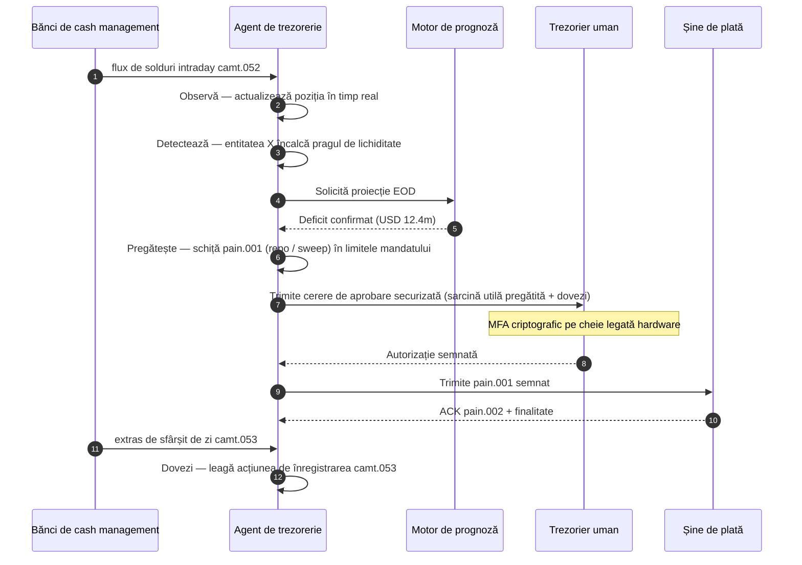

# Indicele Trezoreriei Autonome 2026: trezorerie agentică, lichiditate programabilă, depozite tokenizate și controlul numerarului în timp real

<!-- lead-start -->
<aside class="post-lead" aria-label="Rezumatul articolului">

<strong>Pe scurt.</strong> Un indice 2026 al trezoreriei autonome — măsoară fluxurile agentice, acoperirea lichidității programabile, integrarea depozitelor tokenizate, orchestrarea plăților în timp real și controlul automat al numerarului ca o singură țesătură a modelului operațional.

<strong>Concluzii principale</strong>

<ul class="post-lead-takeaways">
  <li><strong>Trezoreria devine un sistem de operare în timp real.</strong> Prognozele de numerar statice și sweep-urile batch nu mai sunt unitatea de măsură; fluxurile agentice care rulează pe date în timp real sunt.</li>
  <li><strong>Lichiditatea programabilă este acum fezabilă.</strong> Depozitele tokenizate + șinele în timp real transformă alocarea de lichiditate per eveniment într-o primitivă a fluxului de lucru, nu o inițiativă trimestrială.</li>
  <li><strong>Depozitele tokenizate sunt forma preferată de monedă digitală a trezorierului.</strong> Economia banilor de bancă, programabilitatea și certitudinea intraday — fără riscul de emitent și fără întrebările privind rezervele specifice stablecoins.</li>
  <li><strong>Planul de control este noua suprafață de audit.</strong> Mandatele, limitele, traseele de suprascriere manuală și dovezile de reversare trebuie să ruleze ca primitive de platformă, nu ca aprobări manuale pe fiecare acțiune.</li>
  <li><strong>Scorecard-ul CFO se măsoară per decizie, nu per trimestru.</strong> Costul numerarului, reducerea tamponului de lichiditate intraday, eficiența FX și acuratețea prognozei se măsoară la viteza fluxului de lucru.</li>
</ul>

<strong>Lectură conexă:</strong> <a href="https://sebastienrousseau.com/ro/2026-05-25-programmable-liquidity-ai-tokenised-deposits-real-time-treasury-2026/index.html">Lichiditate programabilă în 2026: AI, depozite tokenizate și orchestrarea trezoreriei în timp real</a>, <a href="https://sebastienrousseau.com/ro/2026-05-21-tokenised-deposits-banking-services-status-2026/index.html">Depozite tokenizate în 2026: servicii bancare, concurența stablecoins și statutul banilor comerciali programabili</a>.

</aside>
<!-- lead-end -->

Trezoreria autonomă este punctul natural de întâlnire dintre AI-ul agentic, plățile wholesale, depozitele tokenizate și lichiditatea în timp real. În 2026, cele mai bune arhitecturi de trezorerie nu se vor mărgini să prognozeze numerarul; ele vor recomanda, vor explica și, în cele din urmă, vor executa acțiuni de lichiditate cu limite clare, între conturi, valute, șine de plată și active de decontare.

---

> **Rezumat executiv / Concluzii principale**
>
> - **Trezoreria trece de la raportare la control.** Soldurile în timp real, prognozele, starea plăților și mișcarea lichidității devin parte dintr-un singur flux de lucru.
> - **AI-ul agentic creează o nouă interfață de trezorerie.** Agenții pot monitoriza pozițiile, semnala anomaliile, pregăti acțiunile de finanțare și escalada deciziile în cadrul mandatelor definite.
> - **Banii programabili schimbă latura de numerar.** Depozitele tokenizate și experimentele cu CBDC wholesale creează posibilități noi pentru decontare atomică, plăți condiționate și lichiditate permanentă.
> - **Indicele trebuie să măsoare autoritatea.** Întrebarea nu este dacă agentul poate sugera o acțiune; este dacă autoritatea, limitele, aprobările și dovezile sunt clare.
> - **Valoarea trezoreriei este măsurabilă.** Lichiditatea economisită, investigațiile manuale reduse, eșecurile de decontare evitate și capitalul de lucru eliberat ar trebui să definească succesul.
>
---

## De ce 2026 este anul în care acest indice contează

Stanford AI Index este util pentru că tratează un domeniu tehnologic în mișcare rapidă ca pe ceva ce poate fi măsurat: producția de cercetare, performanța tehnică, implementarea responsabilă, economia, adoptarea sectorială, politica și sentimentul public sunt aduse într-un singur cadru ([Stanford HAI ⧉](https://hai.stanford.edu/ai-index/2026-ai-index-report "Raportul AI Index 2026")). Băncile și instituțiile financiare au nevoie acum de aceeași disciplină pentru infrastructură. AI-ul agentic, securitatea rezistentă la cuantum, reziliența cloud-native și plățile wholesale nu mai sunt linii de inovare separate; ele converg într-un singur model operațional.

Întrebarea practică pentru o bancă nu este dacă fiecare domeniu este important. Este dacă instituția poate măsura pregătirea în toate aceste domenii în același timp. O bancă poate implementa AI agentic și totuși să rămână fragilă dacă criptografia sa nu este pregătită pentru migrare. Poate moderniza platformele cloud și totuși să eșueze dacă datele de plată rămân nestructurate. Poate rula piloturi de tokenizare și totuși să creeze risc sistemic dacă straturile de decontare, lichiditate, identitate și audit nu sunt proiectate împreună.

## Arhitectura indicelui 2026

| Stratul indicelui | Direcția 2026 | Metrica de pregătire | Riscul în caz de gestionare greșită |
|---|---|---|---|
| **Vizibilitate** | Unifică datele de cont, plăți, lichiditate și expunere | Acoperirea pozițiilor de numerar în timp real | Vizibilitate fragmentată a numerarului |
| **Prognoză** | Folosește AI pentru a prognoza solduri, fluxuri și necesar de finanțare | Acuratețea prognozei de numerar și rata excepțiilor | Falsă încredere în date slabe |
| **Autonomie** | Acordă agenților autoritate limitată pentru recomandări și acțiuni | Acoperirea mandatelor și calitatea aprobărilor | Acțiune neautorizată sau neexplicată |
| **Programabilitate** | Folosește depozite tokenizate și condiții inteligente acolo unde adaugă valoare | Cazuri de plată condiționată și decontare atomică | Piloturi de trezorerie conduse de tehnologie |
| **Controale** | Încorporează limite, sancțiuni, FX, lichiditate și controale de audit | Dovezi de control per acțiune de trezorerie | Guvernanță manuală după execuție |

## Semnale curente de urmărit

| Semnal | Ce înseamnă pentru bănci | Sursa |
|---|---|---|
| **52% adoptare AI agentic în serviciile financiare** | Trezoreria poate absorbi acum fluxurile agentice prin platforme guvernate | [Cambridge CCAF ⧉](https://www.jbs.cam.ac.uk/faculty-research/centres/alternative-finance/publications/2026-global-ai-in-financial-services-report/ "Raportul 2026 Global AI in Financial Services") |
| **Plăți condiționate Project Agorá** | Tokenizarea poate activa capabilități de plată condiționată și permanentă | [BIS ⧉](https://www.bis.org/about/bisih/topics/fmis/agora.htm "Project Agorá") |
| **Bank of England — Digital Securities Sandbox** | Obligațiunile și acțiunile emise pe DLT se decontează pe baza 「Livrare contra plată (DvP)」 — latura activului și latura numerarului (CBDC wholesale sau depozite tokenizate emise de băncile comerciale) se decontează în aceeași tranzacție atomică, eliminând riscul de contraparte pe principal | [Bank of England ⧉](https://www.bankofengland.co.uk/financial-stability/digital-securities-sandbox "Digital Securities Sandbox") |
| **Termenul SWIFT pentru adrese structurate** | Datele de trezorerie trebuie capturate corect la sursă | [SWIFT ⧉](https://www.swift.com/news-events/news/iso-20022-milestone-november-2026-unstructured-addresses-be-removed "Etapa ISO 20022 noiembrie 2026 privind adresele structurate") |
| **Instituțiile financiare mari au dificultăți în măsurarea valorii AI** | Automatizarea trezoreriei are nevoie de metrici economice solide | [Cambridge CCAF ⧉](https://www.jbs.cam.ac.uk/faculty-research/centres/alternative-finance/publications/2026-global-ai-in-financial-services-report/ "Raportul 2026 Global AI in Financial Services") |

## Mandatul agentului de trezorerie

Un agent de trezorerie nu ar trebui proiectat ca un asistent de uz general. El are nevoie de un mandat: să observe conturile, să detecteze excepțiile, să prognozeze decalajele de finanțare, să pregătească acțiunile, să solicite aprobările, să execute în cadrul limitelor și să producă dovezi. Fiecare pas ar trebui să aibă un model diferit de autoritate.

Bucla de control rulează Observă → Detectează → Prognozează → Pregătește → Solicită aprobare — și se oprește. Agentul nu trece niciodată singur de granița de autorizare criptografică. Diagrama de mai jos urmărește un ciclu complet: un deficit de lichiditate intraday de mai multe milioane de dolari apare în telemetria `camt.052`, agentul prognozează poziția de sfârșit de zi, pregătește un repo sau un sweep intercompanii ca un `pain.001` complet structurat și îl predă trezorierului uman pentru semnătură criptografică multi-factor pe o cheie legată hardware. Agentul trimite apoi sarcina utilă semnată; finalitatea aterizează ca un ACK `pain.002` și următorul `camt.053` de înregistrare.

Granița este esența — fiecare acțiune care mișcă bani reali stă în spatele unei porți criptografice pe care agentul nu o poate satisface singur.

## Lichiditatea programabilă

Lichiditatea programabilă este capacitatea de a mișca valoare în anumite condiții: dacă un prag este depășit, dacă garanția este eligibilă, dacă o contraparte trece de screening, dacă finalitatea decontării este disponibilă sau dacă un tampon de lichiditate intraday este prea scăzut. Depozitele tokenizate și platformele de decontare wholesale fac aceste tipare mai practice.

Programabilă nu înseamnă în afara standardelor. Calea de execuție este `pain.001` — ISO 20022 Customer Credit Transfer Initiation. Acțiunea pregătită a agentului este o sarcină utilă `pain.001` complet structurată, dirijată către bancă prin același canal pe care l-ar folosi un ERP corporativ, validată pe baza aceleiași scheme, evaluată de aceleași motoare de fraudă și sancțiuni și confirmată prin aceleași rapoarte de stare `pain.002`. Stratul de condiționalitate (prag, eligibilitatea garanției, disponibilitatea finalității, planșeul tamponului) se află deasupra mesajului — controlează *dacă* este trimis un `pain.001`, nu *ce formă* ia. Platformele de trezorerie care inventează sarcini utile personalizate pentru a exprima condiții vor cădea în afara căii consumabile de bănci și înapoi în integrarea bilaterală.

## Camera de control a trezoreriei

Modelul operațional ar trebui să arate ca o cameră de control: poziții, prognoze de numerar, stări de plată, utilizarea limitelor, excepții, aprobări și dovezi într-o singură interfață. Indicele ar trebui să penalizeze stivele de trezorerie care cer echipelor să coase laolaltă emailuri, foi de calcul, portaluri bancare și panouri deconectate.

Planul de date din spatele acelei interfețe este cash management-ul ISO 20022. Poziția intraday este `camt.052` — Bank-to-Customer Account Report — transmisă în flux de la fiecare bancă de cash management către stratul de observare al agentului la frecvența la care publică banca (minute pentru furnizorii GTB de nivelul 1, sfârșit de ciclu pentru restul). Reconcilierea de sfârșit de zi este `camt.053` — Bank-to-Customer Statement — înregistrarea auditabilă în raport cu care este evaluată prognoza agentului în dimineața următoare. Platformele de trezorerie care citesc extrase PDF sau fac screen-scraping pe portaluri bancare nu pot atinge 「Nivelul 4」 al indicelui; telemetria intraday trebuie să sosească ca `camt.052` structurat pentru ca bucla de prognoză să se închidă la timp pentru a putea acționa.

## Ce înseamnă acest lucru pe tipuri de bănci

### Bănci globale de importanță sistemică

Băncile globale ar trebui să trateze acest indice ca pe un scorecard de arhitectură de întreprindere. Prioritatea nu este încă o dovadă de concept; sunt dovezile că fluxurile autonome, migrarea criptografică, dependența cloud și modernizarea plăților pot fi guvernate ca un singur sistem de risc și valoare.

### Bănci de tranzacții și bănci corporative

Băncile de tranzacții ar trebui să se concentreze pe plățile wholesale, datele structurate, lichiditatea, depozitele tokenizate și serviciile de trezorerie agentică. Cea mai valoroasă propunere către clienți nu este doar mișcarea mai rapidă a banilor; este mișcarea explicabilă, auditabilă și programabilă a banilor, cu mai puține investigații și o mai bună vizibilitate a capitalului de lucru.

### Bănci regionale

Băncile regionale ar trebui să folosească indicele pentru a evita proliferarea programelor. Nu trebuie să conducă fiecare frontieră, dar au nevoie de poziții credibile privind guvernanța AI, inventarul post-cuantic, dovezile de ieșire din cloud și pregătirea datelor de plată.

### Fintech-uri, PSP-uri și furnizori de infrastructură

Fintech-urile și furnizorii de infrastructură ar trebui să își alinieze foile de parcurs ale produselor la pregătirea măsurabilă a băncilor. Cele mai bune propuneri vor reduce riscul de integrare, vor consolida dovezile și vor face infrastructura complexă mai ușor de guvernat pentru bănci.

## Concluzie

Valoarea unui raport de tip indice este că transformă o agendă tehnologică fragmentată într-un model operațional măsurabil. În 2026, câștigătorii din infrastructura financiară nu vor fi instituțiile cu cele mai multe piloturi. Vor fi instituțiile care pot dovedi pregătirea simultan în autonomie, securitate, reziliență, decontare, economie și guvernanță.

## Întrebări frecvente

**Ce este trezoreria autonomă?**

Trezoreria autonomă este utilizarea agenților AI, a datelor în timp real și a plăților programabile pentru a monitoriza, recomanda și, eventual, executa acțiuni de trezorerie în cadrul unor controale definite.

**Ar trebui ca agenții de trezorerie să poată executa plăți?**

Numai în cadrul unor mandate restrânse, cu limite stricte, aprobări explicite și auditabilitate completă. Autoritatea de execuție ar trebui câștigată prin maturitate.

**Cum ajută depozitele tokenizate trezoreria?**

Pot susține decontarea programabilă, execuția atomică și, potențial, un control mai bun al lichidității intraday, păstrând în același timp relațiile cu banii comerciali ai băncii.

**Care este primul pas de implementare?**

Construiți vizibilitatea în timp real și calitatea datelor înainte de a acorda autonomie. Agenții nu pot optimiza în siguranță un numerar pe care nu îl pot vedea cu acuratețe.

## Referințe

- Cambridge Centre for Alternative Finance, (2026). [Raportul 2026 Global AI in Financial Services ⧉](https://www.jbs.cam.ac.uk/faculty-research/centres/alternative-finance/publications/2026-global-ai-in-financial-services-report/ "Raportul 2026 Global AI in Financial Services").
- SWIFT, (2026). [Etapa ISO 20022 noiembrie 2026 privind adresele structurate ⧉](https://www.swift.com/news-events/news/iso-20022-milestone-november-2026-unstructured-addresses-be-removed "Etapa ISO 20022 noiembrie 2026 privind adresele structurate").
- BIS Innovation Hub, (2026). [Project Agorá ⧉](https://www.bis.org/about/bisih/topics/fmis/agora.htm "Project Agorá").
- Bank of England, (2026). [Conturarea viitorului financiar digital al Regatului Unit ⧉](https://www.bankofengland.co.uk/speech/2025/january/sasha-mills-speech-at-the-tokenisation-summit "Conturarea viitorului financiar digital al Regatului Unit").

<!-- enrich-start -->
<aside class="author-card" aria-label="Despre autor"><strong class="author-card-name"><a href="/about/index.html">Sebastien Rousseau</a></strong>Tehnolog bancar senior care scrie despre AI aplicat, infrastructura plăților, banii tokenizați, ISO 20022, securitatea post-cuantică, serviciile financiare cloud-native și piețele digitale reglementate.Peste 20 de ani de experiență la HSBC Commercial &amp; Investment Bank, PayPal, Barclays, Shazam, AKQA, Virgin Group. <a href="/about/index.html">Profil complet</a> &middot; <a href="https://www.linkedin.com/in/sebastienrousseau/" rel="external noopener">LinkedIn</a> &middot; <a href="https://github.com/sebastienrousseau" rel="external noopener">GitHub</a></aside>

Ultima revizuire <time datetime="2026-06-07">2026-06-07</time>.

<!-- enrich-end -->
