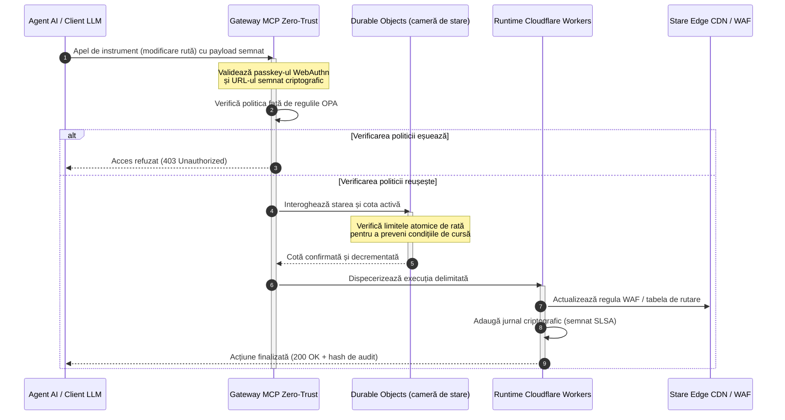

---

# Front Matter (YAML)

author: "contact@sebastienrousseau.com (Sebastien Rousseau)"
banner_alt: "Stivă de rack-uri de centru de date strălucind noaptea — simbolizând edge-ul open source, inspectabil și controlabil de agenți pe care este construit CloudCDN"
banner_height: "1597"
banner_width: "2584"
banner: "https://cloudcdn.pro/stocks/images/alis-po-IdVNRv-5wJo.webp"
cdn: "https://cloudcdn.pro"
charset: "UTF-8"
cname: "sebastienrousseau.com"
copyright: "© Copyright 2025 - 2026 - Sebastien Rousseau. All rights reserved."
date: "June 11, 2026"
description: "CloudCDN transformă CDN-ul într-un plan de control edge securizat criptografic și controlabil de agenți — gateway MCP zero-trust, Durable Objects, dovezi DORA."
format-detection: "telephone=no"
hreflang: "ro"
icon: "https://cloudcdn.pro/clients/sebastienrousseau/v1/logos/sebastienrousseau.svg"
id: "https://sebastienrousseau.com/ro/2026-06-11-cloudcdn-open-source-blueprint-ai-native-edge-2026"
image_alt: "Portret alb-negru al lui Sebastien Rousseau"
image_height: "162"
image_width: "162"
image: "https://cloudcdn.pro/stocks/images/sebastienrousseau.webp"
keywords: "CloudCDN, edge AI-nativ, CDN open source, server MCP, Cloudflare Workers, Durable Objects, zero trust, WebAuthn, signed URLs, SLSA Level 3, DORA, plan de control edge"
language: "ro"
last_reviewed: "2026-06-11"
layout: "report"
locale: "ro_RO"
logo_alt: "Logo pentru Sebastien Rousseau"
logo_height: "44"
logo_width: "44"
logo: "https://cloudcdn.pro/clients/sebastienrousseau/v1/logos/sebastienrousseau.svg"
menu: ""
measurementID: "G-169G4ET5HQ"
name: "Sebastien Rousseau"
permalink: "https://sebastienrousseau.com/ro/2026-06-11-cloudcdn-open-source-blueprint-ai-native-edge-2026"
rating: "general"
referrer: "no-referrer"
robots: "index, follow"
schema: "FAQPage, Article"
seo_title: "CloudCDN: Schemă open source pentru edge AI-nativ"
short_name: "sebastienrousseau"
subtitle: "Mutarea CDN-ului global de la cache-ul de conținut static la un plan de control edge securizat criptografic și controlabil de agenți."
tags: "CloudCDN, open source, CDN, edge, agenți AI, MCP, Cloudflare Workers, Durable Objects, limitare a ratei, zero trust, WebAuthn, SLSA, DORA, BCBS 239, Basel III, banking cloud-native"
theme-color: "0, 83, 191"
title: "CloudCDN: o schemă open source pentru edge-ul AI-nativ în 2026"
url: "https://sebastienrousseau.com/ro/2026-06-11-cloudcdn-open-source-blueprint-ai-native-edge-2026"
viewport: "width=device-width, initial-scale=1, shrink-to-fit=no"

# RSS - The RSS feed front matter (YAML).
atom_link: "https://sebastienrousseau.com/2026-06-11-cloudcdn-open-source-blueprint-ai-native-edge-2026/rss.xml"
category: "Technology"
docs: https://validator.w3.org/feed/docs/rss2.html
generator: "Static Site Generator (SSG) (version 0.0.26)"
item_description: "CloudCDN transformă CDN-ul într-un plan de control edge securizat criptografic și controlabil de agenți — gateway MCP zero-trust, Durable Objects, dovezi DORA."
item_guid: "https://sebastienrousseau.com/2026-06-11-cloudcdn-open-source-blueprint-ai-native-edge-2026/rss.xml"
item_link: "https://sebastienrousseau.com/2026-06-11-cloudcdn-open-source-blueprint-ai-native-edge-2026/rss.xml"
item_pub_date: "Thu, 11 Jun 2026 06:06:06 +0000"
item_title: "CloudCDN: o schemă open source pentru edge-ul AI-nativ în 2026"
last_build_date: "Thu, 11 Jun 2026 06:06:06 +0000"
managing_editor: "contact@sebastienrousseau.com (Sebastien Rousseau)"
pub_date: "Thu, 11 Jun 2026 06:06:06 +0000"
ttl: "60"
type: "article"
webmaster: "contact@sebastienrousseau.com"

# Apple - The Apple front matter (YAML).
apple_mobile_web_app_orientations: "portrait"
apple_touch_icon_sizes: "192x192"
apple-mobile-web-app-capable: "yes"
apple-mobile-web-app-status-bar-inset: "black"
apple-mobile-web-app-status-bar-style: "black-translucent"
apple-mobile-web-app-title: "CloudCDN: Schemă open source pentru edge AI-nativ"
apple-touch-fullscreen: "yes"

# MS Application - The MS Application front matter (YAML).

msapplication-navbutton-color: "0, 83, 191"

# Twitter Card - The Twitter Card front matter (YAML).

twitter_card: "summary_large_image"
twitter_creator: "@wwdseb"
twitter_description: "CloudCDN transformă CDN-ul într-un plan de control edge securizat criptografic și controlabil de agenți — gateway MCP zero-trust, Durable Objects, dovezi DORA."
twitter_image: "https://cloudcdn.pro/clients/sebastienrousseau/v1/logos/sebastienrousseau.svg"
twitter_image_alt: "Logo al lui Sebastien Rousseau"
twitter_site: "@wwdseb"
twitter_title: "CloudCDN: Schemă open source pentru edge AI-nativ"
twitter_url: "https://sebastienrousseau.com/2026-06-11-cloudcdn-open-source-blueprint-ai-native-edge-2026"

excerpt: "CloudCDN este o schemă open source pentru edge-ul AI-nativ — gateway MCP zero-trust cu 42 de instrumente, Durable Objects, SLSA Level 3 și 3.185 de teste."

# Humans.txt - The Humans.txt front matter (YAML).
author_website: "https://sebastienrousseau.com"
author_twitter: "@wwdseb"
author_location: "London, UK"
thanks: "Mulțumim pentru lectură!"
site_last_updated: "2026-06-11"
site_standards: "HTML5, CSS3, RSS, Atom, JSON, XML, YAML, Markdown, TOML"
site_components: "Kaishi, Kaishi Builder, Kaishi CLI, Kaishi Templates, Kaishi Themes"
site_software: "Static Site Generator, Rust"

---

# CloudCDN: o schemă open source pentru edge-ul AI-nativ în 2026

<!-- lead-start: manual -->
<aside class="post-lead" aria-label="Rezumatul articolului">

<strong>Pe scurt.</strong> Tehnologia enterprise în 2026 este definită de convergența dintre execuția serverless distribuită global și AI-ul agentic. CDN-urile standard — construite pentru cache-ul fișierelor statice și rutarea de bază a traficului — sunt structural depășite într-o eră a orchestrării active a datelor în timp real. CloudCDN este o schemă open source care reconvertește edge-ul într-un plan de control activ: runtime-uri serverless, coordonare stateful prin Cloudflare Durable Objects și un gateway zero-trust Model Context Protocol (MCP) care permite agenților AI autonomi să opereze infrastructura web în interiorul unor anvelope operaționale delimitate și securizate criptografic.

<strong>Concluzii principale</strong>

<ul class="post-lead-takeaways">
  <li><strong>De la cache static la plan de control delimitat.</strong> CloudCDN mută granița operațională la edge, transformând nodurile CDN în porți de politici active care execută decizii de securitate, rutare și control al accesului în sub o milisecundă.</li>
  <li><strong>Coordonare stateful la edge.</strong> Cloudflare Durable Objects aplică limitarea atomică a ratei și coordonarea stării în timp real, la nivel global — fără condiții de cursă distribuite, fără abuz sistemic de cote între regiunile edge.</li>
  <li><strong>Gestionare agentică sigură a infrastructurii prin MCP.</strong> Un gateway zero-trust expune 42 de instrumente MCP specializate, permițând agenților AI să inspecteze, să configureze și să opereze infrastructura în limite semnate criptografic.</li>
  <li><strong>Securitatea lanțului de aprovizionare ca livrabil al pipeline-ului.</strong> Proveniență de build SLSA Level 3 prin Sigstore/Cosign și 3.185 de teste unitare la 100% acoperire la fiecare versiune.</li>
  <li><strong>Dovezi la nivel de consiliu, nu tablouri de bord.</strong> Telemetria edge se mapează direct pe responsabilitatea consiliului din articolul 5 DORA, pe raportarea riscurilor BCBS 239 și pe regulile de capital pentru risc operațional din Basel III.</li>
</ul>

<strong>Lecturi conexe:</strong> <a href="/2026-05-16-best-cloud-infrastructure-architecture-2026/">Cea mai bună arhitectură de infrastructură cloud în 2026</a> · <a href="/2026-06-05-cloud-native-banking-index-dora-resilience-platform-engineering-2026/">Indicele bancar cloud-native în 2026</a> · <a href="/2026-06-03-agentic-ai-index-banks-autonomy-governance-auditability-2026/">Indicele AI agentic pentru bănci în 2026</a>

</aside>
<!-- lead-end -->

Dezbaterea despre CDN s-a încheiat. Edge-ul nu mai este un cache; este planul de control al software-ului AI-nativ. Pe măsură ce agenții apelează instrumente, mută date, curăță cache-uri, solicită signed URLs și coordonează fluxuri de lucru, vechiul model al tablourilor de bord opace și al planurilor de control proprietare încetează să mai fie un inconvenient și devine un risc de reglementare. CloudCDN susține un model diferit: o platformă edge deschisă, inspectabilă și controlabilă de agenți, care tratează securitatea, accesibilitatea, performanța și auditabilitatea drept valori implicite aplicabile, nu promisiuni de furnizor.

Punctul de referință open source al acestui articol este [cloudcdn.pro ⧉](https://github.com/sebastienrousseau/cloudcdn.pro "cloudcdn.pro"). Repozitoriul este un CDN multi-tenant, AI-nativ, care poate fi citit de la un capăt la altul și desfășurat independent: TTFB sub 100 ms în PoP-urile Cloudflare, control prin MCP, limitare a ratei cu Durable Objects, accesibilitate WCAG-AA, signed URLs, passkeys, SLSA Level 3 și 3.185 de teste la 100% acoperire.

---

> **Rezumat executiv / Concluzii principale**
>
> - **Edge-ul devine granița operațională.** CloudCDN transformă nodurile CDN standard în porți de politici active care execută securitate, rutare și control al accesului în sub o milisecundă.
> - **Durable Objects fac limitarea ratei atomică.** Aplicarea cotelor în timp real, consistentă la nivel global, închide fereastra condițiilor de cursă pe care limitatoarele cu consistență eventuală o lasă deschisă atacatorilor și agenților defecți.
> - **Agenții operează infrastructura prin 42 de instrumente MCP delimitate.** Fiecare invocare este validată față de passkeys WebAuthn, payload-uri semnate și politici OPA înainte ca orice să se execute.
> - **Lanțul de aprovizionare face parte din produs.** Proveniența SLSA Level 3 prin Sigstore/Cosign leagă criptografic fiecare versiune de sursa sa auditată.
> - **Telemetria este dovadă de conformitate.** Operațiunile edge se mapează pe articolul 5 DORA, BCBS 239 și capitalul pentru risc operațional din Basel III — direct, nu prin raportare retroactivă.
>
---

## De ce contează acest proiect open source în 2026

IT-ul enterprise în 2026 a trecut de la provizionarea statică a infrastructurii la orchestrarea datelor în timp real, bazată pe evenimente. Două forțe de piață determină această schimbare.

Prima este proliferarea AI-ului agentic. Modelele autonome și agenții software execută acum sarcini operaționale complexe — atenuare automată a amenințărilor, decizii de rutare, echilibrare a registrelor în timp real. Nu folosesc tablouri de bord. Apelează instrumente.

A doua este aplicarea activă a [Digital Operational Resilience Act (DORA) ⧉](https://eur-lex.europa.eu/legal-content/EN/TXT/?uri=CELEX%3A32022R2554 "Regulamentul (UE) 2022/2554 privind reziliența operațională digitală a sectorului financiar"). Instituțiile bancare nu se mai pot baza pe CDN-uri terțe opace și proprietare. Autoritățile de reglementare cer vizibilitate completă asupra lanțului de aprovizionare software, capacitate de ieșire verificabilă și trasee de audit criptografice inalterabile.

Arhitecturile cu servere centralizate impun penalități de latență pe care orchestrarea în timp real nu le poate absorbi. CDN-urile proprietare funcționează ca niște cutii negre care expun instituțiile la compromiteri ale lanțului de aprovizionare pe care nu le pot vedea, cu atât mai puțin documenta. CloudCDN închide acest decalaj cu o schemă open source transparentă, zero-trust, care transformă edge-ul într-un plan de control activ. Pentru directorii de tehnologie, mută discuția de la costul conformității la Return on Resilience: capital prezervat prin pipeline-uri operaționale automatizate, pregătite pentru audit.

## Lentila arhitecturală

Arhitectura CloudCDN este structurată pe cinci straturi, înlocuind middleware-ul centralizat cu primitive edge localizate și stateful:

| Strat | Decizie de proiectare | De ce contează | Riscul în caz de gestionare greșită |
|---|---|---|---|
| **Runtime edge** | Cloudflare Workers și Pages | Elimină latența VM-urilor centralizate; execută politici sub-milisecundă la nivel global | Câștigurile de performanță fără disciplină de politici produc o derivă haotică la edge |
| **Coordonarea stării** | Durable Objects | Garantează consistență atomică, în timp real, pentru limitele de rată și starea partajată între regiuni | Condiții de cursă distribuite, abuz de resurse API, cote de perimetru ocolite |
| **Interfața de agent** | Gateway MCP zero-trust | Expune 42 de instrumente MCP specializate, astfel încât agenții AI să opereze infrastructura în limite guvernate | Invocare nelimitată a instrumentelor și modificări de configurație neautorizate |
| **Controlul accesului** | Passkeys WebAuthn și signed URLs | Înlocuiește parolele statice cu semnături criptografice pentru operațiuni auditabile | Modificări slab atribuite; furt de credențiale care duce la breșe de perimetru |
| **Porți de calitate** | SLSA Level 3 și 100% acoperire la teste | Verifică matematic sursa build-ului; blochează injectarea de dependențe malițioase | Cod malițios inserat prin lanțul de aprovizionare software |

## Semnale operaționale de urmărit

Pregătirea pentru edge este măsurabilă. Aceștia sunt indicatorii cantitativi care demonstrează capacitate de execuție, nu intenție:

| Semnal | Metrică / Referință de etalon | Referință de reglementare | Implementare în platformă |
|---|---|---|---|
| **42 de instrumente MCP** | Registru delimitat de instrumente pentru gestionare automatizată | COBIT 2019 (BAI06) | Gateway MCP care validează semnăturile agenților față de politicile OPA |
| **Durable Objects** | Aplicare atomică a cotelor, fără scurgeri, sub-milisecundă | DORA, articolul 6 | Durable Objects care urmăresc starea globală a cotelor API |
| **Passkeys și signed URLs** | 100% din sesiunile de administrare verificate prin FIDO2 WebAuthn | DORA, articolul 30 | Verificări de semnătură criptografică integrate în routerul edge |
| **SLSA Level 3** | Manifeste de build semnate criptografic (Sigstore) | DORA, articolul 30 | Pipeline-uri GitHub Actions care generează metadate de build semnate |
| **3.185 de teste unitare** | 100% acoperire; porți de regresie la fiecare versiune | NIST CSF 2.0 (PR.DS-01) | Pipeline-uri CI care opresc desfășurarea la orice test eșuat |

## CDN-ul devine un plan de control activ

CDN-urile tradiționale au fost proiectate în jurul accelerării pasive a conținutului static. CloudCDN redefinește modelul. Cu Cloudflare Workers și Durable Objects integrate, edge-ul funcționează ca o poartă de politici activă și stateful.

Atunci când un agent AI sau un proces automatizat solicită o modificare de configurație a infrastructurii sau o ajustare de rutare, acesta nu comunică cu o bază de date centralizată și vulnerabilă. Cererea este interceptată la cel mai apropiat nod edge și trecută prin verificări de identitate, politici și cote înainte ca orice să se execute:

Fiecare pas din această secvență produce o înregistrare atribuibilă și semnată. Aceasta este diferența dintre un CDN care accelerează conținut și un plan de control care poate fi guvernat.

## De ce open source schimbă modelul de încredere

Pentru directorii de securitate informațională (CISO), CDN-urile proprietare opace prezintă un risc care se acumulează. Rețelele edge cu sursă închisă sunt cutii negre: dacă furnizorul suferă o compromitere internă, banca nu are nicio vizibilitate până când breșa este divulgată public.

CloudCDN înlocuiește această asimetrie cu un model de încredere open source, complet auditabil, construit pe trei mecanisme:

1. **Proveniență matematică a build-urilor.** Sub SLSA Level 3, fiecare versiune este legată criptografic de repozitoriul său open source de pe GitHub. Un CISO poate verifica — matematic, nu contractual — că binarul care rulează pe nodurile edge globale ale Cloudflare conține exact codul sursă auditat.
2. **Audituri de securitate continue și publice.** Baza de cod este supusă scanărilor automate, divulgării publice a vulnerabilităților și auditurilor de cod evaluate inter pares. Obscuritatea nu este un control; revizuirea este.
3. **Fără dependență de furnizor (DORA, articolul 28).** DORA cere băncilor să demonstreze o strategie de ieșire clară și testată de la furnizorii terți critici. Deoarece CloudCDN este open source și construit pe primitive serverless standard, instituțiile pot migra configurațiile edge de la Cloudflare către alte runtime-uri serverless sau clustere Kubernetes private — și pot documenta această capacitate în fața autorității de reglementare.

## Tiparul edge la nivel bancar

CloudCDN este proiectat pentru a îndeplini standardele de conformitate ale sectorului financiar global, mapând operațiunile tehnice de la edge direct pe cadrele pe care supraveghetorii le examinează efectiv:

- **Gestionarea riscului de model ([US Fed SR 11-7 ⧉](https://www.federalreserve.gov/supervisionreg/srletters/sr1107.htm "Supervisory Guidance on Model Risk Management") / UK PRA SS1/23).** Modelele autonome care execută sarcini operaționale intră sub guvernanța riscului de model. Gateway-ul MCP al CloudCDN tratează instrumentele agentice ca pe modele cantitative: limite stricte de politici, jurnalizare în timp real și intervenție umană obligatorie (human-in-the-loop) pentru acțiunile cu impact ridicat.
- **BCBS 239 (agregarea datelor de risc).** Prin capturarea, etichetarea și structurarea datelor de tranzacție la edge, metricile operaționale sunt generate în timp real — corespunzând cerințelor BCBS 239 privind integritatea datelor, actualitatea și trasabilitatea de reglementare.
- **DORA, articolul 5 (responsabilitatea consiliului).** Consiliul de administrație poartă răspunderea personală finală pentru reziliența operațională. CloudCDN traduce telemetria edge în dovezi cuantificate și verificabile pe care directorii non-tehnici le pot prezenta într-un audit cu răspundere personală.
- **Capitalul pentru risc operațional din Basel III.** Băncile dețin capital de reglementare pentru riscul operațional. Failover-ul DR automatizat și proveniența SLSA Level 3 reduc profilul de risc operațional al instituției — prezervând capital în bilanț, nu doar satisfăcând un audit.

## Ce înseamnă acest lucru în funcție de tipul de bancă

### Bănci globale de importanță sistemică (G-SIB)

Băncile G-SIB rulează volume masive de tranzacții în mai multe jurisdicții. Prioritatea este înlocuirea controalelor de perimetru moștenite și fragmentate cu un plan edge unic și unificat. Desfășurarea tiparului CloudCDN permite unei bănci G-SIB să standardizeze politicile de securitate, gateway-urile API și guvernanța agentică la nivel global — și să genereze pipeline-uri de dovezi conforme cu DORA ca produs secundar al operării, nu ca o cursă contracronometru trimestrială.

### Bănci de tranzacții și bănci corporative

Pentru băncile de tranzacții, produsul orientat către client este un pachet de viteză de execuție, securitate și transparență a datelor. Tiparul CloudCDN permite acestor bănci să expună trezorierilor corporativi tablouri de bord API securizate și servicii de urmărire a numerarului în timp real — o postură edge rezilientă care apără depozitele enterprise.

### Bănci regionale și bănci mai mici

Băncile regionale se confruntă cu aceiași actori de amenințare ca băncile G-SIB, fără bugetele de inginerie aferente. O schemă edge open source, la nivel bancar, oferă controalele din start: aliniere de reglementare imediată, fără costuri de licență proprietare, și codul sursă pentru a o demonstra.

## Manualul pentru consiliul de administrație

Reziliența operațională nu mai este o metrică IT invizibilă de back-office; este o prioritate de consiliu cu răspundere personală atașată. Instituțiile care păstrează încrederea autorităților de reglementare, a clienților și a acționarilor în 2026 tratează tehnologia ca pe un activ verificabil și observabil.

Foaia de parcurs pentru liderii tehnologici seniori este scurtă:

1. **Impuneți dovezile ca produs.** Bugetați pipeline-uri automatizate și auto-documentate la edge — dovezi generate prin operare, nu asamblate pentru auditor.
2. **Treceți la control stateful la edge.** Mutați limitarea ratei, WAF-ul și verificarea identității de pe serverele centralizate pe primitive edge atomice.
3. **Stabiliți limite agentice criptografice.** Aplicați gateway-uri MCP zero-trust cu validare prin passkey și OPA pentru fiecare invocare automatizată de instrument.
4. **Cereți audituri open source ale build-urilor.** Faceți din proveniența de build SLSA Level 3 o condiție de desfășurare, nu o aspirație.

## Întrebări frecvente

**Este CloudCDN pregătit pentru auditurile DORA?**

Da. CloudCDN este proiectat să producă dovezi de conformitate automatizate care se mapează direct pe șabloanele ITS din Registrul de informații (RT.01 până la RT.15) și pe clauzele contractuale din articolul 30 DORA.

**Care este avantajul utilizării Durable Objects pentru limitarea ratei?**

Limitatoarele de rată distribuite tradiționale se bazează pe consistență eventuală, ceea ce lasă o fereastră de latență pe care atacatorii sau agenții defecți o pot exploata. Durable Objects garantează consistență imediată și atomică la nivel global, închizând complet fereastra condițiilor de cursă.

**Ce face CloudCDN să fie AI-nativ?**

Operațiunile sale controlate prin MCP și modelul de control conștient de agenți. Infrastructura este operată prin 42 de instrumente guvernate, cu identitate criptografică și limite de politici — proiectate pentru fluxuri de lucru autonome, nu doar pentru tablouri de bord destinate oamenilor.

**Codul open source crește riscul exploit-urilor zero-day?**

Nu. CDN-urile proprietare, cu sursă închisă, se bazează pe securitate prin obscuritate. Baza de cod a CloudCDN este supusă continuu testării automate, evaluării publice inter pares și validării SLSA Level 3 — un prag de încredere verificabil mai ridicat.

## Referințe

- Parlamentul European și Consiliul Uniunii Europene, (2022). [Regulamentul (UE) 2022/2554 privind reziliența operațională digitală a sectorului financiar (DORA) ⧉](https://eur-lex.europa.eu/legal-content/EN/TXT/?uri=CELEX%3A32022R2554 "Regulamentul (UE) 2022/2554 privind reziliența operațională digitală a sectorului financiar (DORA)"). Bruxelles: Jurnalul Oficial al Uniunii Europene.
- Comitetul de la Basel pentru Supraveghere Bancară (BCBS), (2013). [Principles for effective risk data aggregation and risk reporting (BCBS 239) ⧉](https://www.bis.org/publ/bcbs239.htm "Principii pentru agregarea eficace a datelor de risc și raportarea riscurilor (BCBS 239)"). Basel: Banca Reglementelor Internaționale.
- Consiliul Guvernatorilor Sistemului Rezervei Federale, (2011). [Supervisory Guidance on Model Risk Management (SR Letter 11-7) ⧉](https://www.federalreserve.gov/supervisionreg/srletters/sr1107.htm "Supervisory Guidance on Model Risk Management (SR Letter 11-7)"). Washington D.C.: Federal Reserve.
- Cloudflare, (2026). [Documentația Durable Objects: coordonare stateful la edge ⧉](https://developers.cloudflare.com/durable-objects/ "Documentația Durable Objects"). San Francisco: Cloudflare.
- Cloudflare, (2026). [Construirea agenților AI cu MCP, autentificare și Durable Objects ⧉](https://blog.cloudflare.com/building-ai-agents-with-mcp-authn-authz-and-durable-objects/ "Construirea agenților AI cu MCP, autentificare și Durable Objects").
- GitHub, (2026). [Repozitoriul cloudcdn.pro ⧉](https://github.com/sebastienrousseau/cloudcdn.pro "Repozitoriul cloudcdn.pro").

<!-- enrich-start -->
<aside class="author-card" aria-label="Despre autor"><strong class="author-card-name"><a href="/about/index.html">Sebastien Rousseau</a></strong>Tehnolog bancar senior care scrie despre AI aplicat, infrastructura plăților, banii tokenizați, ISO 20022, securitatea post-cuantică, serviciile financiare cloud-native, infrastructura open source și piețele digitale reglementate.Peste 20 de ani de experiență la HSBC Commercial &amp; Investment Bank, PayPal, Barclays, Shazam, AKQA, Virgin Group. <a href="/about/index.html">Profil complet</a> &middot; <a href="https://www.linkedin.com/in/sebastienrousseau/" rel="external noopener">LinkedIn</a> &middot; <a href="https://github.com/sebastienrousseau" rel="external noopener">GitHub</a></aside>

Ultima revizuire <time datetime="2026-06-11">2026-06-11</time>.

<!-- enrich-end -->
