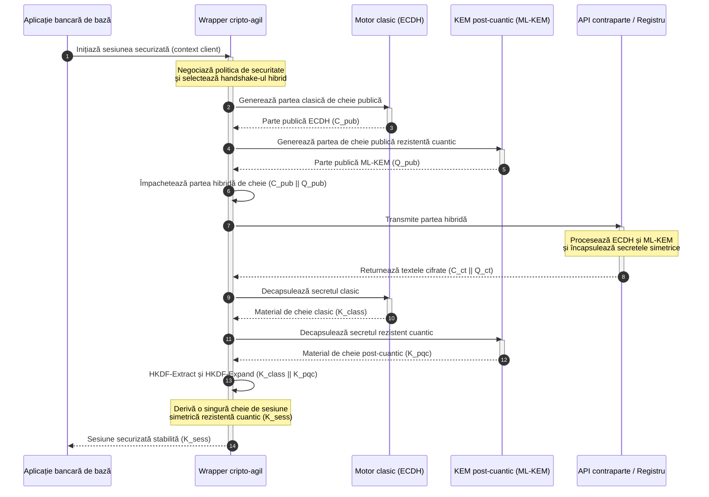

# KyberLib și migrarea bancară post-cuantică în 2026: de la standarde la cod

<!-- lead-start: manual -->
<aside class="post-lead" aria-label="Rezumatul articolului">

<strong>Pe scurt.</strong> Infrastructura bancară se confruntă în 2026 cu o amenințare sistemică al cărei deznodământ este cunoscut: calculul la scară cuantică va sparge schimbul de chei RSA și ECC care protejează astăzi traficul în tranzit. Standardele federale și documentele de politici ale supraveghetorilor au crescut gradul de conștientizare; execuția tehnică rămâne fragmentată. <a href="https://github.com/sebastienrousseau/kyberlib">KyberLib</a> este un plan de inginerie open source care mută narativul post-cuantic în cod Rust concret, sigur pentru memorie — implementând ML-KEM standardizat de NIST (FIPS 203) în spatele unor frontiere de abstractizare cripto-agile, astfel încât instituțiile să poată moderniza securitatea transportului și încapsularea cheilor înainte ca atacurile „Store Now, Decrypt Later" să le ajungă arhivele.

<strong>Concluzii principale</strong>

<ul class="post-lead-takeaways">
  <li><strong>De la politici la cod inspectabil.</strong> KyberLib mută criptografia post-cuantică din foile de parcurs strategice abstracte în implementări Rust concrete, performante și auditabile.</li>
  <li><strong>Execuție standardizată FIPS 203 ML-KEM.</strong> Biblioteca implementează ML-KEM — algoritmul de stabilire a cheilor finalizat sub NIST FIPS 203 — menținând conformitatea aliniată la așteptările de reglementare globale.</li>
  <li><strong>Cripto-agilitate prin proiectare.</strong> Frontierele de abstractizare stabile permit aplicațiilor bancare să înlocuiască primitivele criptografice fără rescrieri de aplicații costisitoare și predispuse la erori.</li>
  <li><strong>Siguranța memoriei garantată de Rust.</strong> Regulile de ownership verificate la compilare elimină buffer overflow-urile și scurgerile de memorie care afectează bibliotecile criptografice moștenite scrise în C, la viteza abstracțiilor cu cost zero.</li>
  <li><strong>Atenuarea răspunderii fiduciare.</strong> Dovezile de migrare observabile și testabile oferă administratorilor evidența „măsurilor rezonabile" pe care o cer auditurile de răspundere personală sub DORA articolul 5.</li>
</ul>

<strong>Lecturi conexe:</strong> <a href="/2026-05-18-quantum-cryptography-standards-developments-2026/">Resetarea criptografiei cuantice în 2026: standarde PQC, asigurarea QKD și migrarea pe care băncile nu o mai pot amâna</a>, <a href="/2026-05-28-dora-ai-act-data-sovereignty-banking-compliance-stack-2026/">DORA, EU AI Act și suveranitatea datelor: stiva de conformitate bancară 2026</a>, <a href="/2026-05-20-cloud-native-banking-financial-institutions-2026/">Cloud Native Banking în 2026: Kubernetes, DORA, suveranitate și sfârșitul diviziunii VM versus container</a>.

</aside>
<!-- lead-end -->

Migrarea post-cuantică a încetat să mai fie un exercițiu de planificare. În 2026 este o cerință operațională activă, iar decalajul dintre intenția de reglementare și execuția de inginerie este locul unde stă acum riscul. [KyberLib ⧉](https://github.com/sebastienrousseau/kyberlib "kyberlib") închide o parte din acest decalaj: o bibliotecă Rust orientată spre producție, sigură pentru memorie, care implementează ML-KEM la parametrii finali FIPS 203 și îl învelește în frontierele cripto-agile de care patrimoniul tranzacțional al unei bănci are nevoie cu adevărat.

---

> **Rezumat executiv / Concluzii principale**
>
> - **Amenințarea este deja operațională.** Adversarii execută astăzi colectarea „Store Now, Decrypt Later"; confidențialitatea datelor cedează retroactiv în ziua în care apare un calculator cuantic relevant criptografic.
> - **Standardele sunt finalizate.** NIST FIPS 203 (ML-KEM) și FIPS 204 (ML-DSA) oferă comitetelor de audit un reper clar și testabil — apărarea „așteptăm standardele" nu mai există.
> - **KyberLib este planul de inginerie.** Rust sigur pentru memorie, compilare `no_std` pentru HSM-uri și carduri inteligente și tipare de handshake hibrid care păstrează interoperabilitatea clasică.
> - **Cripto-agilitatea este obiectivul durabil.** Frontierele de abstractizare stabile permit schimbarea primitivelor fără rescrieri de aplicații — lecția care supraviețuiește oricărui algoritm.
> - **Consiliile poartă răspunderea.** DORA articolul 5 plasează responsabilitatea personală asupra administratorilor; codul de migrare inspectabil și observabil este dovada care o satisface.
>
---

## De ce contează acest proiect open source în 2026

Pe măsură ce criptografia asimetrică se apropie de uzura morală, amenințarea nu așteaptă construirea unui calculator cuantic relevant criptografic. Adversarii execută acum atacuri **„Store Now, Decrypt Later" (SNDL)** — colectează fluxurile criptate în tranzit cu tranzacții bancare corporative, secrete comerciale și comunicații instituționale, cu intenția de a le decripta odată ce capacitățile cuantice se maturizează. Pentru o bancă, fiecare handshake clasic aflat astăzi pe fir este o breșă de confidențialitate cu dată de detonare amânată.

Autoritățile de reglementare au răspuns cu obligații concrete:

1. **DORA articolul 6 (managementul riscului ICT)** cere instituțiilor să cartografieze, să identifice și să atenueze vulnerabilitățile din întregul patrimoniu criptografic — inclusiv schimbul asimetric de chei îngropat în middleware-ul pe care nimeni nu l-a inventariat.
2. **NIST FIPS 203 și 204** stabilesc standardele post-cuantice oficiale pentru încapsularea cheilor (ML-KEM) și semnăturile digitale (ML-DSA), oferind comitetelor de audit un reper standardizat față de care se măsoară progresul migrării.

Executarea acestei migrări fără a perturba operațiunile în curs cere depășirea documentelor de politici către **infrastructură criptografică open source, inspectabilă**. [KyberLib ⧉](https://github.com/sebastienrousseau/kyberlib "kyberlib") livrează exact asta: o bibliotecă Rust sigură pentru memorie, conformă cu FIPS 203, care transformă tranziția post-cuantică într-un pipeline de inginerie măsurabil și verificabil — și mută conversația despre investiția în tehnologie către un randament tangibil al rezilienței.

## Lentila arhitecturală

KyberLib stă în spatele unor frontiere API stabile, izolând aplicațiile tranzacționale de bază ale unei bănci de schimbările din primitivele criptografice de nivel scăzut.

| Strat | Decizie de proiectare | De ce contează | Risc dacă este gestionată greșit |
|---|---|---|---|
| **Primitivă** | Încapsulare a cheilor ML-KEM conform FIPS 203 | Înlocuiește schimbul clasic de chei Diffie-Hellman și RSA cu structuri bazate pe rețele (lattice) | Neconformitate cu parametrii finali FIPS 203, ducând la audituri de conformitate eșuate |
| **Limbaj** | Implementare Rust sigură pentru memorie | Elimină vulnerabilitățile de corupere a memoriei (buffer overflow, use-after-free) endemice în C/C++ | Proliferarea dependențelor care compromite integritatea lanțului de build |
| **Abstractizare** | Frontiere cripto-agile stabile | Aplicațiile schimbă algoritmii în spatele unei interfețe unificate pe măsură ce standardele evoluează | Primitive codificate rigid care impun rescrieri manuale la fiecare migrare viitoare |
| **Desfășurare** | Handshake-uri de criptare hibride | Combină KEM-urile post-cuantice cu algoritmii clasici într-un plic dublu împachetat | Pierderea interoperabilității moștenite sau deriva silențioasă a configurației |
| **Asigurare** | Proveniență SLSA Level 3 și teste inspectabile | Garantează sursa și proveniența codului; exemplele pot fi auditate linie cu linie | Teatru de securitate — biblioteci black-box ale căror erori de implementare ies la iveală în producție |

## Semnale operaționale de urmărit

A demonstra conformitatea post-cuantică în fața consiliilor de supraveghere și a autorităților de reglementare înseamnă urmărirea unor indicatori specifici, cuantificabili:

| Semnal | Metrică | Referință de reglementare | Implementare pe platformă |
|---|---|---|---|
| **Conformitate FIPS 203 ML-KEM** | Conformitate de 100% cu parametrii finalizați (ML-KEM-512/768/1024) | NIST FIPS 203 | Criptografie pe rețele (lattice) cu parametri verificați, compilată în modulele KyberLib |
| **Inventar criptografic** | Inventar complet al utilizării schimbului asimetric de chei în toate sistemele | NIST SP 1800-38 | Agenți de scanare automată care înregistrează suitele de cifruri active într-un registru central |
| **Schimb hibrid de chei** | Procentul handshake-urilor de la nivelul de transport executate într-un plic hibrid | DORA articolul 6 | Proxy-uri de rețea care împachetează handshake-urile clasice TLS 1.3 în încapsulare PQC |
| **Compilare `no_std`** | Capacitatea de a compila fără biblioteca standard Rust pentru ținte constrânse | DORA articolul 30 | Compilare condiționată `no_std` în KyberLib pentru module hardware de securitate (HSM) |
| **Indice de cripto-agilitate** | Timpul în minute necesar înlocuirii unei primitive criptografice la nivelul gateway-ului API | UK PRA SS1/23 | Registre de rutare abstractizate care gestionează alocarea algoritmilor prin variabile la runtime |

## De ce contează Rust pentru criptografia post-cuantică

Implementarea algoritmilor post-cuantici precum ML-KEM cere operații matematice complexe, de nivel scăzut, pe inele polinomiale. Istoric, rularea acestor operații la viteză de producție însemna C/C++ sau assembler scrise manual — o suprafață mare de atac pentru coruperea memoriei, exact în codul pe care o bancă își permite cel mai puțin să-l greșească.

Rust schimbă postura de securitate a ingineriei criptografice în trei moduri concrete:

1. **Siguranța memoriei la compilare.** Modelul de ownership din Rust garantează că buffer overflow-urile, eliberările duble și erorile use-after-free sunt prevenite la compilare. Acest lucru contează acut pentru bibliotecile post-cuantice, unde dimensiunile cheilor și ale textelor cifrate sunt semnificativ mai mari decât echivalentele lor clasice.
2. **Abstracții deterministe, cu cost zero.** Rust compilează în cod mașină nativ fără garbage collector, astfel încât viteza de execuție și amprenta de memorie egalează sau depășesc bibliotecile bazate pe C, păstrând în același timp siguranța.
3. **Compatibilitate `no_std`.** KyberLib compilează fără biblioteca standard Rust, deci rulează în medii constrânse, bare-metal — inclusiv module hardware de securitate (HSM) și carduri inteligente — păstrând criptografia de calibru bancar în interiorul frontierelor de securitate fizică.

## Proiectarea unei arhitecturi cripto-agile

Modul clasic de eșec al migrărilor criptografice este codificarea rigidă: ipoteze specifice algoritmului încastrate direct în logica aplicației, redescoperite dureros la fiecare tranziție. Obiectivul durabil pentru 2026 este **cripto-agilitatea** — un strat de abstractizare care tratează algoritmii ca module interșanjabile în spatele unei interfețe stabile, astfel încât următoarea migrare să fie o schimbare de configurație, nu o rescriere la nivelul întregului patrimoniu.

Secvența de mai jos arată cum wrapper-ul cripto-agil al KyberLib coordonează un handshake hibrid (clasic plus post-cuantic) de schimb de chei:

Plicul hibrid este detaliul important operațional. Până când primitivele post-cuantice acumulează ani de scrutin în producție, cheia de sesiune derivă atât din secretul clasic, cât și din cel post-cuantic: un atacator trebuie să spargă ECDH **și** ML-KEM pentru a recupera canalul. Contrapărțile care nu au migrat continuă să funcționeze; contrapărțile care au migrat obțin imediat protecție bazată pe rețele (lattice).

## Manualul consiliului de administrație

Securitatea post-cuantică nu este o preocupare de criptare de back-office; este o problemă de guvernanță la nivel de consiliu, cu mize personale. Managerii seniori ar trebui să încadreze migrarea prin prisma responsabilității fiduciare:

- **DORA articolul 5 (guvernanță și organizare)** plasează responsabilitatea personală pentru securitatea ICT asupra consiliului de administrație. Testele open source, observabile, sunt dovada directă pe care o cere un audit de răspundere personală — „am selectat o implementare FIPS 203 inspectabilă și iată rulările sale de conformitate" este un răspuns apărabil; „furnizorul nostru ne-a asigurat" nu este.
- **Managementul riscului de model (Fed SR 11-7 în SUA / PRA SS1/23 în Regatul Unit)** se aplică arhitecturilor de wrapper criptografic la fel de mult ca modelelor de evaluare. Straturile de abstractizare ar trebui să treacă prin validarea MRM, inclusiv performanța în scenarii de perturbare extremă.
- **Capitalul pentru risc operațional sub Basel III** recompensează maturitatea demonstrată a controalelor. Handshake-urile hibride testate reduc profilul de risc operațional pe termen lung al instituției, diminuând prima de capital și eliberând capacitate bilanțieră pentru utilizare activă de trezorerie.

## Ce înseamnă pentru fiecare tip de bancă

### Băncile de importanță sistemică globală (G-SIB)

Băncile G-SIB operează patrimonii tranzacționale dominate de sisteme moștenite, deci constrângerea lor determinantă este descoperirea: a ști unde are loc efectiv schimbul asimetric de chei. Inventarele criptografice continue, sub îndrumarea NIST SP 1800-38, vin primele; KyberLib oferă apoi biblioteca standardizată, sigură pentru memorie, pentru executarea încapsulării post-cuantice a cheilor pe fiecare nod modern pe care inventarul îl scoate la suprafață.

### Băncile de tranzacții și băncile corporative

Confidențialitatea pe șinele de plăți este însăși franciza. Pentru că KyberLib compilează pentru ținte bare-metal `no_std`, băncile de tranzacții pot desfășura handshake-uri post-cuantice direct în hardware-ul de rutare a plăților și de gestionare a lichidității de la margine — nu doar în stratul aplicativ.

### Băncile regionale și mai mici

Instituțiile regionale se confruntă cu aceeași colectare sponsorizată de state, fără bugetele de cercetare ale unei G-SIB. O implementare Rust open source, inspectabilă, le oferă o cale la cheie către conformitatea NIST FIPS 203 imediat, fără a negocia foi de parcurs black-box cu furnizorii.

## De la foi de parcurs la cod care compilează

Tranziția post-cuantică este o sarcină de inginerie activă, iar instituțiile care păstrează încrederea supraveghetorilor, a contrapărților și a trezorierilor corporativi pe parcursul lui 2026 sunt cele care trec de la foi de parcurs abstracte la cod observabil, care compilează. Mandatul executiv decurge direct: auditați punctele de schimb de chei moștenite, desfășurați handshake-uri hibride pe canalele cu cea mai mare valoare și construiți frontierele de abstractizare stabile care fac din fiecare înlocuire viitoare de primitivă o operațiune de rutină. KyberLib transformă fiecare dintre acești pași într-o capacitate operațională măsurabilă, nu într-un angajament de prezentare.

## Întrebări frecvente

**Este KyberLib conform cu standardele NIST finalizate?**

Da. KyberLib este proiectat în jurul parametrilor ML-KEM, așa cum au fost finalizați în FIPS 203, menținând biblioteca compilată aliniată la așteptările de reglementare federale și globale.

**O bibliotecă post-cuantică necesită hardware specializat?**

Nu. Implementarea Rust a KyberLib compilează pentru arhitecturi de sistem standard. Capacitatea sa `no_std` îi permite, în plus, să ruleze pe module hardware de securitate (HSM) specializate și pe carduri inteligente, acolo unde este necesară custodia fizică a cheilor.

**Cum afectează „Store Now, Decrypt Later" conformitatea actuală?**

Dacă stratul de transport se bazează pe RSA sau ECC clasice, adversarii pot colecta traficul astăzi și îl pot decripta odată ce capacitatea cuantică se maturizează. Schimbul hibrid de chei desfășurat acum păstrează datele capturate în spatele protecției bazate pe rețele (lattice).

**De ce handshake-uri hibride în loc de trecerea directă la primitive post-cuantice?**

Plicurile hibride derivă cheia de sesiune atât dintr-un secret clasic, cât și dintr-unul post-cuantic, astfel încât securitatea rezistă atât timp cât ambele nu sunt sparte. Aceasta păstrează interoperabilitatea cu contrapărțile nemigrate, în timp ce noile primitive acumulează scrutin în producție.

## Referințe

- National Institute of Standards and Technology, (2024). [FIPS 203: standardul mecanismului de încapsulare a cheilor bazat pe rețele de module ⧉](https://www.nist.gov/news-events/news/2024/08/nist-releases-first-3-finalized-post-quantum-encryption-standards "Anunțul NIST FIPS 203").
- Board of Governors of the Federal Reserve System, (2011). [Ghid de supraveghere privind managementul riscului de model (SR Letter 11-7) ⧉](https://www.federalreserve.gov/supervisionreg/srletters/sr1107.htm "Federal Reserve SR 11-7").
- Parlamentul European și Consiliul Uniunii Europene, (2022). [Regulamentul (UE) 2022/2554 privind reziliența operațională digitală a sectorului financiar (DORA) ⧉](https://eur-lex.europa.eu/legal-content/EN/TXT/?uri=CELEX%3A32022R2554 "Regulamentul DORA").
- NIST National Cybersecurity Center of Excellence, (2025). [Migrarea către criptografia post-cuantică (NIST SP 1800-38) ⧉](https://www.nccoe.nist.gov/projects/migration-post-quantum-cryptography "NIST SP 1800-38").
- GitHub, (2026). [Depozitul open source kyberlib ⧉](https://github.com/sebastienrousseau/kyberlib "Depozitul kyberlib").

<!-- enrich-start -->
<aside class="author-card" aria-label="Despre autor"><strong class="author-card-name"><a href="/about/index.html">Sebastien Rousseau</a></strong>Tehnolog bancar senior care scrie despre AI aplicat, infrastructura plăților, banii tokenizați, ISO 20022, securitatea post-cuantică, serviciile financiare cloud-native, infrastructura open source și piețele digitale reglementate.Peste 20 de ani de experiență la HSBC Commercial &amp; Investment Bank, PayPal, Barclays, Shazam, AKQA, Virgin Group. <a href="/about/index.html">Profil complet</a> &middot; <a href="https://www.linkedin.com/in/sebastienrousseau/" rel="external noopener">LinkedIn</a> &middot; <a href="https://github.com/sebastienrousseau" rel="external noopener">GitHub</a></aside>

Ultima revizuire <time datetime="2026-06-12">2026-06-12</time>.

<!-- enrich-end -->
