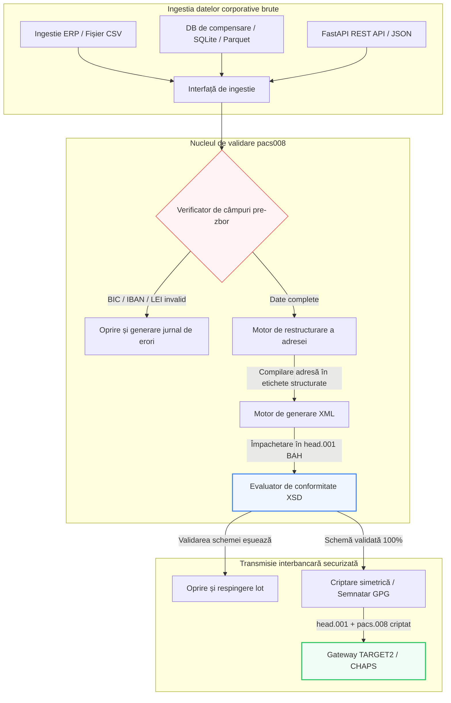

---

# Front Matter (YAML)

author: "contact@sebastienrousseau.com (Sebastien Rousseau)"
banner_alt: "Angajat de birou cu asistent vocal și laptop — simbolizând mesajele structurate, citibile de mașini, de plăți interbancare pe care le face programabile automatizarea pacs.008"
banner_height: "1597"
banner_width: "2584"
banner: "https://cloudcdn.pro/stocks/images/tyler-prahm-lmV3gJSAgbo.webp"
cdn: "https://cloudcdn.pro"
charset: "UTF-8"
cname: "sebastienrousseau.com"
copyright: "© Copyright 2025 - 2026 - Sebastien Rousseau. All rights reserved."
date: "15 iunie 2026"
description: "pacs008 este o bibliotecă Python open-source care automatizează generarea și validarea mesajelor ISO 20022 pacs.008 de transfer credit client FI-to-FI — adrese structurate, împachetare BAH head.001, sume de control BIC/LEI/IBAN, trasare UETR OpenTelemetry — construită pentru schimbarea SWIFT din noiembrie 2026."
format-detection: "telephone=no"
hreflang: "ro"
icon: "https://cloudcdn.pro/clients/sebastienrousseau/v1/logos/sebastienrousseau.svg"
id: "https://sebastienrousseau.com/2026-06-15-pacs008-automation-iso-20022-interbank-payments-2026"
image_alt: "Portret alb-negru al lui Sebastien Rousseau"
image_height: "162"
image_width: "162"
image: "https://cloudcdn.pro/stocks/images/sebastienrousseau.webp"
keywords: "pacs008, ISO 20022 pacs.008, transfer credit client FI to FI, adresă structurată, SWIFT CBPR+, BAH head.001, TARGET2, CHAPS, Fedwire, DORA, BCBS 239, Basel III, UETR, validare LEI, SEPA VoP"
language: "ro-RO"
last_reviewed: "2026-06-15"
layout: "report"
locale: "ro_RO"
logo_alt: "Logo pentru Sebastien Rousseau"
logo_height: "44"
logo_width: "44"
logo: "https://cloudcdn.pro/clients/sebastienrousseau/v1/logos/sebastienrousseau.svg"
menu: ""
measurementID: "G-169G4ET5HQ"
name: "Sebastien Rousseau"
permalink: "https://sebastienrousseau.com/2026-06-15-pacs008-automation-iso-20022-interbank-payments-2026"
rating: "general"
referrer: "no-referrer"
robots: "index, follow"
schema: "FAQPage, Article"
seo_title: "Automatizarea pacs.008 pentru era ISO 20022"
short_name: "sebastienrousseau"
subtitle: "Mesajul pacs.008 este punctul în care se întâlnesc datele de plăți interbancare, adresele structurate, conformitatea, rutarea și operațiunile de decontare."
tags: "pacs008, ISO 20022, plăți interbancare, plăți en gros, Python"
theme-color: "0, 83, 191"
title: "Construirea automatizării pacs.008 pentru era interbancară ISO 20022 în 2026"
url: "https://sebastienrousseau.com/2026-06-15-pacs008-automation-iso-20022-interbank-payments-2026"
viewport: "width=device-width, initial-scale=1, shrink-to-fit=no"

# RSS - The RSS feed front matter (YAML).
atom_link: "https://sebastienrousseau.com/2026-06-15-pacs008-automation-iso-20022-interbank-payments-2026/rss.xml"
category: "Finance"
docs: https://validator.w3.org/feed/docs/rss2.html
generator: "Static Site Generator (SSG) (version 0.0.26)"
item_description: "pacs008 oferă o bază Python open-source pentru automatizarea mesajelor ISO 20022 de transfer credit client FI-to-FI în era plăților interbancare."
item_guid: "https://sebastienrousseau.com/2026-06-15-pacs008-automation-iso-20022-interbank-payments-2026/rss.xml"
item_link: "https://sebastienrousseau.com/2026-06-15-pacs008-automation-iso-20022-interbank-payments-2026/rss.xml"
item_pub_date: "Mon, 15 Jun 2026 06:06:06 +0000"
item_title: "Construirea automatizării pacs.008 pentru era interbancară ISO 20022 în 2026"
last_build_date: "Mon, 15 Jun 2026 06:06:06 +0000"
managing_editor: "contact@sebastienrousseau.com (Sebastien Rousseau)"
pub_date: "Mon, 15 Jun 2026 06:06:06 +0000"
ttl: "60"
type: "article"
webmaster: "contact@sebastienrousseau.com"

# Apple - The Apple front matter (YAML).
apple_mobile_web_app_orientations: "portrait"
apple_touch_icon_sizes: "192x192"
apple-mobile-web-app-capable: "yes"
apple-mobile-web-app-status-bar-inset: "black"
apple-mobile-web-app-status-bar-style: "black-translucent"
apple-mobile-web-app-title: "Automatizarea pacs.008 pentru era ISO 20022"
apple-touch-fullscreen: "yes"

# MS Application - The MS Application front matter (YAML).

msapplication-navbutton-color: "0, 83, 191"

# Twitter Card - The Twitter Card front matter (YAML).

twitter_card: "summary_large_image"
twitter_creator: "@wwdseb"
twitter_description: "pacs008 oferă o bază Python open-source pentru automatizarea mesajelor ISO 20022 de transfer credit client FI-to-FI în era plăților interbancare."
twitter_image: "https://cloudcdn.pro/clients/sebastienrousseau/v1/logos/sebastienrousseau.svg"
twitter_image_alt: "Logo al lui Sebastien Rousseau"
twitter_site: "@wwdseb"
twitter_title: "Automatizarea pacs.008 pentru era ISO 20022"
twitter_url: "https://sebastienrousseau.com/2026-06-15-pacs008-automation-iso-20022-interbank-payments-2026"

excerpt: "pacs008 este un set de instrumente Python open-source care face programabile mesajele ISO 20022 pacs.008 de transfer credit client FI-to-FI — adrese structurate, validare, rutare, cârlige de conformitate și termenul limită SWIFT din noiembrie 2026 încorporate ca valori implicite."

# Humans.txt - The Humans.txt front matter (YAML).
author_website: "https://sebastienrousseau.com"
author_twitter: "@wwdseb"
author_location: "London, UK"
thanks: "Mulțumim pentru lectură!"
site_last_updated: "2026-06-15"
site_standards: "HTML5, CSS3, RSS, Atom, JSON, XML, YAML, Markdown, TOML"
site_components: "Kaishi, Kaishi Builder, Kaishi CLI, Kaishi Templates, Kaishi Themes"
site_software: "Static Site Generator, Rust"

---

# Automatizarea plăților interbancare ISO 20022 pacs.008 cu Python open-source în 2026

<!-- lead-start -->
<aside class="post-lead" aria-label="Rezumatul articolului">

<strong>Pe scurt.</strong> Conform liniilor directoare SWIFT CBPR+, termenul limită al adreselor structurate din 14 noiembrie 2026 scoate din funcțiune adresele poștale nestructurate pe TARGET2, CHAPS, Fedwire, Lynx și SEPA. pacs008 este o bibliotecă Python open-source care automatizează generarea și validarea mesajelor ISO 20022 de transfer credit client FI-to-FI (pacs.008), împachetează plățile în Business Application Headers (BAH head.001) și încorporează conformitatea adreselor structurate în calea datelor înainte ca mesajul să atingă o rețea de compensare.

<strong>Concluzii principale</strong>

<ul class="post-lead-takeaways">
  <li><strong>Termenul limită al adreselor structurate este absolut.</strong> După 14 noiembrie 2026, blocurile de adrese nestructurate sunt retrase. pacs008 impune elemente structurate de adresă poștală (<code>&lt;TwnNm&gt;</code>, <code>&lt;Ctry&gt;</code>, <code>&lt;PstCd&gt;</code>) la compilarea datelor pentru a preveni respingerile la frontieră.</li>
  <li><strong>Orchestrare unificată a mesajelor.</strong> Împachetează sarcina utilă a plății pacs.008 într-un plic conform Business Application Header (head.001), oferind un model standard de procesare dus-întors.</li>
  <li><strong>Integritate algoritmică.</strong> Validatoare integrate pentru BIC-uri și Legal Entity Identifiers (LEI) folosind calcule de sumă de control ISO 7064 Modulo 97-10.</li>
  <li><strong>Trasabilitate la nivel DORA.</strong> Instrumentare OpenTelemetry completă bazată pe Unique End-to-End Transaction Reference (UETR) pentru jurnale de audit în timp real și semnături criptografice de audit.</li>
  <li><strong>Conservarea responsabilității fiduciare la nivel de consiliu.</strong> Aliniază acuratețea mesajelor interbancare cu Articolul 5 DORA, raportarea BCBS 239 și economiile de capital de risc operațional Basel III.</li>
</ul>

<strong>Lecturi recomandate:</strong> <a href="https://sebastienrousseau.com/2026-05-19-global-wholesale-payments-economics-2026">Plăți en gros globale în 2026: ISO 20022, reînnoirea RTGS și economia interoperabilității</a>, <a href="https://sebastienrousseau.com/2026-05-27-ai-operating-system-payments-fraud-routing-resilience-compliance-2026">AI ca sistem de operare al plăților: fraudă, rutare, reziliență și conformitate în 2026</a>, <a href="https://sebastienrousseau.com/2026-05-12-iso-20022-pacs008-structured-address-deadline">Termenul limită pacs.008 pentru adresa structurată din noiembrie 2026: o perspectivă de șase luni</a>.

</aside>
<!-- lead-end -->

Punte între datele financiare moștenite și mesageria interbancară structurată, printr-o conductă Python auditabilă, validată prin schemă.

Punctul de referință open-source pentru acest articol este [pacs008 ⧉](https://github.com/sebastienrousseau/pacs008 "pacs008 — bibliotecă Python open-source"). Depozitul este poziționat ca o bibliotecă Python pentru automatizarea mesajelor XML ISO 20022 pacs.008 de transfer credit client FI-to-FI.

## De ce contează acest proiect open-source în 2026

Infrastructura globală de compensare a plăților interbancare trece prin cea mai profundă modernizare din ultimul jumătate de secol.

În iunie 2026, sectorul serviciilor financiare se apropie rapid de **termenul limită SWIFT al adreselor structurate din 14 noiembrie 2026**. Începând cu această dată, liniile directoare SWIFT CBPR+, împreună cu TARGET2, CHAPS, Fedwire și Lynx din Canada, vor scoate oficial din funcțiune liniile de adrese poștale nestructurate (folosind doar `<AdrLine>` în cadrul blocurilor `<PstlAdr>`). Toate instituțiile financiare participante trebuie să transmită adrese fie în format hibrid (`<TwnNm>` și `<Ctry>` structurate, cu maximum două elemente `<AdrLine>` pentru detaliile rămase), fie în format complet structurat (elemente individuale pentru numele străzii, numărul clădirii și codul poștal). Orice mesaj care nu îndeplinește acest criteriu va fi respins la frontiera rețelei.

Pentru instituțiile financiare, această tranziție creează constrângeri operaționale majore:

1. **Penalizarea respingerii la frontieră.** Plățile care nu îndeplinesc criteriile de adresă structurată vor fi imediat respinse de rețea, declanșând întârzieri tranzacționale, blocaje de lichiditate și restanțe operaționale.
2. **SEPA Verification of Payee (VoP).** Impune ca toți Payment Service Providers (PSP) din zona SEPA să verifice corespondența dintre numele beneficiarului și IBAN înainte de executarea transferurilor credit, adăugând o altă poartă de validare la inițierea mesajului.

[pacs008](https://github.com/sebastienrousseau/pacs008) rezolvă această problemă. Este o bibliotecă Python open-source, ușoară, care automatizează conversia datelor financiare brute în mesaje ISO 20022 pacs.008 de transfer credit client interbancar, complet validate și conforme cu schema. Acoperind golul dintre datele moștenite și cele structurate, pacs008 oferă un Return on Resilience (RoR) ridicat, conservând capitalul de lucru și asigurând execuția în timp real pe rețelele globale.

## Perspectiva arhitecturală pacs008 2026

Biblioteca pacs008 este structurată ca un motor izolat de validare și generare, asigurând că intrările brute sunt sistematic analizate, îmbogățite și împachetate în plicuri standard:

| Strat | Decizie de proiectare | De ce contează | Risc în caz de gestionare greșită |
|---|---|---|---|
| **Stratul de intrare** | Ingestia de CSV, JSON, SQLite și Parquet | Întâlnește echipele bancare de integrare acolo unde le sunt deja datele, prevenind migrările de platformă. | Ingestia de sarcini utile de date brute, nevalidate sau corupte. |
| **Stratul de validare** | Validare pre-zbor împotriva schemelor XSD oficiale și a regulilor de afaceri personalizate | Oprește execuția și semnalează erorile înainte ca fișierul de plată să fie transmis către rețeaua de compensare. | Fișiere XML invalide care declanșează respingeri imediate ale rețelei și întârzieri de compensare. |
| **Stratul plicului BAH** | Împachetarea automată Business Application Header (head.001) | Standardizează expedierea și rutarea mesajelor pe baza etichetei `<MsgDefIdr>`. | Transmiterea sarcinilor utile pacs.008 brute fără plicul exterior necesar, cauzând respingerea sistemului. |
| **Stratul de serializare** | Suport XML standard și JSON conform ISO (TS 23029) | Permite traducerea directă între sarcinile utile XML și JSON, susținând REST API modern și streaming Kafka. | Reprezentări fragmentate ale datelor care încalcă liniile directoare ISO oficiale. |
| **Stratul de observabilitate** | Trasare OpenTelemetry bazată pe UETR | Captează căi de execuție și jurnale detaliate, oferind auditabilitate în timp real. | Lacune de trasare care blochează vizibilitatea operațională și auditarea. |

## Semnale interbancare cheie și repere de reglementare

Pentru a demonstra reziliența operațională tranzacțională, managerii seniori de tehnologie și risc trebuie să urmărească indicatori specifici și cuantificabili de conformitate:

| Semnal | Metrică / Reper operațional | Referință G20 / SWIFT / DORA | Implementare tehnică pe platformă |
|---|---|---|---|
| **Conformitate adresă structurată** | % de mesaje pacs.008 care utilizează câmpuri `<PstlAdr>` complet structurate, cu `<TwnNm>` și `<Ctry>` desemnate. | Termen limită SWIFT SR 2026 | Verificări pre-zbor ale schemei în pacs008 care resping liniile de adresă nestructurate. |
| **SEPA Verification of Payee** | Validarea corespondenței dintre numele beneficiarului și IBAN înainte de execuția mesajului. | Reglementarea SEPA VoP | Clase helper VoP integrate care execută interogări de pre-validare pe IBAN/BIC. |
| **Integrare BAH head.001** | Procentul sarcinilor utile de plată ieșite împachetate cu succes în Business Application Headers. | Liniile directoare TARGET2 / CBPR+ | Subsistem de împachetare BAH care compilează automat plicul XML exterior. |
| **Sumă de control LEI Modulo** | Validarea cifrei de control ISO 7064 Modulo 97-10 pe blocurile `<LEI>` ale debitorului și creditorului. | Mandatul Bank of England | Verificator algoritmic care confirmă integritatea identificatorului de 20 de caractere. |
| **Acuratețea urmăririi UETR** | 100% dintre plățile generate sunt injectate cu un Unique End-to-End Transaction Reference valid. | Specificațiile UETR SWIFT | Generare și trasare automată a codului de referință UUIDv4 de 36 de caractere. |

## De ce Python este rampa de lansare ideală pentru automatizarea interbancară

Hub-urile moderne de plăți și echipele de operațiuni de trezorerie din 2026 se bazează intens pe Python pentru transformarea datelor, modelarea financiară și integrarea bazelor de date ERP.

Prin folosirea unei biblioteci Python open-source, instituțiile obțin avantaje semnificative:

1. **Sarcină cognitivă redusă și interoperabilitate ridicată.** Python acționează ca o punte coerentă. Permite dezvoltatorilor să scrie scripturi simple care extrag instrucțiunile de plată brute din bazele de date moștenite, le validează față de reguli bancare internaționale complexe și produc XML conform într-un singur flux de lucru unificat.
2. **Eliminarea traducătorilor opaci „cutie neagră".** Portalurile bancare proprietare percep adesea taxe ridicate de licențiere pentru traducători de fișiere de plată personalizați. Acești traducători sunt cutii negre proprietare, făcând imposibil pentru echipele de securitate să auditeze modul în care sunt procesate datele sau unde sunt stocate cheile. O bibliotecă open-source, inspectabilă, ca pacs008 asigură transparență totală a codului.
3. **Integrare CI/CD fără probleme.** pacs008 se integrează direct în pipeline-urile de integrare și implementare continuă, permițând dezvoltatorilor să automatizeze testarea fișierelor de plată ca parte a ciclului standard de livrare a software-ului.

## Proiectarea unei conducte interbancare delimitate

O vulnerabilitate majoră în compensarea interbancară este „generarea de loturi necontrolată" — generarea de fișiere fără o buclă de verificare clară, delimitată. pacs008 este proiectat să funcționeze ca motor central de validare în interiorul unei conducte tranzacționale strict controlate, în mai multe etape.

Fluxul operațional de mai jos arată cum datele tranzacționale brute trec prin conducta pacs008 pentru a genera un fișier pacs.008 securizat criptografic, conform cu schema, împachetat într-un plic BAH:

## Manualul de consiliu și răspunderea fiduciară

Automatizarea plăților interbancare este o problemă de gestionare a riscurilor și de guvernanță corporativă la nivel de consiliu. Managerii seniori trebuie să abordeze calitatea datelor tranzacționale prin prisma responsabilității fiduciare și a reducerii riscului operațional:

- **DORA Articolul 5 (Răspunderea consiliului).** Plasează răspunderea directă, personală asupra membrilor consiliului pentru reziliența și securitatea operațiunilor ICT ale instituției. Deoarece compensarea interbancară este o funcție corporativă critică, consiliile trebuie să demonstreze că au implementat controale tranzacționale robuste, validate și automatizate pentru a preveni perturbările operaționale sau plățile întârziate.
- **BCBS 239 (Agregarea și raportarea datelor de risc).** Cere ca raportarea tranzacțiilor financiare să fie precisă, completă și generată în timp real. pacs008 ajută instituțiile să atingă conformitatea BCBS 239 asigurându-se că datele de plată sunt structurate curat și validate la sursă, eliminând lacunele de date și erorile de reconciliere manuală care afectează foile de calcul moștenite.
- **Atenuarea cerințelor de capital pentru risc operațional (Basel III).** Conform liniilor directoare Basel III, ratele ridicate de erori de plată și costurile generale ale intervenției manuale măresc cerințele de capital pentru risc operațional ale băncii, blocând capital care altfel ar putea fi alocat pentru creditare sau investiții. Automatizarea conductei de plată minimizează direct aceste prime de capital, conservând valoarea bilanțului.

## Ce înseamnă pe tipuri de bănci

### Băncile globale de importanță sistemică (G-SIB)

G-SIB-urile gestionează volume masive de tranzacții corporative transfrontaliere. Provocarea lor principală este remedierea datelor moștenite nestructurate înainte ca acestea să ajungă la rețeaua de compensare. Prin integrarea pacs008 în gateway-urile lor de bancă corporativă, G-SIB-urile pot oferi utilități de validare automatizate clienților lor corporativi, reducând costurile reparațiilor manuale de plăți și asigurând execuția în timp real pe rețeaua SWIFT.

### Băncile de tranzacții și corporative

Pentru băncile de tranzacții, calitatea datelor de plată este un diferențiator competitiv. Oferind un instrument de validare open-source, inspectabil, ca pacs008 clienților de trezorerie corporativă, aceste bănci pot accelera integrarea, minimiza respingerile fișierelor de plată și construi încrederea clienților prin rate superioare de procesare directă (straight-through processing).

### Băncile regionale și mai mici

Băncile regionale trebuie să mențină conformitatea cu standardele internaționale de plată fără bugetele tehnologice masive ale G-SIB-urilor. pacs008 oferă o soluție ușoară, rentabilă și complet conformă, bazată pe Python, permițând instituțiilor mai mici să ofere capabilități moderne de inițiere a plăților structurate fără licențe scumpe de middleware proprietar.

## Concluzie: Foaia de parcurs pentru compensarea interbancară

Termenul limită SWIFT al adreselor structurate din noiembrie 2026 reprezintă o limită fermă pentru operațiunile de trezorerie corporativă. A te baza pe foi de calcul moștenite, introducerea manuală a datelor și fișiere de plată nestructurate este un risc activ de afaceri.

Pentru a asigura continuitatea tranzacțională și a minimiza costurile operaționale, managerii seniori de tehnologie și finanțe ar trebui să execute astăzi o foaie de parcurs clară pentru compensare:

1. **Impuneți validarea la sursă.** Cereți ca toate instrucțiunile de plată să fie validate și formatate conform schemelor XSD oficiale ISO 20022 înainte de a părăsi granițele ERP corporative.
2. **Auditați conducta de date.** Renunțați la procesarea manuală pe foi de calcul și implementați fluxuri de lucru automatizate, inspectabile, bazate pe Python, folosind pacs008.
3. **Implementați securitate hibridă.** Asigurați-vă că fișierele de plată generate sunt semnate criptografic și criptate înainte de transmitere, satisfăcând așteptările rețelei zero-trust.
4. **Aliniați-vă cu prioritățile fiduciare.** Raportați formal automatizarea plăților și metricile de calitate a datelor consiliului, încadrând investiția ca un program critic de reducere a riscului operațional în temeiul DORA.

## Întrebări frecvente

**Este pacs008 conform cu regulile de adresă SWIFT SR 2026 care urmează?**

Da. pacs008 este proiectat să susțină reperul strict al adreselor structurate SWIFT din noiembrie 2026, impunând separarea obligatorie a elementelor de adresă poștală (oraș, țară, cod poștal) în câmpuri XML ISO 20022 desemnate.

**Poate pacs008 să împacheteze sarcinile utile de plată în Business Application Headers?**

Da. Deoarece pacs008 susține nativ împachetarea Business Application Header (BAH head.001), compilează automat plicul exterior cerut de rețelele TARGET2, CHAPS și CBPR+.

**De ce este preferată o bibliotecă open-source față de traducătorii de fișiere proprietari?**

Traducătorii proprietari sunt cutii negre opace, făcând auditurile de securitate imposibile. O bibliotecă open-source, evaluată de la egal la egal, ca pacs008 oferă transparență totală a codului, permițând echipelor de securitate să verifice că nicio dată de plată sensibilă nu este expusă în timpul procesării.

**Ce identificatori validează pacs008?**

pacs008 este livrat cu validatoare integrate pentru Bank Identifier Codes (BIC) și Legal Entity Identifiers (LEI) folosind calcule de sumă de control ISO 7064 Modulo 97-10, plus validarea cifrei de control IBAN și verificările de unicitate UETR.

## Referințe

- SWIFT, (2024). *Reperul ISO 20022 al adreselor structurate din noiembrie 2026*. La Hulpe: SWIFT. Disponibil la: [Reperul SWIFT ISO 20022 ⧉](https://www.swift.com/standards/iso-20022/iso-20022-bytes/call-action-november-2026 "Reperul SWIFT ISO 20022").
- Basel Committee on Banking Supervision (BCBS), (2013). *Principles for effective risk data aggregation and risk reporting (BCBS 239)*. Basel: Bank for International Settlements. Disponibil la: [Principiile BCBS 239 ⧉](https://www.bis.org/publ/bcbs239.htm "Principiile BCBS 239").
- European Parliament and Council of the European Union, (2022). *Regulation (EU) 2022/2554 on digital operational resilience for the financial sector (DORA)*. Brussels: Official Journal of the European Union. Disponibil la: [Regulamentul DORA ⧉](https://eur-lex.europa.eu/legal-content/EN/TXT/?uri=CELEX%3A32022R2554 "Regulamentul DORA").
- GitHub, (2026). *Depozitul open-source pacs008*. Disponibil la: [Depozitul pacs008 ⧉](https://github.com/sebastienrousseau/pacs008 "Depozitul pacs008").

<!-- enrich-start -->
<aside class="author-card" aria-label="Despre autor"><strong class="author-card-name"><a href="/about/index.html">Sebastien Rousseau</a></strong>Tehnolog bancar senior care scrie despre AI aplicat, migrarea ISO 20022, criptografia post-cuantică pentru serviciile financiare și transformarea structurală a plăților en gros.Peste 20 de ani la HSBC Commercial &amp; Investment Bank, PayPal, Barclays, Shazam, AKQA, Virgin Group. <a href="/about/index.html">Profil complet</a> &middot; <a href="https://www.linkedin.com/in/sebastienrousseau/" rel="external noopener">LinkedIn</a> &middot; <a href="https://github.com/sebastienrousseau" rel="external noopener">GitHub</a></aside>

Ultima revizuire <time datetime="2026-06-15">2026-06-15</time>.

<aside class="related-posts" aria-labelledby="related-heading">
<h2 id="related-heading" class="related-heading">Lecturi recomandate</h2>

<article class="related-card"><footer class="related-body"><h3><a href="https://sebastienrousseau.com/2026-05-19-global-wholesale-payments-economics-2026">Plăți en gros globale în 2026: ISO 20022, reînnoirea RTGS și economia interoperabilității</a></h3>
<time datetime="2026-05-19">2026-05-19</time>
</footer></article>
<article class="related-card"><footer class="related-body"><h3><a href="https://sebastienrousseau.com/2026-05-27-ai-operating-system-payments-fraud-routing-resilience-compliance-2026">AI ca sistem de operare al plăților: fraudă, rutare, reziliență și conformitate în 2026</a></h3>
<time datetime="2026-05-27">2026-05-27</time>
</footer></article>
<article class="related-card"><footer class="related-body"><h3><a href="https://sebastienrousseau.com/2026-05-12-iso-20022-pacs008-structured-address-deadline">Termenul limită pacs.008 pentru adresa structurată din noiembrie 2026: o perspectivă de șase luni</a></h3>
<time datetime="2026-05-12">2026-05-12</time>
</footer></article>

</aside>
<!-- enrich-end -->
