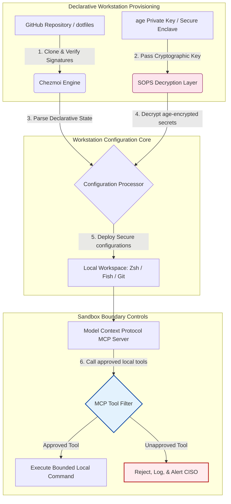

---

# Front Matter (YAML)

author: "contact@sebastienrousseau.com (Sebastien Rousseau)"
banner_alt: "Stație de lucru pentru dezvoltator în lumină slabă — simbolizând dotfiles conștiente de AI, reproductibile și sigure pentru servere MCP, semnare SLSA, secrete age/SOPS și paritate multi-shell"
banner_height: "1597"
banner_width: "2584"
banner: "https://cloudcdn.pro/stocks/images/almas-salakhov-Vq2ap8aFFEs.webp"
cdn: "https://cloudcdn.pro"
charset: "UTF-8"
cname: "sebastienrousseau.com"
copyright: "© Copyright 2025 - 2026 - Sebastien Rousseau. All rights reserved."
date: "June 16, 2026"
description: "Dotfiles conștiente de AI sunt un model de stație de lucru sigură și reproductibilă pentru era MCP — configurație declarativă cu Chezmoi, secrete SOPS/age, proveniență SLSA Nivel 3, paritate multi-shell și limite de sandbox pentru agenții AI locali."
format-detection: "telephone=no"
hreflang: "ro"
icon: "https://cloudcdn.pro/clients/sebastienrousseau/v1/logos/sebastienrousseau.svg"
id: "https://sebastienrousseau.com/2026-06-16-ai-aware-dotfiles-secure-reproducible-workstation-2026"
image_alt: "Portret alb-negru al lui Sebastien Rousseau"
image_height: "162"
image_width: "162"
image: "https://cloudcdn.pro/stocks/images/sebastien-rousseau.png"
keywords: "dotfiles, Chezmoi, MCP, Model Context Protocol, SLSA, SOPS, criptare age, configurație declarativă, stație de lucru pentru dezvoltator, DORA Articolul 5, NIST CSF 2.0, securitatea lanțului de aprovizionare, AI agentic, paritate multi-shell, Zsh, Fish, Nushell"
language: "ro-RO"
last_reviewed: "2026-06-16"
layout: "report"
locale: "ro_RO"
logo_alt: "Logo pentru Sebastien Rousseau"
logo_height: "44"
logo_width: "44"
logo: "https://cloudcdn.pro/clients/sebastienrousseau/v1/logos/sebastienrousseau.svg"
menu: ""
measurementID: "G-169G4ET5HQ"
name: "Sebastien Rousseau"
permalink: "https://sebastienrousseau.com/2026-06-16-ai-aware-dotfiles-secure-reproducible-workstation-2026"
rating: "general"
referrer: "no-referrer"
robots: "index, follow"
schema: "FAQPage, Article"
seo_title: "Dotfiles conștiente de AI pentru o stație de lucru sigură"
short_name: "sebastienrousseau"
subtitle: "Stația de lucru pentru dezvoltator face acum parte din lanțul de aprovizionare AI; dotfiles au nevoie de securitate, reproductibilitate, igiena secretelor și fluxuri conștiente de MCP."
tags: "dotfiles, instrumente pentru dezvoltatori, MCP, SLSA, stație de lucru sigură, chezmoi, macOS, Linux, WSL"
theme-color: "0, 83, 191"
title: "Dotfiles conștiente de AI în 2026: o stație de lucru sigură și reproductibilă pentru MCP, SLSA și paritate multi-shell"
url: "https://sebastienrousseau.com/2026-06-16-ai-aware-dotfiles-secure-reproducible-workstation-2026"
viewport: "width=device-width, initial-scale=1, shrink-to-fit=no"

# RSS - The RSS feed front matter (YAML).
atom_link: "https://sebastienrousseau.com/2026-06-16-ai-aware-dotfiles-secure-reproducible-workstation-2026/rss.xml"
category: "Technology"
docs: https://validator.w3.org/feed/docs/rss2.html
generator: "Static Site Generator (SSG) (version 0.0.26)"
item_description: "O analiză a dotfiles declarative pentru stații de lucru de dezvoltator sigure și reproductibile pe macOS, Linux și WSL, cu conștientizare MCP, SLSA, age, SOPS și paritate multi-shell."
item_guid: "https://sebastienrousseau.com/2026-06-16-ai-aware-dotfiles-secure-reproducible-workstation-2026/rss.xml"
item_link: "https://sebastienrousseau.com/2026-06-16-ai-aware-dotfiles-secure-reproducible-workstation-2026/rss.xml"
item_pub_date: "Tue, 16 Jun 2026 06:06:06 +0000"
item_title: "Dotfiles conștiente de AI în 2026: o stație de lucru sigură și reproductibilă pentru MCP, SLSA și paritate multi-shell"
last_build_date: "Tue, 16 Jun 2026 06:06:06 +0000"
managing_editor: "contact@sebastienrousseau.com (Sebastien Rousseau)"
pub_date: "Tue, 16 Jun 2026 06:06:06 +0000"
ttl: "60"
type: "article"
webmaster: "contact@sebastienrousseau.com"

# Apple - The Apple front matter (YAML).
apple_mobile_web_app_orientations: "portrait"
apple_touch_icon_sizes: "192x192"
apple-mobile-web-app-capable: "yes"
apple-mobile-web-app-status-bar-inset: "black"
apple-mobile-web-app-status-bar-style: "black-translucent"
apple-mobile-web-app-title: "Dotfiles conștiente de AI pentru o stație de lucru sigură"
apple-touch-fullscreen: "yes"

# MS Application - The MS Application front matter (YAML).

msapplication-navbutton-color: "0, 83, 191"

# Twitter Card - The Twitter Card front matter (YAML).

twitter_card: "summary_large_image"
twitter_creator: "@wwdseb"
twitter_description: "O analiză a dotfiles declarative pentru stații de lucru de dezvoltator sigure și reproductibile pe macOS, Linux și WSL, cu conștientizare MCP, SLSA, age, SOPS și paritate multi-shell."
twitter_image: "https://cloudcdn.pro/clients/sebastienrousseau/v1/logos/sebastienrousseau.svg"
twitter_image_alt: "Logo al lui Sebastien Rousseau"
twitter_site: "@wwdseb"
twitter_title: "Dotfiles conștiente de AI pentru o stație de lucru sigură"
twitter_url: "https://sebastienrousseau.com/2026-06-16-ai-aware-dotfiles-secure-reproducible-workstation-2026"

excerpt: "Dotfiles conștiente de AI în 2026 tratează stația de lucru pentru dezvoltator ca infrastructură de lanț de aprovizionare — configurație declarativă gestionată cu chezmoi, conștientizare MCP, lansări semnate SLSA, secrete age/SOPS, pornire sub o secundă și paritate macOS/Linux/WSL."

# Humans.txt - The Humans.txt front matter (YAML).
author_website: "https://sebastienrousseau.com"
author_twitter: "@wwdseb"
author_location: "London, UK"
thanks: "Mulțumim pentru lectură!"
site_last_updated: "2026-06-16"
site_standards: "HTML5, CSS3, RSS, Atom, JSON, XML, YAML, Markdown, TOML"
site_components: "Kaishi, Kaishi Builder, Kaishi CLI, Kaishi Templates, Kaishi Themes"
site_software: "Static Site Generator, Rust"

---

# Dotfiles conștiente de AI în 2026: o stație de lucru sigură și reproductibilă pentru MCP, SLSA și paritate multi-shell

<!-- lead-start -->
<aside class="post-lead" aria-label="Rezumatul articolului">

<strong>Pe scurt.</strong> Stația de lucru pentru dezvoltator nu mai este un simplu endpoint; este un participant activ în lanțul de aprovizionare software și o interfață directă către planul de control AI local. Asistenții AI bazați pe terminal și serverele <a href="https://modelcontextprotocol.io">Model Context Protocol (MCP)</a> execută comenzi shell locale, inspectează depozite și citesc fișiere de configurație sensibile direct. <a href="https://github.com/sebastienrousseau/dotfiles">Dotfiles al lui Sebastien Rousseau</a> este un cadru declarativ, open-source, care construiește stații de lucru sigure și reproductibile pe macOS, Linux și Windows Subsystem for Linux (WSL) — integrând <a href="https://www.chezmoi.io/">Chezmoi</a>, <a href="https://github.com/getsops/sops">SOPS, age</a> și proveniența SLSA Nivel 3 pentru izolarea secretelor în memorie sigură și căi de execuție delimitate pentru modelele AI locale.

<strong>Concluzii principale</strong>

<ul class="post-lead-takeaways">
  <li><strong>Stațiile de lucru sunt infrastructură de lanț de aprovizionare.</strong> Configurațiile mediului de dezvoltare trebuie tratate cu aceeași rigoare declarativă ca implementările pe servere de producție, eliminând derivarea manuală a configurației.</li>
  <li><strong>Provocarea planului de control AI.</strong> Modelele AI bazate pe terminal și instrumentele MCP pot accesa directoare locale. Dotfiles trebuie să impună limite de sandbox, liste stricte de permisiuni pentru instrumente și jurnale locale inalterabile pentru a preveni scurgerea datelor.</li>
  <li><strong>Paritate cross-platformă absolută.</strong> Performanță identică, sub o secundă, a shell-ului și profiluri de securitate identice pe macOS, Linux (Zsh, Fish, Nushell) și WSL, reducând timpul de integrare al dezvoltatorilor de la săptămâni la minute.</li>
  <li><strong>Izolare criptografică a secretelor.</strong> Criptarea fișierelor cu SOPS și age împiedică comiterea credențialelor hardcodate (token-uri GitHub, chei de acces cloud) în Git sau citirea lor de către LLM-uri locale.</li>
  <li><strong>Valoare fiduciară la nivel de consiliu.</strong> Traduce conformitatea configurației stației de lucru în priorități clare pentru consiliul de administrație, susținând DORA Articolul 5, standardele de endpoint NIST CSF 2.0 și reducerea riscului operațional Basel III.</li>
</ul>

<strong>Lecturi conexe:</strong> <a href="https://sebastienrousseau.com/2026-05-23-agentic-payments-banking-consent-liability-new-payment-ux-2026">Plăți agentice în bănci: consimțământ, răspundere și noul UX al plăților în 2026</a>, <a href="https://sebastienrousseau.com/2024-03-12-revolutionising-real-time-speech-recognition-on-macos-with-openai-whisper/index.html">Recunoaștere rapidă a vorbirii în timp real pe macOS: OpenAI Whisper</a>, <a href="https://sebastienrousseau.com/2024-02-26-google-gemma-ai-transforming-open-source-ai-development/index.html">Google Gemma AI: Transformarea dezvoltării AI open-source</a>.

</aside>
<!-- lead-end -->

Punte între configurația declarativă a stației de lucru și lanțurile de aprovizionare software sigure într-o epocă a modelelor AI locale și a instrumentelor agentice pentru dezvoltatori.

Reperul open-source pentru acest articol este [dotfiles ⧉](https://github.com/sebastienrousseau/dotfiles "dotfiles — configurație declarativă a stației de lucru"). Depozitul este poziționat astfel: dotfiles declarative pentru macOS, Linux și WSL, oferind paritate multi-shell, pornire sub o secundă, lansări semnate SLSA și configurație conștientă de AI/MCP.

## De ce contează acest proiect open-source în 2026

În iunie 2026, stația de lucru pentru dezvoltator este veriga slabă a lanțului de aprovizionare software și o țintă de mare valoare pentru sindicatele cibernetice criminale și pentru actorii statali sofisticați.

Securitatea mediului de dezvoltare s-a schimbat radical odată cu apariția asistenților AI de codificare bazați pe terminal (precum Claude Code) și cu adoptarea Model Context Protocol (MCP). Terminalele locale ale dezvoltatorilor găzduiesc acum agenți AI activi și autonomi capabili să:

- Citească și să editeze fișiere sursă locale.
- Apeleze instrumente CLI locale (`git`, `npm`, `aws`, `kubectl`).
- Inspecteze variabilele de mediu ale shell-ului, bazele de date locale și setările de configurație.

Dacă mediul local al dezvoltatorului nu are limite stricte, aceste instrumente AI autonome pot citi neintenționat date personale sensibile, pot scurge credențiale cloud către API-uri LLM publice sau pot executa pachete malițioase în timpul build-urilor automate.

În baza Digital Operational Resilience Act (DORA) și a NIST Cybersecurity Framework (CSF) 2.0, instituțiile financiare sunt obligate legal să verifice proveniența și integritatea de securitate a fiecărui dispozitiv care accesează lanțul de aprovizionare software. „Laptopurile unicat" — configurate manual, neauditate, cu derivă continuă — nu mai sunt conforme cu standardele bancare globale.

[Dotfiles al lui Sebastien Rousseau](https://github.com/sebastienrousseau/dotfiles) rezolvă această problemă. Este un cadru open-source, declarativ, de gestionare a stației de lucru, care stabilește stații de lucru sigure și reproductibile pentru dezvoltatori. Prin impunerea unei configurații de referință standardizate și auditabile, proiectul oferă un Return on Resilience (RoR) ridicat, reducând timpul de integrare al dezvoltatorilor de la săptămâni la ore și protejând lanțurile de aprovizionare financiare sensibile de vulnerabilitățile endpoint-urilor.

## Lentila arhitecturii stației de lucru conștiente de AI în 2026

Cadrul dotfiles funcționează ca un manager declarativ de mediu sigur — toate shell-urile locale, instrumentele și secretele sunt gestionate sistematic, auditate și izolate:

| Strat | Decizie de proiectare | De ce contează | Risc dacă este gestionat greșit |
|---|---|---|---|
| **Strat de provisioning** | Gestionare declarativă a configurației prin Chezmoi | Construiește stații de lucru complet reproductibile pe macOS, Linux și WSL, eliminând derivarea. | Configurații unicat cu stări locale neauditate și vulnerabile. |
| **Strat shell** | Paritate multi-shell (Zsh, Fish, Nushell) | Asigură pornire identică, sub o secundă, și comportament consistent al alias-urilor în medii diferite. | Inconsistențe în comenzile shell care produc rezultate neașteptate ale scripturilor. |
| **Strat de secrete** | Criptarea fișierelor cu SOPS și age | Împiedică comiterea credențialelor hardcodate și a cheilor brute în Git sau expunerea lor către LLM-uri locale. | Credențiale scurse în istoricul depozitelor publice sau compromise de agenții locali. |
| **Strat AI/MCP** | Controale de limită Model Context Protocol | Restricționează agenții AI locali la o listă specifică de instrumente aprobate, înregistrând toate execuțiile locale. | Agenți AI nelimitați care execută comenzi necontrolate sau distructive local. |
| **Strat de lanț de aprovizionare** | Lansări semnate SLSA și verificare Sigstore | Dovedește criptografic autenticitatea scripturilor de bootstrap și a fișierelor de configurație. | Scripturi de configurare compromise care injectează backdoor-uri malițioase în mediile dezvoltatorilor. |

## Semnale-cheie pentru securitatea și automatizarea stației de lucru

Pentru a menține o securitate absolută în întregul parc de dezvoltare, Chief Information Security Officers (CISO) și managerii de tehnologie trebuie să urmărească indicatori operaționali specifici și cuantificabili:

| Semnal | Metrică / Reper operațional | Referință NIST CSF / DORA | Implementare tehnică pe platformă |
|---|---|---|---|
| **Reproductibilitatea stației de lucru** | % din laptopurile dezvoltatorilor gestionate complet prin depozite dotfile declarative, fără derivă de configurație. | NIST CSF 2.0 (PR.DS-01) | Audituri Chezmoi de detectare a derivei executate automat la pornirea terminalului. |
| **Igiena credențialelor** | Zero secrete sau chei necriptate stocate în text clar în fișierele de configurație locale. | DORA Articolul 6 (Securitate ICT) | Hook-uri Git pre-commit și scanări locale care resping fișierele necriptate. |
| **Proveniență de build** | 100% din utilitarele de bootstrap ale stației de lucru verificate prin manifeste semnate criptografic. | DORA Articolul 30 (Lanț de aprovizionare) | Verificare Sigstore și SLSA Nivel 3 încorporată în pipeline-urile de configurare. |
| **Timp de integrare al dezvoltatorilor** | Timpul scurs de la livrarea hardware brut la un spațiu de lucru de dezvoltare complet configurat și conform. | Return on Resilience (RoR) | Scripturi automate, declarative, care compun mediul în mai puțin de 15 minute. |
| **Acces delimitat al agenților AI** | Verificarea faptului că instrumentele AI locale operează în limite de directoare definite, cu valori implicite de tip read-only. | Model Risk Management | Profiluri de configurație MCP care restricționează cataloagele de instrumente ale agenților la operațiuni aprobate. |

## De ce configurația declarativă este nucleul securității stației de lucru

Abordările tradiționale ale configurării stației de lucru pentru dezvoltatori sunt foarte manuale și produc „laptopuri unicat" — medii în care configurațiile derivează în timp pe măsură ce dezvoltatorii instalează instrumente personalizate, ajustează variabile și modifică scripturi locale. Această derivă creează mai multe vulnerabilități critice:

1. **Configurații umbră neurmărite.** Laptopurile cu derivă rulează adesea pachete software învechite și vulnerabile sau scripturi locale care ocolesc instrumentele de securitate corporative.
2. **Scurgere de secrete.** Dezvoltatorii hardcodează frecvent chei API, token-uri GitHub sau credențiale AWS direct în scripturi text-clar sau în profilurile shell, expunându-le foarte ușor la furt.
3. **Integrare ineficientă.** Configurarea manuală a unei noi stații de lucru pentru dezvoltatori poate dura până la două săptămâni de timp de inginerie, afectând viteza echipei.

Prin trecerea la o configurație declarativă, condusă de model, cu Chezmoi, întregul spațiu de lucru al dezvoltatorului devine un sistem de înregistrare reproductibil și versionat. Fiecare modificare, alias, dependență de pachet și valoare implicită de securitate este documentată în Git, validată față de politicile de conformitate organizaționale și verificată criptografic înainte de a fi aplicată pe laptopul fizic.

## Proiectarea unui mediu de dezvoltare AI delimitat

Pentru a împiedica agenții AI locali și instrumentele MCP să obțină acces nelimitat la activele locale, stația de lucru trebuie să funcționeze ca un plan de execuție delimitat.

Fluxul operațional de mai jos arată cum cadrul dotfiles coordonează Chezmoi, SOPS și age pentru a decripta și implementa dotfiles sigure, menținând în același timp o limită de execuție izolată, în sandbox, pentru agenții AI locali care apelează instrumente MCP:

## Manualul consiliului și răspunderea fiduciară

Securitatea stației de lucru pentru dezvoltator și integritatea lanțului de aprovizionare sunt priorități critice ale consiliului. Managerii seniori trebuie să abordeze riscul mediului de dezvoltare prin prisma responsabilității fiduciare, a conformității cu reglementările și a păstrării valorii de afaceri:

- **DORA Articolul 5 (Răspunderea consiliului).** Impune ca organul de conducere (consiliul) să poarte responsabilitatea finală pentru managementul riscului ICT al instituției. Deoarece stațiile de lucru pentru dezvoltatori sunt poarta de intrare către lanțul de aprovizionare software, directorii consiliului trebuie să verifice că endpoint-urile sunt sigure, complet auditabile și gestionate sub cadre de configurație stricte și reproductibile, pentru a satisface auditurile de reglementare.
- **Conformitate NIST CSF 2.0 (Securitatea endpoint-urilor).** Cere ca numai dispozitivele autorizate și validate, care rulează configurații standardizate și sigure, să poată accesa rețelele și depozitele corporative. Dotfiles declarative permit echipelor de securitate să demonstreze matematic că toate mediile de dezvoltare sunt conforme cu nivelul de bază al securității organizației, eliminând riscul configurațiilor „unicat" neauditate.
- **Păstrarea valorii din bilanț.** O singură credențială de dezvoltator compromisă sau o breșă în lanțul de aprovizionare poate costa o instituție milioane de dolari în remediere, amenzi de reglementare și daune reputaționale. Trecerea la un mediu de dezvoltare sigur și declarativ minimizează direct acest risc, păstrând valoarea din bilanț și protejând încrederea clienților.

## Ce înseamnă aceasta pentru fiecare tip de bancă

### Bănci globale de importanță sistemică (G-SIB)

G-SIB-urile gestionează mii de stații de lucru pentru dezvoltatori pe mai multe continente și jurisdicții de reglementare. Provocarea lor principală este menținerea consistenței configurației și prevenirea scurgerilor de credențiale în echipe de inginerie masive. Prin adoptarea unui model declarativ, open-source, de dotfiles cu Chezmoi, G-SIB-urile pot standardiza securitatea endpoint-urilor, automatiza auditarea conformității și reduce timpul de integrare al dezvoltatorilor de la săptămâni la minute în întreaga organizație globală.

### Bănci de tranzacții și bănci corporative

Băncile de tranzacții operează gateway-uri de plată sensibile și infrastructuri de clearing wholesale. Dovedirea integrității absolute a codului implementat în aceste medii de producție este o cerință de reglementare nenegociabilă. Standardizarea stațiilor de lucru pentru dezvoltatori sub un cadru dotfiles sigur și conform SLSA garantează că lanțul de aprovizionare software este complet auditat și protejat de vulnerabilitățile endpoint-urilor dezvoltatorilor locali.

### Bănci regionale și mai mici

Băncile regionale trebuie să mențină standarde înalte de securitate cibernetică fără bugetele masive de securitate ale G-SIB-urilor. Acest cadru dotfiles open-source oferă o soluție ușoară, rentabilă și foarte sigură, prietenoasă cu Python și Rust, permițând instituțiilor mai mici să implementeze securitate endpoint și protecție a lanțului de aprovizionare la nivel enterprise, fără licențe software proprietare costisitoare.

## Concluzie: foaia de parcurs a stației de lucru pentru dezvoltator

Stația de lucru pentru dezvoltator nu mai este un dispozitiv periferic; este un plan de control critic în lanțul de aprovizionare software. Permiterea „laptopurilor unicat" configurate manual și neauditate să acceseze activele corporative este un risc operațional și de reglementare sever.

Pentru a securiza lanțul de aprovizionare software și a proteja endpoint-urile de vulnerabilitățile agenților AI locali, managerii seniori de tehnologie și securitate ar trebui să execute astăzi o foaie de parcurs clară pentru dezvoltare:

1. **Impuneți provisioning-ul declarativ.** Eliminați treptat procesele de configurare manuală, conduse de documente, și impuneți ca toate mediile de dezvoltare să fie provisionate declarativ cu Chezmoi.
2. **Impuneți igiena secretelor.** Aplicați hook-uri pre-commit stricte și utilitare de scanare pentru a vă asigura că zero credențiale brute, chei sau token-uri API sunt stocate în text clar în configurațiile locale ale stației de lucru.
3. **Stabiliți limite de sandbox AI.** Implementați profiluri de configurație MCP sigure și delimitate pentru a restricționa asistenții AI de codificare și agenții locali la instrumente și directoare aprobate, de tip read-only.
4. **Securizați lanțul de aprovizionare.** Asigurați-vă că toate scripturile de bootstrap și configurațiile de mediu sunt verificate criptografic cu proveniență SLSA Nivel 3 înainte de implementare.

## Întrebări frecvente

**Ce este Chezmoi și de ce este folosit pentru dotfiles?**

Chezmoi este un manager open-source, sigur și declarativ de dotfile. Permite dezvoltatorilor să își gestioneze configurațiile locale ca un depozit versionat, asigurând consistență și reproductibilitate absolută pe sisteme de operare diferite (macOS, Linux, WSL).

**Cum protejează cadrul secretele?**

Cadrul folosește criptarea fișierelor cu SOPS (Secrets Operations) și age pentru a cripta credențialele sensibile (precum token-urile GitHub sau cheile de acces cloud) direct în depozitul dotfile. Acest lucru împiedică comiterea cheilor în text clar sau citirea lor de către agenți AI locali neautorizați.

**Ce este Model Context Protocol (MCP) și cum afectează securitatea?**

MCP este un standard deschis care permite modelelor AI să execute în siguranță instrumente locale și să acceseze fișiere. Cadrul dotfiles implementează fișiere stricte de configurație MCP pentru a restricționa instrumentele și agenții AI locali la directoare și comenzi aprobate.

**Ce shell-uri suportă cadrul?**

Bash, Zsh, Fish, Nushell și PowerShell — cu paritate pe macOS, Linux și WSL, astfel încât comportamentul comenzilor să rămână identic indiferent de terminalul pe care îl deschide un dezvoltator.

## Referințe

- Open Source Security Foundation (OpenSSF), (2024). *Supply-chain Levels for Software Artifacts (SLSA)*. Disponibil la: [Cadrul SLSA ⧉](https://slsa.dev/ "cadrul SLSA").
- NIST, (2024). *NIST Cybersecurity Framework 2.0*. Gaithersburg: National Institute of Standards and Technology. Disponibil la: [NIST CSF 2.0 ⧉](https://www.nist.gov/cyberframework "NIST Cybersecurity Framework 2.0").
- Parlamentul European și Consiliul Uniunii Europene, (2022). *Regulamentul (UE) 2022/2554 privind reziliența operațională digitală pentru sectorul financiar (DORA)*. Bruxelles: Jurnalul Oficial al Uniunii Europene. Disponibil la: [Regulamentul DORA ⧉](https://eur-lex.europa.eu/legal-content/EN/TXT/?uri=CELEX%3A32022R2554 "regulamentul DORA").
- GitHub, (2026). *Depozitul open-source dotfiles*. Disponibil la: [Depozitul dotfiles ⧉](https://github.com/sebastienrousseau/dotfiles "depozitul dotfiles").

<!-- enrich-start -->
<aside class="author-card" aria-label="Despre autor"><strong class="author-card-name"><a href="/about/index.html">Sebastien Rousseau</a></strong>Tehnolog bancar senior care scrie despre AI aplicat, migrarea ISO 20022, criptografia post-cuantică pentru serviciile financiare și transformarea structurală a plăților wholesale.Peste 20 de ani de experiență la HSBC Commercial &amp; Investment Bank, PayPal, Barclays, Shazam, AKQA, Virgin Group. <a href="/about/index.html">Profil complet</a> &middot; <a href="https://www.linkedin.com/in/sebastienrousseau/" rel="external noopener">LinkedIn</a> &middot; <a href="https://github.com/sebastienrousseau" rel="external noopener">GitHub</a></aside>

Ultima revizuire <time datetime="2026-06-16">2026-06-16</time>.

<aside class="related-posts" aria-labelledby="related-heading">
<h2 id="related-heading" class="related-heading">Lecturi conexe</h2>

<article class="related-card"><footer class="related-body"><h3><a href="https://sebastienrousseau.com/2026-05-23-agentic-payments-banking-consent-liability-new-payment-ux-2026">Plăți agentice în bănci: consimțământ, răspundere și noul UX al plăților în 2026</a></h3>
<time datetime="2026-05-23">2026-05-23</time>
</footer></article>
<article class="related-card"><footer class="related-body"><h3><a href="https://sebastienrousseau.com/2024-03-12-revolutionising-real-time-speech-recognition-on-macos-with-openai-whisper/index.html">Recunoaștere rapidă a vorbirii în timp real pe macOS: OpenAI Whisper</a></h3>
<time datetime="2024-03-12">2024-03-12</time>
</footer></article>
<article class="related-card"><footer class="related-body"><h3><a href="https://sebastienrousseau.com/2024-02-26-google-gemma-ai-transforming-open-source-ai-development/index.html">Google Gemma AI: Transformarea dezvoltării AI open-source</a></h3>
<time datetime="2024-02-26">2024-02-26</time>
</footer></article>

</aside>
<!-- enrich-end -->
