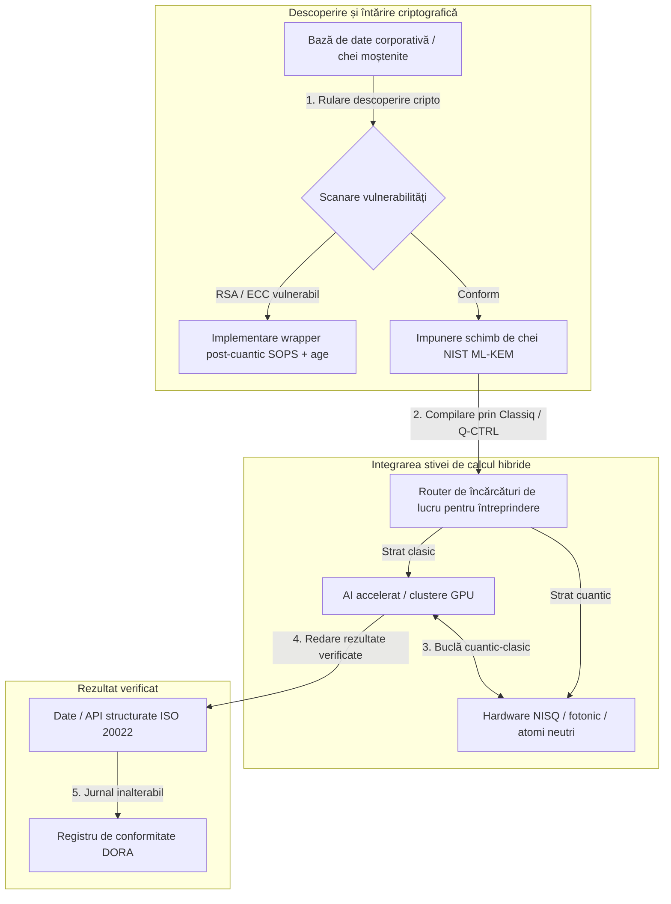

---

# Front Matter (YAML)

author: "contact@sebastienrousseau.com (Sebastien Rousseau)"
banner_alt: "Imagine de pe scenă de la summitul Economist Impact al 5-lea Commercialising Quantum Global 2026 de la Londra — simbolizând tranziția tehnologiei cuantice de la cercetarea în fizică la fluxuri de lucru pregătite pentru întreprindere"
banner_height: "1597"
banner_width: "2584"
banner: "https://cloudcdn.pro/stocks/images/sebastien-rousseau-20260617-5th-commercialising-quantum-2.webp"
cdn: "https://cloudcdn.pro"
charset: "UTF-8"
cname: "sebastienrousseau.com"
copyright: "© Copyright 2025 - 2026 - Sebastien Rousseau. All rights reserved."
date: "June 17, 2026"
description: "Concluziile pentru consiliul de administrație de la summitul Economist Impact al 5-lea Commercialising Quantum Global 2026 — val de finanțare de 1,3 miliarde dolari, stive hibride „fără regrete”, urgența migrării la criptografia post-cuantică, comercializarea senzorilor cuantici și directiva HSBC potrivit căreia așteptarea este o eroare forțată."
format-detection: "telephone=no"
hreflang: "ro"
icon: "https://cloudcdn.pro/clients/sebastienrousseau/v1/logos/sebastienrousseau.svg"
id: "https://sebastienrousseau.com/2026-06-17-economist-commercialising-quantum-summit-2026"
image_alt: "Portret alb-negru al lui Sebastien Rousseau"
image_height: "162"
image_width: "162"
image: "https://cloudcdn.pro/stocks/images/sebastienrousseau.webp"
keywords: "Commercialising Quantum Global 2026, summit Economist Impact, criptografie post-cuantică, NIST ML-KEM, harvest-now decrypt-later, SNDL, HSBC quantum, Philip Intallura, senzori cuantici, navigare independentă de GPS, NQCC, EU Quantum Act, Quantcore, premiul qBIG, Lord Vallance, hibrid cuantic-clasic, DORA Articolul 6"
language: "ro-RO"
last_reviewed: "2026-06-17"
layout: "report"
locale: "ro_RO"
logo_alt: "Logo pentru Sebastien Rousseau"
logo_height: "44"
logo_width: "44"
logo: "https://cloudcdn.pro/clients/sebastienrousseau/v1/logos/sebastienrousseau.svg"
menu: ""
measurementID: "G-169G4ET5HQ"
name: "Sebastien Rousseau"
permalink: "https://sebastienrousseau.com/2026-06-17-economist-commercialising-quantum-summit-2026"
rating: "general"
referrer: "no-referrer"
robots: "index, follow"
schema: "FAQPage, Article"
seo_title: "Commercialising Quantum 2026: concluzii pentru consiliu"
short_name: "sebastienrousseau"
subtitle: "Tehnologia cuantică a trecut de la știința speculativă de laborator la fluxuri de lucru hibride de întreprindere; consiliul trebuie să răspundă la finanțarea de 1,3 miliarde dolari în 2026, la migrarea imediată post-cuantică și la directiva HSBC de a înceta așteptarea."
tags: "cuantic, criptografie post-cuantică, NIST ML-KEM, harvest-now decrypt-later, senzori cuantici, HSBC, Economist Impact, calcul hibrid, DORA, EU Quantum Act, NQCC, concluziile summitului"
theme-color: "0, 83, 191"
title: "De la qubiți la profituri: concluzii strategice de la cel de-al 5-lea Summit Anual Economist Commercialising Quantum Global 2026"
url: "https://sebastienrousseau.com/2026-06-17-economist-commercialising-quantum-summit-2026"
viewport: "width=device-width, initial-scale=1, shrink-to-fit=no"

# RSS - The RSS feed front matter (YAML).
atom_link: "https://sebastienrousseau.com/2026-06-17-economist-commercialising-quantum-summit-2026/rss.xml"
category: "Technology"
docs: https://validator.w3.org/feed/docs/rss2.html
generator: "Static Site Generator (SSG) (version 0.0.26)"
item_description: "Concluziile pentru consiliul de administrație de la summitul Economist Impact al 5-lea Commercialising Quantum Global 2026 — val de finanțare de 1,3 miliarde dolari, stive hibride „fără regrete”, urgența migrării la criptografia post-cuantică, comercializarea senzorilor cuantici și directiva HSBC potrivit căreia așteptarea este o eroare forțată."
item_guid: "https://sebastienrousseau.com/2026-06-17-economist-commercialising-quantum-summit-2026/rss.xml"
item_link: "https://sebastienrousseau.com/2026-06-17-economist-commercialising-quantum-summit-2026/rss.xml"
item_pub_date: "Wed, 17 Jun 2026 06:06:06 +0000"
item_title: "De la qubiți la profituri: concluzii strategice de la cel de-al 5-lea Summit Anual Economist Commercialising Quantum Global 2026"
last_build_date: "Wed, 17 Jun 2026 06:06:06 +0000"
managing_editor: "contact@sebastienrousseau.com (Sebastien Rousseau)"
pub_date: "Wed, 17 Jun 2026 06:06:06 +0000"
ttl: "60"
type: "article"
webmaster: "contact@sebastienrousseau.com"

# Apple - The Apple front matter (YAML).
apple_mobile_web_app_orientations: "portrait"
apple_touch_icon_sizes: "192x192"
apple-mobile-web-app-capable: "yes"
apple-mobile-web-app-status-bar-inset: "black"
apple-mobile-web-app-status-bar-style: "black-translucent"
apple-mobile-web-app-title: "Commercialising Quantum 2026: concluzii pentru consiliu"
apple-touch-fullscreen: "yes"

# MS Application - The MS Application front matter (YAML).

msapplication-navbutton-color: "0, 83, 191"

# Twitter Card - The Twitter Card front matter (YAML).

twitter_card: "summary_large_image"
twitter_creator: "@wwdseb"
twitter_description: "Concluziile pentru consiliul de administrație de la summitul Economist Impact al 5-lea Commercialising Quantum Global 2026 — val de finanțare de 1,3 miliarde dolari, stive hibride „fără regrete”, urgența migrării la criptografia post-cuantică, comercializarea senzorilor cuantici și directiva HSBC potrivit căreia așteptarea este o eroare forțată."
twitter_image: "https://cloudcdn.pro/clients/sebastienrousseau/v1/logos/sebastienrousseau.svg"
twitter_image_alt: "Logo al lui Sebastien Rousseau"
twitter_site: "@wwdseb"
twitter_title: "Commercialising Quantum 2026: concluzii pentru consiliu"
twitter_url: "https://sebastienrousseau.com/2026-06-17-economist-commercialising-quantum-summit-2026"

excerpt: "Summitul Economist Impact al 5-lea Commercialising Quantum Global 2026 a confirmat pivotul cuanticului către fluxurile de lucru de întreprindere: 1,3 miliarde dolari atrași în cinci luni, criptografia post-cuantică este o chestiune fiduciară la nivel de consiliu sub recoltarea SNDL, senzorii cuantici sunt livrați astăzi pentru navigare independentă de GPS, iar Philip Intallura de la HSBC a transmis directiva potrivit căreia așteptarea hardware-ului tolerant la erori este o eroare forțată."

# Humans.txt - The Humans.txt front matter (YAML).
author_website: "https://sebastienrousseau.com"
author_twitter: "@wwdseb"
author_location: "London, UK"
thanks: "Mulțumim pentru lectură!"
site_last_updated: "2026-06-17"
site_standards: "HTML5, CSS3, RSS, Atom, JSON, XML, YAML, Markdown, TOML"
site_components: "Kaishi, Kaishi Builder, Kaishi CLI, Kaishi Templates, Kaishi Themes"
site_software: "Static Site Generator, Rust"

---

# De la qubiți la profituri: concluzii strategice de la cel de-al 5-lea Summit Anual Economist Commercialising Quantum Global 2026

Pregătirea pentru întreprindere, migrările criptografiei post-cuantice, stivele de calcul hibride și peisajul comercial emergent al senzorilor și rețelelor cuantice.

**Pe scurt.** A 5-a ediție a conferinței anuale Commercialising Quantum Global 2026, găzduită de Economist Impact pe 16–17 iunie 2026 la Business Design Centre din Londra, a reunit peste 1.100 de lideri globali din mediul de întreprindere, finanțe, politici publice și cercetare. Tema centrală a marcat un pivot structural clar: tehnologia cuantică a trecut de la știința speculativă de laborator la fluxuri de lucru practice, hibride, de întreprindere. Susținută de 1,3 miliarde dolari în capital de risc atras numai în primele cinci luni ale lui 2026, discuția din consiliul de administrație nu mai vizează numărarea qubiților fizici, ci stabilirea unor stive de calcul hibride „fără regrete”, securizarea activelor digitale împotriva amenințării criptografice „harvest-now, decrypt-later" (SNDL) și implementarea pe termen scurt a sistemelor de senzori cuantici pentru navigare independentă de GPS.

## Concluzii principale

- **Trecerea întreprinderii la fluxuri de lucru practice.** Liderii din industrie ([Steve Suarez](https://www.linkedin.com/in/stevesuarez) de la HorizonX, [Phil Intallura](https://www.linkedin.com/in/intallura) de la HSBC) au subliniat că integrarea cuantică nu mai este o problemă de fizică, ci una operațională. Băncile și întreprinderile implementează pilotaje hibride cuantic-clasic pentru a pregăti talentul și a optimiza încărcăturile de lucru active.
- **Criptografia post-cuantică (PQC) este o prioritate a consiliului.** Experții în securitate și juridic (CMS UK, [Joanne Miller](https://www.linkedin.com/in/joanne-miller-nso) de la Microsoft, [Craig Farrell](https://www.linkedin.com/in/craig-farrell) de la EY) au avertizat că organizațiile nu pot aștepta hardware-ul tolerant la erori pentru a implementa PQC. Recoltarea „harvest-now, decrypt-later" se petrece astăzi, transformând migrarea la standardele NIST ML-KEM într-o preocupare fiduciară imediată.
- **Senzorii cuantici conduc profitabilitatea pe termen scurt.** În timp ce calculul tolerant la erori rămâne la ani distanță, senzorii cuantici ([Matthew Kinsella](https://www.linkedin.com/in/matthewkinsella) de la Infleqtion) se scalează rapid. Ceasurile cuantice și senzorii inerțiali sunt implementați pentru navigare independentă de GPS, securitate națională și rețele energetice ultra-stabile.
- **Suveranitate, clustere și urgență politică.** Ministrul britanic al științei, [Lord Vallance](https://www.linkedin.com/in/patrick-vallance), și [Lord William Hague](https://www.linkedin.com/in/williamhague) au prezentat misiuni naționale de transformare a cercetării în „supercluster-uri" la scară industrială coordonate cu National Quantum Computing Centre (NQCC). Următorul EU Quantum Act subliniază și mai clar cursa geopolitică pentru capacitatea suverană de calcul.
- **Quantcore câștigă premiul qBIG.** Compania spin-out a Universității din Glasgow, Quantcore, a obținut premiul IOP qBIG pentru componentele sale supraconductoare pe bază de niobiu, care funcționează la temperaturi mai ridicate decât materialele tradiționale, reducând semnificativ sarcina infrastructurii criogenice.

**Lecturi conexe:** [KyberLib și migrarea bancară post-cuantică în 2026: de la standarde la cod](https://sebastienrousseau.com/2026-06-12-kyberlib-post-quantum-banking-migration-standards-code-2026/), [Indicele de reziliență bancară în 2026: AI, cloud, cuantic, plăți și riscul de concentrare a terților](https://sebastienrousseau.com/2026-06-08-banking-resilience-index-ai-cloud-quantum-payments-third-party-risk-2026/), [Indicele bancar cloud-nativ în 2026: DORA, ingineria platformelor, cloud-ul suveran și reziliența operațională](https://sebastienrousseau.com/2026-06-05-cloud-native-banking-index-dora-resilience-platform-engineering-2026/).

## 01. De ce contează summitul din 2026 pentru consiliul de administrație

Ediția din 2026 a summitului Economist Commercialising Quantum Global a marcat o schimbare permanentă în modul în care mediul corporativ evaluează deep tech.

Istoric, calculul cuantic a fost relegat în departamentele de cercetare-dezvoltare ca demers științific de mai multe decenii. În iunie 2026, această perspectivă este depășită. Organizațiile trebuie să treacă de la curiozitatea „centrată pe fizică" la implementarea „centrată pe afaceri". Motivul este dublu:

1. **Convergența cuantic-AI.** Stivele de calcul de înaltă performanță (HPC) fuzionează nodurile clasice, AI accelerate și NISQ (Noisy Intermediate-Scale Quantum) într-un singur strat de calcul unificat. Organizațiile care întârzie construcția aplicațiilor pregătite pentru cuantic vor descoperi că fereastra pentru a capta un avantaj strategic se închide mai repede decât se estimează.
2. **Urgență geopolitică și fiduciară.** Cu programul cuantic condus de misiuni al Regatului Unit și cu viitorul EU Quantum Act, capacitatea cuantică a devenit o chestiune de suveranitate națională și de continuitate corporativă.

În plus, securitatea cibernetică post-cuantică nu mai este o cerință de conformitate viitoare. Amenințarea atacurilor adverse „store now, decrypt later" (SNDL) înseamnă că datele corporative interceptate astăzi vor fi decriptate atunci când sistemele cuantice comerciale se vor scala, creând răspundere imediată în temeiul mandatelor globale de reziliență operațională precum Digital Operational Resilience Act (DORA).

## 02. Lentila strategică Commercialising Quantum 2026

Liderii tehnologici din întreprinderi trebuie să mapeze maturitatea cuantică pe cinci straturi operaționale distincte, evaluând orizonturile temporale și riscurile bilanțiere.

### Tabelul 1: lentila strategică Commercialising Quantum 2026

| Strat | Focus corporativ | Cronologie / orizont | Risc corporativ principal |
| ---- | ---- | ---- | ---- |
| **Hardware și compilator** | Selectarea între abordări concurente (supraconductoare, ioni capcanați, atomi neutri, fotonică) | 3 – 5 ani (toleranță la erori) | Blocarea într-o arhitectură fără viitor sau pariul timpuriu pe o singură platformă. |
| **Întărirea criptografică** | Descoperirea și inventarierea dependențelor criptografice; migrarea la NIST ML-KEM | Imediat (migrare activă) | Breșe sistemice de date și eșecuri de conformitate sub DORA și NIST CSF 2.0. |
| **Senzori cuantici** | Implementarea navigării independente de GPS, ceasuri ultra-stabile și gravimetre | 1 – 2 ani (comercial imediat) | Perturbarea operațională a logisticii, transportului maritim și rețelelor energetice din cauza bruiajului GPS. |
| **Integrarea sistemelor** | Conectarea hardware-ului cuantic la centrele de date HPC și supercomputing clasice existente | 1 – 3 ani (fază hibridă) | Latență ridicată, blocaje de transfer de date și silozuri de calcul fragmentate. |
| **Software de întreprindere** | Expunerea algoritmilor cuantici prin straturi de abstractizare de nivel înalt și API-uri (Classiq, Q-CTRL) | Imediat (construirea de competențe) | Izolarea talentului și a fluxurilor de lucru de execuția inginerească reală. |

## 03. Semnale cuantice cheie și declanșatoare pentru consiliu

Liderii tehnologici trebuie să monitorizeze metrici de piață și de reglementare specifice și cuantificabile pentru a-și ghida investițiile cuantice.

### Tabelul 2: semnale cuantice cheie și declanșatoare pentru consiliu

| Semnal | Metrică cantitativă | Referință de reglementare / politică | Prioritate de platformă acționabilă |
| ---- | ---- | ---- | ---- |
| **Valul de finanțare cuantică** | 1,3 miliarde dolari atrași la nivel global în primele cinci luni din 2026 | Return on Resilience (RoR) | Mutarea bugetelor de la pilotaje speculative la încărcături de lucru hibride cuantic-clasic „fără regrete". |
| **Expunerea la decriptarea datelor** | 100% din datele criptate transmise prin canale publice expuse recoltării SNDL | DORA Articolul 6 (securitate ICT) | Implementarea instrumentelor de descoperire criptografică pentru identificarea cheilor RSA/ECC vulnerabile în întreaga organizație. |
| **Infrastructură suverană** | Alocare de 2,5 miliarde lire pentru Strategia Națională Cuantică a Regatului Unit | UK Quantum Missions / Lord Vallance | Stabilirea de parteneriate locale cu supercluster-uri naționale precum NQCC. |
| **Termene de conformitate** | Trecerea la adresele structurate SWIFT pe 14 noiembrie 2026 | Directiva SWIFT SR 2026 | Curățarea și formatarea bazelor de date interbancare pentru a îndeplini specificațiile XML structurate. |

## 04. Analiză aprofundată a temelor centrale ale summitului

### Cuanticul atinge un punct de inflexiune al investițiilor

Finanțarea prin capital de risc a înregistrat o accelerare semnificativă, atrăgând **1,3 miliarde dolari** numai în primele cinci luni ale lui 2026. Spre deosebire de ciclurile speculative de entuziasm din anii precedenți, valul actual de capital este susținut de încărcături de lucru reale, pe termen scurt. Vorbitorii de la Classiq și IBM Quantum Platform au demonstrat cum straturile de abstractizare software și compilatoarele automate permit echipelor de dezvoltatori non-specialiști să execute algoritmi hibrizi cuantic-clasic pe infrastructura clasică actuală. Această strategie „fără regrete" permite organizațiilor să construiască imediat talent și fluxuri de lucru pregătite pentru cuantic.

### Avertismente juridice și de reglementare privind „harvest now, decrypt later"

Partenerii juridici și executivii de securitate cibernetică au generat dezbateri majore în jurul imediatului risc al datelor. Reprezentanții firmei de avocatură sponsor CMS UK și CSO Microsoft [Joanne Miller](https://www.linkedin.com/in/joanne-miller-nso) au transmis un avertisment ferm managementului senior: *așteptarea hardware-ului tolerant la erori înainte de implementarea criptografiei post-cuantice este o eroare fiduciară critică.*

În paradigma „store now, decrypt later" (SNDL), actorii ostili recoltează activ datele corporative criptate astăzi, cu intenția de a le decripta imediat ce vor apărea computere cuantice relevante criptografic. Organizațiile trebuie să implementeze imediat protecții post-cuantice (precum NIST ML-KEM) pentru a proteja seturile de date sensibile cu durată lungă de viață, proprietatea intelectuală și înregistrările istorice ale clienților.

### Realinierea entuziasmului în jurul „senzorilor cuantici"

În timp ce calculul cuantic tolerant la erori rămâne la ani distanță, summitul a evidențiat senzorii cuantici ca primul val cu adevărat profitabil al implementării în lumea reală. Directorul general [Matthew Kinsella](https://www.linkedin.com/in/matthewkinsella) de la Infleqtion a detaliat modul în care ceasurile cuantice, senzorii inerțiali și sistemele de radiofrecvență se scalează rapid în mai multe industrii.

Deoarece aceste tehnologii măsoară constante fizice cu precizie sub-atomică, ele permit **navigarea independentă de GPS**, rețele energetice ultra-stabile și telecomunicații pentru spațiul cosmic profund. Aceste aplicații sunt extrem de relevante pentru aviație, transportul maritim și sistemele de apărare națională care se confruntă cu amenințări tot mai mari de bruiaj GPS.

### Ecosistem și colaborare între clustere

Ecosistemul cuantic al Regatului Unit a folosit summitul de la Londra pentru a prezenta supercluster-urile interne de inovare. Actualizările în direct de la National Quantum Computing Centre (NQCC) și Digital Catapult au detaliat modul în care companiile spin-out de deep tech în stadiu incipient pot acoperi „decalajul tehnologic" prin integrarea directă a hardware-ului cuantic în centrele de date clasice de supercomputing.

[Wridhdhisom Karar](https://www.linkedin.com/in/wridhdhisomkarar), co-fondator al startup-ului cuantic scoțian Quantcore, a acceptat prestigiosul premiu Quantum Business Innovation and Growth (qBIG) al Institute of Physics (IOP) pentru componentele supraconductoare pe bază de niobiu ale companiei. Aceste componente funcționează la temperaturi mai ridicate decât materialele tradiționale, reducând semnificativ sarcina infrastructurii criogenice necesare pentru scalarea procesoarelor cuantice.

### Studiul de caz HSBC: de ce așteptarea cuanticului este o „eroare forțată"

Perspectivele oferite de [**Philip Intallura, Ph.D.**](https://www.linkedin.com/in/intallura) (șef global al tehnologiilor cuantice la HSBC, consilier al Guvernului Regatului Unit și consilier de consiliu) la cel de-al 5-lea eveniment anual Commercialising Quantum al Economist (2026) au transmis o directivă puternică pentru consiliul de administrație: *„Așteptarea cuanticului tolerant la erori înainte de a începe este o eroare forțată."*

Dr. Intallura a susținut că abordarea obișnuită de tip „așteaptă și vezi" în rândul instituțiilor financiare este o auto-eliminare din joc, construită pe trei ipoteze incorecte:

- **ROI-ul pe termen scurt este real.** În testarea empirică, HSBC a depășit modelele care rulează în prezent în producție, a conectat activitatea cuantică la alte părți ale afacerii, a folosit cuanticul pentru a aprofunda relațiile cu unii dintre cei mai mari clienți ai săi și a atras un volum semnificativ de business nou către **HSBC Innovation Banking**.
- **Cuanticul este o curbă abruptă de adopție.** Construirea capacității, stabilirea strategiei, asigurarea finanțării și derularea ciclurilor de experimente într-o organizație puternic reglementată nu este un demers de scurtă durată. Procesele trebuie testate sistematic și adaptate pentru această tehnologie.
- **Cuanticul este un ecosistem.** Niciun jucător singur nu ajunge acolo de unul singur. Fiecare lucrare de cercetare, POC și pilot pe care HSBC le-a executat a fost realizat în strânsă colaborare cu un furnizor cuantic — iar în unele cazuri, colaborarea se extinde la mediul academic, autoritățile de reglementare și guvern.

**Directivă de încheiere pentru consiliu:** *„Capacitatea de care veți avea nevoie în prima zi a toleranței la erori este capacitatea pe care o construiți acum."*

## 05. Integrarea cuantică corporativă și pipeline-ul criptografic

Pentru a securiza activele digitale în timp ce construiește pregătirea cuantică, întreprinderea trebuie să stabilească un pipeline clar de integrare.

## 06. Manualul consiliului: imperative acționabile

Pentru a traduce concluziile summitului Commercialising Quantum Global 2026 în valoare imediată de afaceri, managementul senior ar trebui să execute următorul manual al consiliului în patru pași:

1. **Mandatați descoperirea criptografică.** Indicați directorului de securitate informatică (CISO) să catalogheze toate activele criptografice, mapând fiecare cheie RSA și ECC moștenită din întreaga organizație, pentru a pregăti migrarea post-cuantică.
2. **Implementați o strategie hibridă „fără regrete".** Evitați să așteptați hardware-ul perfect. Investiți în software inspirat de cuantic și în pilotaje hibride clasic-cuantic pentru a dezvolta talent intern și pentru a optimiza astăzi logistica complexă sau portofoliile de risc.
3. **Evaluați senzorii cuantici pentru logistică.** Dacă organizația dumneavoastră depinde de lanțuri globale de aprovizionare, transport maritim sau infrastructură critică, evaluați activ sistemele de senzori cuantici (precum navigarea independentă de GPS) pentru a atenua riscurile de perturbare geopolitică.
4. **Înregistrați-vă pentru Insight Hour din 30 iunie.** Asigurați-vă că liderii dumneavoastră tehnologici se înregistrează la **Commercialising Quantum Global Insight Hour** virtual din 30 iunie 2026, la ora 15:00 BST (susținut de IonQ), pentru a continua monitorizarea managementului riscului de întreprindere și a strategiilor de alocare a talentului.

## 07. Întrebări frecvente

**Ce este „harvest now, decrypt later" (SNDL) și de ce contează astăzi?**
SNDL este practica de interceptare și stocare a datelor criptate astăzi, cu intenția de a le decripta ulterior, odată ce computerele cuantice relevante criptografic devin disponibile. Seturile de date sensibile cu durată lungă de viață — proprietate intelectuală, înregistrări ale clienților, comunicări guvernamentale — sunt deja vizate. Migrarea la NIST ML-KEM este o decizie fiduciară pe care consiliul nu o poate amâna.

**De ce senzorii cuantici reprezintă primul val comercial în loc de calculul cuantic?**
Senzorii cuantici măsoară constante fizice cu precizie sub-atomică și nu necesită hardware-ul tolerant la erori cerut de calculul cuantic. Ceasurile cuantice, gravimetrele și senzorii inerțiali se află deja în pilotaj pentru navigare independentă de GPS, rețele energetice ultra-stabile și comunicații pentru spațiul cosmic profund.

**Activitatea cuantică a HSBC este doar cercetare-dezvoltare sau a produs randamente măsurabile?**
Potrivit lui Philip Intallura, la summit, HSBC a depășit modelele care rulează în prezent în producție, a folosit cuanticul pentru a aprofunda relațiile cu cei mai mari clienți ai săi și a atras un volum semnificativ de business nou către HSBC Innovation Banking. Activitatea a trecut de la cercetare la integrare operațională.

## 08. Referințe

- **Economist Impact, (2026).** *5th Annual Commercialising Quantum Global 2026.* Lucrările conferinței în direct, 16–17 iunie 2026. Londra: Business Design Centre. Disponibil la: [Economist Impact](https://events.economist.com/commercialising-quantum/).
- **National Institute of Standards and Technology (NIST), (2024).** *Primele trei standarde finalizate de criptare post-cuantică (FIPS 203, 204 și 205).* Gaithersburg: U.S. Department of Commerce. Disponibil la: [Standardele NIST](https://www.nist.gov/news-events/news/2024/08/nist-releases-first-3-finalized-post-quantum-encryption-standards).
- **Parlamentul European și Consiliul Uniunii Europene, (2022).** *Regulamentul (UE) 2022/2554 privind reziliența operațională digitală pentru sectorul financiar (DORA).* Bruxelles: Jurnalul Oficial al Uniunii Europene. Disponibil la: [Regulamentul DORA](https://eur-lex.europa.eu/legal-content/EN/TXT/?uri=CELEX%3A32022R2554).
- **SWIFT, (2024).** *Reperul ISO 20022 pentru adresele structurate din noiembrie 2026.* La Hulpe: SWIFT. Disponibil la: [Reperul SWIFT ISO 20022](https://www.swift.com/standards/iso-20022/iso-20022-bytes/call-action-november-2026).
