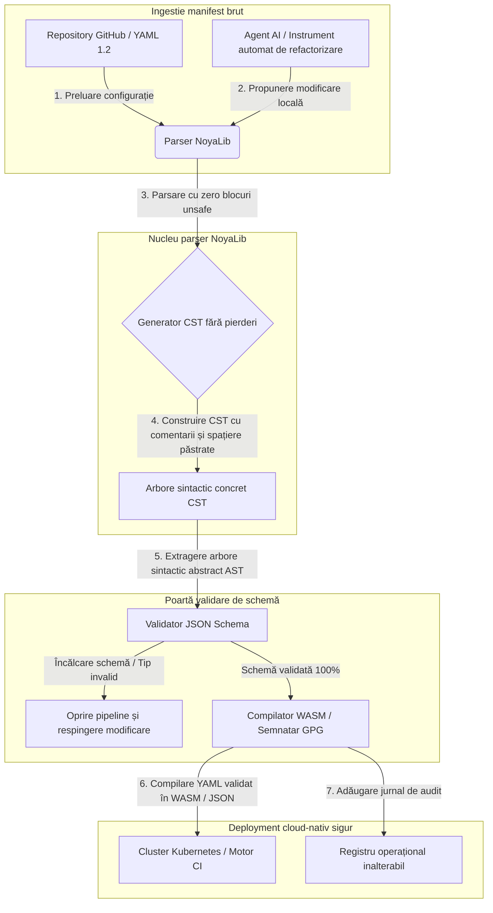

---

# Front Matter (YAML)

author: "contact@sebastienrousseau.com (Sebastien Rousseau)"
banner_alt: "Geometrie arhitecturală sub lumină dramatică — simbolizând rolul portant al NoyaLib ca parser YAML sigur în Rust sub CI, Kubernetes, MCP și configurația serviciilor financiare"
banner_height: "1597"
banner_width: "2584"
banner: "https://cloudcdn.pro/stocks/images/ken-cheung-KonWFWUaAuk.webp"
cdn: "https://cloudcdn.pro"
charset: "UTF-8"
cname: "sebastienrousseau.com"
copyright: "© Copyright 2025 - 2026 - Sebastien Rousseau. All rights reserved."
date: "June 18, 2026"
description: "NoyaLib, parser YAML 1.2 zero-unsafe în Rust, 406/406 conformitate, validare JSON Schema, CST fără pierderi și binding-uri MCP/WASM."
format-detection: "telephone=no"
hreflang: "ro"
icon: "https://cloudcdn.pro/clients/sebastienrousseau/v1/logos/sebastienrousseau.svg"
id: "https://sebastienrousseau.com/2026-06-18-noyalib-safe-yaml-rust-ai-mcp-financial-infrastructure-2026"
image_alt: "Portret alb-negru al lui Sebastien Rousseau"
image_height: "162"
image_width: "162"
image: "https://cloudcdn.pro/stocks/images/sebastien-rousseau.png"
keywords: "parser YAML mai sigur în Rust, NoyaLib, conformitate YAML 1.2, Rust zero-unsafe, validare JSON Schema, arbore sintactic concret fără pierderi, CST, MCP, Model Context Protocol, WebAssembly, manifeste Kubernetes, configurație CI/CD, DORA Articolul 5, BCBS 239, risc operațional Basel III, infrastructură financiară, securitatea configurației, securitatea lanțului de aprovizionare software"
language: "ro-RO"
last_reviewed: "2026-06-18"
layout: "report"
locale: "ro_RO"
logo_alt: "Logo pentru Sebastien Rousseau"
logo_height: "44"
logo_width: "44"
logo: "https://cloudcdn.pro/clients/sebastienrousseau/v1/logos/sebastienrousseau.svg"
menu: ""
measurementID: "G-169G4ET5HQ"
name: "Sebastien Rousseau"
permalink: "https://sebastienrousseau.com/2026-06-18-noyalib-safe-yaml-rust-ai-mcp-financial-infrastructure-2026"
rating: "general"
referrer: "no-referrer"
robots: "index, follow"
schema: "FAQPage, Article"
seo_title: "Parser YAML mai sigur în Rust pentru AI, MCP și finanțe"
short_name: "sebastienrousseau"
subtitle: "O stivă YAML mai sigură în Rust — NoyaLib — transformă YAML 1.2 din markup de comoditate într-un plan de control al configurației conform spec, criptografic sigur, pentru agenți AI, MCP, Kubernetes și infrastructura serviciilor financiare."
tags: "parser YAML mai sigur în Rust, NoyaLib, YAML 1.2, Rust zero-unsafe, JSON Schema, MCP, WebAssembly, Kubernetes, DORA, BCBS 239, Basel III, infrastructură financiară, securitatea lanțului de aprovizionare"
theme-color: "0, 83, 191"
title: "De ce YAML are nevoie de o stivă Rust mai sigură pentru AI, MCP și infrastructura financiară în 2026"
url: "https://sebastienrousseau.com/2026-06-18-noyalib-safe-yaml-rust-ai-mcp-financial-infrastructure-2026"
viewport: "width=device-width, initial-scale=1, shrink-to-fit=no"

# RSS - The RSS feed front matter (YAML).
atom_link: "https://sebastienrousseau.com/2026-06-18-noyalib-safe-yaml-rust-ai-mcp-financial-infrastructure-2026/rss.xml"
category: "Technology"
docs: https://validator.w3.org/feed/docs/rss2.html
generator: "Static Site Generator (SSG) (version 0.0.26)"
item_description: "NoyaLib, parser YAML 1.2 zero-unsafe în Rust, 406/406 conformitate, validare JSON Schema, CST fără pierderi și binding-uri MCP/WASM."
item_guid: "https://sebastienrousseau.com/2026-06-18-noyalib-safe-yaml-rust-ai-mcp-financial-infrastructure-2026/rss.xml"
item_link: "https://sebastienrousseau.com/2026-06-18-noyalib-safe-yaml-rust-ai-mcp-financial-infrastructure-2026/rss.xml"
item_pub_date: "Thu, 18 Jun 2026 06:06:06 +0000"
item_title: "De ce YAML are nevoie de o stivă Rust mai sigură pentru AI, MCP și infrastructura financiară în 2026"
last_build_date: "Thu, 18 Jun 2026 06:06:06 +0000"
managing_editor: "contact@sebastienrousseau.com (Sebastien Rousseau)"
pub_date: "Thu, 18 Jun 2026 06:06:06 +0000"
ttl: "60"
type: "article"
webmaster: "contact@sebastienrousseau.com"

# Apple - The Apple front matter (YAML).
apple_mobile_web_app_orientations: "portrait"
apple_touch_icon_sizes: "192x192"
apple-mobile-web-app-capable: "yes"
apple-mobile-web-app-status-bar-inset: "black"
apple-mobile-web-app-status-bar-style: "black-translucent"
apple-mobile-web-app-title: "Parser YAML mai sigur în Rust pentru AI, MCP și finanțe"
apple-touch-fullscreen: "yes"

# MS Application - The MS Application front matter (YAML).

msapplication-navbutton-color: "0, 83, 191"

# Twitter Card - The Twitter Card front matter (YAML).

twitter_card: "summary_large_image"
twitter_creator: "@wwdseb"
twitter_description: "NoyaLib, parser YAML 1.2 zero-unsafe în Rust, 406/406 conformitate, validare JSON Schema, CST fără pierderi și binding-uri MCP/WASM."
twitter_image: "https://cloudcdn.pro/clients/sebastienrousseau/v1/logos/sebastienrousseau.svg"
twitter_image_alt: "Logo al lui Sebastien Rousseau"
twitter_site: "@wwdseb"
twitter_title: "Parser YAML mai sigur în Rust pentru AI, MCP și finanțe"
twitter_url: "https://sebastienrousseau.com/2026-06-18-noyalib-safe-yaml-rust-ai-mcp-financial-infrastructure-2026"

excerpt: "NoyaLib este o stivă YAML mai sigură în Rust — zero blocuri unsafe, 406/406 conformitate cu spec YAML 1.2, arbore sintactic concret fără pierderi, validare JSON Schema (Draft 2020-12) și binding-uri MCP/WASM — proiectată pentru agenți AI, Kubernetes, CI/CD și planul de control al configurației din spatele infrastructurii financiare."

# Humans.txt - The Humans.txt front matter (YAML).
author_website: "https://sebastienrousseau.com"
author_twitter: "@wwdseb"
author_location: "London, UK"
thanks: "Mulțumim pentru lectură!"
site_last_updated: "2026-06-18"
site_standards: "HTML5, CSS3, RSS, Atom, JSON, XML, YAML, Markdown, TOML"
site_components: "Kaishi, Kaishi Builder, Kaishi CLI, Kaishi Templates, Kaishi Themes"
site_software: "Static Site Generator, Rust"

---

# De ce YAML are nevoie de o stivă Rust mai sigură pentru AI, MCP și infrastructura financiară în 2026

O stivă YAML mai sigură în Rust contează pentru că YAML transportă astăzi pipeline-urile CI/CD, manifestele Kubernetes, regulile [Open Policy Agent](https://www.openpolicyagent.org/) și registrele de instrumente Model Context Protocol (MCP) — iar o singură interpretare ambiguă poate opri un sistem de compensare, configura greșit un grup de securitate sau acorda unui agent AI local permisiunile greșite. [NoyaLib](https://github.com/sebastienrousseau/noyalib) este un ecosistem pur Rust, zero-unsafe, de parsare și validare [YAML 1.2](https://yaml.org/spec/1.2.2/), proiectat pentru ca această infrastructură să fie sigură în mod implicit.

## Răspuns rapid

**Ce este NoyaLib într-o singură frază?** NoyaLib este un ecosistem open-source, pur Rust, de parsare și validare YAML 1.2, cu zero cod `unsafe`, conformitate 100 % cu suita oficială de 406 teste YAML, un arbore sintactic concret (CST) fără pierderi și validare [JSON Schema](https://json-schema.org/) în timp real — proiectat pentru ca agenții AI, MCP, Kubernetes și configurația infrastructurii financiare să fie sigure în mod implicit.

## Rezumat executiv

YAML pare modest până când o interpretare ambiguă sau o încălcare de schemă oprește un sistem de compensare în producție de mai multe miliarde de dolari. În 2026, YAML este standardul de facto pentru pipeline-urile [CI/CD](https://docs.github.com/en/actions/learn-github-actions/workflow-syntax-for-github-actions), manifestele [Kubernetes](https://kubernetes.io/docs/concepts/configuration/overview/), regulile [Open Policy Agent](https://www.openpolicyagent.org/) și registrele de instrumente Model Context Protocol (MCP). Parserele moștenite opace — cu vulnerabilități de memorie și parsare distructivă — sunt un risc de securitate inacceptabil. NoyaLib este un ecosistem YAML 1.2 pur Rust, zero-unsafe: conformitate 100 % cu toate cele 406 teste din suita oficială, un arbore sintactic concret (CST) fără pierderi care păstrează comentariile și spațierea și validare JSON Schema încorporată. Rezultatul este YAML reconceput ca un plan de control al configurației auditabil, sigur și accesibil agenților.

## Concluzii principale

- **Configurația este cod de producție.** Un singur fișier YAML malformat poate configura greșit grupuri de securitate cloud-native sau permisiuni ale agenților AI. NoyaLib tratează YAML drept infrastructură critică.
- **Design zero-unsafe.** Construit integral în Rust sigur, fără blocuri `unsafe`, NoyaLib elimină vulnerabilitățile de siguranță a memoriei — depășiri de buffer, execuție de cod la distanță — în straturile de parsare de bază.
- **Conformitate absolută 406/406 cu spec.** Validează matematic structurile de configurație, eliminând discrepanțele de parsare și deviațiile structurale între mediile de staging și producție.
- **Arbore sintactic concret fără pierderi.** Spre deosebire de parserele moștenite care elimină comentariile și formatarea, NoyaLib păstrează spațierea și adnotările, permițând refactorizarea automată dus-întors, sigură, de către agenții AI.
- **Valoare fiduciară la nivel de consiliu.** Leagă integritatea configurației de [DORA Articolul 5](https://eur-lex.europa.eu/legal-content/EN/TXT/?uri=CELEX%3A32022R2554) și de metricile de capital pentru riscul operațional [Basel III](https://www.bis.org/bcbs/publ/d424.htm), protejând direct managementul superior de răspunderea personală.

**Lecturi conexe:** [KyberLib și migrarea bancară post-cuantică în 2026: de la standarde la cod](https://sebastienrousseau.com/2026-06-12-kyberlib-post-quantum-banking-migration-standards-code-2026/), [Indicele bancar cloud-nativ în 2026: DORA, ingineria platformelor, cloud-ul suveran și reziliența operațională](https://sebastienrousseau.com/2026-06-05-cloud-native-banking-index-dora-resilience-platform-engineering-2026/), [Dotfiles conștiente de AI în 2026: construirea unei stații de lucru sigure și reproductibile pentru MCP, SLSA și paritate multi-shell](https://sebastienrousseau.com/2026-06-16-ai-aware-dotfiles-secure-reproducible-workstation-2026/).

## 01. De ce contează o stivă YAML mai sigură în Rust în 2026

În iunie 2026, infrastructurile IT ale întreprinderilor sunt puternic distribuite și tot mai automatizate.

YAML a devenit discret limbajul portant al întregii stive de inginerie software. El transportă fluxurile de integrare continuă (CI) care compilează artefactele de producție, manifestele [Kubernetes](https://kubernetes.io/docs/concepts/overview/) care orchestrează clusterele cloud-native globale și schemele de server [Model Context Protocol](https://modelcontextprotocol.io/) (MCP) care acordă agenților AI locali permisiunea de a executa operațiuni locale.

Parserele YAML moștenite — [PyYAML](https://pyyaml.org/), [yaml-cpp](https://github.com/jbeder/yaml-cpp), [libyaml](https://github.com/yaml/libyaml) — poartă două riscuri structurale:

1. **Vulnerabilități de coerciție de tip („problema Norvegiei").** Parserele moștenite forțează frecvent șiruri necitate (codul de țară `NO` la un boolean `false`, `yes`/`no` la fel) — a se vedea [tagul boolean YAML 1.1 vs 1.2](https://yaml.org/type/bool.html) — cauzând defecțiuni critice de sistem sau configurații greșite tăcute de securitate.
2. **Exploit-uri de siguranță a memoriei.** Parserele opace scrise în C/C++ suferă de scurgeri de memorie și exploit-uri de depășire de buffer, care pot duce la execuție de cod la distanță (RCE) pe serverele de build de bază.

[NoyaLib](https://github.com/sebastienrousseau/noyalib) rezolvă aceste provocări. Este un ecosistem pur Rust, zero-unsafe, de parsare și validare YAML 1.2. Prin atingerea conformității absolute 406/406 cu spec și impunerea validării stricte JSON Schema direct în timpul parsării, NoyaLib oferă un **Return on Resilience (RoR)** ridicat — prevenind opririle induse de configurație și securizând lanțurile de aprovizionare software de calitate financiară.

## 02. Lentila arhitecturală NoyaLib 2026

Ecosistemul NoyaLib funcționează ca un parser de configurație sigur și fără pierderi. Fiecare manifest local și cloud este validat structural și protejat la cel mai jos strat de execuție.

### Tabelul 1: straturile arhitecturale NoyaLib și atenuarea riscului

| Strat | Decizie de proiectare | De ce contează | Risc dacă este gestionat greșit |
| ---- | ---- | ---- | ---- |
| **Strat parser** | Parser pur Rust conform YAML 1.2 cu zero blocuri `unsafe` | Elimină vulnerabilitățile de siguranță a memoriei și depășirile de buffer la cel mai jos strat de execuție. | Execuție de cod la distanță (RCE) pe serverele de build de bază. |
| **Strat de conformitate** | Conformitate 100 % cu 406/406 teste din suita oficială YAML 1.2 | Elimină discrepanțele de parsare și deviațiile de coerciție de tip între staging și producție. | Erori de coerciție de tip „problema Norvegiei" care dezactivează grupurile de securitate. |
| **Strat arbore sintactic** | Arbore sintactic concret (CST) fără pierderi | Păstrează comentariile, spațierea și ordinea în timpul parsării dus-întors și al refactorizării programatice. | Refactorizarea automată AI distrugând adnotările dezvoltatorilor. |
| **Strat de validare** | Validare [JSON Schema (Draft 2020-12)](https://json-schema.org/draft/2020-12/release-notes) în timpul parsării | Impune modele stricte de date asupra fișierelor de configurație înainte ca acestea să ajungă în clusterele de producție. | Fișiere de configurație malformate care declanșează prăbușiri ale clusterelor cloud-native. |
| **Strat de interfață** | Binding-uri WebAssembly (WASM) și MCP | Permite validării configurației să ruleze direct în browsere, noduri edge și kit-uri de instrumente pentru agenți locali. | Silozuri de instrumente unde validarea nu poate fi executată pe dispozitivele edge. |

## 03. Semnale cheie pentru securitatea stației de lucru și a configurației

Pentru a menține securitatea absolută în întreaga moșie de dezvoltare și operațiuni, directorii pentru securitatea informației (CISO) trebuie să monitorizeze metrici specifice, cuantificabile.

### Tabelul 2: semnale pentru securitatea stației de lucru și a configurației

| Semnal | Metrică / reper operațional | Referință NIST CSF / DORA | Implementare tehnică pe platformă |
| ---- | ---- | ---- | ---- |
| **Conformitate parser** | Rată de trecere 100 % pe suita oficială de teste YAML 1.2 (406/406 teste). | [DORA Articolul 6](https://eur-lex.europa.eu/legal-content/EN/TXT/?uri=CELEX%3A32022R2554) (securitate ICT) | Nucleul parserului NoyaLib validează toate manifestele înainte de execuția CI. |
| **Profil de siguranță a memoriei** | Zero blocuri `unsafe` Rust în dependențele parserului și serializatorului. | DORA Articolul 30 (lanț de aprovizionare) | Verificări automate ale compilatorului ([`forbid(unsafe_code)`](https://doc.rust-lang.org/reference/attributes/diagnostics.html#the-forbid-attribute)) în build-urile cargo. |
| **Validare de schemă** | 100 % din fișierele de configurație parsate verificate față de modele [JSON Schema](https://json-schema.org/) valide. | [NIST CSF 2.0](https://www.nist.gov/cyberframework) (PR.DS-01) | Poartă de validare în timp real care oprește pipeline-urile de build la încălcările de schemă. |
| **Deviație de configurație** | Detectare și recuperare în timp real a fișierelor locale de configurație la starea versionată git. | Return on Resilience (RoR) | Telemetrie continuă care înregistrează toate modificările fișierelor locale. |
| **Control acces agent** | Permisiuni delimitate, doar pentru citire, pentru instrumentele AI locale care operează prin configurații MCP. | Managementul riscului de model ([SR 11-7](https://www.federalreserve.gov/supervisionreg/srletters/sr1107.htm)) | Limitele serverului MCP restricționează operațiunile agenților la directoarele aprobate. |

## 04. Eroarea parsării opace a configurației

O vulnerabilitate majoră în operațiunile cloud-native este *parsarea opacă* — utilizarea parserelor care elimină metadatele structurale (comentarii, spații albe, ordinea documentelor) sau forțează tăcut tipurile în timpul compilării. Comportamentul introduce două riscuri severe de securitate:

1. **Refactorizare distructivă.** Atunci când un asistent AI de codare sau un instrument automat de refactorizare actualizează un manifest de deployment, parserele tradiționale elimină comentariile și formatarea dezvoltatorilor, distrugând contextul necesar pentru revizuirile umane și analiza forensică post-incident.
2. **Discrepanțe de parsare.** Dacă un mediu de staging utilizează un parser bazat pe Python, iar producția rulează un parser bazat pe C, diferențe minore în conformitatea cu spec YAML 1.2 pot face ca un manifest valid în staging să eșueze sau să se comporte diferit în producție, creând vulnerabilități de securitate ascunse.

**Arborele sintactic concret (CST) fără pierderi** al NoyaLib rezolvă acest lucru. Păstrează fiecare spațiu, comentariu și linie de document pe parcursul buclei de parsare și serializare. Asistenții AI automați pot edita, refactoriza și efectua commit asupra fișierelor de configurație păstrând 100 % din adnotările scrise de oameni — o pistă de audit absolută.

## 05. Proiectarea unui pipeline de configurație AI delimitat

Pentru a preveni ca modificările de configurație malițioase să ajungă în mediile de producție, organizația trebuie să implementeze un pipeline de configurație strict delimitat și validat prin schemă.

Fluxul operațional de mai jos arată cum NoyaLib parsează YAML brut, construiește un CST fără pierderi, validează AST-ul față de un model JSON Schema și compilează binding-uri WebAssembly pentru mediile de browser sau edge.

## 06. Manualul consiliului și răspunderea fiduciară

Securitatea configurației și integritatea lanțului de aprovizionare software sunt priorități critice la nivel de consiliu. Managerii superiori trebuie să abordeze managementul configurației prin lentila datoriei fiduciare și a rezilienței operaționale.

- **DORA Articolul 5 (responsabilitatea consiliului).** Stipulează că consiliul poartă responsabilitatea ultimă, nedelegabilă, pentru gestionarea riscului ICT al instituției. Deoarece fișierele de configurație controlează grupurile de securitate cloud-native critice și căile de rutare a plăților, consiliile trebuie să verifice că sistemele care parsează aceste manifeste sunt sigure pentru memorie și pe deplin conforme cu spec, pentru a satisface auditurile de reglementare. ([Regulamentul (UE) 2022/2554](https://eur-lex.europa.eu/legal-content/EN/TXT/?uri=CELEX%3A32022R2554))
- **BCBS 239 (agregarea și raportarea datelor de risc).** Cere ca raportarea riscului și metricile de infrastructură să fie exacte, complete și generate sub controale stricte de calitate a datelor. NoyaLib susține BCBS 239 prin parsarea și validarea fișierelor de configurație față de scheme stricte la sursă, prevenind scurgerile tăcute de date sau opririle induse de configurații greșite. ([Standardul BCBS 239](https://www.bis.org/publ/bcbs239.htm))
- **Atenuarea taxelor de capital pentru riscul operațional (Basel III).** Opririle induse de configurație umflă direct taxele de capital pentru riscul operațional sub Basel III, blocând capital din bilanț. Standardizarea stivei de configurație a întreprinderii pe un parser pur Rust sigur precum NoyaLib minimizează acest risc, conservând capitalul și protejând încrederea clienților. ([Standardele Basel III](https://www.bis.org/bcbs/publ/d424.htm))

## 07. Ce înseamnă acest lucru în funcție de tipul de bancă

### Bănci sistemic importante la nivel global (G-SIB)

G-SIB-urile gestionează mii de microservicii și pipeline-uri de deployment în mai multe jurisdicții. Provocarea lor principală este menținerea consistenței configurației și prevenirea deviațiilor de securitate în moșii cloud-native masive. Standardizarea pe o stivă YAML mai sigură în Rust precum NoyaLib garantează că toate manifestele Kubernetes, pipeline-urile CI/CD și politicile de securitate sunt parsate și validate sub un cadru uniform, sigur pentru memorie — eliminând riscul de configurații „fulg de zăpadă" neauditate.

### Bănci de tranzacții și corporative

Băncile de tranzacții operează gateway-uri sensibile de plăți și infrastructuri de compensare en gros. Dovedirea securității absolute a codului și a configurației desfășurate în aceste medii de producție este o cerință de reglementare nenegociabilă. Integrarea NoyaLib garantează că lanțul de aprovizionare software este pe deplin auditat, fără pierderi și protejat împotriva vulnerabilităților de parsare — un control care se mapează curat la DORA Articolul 6 și la [PCI DSS v4.0](https://www.pcisecuritystandards.org/document_library/) secțiunea 6.

### Bănci regionale și mai mici

Băncile regionale trebuie să mențină standarde înalte de securitate cibernetică fără bugetele de tehnologie la scară G-SIB. Cadrul open-source NoyaLib oferă o soluție ușoară, eficientă din punct de vedere al costurilor și foarte sigură, prietenoasă cu Rust, permițând instituțiilor mai mici să implementeze securitatea configurației și protecția lanțului de aprovizionare de calitate de întreprindere fără taxe de licență proprietare.

## 08. Concluzie: foaia de parcurs pentru securitatea configurației

Stația de lucru a dezvoltatorului și configurațiile infrastructurii cloud-native sunt planuri de control critice în lanțul de aprovizionare software. Permiterea ca fișierele de configurație neauditate, ambigue sau nesigure să ajungă la activele corporative este un risc operațional și de reglementare inacceptabil.

Pentru a securiza lanțul de aprovizionare software și a proteja punctele finale împotriva vulnerabilităților de configurație, managerii superiori de tehnologie și securitate ar trebui să execute astăzi o foaie de parcurs clară pentru dezvoltare:

1. **Mandatați configurația declarativă.** Eliminați treptat ajustările manuale, neauditate de configurație și mandatați ca toate manifestele să fie gestionate ca un sistem declarativ de înregistrare, versionat.
2. **Impuneți validarea de schemă.** Impuneți hook-uri stricte pre-commit și utilitare de scanare pentru a vă asigura că toate fișierele de configurație sunt validate față de modele JSON Schema valide înainte de deployment.
3. **Implementați parcurgerea dus-întors fără pierderi.** Asigurați-vă că toți asistenții AI de codare automatizați și instrumentele de refactorizare utilizează parsarea fără pierderi pentru a păstra comentariile, spațierea și contextul dezvoltatorului.
4. **Securizați lanțul de aprovizionare.** Asigurați-vă că toate configurările și utilitarele de parsare sunt verificate criptografic utilizând biblioteci pur Rust, zero-unsafe precum NoyaLib înainte de execuție. ([Cadrul SLSA](https://slsa.dev/))

## 09. Întrebări frecvente

**Ce este NoyaLib și de ce este utilizat pentru parsarea YAML?**
NoyaLib este un parser YAML 1.2 open-source, pur Rust, zero-unsafe. Atinge conformitate 100 % cu suita oficială de 406 teste, impune validare strictă [JSON Schema](https://json-schema.org/) în timpul parsării și expune binding-uri WASM și [MCP](https://modelcontextprotocol.io/) — făcându-l o stivă YAML mai sigură în Rust pentru agenții AI, Kubernetes și infrastructura financiară.

**De ce este important designul zero-unsafe pentru parsarea configurației?**
Vulnerabilitățile de siguranță a memoriei — depășiri de buffer, use-after-free — din parserele moștenite scrise în C/C++ pot duce la execuție de cod la distanță pe serverele de build de bază. Designul pur Rust al NoyaLib cu [`#![forbid(unsafe_code)]`](https://doc.rust-lang.org/reference/attributes/diagnostics.html#the-forbid-attribute) elimină matematic aceste vulnerabilități la momentul compilării.

**Ce este un arbore sintactic concret (CST) fără pierderi și de ce contează?**
Parserele tradiționale elimină comentariile și formatarea, făcând editările automate de către agenții AI distructive. Arborele sintactic concret fără pierderi al NoyaLib păstrează fiecare comentariu, spațiu și linie de document — astfel încât asistenții AI pot edita și refactoriza fișierele de configurație în siguranță, păstrând intact contextul dezvoltatorului, analiza forensică post-incident și pista de audit.

**Cum se mapează NoyaLib la DORA, BCBS 239 și Basel III?**
DORA Articolul 5 plasează responsabilitatea pentru riscul ICT asupra consiliului; BCBS 239 cere controale de calitate a datelor asupra raportării de risc; Basel III taxează capitalul pentru riscul operațional. NoyaLib furnizează stratul de parsare sigur pentru memorie, validat prin schemă, pe care aceste reglementări îl cer pentru configurația ca cod — făcând maparea de reglementare directă, iar taxa de capital pentru riscul operațional mai mică.

## 10. Referințe

- **YAML, (2026).** *Specificația YAML 1.2*. Disponibil la: [Spec YAML 1.2](https://yaml.org/spec/1.2.2/).
- **JSON Schema, (2026).** *Note de lansare JSON Schema Draft 2020-12*. Disponibil la: [JSON Schema Draft 2020-12](https://json-schema.org/draft/2020-12/release-notes).
- **Parlamentul European și Consiliul Uniunii Europene, (2022).** *Regulamentul (UE) 2022/2554 privind reziliența operațională digitală pentru sectorul financiar (DORA)*. Bruxelles: Jurnalul Oficial al Uniunii Europene. Disponibil la: [Regulamentul DORA](https://eur-lex.europa.eu/legal-content/EN/TXT/?uri=CELEX%3A32022R2554).
- **Basel Committee on Banking Supervision, (2013).** *Principles for effective risk data aggregation and risk reporting (BCBS 239)*. Basel: Bank for International Settlements. Disponibil la: [Standardul BCBS 239](https://www.bis.org/publ/bcbs239.htm).
- **Basel Committee on Banking Supervision, (2017).** *Basel III: finalising post-crisis reforms*. Basel: Bank for International Settlements. Disponibil la: [Standardele Basel III](https://www.bis.org/bcbs/publ/d424.htm).
- **Anthropic, (2025).** *Specificația Model Context Protocol (MCP)*. Disponibil la: [Model Context Protocol](https://modelcontextprotocol.io/).
- **GitHub, (2026).** *Repository open-source noyalib*. Disponibil la: [Repository NoyaLib](https://github.com/sebastienrousseau/noyalib).
