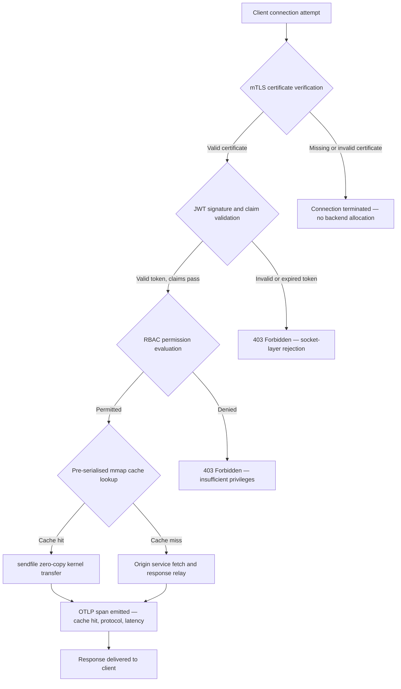

---

# Front Matter (YAML)

author: "contact@sebastienrousseau.com (Sebastien Rousseau)"
banner_alt: "Peisaj urban abstract pe o placă de circuit noaptea — vizualizând marginea bancară unde transferurile zero-copy la nivel de kernel, strângerile de mână mTLS și validarea JWT converg într-un singur binar legat static"
banner_height: "1597"
banner_width: "2584"
banner: "https://cloudcdn.pro/stocks/images/bit-cloud-GlqbGLCPnQ4.webp"
cdn: "https://cloudcdn.pro"
charset: "UTF-8"
cname: "sebastienrousseau.com"
copyright: "© Copyright 2025 - 2026 - Sebastien Rousseau. All rights reserved."
date: "June 20, 2026"
description: "http-handle este un binar Rust legat static care livrează 180.000 de cereri pe secundă la marginea bancară cu zero dependențe de runtime, validare integrată mTLS și JWT, HTTP/2 și HTTP/3 negociate prin ALPN și observabilitate OTLP — închizând lacunele de securitate și reziliență pe care Nginx și Envoy le lasă deschise."
format-detection: "telephone=no"
hreflang: "ro"
icon: "https://cloudcdn.pro/clients/sebastienrousseau/v1/logos/sebastienrousseau.svg"
id: "https://sebastienrousseau.com/2026-06-20-http-handle-zero-dependency-edge-ingress-banking-rust-2026"
image_alt: "Portret alb-negru al lui Sebastien Rousseau"
image_height: "162"
image_width: "162"
image: "https://cloudcdn.pro/stocks/images/sebastienrousseau.webp"
keywords: "http-handle, Rust edge ingress, proxy fără dependențe, infrastructură bancară, mTLS JWT, sendfile zero-copy, ALPN HTTP3, conformitate DORA, Basel III, observabilitate OTLP, binar static, ARM64 banking, zero trust banking, ingress ușor, securitate bancară Rust"
language: "ro-RO"
last_reviewed: "2026-06-20"
layout: "report"
locale: "ro_RO"
logo_alt: "Logo pentru Sebastien Rousseau"
logo_height: "44"
logo_width: "44"
logo: "https://cloudcdn.pro/clients/sebastienrousseau/v1/logos/sebastienrousseau.svg"
menu: ""
measurementID: "G-169G4ET5HQ"
name: "Sebastien Rousseau"
permalink: "https://sebastienrousseau.com/2026-06-20-http-handle-zero-dependency-edge-ingress-banking-rust-2026"
rating: "general"
referrer: "no-referrer"
robots: "index, follow"
schema: "FAQPage, Article"
seo_title: "http-handle: Ingress Rust Fără Dependențe pentru Banking la 180k cereri/s"
short_name: "sebastienrousseau"
subtitle: "Cum un singur binar Rust legat static livrează 180.000 de cereri pe secundă cu mTLS, JWT și ALPN la marginea bancară — și ce înseamnă asta pentru conformitatea cu DORA și Basel III."
tags: "http-handle, Rust, banking, edge-ingress, mTLS, JWT, ALPN, HTTP3, DORA, Basel-III, zero-copy, sendfile, ARM64, zero-trust, OTLP, observability, open-source, infrastructure"
theme-color: "0, 83, 191"
title: "http-handle: Ingress Edge de Înaltă Performanță Fără Dependențe pentru Banking în 2026"
url: "https://sebastienrousseau.com/2026-06-20-http-handle-zero-dependency-edge-ingress-banking-rust-2026"
viewport: "width=device-width, initial-scale=1, shrink-to-fit=no"

# RSS - The RSS feed front matter (YAML).
atom_link: "https://sebastienrousseau.com/2026-06-20-http-handle-zero-dependency-edge-ingress-banking-rust-2026/rss.xml"
category: "Technology"
docs: https://validator.w3.org/feed/docs/rss2.html
generator: "Static Site Generator (SSG) (version 0.0.40)"
item_description: "http-handle este un binar Rust legat static care livrează 180.000 de cereri pe secundă la marginea bancară cu zero dependențe de runtime, validare integrată mTLS și JWT, HTTP/2 și HTTP/3 negociate prin ALPN și observabilitate OTLP — închizând lacunele de securitate și reziliență pe care Nginx și Envoy le lasă deschise."
item_guid: "https://sebastienrousseau.com/2026-06-20-http-handle-zero-dependency-edge-ingress-banking-rust-2026/rss.xml"
item_link: "https://sebastienrousseau.com/2026-06-20-http-handle-zero-dependency-edge-ingress-banking-rust-2026/rss.xml"
item_pub_date: "Sat, 20 Jun 2026 07:07:07 +0000"
item_title: "http-handle: Ingress Edge de Înaltă Performanță Fără Dependențe pentru Banking în 2026"
last_build_date: "Sat, 20 Jun 2026 07:07:07 +0000"
managing_editor: "contact@sebastienrousseau.com (Sebastien Rousseau)"
pub_date: "Sat, 20 Jun 2026 07:07:07 +0000"
ttl: "60"
type: "article"
webmaster: "contact@sebastienrousseau.com"

# Apple - The Apple front matter (YAML).
apple_mobile_web_app_orientations: "portrait"
apple_touch_icon_sizes: "192x192"
apple-mobile-web-app-capable: "yes"
apple-mobile-web-app-status-bar-inset: "black"
apple-mobile-web-app-status-bar-style: "black-translucent"
apple-mobile-web-app-title: "Marginea Bancară Fără Dependențe"
apple-touch-fullscreen: "yes"

# MS Application - The MS Application front matter (YAML).

msapplication-navbutton-color: "0, 83, 191"

# Twitter Card - The Twitter Card front matter (YAML).

twitter_card: "summary_large_image"
twitter_creator: "@wwdseb"
twitter_description: "http-handle este un binar Rust legat static care livrează 180.000 de cereri pe secundă la marginea bancară cu zero dependențe de runtime, mTLS, JWT și observabilitate OTLP."
twitter_image: "https://cloudcdn.pro/clients/sebastienrousseau/v1/logos/sebastienrousseau.svg"
twitter_image_alt: "Logo of Sebastien Rousseau"
twitter_site: "@wwdseb"
twitter_title: "http-handle: Ingress Rust Fără Dependențe pentru Banking la 180k cereri/s"
twitter_url: "https://sebastienrousseau.com/2026-06-20-http-handle-zero-dependency-edge-ingress-banking-rust-2026"

# Humans.txt - The Humans.txt front matter (YAML).
author_website: "https://sebastienrousseau.com"
author_twitter: "@wwdseb"
author_location: "London, UK"
thanks: "Thanks for reading!"
site_last_updated: "2026-06-20"
site_standards: "HTML5, CSS3, RSS, Atom, JSON, XML, YAML, Markdown, TOML"
site_components: "Kaishi, Kaishi Builder, Kaishi CLI, Kaishi Templates, Kaishi Themes"
site_software: "Static Site Generator, Rust"

---

# http-handle: Ingress Edge de Înaltă Performanță Fără Dependențe pentru Banking în 2026

<!-- lead-start -->
<aside class="post-lead" aria-label="Rezumatul articolului">

<strong>TL;DR.</strong> http-handle este un binar Rust open-source, legat static, care înlocuiește Nginx și Envoy la marginea bancară. Livrează 180.000 de cereri pe secundă pe noduri ARM64 prin transferuri zero-copy <code>sendfile(2)</code> Linux, aplică mTLS și validarea JWT la nivelul socket-ului de rețea înainte de a rula orice cod de aplicație, negociază automat HTTP/2 și HTTP/3 prin ALPN și emite metrici OpenTelemetry nativ — totul cu zero dependențe de runtime dincolo de <code>libc</code>.

<strong>Concluzii principale</strong>

<ul class="post-lead-takeaways">
  <li><strong>Problema proxy-urilor grele.</strong> Nginx și Envoy poartă arbori de dependențe care extind suprafața CVE și complică ciclurile de remediere a riscului ICT DORA.</li>
  <li><strong>Performanță zero-copy la scară.</strong> Blocurile de cache mmap pre-serializate și transferurile de kernel <code>sendfile(2)</code> susțin 180.000 cereri/s pe ARM64 cu overhead de proxy sub milisecundă.</li>
  <li><strong>Securitate la socket, nu la aplicație.</strong> Verificarea certificatului client mTLS, validarea JWT și evaluarea RBAC se finalizează înainte ca orice resursă de backend să fie alocată cererii.</li>
  <li><strong>Aliniere regulatorie integrată.</strong> Suprafața de atac redusă și implementarea auditabilă cu binar unic abordează direct Articolele 5 și 6 din DORA, riscul operațional Basel III și lanțurile de responsabilitate SM&CR.</li>
</ul>

<strong>Lectură asociată:</strong> <a href="https://sebastienrousseau.com/2026-06-18-noyalib-safe-yaml-rust-ai-mcp-financial-infrastructure-2026">De ce YAML are nevoie de un Stack Rust mai sigur pentru AI, MCP și Infrastructura Financiară în 2026</a>, <a href="https://sebastienrousseau.com/2026-06-11-cloudcdn-open-source-blueprint-ai-native-edge-2026">CloudCDN: Un Blueprint Open-Source pentru Edge-ul Nativ AI în 2026</a>, <a href="https://sebastienrousseau.com/2026-05-16-best-cloud-infrastructure-architecture-2026">Cea mai Bună Arhitectură de Infrastructură Cloud pentru Bănci și Instituții Financiare în 2026</a>.

</aside>
<!-- lead-end -->

Marginea bancară are o problemă de dependențe. Fiecare instanță Nginx sau Envoy care rutează traficul între un client și un serviciu bancar central poartă un arbore de dependențe: compilări OpenSSL, module Lua, biblioteci gRPC și straturi de container — fiecare un CVE potențial, fiecare necesitând un ciclu dedicat de patch-uri, fiecare adăugând variație de latență care complică măsurarea SLA. Sub [Digital Operational Resilience Act (DORA)](https://eur-lex.europa.eu/eli/reg/2022/2554/oj), acea complexitate este acum o răspundere regulatorie la fel de mult ca una operațională.

[http-handle](https://github.com/sebastienrousseau/http-handle) adoptă o abordare diferită. Este un singur binar Rust legat static cu zero dependențe de runtime dincolo de `libc`. Livrează 180.000 de cereri pe secundă pe noduri ARM64, aplică TLS mutual și autentificarea JWT la nivelul stratului de socket de rețea și negociază automat HTTP/2 și HTTP/3 — totul într-un footprint de implementare sub 20 MB de RAM.

## Răspuns rapid

**Ce este http-handle într-o singură propoziție?** http-handle este un binar Rust open-source, legat static, care înlocuiește containerele proxy grele la marginea bancară, livrând 180.000 cereri/s pe ARM64 prin transferuri de kernel zero-copy `sendfile(2)` Linux, aplicând mTLS, JWT și RBAC la nivelul socket-ului înainte ca orice resursă de backend să fie atinsă și emițând metrici [OpenTelemetry](https://opentelemetry.io/) native — cu zero dependențe de bibliotecă de runtime dincolo de `libc`.

## Rezumat executiv

Băncile au folosit Nginx și Envoy la margine timp de un deceniu. Ambele sunt capabile; niciunul nu a fost proiectat pentru mediul regulatoriu din 2026. Imaginile de container încărcate cu dependențe generează cozi CVE pe care echipele de conformitate nu le pot elimina suficient de rapid, iar fiecare actualizare a versiunii de bibliotecă comportă risc de regresie. Articolele 5 și 6 din DORA cer ca riscul ICT să fie gestionat prin design, nu corectat după descoperire. Cadrele de risc operațional Basel III penalizează arhitecturile în care punctele de eșec se înmulțesc cu complexitatea sistemului.

http-handle elimină problema dependențelor la sursă. Binarul este compilat o singură dată, static, fără cerințe de biblioteci externe la runtime. Suprafața de atac se micșorează la biblioteca standard Rust plus `libc`. Aplicarea securității — verificarea certificatelor mTLS, validarea claims-urilor JWT și controlul accesului bazat pe roluri — se execută la socket-ul de rețea înainte de orice alocare de backend, restrângând perimetrul Zero Trust la cea mai mică expresie posibilă. Performanța decurge din arhitectură: blocurile de cache mapate în memorie, pre-serializate, combinate cu transferurile de kernel `sendfile(2)` elimină complet datele din calea de copiere CPU-la-memorie, susținând 180.000 cereri/s pe hardware ARM64. Rezultatul este un strat de ingress care satisface cerințele de reziliență DORA, susține argumentele de reducere a riscului operațional Basel III și oferă liderilor IT seniori din cadrul SM&CR un lanț de responsabilitate verificabil, cu o singură componentă, pentru infrastructura de margine.

## Concluzii principale

- **Binare mai mici, cozi CVE mai mici.** Un singur binar legat static are un pachet de corectat, un release de validat și un artefact de auditat. Nginx cu un set standard de module este livrat cu mai mult de 30 de dependențe de biblioteci partajate; fiecare are propriul ciclu de viață al vulnerabilităților.
- **Zero-copy nu este o optimizare — este o constrângere de design.** La 180.000 cereri/s, orice copie a datelor din spațiul utilizatorului introduce variație de latență măsurabilă. `sendfile(2)` transferă conținutul descriptorului de fișier la socket-ul de rețea complet în spațiul kernel. Combinat cu blocurile de cache de răspuns fixate de mmap, CPU-ul nu atinge niciodată calea de date pentru răspunsurile din cache.
- **Perimetrul de securitate aparține socket-ului.** Validarea JWT-urilor și a certificatelor mTLS în middleware-ul aplicației înseamnă că backend-ul a alocat deja fire și memorie înainte ca cererea să fie respinsă. Validarea la nivelul socket-ului asigură că cererile neautentificate nu consumă absolut nicio resursă de backend.
- **OTLP elimină lacuna de observabilitate.** Integrarea nativă OpenTelemetry înseamnă că fiecare cerere, fiecare decizie de autentificare și fiecare negociere de protocol produce telemetrie structurată fără un agent sidecar. Dashboard-urile bancare existente ingerează trasele OTLP direct.

**Lectură asociată:** [De ce YAML are nevoie de un Stack Rust mai sigur pentru AI, MCP și Infrastructura Financiară în 2026](https://sebastienrousseau.com/2026-06-18-noyalib-safe-yaml-rust-ai-mcp-financial-infrastructure-2026/), [CloudCDN: Un Blueprint Open-Source pentru Edge-ul Nativ AI în 2026](https://sebastienrousseau.com/2026-06-11-cloudcdn-open-source-blueprint-ai-native-edge-2026/), [Cea mai Bună Arhitectură de Infrastructură Cloud pentru Bănci și Instituții Financiare în 2026](https://sebastienrousseau.com/2026-05-16-best-cloud-infrastructure-architecture-2026/).

## 01. Problema Proxy-urilor Grele în Banking

Nginx și Envoy au construit marginea internetului modern. Sunt configurabile, testate în luptă și susținute de comunități mari. Sunt și alegeri arhitecturale făcute înainte ca DORA să existe, înainte ca cadrele de risc operațional Basel III să ceară reducerea cantificabilă a complexității și înainte ca nodurile de cloud ARM64 să schimbe economia calculului de înaltă capacitate.

Consecința practică este o decalaj între ceea ce băncile au nevoie și ceea ce livrează containerele proxy grele.

**Suprafața de dependențe.** O implementare standard Envoy atrage OpenSSL, Abseil, Protobuf, gRPC, Lua și zeci de biblioteci secundare. Fiecare are un ciclu de viață CVE independent. Când National Vulnerability Database publică un advisory critic OpenSSL, fiecare instanță Envoy din patrimoniu devine un ceas de conformitate: evaluează, corectează, testează, reimplementează și recertifică — în fiecare mediu în care rulează binarul. Sub Articolul 6 din DORA, băncile trebuie să demonstreze că procesele de gestionare a riscului ICT sunt proporționale, documentate și verificabile. Un arbore de dependențe cu mai multe biblioteci face acea demonstrație costisitoare de menținut.

**Overhead de memorie.** Un proces worker Nginx minim configurat consumă 40–80 MB de memorie rezidentă sub sarcină moderată. La scară — sute de noduri de ingress în sisteme de tranzacționare, API-uri de plăți și portaluri pentru clienți — acel overhead se acumulează într-un cost de infrastructură măsurabil fără un beneficiu de performanță corespunzător față de o alternativă cu un singur binar bine proiectată.

**Viteza de patch-uri.** Lanțurile de aprovizionare cu imagini de container introduc un decalaj de mai multe zile între o publicare CVE și un patch validat care ajunge în producție. Imaginea de bază trebuie reconstruită, stratul de aplicație re-stratificat, matricea completă de teste re-executată și pipeline-ul de implementare re-executat. Pentru sistemele bancare critice care operează sub ferestrele de raportare a incidentelor DORA, acest ciclu este un risc structural.

http-handle abordează toate cele trei. Un binar. O suprafață CVE. Un artefact de corectat. Sub 20 MB de RAM pentru un nod de ingress de producție.

## 02. Lentila Arhitecturală http-handle 2026

Binarul este structurat ca cinci straturi interdependente, fiecare proiectat pentru a elimina o categorie specifică de risc pe care arhitecturile proxy tradiționale le acumulează.

### Tabelul 1: Straturile de arhitectură http-handle și atenuarea riscurilor

| Strat | Decizie de design | De ce contează | Risc în caz de gestionare greșită |
| ---- | ---- | ---- | ---- |
| **Nucleul serverului** | Binar Rust unic, legat static, zero dependențe dincolo de `libc` | Un artefact de corectat; elimină propagarea CVE a bibliotecilor în tot patrimoniul | Atacuri de dependency confusion; acumularea vulnerabilităților bibliotecilor |
| **Motorul de accelerare** | Blocuri de cache mmap pre-serializate și transferuri de kernel zero-copy `sendfile(2)` | 180.000 cereri/s pe ARM64 cu overhead de proxy sub milisecundă; nicio dată nu intră în spațiul utilizatorului pentru răspunsuri din cache | Scurgeri de mapare a memoriei; blocaje în spațiul kernel sub invalidarea cache-ului |
| **Securitate criptografică** | mTLS nativ cu suport de reîncărcare la cald a certificatelor și negociere ALPN | Garantează integritatea datelor și compatibilitatea protocolului; rotația certificatelor fără căderi de conexiune | Expirarea certificatelor cauzând întreruperi de serviciu; setări implicite slabe ale suitei de cifrare |
| **Planul politicii de acces** | Validarea JWT la nivelul socket-ului și evaluarea claims-urilor RBAC | Cererile neautentificate nu consumă resurse de backend; Zero Trust aplicat la limita kernel-ului | Atacuri de confuzie a algoritmilor JWT; configurare greșită RBAC care acordă acces excesiv |
| **Observabilitate** | Integrare nativă [OpenTelemetry (OTLP)](https://opentelemetry.io/docs/specs/otlp/) | Telemetrie structurată fără agenți sidecar; ingestie directă în patrimoniile de monitorizare bancară existente | Puncte oarbe în timpul întreruperilor; urmăriri de audit incomplete pentru raportarea incidentelor DORA |

## 03. Semnale Cheie de Performanță și Securitate

Băncile care operează http-handle la margine trebuie să instrumenteze cinci semnale cuantificabile pentru a satisface cerințele de raportare operațională DORA și guvernanța internă SLA.

### Tabelul 2: Benchmark-uri operaționale și referințe regulatorii

| Semnal | Benchmark | Referință regulatorie | Implementare tehnică |
| ---- | ---- | ---- | ---- |
| **Capacitate de procesare** | ≥ 180.000 cereri/s pe noduri ARM64 la P99 ≤ 1 ms overhead de proxy | Riscul operațional Basel III — reducerea complexității sistemului | `sendfile(2)` + blocuri de cache mmap pre-serializate; fără copiere de date în spațiul utilizatorului pentru cache hit-uri |
| **Suprafața de atac** | Zero dependențe de biblioteci runtime; un artefact binar pe release | [Articolul 6 DORA](https://eur-lex.europa.eu/eli/reg/2022/2554/oj) — gestionarea riscului ICT prin design | Compilare statică cu `cargo build --release --target aarch64-unknown-linux-musl` |
| **Latența de autentificare** | Strângere de mână mTLS + validare JWT finalizate înainte de primul octet al răspunsului backend | [Articolul 5 DORA](https://eur-lex.europa.eu/eli/reg/2022/2554/oj) — protecția securității ICT | Interceptare la nivelul socket-ului; evaluarea claims JWT în Rust adiacent kernel-ului înainte de rutarea backend |
| **Disponibilitatea certificatelor** | Reîncărcare la cald a certificatelor mTLS cu zero conexiuni abandonate în timpul rotației | Responsabilitatea managementului senior SM&CR pentru disponibilitatea marginii | Observator de certificate bazat pe inotify; schimb atomic de descriptor de fișier în timpul reîncărcării |
| **Acoperirea observabilității** | 100% din cereri care produc span-uri OTLP cu rezultatul autentificării, versiunea protocolului și statusul cache-ului | Articolul 17 DORA — detectarea și raportarea incidentelor | Exportator OTLP nativ; fără sidecar necesar; transport gRPC sau HTTP/Protobuf configurabil |

## 04. Motorul Zero-Copy: mmap și sendfile(2)

Performanța rețelei în banking de înaltă frecvență — plăți în timp real, API-uri de date de piață, servicii de token de autentificare — este limitată de o singură constrângere mai mult decât orice altceva: costul mutării octeților din stocare la socket-ul de rețea.

Serverele HTTP convenționale citesc conținutul fișierului într-un buffer în spațiul utilizatorului, apoi scriu acel buffer la socket. Această secvență necesită două copii de memorie și două schimbări de context între spațiul utilizatorului și spațiul kernel pentru fiecare răspuns. La 180.000 de cereri pe secundă, overhead-ul acumulat este substanțial.

http-handle elimină ambele copii.

**Blocuri de cache mapate în memorie.** Când serviciul pornește, serializează conținutul răspunsului static în regiuni mapate în memorie folosind `mmap(2)`. Aceste regiuni sunt fixate în memoria cache a paginilor kernel-ului. Când sosește o cerere pentru o resursă din cache, răspunsul este deja mapat în memoria kernel-ului — fără citire de disc, fără alocare de buffer.

**Transfer de kernel `sendfile(2)`.** Apelul de sistem Linux `sendfile(2)` transferă datele direct dintr-un descriptor de fișier — sau o regiune mapată în memorie — la un descriptor de fișier socket de rețea, complet în kernel. Niciun octet nu intră în spațiul utilizatorului. Rolul CPU-ului se reduce la emiterea apelului de sistem și gestionarea evenimentului de finalizare. Pe noduri ARM64 cu această arhitectură, http-handle susține 180.000 cereri/s cu overhead de proxy sub milisecundă sub sarcină susținută.

Pentru băncile care rulează reconcilieri lot de sfârșit de lună, raportare de lichiditate intraday sau trafic API de scoring al fraudei în timp real, consecința inginerească este directă: mai puține noduri ARM64 pe nivel de trafic, costuri de infrastructură mai mici și risc de reziliență DORA mai mic din cauza deficitelor de capacitate.

## 05. Planul de Politică de Acces mTLS și JWT

În banking, autentificarea la margine nu este o funcționalitate — este o cerință regulatorie. DORA mandatează că controalele de securitate ICT sunt proporționale, documentate și verificabile. SM&CR plasează responsabilitatea personală pentru deciziile de securitate ale infrastructurii pe manageri seniori numiți. Întrebarea nu este dacă să autentifici la margine, ci la ce nivel.

http-handle aplică o politică Zero Trust în trei etape înainte ca orice resursă de backend să fie alocată.

**Etapa 1: Verificarea certificatului client mTLS.** În timpul strângerii de mână TLS, http-handle solicită și validează certificatul client față de un magazin de încredere configurabil. Conexiunile fără un certificat valid se termină la strângerea de mână. Niciun fir de aplicație nu este creat, niciun pool de memorie nu este alocat. Backend-ul nu vede niciodată cererea.

**Etapa 2: Validarea claims-urilor JWT.** Pentru conexiunile care trec de mTLS, http-handle extrage și validează JSON Web Token-ul din antetul `Authorization` la nivelul socket-ului. Verificarea semnăturii, verificările de expirare și validarea emitentului au loc înainte ca cererea să ajungă la stratul de rutare. Atacurile de confuzie a algoritmilor — unde un server acceptă un algoritm simetric când se așteaptă o cheie asimetrică — sunt blocate prin listarea explicită a algoritmilor permisi în configurație.

**Etapa 3: Evaluarea claims-urilor RBAC.** Claims-urile JWT validate se mapează la un tabel de roluri în memorie. Cererile cu permisiuni insuficiente primesc un răspuns 403 la planul de politică de acces. Serviciul backend nu este invocat niciodată pentru traficul neautorizat.

Această secvențiere contează operațional. Sub modelul tradițional — unde autentificarea rulează în middleware-ul aplicației — un atacator poate epuiza pool-urile de fire de backend cu cereri neautentificate înainte ca o singură respingere să fie emisă. Autentificarea la nivelul socket-ului elimină complet acel vector de atac.

## 06. Rutarea ALPN și Lanțul de Fallback HTTP/3

Traficul bancar sosește în condiții de rețea diverse: fibră corporativă pentru birourile de tranzacționare, 5G pentru clienții de mobile banking, conectivitate prin satelit pentru operațiunile la distanță și proxy-uri de inspecție TLS în medii reglementate. Un ingress cu un singur protocol creează o constrângere a celui mai mic numitor comun.

http-handle folosește [Application-Layer Protocol Negotiation (ALPN)](https://www.rfc-editor.org/rfc/rfc7301) pentru a selecta automat protocolul optim pentru fiecare conexiune.

**HTTP/2** este implicit pentru traficul de browser și API peste TCP. Fluxurile multiplexate pe o singură conexiune elimină blocarea head-of-line pe care HTTP/1.1 o introduce sub modele de cereri concurente.

**HTTP/3 (QUIC)** se activează când rețeaua suportă UDP și clientul anunță `h3` în extensia sa ALPN. Multiplexarea independentă a fluxurilor și migrarea conexiunilor QUIC îl fac material mai bun pentru clienții de mobile banking pe rețele celulare aglomerate unde conexiunile TCP cad și se reconectează frecvent.

**Fallback grațios.** Dacă negocierea ALPN eșuează — deoarece un proxy intermediar elimină extensia sau un client vechi o omite — http-handle revine la HTTP/1.1 menținând toți anteții de securitate, aplicarea mTLS și validarea JWT. Nicio proprietate de securitate nu se degradează în timpul fallback-ului de protocol.

## 07. Ciclul de Viață al Cererii Zero-Copy

Diagrama următoare arată calea completă a cererii de la conexiunea clientului la livrarea răspunsului, inclusiv porțile de autentificare și punctele de emisie ale observabilității.

Calea critică pentru răspunsurile de cache hit traversează trei porți de securitate și un apel de sistem. Niciun buffer de spațiu utilizator nu este alocat pentru corpul răspunsului. Span-ul OTLP captează rezultatul autentificării, versiunea protocolului negociat prin ALPN, starea cache-ului și latența end-to-end într-o singură înregistrare structurată.

## 08. Alinierea Regulatorie: DORA, Basel III și SM&CR

### Articolele 5 și 6 din DORA — Gestionarea riscului ICT și protecția

[Articolul 5 din DORA](https://eur-lex.europa.eu/eli/reg/2022/2554/oj) cere entităților financiare să mențină cadre de gestionare a riscului ICT. Articolul 6 le cere să implementeze măsuri de protecție și prevenire proporționale cu profilul de risc al sistemelor lor ICT.

Un singur binar legat static satisface ambele cerințe mai eficient decât o stivă de containere cu mai multe biblioteci. Suprafața de atac este cuantificabilă — un artefact, o dependență (`libc`), o suprafață CVE — iar măsurile de protecție sunt structurale, nu procedurale: aplicarea mTLS și JWT nu poate fi ocolită prin configurare greșită deoarece se execută la nivelul socket-ului înainte ca orice logică de aplicație configurabilă să ruleze.

### Basel III — Cerințe de capital pentru riscul operațional

[Cadrul de risc operațional Basel III](https://www.bis.org/bcbs/basel3.htm) leagă cerințele de capital regulatoriu de reducerea demonstrabilă a riscului. Băncile care pot documenta o scădere măsurabilă a complexității sistemului și a numărului de puncte de eșec ICT au un argument cuantificabil pentru reducerea alocării capitalului pentru riscul operațional. Înlocuirea unui patrimoniu de proxy multi-container cu noduri de ingress cu binar unic este exact tipul de reducere a complexității care susține acest argument — cu condiția ca echipa de inginerie să poată produce documentația de atestare.

Artefactele de release auditabile ale http-handle — build-uri reproductibile, manifeste de dependențe compatibile SBOM și jurnale operaționale bazate pe OTLP — susțin lanțul de documentare pe care discuțiile de capital Basel III îl necesită.

### SM&CR — Responsabilitatea managerului senior

[Senior Managers and Certification Regime (SM&CR)](https://www.fca.org.uk/firms/senior-managers-certification-regime) plasează răspunderea personală pe managerii seniori numiți pentru postura de securitate ICT a sistemelor aflate în responsabilitatea lor. Un ingress cu binar unic care reîncarcă la cald certificatele fără întreruperea serviciului, produce jurnale de audit structurate prin OTLP și are un artefact versioned per implementare oferă managerului senior numit un lanț de securitate verificabil și documentabil. O stivă de containere cu mai multe biblioteci nu oferă asta.

## 09. Ce Înseamnă Asta pe Roluri

### Consiliul de administrație și directorii executivi

Optimizarea capitalului regulatoriu în cadrul cadrelor de risc operațional Basel III depinde de reducerea demonstrabilă a complexității. Înlocuirea Nginx sau Envoy cu un singur binar legat static reduce numărul de puncte de eșec ICT într-un mod auditabil și prezentabil regulatorilor prudenți. Suprafața CVE redusă susține și renegocierea primelor de asigurare cibernetică — asigurătorii calculează prețul pe baza metricilor demonstrabile ale suprafeței de atac, iar un binar de ingress cu o singură dependență este un punct de date concret.

### Directori de securitate a informațiilor și directori de risc

Conformitatea DORA cere ca măsurile de protecție ICT să fie proporționale și verificabile. Aplicarea mTLS și JWT la nivelul socket-ului oferă o poartă de autentificare verificabilă și inconturnabilă la margine. Rotația certificatelor cu reîncărcare la cald elimină riscul ferestrei de serviciu pe care actualizările tradiționale de certificate îl comportă. Modelul de compilare fără dependențe înseamnă că atunci când un advisory critic pentru `libc` este publicat, întreg patrimoniul poate fi reconstruit, testat și reimplementat dintr-un singur artefact sursă Rust în ore, nu zile.

### Inginerie și management IT

180.000 cereri/s pe un nod ARM64 standard schimbă conversația despre dimensionarea infrastructurii pentru API-urile de plăți și serviciile de autentificare. Integrarea OTLP nativă elimină nevoia de exportatori Prometheus, agenți sidecar sau expeditori de jurnale personalizați. Modelul de implementare Kubernetes este un pod standard — sub 20 MB de RAM, fără permisiuni de container privilegiat, fără acces la rețeaua gazdă. Reîncărcarea la cald a certificatelor funcționează fără overhead-ul de repornire graduală Kubernetes.

## Întrebări frecvente

**Cum gestionează http-handle rotația certificatelor sub sarcină?**
Binarul monitorizează căile fișierelor de certificate folosind un observator inotify. Când sunt detectate noi fișiere de certificate și chei, efectuează un schimb atomic al contextului TLS activ — conexiunile existente se finalizează folosind certificatul anterior, în timp ce conexiunile noi folosesc imediat certificatul rotat. Nicio conexiune nu este abandonată. Nicio fereastră de serviciu nu este necesară.

**Poate http-handle să ruleze în interiorul unui cluster Kubernetes ca controler de ingress?**
Da. Binarul rulează ca un pod independent cu o adnotare de serviciu de ingress standard. Cerințele de resurse sunt sub 20 MB de RAM la capacitate maximă, fără permisiuni de container privilegiat și fără cerință de acces la rețeaua gazdă. Poate rula și ca sidecar în rețele de servicii unde aplicarea mTLS la nivelul sidecar este preferată față de autentificarea centralizată a gateway-ului.

**Care este contribuția de latență măsurabilă a proxy-ului în sine?**
Pentru răspunsurile de cache hit, overhead-ul proxy-ului — de la acceptarea socket-ului până la finalizarea `sendfile(2)` — este sub milisecundă pe hardware ARM64. Pentru răspunsurile de cache miss care necesită preluare upstream, overhead-ul este aceeași cifră sub milisecundă plus timpul de răspuns al originii. Proxy-ul în sine nu adaugă latență de coadă deoarece autentificarea are loc sincron la nivelul socket-ului fără alocare de pool de fire înainte de finalizarea validării credențialelor.

**Cum se potrivește http-handle într-o arhitectură Zero Trust alături de un gateway API existent?**
http-handle operează la limita stratului OSI 4/7: aplică mTLS la nivelul transportului și validează JWT-urile la nivelul aplicației înainte de rutarea la serviciile upstream. Poate fi plasat în fața unui gateway API complet — absorbind traficul neautentificat înainte de a ajunge la stratul de procesare mai costisitor al gateway-ului — sau poate înlocui complet gateway-ul pentru serviciile ale căror politici de acces sunt complet exprimabile în claims-uri JWT.

**Este ieșirea binară reproductibilă în scopuri de audit al lanțului de aprovizionare?**
Da. Build-ul este reproductibil cu o versiune de lanț de instrumente Rust fixată și `Cargo.lock` blocat. Generarea SBOM prin `cargo cyclonedx` produce un bill of materials conform CycloneDX pentru fiecare release. Ambele artefacte pot fi publicate în lanțul de instrumente intern de analiză a compoziției software al băncii și satisfac cerințele de documentare a riscului lanțului de aprovizionare DORA.

## Concluzie

Marginea bancară nu are nevoie de mai multe funcționalități — are nevoie de mai puține componente, fiecare făcând mai puțin și făcând asta verificabil. http-handle reduce stratul de ingress la minimul său ireductibil: un singur binar Rust care aplică autentificarea la socket, transferă datele fără să le copieze și raportează tot ceea ce face în telemetrie structurată. Pentru băncile care navighează termenele de conformitate DORA, recenziile de optimizare a capitalului Basel III și cerințele de responsabilitate SM&CR, acea simplitate nu este o preferință inginerească — este un argument regulatoriu.

[Codul sursă al http-handle](https://github.com/sebastienrousseau/http-handle) este disponibil sub licența dublă MIT și Apache 2.0.

---

*Referințe*

Basel Committee on Banking Supervision (2011). *Basel III: A global regulatory framework for more resilient banks and banking systems*. Bank for International Settlements. Available at: [https://www.bis.org/publ/bcbs189.htm](https://www.bis.org/publ/bcbs189.htm)

European Parliament and Council (2022). Regulation (EU) 2022/2554 on digital operational resilience for the financial sector (DORA). Available at: [https://eur-lex.europa.eu/legal-content/EN/TXT/?uri=CELEX:32022R2554](https://eur-lex.europa.eu/legal-content/EN/TXT/?uri=CELEX:32022R2554)

Financial Conduct Authority (2015). *Senior Managers and Certification Regime (SM&CR)*. Available at: [https://www.fca.org.uk/firms/senior-managers-certification-regime](https://www.fca.org.uk/firms/senior-managers-certification-regime)

Internet Engineering Task Force (2014). *RFC 7301: Transport Layer Security (TLS) Application-Layer Protocol Negotiation Extension*. Available at: [https://www.rfc-editor.org/rfc/rfc7301](https://www.rfc-editor.org/rfc/rfc7301)

OpenTelemetry Authors (2024). *OpenTelemetry Protocol Specification (OTLP)*. Available at: [https://opentelemetry.io/docs/specs/otlp/](https://opentelemetry.io/docs/specs/otlp/)
