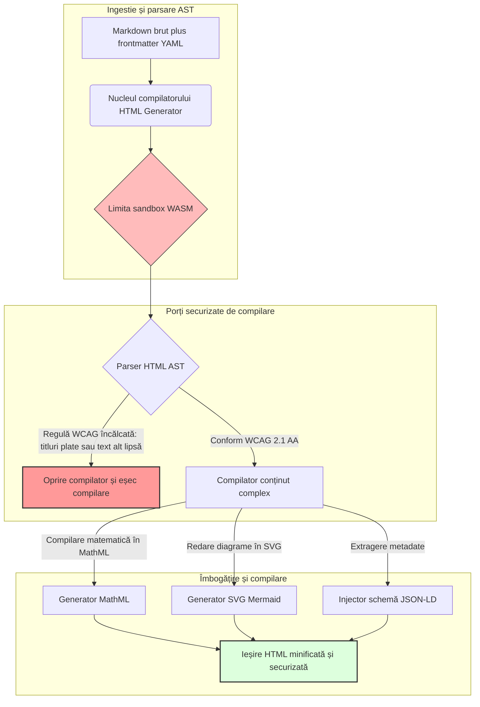

---

# Front Matter (YAML)

author: "contact@sebastienrousseau.com (Sebastien Rousseau)"
banner_alt: "Geometrie arhitecturală sub lumină structurată — simbolizând rolul HTML Generator ca pipeline compilat Markdown-to-HTML pentru infrastructură de publicare accesibilă, optimizată SEO și izolată în sandbox"
banner_height: "1597"
banner_width: "2584"
banner: "https://cloudcdn.pro/stocks/images/markus-winkler-IrRbSND5EUc-unsplash-1200.webp"
cdn: "https://cloudcdn.pro"
charset: "UTF-8"
cname: "sebastienrousseau.com"
copyright: "© Copyright 2025 - 2026 - Sebastien Rousseau. All rights reserved."
date: "June 20, 2026"
description: "HTML Generator este o bibliotecă Rust care transformă Markdown în HTML conform WCAG, optimizat SEO și îmbogățit cu JSON-LD — accesibilitate ca și cod, suport MathML și Mermaid, execuție izolată în sandbox WebAssembly pentru publicare corporativă sigură."
format-detection: "telephone=no"
hreflang: "ro"
icon: "https://cloudcdn.pro/clients/sebastienrousseau/v1/logos/sebastienrousseau.svg"
id: "https://sebastienrousseau.com/2026-06-20-html-generator-accessible-seo-structured-markdown-rust-2026"
image_alt: "Portret alb-negru al lui Sebastien Rousseau"
image_height: "162"
image_width: "162"
image: "https://cloudcdn.pro/stocks/images/sebastienrousseau.webp"
keywords: "html-generator, Rust Markdown to HTML, accesibilitate ca și cod, WCAG 2.1 AA, HTML optimizat SEO, JSON-LD, MathML, Mermaid, WebAssembly, EAA, DORA, ADA Title III, publicare accesibilă, parsare sandbox, open source"
language: "ro-RO"
last_reviewed: "2026-06-20"
layout: "report"
locale: "ro_RO"
logo_alt: "Logo Sebastien Rousseau"
logo_height: "44"
logo_width: "44"
logo: "https://cloudcdn.pro/clients/sebastienrousseau/v1/logos/sebastienrousseau.svg"
menu: ""
measurementID: "G-169G4ET5HQ"
name: "Sebastien Rousseau"
permalink: "https://sebastienrousseau.com/2026-06-20-html-generator-accessible-seo-structured-markdown-rust-2026"
rating: "general"
referrer: "no-referrer"
robots: "index, follow"
schema: "FAQPage, Article"
seo_title: "Accesibilitate ca și cod: Markdown la HTML AAA cu Rust în 2026"
short_name: "sebastienrousseau"
subtitle: "Transformând publicarea corporativă web, documentația produselor și portalurile pentru clienți din fișiere text inaccesibile în active digitale înalt structurate, conforme și izolate în sandbox."
tags: "html-generator, Rust, Markdown, accesibilitate, WCAG, SEO, JSON-LD, MathML, Mermaid, WebAssembly, EAA, DORA, ADA, descoperire AI, RAG, open source, infrastructură bancară"
theme-color: "0, 83, 191"
title: "Transformarea Markdown în HTML Accesibil, Optimizat SEO și Structurat cu Rust în 2026"
url: "https://sebastienrousseau.com/2026-06-20-html-generator-accessible-seo-structured-markdown-rust-2026"
viewport: "width=device-width, initial-scale=1, shrink-to-fit=no"

# RSS - The RSS feed front matter (YAML).
atom_link: "https://sebastienrousseau.com/2026-06-20-html-generator-accessible-seo-structured-markdown-rust-2026/rss.xml"
category: "Technology"
docs: https://validator.w3.org/feed/docs/rss2.html
generator: "Static Site Generator (SSG) (version 0.0.40)"
item_description: "HTML Generator este o bibliotecă Rust care transformă Markdown în HTML conform WCAG, optimizat SEO și îmbogățit cu JSON-LD — accesibilitate ca și cod, suport MathML și Mermaid, execuție izolată în sandbox WebAssembly pentru publicare corporativă sigură."
item_guid: "https://sebastienrousseau.com/2026-06-20-html-generator-accessible-seo-structured-markdown-rust-2026/rss.xml"
item_link: "https://sebastienrousseau.com/2026-06-20-html-generator-accessible-seo-structured-markdown-rust-2026/rss.xml"
item_pub_date: "Sat, 20 Jun 2026 06:06:06 +0000"
item_title: "Transformarea Markdown în HTML Accesibil, Optimizat SEO și Structurat cu Rust în 2026"
last_build_date: "Sat, 20 Jun 2026 06:06:06 +0000"
managing_editor: "contact@sebastienrousseau.com (Sebastien Rousseau)"
pub_date: "Sat, 20 Jun 2026 06:06:06 +0000"
ttl: "60"
type: "article"
webmaster: "contact@sebastienrousseau.com"

# Apple - The Apple front matter (YAML).
apple_mobile_web_app_orientations: "portrait"
apple_touch_icon_sizes: "192x192"
apple-mobile-web-app-capable: "yes"
apple-mobile-web-app-status-bar-inset: "black"
apple-mobile-web-app-status-bar-style: "black-translucent"
apple-mobile-web-app-title: "Markdown la HTML AAA cu Rust"
apple-touch-fullscreen: "yes"

# MS Application - The MS Application front matter (YAML).

msapplication-navbutton-color: "0, 83, 191"

# Twitter Card - The Twitter Card front matter (YAML).

twitter_card: "summary_large_image"
twitter_creator: "@wwdseb"
twitter_description: "HTML Generator este o bibliotecă Rust care transformă Markdown în HTML conform WCAG, optimizat SEO și îmbogățit cu JSON-LD — accesibilitate ca și cod, suport MathML și Mermaid, execuție izolată în sandbox WebAssembly pentru publicare corporativă sigură."
twitter_image: "https://cloudcdn.pro/clients/sebastienrousseau/v1/logos/sebastienrousseau.svg"
twitter_image_alt: "Logo Sebastien Rousseau"
twitter_site: "@wwdseb"
twitter_title: "Accesibilitate ca și cod: Markdown la HTML AAA cu Rust"
twitter_url: "https://sebastienrousseau.com/2026-06-20-html-generator-accessible-seo-structured-markdown-rust-2026"

# Humans.txt - The Humans.txt front matter (YAML).
author_website: "https://sebastienrousseau.com"
author_twitter: "@wwdseb"
author_location: "London, UK"
thanks: "Mulțumim că ați citit!"
site_last_updated: "2026-06-20"
site_standards: "HTML5, CSS3, RSS, Atom, JSON, XML, YAML, Markdown, TOML"
site_components: "Kaishi, Kaishi Builder, Kaishi CLI, Kaishi Templates, Kaishi Themes"
site_software: "Static Site Generator, Rust"

---

# Transformarea Markdown în HTML Accesibil, Optimizat SEO și Structurat cu Rust în 2026

<!-- lead-start -->
<aside class="post-lead" aria-label="Rezumatul articolului">

<strong>TL;DR.</strong> HTML Generator este un compilator Markdown-to-HTML scris integral în Rust, care impune conformitatea WCAG 2.1 AA la momentul compilării, injectează JSON-LD conform schemei, redă nativ MathML și SVG Mermaid și izolează parsarea într-un sandbox WebAssembly — transformând publicarea într-un plan de control compilat pentru accesibilitate, SEO și securitate ICT.

<strong>Concluzii cheie</strong>

<ul class="post-lead-takeaways">
  <li><strong>Răspuns rapid.</strong> Ce este HTML Generator într-o singură propoziție?</li>
  <li><strong>Rezumat executiv.</strong> Redarea Markdown pare trivială; obținerea unui HTML de calitate publicistică este o problemă de conformitate.</li>
  <li><strong>01. De ce contează un compilator HTML axat pe accesibilitate în 2026.</strong> EAA și ADA Title III au mutat accesibilitatea din igiena inginerească în responsabilitate fiduciară.</li>
  <li><strong>02. Arhitectura HTML Generator din perspectiva anului 2026.</strong> Un pipeline compilat în mai multe etape, de la Markdown brut la ieșire HTML securizată.</li>
</ul>

<strong>Lectură recomandată:</strong> <a href="https://sebastienrousseau.com/2026-06-18-noyalib-safe-yaml-rust-ai-mcp-financial-infrastructure-2026">De ce YAML are nevoie de un stac Rust mai sigur pentru AI, MCP și infrastructura financiară în 2026</a>, Un generator de site-uri statice securizat implicit pentru publicarea în era AI în 2026, <a href="https://sebastienrousseau.com/2026-06-11-cloudcdn-open-source-blueprint-ai-native-edge-2026">CloudCDN: Un plan open-source pentru edge-ul nativ AI în 2026</a>.

</aside>
<!-- lead-end -->

În 2026, conținutul web este consumat în aceeași măsură de crawlerele AI de căutare, motoarele de căutare bazate pe LLM și pipeline-urile Retrieval-Augmented Generation (RAG), cât și de cititorii umani. HTML-ul plat sau malformat compromite vizibilitatea pentru mașini, iar nerespectarea reglementărilor globale stricte, precum [Actul European privind Accesibilitatea (EAA)](https://www.accessibility-act.eu/) și [ADA Title III din SUA](https://www.ada.gov/topics/title-iii/), constituie în prezent o răspundere civilă neechivocă. [HTML Generator](https://github.com/sebastienrousseau/html-generator) este o bibliotecă Rust de înaltă performanță concepută să elimine aceste deficiențe — la nivelul compilatorului, nu prin corecții post-implementare.

## Răspuns rapid

**Ce este HTML Generator într-o singură propoziție?** HTML Generator este un compilator Markdown-to-HTML open-source, scris integral în Rust, care impune conformitatea [WCAG 2.1 AA](https://www.w3.org/TR/WCAG21/) la momentul compilării, generează automat repere semantice și atribute ARIA, injectează metadate [JSON-LD](https://json-ld.org/) conforme cu schema din frontmatter YAML, redă diagrame Mermaid și expresii matematice în SVG accesibil și MathML și rulează într-un sandbox [WebAssembly](https://webassembly.org/) — transformând publicarea corporativă într-un plan de control compilat, de calitate fiduciară.

## Rezumat executiv

Redarea Markdown pare trivială. HTML-ul de calitate publicistică este o problemă de conformitate. În iunie 2026, fiecare punct de contact corporativ — portaluri de relații cu investitorii, depuneri de rapoarte de reglementare, documentație pentru clienți, referințe API, patrimonii de marketing — este procesat atât de oameni, cât și de mașini. Două presiuni se ciocnesc pe fiecare pagină: [EAA](https://www.accessibility-act.eu/) și [ADA Title III](https://www.ada.gov/topics/title-iii/) transformă accesibilitatea într-o expunere juridică la nivel de consiliu de administrație, în timp ce ingestia AI și pipeline-urile RAG recompensează outputul structurat și ușor de interpretat de mașini. Bibliotecile Markdown standard produc HTML plat care eșuează la ambele verificări. HTML Generator tratează generarea documentelor ca un pipeline compilat: validarea WCAG este o eroare de compilare, JSON-LD provine din frontmatter YAML fără marcare manuală, MathML și Mermaid se redau accesibil, iar întregul motor este livrat ca target WebAssembly, astfel că parsarea documentelor neîncredere rămâne izolată față de gazdă.

## Concluzii cheie

- **Accesibilitatea ca și cod este noul standard de bază.** EAA impune accesibilitatea pentru serviciile digitale destinate consumatorilor. HTML Generator evaluează arborele documentului la momentul compilării, generând automat repere semantice și atribute ARIA — mai puține corecții post-implementare, bugete de remediere reduse, niciun text alternativ lipsă ajuns în producție.
- **Date structurate pentru descoperire AI.** Căutarea modernă și RAG depind de metadatele interpretabile de mașini. Compilatorul parsează frontmatter YAML și injectează [JSON-LD conform Schema.org](https://schema.org/) direct în antetul documentului, făcând conținutul pe deplin interpretabil de [Google Rich Results](https://developers.google.com/search/docs/appearance/structured-data/intro-structured-data), [Bing Webmaster](https://www.bing.com/webmasters) și crawlerele bazate pe LLM.
- **Excelență în publicarea de conținut tehnic.** Publicarea tehnică nu înseamnă text plat. HTML Generator compilează extensiile matematice raw Markdown în [MathML](https://www.w3.org/Math/) accesibil și redă diagramele [Mermaid.js](https://mermaid.js.org/) în SVG responsiv — ambele păstrând structura conformă WCAG, fără a recurge la imagini opace.
- **Izolare WebAssembly.** Parsarea Markdown neîncredere reprezintă un risc de securitate. Prin targetarea [WASM](https://webassembly.org/), HTML Generator execută codul într-un sandbox izolat, care previne execuția arbitrară de cod și protejează sistemul gazdă — satisfăcând direct obligațiile de securitate ICT din [DORA Article 6](https://eur-lex.europa.eu/legal-content/EN/TXT/?uri=CELEX%3A32022R2554).
- **Protecție fiduciară pentru consiliile de administrație.** Neconformitatea tehnică a intrat în sala de consiliu. Standardizarea pe un motor HTML compilat protejează directorii și managementul superior de expunerea civilă și de reglementare personală sub DORA, EAA și ADA Title III.

**Lectură recomandată:** [De ce YAML are nevoie de un stac Rust mai sigur pentru AI, MCP și infrastructura financiară în 2026](https://sebastienrousseau.com/2026-06-18-noyalib-safe-yaml-rust-ai-mcp-financial-infrastructure-2026/), Un generator de site-uri statice securizat implicit pentru publicarea în era AI în 2026, [CloudCDN: Un plan open-source pentru edge-ul nativ AI în 2026](https://sebastienrousseau.com/2026-06-11-cloudcdn-open-source-blueprint-ai-native-edge-2026/).

## 01. De ce un compilator HTML axat pe accesibilitate contează în 2026

Patrimoniile web corporative, bibliotecile de documentație și centrele de asistență pentru produse sunt puncte de contact digitale critice. Ele sunt supuse acum la două presiuni intense și convergente.

Prima este **ingestia și vizibilitatea pentru AI**. Conținutul este din ce în ce mai procesat de modele lingvistice de mari dimensiuni și pipeline-uri Retrieval-Augmented Generation. HTML-ul plat sau malformat dezorientează parsarea crawlerelor, lăsând cercetarea corporativă și documentația invizibile pentru paradigmele moderne de căutare — inclusiv [Google Search Generative Experience](https://blog.google/products/search/generative-ai-search/), navigarea [ChatGPT](https://chat.openai.com/) și agenții RAG de întreprindere.

A doua este **legislația globală strictă privind accesibilitatea**. Sub incidența [Actului European privind Accesibilitatea](https://www.accessibility-act.eu/) (pe deplin aplicabil din iunie 2025) și a [ADA Title III din SUA](https://www.ada.gov/topics/title-iii/), platformele de publicare corporativă trebuie să garanteze accesibilitatea digitală completă. Nerespectarea [WCAG 2.1 AA](https://www.w3.org/TR/WCAG21/) nu mai este o omisiune inginerească; este o răspundere civilă și de reglementare care a generat acorduri de soluționare de mai multe milioane de dolari.

[HTML Generator](https://github.com/sebastienrousseau/html-generator) abordează direct ambele presiuni. Este o bibliotecă Rust thread-safe, concepută să transforme Markdown în HTML accesibil, optimizat SEO și structurat. Prin tratarea generării documentelor ca un pipeline compilat, motorul oferă un **Return on Resilience (RoR)** ridicat — protejând bilanțurile de litigiile privind accesibilitatea și maximizând în același timp lizibilitatea pentru mașini în vederea descoperirii AI.

## 02. Arhitectura HTML Generator din perspectiva anului 2026

Framework-ul este conceput ca un pipeline de compilare securizat, în mai multe etape, care convertește textul Markdown brut în active statice criptografic verificate și înalt accesibile.

### Tabelul 1: Straturile arhitecturale HTML Generator și atenuarea riscurilor

| Strat | Decizie de proiectare | De ce contează | Risc în caz de gestionare defectuoasă |
| ---- | ---- | ---- | ---- |
| **Stratul de intrare** | Parser Markdown plus frontmatter YAML | Întâlnește autorii acolo unde se află; separă proza de metadatele structurale. | Metadate inconsistente, sitemap-uri defecte, lacune de indexare. |
| **Stratul de structură** | Cuprins automatizat și repere semantice cu etichete ARIA | Produce arbori de documente navigabili și accesibili prin construcție. | HTML plat care blochează cititoarele de ecran și încalcă WCAG. |
| **Stratul de conținut complex** | Redare nativă MathML și SVG Mermaid.js | Compilează formule și diagrame în SVG accesibil și MathML. | Latență de redare JS pe client și ieșire defectuoasă pentru tehnologiile asistive. |
| **Stratul SEO și date** | Generare integrată JSON-LD și metadate structurate | Injectează JSON-LD conform [Schema.org](https://schema.org/) direct în antet. | Motoarele de căutare și crawlerele AI interpretează greșit autorul, contextul, licențierea. |
| **Stratul de execuție** | Compilator Rust nativ cu target WebAssembly | Permite execuție securizată și izolată pe servere, noduri edge și browsere. | Execuție arbitrară de cod la parsarea Markdown neîncredere. |

## 03. Semnale cheie de securitate web și accesibilitate

Pentru a verifica că activele de publicare accesibile publicului satisfac auditurile moderne de reglementare și securitate, ofițerii tehnici superiori trebuie să monitorizeze indicatori specifici și cuantificabili.

### Tabelul 2: Semnale de securitate web și accesibilitate

| Semnal | Indicator / reper operațional | Referință EAA / DORA / W3C | Implementare tehnică |
| ---- | ---- | ---- | ---- |
| **Conformitate privind accesibilitatea** | 100% din paginile compilate validate față de regulile WCAG 2.1 AA. | [EAA](https://www.accessibility-act.eu/) și [ADA Title III](https://www.ada.gov/topics/title-iii/) | Parser HTML la momentul compilării care evaluează atributele alt ale imaginilor și reperele semantice. |
| **Sandbox de execuție WASM** | 100% din intrările Markdown neîncredere compilate într-un runtime WebAssembly izolat. | [DORA Article 6](https://eur-lex.europa.eu/legal-content/EN/TXT/?uri=CELEX%3A32022R2554) (securitate ICT) | Izolarea mediului de parsare față de serverul gazdă. |
| **Acoperire metadate structurate** | 100% din articolele publicate injectate cu anteturi JSON-LD valide, conforme schemei. | Specificații [Schema.org](https://schema.org/) | Parsare automată a frontmatter-ului și conversie la obiecte JSON-LD. |
| **Randament compilare** | Obiectiv pagini/secundă peste 10.000 pe hardware de uz comun. | Return on Resilience (RoR) | Compilator AST Rust înalt paralelizat. |
| **Verificare rich snippet** | Zero erori de parsare pe [Google Rich Results](https://search.google.com/test/rich-results) și pe rulările [Schema validator](https://validator.schema.org/). | Ghidurile Google Search | Validare structurală a JSON-LD generat în pipeline-ul de compilare. |

## 04. Mitul simplității redării Markdown

O concepție greșită frecventă în rândul managerilor de tehnologie este că transformarea Markdown în HTML este un exercițiu simplu de înlocuire a textului. Multe biblioteci standard traduc formatarea Markdown în HTML plat, nestructurat. Outputul se redă corespunzător unui cititor văzător într-un browser, dar reprezintă o capcană de conformitate.

HTML-ul plat lipsește, de regulă, de trei lucruri.

1. **Ierarhii corecte ale titlurilor.** Markdown standard nu impune ordinea titlurilor. Saltul de la un `<h1>` la un `<h4>` încalcă WCAG 2.1 AA și blochează navigarea în document pentru cititoarele de ecran.
2. **Semantică explicită a tabelelor.** Tabelele Markdown standard sunt rareori redate cu atributele corecte de tip `<th>` scope și `<tbody>`, necesare pentru parsarea accesibilă.
3. **Metadate interpretabile de mașini.** HTML standard nu conține cârligele JSON-LD de care depind platformele moderne de căutare AI și sistemele de ingestie RAG.

HTML Generator rezolvă această problemă prin parsarea Markdown într-un **Abstract Syntax Tree (AST)**. Motorul evaluează structura documentului înainte de a emite HTML, validând imbricarea titlurilor, injectând atributele ARIA corespunzătoare și asigurând că fiecare element media conține text alternativ — transformând accesibilitatea dintr-un audit manual într-o invariantă garantată la momentul compilării.

## 05. Proiectarea unui pipeline de compilare cu accesibilitate ca și cod

Pentru a preveni ca activele inaccesibile sau neindexate să ajungă vreodată la implementarea publică, accesibilitatea trebuie să fie o poartă strictă a compilatorului. Următorul pipeline arată cum HTML Generator evaluează Markdown, rulează validarea izolată în WebAssembly și emite HTML securizat și structurat.

## 06. Planul de acțiune pentru consiliul de administrație și răspunderea fiduciară

Conformitatea modernă privind accesibilitatea și securitatea web sunt probleme obligatorii la nivelul consiliului de administrație. Managementul superior trebuie să abordeze infrastructura de publicare prin prisma riscului juridic, a protejării resurselor financiare și a expunerii de reglementare.

- **Actul European privind Accesibilitatea (EAA).** Impune mandate de conformitate direct obligatorii din punct de vedere juridic pentru portalurile digitale publice și private. Neconformitatea poate genera penalități financiare severe, litigii civile și retragerea imediată a activului de pe piața UE. Prin integrarea accesibilității ca și cod, consiliile de administrație pot certifica că un cod neconform nu poate fi livrat — transformând remedierea reactivă într-un scut juridic structural.
- **DORA Article 6 (Medii ICT securizate).** Stabilește reguli stricte pentru securitatea mediilor ICT. Prin izolarea compilării Markdown într-un sandbox WebAssembly, organizațiile asigură că parsarea documentației încărcate de clienți sau a fluxurilor de parteneri nu poate expune serverele gazdă la execuție arbitrară de cod, protejând portalurile bancare critice.
- **Reducerea costurilor auditurilor de conformitate.** Conformitatea tradițională privind accesibilitatea se bazează pe audituri retrospective costisitoare post-implementare — zeci de mii de dolari anual per site. Implementarea validării WCAG ca blocare la momentul compilării elimină acele costuri retrospective, mutând bugetul de conformitate de la apărare la inovare.

## 07. Implicații pe tipuri de bănci și întreprinderi

### Bănci de importanță sistemică globală (G-SIB)

G-SIB-urile operează patrimonii publice masive, multilingve, care publică mii de lucrări de cercetare, dezvăluiri de reglementare și documente de relații cu investitorii în mai multe jurisdicții. Provocarea lor este scala și paritatea multilingvă. Targetul WebAssembly al HTML Generator și motorul Rust de înalt randament permit actualizarea, compilarea și implementarea globală a bibliotecilor de cercetare localizate la scară largă în câteva secunde — fără latență de redare sau regres al accesibilității.

### Bănci de tranzacții și bănci corporative

Pentru băncile de tranzacții, portalurile pentru clienți, hub-urile de documentație și ghidurile API pentru dezvoltatori sunt puncte de contact digitale critice. Compilarea acelor active prin HTML Generator înseamnă că canalele orientate către clienți nu conțin expunere XSS, niciun vector de deturnare a dependențelor și niciun deficit de accesibilitate — păstrând încrederea instituțională și reducând suprafața litigioasă.

### Bănci regionale și fintech-uri

Băncile regionale și fintech-urile agile concurează pe experiența digitală fără bugetele de inginerie ale G-SIB-urilor. HTML Generator oferă acelor echipe un pipeline de publicare de calitate enterprise out-of-the-box, permițând patrimoniilor mai mici să livreze active accesibile, optimizate SEO și izolate în sandbox, care rezistă scrutinului atât al autorităților de reglementare, cât și al potențialilor clienți corporativi.

## 08. Foaia de parcurs pentru infrastructura de publicare

Patrimoniile web publice corporative sunt o componentă esențială a rezilienței operaționale. Dependența de motoare web dinamice lente și vulnerabile, bazate pe baze de date — sau de active statice nesemnate — reprezintă un risc de afaceri inacceptabil.

Pentru a securiza punctele de contact digitale publice și a proteja bilanțurile de litigiile privind accesibilitatea, managerii superiori de tehnologie și securitate trebuie să execute o foaie de parcurs clară.

1. **Tranziția la arhitecturi statice.** Eliminați treptat platformele CMS dinamice moștenite pentru patrimoniile de cercetare, marketing și documentație. Mutați conținutul în pipeline-uri compilate precum HTML Generator.
2. **Impunerea accesibilității la momentul compilării.** Implementați accesibilitatea ca și cod. Eșuați automat pipeline-urile de compilare la orice încălcare a WCAG 2.1 AA.
3. **Izolarea parsării în WebAssembly.** Izolați toate parsările de documente și conținut într-un runtime WASM, astfel că intrările neîncredere nu ating niciodată sistemele gazdă.
4. **Injectarea metadatelor JSON-LD.** Asigurați că fiecare activ publicat conține anteturi JSON-LD conforme schemei pentru a maximiza vizibilitatea AI.

## 09. Întrebări frecvente

**Cum impune HTML Generator accesibilitatea?**

Parsează Abstract Syntax Tree-ul HTML generat la momentul compilării, evaluând documentul față de regulile [WCAG 2.1 AA](https://www.w3.org/TR/WCAG21/). Dacă o regulă este încălcată — un atribut alt lipsă, un salt de titlu, un control de formular neetachetat — compilatorul oprește compilarea, tratând accesibilitatea ca o invariantă la momentul compilării, nu ca o sarcină de audit post-implementare.

**De ce este importantă izolarea WebAssembly?**

[WebAssembly](https://webassembly.org/) permite motorului de parsare Markdown să execute codul într-un sandbox izolat, segregat de serverul gazdă. Chiar și atunci când un actor ostil încarcă un document Markdown elaborat pentru a exploata vulnerabilitățile parserului, execuția este capturată — protejând sistemele gazdă și satisfăcând obligațiile de securitate ICT din DORA Article 6.

**Cum beneficiază JSON-LD vizibilitatea în căutare în 2026?**

[JSON-LD](https://json-ld.org/) furnizează metadate structurate, interpretabile de mașini, în antetul documentului. [Google Rich Results](https://developers.google.com/search/docs/appearance/structured-data/intro-structured-data), crawlerele Bing și agenții de căutare bazați pe LLM identifică imediat autorul, licența, data publicării și contextul semantic — depășind ambiguitatea HTML-ului standard și crescând suprafața de descoperire AI.

**Care este publicul țintă al HTML Generator?**

Constructori de site-uri statice, echipe de documentație, redactori tehnici, dezvoltatori Rust și ingineri de platformă care livrează patrimonii critice din punct de vedere al accesibilității sau orientate către autorități de reglementare. Este, de asemenea, un strat viabil de procesare a conținutului în pipeline-uri mai mari de publicare securizată, precum [Static Site Generator (SSG)](https://github.com/sebastienrousseau/static-site-generator).

## 10. Referințe

- World Wide Web Consortium (W3C), 2024. [Ghidurile privind accesibilitatea conținutului web (WCAG) 2.1 ⧉](https://www.w3.org/TR/WCAG21/ "Web Content Accessibility Guidelines 2.1").
- Schema.org, 2026. [Specificații de date structurate Schema.org ⧉](https://schema.org/ "Schema.org structured-data specifications").
- Parlamentul European și Consiliul Uniunii Europene, 2022. [Regulamentul (UE) 2022/2554 privind reziliența operațională digitală a sectorului financiar (DORA) ⧉](https://eur-lex.europa.eu/legal-content/EN/TXT/?uri=CELEX%3A32022R2554 "DORA Regulation").
- Comisia Europeană, 2025. [Actul European privind Accesibilitatea ⧉](https://www.accessibility-act.eu/ "European Accessibility Act").
- Departamentul de Justiție al SUA, 2024. [ADA Title III ⧉](https://www.ada.gov/topics/title-iii/ "ADA Title III").
- WebAssembly Community Group, 2026. [Specificația WebAssembly ⧉](https://webassembly.org/ "WebAssembly").
- GitHub, 2026. [Depozitul HTML Generator ⧉](https://github.com/sebastienrousseau/html-generator "HTML Generator open-source repository").

<!-- enrich-start -->
<aside class="author-card" aria-label="Despre autor"><strong class="author-card-name"><a href="/about/index.html">Sebastien Rousseau</a></strong>Tehnolog bancar senior care scrie despre AI aplicat, infrastructura de plăți, bani tokenizați, ISO 20022, securitate post-cuantică, servicii financiare cloud-native, infrastructură open-source și piețe digitale reglementate.20+ ani la HSBC Commercial &amp; Investment Bank, PayPal, Barclays, Shazam, AKQA, Virgin Group. <a href="/about/index.html">Profil complet</a> &middot; <a href="https://www.linkedin.com/in/sebastienrousseau/" rel="external noopener">LinkedIn</a> &middot; <a href="https://github.com/sebastienrousseau" rel="external noopener">GitHub</a></aside>

Ultima revizuire <time datetime="2026-06-20">2026-06-20</time>.

<!-- enrich-end -->
