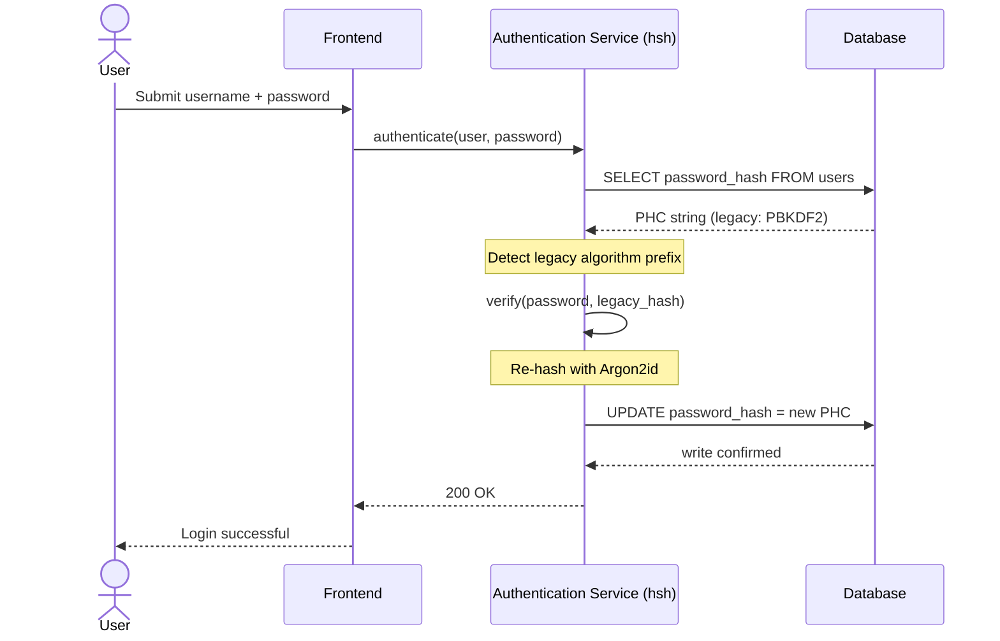
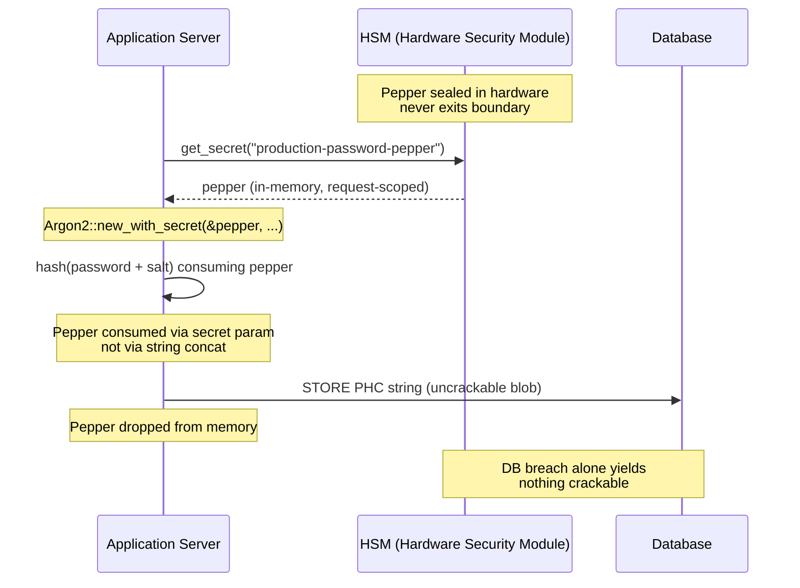

---
# Front Matter (YAML)
author: "contact@sebastienrousseau.com (Sebastien Rousseau)"
banner_alt: "Prim-plan al unui terminal de dezvoltator care derulează ieșirea compilatorului Rust — disciplina vizibilă a unui substrat criptografic sigur pentru memorie și auditabil, sub un parc de autentificare bancar de întreprindere"
banner_height: "1597"
banner_width: "2584"
banner: "https://cloudcdn.pro/stocks/images/rustlogs.webp"
cdn: "https://cloudcdn.pro"
charset: "UTF-8"
cname: "sebastienrousseau.com"
copyright: "© Copyright 2025 - 2026 - Sebastien Rousseau. All rights reserved."
date: "22 iunie 2026"
description: "hsh este un cadru criptografic pur Rust care permite băncilor de nivel 1 să migreze hash-urile de parolă moștenite la Argon2id fără timp de nefuncționare, integrând peppering HSM și eliminând vulnerabilitățile FFI bazate pe C."
format-detection: "telephone=no"
hreflang: "ro"
icon: "https://cloudcdn.pro/clients/sebastienrousseau/v1/logos/sebastienrousseau.svg"
id: "https://sebastienrousseau.com/2026-06-22-hsh-zero-downtime-cryptographic-stewardship-rust-banking-2026"
image_alt: "Portret alb-negru al lui Sebastien Rousseau"
image_height: "162"
image_width: "162"
image: "https://cloudcdn.pro/stocks/images/sebastien-rousseau.png"
keywords: "hsh, criptografie Rust, hashing de parole, Argon2id, securitate bancară, interblocare HSM, conformitate DORA, Basel III, migrare fără timp de nefuncționare, siguranță a memoriei, PBKDF2, scrypt, recuperare cibernetică"
language: "ro-RO"
last_reviewed: "2026-06-22"
layout: "report"
locale: "ro_RO"
logo_alt: "Logo pentru Sebastien Rousseau"
logo_height: "44"
logo_width: "44"
logo: "https://cloudcdn.pro/clients/sebastienrousseau/v1/logos/sebastienrousseau.svg"
measurementID: "G-169G4ET5HQ"
name: "Sebastien Rousseau"
permalink: "https://sebastienrousseau.com/2026-06-22-hsh-zero-downtime-cryptographic-stewardship-rust-banking-2026"
rating: "general"
referrer: "no-referrer"
robots: "index, follow"
schema: "FAQPage, Article"
seo_title: "hsh: administrare criptografică fără întreruperi în Rust pentru bănci"
short_name: "sebastienrousseau"
subtitle: "Cum un cadru criptografic pur Rust permite băncilor să actualizeze fără cusur parolele moștenite la Argon2id cu interblocări HSM — și ce înseamnă pentru conformitatea DORA și Basel III."
tags: "hsh, Rust, banking, criptografie, Argon2id, HSM, DORA, Basel-III, securitate, open-source, reziliență operațională"
theme-color: "0, 83, 191"
title: "Securizarea gestiunii parolelor în băncile de întreprindere: hashing multi-algoritm și actualizări cu hsh"
url: "https://sebastienrousseau.com/2026-06-22-hsh-zero-downtime-cryptographic-stewardship-rust-banking-2026"
viewport: "width=device-width, initial-scale=1, shrink-to-fit=no"

# RSS
atom_link: "https://sebastienrousseau.com/2026-06-22-hsh-zero-downtime-cryptographic-stewardship-rust-banking-2026/rss.xml"
category: "Technology"
generator: "Static Site Generator (SSG) (version 0.0.40)"
item_description: "hsh este un cadru criptografic pur Rust care permite băncilor de nivel 1 să migreze hash-urile de parolă moștenite la Argon2id fără timp de nefuncționare, integrând peppering HSM și eliminând vulnerabilitățile FFI bazate pe C."
item_pub_date: "Mon, 22 Jun 2026 07:07:07 +0000"
item_title: "Securizarea gestiunii parolelor în băncile de întreprindere: hashing multi-algoritm și actualizări cu hsh"
pub_date: "Mon, 22 Jun 2026 07:07:07 +0000"
type: "article"

# Twitter Card
twitter_card: "summary_large_image"
twitter_creator: "@wwdseb"
twitter_description: "hsh permite băncilor de nivel 1 să migreze hash-urile de parolă moștenite la Argon2id fără timp de nefuncționare, cu interblocări HSM și Rust sigur pentru memorie."
twitter_image: "https://cloudcdn.pro/clients/sebastienrousseau/v1/logos/sebastienrousseau.svg"
twitter_title: "hsh: administrare criptografică fără întreruperi în Rust"
twitter_url: "https://sebastienrousseau.com/2026-06-22-hsh-zero-downtime-cryptographic-stewardship-rust-banking-2026"

excerpt: "În era decriptării accelerate de GPU și a mandatelor DORA, putrezirea criptografică este un risc sistemic. Fiecare hash PBKDF2 sau scrypt moștenit care zace într-o bază de date bancară este o numărătoare inversă către compromis. hsh schimbă regulile jocului cu actualizări fără timp de nefuncționare, sigure pentru memorie..."

# Added by fix_hsh_frontmatter.py (template completeness)
apple_mobile_web_app_orientations: "portrait"
apple_touch_icon_sizes: "192x192"
apple-mobile-web-app-capable: "yes"
apple-mobile-web-app-status-bar-inset: "black"
apple-mobile-web-app-status-bar-style: "black-translucent"
apple-touch-fullscreen: "yes"
author_location: "London, United Kingdom"
author_twitter: "@wwdseb"
author_website: "https://sebastienrousseau.com"
docs: https://validator.w3.org/feed/docs/rss2.html
item_guid: "https://sebastienrousseau.com/2026-06-22-hsh-zero-downtime-cryptographic-stewardship-rust-banking-2026/rss.xml"
item_link: "https://sebastienrousseau.com/2026-06-22-hsh-zero-downtime-cryptographic-stewardship-rust-banking-2026/rss.xml"
last_build_date: "Mon, 22 Jun 2026 06:06:06 +0000"
managing_editor: "contact@sebastienrousseau.com (Sebastien Rousseau)"
menu: "active"
msapplication-navbutton-color: "0, 83, 191"
site_components: "Kaishi, Kaishi Builder, Kaishi CLI, Kaishi Templates, Kaishi Themes"
site_last_updated: "2023-07-05"
site_software: "Static Site Generator, Rust"
site_standards: "HTML5, CSS3, RSS, Atom, JSON, XML, YAML, Markdown, TOML"
ttl: "60"
twitter_site: "@wwdseb"
webmaster: "contact@sebastienrousseau.com"
apple-mobile-web-app-title: "hsh: Rust password hashing"
thanks: "Mulțumesc pentru lectură!"
twitter_image_alt: "Portret alb-negru al lui Sebastien Rousseau"
---

# Securizarea gestiunii parolelor în băncile de întreprindere: hashing multi-algoritm și actualizări cu hsh

<!-- lead-start: manual -->
<aside class="post-lead" aria-label="Rezumatul articolului">
<p class="post-lead-tldr"><strong>TL;DR.</strong> <a href="https://github.com/sebastienrousseau/hsh">hsh</a> este un cadru criptografic open-source, pur Rust, care permite băncilor de nivel 1 să migreze hash-urile de parolă moștenite la standarde moderne precum Argon2id fără întreruperea serviciului. Prin integrarea peppering-ului susținut de HSM și impunerea unei stricte siguranțe a memoriei fără wrappere FFI bazate pe C, închide vulnerabilitățile de putrezire criptografică ce amenință direct conformitatea DORA și Basel III.</p>
<p class="post-lead-heading"><strong>Concluzii principale</strong></p>
<ul class="post-lead-takeaways">
  <li><strong>Problema putrezirii criptografice.</strong> Algoritmi moșteniți precum PBKDF2 slăbesc exponențial pe măsură ce hardware-ul accelerează, extinzând suprafața de atac pentru campaniile de credential-stuffing și de brute-force offline.</li>
  <li><strong>Migrare fără timp de nefuncționare.</strong> Tiparul <code>verify_and_upgrade</code> recalculează hash-urile credențialelor utilizatorilor transparent în timpul evenimentelor standard de autentificare, eliminând riscul operațional al migrărilor în masă ale bazelor de date.</li>
  <li><strong>Interblocare hardware și peppering.</strong> Hash-urile sunt împachetate folosind Module Hardware de Securitate (HSM) sau arhitecturi KMS cloud, asigurând că o singură breșă a bazei de date nu produce parole candidate ce pot fi sparte.</li>
  <li><strong>Siguranța memoriei ca bază de reglementare.</strong> Rescris integral în Rust sigur și impus prin igienă strictă a dependențelor, hsh elimină riscurile de depășire de buffer și de lanț de aprovizionare inerente bibliotecilor criptografice moștenite scrise în C.</li>
</ul>
<p class="post-lead-related"><strong>Lecturi conexe:</strong> <a href="https://sebastienrousseau.com/2026-06-20-http-handle-zero-dependency-edge-ingress-banking-rust-2026">http-handle: ingres edge de înaltă performanță, zero dependențe, pentru bănci în 2026</a>, <a href="https://sebastienrousseau.com/2026-06-07-autonomous-treasury-index-programmable-liquidity-tokenised-deposits-2026/index.html">Indicele trezoreriei autonome în 2026</a>.</p>
</aside>
<!-- lead-end -->

> **Rezumat executiv.** Autentificarea bancară construită pentru un model de amenințare din 2018 nu mai este adecvată sub regimul de reglementare din 2026. Spargerea accelerată de GPU, densitatea ASIC și orizontul post-cuantic ce se apropie au prăbușit marja de siguranță a PBKDF2 și a scrypt-ului cu parametri timpurii; articolul 5 din DORA a transformat acea degradare într-o răspundere asumată la nivel de consiliu. hsh, un cadru open-source pur Rust, abordează problema pe trei straturi în paralel: un dispecer `verify_and_upgrade` care re-hash-uiește o credențială stocată la parametrii Argon2id curenți la fiecare autentificare reușită, fără fereastră de mentenanță; un strat de peppering interblocat cu HSM sau KMS, care face ca o singură breșă a bazei de date să nu producă nimic ce poate fi spart; și un lanț de aprovizionare sigur pentru memorie, care elimină suprafața de atac a interfeței cu funcții externe inerente bibliotecilor criptografice susținute de C. Rezultatul este un substrat care satisface DORA, disciplina de risc operațional din Basel III, responsabilitatea managerilor superiori din SM&CR și orizontul de migrare post-cuantică NIST IR 8547 — fără programul de resetare în masă necesar istoric pentru a actualiza un parc de autentificare.

Cea mai mare parte a autentificării bancare de întreprindere se sprijină încă pe un strat de parole călit pentru un model de amenințare din 2018. Hardware-ul care îl sparge a evoluat. Pe măsură ce fermele GPU se scalează și se apropie calculatoarele cuantice relevante criptografic (CRQC), hashing-ul moștenit — PBKDF2, scrypt timpuriu — se degradează cu fiecare oră de calcul pe care atacatorii o petrec în coada de spargere offline. Degradarea este tăcută: nimic din baza de date de producție nu îți spune că hash-ul puternic de ieri nu mai este la fel astăzi.

Conform [Regulamentului privind reziliența operațională digitală (DORA)](https://eur-lex.europa.eu/eli/reg/2022/2554/oj "Regulamentul (UE) 2022/2554 — Legea privind reziliența operațională digitală"), păstrarea în producție a activelor criptografice moștenite, nerotite, nu mai este datorie tehnică. Este răspundere de reglementare numită explicit.

[hsh](https://github.com/sebastienrousseau/hsh "hsh — cadru pur Rust pentru hashing de parole") închide decalajul. Un cadru pur Rust, gestionează mai multe formate de hash în paralel și actualizează credențialele slabe în mișcare în timpul sesiunilor active de autentificare. Infrastructura de autentificare se aliniază mandatelor de reziliență 2026 fără o fereastră de mentenanță, fără o resetare forțată, fără o singură secundă de timp de nefuncționare.

## 01. Problema putrezirii criptografice în bănci

Pentru a înțelege necesitatea unui cadru precum hsh, trebuie să înțelegem ciclul de viață al unui hash de parolă. Algoritmii nu îmbătrânesc cu grație; se degradează în raport cu hardware-ul disponibil pentru a-i sparge.

**Decalajul de accelerare ASIC/GPU.** Algoritmi precum PBKDF2 au fost proiectați să fie costisitori computațional pentru CPU. Astăzi, atacatorii folosesc GPU-uri puternic paralelizate pentru a executa atacuri de dicționar offline. Un hash moștenit generat în 2018 este mult mai slab împotriva unui adversar din 2026.

**Riscul migrării de tip „big bang".** Când un CISO decide să actualizeze de la PBKDF2 la un algoritm dur la memorie precum Argon2id, nu poate inversa hash-urile pentru a le re-cripta. Soluțiile tradiționale — forțarea resetărilor de parole pentru milioane de utilizatori — provoacă fricțiune masivă a clienților și risc operațional.

**Lanțul de aprovizionare al bibliotecilor C.** Istoric, middleware-ul bancar s-a bazat pe biblioteci precum `argonautica` sau pe binding-uri C brute pentru hashing. Aceste biblioteci poartă un risc ascuns de lanț de aprovizionare: o singură depășire de buffer de memorie în modulul de autentificare poate duce la execuție de cod la distanță (RCE) la cel mai privilegiat strat al stivei bancare.

### Comparație de algoritmi — rezistență hardware și suprafață de reglare

Cei trei algoritmi pe care o bancă îi întâlnește realist într-un corpus de migrare diferă mai puțin în alegerea primitivei criptografice și mai mult în modul în care îmbătrânesc sub presiunea hardware-ului. Tabelul de mai jos sintetizează postura practică.

| Algorithm | Memory-hard | GPU / ASIC resistance | Tuning surface | 2026 status |
| ---- | ---- | ---- | ---- | ---- |
| **PBKDF2** | No | Low — vectorises on GPU; sub-millisecond per guess on commodity hardware. | Iteration count only. | Legacy. Acceptable only as a verify-side fallback during migration. |
| **scrypt** | Yes (modest) | Medium — memory cost defeats simple GPU farms; ASIC-amortisable at scale. | `N` (CPU/memory), `r` (block size), `p` (parallelism). | Deprecated for greenfield. Active in migration corpora. |
| **Argon2id** | Yes (high) | High — memory- and time-hard; resists side-channel and TMTO attacks. | Memory cost (`m`), time cost (`t`), parallelism (`p`), secret (pepper). | Recommended default. OWASP, NIST SP 800-63B-4 draft, FedRAMP. |

Concluzia pentru planul de migrare este îngustă: PBKDF2 este o stare *de partea verificării*, nu o destinație *de partea scrierii*. Fiecare autentificare reușită pe o înregistrare PBKDF2 ar trebui să producă o înregistrare Argon2id la ieșire.

## 02. Lentila arhitecturală hsh 2026

Cadrul este structurat pe cinci straturi de bază, fiecare proiectat pentru a atenua o categorie specifică de risc operațional.

### Tabelul 1: straturile arhitecturale hsh și atenuarea riscului

| Strat | Decizie de proiectare | De ce contează | Risc dacă este gestionat greșit |
| ---- | ---- | ---- | ---- |
| **Primitive criptografice** | Format de șir PHC unificat care suportă Argon2id, scrypt și PBKDF2 | Oferă rezistență de cel mai înalt nivel la atacurile GPU păstrând compatibilitatea retrograd. | Silozuri de date; algoritmi slabi care permit peste 100 de miliarde de încercări/secundă offline. |
| **Motor de politici** | Dispatch `verify_and_upgrade` | Automatizează tranziția dinamică de la politicile moștenite la cele moderne la autentificare. | Putrezire de securitate; utilizatori activi care rămân pe tipuri de hash moștenite ușor de spart. |
| **Interblocare hardware** | Capabilități de „peppering" HSM și Cloud KMS | Asigură că o singură breșă a bazei de date nu expune parole candidate. | Atacuri brute-force offline reușite după o breșă prin injecție SQL. |
| **Igiena securității** | Impunere `deny.toml` și Rust pur | Blochează în întregime FFI nesigur și dependențele C externe nesigure. | Atacuri catastrofale asupra lanțului de aprovizionare și CVE-uri de corupție a memoriei. |

## 03. Calea de rehash fără timp de nefuncționare

Tiparul `verify_and_upgrade` rezolvă migrarea datelor printr-un sistem inteligent de dispatching conștient de stare care nu necesită timp de nefuncționare al bazei de date.

Când un utilizator își trimite credențialele, hsh citește șirul Password Hashing Competition (PHC) stocat. Dacă acesta conține un hash moștenit (de exemplu, o configurație PBKDF2 depășită), sistemul execută următorul flux:

1. **Identificare:** parsează algoritmul moștenit și parametrii săi specifici.
2. **Verificare:** validează parola candidată față de hash-ul moștenit.
3. **Actualizare în timp real:** la o potrivire reușită, ia parola candidată în text clar din memorie și calculează imediat un hash nou folosind politica Argon2id de înaltă securitate.
4. **Persistență:** returnează noul șir PHC către aplicația bancară, care suprascrie înregistrarea moștenită din baza de date.

Acest proces este complet transparent pentru utilizatorul final. Migrează efectiv cele mai active conturi la cel mai înalt nivel de securitate din prima zi, reducând dramatic suprafața de atac a băncii în mod organic, în timp.

Secvența de mai jos arată ce se întâmplă în timpul unui singur eveniment de autentificare atunci când înregistrarea stocată este pe un algoritm moștenit. Utilizatorul nu vede nicio schimbare; parcul de autentificare al băncii se consolidează cu o înregistrare.



### Tipar de implementare — dispatch `verify_and_upgrade`

Suprafața de integrare în interiorul unui serviciu de autentificare este mică. Calea de cod moștenită rămâne ca fallback; noua cale de cod este dispecerul.

```rust
use hsh::{Hasher, UpgradeResult};

struct UserRecord {
    username: String,
    password_hash: String, // PHC string
}

async fn authenticate(user: UserRecord, password_attempt: &str) -> Result<bool, AuthError> {
    let hasher = Hasher::new();
    match hasher.verify_and_upgrade(password_attempt, &user.password_hash) {
        Ok(UpgradeResult::Verified(is_valid)) => Ok(is_valid),
        Ok(UpgradeResult::Upgraded(new_hash)) => {
            db::update_user_hash(&user.username, new_hash).await?;
            Ok(true)
        }
        Err(_) => Err(AuthError::InvalidCredentials),
    }
}
```

Trei proprietăți contează:

- **Conștiență de stare.** `verify_and_upgrade` inspectează prefixul șirului PHC. Dacă marcatorul de algoritm este moștenit, cadrul declanșează automat re-hashing-ul împotriva politicii Argon2id configurate. Fără ramificări în codul apelant.
- **Atomicitate.** Re-hashing-ul se întâmplă doar după ce verificarea moștenită reușește, în interiorul aceluiași eveniment de autentificare. Nu există un job batch separat, nicio fereastră de migrare programată și nicio migrare în masă distructivă de derulat înapoi.
- **Persistență.** Varianta `UpgradeResult::Upgraded` poartă noul șir PHC. Aplicația îl persistă prin aceeași cale de date care există deja pentru înregistrarea moștenită — nicio suprafață de scriere paralelă, niciun protocol de scriere în două faze.

**Moduri de eșec.** Dacă scrierea în baza de date eșuează sau KMS-ul este temporar inaccesibil în timpul scrierii actualizării, sesiunea reușește totuși împotriva hash-ului moștenit, iar înregistrarea rămâne pe vechiul algoritm. Următoarea autentificare reușită reia actualizarea. Nu există stare migrată pe jumătate și niciun eșec vizibil utilizatorului — migrarea este monotonă între evenimentele de autentificare, iar costul per înregistrare al unei actualizări eșuate este exact o reluare suplimentară la următoarea autentificare.

## 04. Hash-uri „peppered" prin interblocare HSM / KMS

Hashing-ul standard al parolelor protejează împotriva scurgerilor directe ale bazei de date, dar dacă un atacator obține atât baza de date (hash-uri, cât și sare), poate executa spargere offline.

hsh introduce un strat robust de securitate „peppered". Prin integrarea cu Module Hardware de Securitate (HSM) sau cu servicii cloud-native de gestionare a cheilor (KMS), ieșirea Argon2id finală este împachetată criptografic cu o cheie de entropie ridicată care nu părăsește niciodată frontiera hardware sigură. Dacă baza de date a utilizatorilor este exfiltrată, atacatorul deține doar blob-uri criptate. Nu poate începe să spargă parole fără să spargă și infrastructura HSM izolată fizic a băncii.

Diagrama de arhitectură de mai jos urmărește calea secretului. Pepper-ul nu ajunge niciodată în baza de date; baza de date nu deține niciodată ceva exploatabil în sine. Cele două depozite pot eșua independent — sistemul își pierde confidențialitatea doar dacă ambele eșuează împreună.



### Tipar de implementare — Argon2id „peppered" susținut de HSM

Pepper-ul este obținut de la HSM în momentul cererii, nu dintr-un fișier de configurare. `Argon2::new_with_secret` îl consumă prin parametrul secret al algoritmului, nu prin concatenare de șiruri.

```rust
use argon2::{
    Argon2, Algorithm, Version, Params,
    PasswordHasher, PasswordVerifier,
    password_hash::{PasswordHash, SaltString, rand_core::OsRng},
};

async fn authenticate_with_hsm(
    user: UserRecord,
    password_attempt: &str,
) -> Result<bool, AuthError> {
    let pepper = hsm::client::get_secret("production-password-pepper").await?;
    let hasher = Argon2::new_with_secret(
        &pepper,
        Algorithm::Argon2id,
        Version::V0x13,
        Params::default(),
    )
    .map_err(|_| AuthError::Internal)?;

    let parsed = PasswordHash::new(&user.password_hash)
        .map_err(|_| AuthError::InvalidCredentials)?;
    if hasher.verify_password(password_attempt.as_bytes(), &parsed).is_ok() {
        if is_legacy_hash(&user.password_hash) {
            let new_hash = hasher
                .hash_password(
                    password_attempt.as_bytes(),
                    &SaltString::generate(&mut OsRng),
                )
                .map_err(|_| AuthError::Internal)?
                .to_string();
            db::update_user_hash(&user.username, new_hash).await?;
        }
        return Ok(true);
    }
    Err(AuthError::InvalidCredentials)
}
```

Din această formă decurg trei consecințe aliniate cu DORA:

- **Rotația cheii ca problemă de management al cheilor.** Pepper-ul trăiește în spatele frontierei HSM/KMS, nu în baza de date. Rotația devine o schimbare de management al cheilor, nu o campanie de re-hashing pe întregul parc de utilizatori. Hash-urile noi se leagă de versiunea curentă a pepper-ului; hash-urile vechi se verifică sub versiunea lor legată până când se actualizează în mod natural.
- **Separarea atribuțiilor.** Identitatea de serviciu care citește pepper-ul trebuie să fie auditabilă și cu privilegii minime. O exfiltrare completă a bazei de date fără grantul HSM corespunzător nu produce nimic ce poate fi spart. Un compromis al grantului HSM fără baza de date nu produce nimic adresabil. Raza de impact a oricăruia dintre eșecurile singulare este limitată.
- **Evitarea bug-urilor de extensie a lungimii și de concatenare.** Folosirea parametrului secret al Argon2 în locul concatenării de șiruri elimină o întreagă clasă de capcane criptografice — extensia lungimii, concatenarea UTF-8 greșit tipizată, bug-urile de ordonare a sării/pepper-ului — din suprafața de implementare.

## 05. Alinierea de reglementare: DORA, Basel III și SM&CR

- **DORA, articolele 5 și 6:** cer entităților financiare să mențină cadre de management al riscului ICT. O strategie care se bazează pe hash-uri de parolă vechi de un deceniu, nerotite, încalcă aceste principii. hsh oferă un mecanism documentat, automatizat, pentru a ridica continuu protecțiile criptografice.
- **Basel III:** leagă capitalul de reglementare de probabilitatea și severitatea evenimentelor de pierdere. Prin implementarea Argon2id cu interblocare HSM, severitatea unei breșe a bazei de date este redusă drastic, susținând argumente cuantificabile pentru o alocare de capital pentru risc operațional mai mică.
- **Responsabilitate SM&CR:** aprobarea unei arhitecturi care remediază activ putrezirea criptografică oferă managerilor superiori numiți un lanț verificabil, documentabil de reducere a riscului.

## Întrebări frecvente

**Este hsh pregătit pentru producție pe o cale de autentificare bancară de nivel 1?**
Biblioteca este open-source, documentată și exercită Argon2id prin același crate `argon2` care stă la baza ecosistemului RustCrypto de hashing de parole. Adopția la nivel 1 urmează propriul proces de due-diligence al băncii: revizuire independentă de cod, atestare de build reproductibil, fixarea arborelui de dependențe, testare de integrare cu furnizorul HSM și aprobare din partea Operational Risk. hsh oferă substratul; banca certifică implementarea.

**Cum evită `verify_and_upgrade` riscul migrării în masă?**
Verificatorul inspectează șirul PHC la parsare, rulează algoritmul moștenit pentru a valida parola și — dacă algoritmul stocat sau setul de parametri este sub nivelul actual minim — re-hash-uiește textul clar sub Argon2id cu pepper-ul HSM legat și scrie atomic înapoi noul șir PHC. Utilizatorul experimentează o autentificare normală. Parcul se consolidează cu o înregistrare per autentificare reușită. Fără campanie de resetare, fără fereastră de mentenanță, fără eveniment de risc operațional.

**Ce se întâmplă cu conturile dormante care nu se autentifică niciodată?**
Înregistrările care nu se autentifică niciodată nu se re-hash-uiesc niciodată. Băncile abordează acest lucru cu două politici complementare: un prag de dormanță documentat (adesea 18–24 de luni) după care contul este rotat administrativ printr-o campanie de resetare controlată și o rulare sintetică de re-hash în timpul mentenanței programate pentru conturile din cohorte definite (de valoare ridicată, de privilegiu ridicat, reglementate). Ambele sunt politici, nu comportamente ale bibliotecii; hsh înregistrează decizia de dispatch în telemetria de audit, astfel încât proprietarul operațional să poată dovedi acoperirea.

**Pepper-ul HSM introduce un punct unic de eșec pe calea de autentificare?**
Același HSM care semnează mesaje de plată și rotește chei susținute de KMS este pe cale. Riscul este identic cu postura existentă a băncii; hsh îl moștenește, nu îl introduce. Atenuările sunt standard: perechi HSM HA, regiuni KMS de rezervă activă, recuperare a pepper-ului la nivel de cerere cu circuit-breaker care comută într-un mod read-only și un runbook operațional explicit pentru indisponibilitatea HSM-ului. Pepper-ul este parametrul secret al `argon2`, consumat în proces și eliminat din memorie după utilizare.

**Unde se situează hsh în raport cu migrarea post-cuantică?**
hsh este un cadru de hashing de parole și secrete, nu o primitivă de încapsulare a cheilor sau de semnătură. Tranziția PQC documentată în [NIST IR 8547](https://csrc.nist.gov/pubs/ir/8547/ipd "Tranziția la standardele de criptografie post-cuantică") vizează stabilirea cheilor (ML-KEM, FIPS 203) și semnăturile (ML-DSA, FIPS 204; SLH-DSA, FIPS 205). Stratul de hashing pe care îl acoperă hsh este în mare măsură ortogonal față de acea migrare. Cele două converg la nivelul substratului — ambele vor un lanț de aprovizionare criptografic sigur pentru memorie, auditabil și cu build-uri reproductibile — ceea ce este exact postura pe care hsh o permite astăzi.

## Concluzie

Hashing-ul de parolă de tip „deploy-and-forget" s-a încheiat. DORA a mutat pasivitatea criptografică din datorie tehnică în răspundere de reglementare numită explicit, iar curba hardware devine mai abruptă în fiecare an. Contribuția hsh nu este un algoritm mai puternic — Argon2id este disponibil de ani de zile. Contribuția este mecanismul operațional pentru a migra la el fără a programa timp de nefuncționare, fără a forța resetări de utilizatori și fără a încredința căile de autentificare ale băncii unor shim-uri FFI bazate pe C.

[Codul sursă hsh](https://github.com/sebastienrousseau/hsh "hsh — cadru pur Rust pentru hashing de parole, licență duală MIT și Apache 2.0") este disponibil sub licență duală MIT și Apache 2.0.

## Referințe

Basel Committee on Banking Supervision (2011). *Basel III: A global regulatory framework for more resilient banks and banking systems*. Bank for International Settlements. Disponibil la: [https://www.bis.org/publ/bcbs189.pdf](https://www.bis.org/publ/bcbs189.pdf "Basel III: cadrul global de reglementare pentru bănci și sisteme bancare mai reziliente")

Biryukov, A., Dinu, D., Khovratovich, D., și Josefsson, S. (2021). *RFC 9106: Argon2 Memory-Hard Function for Password Hashing and Proof-of-Work Applications*. Internet Engineering Task Force. Disponibil la: [https://datatracker.ietf.org/doc/html/rfc9106](https://datatracker.ietf.org/doc/html/rfc9106 "RFC 9106 — Funcția Argon2 dură la memorie pentru hashing de parole")

Parlamentul European și Consiliul (2022). *Regulamentul (UE) 2022/2554 privind reziliența operațională digitală pentru sectorul financiar (DORA)*. Disponibil la: [https://eur-lex.europa.eu/eli/reg/2022/2554/oj](https://eur-lex.europa.eu/eli/reg/2022/2554/oj "Regulamentul (UE) 2022/2554 — DORA")

Financial Conduct Authority (2015). *Senior Managers and Certification Regime (SM&CR)*. Disponibil la: [https://www.fca.org.uk/firms/senior-managers-certification-regime](https://www.fca.org.uk/firms/senior-managers-certification-regime "Regimul managerilor superiori și de certificare")

National Institute of Standards and Technology (2024). *Initial Public Draft — Transition to Post-Quantum Cryptography Standards (NIST IR 8547)*. Disponibil la: [https://csrc.nist.gov/pubs/ir/8547/ipd](https://csrc.nist.gov/pubs/ir/8547/ipd "NIST IR 8547 — Tranziția la standardele de criptografie post-cuantică")

OWASP Foundation (2024). *Password Storage Cheat Sheet*. Disponibil la: [https://cheatsheetseries.owasp.org/cheatsheets/Password_Storage_Cheat_Sheet.html](https://cheatsheetseries.owasp.org/cheatsheets/Password_Storage_Cheat_Sheet.html "Ghid OWASP pentru stocarea parolelor")

<!-- enrich-start -->
<aside class="author-card" aria-label="Despre autor"><span class="author-card-body"><strong class="author-card-name"><a href="/about/index.html">Sebastien Rousseau</a></strong><span class="author-card-bio">Tehnolog bancar senior care scrie despre AI aplicat, migrarea ISO 20022, criptografie post-cuantică pentru servicii financiare și transformarea structurală a plăților en gros.</span><span class="author-credentials">Peste 20 de ani la HSBC Commercial & Investment Bank, PayPal, Barclays, Shazam. <a href="https://www.linkedin.com/in/sebastienrousseau/" rel="external noopener">LinkedIn</a> &middot; <a href="https://github.com/sebastienrousseau" rel="external noopener">GitHub</a></span></span></aside>
<p class="post-reviewed">Ultima revizuire <time datetime="2026-06-22">2026-06-22</time>.</p>
<!-- enrich-end -->
