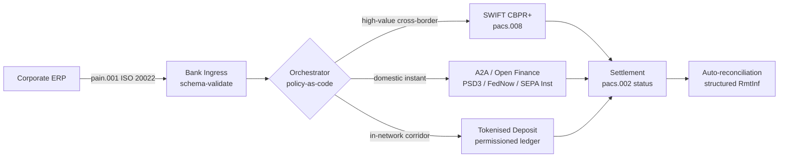

---

# Front Matter (YAML)

author: "contact@sebastienrousseau.com (Sebastien Rousseau)"
banner_alt: "Portcontainer într-un port de mare adâncime în zori — simbolizând circulația multi-șină, transfrontalieră a valorii corporative prin ISO 20022, finanțe deschise și rețele de decontare cu depozite tokenizate în 2026"
banner_height: "1597"
banner_width: "2584"
banner: "https://cloudcdn.pro/stocks/images/viktor-forgacs-KxVRDiFdTVo.webp"
cdn: "https://cloudcdn.pro"
charset: "UTF-8"
cname: "sebastienrousseau.com"
copyright: "© Copyright 2025 - 2026 - Sebastien Rousseau. All rights reserved."
date: "24 iunie 2026"
description: "Cum ISO 20022, A2A, finanțele deschise sub PSD3/FiDA și depozitele tokenizate remodelează trezoreria corporativă transfrontalieră alături de SWIFT în 2026."
format-detection: "telephone=no"
hreflang: "ro"
icon: "https://cloudcdn.pro/clients/sebastienrousseau/v1/logos/sebastienrousseau.svg"
id: "https://sebastienrousseau.com/2026-06-24-cross-border-iso-20022-open-finance-tokenised-deposits-treasury-2026"
image_alt: "Portret alb-negru al lui Sebastien Rousseau"
image_height: "162"
image_width: "162"
image: "https://cloudcdn.pro/stocks/images/sebastienrousseau.webp"
keywords: "plăți transfrontaliere, ISO 20022, finanțe deschise, PSD3, FiDA, depozite tokenizate, stablecoin, A2A, trezorerie, CIB, Nexi, Mastercard, multi-șină, pacs.008, pain.001, SWIFT, FedNow, SEPA Instant, RTP, CBPR+"
language: "ro-RO"
last_reviewed: "2026-06-24"
layout: "report"
locale: "ro_RO"
logo_alt: "Logo pentru Sebastien Rousseau"
logo_height: "44"
logo_width: "44"
logo: "https://cloudcdn.pro/clients/sebastienrousseau/v1/logos/sebastienrousseau.svg"
menu: ""
measurementID: "G-169G4ET5HQ"
name: "Sebastien Rousseau"
permalink: "https://sebastienrousseau.com/2026-06-24-cross-border-iso-20022-open-finance-tokenised-deposits-treasury-2026"
rating: "general"
referrer: "no-referrer"
robots: "index, follow"
schema: "FAQPage, Article"
seo_title: "Transfrontalier 2026: ISO 20022, finanțe deschise, șine tokenizate"
short_name: "sebastienrousseau"
subtitle: "Trezoreria corporativă transfrontalieră în 2026 funcționează pe o mecanică multi-șină — ISO 20022 ca gramatică comună, A2A și finanțele deschise ca șină orientată spre client, depozitele tokenizate ca etapă de decontare en gros, cu SWIFT încă ancorând coada lungă."
tags: "plăți transfrontaliere, ISO 20022, finanțe deschise, PSD3, FiDA, depozite tokenizate, A2A, trezorerie, CIB, multi-șină, pacs.008, pain.001, SWIFT, FedNow, SEPA Instant, RTP, CBPR+"
theme-color: "0, 83, 191"
title: "Transfrontalier 2026: ISO 20022, finanțe deschise și depozite tokenizate în trezoreria corporativă"
url: "https://sebastienrousseau.com/2026-06-24-cross-border-iso-20022-open-finance-tokenised-deposits-treasury-2026"
viewport: "width=device-width, initial-scale=1, shrink-to-fit=no"

# RSS - The RSS feed front matter (YAML).
atom_link: "https://sebastienrousseau.com/2026-06-24-cross-border-iso-20022-open-finance-tokenised-deposits-treasury-2026/rss.xml"
category: "Technology"
docs: https://validator.w3.org/feed/docs/rss2.html
generator: "Static Site Generator (SSG) (version 0.0.26)"
item_description: "Cum ISO 20022, A2A, finanțele deschise sub PSD3/FiDA și depozitele tokenizate remodelează trezoreria corporativă transfrontalieră alături de SWIFT în 2026."
item_guid: "https://sebastienrousseau.com/2026-06-24-cross-border-iso-20022-open-finance-tokenised-deposits-treasury-2026/rss.xml"
item_link: "https://sebastienrousseau.com/2026-06-24-cross-border-iso-20022-open-finance-tokenised-deposits-treasury-2026/rss.xml"
item_pub_date: "Wed, 24 Jun 2026 07:07:07 +0000"
item_title: "Transfrontalier 2026: ISO 20022, finanțe deschise și depozite tokenizate în trezoreria corporativă"
last_build_date: "Wed, 24 Jun 2026 06:06:06 +0000"
managing_editor: "contact@sebastienrousseau.com (Sebastien Rousseau)"
pub_date: "Wed, 24 Jun 2026 07:07:07 +0000"
ttl: "60"
type: "article"
webmaster: "contact@sebastienrousseau.com"

# Apple - The Apple front matter (YAML).
apple_mobile_web_app_orientations: "portrait"
apple_touch_icon_sizes: "192x192"
apple-mobile-web-app-capable: "yes"
apple-mobile-web-app-status-bar-inset: "black"
apple-mobile-web-app-status-bar-style: "black-translucent"
apple-mobile-web-app-title: "Transfrontalier 2026: ISO 20022, finanțe deschise, șine tokenizate"
apple-touch-fullscreen: "yes"

# MS Application - The MS Application front matter (YAML).

msapplication-navbutton-color: "0, 83, 191"

# Twitter Card - The Twitter Card front matter (YAML).

twitter_card: "summary_large_image"
twitter_creator: "@wwdseb"
twitter_description: "Cum ISO 20022, A2A, finanțele deschise sub PSD3/FiDA și depozitele tokenizate remodelează trezoreria corporativă transfrontalieră alături de SWIFT în 2026."
twitter_image: "https://cloudcdn.pro/clients/sebastienrousseau/v1/logos/sebastienrousseau.svg"
twitter_image_alt: "Logo al lui Sebastien Rousseau"
twitter_site: "@wwdseb"
twitter_title: "Transfrontalier 2026: ISO 20022, finanțe deschise, șine tokenizate"
twitter_url: "https://sebastienrousseau.com/2026-06-24-cross-border-iso-20022-open-finance-tokenised-deposits-treasury-2026"

excerpt: "Trezoreria corporativă transfrontalieră în 2026 este o problemă de inginerie multi-șină. ISO 20022 este gramatica comună, A2A și finanțele deschise sub PSD3/FiDA sunt șina orientată spre client, depozitele tokenizate gestionează etapa de decontare en gros, iar SWIFT încă ancorează coada lungă. Munca interesantă este în stratul de orchestrare, nu în model."

# Humans.txt - The Humans.txt front matter (YAML).
author_website: "https://sebastienrousseau.com"
author_twitter: "@wwdseb"
author_location: "London, UK"
thanks: "Mulțumim pentru lectură!"
site_last_updated: "2026-06-24"
site_standards: "HTML5, CSS3, RSS, Atom, JSON, XML, YAML, Markdown, TOML"
site_components: "Kaishi, Kaishi Builder, Kaishi CLI, Kaishi Templates, Kaishi Themes"
site_software: "Static Site Generator, Rust"

---

# Transfrontalier 2026: ISO 20022, finanțe deschise și depozite tokenizate în trezoreria corporativă

<!-- lead-start -->
<aside class="post-lead" aria-label="Rezumat articol">

<strong>TL;DR.</strong> Trezoreria corporativă transfrontalieră în 2026 funcționează pe patru șine în paralel — SWIFT CBPR+, A2A instant sub PSD3/FiDA, depozite tokenizate și șine de stablecoin — cusute împreună de ISO 20022 ca gramatică comună. Munca pentru echipele CIB și de trezorerie corporativă este orchestrarea, nu selecția șinei.

<strong>Concluzii principale</strong>

<ul class="post-lead-takeaways">
  <li><strong>Multi-șină este modul implicit.</strong> Nicio șină unică nu compensează fiecare coridor, fiecare dimensiune de bilet, fiecare termen-limită. Trezoreria alege șina per plată, nu per bancă.</li>
  <li><strong>ISO 20022 este lingua franca.</strong> pacs.008, pacs.009 și pain.001 transportă acum date de remitență prin RTGS, instant, A2A și șinele cu depozite tokenizate — făcând deciziile de rutare bazate pe date, nu blocate pe șină.</li>
  <li><strong>Finanțele deschise lărgesc perimetrul.</strong> PSD3 și FiDA împing modelul open-banking în pensii, asigurări și date de trezorerie; Nexi și Mastercard construiesc stratul de orchestrare pe care corporațiile îl consumă.</li>
  <li><strong>Depozitele tokenizate sunt etapa en gros.</strong> Depozitele tokenizate emise de bănci și șinele integrate de stablecoin se află sub șina instant orientată spre client și decontează etapa en gros aproape în T+0.</li>
</ul>

<strong>Lecturi conexe:</strong> <a href="https://sebastienrousseau.com/2026-06-07-autonomous-treasury-index-programmable-liquidity-tokenised-deposits-2026">Indicele trezoreriei autonome 2026: lichiditate programabilă și depozite tokenizate</a>, <a href="https://sebastienrousseau.com/2026-06-15-pacs008-automation-iso-20022-interbank-payments-2026">Automatizarea pacs.008: plăți interbancare ISO 20022 în 2026</a>.

</aside>
<!-- lead-end -->

> **Rezumat executiv.** Trezoreria corporativă transfrontalieră în 2026 este o problemă de inginerie multi-șină înainte de a fi o problemă de gestiune a relațiilor. PSD3 și regulamentul Financial Data Access (FiDA) lărgesc perimetrul open-banking-ului în datele de trezorerie corporativă; tranziția SWIFT MT/MX din noiembrie 2026 face din pacs.008 conform CBPR+ singurul format interbancar transfrontalier viabil; depozitele tokenizate și șinele de stablecoin reglementate gestionează etapa de decontare en gros aproape în T+0 în rețele cu permisiune. CIB-ul care câștigă în acest ciclu nu este cel care alege o singură șină; este cel care proiectează stratul de orchestrare care le leagă. Acest articol parcurge arhitectura cu patru șine (A2A sub PSD3, SWIFT CBPR+, depozite tokenizate emise de bănci, stablecoin-uri reglementate) — ce face bine fiecare șină, unde cad limitele de expunere de credit și ce trebuie să impună stratul de orchestrare policy-as-code deasupra lor, astfel încât corporația să vadă o singură plată, iar supervizorul să vadă un singur traseu auditabil.

O corporație industrială europeană plătește unui furnizor brazilian 4,2 milioane EUR într-o miercuri dimineața. Stația de lucru de trezorerie nu alege o bancă. Alege o șină — o secvență de șine. Instrucțiunea orientată spre client ajunge pe un mesaj A2A pain.001 rutat printr-un furnizor de finanțe deschise sub PSD3. Banca o transportă prin două jurisdicții corespondente pe depozite tokenizate într-o rețea privată CIB. Coada lungă — o curățare de factură USD 80.000 către un sub-furnizor fără relație de depozit tokenizat — încă circulă prin SWIFT CBPR+ ca pacs.008. Clientul vede o singură plată. Arhitectura vede patru șine. ISO 20022 este singurul motiv pentru care totul se ține împreună.

Acesta este modelul operațional pe care Mastercard îl descrie atunci când vorbește despre [evoluția de la open banking la open finance](https://www.mastercard.com/us/en/news-and-trends/Insights/2026/open-banking-to-open-finance-the-evolution-of-financial-data.html "Mastercard: open banking la open finance, evoluția datelor financiare") — date și plăți fuzionate într-un singur strat de orchestrare, cu șina aleasă de sistem, nu de client. Întrebarea interesantă pentru tehnologii bancari seniori nu este care șină câștigă. Este cum stratul de orchestrare este proiectat, guvernat și reconciliat.

## 01. De la carduri la A2A — schimbarea către finanțele deschise

Șinele de card nu dispar. Sunt reîncadrate.

Pe parcursul 2025 și până în 2026, [PSD3 și regulamentul Financial Data Access (FiDA)](https://www.consultancy.uk/news/42202/orchestrating-open-banking-for-platform-growth-2026-outlook "Consultancy.uk: orchestrating open banking for platform growth, 2026 outlook") au extins obligația open-banking dincolo de conturile de plată, în pensii, ipoteci, economii, asigurări și date de trezorerie corporativă. Implicația pentru trezoreria corporativă este directă: un manager de relație CIB poate consuma acum imaginea completă a lichidității unei corporații pe mai multe bănci printr-un singur contract API, la instrucțiunea corporației.

Doi operatori construiesc vizibil stratul de orchestrare pe care corporațiile îl vor consuma. Nexi și-a extins amprenta de acceptare către inițierea A2A prin SEPA Instant și coridoarele RTGS pan-europene, ISO 20022 nativ end-to-end. Platforma de finanțe deschise a Mastercard — ancorată pe achiziția Aiia și Finicity — furnizează stratul de agregare de date și consimțământ dedesubt, cu inițierea plății apărând prin același parc API care a servit anterior autorizările de card.

Schimbarea contează din trei motive:

1. **Economia unitară.** A2A inițiat sub PSD3 elimină interchange din plată. Pentru fluxurile B2B cu bilet mare, economia este materială; pentru fluxurile de consum cu bilet mic, stiva de costuri a comerciantului se prăbușește.
2. **Calitatea datelor.** A2A sub ISO 20022 transportă date de remitență structurate pe care cardurile nu le-au putut transporta niciodată. Ratele de auto-reconciliere peste 95 % sunt acum standard minim.
3. **Modelul de risc.** A2A este un transfer de credit, nu o autorizare de card. Suprafața de fraudă, modelul de chargeback și modelul de dispută sunt toate diferite. Echipele de trezorerie corporativă trebuie să înțeleagă că stratul de protecție a clientului este reconstruit, nu moștenit.

CIB-ul care vinde o propunere multi-șină în 2026 vinde orchestrare — nu acces. Accesul este acum reglementat.

## 02. ISO 20022 ca lingua franca între șine

Motivul pentru care multi-șina este realizabilă deloc este că formatul mesajului este acum consistent între șine.

Comitetul BIS pentru plăți și infrastructuri de piață (CPMI) a stabilit clar argumentul arhitectural în [cerințele sale de armonizare ISO 20022 pentru îmbunătățirea plăților transfrontaliere](https://www.bis.org/cpmi/publ/d230.pdf "BIS CPMI: cerințele de armonizare ISO 20022 pentru îmbunătățirea plăților transfrontaliere"). Tranziția din noiembrie 2025 la CBPR+ a închis era MT103 / MT202 pentru mesageria interbancară transfrontalieră. Din acel moment, fiecare șină majoră — SWIFT, FedNow, SEPA Instant, RTP și principalele sisteme de plată instantanee din Asia și America Latină — vorbește aceeași gramatică pacs.008 / pacs.009 / pain.001.

Consecința practică pentru trezoreria corporativă:

- **Rutarea este bazată pe date.** Stația de lucru de trezorerie poate citi un pain.001 o singură dată și poate decide șina per plată în funcție de coridor, dimensiunea biletului, termenul-limită și relația cu contrapartea — fără remapare a mesajului.
- **Datele de remitență supraviețuiesc transferului.** Câmpurile structurate de remitență (`<RmtInf><Strd>`) trec prin etapele corespondente fără trunchiere. Ratele de auto-reconciliere cresc deoarece datele nu mai sunt pierdute la limita șinei.
- **Screening-ul sancțiunilor devine auditabil.** Câmpurile structurate `<Dbtr>` / `<Cdtr>` / `<DbtrAgt>` / `<CdtrAgt>` cu referințe LEI înlocuiesc screening-ul de nume în text liber. Ratele de potrivire scad. Cozile de investigație se micșorează.

Diagrama de mai jos urmărește un singur pain.001 prin ingressul băncii, în orchestratorul policy-as-code și apoi spre șina pe care o cer coridorul și dimensiunea biletului — un mesaj, mai multe șine, fără remapare.

Costul acestei consistențe este disciplina de inginerie. ISO 20022 este permisiv. Două bănci pot fi pe deplin conforme CBPR+ și totuși să producă mesaje pacs.008 care diferă în utilizarea câmpurilor, setul de caractere și structura datelor de remitență. CIB-ul care câștigă la transfrontalier în 2026 impune un profil de mesaj mai strict decât cere standardul — și respinge la parsare, nu la decontare.

## 03. Depozite tokenizate și șine stabile

Etapa de decontare en gros este locul unde povestea șinei devine interesantă.

Imaginea pentru 2026, capturată bine în [analiza Trade Treasury Payments despre automatizare, șine de contingență, ISO 20022 și stablecoin-uri](https://tradetreasurypayments.com/articles/automation-contingency-rails-iso-20022-and-stablecoins-the-2026-trends-reshaping-corporate-finance-and-b2b-payments "Trade Treasury Payments: automation, contingency rails, ISO 20022 and stablecoins, the 2026 trends reshaping corporate finance and B2B payments"), împarte stratul de decontare en gros în două modele structural diferite.

**Depozite tokenizate emise de bănci.** O bancă comercială emite o obligație tokenizată pe un registru cu permisiune — JPM Coin, tokenul de depozit legat de Orion al HSBC, echivalentele majore ale CIB-urilor europene. Tokenul este o creanță directă asupra băncii emitente. Decontarea este aproape T+0 în interiorul rețelei. Conformitatea este responsabilitatea băncii emitente. Șina este complet reglementată, complet trasabilă și limitată la participanții pe care emitentul i-a integrat.

**Șine integrate de stablecoin.** Un stablecoin reglementat — pe deplin rezervat, auditat și care operează sub MiCA sau regimul regional echivalent — decontează un coridor unde depozitele tokenizate emise de bănci nu ajung încă. Tokenul este o creanță asupra rezervei, nu asupra unui bilanț bancar. Conformitatea este împărțită între emitent, on-ramp și off-ramp.

Cele două modele nu concurează. Sunt stivuite. Un produs CIB transfrontalier în 2026 utilizează de obicei depozite tokenizate emise de bănci pentru etapa în rețea și un stablecoin reglementat pentru coridorul unde se termină șina în rețea. Corporația vede o singură plată ISO 20022. Povestea de decontare dedesubt este multi-token.

Întrebarea la nivel de consiliu este aceeași pe care comitetele de risc operațional o pun de la primele piloturi de lichiditate programabilă: cine poartă expunerea de credit asupra tokenului și pentru cât timp? Depozitele tokenizate dau un răspuns curat — banca emitentă, până la ardere. Șinele integrate de stablecoin dau unul mai nuanțat — rezerva, sub rezerva ciclului de audit și a garanției de răscumpărare. O echipă de trezorerie care nu documentează răspunsul per șină per coridor poartă risc de credit nemăsurat în bilanț.

## 04. Stiva trezoreriei autonome

Deasupra stratului de șină se află stratul de orchestrare. Deasupra stratului de orchestrare se află stratul agentului.

Am expus arhitectura în detaliu în [Indicele trezoreriei autonome 2026: lichiditate programabilă și depozite tokenizate](https://sebastienrousseau.com/2026-06-07-autonomous-treasury-index-programmable-liquidity-tokenised-deposits-2026 "Sebastien Rousseau: Indicele trezoreriei autonome 2026"). Versiunea scurtă: trezoreria agentică în 2026 este stratul de orchestrare, exprimat ca politică-drept-cod, cu agenți delimitați executând în interiorul ei.

Stiva este:

1. **Strat de șină.** SWIFT CBPR+, A2A instant, depozite tokenizate, stablecoin-uri reglementate. Fiecare șină are un profil publicat, un tabel de termene-limită, o curbă de cost și un model de finalitate a decontării.
2. **Strat de orchestrare.** ISO 20022 la intrare, ISO 20022 la ieșire. Decizia de șină per plată în funcție de coridor, bilet, termen-limită, relația cu contrapartea și politică. Politica este versionată, semnată și auditabilă.
3. **Strat de agent.** Agenți de trezorerie delimitați execută politica de orchestrare cu limite de apel-instrument, jurnale de audit și comutatoare de oprire. Agentul nu alege șina. Politica alege șina. Agentul execută politica.
4. **Strat de reconciliere.** Mesajele ISO 20022 pacs.008 / pacs.002 / camt.054 se reconciliază față de instrucțiunea pain.001 originală, cu datele de remitență structurate închizând bucla fără intervenție manuală.

CIB-ul care vinde această stivă în 2026 vinde patru lucruri simultan — și le prețuiește separat. Corporația care o cumpără cumpără opționalitate între șine, cu un singur standard de mesaj, un singur strat de politică, un singur flux de reconciliere. Aceasta este schimbarea arhitecturală. Restul este detaliu de implementare.

## Întrebări frecvente

**„Finanțele deschise" sunt doar open banking rebranduit?**
Nu. Open banking sub PSD2 acoperea conturile de plată. PSD3 și regulamentul Financial Data Access (FiDA) extind obligația de partajare a datelor în pensii, ipoteci, economii, asigurări și date de trezorerie corporativă. Implicația pentru trezoreria corporativă este directă: un manager de relație CIB poate consuma acum imaginea completă a lichidității unei corporații pe mai multe bănci printr-un singur contract API, la instrucțiunea corporației, nu doar istoricul contului de plată.

**De ce este stratul de orchestrare focusul arhitectural, nu șina?**
Pentru că șinele se comoditizează acum. SWIFT CBPR+ pacs.008, A2A sub PSD3, depozitele tokenizate și stablecoin-urile reglementate transportă toate aceeași gramatică ISO 20022 la nivel de mesaj. Ceea ce diferențiază un CIB din 2026 este motorul policy-as-code care selectează șina per plată în funcție de coridor, dimensiunea biletului, cerința de finalitate a decontării și relația cu contrapartea — și care înregistrează alegerea în telemetria de audit pe care supervizorul o va cere. Fără acel motor, multi-șina este doar opționalitate fără guvernanță.

**Unde cade limita de expunere de credit pe o etapă de depozit tokenizat?**
Depozitele tokenizate emise de bănci pe un registru cu permisiune sunt o creanță directă asupra băncii emitente — expunerea de credit se termină la ardere. Șinele de stablecoin reglementate (supravegheate MiCA în UE, regimul din lucrarea de discuție a Bank of England în Marea Britanie, analogi în altă parte) sunt o creanță asupra rezervei, cu fereastra de expunere sub rezerva ciclului de audit și a termenilor garanției de răscumpărare. O echipă de trezorerie care nu documentează răspunsul per șină per coridor poartă risc de credit nemăsurat în bilanț.

**Ce se întâmplă cu SWIFT în această arhitectură?**
SWIFT nu dispare — ancorează coada lungă. Coridoarele unde depozitele tokenizate emise de bănci nu ajung încă (majoritatea relațiilor de sub-furnizor din piețele emergente, majoritatea fluxurilor transfrontaliere cu frecvență joasă / bilet mic) și coridoarele unde corporația sau banca cere traseul de audit de bancă corespondentă CBPR+ continuă pe SWIFT pacs.008. Arhitectura din 2026 este „SWIFT + șine noi", nu „șine noi în locul SWIFT".

**Ce cumpără corporația când cumpără această stivă?**
Opționalitate între șine, cu un singur standard de mesaj (ISO 20022), un singur strat de politică (motorul de orchestrare) și un singur flux de reconciliere (status pacs.002 + confirmare camt.054 + extrase structurate camt.053). Corporația nu plătește pentru patru conexiuni de șină separate. Plătește pentru stratul de orchestrare care face ca patru șine să se comporte ca una singură operațional — și pentru traseul de audit care îi permite să răspundă la „pe ce șină a circulat acea plată de 4,2 milioane EUR și de ce?" în dimineața după următoarea solicitare a supervizorului.

## Concluzie

Trezoreria corporativă transfrontalieră în 2026 este o problemă de inginerie multi-șină. ISO 20022 este gramatica care face multi-șina tractabilă. PSD3 și FiDA lărgesc perimetrul de date și forțează finanțele deschise în fluxul de lucru al trezoreriei corporative. Depozitele tokenizate și stablecoin-urile reglementate gestionează etapa de decontare en gros. SWIFT încă ancorează coada lungă.

CIB-ul care câștigă este cel care construiește stratul de orchestrare — nu cel care alege o singură șină și pariază franciza pe ea. Echipa de trezorerie corporativă care câștigă este cea care documentează expunerea de credit per șină per coridor, impune un profil ISO 20022 mai strict decât cere reglementatorul și tratează decizia de șină drept politică, nu o judecată per plată.

Munca interesantă este în stratul de orchestrare. Construiți-l cu grijă.

## Referințe

Bank for International Settlements, Committee on Payments and Market Infrastructures (2023). *Harmonised ISO 20022 data requirements for enhancing cross-border payments* (CPMI Papers No. 230). Disponibil la: [https://www.bis.org/cpmi/publ/d230.htm](https://www.bis.org/cpmi/publ/d230.htm "BIS CPMI 230 — Harmonised ISO 20022 data requirements")

Bank for International Settlements (2024). *Project Agorá: cross-border payments with tokenised commercial bank deposits and central bank money*. BIS Innovation Hub. Disponibil la: [https://www.bis.org/about/bisih/topics/fmis/agora.htm](https://www.bis.org/about/bisih/topics/fmis/agora.htm "BIS Project Agorá")

Bank of England (2023). *Regulatory regime for systemic payment systems using stablecoins and related service providers — Discussion Paper*. Disponibil la: [https://www.bankofengland.co.uk/paper/2023/dp/regulatory-regime-for-systemic-payment-systems-using-stablecoins-and-related-service-providers](https://www.bankofengland.co.uk/paper/2023/dp/regulatory-regime-for-systemic-payment-systems-using-stablecoins-and-related-service-providers "Bank of England — Regulatory regime for stablecoins discussion paper")

European Commission (2023). *Proposal for a Directive on payment services and electronic money services (PSD3)*. Disponibil la: [https://finance.ec.europa.eu/regulation-and-supervision/financial-services-legislation/implementing-and-delegated-acts/payment-services-directive_en](https://finance.ec.europa.eu/regulation-and-supervision/financial-services-legislation/implementing-and-delegated-acts/payment-services-directive_en "European Commission — Payment Services Directive proposal")

European Parliament and Council (2023). *Regulation (EU) 2023/1114 on markets in crypto-assets (MiCA)*. Disponibil la: [https://eur-lex.europa.eu/eli/reg/2023/1114/oj](https://eur-lex.europa.eu/eli/reg/2023/1114/oj "Regulation (EU) 2023/1114 — Markets in Crypto-Assets (MiCA)")

Financial Action Task Force (2023). *International standards on combating money laundering and the financing of terrorism — Recommendation 16 on wire transfers*. Disponibil la: [https://www.fatf-gafi.org/en/publications/Fatfrecommendations/Fatf-recommendations.html](https://www.fatf-gafi.org/en/publications/Fatfrecommendations/Fatf-recommendations.html "FATF Recommendations")

International Organization for Standardization (2020). *ISO 17442 Financial services — Legal entity identifier (LEI)*. Disponibil la: [https://www.gleif.org/en/about-lei/iso-17442-the-lei-code-structure](https://www.gleif.org/en/about-lei/iso-17442-the-lei-code-structure "ISO 17442 — Legal Entity Identifier")

SWIFT (2024). *Cross-Border Payments and Reporting Plus (CBPR+) usage guidelines*. Disponibil la: [https://www.swift.com/standards/iso-20022/iso-20022-programme](https://www.swift.com/standards/iso-20022/iso-20022-programme "SWIFT CBPR+ usage guidelines")

<!-- enrich-start -->
<aside class="author-card" aria-label="Despre autor"><strong class="author-card-name"><a href="/about/index.html">Sebastien Rousseau</a></strong>Tehnolog bancar senior care scrie despre AI aplicată, migrarea ISO 20022, criptografia post-cuantică pentru serviciile financiare și transformarea structurală a plăților en gros.Peste 20 de ani în HSBC Commercial &amp; Investment Bank, PayPal, Barclays, Shazam, AKQA, Virgin Group. <a href="/about/index.html">Profil complet</a> &middot; <a href="https://www.linkedin.com/in/sebastienrousseau/" rel="external noopener">LinkedIn</a> &middot; <a href="https://github.com/sebastienrousseau" rel="external noopener">GitHub</a></aside>

Ultima revizuire <time datetime="2026-06-24">2026-06-24</time>.

<!-- enrich-end -->
