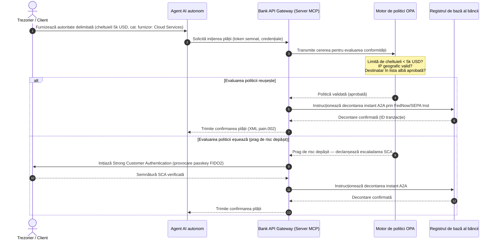

# Perspectiva plăților globale 2026: model operațional, risc și venituri într-o lume agentică, invizibilă și în timp real

Ciclul global de plăți 2026 este definit de trei forțe convergente — comerț agentic, plăți integrate invizibile și execuție în timp real — așezate peste un registru unificat tokenizat sub Project Agorá și o tranziție SWIFT fermă pentru adresa structurată în noiembrie 2026.

<!-- lead-start -->
<aside class="post-lead" aria-label="Rezumatul articolului">

<strong>Pe scurt.</strong> Peisajul plăților în 2026 a trecut de la migrația de mesagerie la un model operațional multidimensional în care riscul și veniturile sunt dictate de execuția în timp real. Această analiză sintetizează perspectivele 2026 ale J.P. Morgan, Global Payments, HSBC și Payments Association într-un plan operațional G-SIB cu patru piloni, acoperind comerțul agentic inițiat de model, API-urile de trezorerie always-on, registrele unificate tokenizate sub BIS Project Agorá și termenul SWIFT pentru adresa structurată de pe 14 noiembrie 2026.

<strong>Concluzii cheie</strong>

<ul class="post-lead-takeaways">
  <li><strong>Comerțul agentic deschide o frontieră a răspunderii delegate.</strong> Agenții AI autonomi sunt estimați să intermedieze 3-5 trilioane USD în comerț anual până în 2030. Băncile trebuie să definească gestionarea accesului MCP, delegarea SCA sub PSD3/PSR și proprietatea KYC/AML în lanțurile de plată cu mai mulți agenți.</li>
  <li><strong>Lichiditatea always-on este acum o linie de bază operațională și de reglementare.</strong> API-urile de trezorerie 24/7 și conturile virtuale reduc numerarul blocat și ridică ștacheta rezilienței. Sub DORA, produsele de lichiditate în timp real trebuie susținute de infrastructură geo-redundantă, activ-activ, care menține o disponibilitate de 99,999 %.</li>
  <li><strong>Tokenizarea a trecut la registre unificate reglementate.</strong> Project Agorá este cel mai amplu cadru public-privat pentru depozite tokenizate ale băncilor comerciale și rezerve ale băncilor centrale. Băncile au nevoie de un parcurs de tokenizare în cinci pași, cu un tratament prudențial explicit.</li>
  <li><strong>Tranziția adresei structurate de pe 14 noiembrie 2026 are dată fermă.</strong> Câmpurile de adresă poștală nestructurate din mesajele CBPR+ și SEPA vor declanșa respingeri imediate. Este necesară o guvernanță curată a datelor între echipele de produs, tehnologie și conformitate.</li>
</ul>

<strong>Lecturi conexe:</strong> <a href="https://sebastienrousseau.com/2026-06-23-iso-20022-pain001-programmable-liquidity-autonomic-treasury-2026">From Pain.001 to Programmable Liquidity: ISO 20022 as the Autonomic Nervous System of Treasury in 2026</a>, <a href="https://sebastienrousseau.com/2026-06-24-cross-border-iso-20022-open-finance-tokenised-deposits-treasury-2026">Cross-Border 2026: ISO 20022, Open Finance and Tokenised Deposits in Corporate Treasury</a>, <a href="https://sebastienrousseau.com/2026-06-25-quantum-dawn-cib-kyberlib-quantum-resilient-payments-stack-2026">Quantum Dawn for CIB: From KyberLib to a Quantum-Resilient Payments Stack</a>.

</aside>
<!-- lead-end -->

Pentru băncile globale de tranzacții, ciclul 2026-2028 este o fereastră structurală. Infrastructura modernă de plăți nu mai este un utilitar administrativ — este nucleul strategiei tehnologice de nivel bancar. În interiorul G-SIB-urilor și al instituțiilor regionale majore, tehnologia, reglementarea și așteptarea clienților au convers într-un singur plan operațional.

Trei forțe definesc acest ciclu, iar fiecare se mapează direct pe o preocupare de nivel executiv.

- **Comerț agentic** — distribuția canalelor, designul produsului, alocarea răspunderii și Model Risk Management sub supraveghere prudențială.
- **Plăți invizibile** — experiența clientului, cu risc de dezintermediere acolo unde băncile nu reușesc să integreze registrul în front-end-urile corporative și ale comercianților.
- **Execuție în timp real** — viteza capitalului, cu schimbări consecvente în managementul lichidității, riscul de credit, reziliența operațională și apărarea împotriva fraudei.

Mizele financiare sunt materiale. Frauda se scalează în viteză și sofisticare; termenele de reglementare sunt ferme; iar băncile care își modernizează proactiv sistemele de bază deblochează oportunități substanțiale de venituri din comisioane. Costul inacțiunii este opus: respingeri imediate de tranzacții, blocaje operaționale, penalizări de reglementare și erodare rapidă a cotei de piață.

## Convergența autorităților globale în plăți

Acest raport sintetizează perspectivele 2026 privind plățile și comerțul de la patru voci autorizate ale industriei — [J.P. Morgan Payments](https://www.jpmorgan.com/payments/newsroom/payments-outlook-2026-trends-report-released "J.P. Morgan Payments — Outlook 2026"), [Global Payments](https://investors.globalpayments.com/news-events/press-releases/detail/497/global-payments-releases-its-2026-commerce-and-payment "Global Payments — 2026 Commerce and Payment Trends Report"), HSBC și The Payments Association — și le triangulează cu [G20 Roadmap for Enhancing Cross-Border Payments](https://www.fsb.org/2026/03/fsb-kicks-off-new-implementation-phase-to-enhance-cross-border-payments-through-public-private-partnership/ "FSB — cross-border payments implementation phase, March 2026").

Fiecare organizație abordează ecosistemul dintr-un unghi de piață diferit, dar concluziile lor converg pe trei invarianți.

1. **Căile de plată instant, conduse de API, reprezintă linia de bază.** Modelele moștenite de procesare în loturi sunt marginalizate pentru fluxurile transfrontaliere și de valoare ridicată; viteza tranzacțiilor în aceste segmente este dictată de mesageria în timp real, always-on.
2. **AI este atât amenințare, cât și apărare.** Instrumentele generative și deepfake-urile scalează frauda tranzacțională, impunând contra-apărări multi-strat de învățare automată în timp real.
3. **Tokenizarea este o infrastructură gata de producție.** Registrele se unifică pentru a găzdui pasive comerciale tokenizate și monede digitale ale băncilor centrale en-gros.

| Raport | Public principal | Focus | Pilon-cheie | Implicație bancară |
| --- | --- | --- | --- | --- |
| **J.P. Morgan Payments** | Trezorieri corporativi, G-SIB-uri | Lichiditate în timp real, fraudă | API-uri, biometrie AI | Reconstruirea sistemelor de lichiditate, FX și risc pentru decontare continuă 365 de zile. |
| **Global Payments** | Comercianți, e-commerce | Evoluție POS, omnichannel | Comerț agentic, checkout fără frecare | Construirea de coridoare de plată sigure, accesate prin API, pentru agenți AI autonomi. |
| **HSBC Insights** | Corporații multinaționale | Integrări ERP (SAP/Oracle), numerar în timp real | Treasury-as-a-Service, vizibilitatea numerarului | Monetizarea suitelor tranzacționale API și integrarea raportării registrului de numerar în timp real la sursă. |
| **The Payments Association** | Fintech-uri, instituții de plată | Stablecoins, tokenizare, reglementare globală | Active digitale reglementate, conformitate cu politicile | Pregătirea bilanțurilor pentru depozite tokenizate și navigarea structurilor de răspundere PSD3/PSR. |

Cele patru perspective definesc efectiv stiva operațională a sectorului privat care rulează peste infrastructura politicilor publice G20, traducând intenția politicii în decizii concrete privind lichiditatea, tokenizarea, datele și controlul fraudei în interiorul băncilor.

## Pilonul 1 — Comerțul agentic și plățile invizibile

Comerțul agentic este tranziția de la checkout-ul click-to-buy condus de oameni la inițierea autonomă, condusă de model, a tranzacțiilor. Prognozele industriei converg pe 3-5 trilioane USD de comerț anual mediat de agenți autonomi până în 2030 — o cotă de o singură cifră din volumul global de plăți executată fără ca un om să apese „cumpără”.

Ecosistemul retail și comercial are un decalaj corespunzător. O majoritate clară a consumatorilor așteaptă acum plăți aproape fără frecare, dar mai puțin de jumătate dintre comercianți au prioritizat checkout-ul cu un singur clic sau cataloagele de produse accesibile prin API. Agenții AI nu pot naviga ecranele moștenite de checkout pe mai multe pagini, proiectate pentru ochii umani; au nevoie de handshake-uri API structurate, mașină-la-mașină.

### Prioritățile băncii și impactul operațional

- **Proprietatea KYC și AML.** Băncile trebuie să definească cine deține obligația de conformitate în lanțul tranzacțional agentic. Dacă agentul AI personal al unui consumator inițiază o tranzacție prin checkout-ul agentic al unui comerciant, banca trebuie să verifice că autoritatea delegată originatoare este legată criptografic de titularul principal al contului.
- **Reproiectarea răspunderii și a contestației.** Schemele de card și căile A2A au fost proiectate în jurul autorizării umane. Când un agent AI face o achiziție eronată — procurând stoc industrial incorect din cauza unei erori de parsare a datelor, de exemplu — băncile trebuie să aloce răspunderea clar între consumator, furnizorul agentului și comerciant.
- **Evaluarea riscului fluxurilor agentice.** Motoarele de routing al plăților trebuie să evalueze dinamic riscul plăților agentice, aplicând cerințe mai mari de rezervă sau rate de interschimb tranzacțiilor neinițiate de om până la stabilirea unui istoric stabil de decontare.

### Acțiune delimitată și autoritate delimitată

Pentru a atenua „acțiunea nelimitată” — un agent corporativ de aprovizionare care rulează o buclă infinită de achiziții recursive din cauza unei defecțiuni software — băncile trebuie să implementeze **porți API cu autoritate delimitată**. Porțile aplică limite la nivel de politică pe trei dimensiuni.

1. **Limite financiare ierarhizate** — cheltuielile agentului restricționate după dimensiunea tranzacției, valoarea zilnică cumulată și categoria comerciantului.
2. **Garanții conștiente de context** — semnalele secundare (ora din zi, geolocația IP, frecvența tranzacțiilor) evaluate înainte ca registrul să elibereze fondurile.
3. **Escaladare human-in-the-loop** — autorizare umană obligatorie declanșată prin Strong Customer Authentication (SCA) sub PSD3 / PSR ori de câte ori o tranzacție depășește pragurile de risc.

Secvența Mermaid de mai jos arată arhitectura țintă pe care multe bănci o vor recunoaște drept fluxul de plată agentic cu autoritate delimitată.

### Model Context Protocol (MCP)

Pentru a conecta modelele AI localizate la straturile de execuție guvernate de bancă, industria se standardizează în jurul [Model Context Protocol (MCP)](https://modelcontextprotocol.io "Model Context Protocol — open standard for LLM tool integration") — un protocol deschis care permite LLM-urilor să apeleze instrumente și API-uri clar delimitate și auditabile, fără acces brut la sistemele de bază.

Împachetarea API-urilor bancare (inițierea plăților, interogarea soldului, verificarea părții) într-un server MCP ține LLM-urile departe de tabelele bazei de date și controalele de root ale sistemului. Modelul interacționează cu registrul doar prin endpoint-uri structurate, auditate, cu rate limitate — securitate aplicată la limita execuției instrumentelor agentice, nu îngropată în interiorul modelului.

## Pilonul 2 — Transformarea trezoreriei și lichiditatea reimaginată

Viteza băncii de tranzacții în 2026 este setată de trecerea de la procesarea în loturi de la sfârșitul zilei la operațiunile de trezorerie always-on, în timp real. Corporațiile multinaționale nu mai tolerează numerarul blocat — lichiditate care stă inactivă în conturi locale peste weekenduri sau sărbători pentru că sistemele de decontare sunt închise.

### Cazul economic pentru lichiditate în timp real

J.P. Morgan și HSBC raportează amândouă că firmele corporative cu capacități avansate de numerar și date în timp real sunt material mai susceptibile să-și depășească concurenții pe creșterea veniturilor și eficiența capitalului, în principal prin reducerea lichidității blocate și optimizarea ciclurilor de capital de lucru.

Pentru a capta această valoare, băncile livrează **produse API Treasury-as-a-Service (TaaS)** care permit ERP-urilor corporative (SAP, Oracle) să se conecteze direct la registrul băncii.

- **API-uri de sold în timp real** folosind schema `camt.052` — înlocuind protocoalele de transfer de fișiere cu raportare instantanee, event-driven, a poziției de numerar.
- **API-uri de inițiere a plăților în masă** folosind `pain.001` — execuție directă, straight-through, a loturilor de plăți către furnizori din registrul ERP.
- **API-uri FX continui** — motoarele de trezorerie blochează rate de schimb valutar algoritmice, în timp real, pentru decontare transfrontalieră, eliminând riscul de gap de piață overnight.
- **API-uri de conturi virtuale** — corporațiile creează și retrag dinamic mii de subconturi pentru potrivirea automată a creanțelor și separarea registrului.

### Reziliența operațională și DORA

Oferirea de lichiditate always-on transformă profilul de risc al băncii. Platforma trebuie să mențină **99,999 % disponibilitate operațională** sub sarcină continuă, în timp real.

Sub [Digital Operational Resilience Act (DORA)](https://eur-lex.europa.eu/legal-content/EN/TXT/?uri=CELEX%3A32022R2554 "Regulation (EU) 2022/2554 — Digital Operational Resilience Act"), aceasta nu este un KPI IT — este o cerință de reglementare strictă. Autoritățile de reglementare așteaptă ca băncile să demonstreze că suprafața API a trezoreriei în timp real și baza de date a registrului pot absorbi atacuri cibernetice severe-dar-plauzibile, întreruperi de rețea și perturbări ale hyperscaler-elor fără a întrerupe plățile critice sau a compromite lichiditatea sistemică. Acest lucru necesită arhitecturi de baze de date multi-cloud geo-redundante, activ-activ, straturi de detectare a amenințărilor în timp real și failover automat — vizibile pe linia costurilor de schimbare, nu doar în dosarul de audit.

### FX continuu și inovație transfrontalieră

Trezoreria în timp real nu poate trăi într-o limită de o singură monedă. G-SIB-urile implementează infrastructură FX continuă — platforma [Wire 365](https://www.jpmorgan.com/insights/payments/fx-cross-border/wire-365-global-clearing "J.P. Morgan — Wire 365 global clearing reinvented") de la J.P. Morgan procesează plăți transfrontaliere și conversii FX în orice zi a anului, dincolo de orele tradiționale RTGS ale băncii centrale. Acest strat se interconectează direct cu sistemele de depozite tokenizate și registre unificate discutate în Pilonul 3.

## Pilonul 3 — Depozite tokenizate și registrul unificat

Tokenizarea a evoluat de la pilotări izolate de tip dovadă-de-concept la infrastructură monetară scalată, de nivel bancar. Focusul s-a mutat de la stablecoin-uri private și criptoactive speculative la **depozite tokenizate ale băncilor comerciale** și **monede digitale en-gros ale băncilor centrale (wCBDC)** care rulează pe registre unificate programabile.

Cadrul de referință este [Project Agorá](https://www.bis.org/about/bisih/topics/fmis/agora.htm "BIS Project Agorá — tokenisation of wholesale cross-border payments") — o colaborare publică-privată majoră convocată de BIS și IIF, implicând șapte bănci centrale și peste 40 de instituții financiare private. Proiectul explorează cum depozitele tokenizate ale băncilor comerciale se integrează cu wCBDC-urile tokenizate pe un registru programabil comun pentru a elimina frecarea decontării transfrontaliere, a coordona verificările de conformitate și a permite finalitate atomică 24/7.

### Parcursul de tokenizare în cinci pași

Pentru G-SIB-uri și băncile regionale majore, tokenizarea este un parcurs pas cu pas de la optimizarea internă la interoperabilitatea pieței deschise.

1. **Lichiditate internă de trezorerie** — tokenizarea soldurilor interne de numerar corporativ (de ex. JPM Coin sau registre bancare private echivalente) pentru a permite transfer transfrontalier instant, 24/7, și netting între sucursalele proprii ale băncii.
2. **Coridoare multi-bancare delimitate** — consorții închise, reglementate (sandbox-ul Project Agorá) pentru a testa decontarea interbancară și starea registrului partajat între instituții distincte.
3. **FX programabil continuu** — contractele inteligente pe registrul unificat execută FX Payment-versus-Payment (PvP) instant, eliminând riscul de decontare între fusurile orare.
4. **Active reale tokenizate (RWA)** — piciorul de numerar tokenizat se integrează cu registre tokenizate de valori mobiliare, datorii sau comerț pentru finalitate Delivery-versus-Payment (DvP) instant, reducând blocarea capitalului de la zile la milisecunde.
5. **Interoperabilitate publică/hibridă reglementată** — wrapperele gateway sigure permit lichidității instituționale să interacționeze în siguranță cu rețelele publice deschise.

### Implicații prudențiale și de bilanț

Numerarul tokenizat trebuie navigat cu atenție prin cadrele prudențiale. Autoritățile de supraveghere subliniază că un depozit tokenizat trebuie să fie echivalent economic cu un depozit tradițional al unei bănci comerciale — adică o datorie negarantată în bilanțul băncii cu aceeași acoperire de asigurare a depozitelor.

Operațional, depozitele tokenizate introduc riscuri pe care modelele clasice de stres al lichidității nu au fost construite să le simuleze. Contractele inteligente execută retrageri programabile la viteze și volume pe care presupunerile moștenite nu le captează. Sub Basel III, băncile trebuie să se asigure că motorul de risc poate modela retrageri programabile de numerar și că registrul tokenizat interoperează curat cu sistemele RTGS moștenite pe parcursul ciclului zilnic de lichiditate.

### Stablecoin-uri vs depozite tokenizate — o poziție nuanțată

Stablecoin-urile private complet rezervate (USDC etc.) continuă să capteze cotă de piață în remitențele transfrontaliere retail și comerțul descentralizat, dar le lipsește capacitatea de creare a creditului și finalitatea decontării a sistemului bancar comercial.

În loc să concureze pe căile retail, băncile de tranzacții stabilesc custodie, emit propriile instrumente de pasiv tokenizate reglementate și construiesc gateway-uri sigure on-/off-ramp. Clienții corporativi obțin flexibilitate de programare păstrând capitalul în perimetrul reglementat.

### Întrebări pe care un consiliu ar trebui să le pună despre banii tokenizați

- **Participarea la registrul unificat.** Care este foaia noastră de parcurs strategică activă pentru participarea la inițiative de registru unificat public-privat en-gros precum Project Agorá?
- **Bilanț și modelarea riscului.** Au actualizat motoarele noastre de risc și cadrele de adecvare a capitalului testarea la stres pentru a ține cont de viteza retragerilor de tokenuri declanșate de contracte inteligente?
- **Segmente de clienți pionieri.** Care dintre segmentele noastre de clienți de trezorerie corporativă și banking comercial ar beneficia imediat de decontare DvP/PvP programabilă, tokenizată?

## Pilonul 4 — Date structurate și apărare împotriva fraudei

Conformitatea infrastructurii în 2026 este dominată de **tranziția adresei structurate din 14 noiembrie 2026** stabilită sub [SWIFT Standards Release (SR) 2026](https://www.swift.com/standards/iso-20022/removal-unstructured-address "SWIFT — Removal of unstructured address, November 2026"). De la acea dată, rețelele de plăți CBPR+ și SEPA încetează să accepte blocuri de adresă poștală complet nestructurate, în text liber (`<AdrLine>`) în mesajele de plată. Orice mesaj transfrontalier sau intern care poartă o adresă nestructurată acolo unde sunt așteptate elemente structurate va fi întârziat sau respins de rețea.

Majoritatea instituțiilor cunosc data. Multe o tratează ca pe un exercițiu superficial de mapare la nivelul interfeței. Realitatea este o provocare mai profundă de calitate și guvernanță a datelor. Pentru a evita rate catastrofale de respingere, operațiunile de plăți au nevoie de un cadru clar de guvernanță inter-funcțional.

- **Produs și operațiuni.** Captarea datelor la sursă. Portalurile digitale orientate către client, interfețele de onboarding și câmpurile de intrare ERP corporativ trebuie să impună câmpuri de adresă structurate (`<StrtNm>`, `<PstCd>`, `<TwnNm>`, `<Ctry>`) la punctul de inițiere a plății.
- **Tehnologie.** Parsare, mapare, validare a schemei. Motoarele de validare blochează fișierele moștenite înainte de a ajunge la interfața SWIFT. Modelele de învățare automată implementate local parsează blocurile moștenite de adresă nestructurate în tag-uri compatibile XML sub `<PstlAdr>`.
- **Conformitate și risc.** Screening-ul sancțiunilor, monitorizarea tranzacțiilor și logica AML actualizate pentru a ingera câmpurile XML structurate — reducând ratele de fals-pozitiv și investigațiile manuale.

### Cazul de afaceri pentru date structurate

Tratat ca un cost de conformitate, programul de date structurate este scump. Tratat ca un facilitator de venituri, se plătește singur.

1. **Decizii avansate de creditare.** Datele structurate de factură, remitență și debitor final permit băncilor să construiască programe automate, precise de finanțare a capitalului de lucru și factoring de facturi în lanțul de aprovizionare pentru clienții corporativi.
2. **Potrivire automată a creanțelor.** Expunerea identificatorilor structurați ai părților și facturilor susține produsele premium de reconciliere a numerarului și pooling-ul de conturi virtuale, generând noi venituri din comisioane tranzacționale.
3. **Analize tranzacționale monetizabile.** Băncile împachetează și vând dashboard-uri granulare de analiză a lichidității în timp real și a tiparelor de cumpărare către CFO-urile și trezorierii corporativi.

### O apărare AI împotriva fraudei pe straturi

Pe măsură ce vitezele tranzacțiilor accelerează la timp real, tehnicile de fraudă s-au scalat. Cercetări recente indică faptul că deepfake-urile reprezintă aproximativ 40 % din încercările de fraudă biometrică, cu media sintetică folosită tot mai mult pentru a învinge controalele de recunoaștere vocală și facială în onboarding și fluxurile de plată.

Apărarea este un **model AI antifraudă pe trei straturi**.

1. **Strat de identitate.** Passkey-uri [FIDO2](https://fidoalliance.org/fido2/ "FIDO Alliance — FIDO2 specification") verificate biometric, legarea hardware semnată criptografic a dispozitivelor și portofele ID digitale descentralizate pentru securizarea accesului la plăți.
2. **Strat comportamental.** Biometrie comportamentală continuă — ritmul de navigare în sesiune, cadența de tastare, orientarea dispozitivului — pentru a detecta executarea automată a boților sau încercările de hijack al sesiunii.
3. **Strat tranzacțional.** Câmpurile structurate ISO 20022 alimentează motoare de risc de învățare automată în timp real, încrucișând metadatele tranzacțiilor cu inteligența de consorțiu la nivel de rețea pentru a identifica tranzacțiile suspecte în câteva milisecunde de la inițiere.

Pentru a satisface autoritățile de supraveghere, modelele AI ale stratului tranzacțional încorporează **parametri stricți de explicabilitate** și operează sub un program dedicat de Model Risk Management (MRM). Autoritățile de reglementare așteaptă ca băncile să explice punctele de date specifice și logica algoritmică care au declanșat un blocaj automat sau o alertă de fraudă, în conformitate cu [US Federal Reserve SR 11-7](https://www.federalreserve.gov/frrs/guidance/supervisory-guidance-on-model-risk-management.htm "US Federal Reserve — Supervisory Guidance on Model Risk Management, SR 11-7") și [PRA SS1/23](https://www.bankofengland.co.uk/prudential-regulation/publication/2023/may/model-risk-management-principles-for-banks-ss "Bank of England PRA SS1/23 — Model Risk Management principles for banks") al Bank of England.

## Agenda consiliului 2026-2028

Pentru a executa pe cei patru piloni, organele de conducere ale G-SIB-urilor și ale băncilor regionale ar trebui să organizeze investițiile operaționale și tehnologice de-a lungul unei foi de parcurs clare cu trei orizonturi.

### Orizontul 1 — Conformitate imediată și consolidarea nucleului (0-12 luni)

- **Focus.** Standardizarea calității datelor ISO 20022 și securizarea căilor de tranzacții în timp real de bază.
- **Indicator de succes (KPI).** Zero respingeri pentru adresă nestructurată pe SWIFT și SEPA după tranziția din 14 noiembrie 2026.
- **Proprietar executiv.** Chief Operating Officer / Șef Operațiuni de Plată.
- **Tip de livrabil.** Mișcare fără regrete. Actualizări ale schemei bazei de date principale și motorul de validare SWIFT SR 2026.

### Orizontul 2 — Automatizare și măsuri de protecție agentice (12-24 luni)

- **Focus.** Porți API agentice delimitate și arhitectură continuă de apărare împotriva fraudei.
- **Indicator de succes (KPI).** 100 % din tranzacțiile API mașină-la-mașină și inițiate de AI validate prin legarea hardware FIDO2 și motoare de politici cu autoritate delimitată.
- **Proprietar executiv.** Chief Information Officer / Chief Risk Officer.
- **Tip de livrabil.** Mișcare fără regrete (apărare împotriva fraudei) plus opțiune strategică (comerț agentic). Implementarea MCP și AI-ul antifraudă pe trei straturi.

### Orizontul 3 — Tokenizarea platformei și registre unificate (24-36 luni)

- **Focus.** Tranziția activelor de trezorerie la depozite tokenizate și participarea la registre transfrontaliere partajate.
- **Indicator de succes (KPI).** Cel puțin 15 % din volumul de decontare a trezoreriei corporative de valoare ridicată procesat nativ prin instrumente de depozit tokenizate sau aranjamente de registru unificat (de ex. coridoare Project Agorá).
- **Proprietar executiv.** Trezorier de Grup / Șef Banking de Tranzacții.
- **Tip de livrabil.** Opțiune strategică. Infrastructură de registru programabil, reguli de lichiditate prin contracte inteligente, adaptoare de decontare DvP/PvP.

## Întrebări frecvente

**Va atinge comerțul agentic într-adevăr 3-5 trilioane USD până în 2030?**
Baza McKinsey indică 5 trilioane USD în vânzări de comerț agentic până în 2030, cu o gamă de prognoze independente grupate între 3 trilioane și 5 trilioane USD. Variația reflectă cât de agresiv livrează comercianții API-uri de checkout citibile de mașini și cât de rapid permit băncile agenților să tranzacționeze sub delegarea SCA — blocajul este pe partea băncii și a comerciantului, nu pe partea capabilității agentului.

**Tranziția SWIFT din 14 noiembrie 2026 se aplică și fluxurilor SEPA interne?**
Da. Cerința adresei structurate se aplică CBPR+ transfrontalier și mesajelor de plată SEPA. Băncile care rulează ambele căi au nevoie de o schemă canonică unică de adresă în amonte de interfața SWIFT, nu de două mapări paralele.

**Este un depozit tokenizat la fel cu un stablecoin?**
Nu. Un depozit tokenizat este o datorie negarantată în bilanțul unei bănci reglementate, cu aceeași acoperire de asigurare a depozitelor ca un depozit tradițional. Un stablecoin este de obicei un instrument complet rezervat emis de o non-bancă, fără capacitate de creare a creditului. Designul Project Agorá presupune că depozitele tokenizate stau alături de wCBDC-uri pe un registru programabil comun; stablecoin-urile nu apar în piciorul decontării en-gros.

**Cum se raportează Project Agorá la pilotările wCBDC existente?**
Agorá este cadrul integrator. Experimentele wCBDC naționale acoperă piciorul de bani al băncii centrale; Agorá aduce depozitele comerciale tokenizate pe același registru programabil astfel încât decontarea transfrontalieră să fie atomică între ambele tipuri de bani. Cele șapte bănci centrale participante și peste 40 de instituții private fac din el cel mai amplu teren de proiectare public-privat pentru arhitectura monetară tokenizată en-gros.

**Care este poziția minimă de conformitate DORA pentru un API TaaS?**
Implementare activ-activ geo-redundantă, scenarii cibernetice severe-dar-plauzibile documentate cu proprietari numiți sub SM&CR (UK) și un failover testat care nu întrerupe plățile critice. Fără acestea, produsul TaaS este o răspundere de reglementare înainte de a fi o linie de venituri.

## Referințe

- Bank for International Settlements (BIS) Innovation Hub. (2026). *Project Agorá: exploring tokenisation of wholesale cross-border payments*. [BIS Project Agorá](https://www.bis.org/about/bisih/topics/fmis/agora.htm).
- Deutsche Bank. (2026). *Digital Money: a perspective on stablecoins, tokenised deposits and CBDCs*. [Deutsche Bank Flow](https://flow.db.com/publications/flow-white-papers-and-guides/digital-money-a-perspective-on-stablecoins-tokenised-deposits-and-cbdcs).
- European Parliament and Council. (2022). *Regulation (EU) 2022/2554 on Digital Operational Resilience (DORA)*. [DORA Regulation](https://eur-lex.europa.eu/legal-content/EN/TXT/?uri=CELEX%3A32022R2554).
- Financial Stability Board. (2026). *FSB kicks off new implementation phase to enhance cross-border payments*. [FSB statement](https://www.fsb.org/2026/03/fsb-kicks-off-new-implementation-phase-to-enhance-cross-border-payments-through-public-private-partnership/).
- Global Payments. (2025). *2026 Commerce and Payment Trends Report — press release*. [Global Payments press release](https://investors.globalpayments.com/news-events/press-releases/detail/497/global-payments-releases-its-2026-commerce-and-payment).
- J.P. Morgan Payments. (2026). *Payments Outlook 2026 Trends Report Released*. [J.P. Morgan Newsroom](https://www.jpmorgan.com/payments/newsroom/payments-outlook-2026-trends-report-released).
- J.P. Morgan Insights. (2026). *5 Payment Trends to Watch for in 2026*. [J.P. Morgan Trends](https://www.jpmorgan.com/insights/payments/trends-innovation/five-payment-trends-in-2026).
- J.P. Morgan FX & Cross-Border. (2026). *Wire 365: Global Clearing Reinvented*. [J.P. Morgan FX Wire 365](https://www.jpmorgan.com/insights/payments/fx-cross-border/wire-365-global-clearing).
- SWIFT. (2026). *ISO 20022 milestone for November 2026: unstructured addresses to be removed*. [SWIFT ISO 20022 Milestone](https://www.swift.com/news-events/news/iso-20022-milestone-november-2026-unstructured-addresses-be-removed).
- SWIFT Standards. (2026). *Removal of unstructured address*. [SWIFT Standards](https://www.swift.com/standards/iso-20022/removal-unstructured-address).
- Bank of England. (2023). *Supervisory Statement (SS1/23) — Model Risk Management principles for banks*. [Bank of England PRA SS1/23](https://www.bankofengland.co.uk/prudential-regulation/publication/2023/may/model-risk-management-principles-for-banks-ss).
- US Federal Reserve. (2011). *Supervisory Guidance on Model Risk Management (SR 11-7)*. [SR 11-7](https://www.federalreserve.gov/frrs/guidance/supervisory-guidance-on-model-risk-management.htm).
- McKinsey & Company. (2025). *McKinsey forecast: $5 trillion in agentic commerce sales by 2030* (via Digital Commerce 360). [McKinsey agentic forecast](https://www.digitalcommerce360.com/2025/10/20/mckinsey-forecast-5-trillion-agentic-commerce-sales-2030/).
- HSBC Business. (2026). *HSBC Business Insights*. [HSBC Insights](https://www.business.hsbc.com/en-gb/insights).
- Bright Defense. (2026). *Deepfake Statistics: A Growing Security Concern*. [Deepfake fraud statistics](https://www.brightdefense.com/resources/deepfake-statistics/).
- European Banking Authority. (2019). *Guidelines on outsourcing arrangements (EBA/GL/2019/02)*. [EBA Outsourcing Guidelines](https://www.eba.europa.eu/regulation-and-policy/internal-governance/guidelines-on-outsourcing-arrangements).

<!-- enrich-start -->
<aside class="author-card" aria-label="Despre autor"><strong class="author-card-name"><a href="/about/index.html">Sebastien Rousseau</a></strong>Tehnolog bancar senior care scrie despre AI aplicat, migrarea ISO 20022, criptografia post-cuantică pentru servicii financiare și transformarea structurală a plăților en-gros.Peste 20 de ani în HSBC Commercial &amp; Investment Bank, PayPal, Barclays, Shazam, AKQA, Virgin Group. <a href="/about/index.html">Profil complet</a> &middot; <a href="https://www.linkedin.com/in/sebastienrousseau/" rel="external noopener">LinkedIn</a> &middot; <a href="https://github.com/sebastienrousseau" rel="external noopener">GitHub</a></aside>

Ultima revizuire <time datetime="2026-06-25">2026-06-25</time>.

<!-- enrich-end -->
