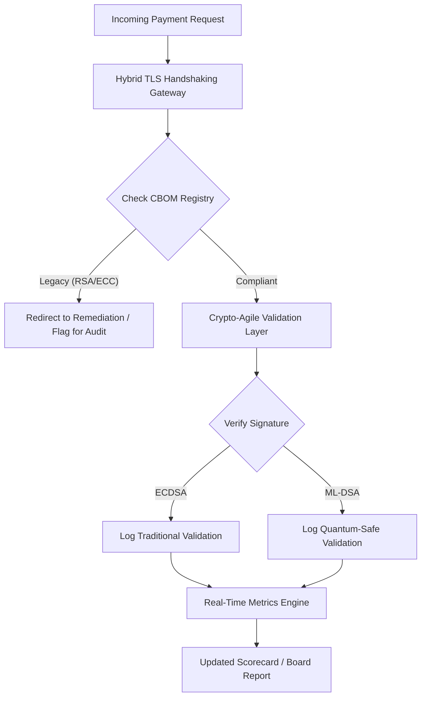

# Scorecard-ul de Securitate Post-Cuantică 2026: cadru de indicatori la nivel de consiliu pentru agilitate criptografică fiduciară

<aside class="post-lead" aria-label="Rezumatul articolului">

<strong>TL;DR.</strong> Din iunie 2026, criptografia post-cuantică (PQC) a trecut dintr-o preocupare tehnică experimentală într-o obligație fiduciară de prim ordin. Consiliile trebuie acum să supravegheze migrarea sistematică a criptării moștenite către standardele NIST FIPS 203 și 204, pentru a diminua riscurile financiare și operaționale sistemice sub DORA.

<strong>Concluzii cheie</strong>

<ul class="post-lead-takeaways">
  <li><strong>Aliniere G20 și termene ferme.</strong> Autoritățile de reglementare internaționale au stabilit sfârșitul deceniului 2020 drept termen ferm pentru tranzițiile rezistente la atacuri cuantice, cerând instituțiilor să demonstreze progrese cuantificabile ale migrării.</li>
  <li><strong>Cryptographic Bill of Materials (CBOM).</strong> Analog cu un BOM software, un CBOM este un inventar viu, automatizat, al tuturor activelor criptografice, necesar pentru a asigura vizibilitatea pe lanțul de aprovizionare.</li>
  <li><strong>Expunerea Harvest-Now-Decrypt-Later (HNDL).</strong> Adversarii interceptează și stochează deja date criptate cu valoare mare din plățile wholesale; diminuarea acestei amenințări impune desfășurarea imediată de arhitecturi PQC hibride.</li>
  <li><strong>Guvernanță fiduciară prin agilitate criptografică.</strong> Agilitatea criptografică este un indicator măsurabil de guvernanță. Capacitatea de a schimba primitivele criptografice fără reproiectarea sistemelor de bază (folosind biblioteci precum KyberLib) este acum o responsabilitate la nivel de consiliu sub SM&CR.</li>
</ul>

<strong>Lecturi conexe:</strong> <a href="https://sebastienrousseau.com/2026-06-12-kyberlib-post-quantum-banking-migration-standards-code-2026">KyberLib și migrarea bancară post-cuantică în 2026</a>, <a href="https://sebastienrousseau.com/2023-11-19-crystals-kyber-the-safeguarding-algorithm-in-a-quantum-age/index.html">CRYSTALS-Kyber: algoritmul de protecție într-o eră cuantică</a>.

</aside>
Securitatea post-cuantică nu mai este un proiect de cercetare. „Ceasul supravegherii” bate către termenele de aplicare de la sfârșitul deceniului 2020. Finalizarea [NIST FIPS 203 (ML-KEM)](https://csrc.nist.gov/pubs/fips/203/final) și [NIST FIPS 204 (ML-DSA)](https://csrc.nist.gov/pubs/fips/204/final) a codificat standardele pentru încapsularea cheilor și semnăturile digitale.

Organismele de reglementare așteaptă acum ca băncile de prim rang să treacă dincolo de programele-pilot. În 2026, accentul s-a mutat pe industrializarea acestor standarde. Eșecul de a demonstra o cale clară de migrare atrage penalități de reglementare semnificative sub [Digital Operational Resilience Act (DORA)](https://eur-lex.europa.eu/eli/reg/2022/2554/oj) și o posibilă răspundere personală pentru directorii care ignoră amenințarea previzibilă a decriptării asistate cuantic.

## 01. Scorecard-ul cuantic la nivel de consiliu

Următoarele metrici oferă consiliilor un cadru standardizat pentru a evalua pregătirea cuantică și starea criptografică în portofoliile Commercial and Investment Banking (CIB).

### Tabelul 1: metrici și toleranțe pentru scorecard-ul PQC

| Metrică | Formula matematică | Toleranțe aprobate de consiliu | Risc în afara toleranței |
| ---- | ---- | ---- | ---- |
| **Inventory Completeness Percentage (ICP)** | (Active criptografice identificate / Total active estimate) × 100 | > 98% | Criptare-fantomă și puncte oarbe pe căile de date de compensare cu valoare mare. |
| **HNDL Exposure Rate (HER)** | (Date cu durată lungă pe criptografie moștenită / Total date cu durată lungă) × 100 | < 5% | Compromiterea permanentă a secretelor comerciale, a registrelor de datorie suverană și a evidențelor de plăți wholesale. |
| **NIST Migration Progress Rate (MPR)** | (Sisteme care rulează FIPS 203/204 / Total sisteme critice) × 100 | > 60% (până la sfârșitul anului 2026) | Neconformitate de reglementare și excludere de la contrapărțile aliniate G20. |
| **Crypto-Agility Readiness Index (CARI)** | (Aplicații cu straturi criptografice abstractizate / Total aplicații de bază) × 100 | > 85% | Datorie tehnică severă și incapacitate de a răspunde la deprecieri viitoare de algoritmi. |

## 02. Cryptographic Bill of Materials (CBOM)

Metrica ICP este stabilită printr-o **fază cuprinzătoare de descoperire CBOM**. Acesta este un proces automatizat care identifică fiecare endpoint criptografic din întreprindere.

- **Descoperirea endpoint-urilor:** scanarea rețelelor interne și de cloud pentru sesiuni TLS active, pentru a identifica utilizările moștenite de RSA sau ECC.
- **Inventarul cheilor:** maparea perechilor de chei publice/private la proprietarii lor și înregistrarea datelor exacte de expirare.
- **Maparea dependențelor:** identificarea bibliotecilor și API-urilor terțe care se bazează pe algoritmi depreciați.

Această fază de descoperire creează o sursă unică de adevăr, permițând CISO să raporteze starea criptografică cu aceeași granularitate ca performanța financiară.

## 03. Eliminarea expunerii HNDL în plățile wholesale

Adversarii vizează activ plățile wholesale și bazele de date corporative cu durată lungă. Aceste atacuri „Harvest-Now-Decrypt-Later” (HNDL) implică interceptarea și arhivarea traficului criptat de astăzi.

Chiar dacă astăzi nu există un computer cuantic relevant criptografic (CRQC), datele interceptate acum vor fi vulnerabile în viitor. Diminuarea acestei amenințări impune migrarea prioritară a datelor cu durată lungă (de exemplu, evidențe de identitate, contracte de obligațiuni pe 30 de ani și arhive juridice), ceea ce reduce direct metrica HER. Trecerea canalelor de plată la criptare hibridă PQC-tradițională (folosind ML-KEM alături de X25519) oferă apărare imediată împotriva amenințărilor de arhivare.

## 04. Operaționalizarea agilității criptografice prin interfețe bine proiectate

Agilitatea criptografică se realizează prin abstractizări inginerești. Biblioteci moderne precum [KyberLib](https://sebastienrousseau.com/2026-06-12-kyberlib-post-quantum-banking-migration-standards-code-2026) demonstrează cum dezvoltatorii pot implementa module rezistente la atacuri cuantice fără să rescrie întreaga stivă de aplicații.

- **Wrappere abstractizate:** aplicațiile apelează o funcție generică `encrypt()` sau `sign()`, nu rutine specifice unui algoritm.
- **Schimbare la runtime:** modulul subiacent poate fi schimbat din ECDSA în ML-DSA prin modificări de configurare, nu prin desfășurări complexe de cod.

Această arhitectură garantează că, dacă un algoritm PQC anume este compromis în viitor, organizația poate pivota în ore, nu în ani.

## 05. Fluxul de validare a intrării rezistent la atacuri cuantice

Diagrama următoare ilustrează ciclul de viață al datelor care intră în perimetrul de securitate într-un mediu bancar cu agilitate cuantică.

## Concluzie

Patrimoniul criptografic al unei bănci de prim rang nu mai este o preocupare a CISO. Este infrastructură fiduciară. NIST FIPS 203 și 204 fixează algoritmii; Articolul 5 din DORA fixează suprafața de responsabilitate; SM&CR o atribuie unui manager superior nominalizat. Scorecard-ul de mai sus — Completitudinea Inventarului, Expunerea HNDL, Progresul Migrării, Agilitatea Criptografică — îi oferă consiliului cele patru cifre de care are nevoie pentru a guverna acest patrimoniu fără să citească codul criptografic.

Cifra care contează cel mai mult este expunerea HNDL. Fiecare evidență criptată cu algoritmi moșteniți, aflată astăzi într-o arhivă de plăți wholesale, va fi lizibilă în ziua în care va fi livrat primul computer cuantic relevant criptografic. Numărătoarea inversă este tăcută și asimetrică: apărătorii pot acționa doar asupra datelor pe care le dețin, adversarii pot acționa pe date pe care le-au exfiltrat deja cu ani în urmă. Un contract de obligațiuni corporative pe 30 de ani criptat cu RSA-2048 în 2024 este un contract care își pierde garanția de confidențialitate în ziua în care un CRQC intră în funcțiune.

[KyberLib](https://sebastienrousseau.com/2026-06-12-kyberlib-post-quantum-banking-migration-standards-code-2026) și colegele sale transformă această problemă dintr-o rescriere de platformă pe mai mulți ani într-o modificare de configurare. Sarcina consiliului nu este să scrie codul. Sarcina consiliului este să ceară ca Crypto-Agility Readiness Index — proporția aplicațiilor de bază aflate în spatele unei interfețe criptografice abstractizate — să treacă pragul de 85 % în douăsprezece luni și să citească scorecard-ul trimestrial.

<aside class="author-card" aria-label="Despre autor"><strong class="author-card-name"><a href="/about/index.html">Sebastien Rousseau</a></strong>Tehnolog bancar senior care scrie despre AI aplicată, migrarea ISO 20022, criptografia post-cuantică pentru servicii financiare și transformarea structurală a plăților wholesale.Peste 20 de ani la HSBC Commercial & Investment Bank, PayPal, Barclays, Shazam. <a href="https://www.linkedin.com/in/sebastienrousseau/" rel="external noopener">LinkedIn</a> &middot; <a href="https://github.com/sebastienrousseau" rel="external noopener">GitHub</a></aside>

Revizuit ultima dată <time datetime="2026-06-29">2026-06-29</time>.

