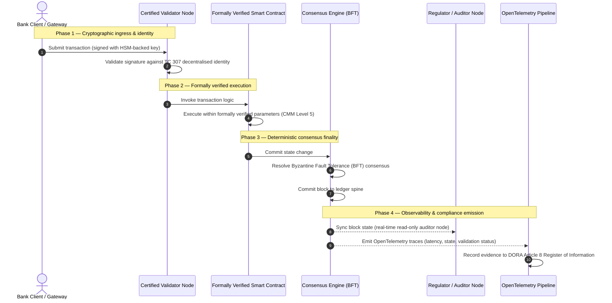

# De la dovadă la adevăr: de ce blockchain-urile certificate vor defini următoarea eră a încrederii bancare

## Rezumat strategic (esențialul)

Banca de gros și tranzacțiile globale se află, în 2026, într-un punct de inflexiune istoric. Pe măsură ce serviciile financiare migrează către rețele de compensare nativ digitale și în timp real, iar inteligența artificială introduce un nedeterminism probabilistic, modelele tradiționale de asigurare — analogice și retrospective (precum auditurile statice bazate pe entitate) — nu mai satisfac cerințele moderne de management al riscului și de responsabilitate fiduciară.

Comitetul Tehnic ISO/IEC TC 307 a stabilit o bază normalizată pentru tehnologiile registrului distribuit. Totuși, o adopție instituțională autentică necesită trecerea de la orientare descriptivă la o asigurare a blockchain-ului prescriptivă și certificabilă independent. Prin punctarea guvernanței registrului, a integrității consensului, a siguranței contractelor inteligente și a agilității criptografice față de un model riguros de maturitate a capacităților (CMM) pe cinci niveluri, băncile pot trece de la presupuneri fragmentare, specifice fiecărui furnizor, la un adevăr financiar certificabil și auditabil de către consiliu.

## Concluzii principale

* **Decalajul de fricțiune fiduciară**: astăzi știm să certificăm banca (Basel III), cloud-ul (ISO 27001) și sistemele de guvernanță a IA (ISO 42001), dar încă nu știm să certificăm registrul distribuit care determină tot mai mult ce este adevărat. Această asimetrie este o vulnerabilitate operațională majoră.  
* **DORA impune responsabilitate fiduciară directă**: în temeiul articolului 5 din DORA, consiliile de administrație ale băncilor poartă o răspundere personală directă și nedelegabilă pentru reziliența operațională a tuturor implementărilor terților și de registru, cu sancțiuni personale severe în cadrul regimului SM&CR pentru eșecuri.  
* **Coloana vertebrală de audit a IA**: acolo unde învățarea automată produce rezultate neproductibile și probabilistice, un blockchain certificat oferă o captură deterministă a stării. Înregistrarea on-chain a versiunilor de modele, a intrărilor și a deciziilor de validare satisface ISO 42001 și standardele de management al riscului de model.  
* **Indexul Blockchain-urilor Certificate**: acest index formalizează guvernanța, consensul, contractele inteligente și observabilitatea într-un tablou de bord verificabil și pregătit pentru audit, pe o scală CMM de la 0 la 5, traducând metrici inginerești în declarații de apetit pentru risc aprobate de consiliu.

## 01. Decalajul de fricțiune fiduciară în banca digitală

În banca clasică, încrederea este relațională, instituțională și retrospectivă. Ea depinde de auditori terți independenți care examinează starea financiară în momente fixe, reconciliind discrepanțele dintre silozurile de registre bilaterale. În piețele în timp real și orientate pe API din 2026, acest model introduce latențe prohibitive și riscuri structurale.

Când tranzacțiile se decontează instantaneu, rezervele de lichiditate intraday sunt gestionate dinamic de gateway-uri API, iar proprietatea activelor este tokenizată pe registre partajate, auditurile retrospective devin exerciții criminalistice în loc de controale preventive. Fiduciarii nu se mai pot limita la certificarea entității juridice. Trebuie să certifice însuși substratul digital.

În prezent, băncile operează sub o asimetrie arhitecturală flagrantă:

1. **Infrastructură cloud certificată**: nodurile hardware, containerele virtualizate și centrele de date fizice sunt validate față de controalele ISO/IEC 27001 și SOC 2 Type II.  
2. **Procese de management certificate**: politicile de risc operațional, planurile de continuitate a activității și implementările algoritmice sunt guvernate de cadre de risc stricte.  
3. **Motoare de registru necertificate**: mecanismele de consens distribuit, lanțurile de aprovizionare ale nodurilor validatoare, limitele contractelor inteligente și modelele de guvernanță a rețelei rămân la presupuneri necertificate, personalizate sau specifice consorțiului.

Această asimetrie este un punct critic de eșec. O bancă poate rula o aplicație validată într-un container cloud securizat și certificat ISO 27001, dar dacă acel container scrie într-un registru distribuit cu control centralizat al validatorilor, parametri de consens vulnerabili sau contracte inteligente neauditate, integritatea tranzacției este compromisă. Pentru a acoperi acest decalaj, motorul de registru însuși trebuie să devină un obiect de asigurare certificabil.

## 02. Baza de normalizare ISO/IEC TC 307

Munca fundamentală necesară pentru normalizarea registrelor distribuite este realizată de Comitetul Tehnic ISO/IEC TC 307 (Tehnologii blockchain și de registru distribuit). În loc să trateze blockchain-ul ca pe un protocol tehnic izolat, TC 307 îl abordează ca pe o infrastructură instituțională de încredere, organizându-și activitatea în jurul a cinci piloni fundamentali:

1. **Taxonomie și vocabular (ISO 22739)**: stabilește o nomenclatură comună, asigurând definiții juridice și operaționale coerente între jurisdicții, scheme financiare și instituții.  
2. **Arhitectură de referință (ISO/TR 23245)**: definește limitele, straturile, fluxurile de date și componentele funcționale ale unui sistem de registru distribuit conform.  
3. **Securitate, confidențialitate și contracte inteligente (ISO/TR 23244 / ISO 23613)**: stabilește orientări de securitate de bază pentru sistemele de active digitale și detaliază bunele practici de atenuare a vulnerabilităților contractelor inteligente și de guvernanță a ciclului lor de viață.  
4. **Cadre de interoperabilitate**: abordează mecanismele de schimb de date și active între rețele de registre eterogene, prevenind formarea de silozuri tokenizate izolate.  
5. **Identitate descentralizată și ancore de încredere**: integrează identificatorii criptografici bazați pe registru cu infrastructuri formale de chei publice (PKI) și registre autorizate de stat.

În ansamblu, TC 307 semnalează trecerea DLT de la o alegere inginerească personalizată la o disciplină arhitecturală normalizată. Totuși, TC 307 rămâne preponderent descriptiv. Definește cum arată excelența (orientare), dar nu oferă protocolul prescriptiv de verificare (asigurare) de care ofițerii de risc și supraveghetorii au nevoie pentru a autoriza implementările în producție ale funcțiilor critice sau importante (CIF).

## 03. Orientare versus asigurare: distincția fiduciară

Participanții la piețele financiare nu implementează tehnologia pentru că este inovatoare sau elegantă; o implementează când poate fi guvernată, auditată, apărată și reconciliată cu cerințele de rezervă de capital. De aceea normalizarea în bancă se rezolvă natural în două straturi:

* **Orientare (cadrul)**: schițează bunele practici, țintele de referință și liniile directoare arhitecturale (de ex. ISO/IEC TC 307, cadrele NIST).  
* **Asigurare (dovada)**: oferă dovezi independente, continue și verificabile de terți că un cadru este implementat și funcționează conform proiectării (de ex. certificare ISO 27001, audituri SOC 2, examinări de reglementare).

Bazarea pe un consens de registru necertificat în timp ce se certifică infrastructura cloud este o lacună de reglementare critică. Un blockchain „imuabil" nu este neapărat „de încredere instituțional". Imuabilitatea garantează doar că datele introduse rămân neschimbate; nu verifică dacă nodurile validatoare sunt sigure, dacă protocolul de consens este rezilient la coluziune, dacă logica contractelor inteligente este solidă matematic sau dacă gestionarea cheilor criptografice respectă mandatele post-cuantice.

Pentru a închide acest decalaj, Indexul Blockchain-urilor Certificate 2026 formalizează aceste cerințe într-un model cuantificabil de maturitate a capacităților (CMM), mapat pe reglementările bancare mondiale.

## 04. Indexul Blockchain-urilor Certificate 2026

Pentru a permite conducerii superioare să evalueze și să certifice platformele de registru, acest index structurează infrastructura de registru distribuit în cinci straturi operaționale auditabile, punctate pe o scală CMM de la 0 la 5.

## Tabelul 1: arhitectura Indexului Blockchain-urilor Certificate

| Strat al indexului | Nivel de maturitate (CMM) | Metrică tehnică și operațională | Referință de control de reglementare / fiduciar |
| ---- | ---- | ---- | ---- |
| **Guvernanța registrului** | **Nivel 0**: consorțiu ad-hoc**Nivel 3**: verificare și rotație automatizate ale validatorilor**Nivel 5**: ancorare descentralizată, multiparte a identității criptografice | % de noduri validatoare operate de entități financiare verificate; timpul mediu de soluționare a disputelor între validatori; distribuția geografică a nodurilor | **DORA articolul 5** (Guvernanță și organizare); **CPMI-IOSCO PFMI Principiul 2** (Guvernanță) și **Principiul 3** (Cadru pentru gestionarea integrală a riscurilor) |
| **Integritatea consensului** | **Nivel 0**: nod unic sau PoW opac**Nivel 3**: BFT auditat cu finalitate deterministă**Nivel 5**: consens multi-jurisdicțional, verificat formal, cu monitorizare continuă a latenței | latența maximă tolerabilă a consensului; pragul de rezistență la coluziune; SLA de disponibilitate la partiționarea simulată a nodurilor | **DORA articolul 6** (Cadru de gestionare a riscului TIC); **CPMI-IOSCO PFMI Principiul 8** (Finalitatea decontării) |
| **Identitate și criptografie** | **Nivel 0**: chei RSA / ECDSA slabe**Nivel 3**: multi-semnătură cu gestionare a cheilor susținută de HSM**Nivel 5**: chei hibride rezistente la cuantic (FIPS 203 ML-KEM) și porți de confidențialitate cu cunoștințe zero | % de tranzacții ale registrului semnate cu chei susținute de HSM; scorul de pregătire pentru migrarea PQC; latența dovezilor ZK | **NIST FIPS 203 / 204**; **ISO/IEC 27001** (Managementul securității informației) |
| **Asigurarea contractelor inteligente** | **Nivel 0**: scripturi Solidity neauditate**Nivel 3**: validare automatizată a compilatorului și audit extern**Nivel 5**: contracte inteligente imuabile și verificate formal, cu actualizări de tip întrerupător | % de contracte inteligente cu verificare formală matematică; numărul de avertismente ale compilatorului; acoperirea scanărilor de vulnerabilități | **Ghidurile EBA privind externalizarea** (paragrafele 81, 113-117); **DORA articolul 30** (Clauze contractuale minime) |
| **Audit și observabilitate** | **Nivel 0**: extragere manuală a jurnalelor**Nivel 3**: urme OTel structurate și noduri de auditor doar-citire**Nivel 5**: reconciliere automatizată și continuă cu registrul de la articolul 8 | % de tranzacții acoperite de urme OpenTelemetry; latența de la confirmarea blocului la sincronizarea nodului de auditor | **BCBS 239** (Agregarea datelor de risc); **DORA articolul 8** (Registrul de informații / scheme ITS) |

## Tabelul 2: semnale-cheie de încredere mapate pe standardele bancare mondiale

| Semnal / reper | Metrică | Impact asupra platformelor bancare | Sursă de reglementare |
| ---- | ---- | ---- | ---- |
| **Progresul ISO/IEC TC 307** | Trecerea de la rapoartele tehnice ISO/TR la scheme formale de certificare | Stabilește primul cadru normalizat pentru certificarea motoarelor de registru distribuit | **ISO/IEC JTC 1 / SC 44** (Tehnologii de registru distribuit) |
| **Faza de prototip a Proiectului Agorá** | Peste 40 de bănci comerciale participante; testarea unui registru unificat de depozite tokenizate | Mută compensarea transfrontalieră de la mesagerie (SWIFT) la decontarea atomică tokenizată | **Innovation Hub al Băncii Reglementelor Internaționale (BRI)** |
| **Auditul terților DORA articolul 30** | 100 % dintre furnizorii de noduri și gazdele de infrastructură auditați conform criteriilor de securitate | Elimină „nodurile validatoare din umbră"; impune transparența totală a lanțului de aprovizionare | **Autoritățile Europene de Supraveghere (AES)** |
| **ISO/IEC 42001 (guvernanța IA)** | Jurnale de modele și de antrenare a IA făcute imuabile criptografic on-chain | Utilizează blockchain-ul ca registru probatoriu imuabil („coloana vertebrală de audit") pentru învățarea automată | **ISO/IEC 42001:2023** (Tehnologia informației — Inteligență artificială) |
| **Adecvarea capitalului Basel III** | Reducerea tampoanelor de capital pentru risc operațional bazată pe reducerea documentată a complexității | Cadrele normalizate de risc operațional creditează direct reziliența verificată a registrului | **Comitetul de la Basel pentru Supraveghere Bancară (BCBS)** |

## 05. „Coloana vertebrală de audit" a IA: inteligență probabilistică pe infrastructură deterministă

Unul dintre cele mai puternice roluri strategice ale unui blockchain certificat în 2026 este acela de **„coloană vertebrală de audit"** pentru implementările de inteligență artificială. Sistemele financiare moderne sunt tot mai probabilistice. Scoringul de credit, detectarea fraudelor în timp real, tranzacționarea algoritmică și interacțiunile autonome cu clienții sunt conduse de modele de învățare automată care evoluează, derivează și se adaptează în timp. Aceste modele sunt nedeterministe: la aceeași intrare în două momente diferite, pot produce ieșiri diferite din cauza ponderilor dinamice și a antrenării continue.

Acest nedeterminism ridică o provocare profundă de guvernanță în temeiul **ISO/IEC 42001 (guvernanța IA)** și al standardelor de management al riscului de model (MRM) (precum **SR 11-7 a Rezervei Federale a SUA** și **SS1/23 a PRA din Marea Britanie**): *cum auditezi, explici și aperi decizii care nu sunt strict reproductibile?*

Un registru distribuit certificat oferă contraponderea deterministă. Acolo unde modelele de IA operează probabilistic, blockchain-ul certificat le înregistrează parametrii determinist, stabilind o coloană vertebrală probatorie inalterabilă:

* **Versionarea modelelor și ancorarea ponderilor**: fiecare versiune de model implementată, ponderile asociate și sumele de control ale datelor de antrenare sunt hash-uite și scrise în registru la momentul construirii, satisfăcând cerințele de lanț de aprovizionare **SLSA Level 3**.  
* **Jurnalizarea contextuală a intrărilor**: când un model de IA execută o decizie critică (de ex. aprobarea unui împrumut sau semnalarea unei tranzacții), intrările contextuale exacte și hash-urile modelului sunt scrise în registru, creând un istoric rezistent la manipulare.  
* **Auditabilitate fără acces la cod**: dacă un reglementator întreabă „de ce a respins modelul vostru această cerere de credit pe 3 iunie?", banca nu trebuie să-și expună codul proprietar și nici să încerce să recreeze starea exactă a modelului. Prezintă înregistrarea on-chain, semnată criptografic, a intrărilor, ponderilor și stării de validare.

Ancorând deciziile probabilistice ale modelelor de învățare automată la consensul determinist al unui blockchain certificat, instituția creează o cronologie a acțiunilor automatizate apărabilă, reconstruibilă și verificabilă independent.

## 06. Vizualizarea fluxului certificat de la consens la audit

Următoarea diagramă de secvență ilustrează ciclul de viață al unei tranzacții care traversează o platformă blockchain certificată, arătând cum porțile de validare, integritatea consensului, execuția contractelor inteligente și emisia de telemetrie se împletesc pentru a produce dovezi de reglementare pregatite pentru consiliu:

Calea critică a acestei secvențe tranzacționale impune ca fiecare pas de validare, execuție și consens să fie semnat criptografic, asigurând proveniența de la un capăt la altul. Nodul de auditor al reglementatorului sincronizează starea blocurilor în timp real, eliminând nevoia de reconciliere financiară manuală și retrospectivă.

## 07. Manualul consiliului pentru managerii superiori

Pentru a naviga cu succes tranziția de la încrederea organizațională la încrederea infrastructurală, directorii și managerii superiori ai băncilor ar trebui să execute imediat patru directive-cheie:

1. **Impunerea auditurilor de registru în managementul riscului de întreprindere (ERM)**: aplicarea unei politici conform căreia nicio platformă de registru distribuit — privată, publică sau de consorțiu — nu poate fi implementată pentru funcții critice sau importante (CIF) fără a fi fost auditată față de **arhitectura Indexului Blockchain-urilor Certificate** pe cinci straturi (minimum CMM Nivel 3).  
2. **Integrarea blockchain-urilor ca coloană vertebrală probatorie a IA ISO 42001**: însărcinarea directorului de risc și a arhitectului-șef de IA cu integrarea tuturor modelelor de învățare automată cu impact ridicat cu un blockchain certificat, creând un registru de audit rezistent la manipulare al versiunilor de modele, ponderilor, intrărilor și deciziilor.  
3. **Auditarea lanțului de aprovizionare al nodurilor validatoare (DORA articolul 30)**: solicitarea ca divizia de achiziții să auditeze toate entitățile terțe care găzduiesc noduri validatoare sau gestionează găzduirea cloud pentru rețele DLT, impunând aceleași standarde de securitate cibernetică și reziliență operațională aplicate nodurilor cloud interne ale băncii.  
4. **Alinierea arhitecturilor de registru la CPMI-IOSCO și BCBS 239**: însărcinarea echipei de inginerie a platformei cu alinierea telemetriei de ieșire a registrului direct la cerințele de raportare a datelor **BCBS 239** și asigurarea că parametrii de consens și de finalitate a decontării respectă strict **Principiile 8 și 9 CPMI-IOSCO**.

## 08. Întrebări frecvente

**Este ISO/IEC TC 307 un standard de certificare?**  
Nu. ISO/IEC TC 307 este un comitet tehnic care stabilește vocabular, arhitecturi de referință și orientări de securitate. Deși definește „cum arată excelența" (orientare), industria trebuie să operaționalizeze aceste documente în scheme de certificare formale și auditabile (asigurare) pentru a satisface supraveghetorii bancari.

**Cum susține un blockchain certificat conformitatea cu DORA?**  
În temeiul articolului 5 din DORA, consiliile băncilor poartă răspundere personală directă pentru reziliența tehnologică. Un blockchain certificat oferă dovezi criptografice și verificabile ale integrității consensului, controlului lanțului de aprovizionare al validatorilor și siguranței contractelor inteligente, oferind membrilor consiliului „pașii rezonabili" documentabili necesari pentru a se apăra împotriva pretențiilor de răspundere personală în cadrul SM&CR.

Care este diferența dintre un audit tradițional de registru și un audit de blockchain certificat?  
Un audit tradițional este retrospectiv: verifică înregistrări manuale și fișiere statice după ce tranzacțiile au fost decontate. Un audit de blockchain certificat este continuu și în timp real; nodurile validatoare, motorul de consens BFT și contractele inteligente verificate formal sunt certificate să execute tranzacțiile determinist, emițând telemetrie structurată (OpenTelemetry) care validează continuu starea de sănătate a sistemului.

Pot fi certificate blockchain-urile publice pentru uz bancar?  
În majoritatea jurisdicțiilor, blockchain-urile publice pur fără permisiune nu satisfac reglementările bancare din cauza lipsei verificării identității validatorilor, a costurilor de tranzacție imprevizibile și a finalității nedeterministe (de ex. bifurcări probabilistice proof-of-work/stake). Blockchain-urile certificate din bancă utilizează de obicei arhitecturi de întreprindere cu permisiune sau arhitecturi public-hibride puternic reglementate, în care operatorii nodurilor validatoare sunt entități financiare identificate și auditate.

## 09. Referințe

* Comitetul de la Basel pentru Supraveghere Bancară (BCBS), 2013. *Principles for effective risk data aggregation and reporting (BCBS 239)*. Basel: Banca Reglementelor Internaționale. Disponibil la: [https://www.bis.org/publ/bcbs239.pdf](https://www.bis.org/publ/bcbs239.pdf).  
* Committee on Payments and Market Infrastructures și Technical Committee of the International Organization of Securities Commissions (CPMI-IOSCO), 2012. *Principles for financial market infrastructures*. Basel: Banca Reglementelor Internaționale. Disponibil la: [https://www.bis.org/cpmi/publ/d101a.pdf](https://www.bis.org/cpmi/publ/d101a.pdf).  
* Autoritatea Bancară Europeană (ABE), 2019. *EBA/GL/2019/02 — Guidelines on outsourcing arrangements*. Paris: ABE. Disponibil la: [https://www.eba.europa.eu/regulation-and-policy/internal-governance/guidelines-on-outsourcing-arrangements](https://www.eba.europa.eu/regulation-and-policy/internal-governance/guidelines-on-outsourcing-arrangements).  
* Parlamentul European și Consiliul Uniunii Europene, 2022. *Regulamentul (UE) 2022/2554 privind reziliența operațională digitală a sectorului financiar (DORA)*. Bruxelles: Jurnalul Oficial al Uniunii Europene. Disponibil la: [https://eur-lex.europa.eu/legal-content/RO/TXT/?uri=CELEX%3A32022R2554](https://eur-lex.europa.eu/legal-content/RO/TXT/?uri=CELEX%3A32022R2554).  
* ISO/IEC JTC 1/SC 42, 2023. *ISO/IEC 42001:2023 — Information technology — Artificial intelligence — Management system*. Geneva: Organizația Internațională de Standardizare. Disponibil la: [https://www.iso.org/standard/81230.html](https://www.iso.org/standard/81230.html).  
* Comitetul Tehnic ISO/IEC 307, 2020. *ISO/IEC 22739:2020 — Blockchain and distributed ledger technologies — Vocabulary*. Geneva: Organizația Internațională de Standardizare. Disponibil la: [https://www.iso.org/standard/73771.html](https://www.iso.org/standard/73771.html).  
* National Institute of Standards and Technology (NIST), 2026. *First Three Finalized Post-Quantum Encryption Standards (FIPS 203, 204, and 205)*. Gaithersburg: U.S. Department of Commerce. Disponibil la: [https://www.nist.gov/news-events/news/2024/08/nist-releases-first-3-finalized-post-quantum-encryption-standards](https://www.nist.gov/news-events/news/2024/08/nist-releases-first-3-finalized-post-quantum-encryption-standards).
