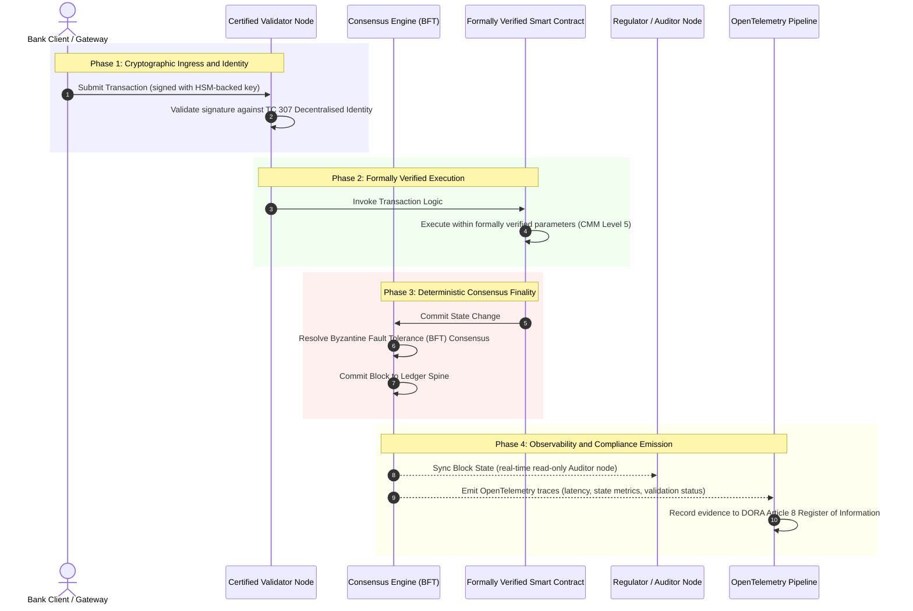

# De la dovezi la adevăr: de ce blockchain-urile certificate vor defini următoarea eră a încrederii bancare

**Imuabil nu înseamnă de încredere.** Pe măsură ce banking-ul en-gros trece la decontare în timp real și la IA probabilistică, registrul care decide ce este adevărat a devenit singurul strat pe care băncile încă nu îl pot certifica. Ele certifică entitatea sub Basel III, cloudul sub ISO 27001 și IA sub ISO 42001, dar registrul distribuit, guvernanța, consensul, criptografia și contractele inteligente ale acestuia rămân lăsate în seama presupunerilor specifice furnizorului. Acest raport susține că închiderea acelui gol fiduciar impune trecerea de la îndrumarea ISO/IEC TC 307 la o asigurare prescriptivă: evaluarea registrului față de un Index de Blockchain Certificat pe 5 niveluri care transformă metricile de inginerie în adevăr auditabil de consiliu și apărabil sub DORA.

<!-- lead-start -->
<aside class="post-lead" aria-label="Rezumatul articolului">

<strong>TL;DR.</strong> Băncile certifică entitatea, cloudul și IA, dar nu registrul care determină tot mai mult ce este adevărat. ISO/IEC TC 307 oferă îndrumare, nu asigurare. Un Index de Blockchain Certificat pe 5 niveluri evaluează guvernanța registrului, integritatea consensului, identitatea și criptografia, asigurarea contractelor inteligente și observabilitatea față de un model de maturitate a capabilității, închizând golul fiduciar și oferind IA probabilistice o coloană vertebrală de audit deterministă.

<strong>Concluzii esențiale</strong>

<ul class="post-lead-takeaways">
  <li><strong>Golul de fricțiune fiduciară.</strong> Banca (Basel III), cloudul (ISO 27001) și sistemul de guvernanță a IA (ISO 42001) pot fi certificate; registrul distribuit care decide ce este adevărat încă nu poate fi. Această asimetrie este o vulnerabilitate operațională activă.</li>
  <li><strong>DORA o face personală.</strong> Sub DORA Article 5, consiliile băncilor poartă o răspundere directă, ne-delegabilă pentru reziliența implementărilor terților și ale registrului, cu penalizări personale SM&amp;CR în caz de eșec.</li>
  <li><strong>Coloana vertebrală de audit a IA.</strong> Învățarea automată nu este reproductibilă; un blockchain certificat surprinde versiunile de model, intrările și deciziile de validare în mod determinist pe lanț, îndeplinind ISO 42001 și standardele de gestionare a riscului de model.</li>
  <li><strong>Indexul de Blockchain Certificat.</strong> Guvernanța, consensul, criptografia, contractele inteligente și observabilitatea devin o fișă de scor CMM de la 0 la 5 care traduce metricile de inginerie în Declarații de Apetit pentru Risc aprobate de consiliu.</li>
</ul>

<strong>Lecturi conexe:</strong> <a href="https://sebastienrousseau.com/2026-07-02-certified-blockchains-banking-trust-tc307-assurance-2026">Blockchain-uri certificate și încrederea bancară: asigurarea TC 307</a>, <a href="https://sebastienrousseau.com/2026-07-24-global-payments-outlook-operating-model-risk-revenue">Perspectiva globală a plăților în 2026</a>.

</aside>
<!-- lead-end -->

> **Rezumat executiv**
>
> - **Banking-ul en-gros se află la un punct de inflexiune.** Compensarea în timp real și IA probabilistică rup modelul de asigurare analogic și retrospectiv: auditurile statice, bazate pe entitate, nu mai satisfac cerințele moderne de gestionare a riscului sau cele fiduciare.
> - **TC 307 este o bază de referință, nu un certificat.** ISO/IEC TC 307 a standardizat vocabularul, arhitectura de referință și îndrumarea de securitate pentru registrele distribuite, dar este descriptiv. Definește cum arată binele; nu oferă verificarea prescriptivă de care ofițerii de risc și supraveghetorii au nevoie pentru a autoriza punerea în producție.
> - **Asigurarea înseamnă evaluarea registrului.** Guvernanța, integritatea consensului, siguranța contractelor inteligente și agilitatea criptografică, evaluate față de un model strict de maturitate a capabilității pe 5 niveluri, mută băncile de la presupuneri disparate, specifice furnizorului, la un adevăr financiar certificabil și auditabil de consiliu.
> - **Registrul este coloana vertebrală de audit pentru IA.** Ancorarea versiunilor de model, a intrărilor și a deciziilor de validare la un consens determinist oferă învățării automate nereproductibile o evidență probatorie apărabilă și reconstruibilă sub ISO 42001, SR 11-7 și PRA SS1/23.

## Golul de fricțiune fiduciară în banking-ul digital

În banking-ul clasic, încrederea este relațională, instituțională și retrospectivă. Ea depinde de auditori independenți, terți, care examinează starea financiară în puncte statice în timp, reconciliind discrepanțele între silozuri bilaterale de registre. Pe piețele din 2026, în timp real și conduse de API-uri, acest model introduce latențe prohibitive și riscuri structurale.

Când tranzacțiile se decontează instantaneu, rezervele de lichiditate intrazilnică sunt gestionate dinamic de gateway-uri API, iar proprietatea asupra activelor este tokenizată în registre partajate, auditurile retrospective devin exerciții criminalistice, nu controale preventive. Fiduciarii nu se mai pot baza doar pe certificarea entității corporative. Ei trebuie să certifice însuși substratul digital.

În prezent, băncile operează sub o asimetrie arhitecturală flagrantă:

1. **Infrastructură cloud certificată**: Nodurile hardware, containerele virtualizate și centrele de date fizice sunt validate față de controalele ISO/IEC 27001 și SOC 2 Type II.  
2. **Procese de management certificate**: Politicile de risc operațional, planurile de continuitate a activității și implementările algoritmice sunt guvernate sub cadre stricte de risc.  
3. **Motoare de registru necertificate**: Mecanismele de bază ale consensului distribuit, lanțurile de aprovizionare ale nodurilor validatoare, limitele contractelor inteligente și modelele de guvernanță a rețelei sunt lăsate în seama unor presupuneri necertificate, personalizate sau specifice consorțiului.

Această asimetrie este un punct major de eșec. O bancă poate rula o aplicație validată într-un container cloud securizat, certificat ISO 27001, dar dacă acel container scrie într-un registru distribuit cu control validator centralizat, parametri de consens vulnerabili sau contracte inteligente neauditate, integritatea tranzacției este compromisă. Pentru a acoperi acest gol, motorul de registru însuși trebuie să devină un obiect de asigurare certificabil.

## Baza de referință de standardizare ISO/IEC TC 307

Munca fundamentală necesară pentru a standardiza registrele distribuite este stabilită de Comitetul Tehnic ISO/IEC 307 (TC 307\) (Blockchain și tehnologiile registrului distribuit). În loc să trateze blockchain-ul ca pe un protocol tehnic izolat, TC 307 îl abordează ca pe o infrastructură instituțională de încredere, organizându-și munca pe cinci piloni de bază:

1. **Taxonomie și vocabular (ISO 22739\)**: Stabilește o nomenclatură comună, asigurând definiții juridice și operaționale consecvente între diferite jurisdicții, scheme financiare și instituții.  
2. **Arhitectură de referință (ISO/TR 23245\)**: Definește limitele, straturile, fluxurile de date și componentele funcționale ale unui sistem de registru distribuit conform.  
3. **Securitate, confidențialitate și contracte inteligente (ISO/TR 23244 / ISO 23613\)**: Stabilește îndrumări de securitate de bază pentru sistemele de active digitale și detaliază bunele practici pentru atenuarea vulnerabilităților contractelor inteligente și guvernanța ciclului de viață.  
4. **Cadre de interoperabilitate**: Abordează mecanismele de schimb de date și de active între rețele de registre eterogene, prevenind formarea de silozuri tokenizate izolate.  
5. **Identitate descentralizată și ancore de încredere**: Integrează identificatori criptografici bazați pe registru cu infrastructuri formale de chei publice (PKI) și registre autorizate de stat.

În ansamblu, TC 307 semnalează tranziția DLT de la o alegere de inginerie personalizată la o disciplină arhitecturală standardizată. Totuși, TC 307 rămâne în principal descriptiv. Definește cum arată binele (îndrumare), dar nu oferă protocolul de verificare prescriptiv (asigurare) de care ofițerii de risc și supraveghetorii au nevoie pentru a autoriza punerea în producție a funcțiilor critice sau importante (CIFs).

## Îndrumare vs. asigurare: distincția fiduciară

Participanții la piața financiară nu implementează tehnologie pentru că este inovatoare sau elegantă; o implementează atunci când poate fi guvernată, auditată, apărată și reconciliată cu cerințele de rezervă de capital. De aceea, standardizarea în banking se rezolvă în mod natural în două straturi:

* **Îndrumare (cadrul)**: Prezintă bunele practici, țintele de referință și liniile directoare arhitecturale (de exemplu, ISO/IEC TC 307, cadrele NIST).  
* **Asigurare (dovada)**: Oferă dovezi independente, continue și verificabile de către terți că un cadru este implementat și funcționează conform proiectării (de exemplu, certificarea ISO 27001, auditurile SOC 2, examinările de reglementare).

A te baza pe un consens de registru necertificat în timp ce certifici infrastructura cloud este un gol critic de reglementare. Un blockchain care este „imuabil” nu este neapărat „de încredere instituțională”. Imuabilitatea garantează doar că datele introduse rămân neschimbate; nu verifică dacă nodurile validatoare sunt securizate, dacă protocolul de consens este rezilient la coluziune, dacă logica contractului inteligent este solidă din punct de vedere matematic sau dacă gestionarea cheilor criptografice respectă mandatele post-cuantice.

Pentru a închide acest gol, Indexul de Blockchain Certificat 2026 formalizează aceste cerințe într-un model de maturitate a capabilității (CMM) cuantificabil, corelat cu reglementările bancare globale.

## Indexul de Blockchain Certificat 2026

Pentru a permite conducerii superioare să evalueze și să certifice platformele lor de registru, acest index structurează infrastructura registrului distribuit în cinci straturi operaționale auditabile, evaluate pe o scală CMM de la 0 la 5.

### Tabelul 1: Arhitectura Indexului de Blockchain Certificat

| Strat al indexului | Nivel de maturitate a capabilității (CMM) | Metrică tehnică și operațională | Referință de control de reglementare / fiduciar |
| ---- | ---- | ---- | ---- |
| **Guvernanța registrului** | **Nivelul 0**: Consorțiu ad-hoc**Nivelul 3**: Verificare și rotație automatizată a validatorilor**Nivelul 5**: Ancorare de identitate criptografică descentralizată, cu părți multiple | % din nodurile validatoare operate de entități financiare verificate; timpul mediu de soluționare a disputelor între validatori; distribuția geografică a nodurilor | **DORA Article 5** (Guvernanță și organizare); **CPMI-IOSCO PFMI Principle 2** (Guvernanță) & **Principle 3** (Cadru pentru gestionarea cuprinzătoare a riscurilor) |
| **Integritatea consensului** | **Nivelul 0**: Nod unic sau POW opac**Nivelul 3**: BFT auditat cu finalitate deterministă**Nivelul 5**: Consens multi-jurisdicțional, verificat formal, cu monitorizare continuă a latenței | Latența maximă tolerabilă a consensului; pragul de rezistență la coluziune; SLA de disponibilitate sub partiție simulată a nodurilor | **DORA Article 6** (Cadrul de gestionare a riscului TIC); **CPMI-IOSCO PFMI Principle 8** (Finalitatea decontării) |
| **Identitate și criptografie** | **Nivelul 0**: Chei RSA / ECDSA slabe**Nivelul 3**: Multi-sig cu gestionare a cheilor susținută de HSM**Nivelul 5**: Chei hibride rezistente cuantic (FIPS 203 ML-KEM) și porți de confidențialitate cu cunoaștere zero | % din tranzacțiile de registru semnate cu chei susținute de HSM; scorul de pregătire pentru migrarea PQC; latența dovezilor ZK | **NIST FIPS 203 / 204**; **ISO/IEC 27001** (Gestionarea securității informației) |
| **Asigurarea contractelor inteligente** | **Nivelul 0**: Scripturi solidity neauditate**Nivelul 3**: Validare automatizată a compilatorului & audit extern**Nivelul 5**: Contracte inteligente verificate formal, imuabile, cu actualizări de tip întrerupător de circuit | % din contractele inteligente cu verificare formală matematică; numărul avertismentelor de compilator; acoperirea scanării de vulnerabilități | **EBA Guidelines on Outsourcing Arrangements** (Paragrafele 81, 113-117); **DORA Article 30** (Clauze contractuale minime) |
| **Audit și observabilitate** | **Nivelul 0**: Extragere manuală a jurnalelor**Nivelul 3**: Urme OTel structurate & noduri de auditor doar-citire**Nivelul 5**: Reconciliere automatizată, continuă, cu registrul din Article 8 | % din tranzacțiile acoperite de urme OpenTelemetry; latența de la înregistrarea blocului în registru până la sincronizarea nodului de auditor | **BCBS 239** (Agregarea datelor de risc); **DORA Article 8** (Registrul de informații / Scheme ITS) |

### Tabelul 2: Semnale-cheie de încredere corelate cu standardele bancare globale

| Semnal / reper | Metrică | Impact asupra platformelor bancare | Sursă de reglementare |
| ---- | ---- | ---- | ---- |
| **Progresul ISO/IEC TC 307** | Tranziția de la rapoartele tehnice ISO/TR la scheme formale de certificare | Stabilește primul cadru standardizat pentru certificarea motoarelor de registru distribuit | **ISO/IEC JTC 1 / SC 44** (Tehnologiile registrului distribuit) |
| **Faza de prototip a Proiectului Agorá** | 40+ bănci comerciale participante; testarea registrului unificat pentru depozitele tokenizate | Mută compensarea transfrontalieră de la mesagerie (SWIFT) la decontare tokenizată atomică | **Bank for International Settlements (BIS) Innovation Hub** |
| **Auditul terților sub DORA Article 30** | 100% dintre furnizorii de noduri și gazdele de infrastructură auditate față de criterii de securitate | Elimină „nodurile validatoare din umbră”; impune transparență totală a lanțului de aprovizionare | **European Supervisory Authorities (ESA)** |
| **ISO/IEC 42001 (Guvernanța IA)** | Modelul de IA și jurnalele de antrenare făcute imuabile criptografic pe lanț | Folosește blockchain-ul ca registru probatoriu imuabil („coloana vertebrală de audit”) pentru învățarea automată | **ISO/IEC 42001:2023** (Tehnologia informației, Inteligență artificială) |
| **Adecvarea capitalului sub Basel III** | Reducerea rezervelor de capital pentru risc operațional pe baza reducerii documentate a complexității | Cadrele standardizate de risc operațional creditează direct reziliența verificată a registrului | **Basel Committee on Banking Supervision (BCBS)** |

## „Coloana vertebrală de audit” a IA: inteligență probabilistică pe infrastructură deterministă

Unul dintre cele mai puternice roluri strategice ale unui blockchain certificat în 2026 este acela de a acționa ca o **„coloană vertebrală de audit”** pentru implementările de inteligență artificială. Sistemele financiare moderne sunt tot mai probabilistice. Scoringul de credit, detectarea fraudelor în timp real, tranzacționarea algoritmică și interacțiunile autonome cu clienții sunt conduse de modele de învățare automată care evoluează, derivă și se adaptează în timp. Aceste modele nu sunt deterministe: dat fiind același input în două momente diferite, pot produce ieșiri diferite din cauza ponderilor dinamice și a antrenării continue.

Acest non-determinism introduce o provocare profundă de guvernanță sub **ISO/IEC 42001 (Guvernanța IA)** și standardele de **gestionare a riscului de model (MRM)** (precum **US Federal Reserve SR 11-7** și **UK PRA SS1/23**): *Cum auditezi, explici și aperi decizii care nu sunt strict reproductibile?*

Un registru distribuit certificat oferă contragreutatea deterministă. În timp ce modelele de IA operează probabilistic, blockchain-ul certificat le înregistrează parametrii în mod determinist, stabilind o coloană probatorie inalterabilă:

* **Versionarea modelelor și ancorarea ponderilor**: Fiecare versiune de model implementată, ponderile asociate acesteia și sumele de control ale datelor sale de antrenare sunt hash-uite și scrise în registru la momentul construirii, îndeplinind cerințele de lanț de aprovizionare **SLSA Level 3**.  
* **Jurnalizarea contextuală a intrărilor**: Când un model de IA execută o decizie critică (de exemplu, aprobarea unui împrumut sau semnalarea unei tranzacții), intrările contextuale exacte și hash-urile modelului sunt scrise în registru, creând un istoric care evidențiază orice modificare.  
* **Auditabilitate fără acces la cod**: Dacă un reglementator întreabă „De ce a respins modelul dumneavoastră această cerere de credit pe 3 iunie?”, banca nu trebuie să expună cod proprietar sau să încerce să recreeze starea exactă a modelului. Ea prezintă înregistrarea de registru pe lanț, semnată criptografic, a intrărilor, ponderilor și stării de validare.

Prin ancorarea deciziilor probabilistice ale modelelor de învățare automată la consensul determinist al unui blockchain certificat, instituția creează o cronologie a acțiunilor automatizate care este apărabilă, reconstruibilă și verificabilă în mod independent.

## Vizualizarea fluxului certificat de la consens la audit

Următoarea diagramă de secvență ilustrează ciclul de viață al unei tranzacții care trece printr-o platformă de blockchain certificat, demonstrând cum porțile de validare, integritatea consensului, execuția contractelor inteligente și emisia de telemetrie se îmbină pentru a produce dovezi de reglementare pregătite pentru consiliu:

Calea critică pentru această secvență tranzacțională impune ca fiecare pas de validare, execuție și consens să fie semnat criptografic, asigurând proveniența de la un capăt la altul. Nodul de auditor al reglementatorului sincronizează starea blocurilor în timp real, eliminând nevoia de reconciliere financiară retrospectivă și manuală.

## Manualul de consiliu pentru managerii de rang înalt

Pentru a gestiona cu succes trecerea de la încrederea organizațională la încrederea infrastructurală, directorii de bancă și managerii de rang înalt ar trebui să execute imediat patru directive-cheie:

1. **Impuneți auditurile de registru în gestionarea riscului la nivel de întreprindere (ERM)**: Aplicați o politică prin care nicio platformă de registru distribuit, fie privată, publică sau bazată pe consorțiu, să nu poată fi implementată pentru funcții critice sau importante (CIFs) decât dacă a fost auditată față de **Arhitectura Indexului de Blockchain Certificat** pe 5 straturi (minimum CMM Level 3).  
2. **Integrați blockchain-urile ca coloană probatorie a IA sub ISO 42001**: Direcționați Directorul de Risc și Arhitectul-șef de IA să integreze toate modelele de învățare automată cu impact ridicat cu un blockchain certificat, creând un registru de audit care evidențiază orice modificare a versiunilor de model, a ponderilor, a intrărilor și a deciziilor.  
3. **Auditați lanțul de aprovizionare al nodurilor validatoare (DORA Article 30\)**: Cereți diviziei de achiziții să auditeze toate entitățile terțe care găzduiesc noduri validatoare sau gestionează găzduire cloud pentru rețele DLT, impunând conformitatea cu aceleași standarde de securitate cibernetică și reziliență operațională aplicate nodurilor cloud interne ale băncii.  
4. **Aliniați arhitecturile de registru cu CPMI-IOSCO și BCBS 239**: Instruiți echipa de inginerie a platformei să alinieze telemetria de ieșire a registrului direct cu cerințele de raportare a datelor **BCBS 239** și asigurați-vă că parametrii de consens și de finalitate a decontării respectă strict **CPMI-IOSCO Principles 8 and 9**.

## Întrebări frecvente

**Este ISO/IEC TC 307 un standard de certificare?**  
Nu. ISO/IEC TC 307 este un comitet tehnic care stabilește vocabularul, arhitecturile de referință și îndrumările de securitate. Deși definește „cum arată binele” (îndrumare), industria trebuie să operaționalizeze aceste documente în scheme de certificare formale și auditabile (asigurare) pentru a satisface supraveghetorii bancari.

**Cum sprijină un blockchain certificat conformitatea cu DORA?**  
Sub DORA Article 5, consiliile băncilor poartă o răspundere directă, personală pentru reziliența tehnologică. Un blockchain certificat oferă dovezi criptografice verificabile privind integritatea consensului, controlul lanțului de aprovizionare al validatorilor și siguranța contractelor inteligente, oferind membrilor consiliului „pașii rezonabili” documentabili necesari pentru a se apăra împotriva pretențiilor de răspundere personală sub SM\&CR.

**Care este diferența dintre un audit tradițional de registru și un audit de blockchain certificat?**  
Un audit tradițional este retrospectiv, verificând înregistrări manuale și fișiere statice după ce tranzacțiile au fost compensate. Un audit de blockchain certificat este continuu și în timp real; nodurile validatoare, motorul de consens BFT și contractele inteligente verificate formal sunt certificate să execute tranzacții în mod determinist, emițând telemetrie structurată (OpenTelemetry) care validează continuu starea de sănătate a sistemului.

**Pot fi blockchain-urile publice certificate pentru utilizare bancară?**  
În majoritatea jurisdicțiilor, blockchain-urile publice pur permisionless nu reușesc să satisfacă reglementările bancare din cauza lipsei verificării identității validatorilor, a costurilor imprevizibile de gaz/tranzacție și a finalității nedeterministe (de exemplu, bifurcații probabilistice de tip proof-of-work/stake). Blockchain-urile certificate în banking utilizează de obicei arhitecturi permisionate de tip enterprise sau public-hibride, puternic reglementate, în care operatorii nodurilor validatoare sunt entități financiare identificate și auditate.

## Referințe

* Basel Committee on Banking Supervision (BCBS), 2013\. *Principles for effective risk data aggregation and reporting (BCBS 239\)*. Basel: Bank for International Settlements. Disponibil la: [Basel Committee on Banking Supervision (BCBS), 2013\.](https://www.bis.org/publ/bcbs239.pdf "Basel Committee on Banking Supervision (BCBS), 2013\.").  
* Committee on Payments and Market Infrastructures and Technical Committee of the International Organisation of Securities Commissions (CPMI-IOSCO), 2012\. *Principles for financial market infrastructures*. Basel: Bank for International Settlements. Disponibil la: [Committee on Payments and Market Infrastructures and Technical Committee of the International Organisation of Securities Commissions (CPMI-IOSCO), 2012\.](https://www.bis.org/cpmi/publ/d101a.pdf "Committee on Payments and Market Infrastructures and Technical Committee of the International Organisation of Securities Commissions (CPMI-IOSCO), 2012\.").  
* European Banking Authority (EBA), 2019\. *EBA/GL/2019/02, Guidelines on outsourcing arrangements*. Paris: EBA. Disponibil la: [European Banking Authority (EBA), 2019\.](https://www.eba.europa.eu/regulation-and-policy/internal-governance/guidelines-on-outsourcing-arrangements "European Banking Authority (EBA), 2019\.").  
* European Parliament and Council of the European Union, 2022\. *Regulation (EU) 2022/2554 on digital operational resilience for the financial sector (DORA)*. Brussels: Official Journal of the European Union. Disponibil la: [European Parliament and Council of the European Union, 2022\.](https://eur-lex.europa.eu/legal-content/EN/TXT/?uri=CELEX%3A32022R2554 "European Parliament and Council of the European Union, 2022\.").  
* ISO/IEC JTC 1/SC 42, 2023\. *ISO/IEC 42001:2023, Information technology, Artificial intelligence, Management system*. Geneva: International Organisation for Standardisation. Disponibil la: [ISO/IEC JTC 1/SC 42, 2023\.](https://www.iso.org/standard/81230.html "ISO/IEC JTC 1/SC 42, 2023\.").  
* ISO/IEC Technical Committee 307, 2020\. *ISO/IEC 22739:2020, Blockchain and distributed ledger technologies, Vocabulary*. Geneva: International Organisation for Standardisation. Disponibil la: [ISO/IEC Technical Committee 307, 2020\.](https://www.iso.org/standard/73771.html "ISO/IEC Technical Committee 307, 2020\.").  
* National Institute of Standards and Technology (NIST), 2026\. *First Three Finalised Post-Quantum Encryption Standards (FIPS 203, 204, and 205\)*. Gaithersburg: U.S. Department of Commerce. Disponibil la: [National Institute of Standards and Technology (NIST), 2026\.](https://www.nist.gov/news-events/news/2024/08/nist-releases-first-3-finalised-post-quantum-encryption-standards "National Institute of Standards and Technology (NIST), 2026\.").
