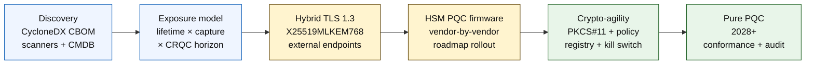

# Индекс квантово-устойчивого банкинга в 2026 году: постквантовая криптография, QKD, крипто-гибкость и риск harvest-now-decrypt-later

<!-- lead-start: manual -->
<aside class="post-lead" aria-label="Краткое содержание статьи">

<strong>TL;DR.</strong> Квантово-устойчивый банкинг в 2026 году — это программа поставки со сроком, заданным пересечением двух кривых: горизонтом конфиденциальности данных, которые организация держит сегодня, и горизонтом появления криптографически значимого квантового компьютера (CRQC). NIST FIPS 203 / 204 / 205 финализированы с августа 2024 года; CNSA 2.0 фиксирует конечное состояние для федеральных систем США на 2033 год; harvest-now-decrypt-later уже идёт по долгоживущим данным. Квантовая карта показателей для совета директоров отслеживает четыре точных процента: полноту инвентаризации, экспозицию HNDL, прогресс миграции на NIST и готовность крипто-гибкости.

<strong>Ключевые выводы</strong>

<ul class="post-lead-takeaways">
  <li><strong>Дискуссия об алгоритмах закрылась 13 августа 2024 года.</strong> ML-KEM (FIPS 203), ML-DSA (FIPS 204), SLH-DSA (FIPS 205) — это ответы. Банки, всё ещё проводящие внутренние оценки, чтобы «выбрать победителя», отстают на 18 месяцев.</li>
  <li><strong>Harvest-now-decrypt-later уже применяется.</strong> Всё, у чего горизонт конфиденциальности выходит за реалистичный срок появления CRQC, — 30-летняя ипотека, андеррайтинг страхования жизни, записи транзакций по MiFID II / GDPR, архивы M&amp;A — должно переходить на гибридную квантово-устойчивую инкапсуляцию ключей сейчас, а не тогда, когда о CRQC будет объявлено.</li>
  <li><strong>Инвентаризация — это пороговый уровень зрелости.</strong> Криптографическая спецификация активов (CBOM) — протокол, библиотека, сертификат, раздел HSM, зависимость от поставщика, владелец приложения, срок жизни по классу данных — это предусловие всего остального. Отслеживайте свежесть, а не охват.</li>
  <li><strong>Гибридный TLS 1.3 — это развёртывание 2026 года.</strong> Гибридный обмен ключами X25519MLKEM768 — это то, что Chrome / Firefox / Cloudflare / Akamai сегодня действительно согласуют. Чистый ML-KEM TLS ждёт прошивки HSM и готовности УЦ.</li>
  <li><strong>Крипто-гибкость — это долгосрочный результат.</strong> Абстракция PKCS#11, маркированные ключи, реестр политик, сопоставляющий бизнес-сервис с допустимым набором алгоритмов. Без этого следующий переход на новый алгоритм превращается в очередную многолетнюю программу.</li>
</ul>
</aside>
<!-- lead-end -->

Квантово-устойчивый банкинг в 2026 году — это операционная миграция, а не спекуляция. NIST финализировал первые три стандарта постквантовой криптографии, и банки теперь должны понимать, какие системы зависят от RSA, ECC, TLS, подписей, HSM, сертификатов, платёжных каналов, архивов и долгоживущих конфиденциальных данных. Вопрос индекса прост: способна ли организация заменить криптографию до того, как угроза станет операционной?

---

> **Резюме для руководства / Ключевые выводы**
>
> - **Стандарты NIST стали конкретными.** FIPS 203 определяет ML-KEM для инкапсуляции ключей, FIPS 204 определяет ML-DSA для подписей, а FIPS 205 определяет SLH-DSA как стандарт подписей без сохранения состояния на основе хешей.
> - **Инвентаризация — это первый порог зрелости.** Банк не может мигрировать то, что не способен найти: сертификаты, ключи, протоколы, приложения, поставщики, HSM, API, архивы и встроенные системы должны быть отображены.
> - **Крипто-гибкость — это долгосрочная цель.** Цель не разовая замена алгоритма, а возможность менять криптографические примитивы без перепроектирования целых приложений.
> - **Долгоживущие данные меняют срочность.** Риск harvest-now-decrypt-later означает, что данные, перехваченные сегодня, могут стать читаемыми позже, если они остаются ценными достаточно долго.
> - **QKD — это специализированное дополнение.** Квантовое распределение ключей может быть актуально для каналов наивысшей ценности, но не заменяет миграцию на PQC в масштабе всей организации.
>
---

## Почему 2026 год — это год, когда этот индекс имеет значение

Три сдвига в 2024–2025 годах превратили квантово-устойчивость из исследовательской темы в измеримую банковскую программу. Во-первых, NIST финализировал первичные постквантовые стандарты 13 августа 2024 года: [FIPS 203 (ML-KEM) ⧉](https://nvlpubs.nist.gov/nistpubs/FIPS/NIST.FIPS.203.pdf "FIPS 203 — Module-Lattice-Based Key-Encapsulation Mechanism"), [FIPS 204 (ML-DSA) ⧉](https://nvlpubs.nist.gov/nistpubs/FIPS/NIST.FIPS.204.pdf "FIPS 204 — Module-Lattice-Based Digital Signature Standard"), [FIPS 205 (SLH-DSA) ⧉](https://nvlpubs.nist.gov/nistpubs/FIPS/NIST.FIPS.205.pdf "FIPS 205 — Stateless Hash-Based Digital Signature Standard"). Дискуссия о выборе алгоритма закрылась в этот день; банки, всё ещё ведущие в 2026 году внутренние рабочие потоки «какая схема победит», отстают на 18 месяцев.

Во-вторых, [CNSA 2.0 от АНБ ⧉](https://media.defense.gov/2022/Sep/07/2003071834/-1/-1/0/CSA_CNSA_2.0_ALGORITHMS_.PDF "Commercial National Security Algorithm Suite 2.0") зафиксировала конечное состояние для федеральных систем США на 2033 год с промежуточными отсечками с 2027 года для подписи ПО и прошивок и с 2030 года для браузеров и операционных систем. Любой банк с экспозицией к американскому федеральному контрагенту — FedNow, операции Казначейства, счета федеральных клиентов — попадает внутрь этого периметра по системам, касающимся федеральных данных. Часы больше не абстрактные.

В-третьих, [Harvest-Now-Decrypt-Later (HNDL) ⧉](https://csrc.nist.gov/Projects/post-quantum-cryptography "NIST Post-Quantum Cryptography programme") — это несущий аргумент о срочности риска. Подготовленные противники уже перехватывают защищённые TLS платёжные сообщения, конверты SWIFT, KYC-документацию и долгоживущий архивный шифротекст в крупных финансовых центрах. Данные, перехваченные в 2026 году, должны оставаться конфиденциально чувствительными только в момент расшифровки — для 30-летней ипотеки, андеррайтинга страхования жизни, записей транзакций по MiFID II / GDPR и архивов M&A это окно простирается далеко за все реалистичные оценки появления криптографически значимого квантового компьютера (CRQC). Противнику не нужен квантовый компьютер сегодня. Он нужен ему до того, как данные перестанут иметь значение.

Индекс квантово-устойчивого банкинга измеряет, способна ли ваша организация поставить миграцию до того, как это пересечение наступит. Работа больше не о том, мигрировать или нет; она о том, завершится ли миграция в защитимые сроки.

## Архитектура индекса 2026 года

| Уровень индекса | Направление 2026 | Метрика готовности | Риск при неправильной обработке |
|---|---|---|---|
| **Инвентаризация** | Отобразить криптографические активы, протоколы, сертификаты, поставщиков и классы данных | Доля учтённого периметра | Неизвестные квантово-уязвимые зависимости |
| **Экспозиция** | Классифицировать системы по горизонту конфиденциальности и критичности транзакций | Высокорисковые активы по ценности и сроку жизни | Неправильно расставленные приоритеты миграции |
| **Миграция** | Принять гибридные и PQC-готовые шаблоны в соответствии со стандартами NIST | Готовность ML-KEM и ML-DSA | Аварийная переплатформенная работа в сжатые сроки |
| **Крипто-гибкость** | Отделить логику приложения от криптографических примитивов | Покрытие криптографии, управляемой политиками | Жёстко прошитые алгоритмы по всему периметру |
| **Гарантия качества** | Тестировать совместимость, производительность, поддержку HSM, сертификаты и готовность поставщиков | Доля прошедших тестов и бэклог исключений | Сломанные каналы или слабые резервные контроли |

### Квантовая карта показателей для совета директоров

Заслуживающая доверия карта квантовой готовности требует отслеживания точных процентов, а не только статусов проектов:

1. **Полнота инвентаризации.** Доля приложений уровня 1 с полностью отображённой криптографической спецификацией активов (CBOM).
2. **Экспозиция HNDL.** Объём долгоживущих конфиденциальных данных (например, ПДн, коммерческая тайна), передаваемых по сетям без гибридной квантово-устойчивой инкапсуляции ключей.
3. **Прогресс миграции на NIST.** Доля асимметричных ключей шифрования и цифровых подписей, мигрированных на стандарты FIPS 203 (ML-KEM) и FIPS 204 (ML-DSA).
4. **Готовность крипто-гибкости.** Доля критических систем, в которых криптографические алгоритмы могут быть ротированы через централизованную политику без перекомпиляции кода.

## Текущие сигналы для отслеживания

| Сигнал | Что это значит для банков | Источник |
|---|---|---|
| **FIPS 203 ML-KEM** | Первичный стандарт NIST для установления ключей общего шифрования | [NIST ⧉](https://www.nist.gov/news-events/news/2024/08/nist-releases-first-3-finalized-post-quantum-encryption-standards "First three finalized post-quantum encryption standards") |
| **FIPS 204 ML-DSA** | Первичный стандарт NIST для цифровых подписей | [NIST ⧉](https://www.nist.gov/news-events/news/2024/08/nist-releases-first-3-finalized-post-quantum-encryption-standards "First three finalized post-quantum encryption standards") |
| **FIPS 205 SLH-DSA** | Альтернатива на основе хеш-подписей и резервная схема | [NIST ⧉](https://www.nist.gov/news-events/news/2024/08/nist-releases-first-3-finalized-post-quantum-encryption-standards "First three finalized post-quantum encryption standards") |
| **Поощряется немедленная интеграция** | NIST прямо говорит администраторам начинать интеграцию стандартов, потому что полная интеграция занимает время | [NIST ⧉](https://www.nist.gov/news-events/news/2024/08/nist-releases-first-3-finalized-post-quantum-encryption-standards "First three finalized post-quantum encryption standards") |
| **Банковские квантовые программы расширяются** | Крупные банки изучают квантовые технологии, одновременно готовя переходы на PQC | [Quantum Insider ⧉](https://thequantuminsider.com/2026/03/27/15-plus-global-banks-probing-the-wonderful-world-of-quantum-technologies/ "Overview of global banks exploring quantum technologies") |

## Миграция начинается с реестра криптографии

Последовательность миграции на этот момент хорошо понятна. Каждый этап производит доказательства, которые задают следующий; пропуск или сжатие этапа — это то, что порождает риск аварийной переплатформенной работы, отображённый в столбце сбоев архитектуры индекса.

Первый артефакт — это не новый алгоритм; это криптографическая спецификация активов (CBOM). Банкам нужна живая инвентаризация, связывающая бизнес-сервисы с алгоритмами, библиотеками, сертификатами, длинами ключей, HSM, сроками жизни данных, поставщиками и операционными владельцами. Без такого реестра квантово-устойчивая миграция превращается в гадание.

Набор записей CBOM должен фиксировать для каждого криптографического примитива: протокол или интерфейс (TLS 1.3, IPsec, SSH, собственный формат платёжных сообщений), алгоритм и набор параметров (RSA-2048, ECDH P-256, ML-KEM-768, ML-DSA-65), библиотеку и версию (OpenSSL 3.4, хеш коммита BoringSSL, сборка SDK поставщика), аппаратную границу (раздел HSM, TPM, защищённый анклав или ничего), идентичность сертификата при наличии, владельца приложения и срок жизни по классификации данных. Инструменты, выходящие в продакшен в 2025–2026 годах, — IBM Quantum Safe Inventory, открытая [спецификация CycloneDX CBOM ⧉](https://cyclonedx.org/capabilities/cbom/ "CycloneDX Cryptography Bill of Materials"), корпоративные сканеры от CryptoNext / Sandbox / PQShield — интегрируются в существующие конвейеры CMDB. Ни один из них не самодостаточен; ожидайте цикл построения CBOM в 12–18 месяцев даже при наличии вендорского инструментария и выделенных штатных позиций.

Метрика для отслеживания — это свежесть, а не охват. CBOM с двухмесячной задержкой хуже, чем отсутствие CBOM, потому что даёт службе безопасности ложную уверенность в том, что мигрировано.

## Сначала гибрид, всегда гибкость

Большинство банков не переключат всё одновременно. Реалистичный шаблон — это гибридное развёртывание, в котором классические и постквантовые механизмы работают вместе, пока зреют поставщики, протоколы, сертификаты и операционный инструментарий. Долгосрочная цель — крипто-гибкость: управляемые политиками криптографические выборы, которые можно менять, не перестраивая бизнес-приложение.

[Вставить интерактивный компонент: калькулятор риска Harvest-Now-Decrypt-Later (HNDL) — инструмент со слайдерами, в котором руководители вводят срок хранения данных и оценочный квантовый горизонт, чтобы увидеть своё окно экспозиции.]

> **Ключевая мысль.** Если ваши данные должны оставаться конфиденциальными 10 лет, а до криптографически значимого квантового компьютера (CRQC) 7 лет, ваш дедлайн миграции не через 7 лет — он был 3 года назад.

На практике это означает TLS 1.3 с гибридным обменом ключами `X25519MLKEM768` для внешних эндпоинтов (Chrome / Firefox / Cloudflare / Akamai сегодня всё это поддерживают), классические цепочки подписей до тех пор, пока инфраструктура HSM и УЦ не догонит, и слой абстракции PKCS#11, позволяющий реестру политик ротировать алгоритмы без перекомпиляции бизнес-приложений. Крипто-гибкость определяет, будет ли следующий переход на новый алгоритм (когда, а не если) шестинедельной ротацией или очередной семилетней программой.

## Где место QKD

Квантовое распределение ключей входит в индекс как опция для каналов высокой чувствительности, особенно для инфраструктуры финансовых рынков, связности с центральными банками и крайне чувствительных институциональных потоков. К нему следует относиться как к дополнению к PQC, а не как к оправданию задержки миграции на уровне всей организации.

## Что это значит по типам банков

### Глобальные системно значимые банки

Сложная задача — это масштаб: десятки тысяч TLS-эндпоинтов, сотни разделов HSM, десятки внутренних центров сертификации, сотни бизнес-приложений со встроенными криптографическими примитивами и SDK поставщиков, которые банк не может изменить. Инвестиции — не очередной пилот; это инструментарий CBOM, слой абстракции PKCS#11, встроенный в каждую новую сборку, план консолидации HSM, выбирающий одного поставщика-лидера по прошивке PQC и принимающий многолетний хвост по остальным, и реестр политик, который становится долговечной поверхностью крипто-гибкости задолго после завершения миграции на FIPS 203 / 204 / 205.

### Транзакционные и корпоративные банки

Масштаб миграции уже, чем на уровне G-SIB, но экспозиция HNDL острая: трансграничный обмен сообщениями SWIFT, структурированные платёжные данные с ПДн корпоративного контрагента, платформы документооборота, держащие документацию торгового финансирования, и архивы отчётности с долгим сроком хранения. Приоритезируйте гибридный TLS на каждом клиентском эндпоинте и PQC «at rest» для архивов хранения. Давите на ответственность поставщиков HSM — команда корпоративной банковской платформы имеет прямой закупочный рычаг, которого у команды оптовых технологий часто нет.

### Региональные банки

Покупайте вендорский стек, в котором уже есть примитивы крипто-гибкости. Выбирайте корбанковскую платформу, поставщик которой публикует CBOM и фиксирует сроки поддержки ML-KEM / ML-DSA. Проверяйте, что дорожная карта HSM поставщика совпадает с дедлайном миграции банка. Инженерная мощность, нужная для построения крипто-гибкости с нуля, измеряется годами; поставщик распределяет эту стоимость по многим клиентам, и банк получает выгоду. Работа по валидации — проверка, что заявления поставщика выдерживают MRM-процесс организации, — это законный внутренний объём.

### Финтехи, PSP и инфраструктурные провайдеры

Конкурентный вопрос для поставщиков, продающих в банки в 2026 году, — не «поддерживаете ли вы PQC». Это «можете ли вы предоставить CycloneDX CBOM по своей платформе, матрицу поддержки поставщиков HSM и письменный SLA по ротации алгоритмов». Поставщики, отвечающие «да», пройдут закупочные ворота уровня 1 в 2026–2027 годах. Поставщики, которые не смогут, потеряют цикл продления контракта в пользу конкурента, который сможет.

## Заключение

Квантово-устойчивый банкинг в 2026 году — это не исследовательская тема; это программа поставки со сроком, заданным пересечением двух кривых: горизонтом конфиденциальности данных, которые организация держит сегодня, и горизонтом появления криптографически значимого квантового компьютера. Организации, которые в 2030 году будут выглядеть убедительно для регуляторов и контрагентов, — это те, кто начал построение CBOM в 2024 году, развернул гибридный TLS на каждом внешнем эндпоинте к концу 2026 года и встроил крипто-гибкость в каждую новую сборку с первого дня. Те, кто этого не сделал, обнаружат, не закрылось ли уже их окно миграции для данных, которые их противник собирает сегодня.

Измеряйте миграцию так же, как любую операционную программу: объём известен, последовательность приоритезирована, дедлайны зафиксированы, реестры исключений честны. Чем внимательнее вы смотрите на собственный периметр, тем меньше кажется окно миграции.

## Часто задаваемые вопросы

**Что банку инвентаризировать в первую очередь?**

Начните с внешних TLS, платёжных каналов, аутентификации клиентов, межбанковской связности, сервисов на базе HSM, долговременных архивов и систем, обрабатывающих конфиденциальные данные с долгим полезным сроком жизни.

**Является ли PQC только вопросом кибербезопасности?**

Нет. Это влияет на платежи, идентичность, юридические доказательства, подпись транзакций, доверие клиентов, хранение данных, управление поставщиками и операционную устойчивость.

**Что означает крипто-гибкость?**

Крипто-гибкость означает возможность менять криптографические примитивы через политику и контроли платформы, а не через жёстко прошитые изменения в приложениях.

**Стоит ли банкам ждать новых стандартов?**

Нет. NIST призвал администраторов начинать интеграцию первых финальных стандартов, потому что полная интеграция занимает время.

## Источники

- NIST, (2026). [Первые три финализированных стандарта постквантового шифрования ⧉](https://www.nist.gov/news-events/news/2024/08/nist-releases-first-3-finalized-post-quantum-encryption-standards "First three finalized post-quantum encryption standards").

<!-- enrich-start -->
<aside class="author-card" aria-label="Об авторе"><strong class="author-card-name"><a href="/about/index.html">Себастьян Руссо</a></strong>Старший банковский технолог, пишет о прикладном ИИ, инфраструктуре платежей, токенизированных деньгах, ISO 20022, постквантовой безопасности, облачно-нативных финансовых сервисах и регулируемых цифровых рынках.Более 20 лет в HSBC Commercial &amp; Investment Bank, PayPal, Barclays, Shazam, AKQA, Virgin Group. <a href="/about/index.html">Полный профиль</a> &middot; <a href="https://www.linkedin.com/in/sebastienrousseau/" rel="external noopener">LinkedIn</a> &middot; <a href="https://github.com/sebastienrousseau" rel="external noopener">GitHub</a></aside>

Последняя проверка <time datetime="2026-06-04">2026-06-04</time>.

<!-- enrich-end -->
