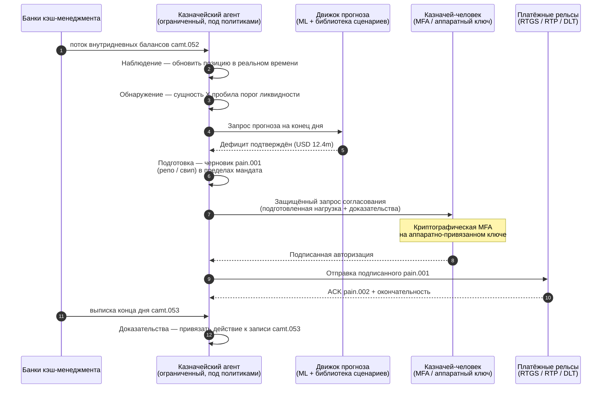

# Индекс автономного казначейства 2026: агентное казначейство, программируемая ликвидность, токенизированные депозиты и контроль наличных в реальном времени

<!-- lead-start -->
<aside class="post-lead" aria-label="Краткое содержание статьи">

<strong>Кратко.</strong> Индекс автономного казначейства 2026 — измерение агентных процессов, охвата программируемой ликвидности, интеграции токенизированных депозитов, оркестрации платежей в реальном времени и автоматического контроля наличных как единой ткани операционной модели.

<strong>Ключевые выводы</strong>

<ul class="post-lead-takeaways">
  <li><strong>Казначейство становится операционной системой реального времени.</strong> Статические прогнозы ликвидности и пакетные свипы больше не служат единицей измерения; ею становятся агентные процессы на данных реального времени.</li>
  <li><strong>Программируемая ликвидность стала практичной.</strong> Токенизированные депозиты и рельсы реального времени превращают пособытийное выделение ликвидности в примитив рабочего процесса, а не в квартальную инициативу.</li>
  <li><strong>Токенизированные депозиты — предпочтительные цифровые деньги казначея.</strong> Экономика банковских денег, программируемость и внутридневная определённость — без вопросов о риске эмитента и резервах, характерных для стейблкоинов.</li>
  <li><strong>Плоскость управления — новая аудиторская поверхность.</strong> Мандаты, лимиты, маршруты ручного переопределения и доказательства отмены должны работать как примитивы платформы, а не как ручные согласования по каждой операции.</li>
  <li><strong>Карта показателей CFO — на каждое решение, а не на квартал.</strong> Стоимость денежных средств, снижение буфера внутридневной ликвидности, эффективность FX и точность прогноза измеряются на скорости процесса.</li>
</ul>

<strong>По теме:</strong> <a href="https://sebastienrousseau.com/2026-05-25-programmable-liquidity-ai-tokenised-deposits-real-time-treasury-2026/index.html">Программируемая ликвидность 2026: ИИ, токенизированные депозиты и оркестрация казначейства в реальном времени</a>, <a href="https://sebastienrousseau.com/2026-05-21-tokenised-deposits-banking-services-status-2026/index.html">Токенизированные депозиты 2026: банковские сервисы, конкуренция со стейблкоинами и статус программируемых денег коммерческих банков</a>.

</aside>
<!-- lead-end -->

Автономное казначейство — естественная точка схождения агентного ИИ, оптовых платежей, токенизированных депозитов и ликвидности реального времени. В 2026 году лучшие архитектуры казначейства не просто прогнозируют ликвидность; они рекомендуют, объясняют и со временем исполняют ограниченные действия по ликвидности по счетам, валютам, рельсам и расчётным активам.

---

> **Резюме для правления / Ключевые выводы**
>
> - **Казначейство переходит от отчётности к контролю.** Балансы, прогнозы, статусы платежей и движение ликвидности в реальном времени становятся частью одного процесса.
> - **Агентный ИИ формирует новый интерфейс казначейства.** Агенты способны отслеживать позиции, выявлять аномалии, готовить действия по фондированию и эскалировать решения в рамках заданных мандатов.
> - **Программируемые деньги меняют денежную ножку сделки.** Токенизированные депозиты и эксперименты с оптовыми CBDC открывают новые возможности атомарного расчёта, условных платежей и постоянной доступности ликвидности.
> - **Индекс должен измерять полномочия.** Вопрос не в том, может ли агент предложить действие; вопрос в том, ясны ли полномочия, лимиты, согласования и доказательства.
> - **Ценность казначейства измерима.** Сэкономленная ликвидность, сокращённые ручные расследования, избежавшие сбои расчётов и высвобожденный оборотный капитал должны определять успех.
>
---

## Почему именно 2026 год — год этого индекса

Индекс Stanford AI ценен тем, что относится к быстро меняющейся технологической области как к измеримой: научный выход, техническая производительность, ответственное внедрение, экономика, отраслевое принятие, политика и общественные настроения сведены в одну рамку ([Stanford HAI ⧉](https://hai.stanford.edu/ai-index/2026-ai-index-report "Отчёт Stanford AI Index 2026")). Банки и финансовые институты теперь нуждаются в той же дисциплине для инфраструктуры. Агентный ИИ, квантово-устойчивая безопасность, облачная устойчивость и оптовые платежи перестали быть отдельными инновационными треками; они сходятся в одну операционную модель.

Практический вопрос для банка не в том, важен ли каждый домен. Он в том, способен ли институт измерять готовность по всем сразу. Банк может внедрить агентный ИИ и всё ещё быть хрупким, если его криптография не готова к миграции. Может модернизировать облачные платформы и потерпеть неудачу, если платёжные данные остаются неструктурированными. Может вести пилоты токенизации и порождать системный риск, если уровни расчёта, ликвидности, идентификации и аудита не спроектированы вместе.

## Архитектура индекса 2026

| Слой индекса | Направление 2026 | Метрика готовности | Риск при ошибке |
|---|---|---|---|
| **Видимость** | Унификация данных по счетам, платежам, ликвидности и экспозициям | Охват позиций наличных в реальном времени | Фрагментированная видимость наличных |
| **Прогнозирование** | ИИ для прогноза балансов, потоков и потребностей в фондировании | Точность прогноза ликвидности и доля исключений | Ложная уверенность на слабых данных |
| **Автономия** | Ограниченные полномочия агентов для рекомендаций и действий | Охват мандатов и качество согласований | Несанкционированное или необъяснённое действие |
| **Программируемость** | Токенизированные депозиты и умные условия там, где они дают ценность | Сценарии условных платежей и атомарного расчёта | Пилоты казначейства, ведомые технологией |
| **Контроли** | Встроенные лимиты, санкционный контроль, FX, ликвидность и аудит | Доказательства контроля по каждому действию казначейства | Ручное управление после исполнения |

## Текущие сигналы для отслеживания

| Сигнал | Что это значит для банков | Источник |
|---|---|---|
| **52% внедрения агентного ИИ в финансовых услугах** | Казначейство уже способно встраивать агентные процессы через управляемые платформы | [Cambridge CCAF ⧉](https://www.jbs.cam.ac.uk/faculty-research/centres/alternative-finance/publications/2026-global-ai-in-financial-services-report/ "Глобальный отчёт по ИИ в финансовых услугах 2026") |
| **Условные платежи Project Agorá** | Токенизация может открыть условные и постоянно доступные платёжные возможности | [BIS ⧉](https://www.bis.org/about/bisih/topics/fmis/agora.htm "Project Agorá") |
| **Банк Англии — Песочница цифровых ценных бумаг (Digital Securities Sandbox)** | Облигации и акции, выпущенные на DLT, рассчитываются по принципу «Поставка против платежа (DvP)» — актив и денежная ножка (оптовый CBDC или токенизированные депозиты коммерческого банка) рассчитываются в одной атомарной транзакции, устраняя принципиальный риск контрагента | [Банк Англии ⧉](https://www.bankofengland.co.uk/financial-stability/digital-securities-sandbox "Digital Securities Sandbox") |
| **Срок структурированных адресов SWIFT** | Данные казначейства должны корректно фиксироваться у источника | [SWIFT ⧉](https://www.swift.com/news-events/news/iso-20022-milestone-november-2026-unstructured-addresses-be-removed "Веха ISO 20022: структурированные адреса с ноября 2026") |
| **Крупным институтам трудно измерять ценность ИИ** | Автоматизации казначейства нужны жёсткие экономические метрики | [Cambridge CCAF ⧉](https://www.jbs.cam.ac.uk/faculty-research/centres/alternative-finance/publications/2026-global-ai-in-financial-services-report/ "Глобальный отчёт по ИИ в финансовых услугах 2026") |

## Мандат казначейского агента

Казначейский агент не должен проектироваться как универсальный ассистент. Ему нужен мандат: наблюдать счета, выявлять исключения, прогнозировать разрывы фондирования, готовить действия, запрашивать согласования, исполнять в пределах лимитов и формировать доказательства. Для каждого шага — своя модель полномочий.

Контур управления исполняется как Наблюдение → Обнаружение → Прогноз → Подготовка → Запрос согласования — и останавливается. Агент никогда самостоятельно не пересекает криптографическую границу авторизации. Диаграмма ниже прослеживает один полный цикл: внутридневной дефицит ликвидности в несколько миллионов долларов всплывает в телеметрии `camt.052`, агент прогнозирует позицию на конец дня, готовит репо или внутригрупповой свип в виде полностью сформированного `pain.001` и передаёт его казначею-человеку для многофакторной криптографической подписи на аппаратно-привязанном ключе. Затем агент отправляет подписанную полезную нагрузку; окончательность приходит как ACK `pain.002` и следующий `camt.053` для журнала аудита.

Граница — это и есть суть: каждое действие, двигающее реальные деньги, стоит за криптографическими защитными ограничениями, которые агент не может удовлетворить сам.

## Программируемая ликвидность

Программируемая ликвидность — это способность двигать ценность по условиям: если пробит порог, если приемлемо обеспечение, если контрагент прошёл скрининг, если доступна окончательность расчёта или если буфер внутридневной ликвидности слишком низок. Токенизированные депозиты и оптовые расчётные платформы делают такие шаблоны более практичными.

Программируемое не означает внестандартное. Путь исполнения — `pain.001`, ISO 20022 Customer Credit Transfer Initiation. Подготовленное агентом действие — это полностью сформированная нагрузка `pain.001`, направленная в банк по тому же каналу, что использовала бы корпоративная ERP, проверенная по той же схеме, оценённая теми же движками фрод-контроля и санкционного скрининга и подтверждённая по тем же отчётам о статусе `pain.002`. Слой условности (порог, приемлемость обеспечения, доступность окончательности, минимальный буфер) живёт над сообщением — он определяет, *будет ли* отправлен `pain.001`, а не *какую форму* он принимает. Казначейские платформы, изобретающие собственные нагрузки для выражения условий, выпадут из банк-потребляемого пути и вернутся в двустороннюю интеграцию.

## Контрольная комната казначейства

Операционная модель должна выглядеть как контрольная комната: позиции, прогнозы, состояния платежей, использование лимитов, исключения, согласования и доказательства — в одном интерфейсе. Индекс должен штрафовать казначейские стеки, заставляющие команды сшивать письма, таблицы, банковские порталы и разрозненные дашборды.

Плоскость данных за этим интерфейсом — управление наличными по ISO 20022. Внутридневная позиция — это `camt.052`, Bank-to-Customer Account Report, транслируемый из каждого банка кэш-менеджмента в слой наблюдения агента с той частотой, с которой публикует банк (минуты для GTB-провайдеров первого эшелона, конец цикла — для длинного хвоста). Сверка конца дня — это `camt.053`, Bank-to-Customer Statement, аудируемая запись, по которой прогноз агента оценивается на следующее утро. Казначейские платформы, читающие PDF-выписки или скрейпящие банковские порталы, не могут достичь 「Уровня 4」 индекса; внутридневная телеметрия должна приходить как структурированный `camt.052`, чтобы цикл прогноза замкнулся вовремя для действия.

## Что это значит по типам банков

### Глобальные системно значимые банки

Глобальные банки должны воспринимать этот индекс как карту показателей корпоративной архитектуры. Приоритет — не очередная проверка концепции; это доказательство того, что автономные процессы, криптографическая миграция, облачная зависимость и модернизация платежей управляются как единая система риска и ценности.

### Транзакционные и корпоративные банки

Транзакционным банкам стоит сосредоточиться на оптовых платежах, структурированных данных, ликвидности, токенизированных депозитах и сервисах агентного казначейства. Самое ценное предложение клиенту — не просто более быстрое движение денег; это объяснимое, аудируемое, программируемое движение денег с меньшим числом расследований и лучшей видимостью оборотного капитала.

### Региональные банки

Региональным банкам стоит использовать индекс, чтобы избежать разрастания программ. Им не нужно лидировать на каждом фронтире, но нужны убедительные позиции по управлению ИИ, постквантовой инвентаризации, доказательствам выхода из облака и готовности платёжных данных.

### Финтехи, PSP и инфраструктурные провайдеры

Финтехам и инфраструктурным провайдерам стоит выстраивать продуктовые дорожные карты под измеримую банковскую готовность. Лучшие предложения снизят интеграционный риск, усилят доказательства и упростят управление сложной инфраструктурой для банков.

## Заключение

Ценность отчёта в формате индекса в том, что он превращает фрагментированную технологическую повестку в измеримую операционную модель. В 2026 году победителями в финансовой инфраструктуре станут не те институты, у которых больше всего пилотов. Победят те, кто способен доказать готовность по автономии, безопасности, устойчивости, расчёту, экономике и управлению одновременно.

## Часто задаваемые вопросы

**Что такое автономное казначейство?**

Автономное казначейство — это применение ИИ-агентов, данных реального времени и программируемых платежей для мониторинга, рекомендации и потенциального исполнения казначейских действий в рамках заданных контролей.

**Следует ли разрешать казначейским агентам исполнять платежи?**

Только в узких мандатах, при жёстких лимитах, явных согласованиях и полной аудируемости. Полномочия на исполнение должны зарабатываться зрелостью.

**Чем токенизированные депозиты помогают казначейству?**

Они поддерживают программируемый расчёт, атомарное исполнение и потенциально лучший контроль внутридневной ликвидности, сохраняя отношения денег коммерческого банка.

**Каков первый шаг внедрения?**

Сначала — видимость в реальном времени и качество данных, затем — автономия. Агенты не могут безопасно оптимизировать ликвидность, которую не видят точно.

## Источники

- Cambridge Centre for Alternative Finance, (2026). [Глобальный отчёт по ИИ в финансовых услугах 2026 ⧉](https://www.jbs.cam.ac.uk/faculty-research/centres/alternative-finance/publications/2026-global-ai-in-financial-services-report/ "Глобальный отчёт по ИИ в финансовых услугах 2026").
- SWIFT, (2026). [Веха ISO 20022: структурированные адреса с ноября 2026 ⧉](https://www.swift.com/news-events/news/iso-20022-milestone-november-2026-unstructured-addresses-be-removed "Веха ISO 20022: структурированные адреса с ноября 2026").
- BIS Innovation Hub, (2026). [Project Agorá ⧉](https://www.bis.org/about/bisih/topics/fmis/agora.htm "Project Agorá").
- Bank of England, (2026). [Формируя цифровое финансовое будущее Великобритании ⧉](https://www.bankofengland.co.uk/speech/2025/january/sasha-mills-speech-at-the-tokenisation-summit "Формируя цифровое финансовое будущее Великобритании").

<!-- enrich-start -->
<aside class="author-card" aria-label="Об авторе"><strong class="author-card-name"><a href="/about/index.html">Себастьян Руссо</a></strong>Старший банковский технолог, пишет о прикладном ИИ, платёжной инфраструктуре, токенизированных деньгах, ISO 20022, постквантовой безопасности, облачных финансовых сервисах и регулируемых цифровых рынках.Более 20 лет в HSBC Commercial &amp; Investment Bank, PayPal, Barclays, Shazam, AKQA, Virgin Group. <a href="/about/index.html">Полный профиль</a> &middot; <a href="https://www.linkedin.com/in/sebastienrousseau/" rel="external noopener">LinkedIn</a> &middot; <a href="https://github.com/sebastienrousseau" rel="external noopener">GitHub</a></aside>

Последняя проверка <time datetime="2026-06-07">2026-06-07</time>.

<!-- enrich-end -->
