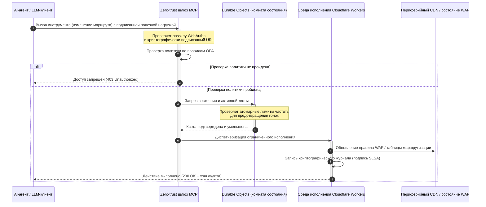

---

# Front Matter (YAML)

author: "contact@sebastienrousseau.com (Sebastien Rousseau)"
banner_alt: "Светящаяся стойка дата-центра ночью — символ инспектируемой, управляемой агентами периферии с открытым исходным кодом, на которой построен CloudCDN"
banner_height: "1597"
banner_width: "2584"
banner: "https://cloudcdn.pro/stocks/images/alis-po-IdVNRv-5wJo.webp"
cdn: "https://cloudcdn.pro"
charset: "UTF-8"
cname: "sebastienrousseau.com"
copyright: "© Copyright 2025 - 2026 - Sebastien Rousseau. All rights reserved."
date: "June 11, 2026"
description: "CloudCDN превращает CDN в криптографически защищённую, управляемую агентами плоскость управления: zero-trust шлюз MCP, Durable Objects, SLSA Level 3, DORA."
format-detection: "telephone=no"
hreflang: "ru"
icon: "https://cloudcdn.pro/clients/sebastienrousseau/v1/logos/sebastienrousseau.svg"
id: "https://sebastienrousseau.com/ru/2026-06-11-cloudcdn-open-source-blueprint-ai-native-edge-2026"
image_alt: "Чёрно-белый портрет Себастьяна Руссо"
image_height: "162"
image_width: "162"
image: "https://cloudcdn.pro/stocks/images/sebastienrousseau.webp"
keywords: "CloudCDN, AI-нативная периферия, открытый CDN, MCP-сервер, Cloudflare Workers, Durable Objects, нулевое доверие, WebAuthn, подписанные URL, SLSA Level 3, DORA, периферийная плоскость управления"
language: "ru"
last_reviewed: "2026-06-11"
layout: "report"
locale: "ru_RU"
logo_alt: "Логотип Себастьяна Руссо"
logo_height: "44"
logo_width: "44"
logo: "https://cloudcdn.pro/clients/sebastienrousseau/v1/logos/sebastienrousseau.svg"
menu: ""
measurementID: "G-169G4ET5HQ"
name: "Sebastien Rousseau"
permalink: "https://sebastienrousseau.com/ru/2026-06-11-cloudcdn-open-source-blueprint-ai-native-edge-2026"
rating: "general"
referrer: "no-referrer"
robots: "index, follow"
schema: "FAQPage, Article"
seo_title: "CloudCDN: открытая схема AI-нативной периферии"
short_name: "sebastienrousseau"
subtitle: "От статического кэширования контента к криптографически защищённой, управляемой агентами периферийной плоскости управления глобального CDN."
tags: "CloudCDN, открытый исходный код, CDN, периферия, AI-агенты, MCP, Cloudflare Workers, Durable Objects, ограничение частоты запросов, нулевое доверие, WebAuthn, SLSA, DORA, BCBS 239, Basel III, облачно-нативный банкинг"
theme-color: "0, 83, 191"
title: "CloudCDN: открытая схема AI-нативной периферии в 2026 году"
url: "https://sebastienrousseau.com/ru/2026-06-11-cloudcdn-open-source-blueprint-ai-native-edge-2026"
viewport: "width=device-width, initial-scale=1, shrink-to-fit=no"

# RSS - The RSS feed front matter (YAML).
atom_link: "https://sebastienrousseau.com/2026-06-11-cloudcdn-open-source-blueprint-ai-native-edge-2026/rss.xml"
category: "Technology"
docs: https://validator.w3.org/feed/docs/rss2.html
generator: "Static Site Generator (SSG) (version 0.0.26)"
item_description: "CloudCDN превращает CDN в криптографически защищённую, управляемую агентами плоскость управления: zero-trust шлюз MCP, Durable Objects, SLSA Level 3, DORA."
item_guid: "https://sebastienrousseau.com/2026-06-11-cloudcdn-open-source-blueprint-ai-native-edge-2026/rss.xml"
item_link: "https://sebastienrousseau.com/2026-06-11-cloudcdn-open-source-blueprint-ai-native-edge-2026/rss.xml"
item_pub_date: "Thu, 11 Jun 2026 06:06:06 +0000"
item_title: "CloudCDN: открытая схема AI-нативной периферии в 2026 году"
last_build_date: "Thu, 11 Jun 2026 06:06:06 +0000"
managing_editor: "contact@sebastienrousseau.com (Sebastien Rousseau)"
pub_date: "Thu, 11 Jun 2026 06:06:06 +0000"
ttl: "60"
type: "article"
webmaster: "contact@sebastienrousseau.com"

# Apple - The Apple front matter (YAML).
apple_mobile_web_app_orientations: "portrait"
apple_touch_icon_sizes: "192x192"
apple-mobile-web-app-capable: "yes"
apple-mobile-web-app-status-bar-inset: "black"
apple-mobile-web-app-status-bar-style: "black-translucent"
apple-mobile-web-app-title: "CloudCDN: открытая схема AI-нативной периферии"
apple-touch-fullscreen: "yes"

# MS Application - The MS Application front matter (YAML).

msapplication-navbutton-color: "0, 83, 191"

# Twitter Card - The Twitter Card front matter (YAML).

twitter_card: "summary_large_image"
twitter_creator: "@wwdseb"
twitter_description: "CloudCDN превращает CDN в криптографически защищённую, управляемую агентами плоскость управления: zero-trust шлюз MCP, Durable Objects, SLSA Level 3, DORA."
twitter_image: "https://cloudcdn.pro/clients/sebastienrousseau/v1/logos/sebastienrousseau.svg"
twitter_image_alt: "Логотип Себастьяна Руссо"
twitter_site: "@wwdseb"
twitter_title: "CloudCDN: открытая схема AI-нативной периферии"
twitter_url: "https://sebastienrousseau.com/2026-06-11-cloudcdn-open-source-blueprint-ai-native-edge-2026"

excerpt: "CloudCDN — открытая схема AI-нативной периферии: zero-trust шлюз MCP с 42 инструментами, лимиты Durable Objects, WebAuthn, SLSA Level 3, DORA-доказательства."

# Humans.txt - The Humans.txt front matter (YAML).
author_website: "https://sebastienrousseau.com"
author_twitter: "@wwdseb"
author_location: "Лондон, Великобритания"
thanks: "Спасибо за чтение!"
site_last_updated: "2026-06-11"
site_standards: "HTML5, CSS3, RSS, Atom, JSON, XML, YAML, Markdown, TOML"
site_components: "Kaishi, Kaishi Builder, Kaishi CLI, Kaishi Templates, Kaishi Themes"
site_software: "Static Site Generator, Rust"

---

# CloudCDN: открытая схема AI-нативной периферии в 2026 году

<!-- lead-start: manual -->
<aside class="post-lead" aria-label="Краткое содержание статьи">

<strong>Кратко.</strong> Корпоративные технологии в 2026 году определяются сближением глобально распределённого бессерверного исполнения и агентного ИИ. Стандартные CDN — созданные для кэширования статических файлов и базовой маршрутизации трафика — структурно устарели в эпоху активной оркестрации данных в реальном времени. CloudCDN — открытая схема, которая переназначает периферию в активную плоскость управления: бессерверные среды исполнения, координация состояния через Cloudflare Durable Objects и zero-trust шлюз Model Context Protocol (MCP), позволяющий автономным AI-агентам управлять веб-инфраструктурой внутри ограниченных, криптографически защищённых операционных контуров.

<strong>Ключевые выводы</strong>

<ul class="post-lead-takeaways">
  <li><strong>От статического кэша к ограниченной плоскости управления.</strong> CloudCDN переносит операционную границу на периферию, превращая узлы CDN в активные шлюзы политик, исполняющие решения по безопасности, маршрутизации и контролю доступа за доли миллисекунды.</li>
  <li><strong>Координация состояния на периферии.</strong> Cloudflare Durable Objects обеспечивают атомарное ограничение частоты запросов и координацию состояния в реальном времени по всему миру — без распределённых гонок и системного злоупотребления квотами между периферийными регионами.</li>
  <li><strong>Безопасное агентное управление инфраструктурой через MCP.</strong> Zero-trust шлюз экспонирует 42 специализированных инструмента MCP, позволяя AI-агентам инспектировать, настраивать и эксплуатировать инфраструктуру в криптографически подписанных границах.</li>
  <li><strong>Безопасность цепочки поставок как продукт конвейера.</strong> Происхождение сборок SLSA Level 3 через Sigstore/Cosign и 3 185 модульных тестов со 100% покрытием на каждом релизе.</li>
  <li><strong>Доказательства уровня правления, а не панели.</strong> Периферийная телеметрия напрямую сопоставляется с ответственностью правления по статье 5 DORA, риск-отчётностью BCBS 239 и правилами капитала под операционный риск Basel III.</li>
</ul>

<strong>По теме:</strong> <a href="/2026-05-16-best-cloud-infrastructure-architecture-2026/">Лучшая архитектура облачной инфраструктуры в 2026 году: AI-нативная, мультиоблачная, квантово-осведомлённая схема для финансовых услуг</a> · <a href="/2026-06-05-cloud-native-banking-index-dora-resilience-platform-engineering-2026/">Индекс облачно-нативного банкинга в 2026 году: DORA, платформенная инженерия, суверенное облако и операционная устойчивость</a> · <a href="/2026-06-03-agentic-ai-index-banks-autonomy-governance-auditability-2026/">Индекс агентного ИИ для банков в 2026 году: автономия, управление, аудируемость и бизнес-эффект</a>

</aside>
<!-- lead-end -->

Дебаты о CDN закончены. Периферия больше не кэш; это плоскость управления для AI-нативного программного обеспечения. Пока агенты вызывают инструменты, перемещают данные, очищают кэши, запрашивают подписанные URL и координируют рабочие процессы, прежняя модель непрозрачных панелей и проприетарных плоскостей управления перестаёт быть неудобством и становится регуляторным обязательством. CloudCDN отстаивает другую модель: открытую, инспектируемую, управляемую агентами периферийную платформу, в которой безопасность, доступность, производительность и аудируемость — принудительные значения по умолчанию, а не обещания вендора.

Открытый ориентир для этой статьи — [cloudcdn.pro ⧉](https://github.com/sebastienrousseau/cloudcdn.pro "cloudcdn.pro"). Репозиторий — мультиарендный AI-нативный CDN, который можно прочитать целиком и развернуть независимо: TTFB менее 100 мс на PoP Cloudflare, управление через MCP, ограничение частоты запросов на Durable Objects, доступность WCAG-AA, подписанные URL, passkeys, SLSA Level 3 и 3 185 тестов со 100% покрытием.

---

> **Резюме для правления / Ключевые выводы**
>
> - **Периферия становится операционной границей.** CloudCDN превращает стандартные узлы CDN в активные шлюзы политик, исполняющие безопасность, маршрутизацию и контроль доступа за доли миллисекунды.
> - **Durable Objects делают ограничение частоты запросов атомарным.** Глобально согласованное исполнение квот в реальном времени закрывает окно гонок, которое лимитеры с итоговой согласованностью оставляют открытым для атакующих и неисправных агентов.
> - **Агенты управляют инфраструктурой через 42 ограниченных инструмента MCP.** Каждый вызов проверяется по passkeys WebAuthn, подписанным полезным нагрузкам и политике OPA до любого исполнения.
> - **Цепочка поставок — часть продукта.** Происхождение SLSA Level 3 через Sigstore/Cosign криптографически связывает каждый релиз с его проверенными исходниками.
> - **Телеметрия — это доказательства соответствия.** Периферийные операции сопоставляются со статьёй 5 DORA, BCBS 239 и капиталом под операционный риск Basel III — напрямую, а не через отчётность задним числом.
>
---

## Почему этот открытый проект важен в 2026 году

Корпоративные ИТ в 2026 году перешли от статического выделения инфраструктуры к событийной оркестрации данных в реальном времени. Сдвиг определяют две рыночные силы.

Первая — распространение агентного ИИ. Автономные модели и программные агенты теперь выполняют сложные операционные задачи: автоматическое подавление угроз, решения по маршрутизации, балансировку реестров в реальном времени. Они не пользуются панелями. Они вызывают инструменты.

Вторая — активное применение [Регламента о цифровой операционной устойчивости (DORA) ⧉](https://eur-lex.europa.eu/legal-content/EN/TXT/?uri=CELEX%3A32022R2554 "Регламент (ЕС) 2022/2554 о цифровой операционной устойчивости финансового сектора"). Банковские институты больше не могут полагаться на непрозрачные проприетарные сторонние CDN. Регуляторы требуют полной видимости цепочки поставок программного обеспечения, проверяемой способности к выходу и неизменяемых криптографических журналов аудита.

Централизованные серверные архитектуры накладывают задержки, которые оркестрация в реальном времени не может поглотить. Проприетарные CDN работают как чёрные ящики, подвергая институты компрометации цепочки поставок, которую они не могут ни увидеть, ни тем более доказать. CloudCDN закрывает этот разрыв прозрачной, zero-trust, открытой схемой, превращающей периферию в активную плоскость управления. Для технологических руководителей это переводит разговор от стоимости комплаенса к Return on Resilience: капиталу, сохранённому за счёт автоматизированных, готовых к аудиту операционных конвейеров.

## Архитектурная призма

Архитектура CloudCDN выстроена в пять слоёв, заменяющих централизованное промежуточное ПО локализованными, хранящими состояние периферийными примитивами:

| Слой | Проектное решение | Почему это важно | Риск при неверной реализации |
|---|---|---|---|
| **Периферийная среда исполнения** | Cloudflare Workers и Pages | Устраняет задержку централизованных ВМ; исполняет политики глобально за доли миллисекунды | Выигрыш в производительности без дисциплины политик порождает хаотичный дрейф периферии |
| **Координация состояния** | Durable Objects | Гарантирует атомарную согласованность в реальном времени для лимитов и общего состояния между регионами | Распределённые гонки, злоупотребление ресурсами API, обход периметровых квот |
| **Агентный интерфейс** | Zero-trust шлюз MCP | Экспонирует 42 специализированных инструмента MCP, чтобы AI-агенты управляли инфраструктурой в регулируемых границах | Неограниченный вызов инструментов и несанкционированные изменения конфигурации |
| **Контроль доступа** | Passkeys WebAuthn и подписанные URL | Заменяет статические пароли криптографическими подписями для аудируемых операций | Слабо атрибутированные изменения; кража учётных данных, ведущая к прорыву периметра |
| **Контроль качества** | SLSA Level 3 и 100% покрытие тестами | Математически верифицирует источник сборки; блокирует внедрение вредоносных зависимостей | Вредоносный код, внедрённый через цепочку поставок ПО |

## Операционные сигналы для отслеживания

Готовность периферии измерима. Вот количественные индикаторы, демонстрирующие способность к исполнению, а не намерение:

| Сигнал | Метрика / ориентир | Регуляторная ссылка | Реализация на платформе |
|---|---|---|---|
| **42 инструмента MCP** | Ограниченный реестр инструментов для автоматизированного управления | COBIT 2019 (BAI06) | Шлюз MCP, проверяющий подписи агентов по политикам OPA |
| **Durable Objects** | Атомарное исполнение квот без утечек, за доли миллисекунды | DORA, статья 6 | Durable Objects, отслеживающие глобальное состояние квот API |
| **Passkeys и подписанные URL** | 100% административных сессий верифицированы через FIDO2 WebAuthn | DORA, статья 30 | Проверки криптографических подписей, встроенные в периферийный маршрутизатор |
| **SLSA Level 3** | Криптографически подписанные манифесты сборки (Sigstore) | DORA, статья 30 | Конвейеры GitHub Actions, генерирующие подписанные метаданные сборки |
| **3 185 модульных тестов** | 100% покрытие; регрессионные гейты на каждом релизе | NIST CSF 2.0 (PR.DS-01) | CI-конвейеры, останавливающие развёртывание при любом сбое теста |

## CDN становится активной плоскостью управления

Традиционные CDN проектировались вокруг пассивного ускорения статического контента. CloudCDN переопределяет модель. С интегрированными Cloudflare Workers и Durable Objects периферия работает как активный, хранящий состояние шлюз политик.

Когда AI-агент или автоматизированный процесс запрашивает изменение конфигурации инфраструктуры или корректировку маршрутизации, он не обращается к уязвимой централизованной базе данных. Запрос перехватывается на ближайшем периферийном узле и проходит проверки идентичности, политики и квоты до любого исполнения:

Каждый шаг этой последовательности порождает атрибутируемую, подписанную запись. В этом разница между CDN, который ускоряет контент, и плоскостью управления, которой можно управлять.

## Почему открытый исходный код меняет модель доверия

Для директоров по информационной безопасности непрозрачные проприетарные CDN представляют нарастающий риск. Закрытые периферийные сети — чёрные ящики: если вендор переживает внутреннюю компрометацию, банк не видит ничего до публичного раскрытия инцидента.

CloudCDN заменяет эту асимметрию полностью аудируемой, открытой моделью доверия на трёх механизмах:

1. **Математическое происхождение сборок.** При SLSA Level 3 каждый релиз криптографически связан со своим открытым репозиторием GitHub. CISO может верифицировать — математически, а не договорно, — что бинарный код, работающий на глобальных периферийных узлах Cloudflare, содержит ровно проверенные исходники.
2. **Непрерывные публичные аудиты безопасности.** Кодовая база подвергается автоматизированным сканированиям, публичному раскрытию уязвимостей и рецензируемым аудитам кода. Скрытность — не контроль; контроль — это рецензирование.
3. **Отсутствие вендорской привязки (статья 28 DORA).** DORA требует от банков доказать ясную, протестированную стратегию выхода от критических сторонних провайдеров. Поскольку CloudCDN открыт и построен на стандартных бессерверных примитивах, институты могут мигрировать периферийные конфигурации с Cloudflare на другие бессерверные среды исполнения или частные кластеры Kubernetes — и доказать эту способность регулятору.

## Шаблон периферии банковского уровня

CloudCDN спроектирован под комплаенс-стандарты глобального финансового сектора, сопоставляя технические периферийные операции напрямую с рамками, которые надзорные органы реально проверяют:

- **Управление модельным риском ([SR 11-7 ФРС США ⧉](https://web.archive.org/web/20260414150921/https://www.federalreserve.gov/supervisionreg/srletters/sr1107.htm "Надзорное руководство по управлению модельным риском") / SS1/23 PRA Великобритании).** Автономные модели, выполняющие операционные задачи, попадают под управление модельным риском. Шлюз MCP в CloudCDN рассматривает агентные инструменты как количественные модели: строгие границы политик, журналирование в реальном времени и обязательное человеческое подтверждение для действий с высоким влиянием.
- **BCBS 239 (агрегация риск-данных).** Захват, маркировка и структурирование транзакционных данных на периферии порождают операционные метрики в реальном времени — в соответствии с требованиями BCBS 239 к целостности данных, своевременности и регуляторной прослеживаемости.
- **DORA, статья 5 (ответственность правления).** Правление несёт конечную персональную ответственность за операционную устойчивость. CloudCDN переводит периферийную телеметрию в количественные, проверяемые доказательства, которые нетехнические директора могут предъявить на аудите персональной ответственности.
- **Капитал под операционный риск Basel III.** Банки держат регуляторный капитал под операционный риск. Автоматизированное аварийное переключение и происхождение SLSA Level 3 снижают профиль операционного риска института — сохраняя капитал на балансе, а не только удовлетворяя аудитора.

## Что это значит для разных типов банков

### Глобальные системно значимые банки (G-SIB)

G-SIB обрабатывают огромные объёмы транзакций в нескольких юрисдикциях. Приоритет — заменить фрагментированные унаследованные периметровые контроли единой периферийной плоскостью. Развёртывание шаблона CloudCDN позволяет G-SIB стандартизировать политики безопасности, API-шлюзы и агентное управление глобально — и генерировать конвейеры DORA-доказательств как побочный продукт эксплуатации, а не как квартальный аврал.

### Транзакционные и корпоративные банки

Для транзакционных банков клиентский продукт — это связка скорости исполнения, безопасности и прозрачности данных. Шаблон CloudCDN позволяет этим банкам предоставлять корпоративным казначеям защищённые API-панели и сервисы отслеживания денежных средств в реальном времени — устойчивая периферийная позиция, защищающая корпоративные депозиты.

### Региональные и небольшие банки

Региональные банки сталкиваются с теми же злоумышленниками, что и G-SIB, без инженерных бюджетов. Открытая периферийная схема банковского уровня даёт контроли «из коробки»: немедленное регуляторное соответствие без затрат на проприетарные лицензии — и исходный код в качестве доказательства.

## План действий для правления

Операционная устойчивость больше не невидимая бэк-офисная ИТ-метрика; это приоритет правления с персональной ответственностью. Институты, сохраняющие доверие регуляторов, клиентов и акционеров в 2026 году, относятся к технологии как к проверяемому, наблюдаемому активу.

Дорожная карта для старших технологических руководителей коротка:

1. **Сделайте доказательства продуктом.** Закладывайте бюджет на автоматизированные, самодокументирующиеся конвейеры на периферии — доказательства, порождаемые эксплуатацией, а не собираемые для аудитора.
2. **Перейдите к периферийному управлению состоянием.** Снимите ограничение частоты запросов, WAF и верификацию идентичности с централизованных серверов и перенесите на атомарные периферийные примитивы.
3. **Установите криптографические агентные границы.** Применяйте zero-trust шлюзы MCP с проверкой passkey и OPA для каждого автоматизированного вызова инструмента.
4. **Требуйте аудиты открытых сборок.** Сделайте происхождение сборок SLSA Level 3 условием развёртывания, а не пожеланием.

## Часто задаваемые вопросы

**Готов ли CloudCDN к аудитам DORA?**

Да. CloudCDN спроектирован для автоматической генерации доказательств соответствия, напрямую сопоставимых с шаблонами ITS Реестра информации (от RT.01 до RT.15) и договорными положениями статьи 30 DORA.

**В чём преимущество Durable Objects для ограничения частоты запросов?**

Традиционные распределённые лимитеры полагаются на итоговую согласованность, оставляющую окно задержки, которое могут использовать атакующие или неисправные агенты. Durable Objects гарантируют немедленную, атомарную согласованность глобально, полностью закрывая окно гонок.

**Что делает CloudCDN AI-нативным?**

Управляемые через MCP операции и модель управления, учитывающая агентов. Инфраструктура эксплуатируется через 42 регулируемых инструмента с криптографической идентичностью и границами политик — для автономных рабочих процессов, а не только для человеческих панелей.

**Повышает ли открытый исходный код риск эксплойтов нулевого дня?**

Нет. Проприетарные закрытые CDN полагаются на безопасность через скрытность. Кодовая база CloudCDN непрерывно подвергается автоматизированному тестированию, публичному рецензированию и валидации SLSA Level 3 — это проверяемо более высокий порог доверия.

## Источники

- Европейский парламент и Совет Европейского союза, (2022). [Регламент (ЕС) 2022/2554 о цифровой операционной устойчивости финансового сектора (DORA) ⧉](https://eur-lex.europa.eu/legal-content/EN/TXT/?uri=CELEX%3A32022R2554 "Регламент (ЕС) 2022/2554 о цифровой операционной устойчивости финансового сектора (DORA)"). Брюссель: Официальный журнал Европейского союза.
- Базельский комитет по банковскому надзору (BCBS), (2013). [Принципы эффективной агрегации риск-данных и риск-отчётности (BCBS 239) ⧉](https://www.bis.org/publ/bcbs239.htm "Принципы эффективной агрегации риск-данных и риск-отчётности (BCBS 239)"). Базель: Банк международных расчётов.
- Совет управляющих Федеральной резервной системы, (2011). [Надзорное руководство по управлению модельным риском (письмо SR 11-7) ⧉](https://web.archive.org/web/20260414150921/https://www.federalreserve.gov/supervisionreg/srletters/sr1107.htm "Надзорное руководство по управлению модельным риском (письмо SR 11-7)"). Вашингтон: Федеральная резервная система.
- Cloudflare, (2026). [Документация Durable Objects: координация состояния на периферии ⧉](https://developers.cloudflare.com/durable-objects/ "Документация Durable Objects"). Сан-Франциско: Cloudflare.
- Cloudflare, (2026). [Создание AI-агентов с MCP, аутентификацией и Durable Objects ⧉](https://blog.cloudflare.com/building-ai-agents-with-mcp-authn-authz-and-durable-objects/ "Создание AI-агентов с MCP, аутентификацией и Durable Objects").
- GitHub, (2026). [Репозиторий cloudcdn.pro ⧉](https://github.com/sebastienrousseau/cloudcdn.pro "Репозиторий cloudcdn.pro").

<!-- enrich-start -->
<aside class="author-card" aria-label="Об авторе"><strong class="author-card-name"><a href="/about/index.html">Себастьян Руссо</a></strong>Старший банковский технолог, пишет о прикладном ИИ, платёжной инфраструктуре, токенизированных деньгах, ISO 20022, постквантовой безопасности, облачных финансовых сервисах, открытой инфраструктуре и регулируемых цифровых рынках.Более 20 лет в HSBC Commercial &amp; Investment Bank, PayPal, Barclays, Shazam, AKQA, Virgin Group. <a href="/about/index.html">Полный профиль</a> &middot; <a href="https://www.linkedin.com/in/sebastienrousseau/" rel="external noopener">LinkedIn</a> &middot; <a href="https://github.com/sebastienrousseau" rel="external noopener">GitHub</a></aside>

Последняя проверка <time datetime="2026-06-11">2026-06-11</time>.

<!-- enrich-end -->
