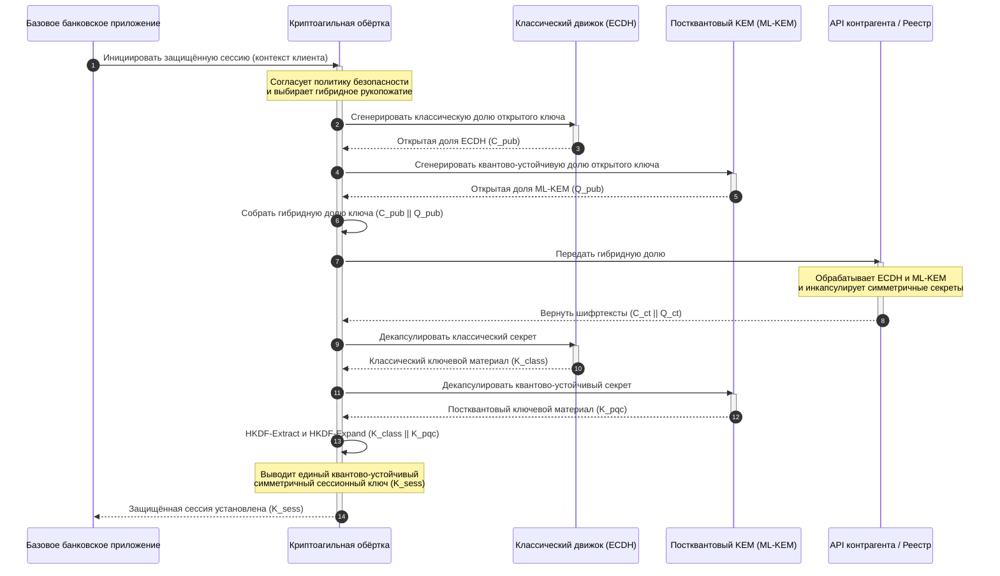

# KyberLib и постквантовая миграция банков в 2026 году: от стандартов к коду

<!-- lead-start: manual -->
<aside class="post-lead" aria-label="Краткое содержание статьи">

<strong>Кратко.</strong> Банковская инфраструктура в 2026 году сталкивается с системной угрозой с известной конечной точкой: вычисления квантового масштаба взломают обмен ключами RSA и ECC, защищающий сегодняшний транзитный трафик. Федеральные стандарты и надзорные программные документы подняли осведомлённость; техническое исполнение остаётся разрозненным. <a href="https://github.com/sebastienrousseau/kyberlib">KyberLib</a> — открытая инженерная схема, переводящая постквантовый нарратив в конкретный, безопасный по памяти код на Rust: реализация стандартизованного NIST ML-KEM (FIPS 203) за криптоагильными границами абстракции, чтобы учреждения успели модернизировать транспортную безопасность и инкапсуляцию ключей до того, как атаки «Store Now, Decrypt Later» доберутся до их архивов.

<strong>Ключевые выводы</strong>

<ul class="post-lead-takeaways">
  <li><strong>От политики к инспектируемому коду.</strong> KyberLib переводит постквантовую криптографию из абстрактных стратегических дорожных карт в конкретные, высокопроизводительные, аудируемые реализации на Rust.</li>
  <li><strong>Стандартизованное исполнение ML-KEM по FIPS 203.</strong> Библиотека реализует ML-KEM — алгоритм установления ключей, финализированный в NIST FIPS 203, — удерживая соответствие в русле глобальных регуляторных ожиданий.</li>
  <li><strong>Криптоагильность по построению.</strong> Стабильные границы абстракции позволяют банковским приложениям менять криптографические примитивы без дорогостоящих и подверженных ошибкам переписываний приложений.</li>
  <li><strong>Безопасность памяти на основе Rust.</strong> Правила владения, проверяемые на этапе компиляции, устраняют переполнения буфера и утечки памяти, преследующие унаследованные криптографические библиотеки на C, — на скорости абстракций с нулевой стоимостью.</li>
  <li><strong>Снижение фидуциарной ответственности.</strong> Наблюдаемые, тестируемые доказательства миграции дают директорам ту запись о «разумных мерах», которую требуют аудиты персональной ответственности по статье 5 DORA.</li>
</ul>

<strong>Дополнительное чтение:</strong> <a href="/2026-05-18-quantum-cryptography-standards-developments-2026/">Перезагрузка квантовой криптографии в 2026 году: стандарты PQC, гарантии QKD и миграционная работа, которую банки не могут откладывать</a>, <a href="/2026-05-28-dora-ai-act-data-sovereignty-banking-compliance-stack-2026/">Стек комплаенса DORA, Закона об ИИ и суверенитета данных для банков</a>, <a href="/2026-05-20-cloud-native-banking-financial-institutions-2026/">Облачно-нативный банкинг для финансовых учреждений</a>.

</aside>
<!-- lead-end -->

Постквантовая миграция перестала быть упражнением в планировании. В 2026 году это действующее операционное требование, и разрыв между регуляторным замыслом и инженерным исполнением — именно там, где теперь сосредоточен риск. [KyberLib ⧉](https://github.com/sebastienrousseau/kyberlib "kyberlib") закрывает часть этого разрыва: ориентированная на производственную эксплуатацию, безопасная по памяти библиотека на Rust, реализующая ML-KEM по финализированным параметрам FIPS 203 и заключающая его в криптоагильные границы, которые реально нужны транзакционному ландшафту банка.

---

> **Резюме для правления / Ключевые выводы**
>
> - **Угроза уже операционна.** Злоумышленники ведут сбор по схеме «Store Now, Decrypt Later» уже сегодня; конфиденциальность данных рушится задним числом в день появления криптографически значимого квантового компьютера.
> - **Стандарты финализированы.** NIST FIPS 203 (ML-KEM) и FIPS 204 (ML-DSA) дают комитетам по аудиту ясный, проверяемый ориентир — оправдания «ждём стандартов» больше не существует.
> - **KyberLib — инженерная схема.** Безопасный по памяти Rust, компиляция `no_std` для HSM и смарт-карт, паттерны гибридного рукопожатия, сохраняющие классическую совместимость.
> - **Криптоагильность — долговечная цель.** Стабильные границы абстракции позволяют менять примитивы без переписывания приложений — урок, который переживёт любой отдельный алгоритм.
> - **Ответственность несут советы директоров.** Статья 5 DORA возлагает персональную ответственность на директоров; инспектируемый, наблюдаемый миграционный код — то доказательство, которое её удовлетворяет.
>
---

## Почему этот открытый проект важен в 2026 году

По мере того как асимметричная криптография приближается к устареванию, угроза не ждёт постройки криптографически значимого квантового компьютера. Злоумышленники уже исполняют атаки **«Store Now, Decrypt Later» (SNDL)** — собирают зашифрованные транзитные потоки корпоративных банковских транзакций, коммерческих секретов и институциональных коммуникаций с намерением расшифровать их, когда квантовые возможности созреют. Для банка каждое классическое рукопожатие в канале сегодня — это нарушение конфиденциальности с отложенной датой детонации.

Регуляторы ответили конкретными обязательствами:

1. **Статья 6 DORA (управление ИКТ-рисками)** требует от учреждений картировать, идентифицировать и устранять уязвимости по всему криптографическому ландшафту — включая асимметричный обмен ключами, зарытый в промежуточном ПО, которое никто не инвентаризировал.
2. **NIST FIPS 203 и 204** устанавливают официальные постквантовые стандарты для инкапсуляции ключей (ML-KEM) и цифровых подписей (ML-DSA), давая комитетам по аудиту стандартизованный ориентир, по которому измеряется прогресс миграции.

Исполнение этой миграции без нарушения текущих операций требует выхода за рамки программных документов к **инспектируемой криптографической инфраструктуре с открытым исходным кодом**. [KyberLib ⧉](https://github.com/sebastienrousseau/kyberlib "kyberlib") даёт ровно это: безопасную по памяти библиотеку на Rust, соответствующую FIPS 203, которая превращает постквантовый переход в измеримый, верифицируемый инженерный конвейер — и смещает разговор о технологических инвестициях к осязаемой отдаче на устойчивость.

## Архитектурная линза

KyberLib располагается за стабильными границами API, изолируя базовые транзакционные приложения банка от изменений в низкоуровневых криптографических примитивах.

| Слой | Конструктивное решение | Почему это важно | Риск при неверном обращении |
|---|---|---|---|
| **Примитив** | Инкапсуляция ключей ML-KEM по FIPS 203 | Заменяет классический обмен ключами Диффи — Хеллмана и RSA структурами на решётках | Несоответствие финализированным параметрам FIPS 203 и, как следствие, проваленные комплаенс-аудиты |
| **Язык** | Безопасная по памяти реализация на Rust | Устраняет уязвимости повреждения памяти (переполнения буфера, use-after-free), эндемичные для C/C++ | Разрастание зависимостей, подрывающее целостность сборочной цепочки |
| **Абстракция** | Стабильные криптоагильные границы | Приложения переключают алгоритмы за единым интерфейсом по мере эволюции стандартов | Жёстко закодированные примитивы, вынуждающие ручные переписывания при каждой будущей миграции |
| **Развёртывание** | Гибридные рукопожатия шифрования | Сочетает постквантовые KEM с классическими алгоритмами в двойной обёртке | Потеря совместимости с унаследованными системами или незаметный дрейф конфигурации |
| **Гарантии** | Происхождение уровня SLSA Level 3 и инспектируемые тесты | Гарантирует источник и происхождение кода; примеры можно аудировать построчно | Театр безопасности — библиотеки-«чёрные ящики», чьи ошибки реализации всплывают в производственной среде |

## Операционные сигналы для отслеживания

Демонстрация постквантового соответствия наблюдательным советам и регуляторам означает отслеживание конкретных, измеримых метрик:

| Сигнал | Метрика | Регуляторная отсылка | Реализация на платформе |
|---|---|---|---|
| **Соответствие ML-KEM по FIPS 203** | 100% соответствие финализированным параметрам (ML-KEM-512/768/1024) | NIST FIPS 203 | Криптография на решётках с верификацией параметров, скомпилированная внутри модулей KyberLib |
| **Криптографическая инвентаризация** | Полная инвентаризация использования асимметричного обмена ключами во всех системах | NIST SP 1800-38 | Агенты автоматического сканирования, записывающие активные наборы шифров в центральный реестр |
| **Гибридный обмен ключами** | Доля рукопожатий транспортного уровня, исполняемых в гибридной обёртке | Статья 6 DORA | Сетевые прокси, оборачивающие классические рукопожатия TLS 1.3 в постквантовую инкапсуляцию |
| **Компиляция `no_std`** | Способность компилироваться без стандартной библиотеки Rust для ограниченных целей | Статья 30 DORA | Условная компиляция `no_std` в KyberLib для аппаратных модулей безопасности |
| **Индекс криптоагильности** | Время в минутах на замену криптографического примитива на уровне API-шлюза | UK PRA SS1/23 | Абстрагированные реестры маршрутизации, управляющие распределением алгоритмов через переменные времени исполнения |

## Почему Rust важен для постквантовой криптографии

Реализация постквантовых алгоритмов, таких как ML-KEM, требует сложных низкоуровневых математических операций над кольцами многочленов. Исторически их исполнение на производственной скорости означало рукописный C/C++ или ассемблер — обширную поверхность атаки на повреждение памяти, причём именно в том коде, ошибку в котором банк может позволить себе меньше всего.

Rust меняет профиль безопасности криптографической инженерии тремя конкретными способами:

1. **Безопасность памяти на этапе компиляции.** Модель владения Rust гарантирует, что переполнения буфера, двойные освобождения и ошибки use-after-free предотвращаются при компиляции. Это критично для постквантовых библиотек, где размеры ключей и шифртекстов существенно больше классических аналогов.
2. **Детерминированные абстракции с нулевой стоимостью.** Rust компилируется в нативный машинный код без сборщика мусора, поэтому скорость исполнения и объём памяти соответствуют библиотекам на C или превосходят их, сохраняя безопасность.
3. **Совместимость с `no_std`.** KyberLib компилируется без стандартной библиотеки Rust и потому работает в ограниченных средах на «голом железе» — включая аппаратные модули безопасности (HSM) и смарт-карты, — удерживая криптографию банковского уровня внутри физических периметров безопасности.

## Проектирование криптоагильной архитектуры

Классический режим отказа криптографических миграций — жёсткое кодирование: алгоритмо-специфичные допущения, встроенные прямо в логику приложений и болезненно обнаруживаемые при каждом переходе. Долговечная цель на 2026 год — **криптоагильность**: слой абстракции, трактующий алгоритмы как сменные модули за стабильным интерфейсом, чтобы следующая миграция была изменением конфигурации, а не переписыванием всего ландшафта.

Последовательность ниже показывает, как криптоагильная обёртка KyberLib координирует гибридное (классическое плюс постквантовое) рукопожатие обмена ключами:

Гибридная обёртка — операционно важная деталь. Пока постквантовые примитивы не накопят годы производственной проверки, сессионный ключ выводится и из классического, и из постквантового секрета: чтобы вскрыть канал, атакующему придётся взломать ECDH **и** ML-KEM. Контрагенты, ещё не мигрировавшие, продолжают работать; контрагенты, уже мигрировавшие, немедленно получают защиту на основе решёток.

## Сценарий для совета директоров

Постквантовая безопасность — не вопрос шифрования в бэк-офисе; это вопрос корпоративного управления на уровне совета директоров с персональными ставками. Высшим руководителям следует рассматривать миграцию через призму фидуциарной ответственности:

- **Статья 5 DORA (управление и организация)** возлагает персональную ответственность за ИКТ-безопасность на совет директоров. Открытые, наблюдаемые тесты — прямое доказательство, которое запрашивает аудит персональной ответственности: «мы выбрали инспектируемую реализацию FIPS 203, вот её прогоны на соответствие» — защитимый ответ; «наш вендор нас заверил» — нет.
- **Управление модельным риском (ФРС США SR 11-7 / UK PRA SS1/23)** применимо к архитектурам криптографических обёрток не меньше, чем к моделям ценообразования. Слои абстракции должны проходить валидацию MRM, включая производительность в сценариях экстремальных сбоев.
- **Капитал на операционный риск по Basel III** вознаграждает доказанную зрелость контролей. Протестированные гибридные рукопожатия снижают долгосрочный профиль операционного риска учреждения, урезая капитальную надбавку и высвобождая балансовую ёмкость для активного казначейского размещения.

## Что это значит для разных типов банков

### Глобальные системно значимые банки (G-SIB)

G-SIB эксплуатируют транзакционные ландшафты с тяжёлым унаследованным наследием, поэтому их связывающее ограничение — обнаружение: знание того, где асимметричный обмен ключами реально происходит. Сначала — непрерывные криптографические инвентаризации по методике NIST SP 1800-38; затем KyberLib даёт стандартизованную, безопасную по памяти библиотеку для исполнения постквантовой инкапсуляции ключей на каждом современном узле, который инвентаризация выявит.

### Транзакционные и корпоративные банки

Конфиденциальность платёжных рельсов — это сама франшиза. Поскольку KyberLib компилируется под цели `no_std` на «голом железе», транзакционные банки могут развернуть постквантовые рукопожатия непосредственно внутри периферийного оборудования маршрутизации платежей и управления ликвидностью — а не только в прикладном уровне.

### Региональные и небольшие банки

Региональные учреждения сталкиваются с тем же спонсируемым государствами сбором трафика без исследовательских бюджетов G-SIB. Инспектируемая открытая реализация на Rust даёт им готовый путь к соответствию NIST FIPS 203 немедленно — без переговоров о дорожных картах вендорских «чёрных ящиков».

## От дорожных карт к компилируемому коду

Постквантовый переход — действующая инженерная задача, и учреждения, которые сохранят доверие надзорных органов, контрагентов и корпоративных казначеев в 2026 году, — это те, кто перейдёт от абстрактных дорожных карт к наблюдаемому, компилируемому коду. Мандат для руководства следует напрямую: провести аудит унаследованных точек обмена ключами, развернуть гибридные рукопожатия на каналах наивысшей ценности и выстроить стабильные границы абстракции, делающие каждую будущую замену примитива рутинной. KyberLib превращает каждый из этих шагов в измеримую операционную способность, а не в обещание на слайдах.

## Часто задаваемые вопросы

**Соответствует ли KyberLib финализированным стандартам NIST?**

Да. KyberLib спроектирован вокруг параметров ML-KEM в редакции, финализированной в FIPS 203, что удерживает скомпилированную библиотеку в русле федеральных и глобальных регуляторных ожиданий.

**Требует ли постквантовая библиотека специализированного оборудования?**

Нет. Реализация KyberLib на Rust компилируется под стандартные системные архитектуры. Возможность `no_std` дополнительно позволяет запускать её на специализированных аппаратных модулях безопасности (HSM) и смарт-картах, где требуется физическое хранение ключей.

**Как «Store Now, Decrypt Later» влияет на текущий комплаенс?**

Если транспортный уровень опирается на классические RSA или ECC, злоумышленники могут собирать трафик сегодня и расшифровать его, когда квантовые возможности созреют. Гибридный обмен ключами, развёрнутый сейчас, удерживает перехваченные данные под защитой на основе решёток.

**Почему гибридные рукопожатия, а не прямой переход на постквантовые примитивы?**

Гибридные обёртки выводят сессионный ключ и из классического, и из постквантового секрета, поэтому защита держится, пока не взломаны оба. Это сохраняет совместимость с немигрировавшими контрагентами, пока новые примитивы накапливают производственную проверку.

## Источники

- National Institute of Standards and Technology, (2024). [FIPS 203: стандарт механизма инкапсуляции ключей на модульных решётках ⧉](https://www.nist.gov/news-events/news/2024/08/nist-releases-first-3-finalized-post-quantum-encryption-standards "Анонс NIST FIPS 203").
- Board of Governors of the Federal Reserve System, (2011). [Надзорное руководство по управлению модельным риском (письмо SR 11-7) ⧉](https://www.federalreserve.gov/supervisionreg/srletters/sr1107.htm "ФРС SR 11-7").
- Европейский парламент и Совет Европейского союза, (2022). [Регламент (ЕС) 2022/2554 о цифровой операционной устойчивости финансового сектора (DORA) ⧉](https://eur-lex.europa.eu/legal-content/EN/TXT/?uri=CELEX%3A32022R2554 "Регламент DORA").
- NIST National Cybersecurity Center of Excellence, (2025). [Миграция на постквантовую криптографию (NIST SP 1800-38) ⧉](https://www.nccoe.nist.gov/projects/migration-post-quantum-cryptography "NIST SP 1800-38").
- GitHub, (2026). [Открытый репозиторий kyberlib ⧉](https://github.com/sebastienrousseau/kyberlib "Репозиторий kyberlib").

<!-- enrich-start -->
<aside class="author-card" aria-label="Об авторе"><strong class="author-card-name"><a href="/about/index.html">Себастьян Руссо</a></strong>Старший банковский технолог, пишет о прикладном ИИ, платёжной инфраструктуре, токенизированных деньгах, ISO 20022, постквантовой безопасности, облачных финансовых сервисах, открытой инфраструктуре и регулируемых цифровых рынках.Более 20 лет в HSBC Commercial &amp; Investment Bank, PayPal, Barclays, Shazam, AKQA, Virgin Group. <a href="/about/index.html">Полный профиль</a> &middot; <a href="https://www.linkedin.com/in/sebastienrousseau/" rel="external noopener">LinkedIn</a> &middot; <a href="https://github.com/sebastienrousseau" rel="external noopener">GitHub</a></aside>

Последняя проверка <time datetime="2026-06-12">2026-06-12</time>.

<!-- enrich-end -->
