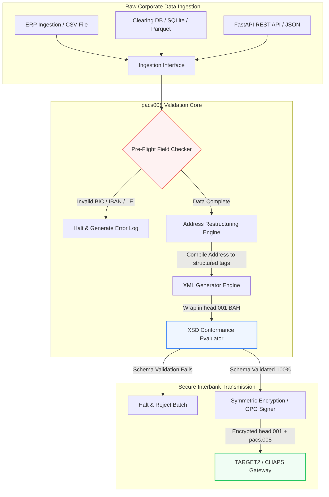

---

# Front Matter (YAML)

author: "contact@sebastienrousseau.com (Sebastien Rousseau)"
banner_alt: "Сотрудник офиса с голосовым ассистентом и ноутбуком — символ структурированных машиночитаемых сообщений межбанковских платежей, которые автоматизация pacs.008 делает программируемыми"
banner_height: "1597"
banner_width: "2584"
banner: "https://cloudcdn.pro/stocks/images/tyler-prahm-lmV3gJSAgbo.webp"
cdn: "https://cloudcdn.pro"
charset: "UTF-8"
cname: "sebastienrousseau.com"
copyright: "© Copyright 2025 - 2026 - Sebastien Rousseau. All rights reserved."
date: "June 15, 2026"
description: "Pacs008 — открытая Python-библиотека для автоматизации генерации и валидации сообщений ISO 20022 pacs.008 FI-to-FI клиентского кредитового перевода: структурированные адреса, обёртка BAH head.001, контрольные суммы BIC/LEI/IBAN, OpenTelemetry-трассировка UETR — под срок SWIFT в ноябре 2026 года."
format-detection: "telephone=no"
hreflang: "ru"
icon: "https://cloudcdn.pro/clients/sebastienrousseau/v1/logos/sebastienrousseau.svg"
id: "https://sebastienrousseau.com/2026-06-15-pacs008-automation-iso-20022-interbank-payments-2026"
image_alt: "Чёрно-белый портрет Себастьяна Руссо"
image_height: "162"
image_width: "162"
image: "https://cloudcdn.pro/stocks/images/sebastien-rousseau.png"
keywords: "pacs008, ISO 20022 pacs.008, FI-to-FI клиентский кредитовый перевод, структурированный адрес, SWIFT CBPR+, BAH head.001, TARGET2, CHAPS, Fedwire, DORA, BCBS 239, Basel III, UETR, валидация LEI, SEPA VoP"
language: "ru-RU"
last_reviewed: "2026-06-15"
layout: "report"
locale: "ru_RU"
logo_alt: "Логотип Себастьяна Руссо"
logo_height: "44"
logo_width: "44"
logo: "https://cloudcdn.pro/clients/sebastienrousseau/v1/logos/sebastienrousseau.svg"
menu: ""
measurementID: "G-169G4ET5HQ"
name: "Sebastien Rousseau"
permalink: "https://sebastienrousseau.com/2026-06-15-pacs008-automation-iso-20022-interbank-payments-2026"
rating: "general"
referrer: "no-referrer"
robots: "index, follow"
schema: "FAQPage, Article"
seo_title: "Автоматизация pacs.008 для эпохи ISO 20022"
short_name: "sebastienrousseau"
subtitle: "Сообщение pacs.008 — точка встречи данных межбанковских платежей, структурированных адресов, комплаенса, маршрутизации и операций по расчётам."
tags: "pacs008, ISO 20022, межбанковские платежи, оптовые платежи, Python"
theme-color: "0, 83, 191"
title: "Автоматизация pacs.008 для межбанковской эпохи ISO 20022 в 2026 году"
url: "https://sebastienrousseau.com/2026-06-15-pacs008-automation-iso-20022-interbank-payments-2026"
viewport: "width=device-width, initial-scale=1, shrink-to-fit=no"

# RSS - The RSS feed front matter (YAML).
atom_link: "https://sebastienrousseau.com/2026-06-15-pacs008-automation-iso-20022-interbank-payments-2026/rss.xml"
category: "Finance"
docs: https://validator.w3.org/feed/docs/rss2.html
generator: "Static Site Generator (SSG) (version 0.0.26)"
item_description: "pacs008 предоставляет открытую Python-основу для автоматизации сообщений ISO 20022 FI-to-FI клиентского кредитового перевода в эпоху межбанковских платежей."
item_guid: "https://sebastienrousseau.com/2026-06-15-pacs008-automation-iso-20022-interbank-payments-2026/rss.xml"
item_link: "https://sebastienrousseau.com/2026-06-15-pacs008-automation-iso-20022-interbank-payments-2026/rss.xml"
item_pub_date: "Mon, 15 Jun 2026 06:06:06 +0000"
item_title: "Автоматизация pacs.008 для межбанковской эпохи ISO 20022 в 2026 году"
last_build_date: "Mon, 15 Jun 2026 06:06:06 +0000"
managing_editor: "contact@sebastienrousseau.com (Sebastien Rousseau)"
pub_date: "Mon, 15 Jun 2026 06:06:06 +0000"
ttl: "60"
type: "article"
webmaster: "contact@sebastienrousseau.com"

# Apple - The Apple front matter (YAML).
apple_mobile_web_app_orientations: "portrait"
apple_touch_icon_sizes: "192x192"
apple-mobile-web-app-capable: "yes"
apple-mobile-web-app-status-bar-inset: "black"
apple-mobile-web-app-status-bar-style: "black-translucent"
apple-mobile-web-app-title: "Автоматизация pacs.008 для ISO 20022"
apple-touch-fullscreen: "yes"

# MS Application - The MS Application front matter (YAML).

msapplication-navbutton-color: "0, 83, 191"

# Twitter Card - The Twitter Card front matter (YAML).

twitter_card: "summary_large_image"
twitter_creator: "@wwdseb"
twitter_description: "pacs008 предоставляет открытую Python-основу для автоматизации сообщений ISO 20022 FI-to-FI клиентского кредитового перевода в эпоху межбанковских платежей."
twitter_image: "https://cloudcdn.pro/clients/sebastienrousseau/v1/logos/sebastienrousseau.svg"
twitter_image_alt: "Логотип Себастьяна Руссо"
twitter_site: "@wwdseb"
twitter_title: "Автоматизация pacs.008 для эпохи ISO 20022"
twitter_url: "https://sebastienrousseau.com/2026-06-15-pacs008-automation-iso-20022-interbank-payments-2026"

excerpt: "pacs008 — открытый Python-инструментарий, делающий программируемыми сообщения ISO 20022 FI-to-FI клиентского кредитового перевода: структурированные адреса, валидация, маршрутизация, точки расширения для комплаенса и срок SWIFT в ноябре 2026 года — встроены по умолчанию."

# Humans.txt - The Humans.txt front matter (YAML).
author_website: "https://sebastienrousseau.com"
author_twitter: "@wwdseb"
author_location: "London, UK"
thanks: "Спасибо за прочтение!"
site_last_updated: "2026-06-15"
site_standards: "HTML5, CSS3, RSS, Atom, JSON, XML, YAML, Markdown, TOML"
site_components: "Kaishi, Kaishi Builder, Kaishi CLI, Kaishi Templates, Kaishi Themes"
site_software: "Static Site Generator, Rust"

---

# Автоматизация межбанковских платежей ISO 20022 pacs.008 на открытом Python в 2026 году

<!-- lead-start -->
<aside class="post-lead" aria-label="Краткое содержание статьи">

<strong>Кратко.</strong> По правилам SWIFT CBPR+ 14 ноября 2026 года наступает «обрыв структурированного адреса»: TARGET2, CHAPS, Fedwire, Lynx и SEPA выводят из обращения неструктурированные почтовые адреса. Pacs008 — открытая Python-библиотека, автоматизирующая генерацию и валидацию сообщений ISO 20022 FI-to-FI клиентского кредитового перевода (pacs.008), оборачивающая платежи в Business Application Header (BAH head.001) и встраивающая соответствие требованиям по структурированному адресу в путь данных ещё до того, как сообщение коснётся клиринговой сети.

<strong>Ключевые выводы</strong>

<ul class="post-lead-takeaways">
  <li><strong>Срок по структурированному адресу абсолютен.</strong> После 14 ноября 2026 года неструктурированные адресные блоки выводятся из обращения. Pacs008 принудительно применяет структурированные элементы почтового адреса (<code>&lt;TwnNm&gt;</code>, <code>&lt;Ctry&gt;</code>, <code>&lt;PstCd&gt;</code>) на этапе компиляции данных, предотвращая отказы на границе сети.</li>
  <li><strong>Единая оркестрация сообщений.</strong> Базовая полезная нагрузка pacs.008 оборачивается в совместимый конверт Business Application Header (head.001), что задаёт стандартную модель обработки в обе стороны.</li>
  <li><strong>Алгоритмическая целостность.</strong> Встроенные валидаторы для BIC и Legal Entity Identifier (LEI) с расчётом контрольных сумм по ISO 7064 Modulo 97-10.</li>
  <li><strong>Прослеживаемость уровня DORA.</strong> Полная инструментация OpenTelemetry с ключом по Unique End-to-End Transaction Reference (UETR) — для журналов аудита в реальном времени и криптографических аудиторских подписей.</li>
  <li><strong>Сохранение фидуциарной ответственности на уровне правления.</strong> Точность межбанковских сообщений увязана со статьёй 5 DORA, отчётностью BCBS 239 и экономией капитала по операционному риску в рамках Basel III.</li>
</ul>

<strong>Связанные материалы:</strong> <a href="https://sebastienrousseau.com/2026-05-19-global-wholesale-payments-economics-2026">Глобальные оптовые платежи в 2026 году: ISO 20022, обновление RTGS и экономика интероперабельности</a>, <a href="https://sebastienrousseau.com/2026-05-27-ai-operating-system-payments-fraud-routing-resilience-compliance-2026">ИИ как операционная система платежей: фрод, маршрутизация, отказоустойчивость и комплаенс в 2026 году</a>, <a href="https://sebastienrousseau.com/2026-05-12-iso-20022-pacs008-structured-address-deadline">Срок структурированного адреса pacs.008 в ноябре 2026 года: взгляд за шесть месяцев</a>.

</aside>
<!-- lead-end -->

Мост между устаревшими финансовыми данными и структурированной межбанковской передачей сообщений — через аудируемый, валидируемый по схеме Python-конвейер.

Открытая референсная точка для этой статьи — [pacs008 ⧉](https://github.com/sebastienrousseau/pacs008 "pacs008 — открытая Python-библиотека"). Репозиторий позиционируется как Python-библиотека для автоматизации XML-сообщений ISO 20022 pacs.008 FI-to-FI клиентского кредитового перевода.

## Почему этот открытый проект важен в 2026 году

Глобальная инфраструктура клиринга межбанковских платежей переживает самую глубокую модернизацию почти за полвека.

В июне 2026 года финансовый сектор стремительно приближается к **«обрыву структурированного адреса» SWIFT 14 ноября 2026 года**. С этой даты правила SWIFT CBPR+, а также TARGET2, CHAPS, Fedwire и канадский Lynx официально выводят из обращения неструктурированные строки почтового адреса (использующие только `<AdrLine>` внутри блоков `<PstlAdr>`). Все участвующие финансовые институты обязаны передавать адреса либо в гибридном формате (структурированные `<TwnNm>` и `<Ctry>` с не более чем двумя элементами `<AdrLine>` для оставшихся деталей), либо в полностью структурированном формате (отдельные элементы для названия улицы, номера здания и почтового индекса). Любое сообщение, не отвечающее этому критерию, будет отклонено на границе сети.

Для финансовых институтов этот переход создаёт серьёзные операционные ограничения:

1. **Штраф за пограничный отказ.** Платежи, не отвечающие критериям структурированного адреса, столкнутся с немедленными отказами сети, что приведёт к транзакционным задержкам, блокировкам ликвидности и операционным «хвостам».
2. **SEPA Verification of Payee (VoP).** Обязывает все платёжные сервис-провайдеры (PSP) в зоне SEPA проверять соответствие имени получателя и IBAN до выполнения кредитового перевода, добавляя ещё один валидационный шлюз на этапе инициации сообщения.

[Pacs008](https://github.com/sebastienrousseau/pacs008) решает эту задачу. Это открытая лёгкая Python-библиотека, автоматизирующая преобразование сырых финансовых данных в полностью валидированные и совместимые со схемой сообщения ISO 20022 pacs.008 межбанковского клиентского кредитового перевода. Закрывая разрыв между устаревшими и структурированными данными, pacs008 обеспечивает высокую отдачу на отказоустойчивость (Return on Resilience, RoR), сохраняет оборотный капитал и обеспечивает исполнение в реальном времени по глобальным рельсам.

## Архитектурная призма pacs008 в 2026 году

Библиотека pacs008 устроена как изолированный движок валидации и генерации: сырые входные данные систематически разбираются, обогащаются и оборачиваются в стандартные конверты.

| Слой | Архитектурное решение | Почему это важно | Риск при ошибке |
|---|---|---|---|
| **Входной слой** | Приём CSV, JSON, SQLite и Parquet | Встречает команды банковской интеграции там, где уже живут их данные, без миграций платформы. | Приём сырых, невалидированных или испорченных полезных нагрузок. |
| **Слой валидации** | Предварительная валидация по официальным XSD-схемам и кастомным бизнес-правилам | Останавливает выполнение и фиксирует ошибки до отправки платёжного файла в клиринговую сеть. | Некорректные XML-файлы вызывают немедленные отказы сети и задержки клиринга. |
| **Слой конверта BAH** | Автоматическая обёртка Business Application Header (head.001) | Стандартизирует диспетчеризацию и маршрутизацию сообщений по тегу `<MsgDefIdr>`. | Передача сырых pacs.008-нагрузок без обязательного внешнего конверта приводит к отказу систем. |
| **Слой сериализации** | Поддержка стандартного XML и ISO-совместимого JSON (TS 23029) | Обеспечивает прямой перевод между XML- и JSON-нагрузками, поддерживая современные REST API и потоковую передачу через Kafka. | Фрагментированные представления данных, нарушающие официальные правила ISO. |
| **Слой наблюдаемости** | OpenTelemetry-трассировка с ключом по UETR | Фиксирует подробные пути выполнения и логи, обеспечивая аудируемость в реальном времени. | Пробелы в трассировке блокируют операционную видимость и аудит. |

## Ключевые межбанковские сигналы и регуляторные вехи

Чтобы продемонстрировать операционную устойчивость транзакций, старшие технологические менеджеры и руководители по риску должны отслеживать конкретные, количественно измеряемые показатели соответствия:

| Сигнал | Метрика / операционный бенчмарк | Источник G20 / SWIFT / DORA | Реализация на технической платформе |
|---|---|---|---|
| **Соответствие по структурированному адресу** | % сообщений pacs.008, использующих полностью структурированные поля `<PstlAdr>` с обязательными `<TwnNm>` и `<Ctry>`. | Срок SWIFT SR 2026 | Предварительные проверки схемы в pacs008 отклоняют неструктурированные адресные строки. |
| **SEPA Verification of Payee** | Валидация соответствия имени получателя и IBAN до выполнения сообщения. | Регулирование SEPA VoP | Встроенные VoP-классы-помощники выполняют предварительные запросы по IBAN/BIC. |
| **Интеграция BAH head.001** | Доля исходящих платёжных нагрузок, успешно обёрнутых в Business Application Header. | Правила TARGET2 / CBPR+ | Подсистема обёртки BAH автоматически собирает внешний XML-конверт. |
| **Контрольная сумма LEI по Modulo** | Валидация контрольной цифры по ISO 7064 Modulo 97-10 на блоках `<LEI>` дебитора и кредитора. | Мандат Банка Англии | Алгоритмическая проверка целостности 20-символьного идентификатора. |
| **Точность отслеживания UETR** | 100 % сгенерированных платежей снабжены валидным Unique End-to-End Transaction Reference. | Спецификации SWIFT UETR | Автоматическая генерация и трассировка 36-символьного UUIDv4-кода. |

## Почему Python — идеальная точка входа для межбанковской автоматизации

Современные платёжные хабы и команды казначейских операций в 2026 году активно опираются на Python для трансформации данных, финансового моделирования и интеграции с базами ERP.

Использование открытой Python-библиотеки даёт институтам значимые преимущества:

1. **Низкая когнитивная нагрузка и высокая интероперабельность.** Python работает как связующий мост. Он позволяет разработчикам писать простые скрипты, забирающие сырые платёжные поручения из устаревших баз, валидирующие их по сложным международным банковским правилам и выдающие совместимый XML в рамках единого рабочего процесса.
2. **Устранение непрозрачных «чёрных ящиков» — трансляторов.** Проприетарные банковские порталы нередко берут высокие лицензионные сборы за кастомные трансляторы платёжных файлов. Эти трансляторы — проприетарные чёрные ящики; командам безопасности невозможно проаудировать, как обрабатываются данные и где хранятся ключи. Открытая инспектируемая библиотека вроде pacs008 обеспечивает полную прозрачность кода.
3. **Бесшовная интеграция в CI/CD.** Pacs008 встраивается прямо в конвейеры непрерывной интеграции и развёртывания, позволяя разработчикам автоматизировать тестирование платёжных файлов в рамках стандартного цикла поставки ПО.

## Проектирование ограниченного межбанковского конвейера

Серьёзная уязвимость межбанковского клиринга — «неконтролируемая пакетная генерация»: файлы создаются без чёткого, ограниченного цикла верификации. Pacs008 спроектирован как центральный валидационный движок внутри строго контролируемого многоэтапного транзакционного конвейера.

Операционный поток ниже показывает, как сырые транзакционные данные проходят через конвейер pacs008 и формируют криптографически защищённый, совместимый со схемой файл pacs.008, обёрнутый в конверт BAH:

## Книга действий для правления и фидуциарная ответственность

Автоматизация межбанковских платежей — вопрос риск-менеджмента и корпоративного управления уровня совета директоров. Старшие руководители обязаны рассматривать качество транзакционных данных через призму фидуциарной ответственности и снижения операционного риска:

- **Статья 5 DORA (ответственность совета директоров).** Возлагает прямую персональную ответственность на членов совета за устойчивость и безопасность ИКТ-операций института. Поскольку межбанковский клиринг — критическая корпоративная функция, советы директоров обязаны демонстрировать наличие надёжных, валидированных и автоматизированных транзакционных контролей, предотвращающих операционные сбои и задержки платежей.
- **BCBS 239 (агрегация и отчётность по рисковым данным).** Требует, чтобы отчётность по финансовым транзакциям была точной, полной и формировалась в реальном времени. Pacs008 помогает институтам соответствовать BCBS 239, гарантируя, что платёжные данные структурированы и валидированы в источнике, устраняя пробелы в данных и ошибки ручной сверки, свойственные устаревшим таблицам.
- **Снижение требований к капиталу по операционному риску (Basel III).** По правилам Basel III высокий уровень ошибок в платежах и нагрузка ручных вмешательств повышают требования к капиталу банка по операционному риску, связывая капитал, который иначе мог бы пойти на кредитование или инвестиции. Автоматизация платёжного конвейера напрямую сокращает эти капитальные надбавки и сохраняет балансовую стоимость.

## Что это означает по типам банков

### Глобальные системно значимые банки (G-SIB)

G-SIB управляют огромными трансграничными объёмами корпоративных транзакций. Их главный вызов — восстановление неструктурированных устаревших данных до того, как они попадут в клиринговую сеть. Встроив pacs008 в свои корпоративные банковские шлюзы, G-SIB могут предоставлять автоматизированные утилиты валидации корпоративным клиентам, снижая нагрузку на ручные «починки» платежей и обеспечивая исполнение в реальном времени по сети SWIFT.

### Транзакционные и корпоративные банки

Для транзакционных банков качество платёжных данных — конкурентное преимущество. Предлагая корпоративным казначейским клиентам открытый инспектируемый инструмент валидации вроде pacs008, эти банки могут ускорить онбординг, снизить долю отказов по платёжным файлам и укрепить доверие клиентов за счёт более высоких показателей сквозной обработки.

### Региональные и более мелкие банки

Региональные банки обязаны соответствовать международным платёжным стандартам без многомиллиардных технологических бюджетов G-SIB. Pacs008 предлагает лёгкое, экономически эффективное и полностью совместимое решение на Python, позволяя меньшим институтам предоставлять современные структурированные сервисы инициации платежей без дорогих лицензий проприетарного middleware.

## Заключение: дорожная карта межбанковского клиринга

Срок SWIFT по структурированному адресу в ноябре 2026 года — жёсткая граница для корпоративных казначейских операций. Опора на устаревшие таблицы, ручной ввод данных и неструктурированные платёжные файлы — активный бизнес-риск.

Чтобы обеспечить непрерывность транзакций и снизить операционные накладные расходы, старшие технологические и финансовые руководители уже сегодня должны выполнить чёткую клиринговую дорожную карту:

1. **Внедрите валидацию в источнике.** Обязуйте проверять и форматировать все платёжные поручения по официальным XSD-схемам ISO 20022 до того, как они покинут границы корпоративного ERP.
2. **Проведите аудит конвейера данных.** Уйдите от ручной обработки таблиц и внедрите автоматизированные инспектируемые рабочие процессы на Python с использованием pacs008.
3. **Реализуйте гибридную безопасность.** Сгенерированные платёжные файлы должны быть криптографически подписаны и зашифрованы до передачи — это удовлетворяет ожиданиям сети zero-trust.
4. **Согласуйте с фидуциарными приоритетами.** Формально докладывайте совету директоров метрики автоматизации платежей и качества данных, представляя инвестиции как критически важную программу снижения операционного риска в рамках DORA.

## Часто задаваемые вопросы

**Соответствует ли pacs008 предстоящим правилам SWIFT SR 2026 по адресам?**

Да. Pacs008 спроектирован под жёсткую веху SWIFT по структурированному адресу в ноябре 2026 года: он принудительно разделяет элементы почтового адреса (город, страна, индекс) по обязательным XML-полям ISO 20022.

**Может ли pacs008 оборачивать платёжные нагрузки в Business Application Header?**

Да. Pacs008 нативно поддерживает обёртку Business Application Header (BAH head.001) и автоматически собирает внешний конверт, требуемый сетями TARGET2, CHAPS и CBPR+.

**Почему открытая библиотека предпочтительнее проприетарных трансляторов файлов?**

Проприетарные трансляторы — непрозрачные чёрные ящики, аудит безопасности по ним невозможен. Открытая, рецензируемая сообществом библиотека вроде pacs008 обеспечивает полную прозрачность кода: команды безопасности могут убедиться, что чувствительные платёжные данные не раскрываются во время обработки.

**Какие идентификаторы валидирует pacs008?**

Pacs008 поставляется со встроенными валидаторами Bank Identifier Code (BIC) и Legal Entity Identifier (LEI) на базе расчётов контрольных сумм по ISO 7064 Modulo 97-10, а также с проверкой контрольной цифры IBAN и проверкой уникальности UETR.

## Источники

- SWIFT, (2024). *ISO 20022 November 2026 Structured Address Milestone*. La Hulpe: SWIFT. Доступно по адресу: [Веха SWIFT ISO 20022 ⧉](https://www.swift.com/standards/iso-20022/iso-20022-bytes/call-action-november-2026 "Веха SWIFT ISO 20022").
- Basel Committee on Banking Supervision (BCBS), (2013). *Principles for effective risk data aggregation and risk reporting (BCBS 239)*. Basel: Bank for International Settlements. Доступно по адресу: [Принципы BCBS 239 ⧉](https://www.bis.org/publ/bcbs239.htm "Принципы BCBS 239").
- European Parliament and Council of the European Union, (2022). *Regulation (EU) 2022/2554 on digital operational resilience for the financial sector (DORA)*. Brussels: Official Journal of the European Union. Доступно по адресу: [Регламент DORA ⧉](https://eur-lex.europa.eu/legal-content/EN/TXT/?uri=CELEX%3A32022R2554 "Регламент DORA").
- GitHub, (2026). *Открытый репозиторий pacs008*. Доступно по адресу: [Репозиторий pacs008 ⧉](https://github.com/sebastienrousseau/pacs008 "Репозиторий pacs008").

<!-- enrich-start -->
<aside class="author-card" aria-label="Об авторе"><strong class="author-card-name"><a href="/about/index.html">Sebastien Rousseau</a></strong>Старший банковский технолог, пишет о прикладном ИИ, миграции на ISO 20022, постквантовой криптографии для финансовых сервисов и структурной трансформации оптовых платежей.Более 20 лет в HSBC Commercial &amp; Investment Bank, PayPal, Barclays, Shazam, AKQA, Virgin Group. <a href="/about/index.html">Полный профиль</a> &middot; <a href="https://www.linkedin.com/in/sebastienrousseau/" rel="external noopener">LinkedIn</a> &middot; <a href="https://github.com/sebastienrousseau" rel="external noopener">GitHub</a></aside>

Последняя проверка <time datetime="2026-06-15">2026-06-15</time>.

<aside class="related-posts" aria-labelledby="related-heading">
<h2 id="related-heading" class="related-heading">Связанные материалы</h2>

<article class="related-card"><footer class="related-body"><h3><a href="https://sebastienrousseau.com/2026-05-19-global-wholesale-payments-economics-2026">Глобальные оптовые платежи в 2026 году: ISO 20022, обновление RTGS и экономика интероперабельности</a></h3>
<time datetime="2026-05-19">2026-05-19</time>
</footer></article>
<article class="related-card"><footer class="related-body"><h3><a href="https://sebastienrousseau.com/2026-05-27-ai-operating-system-payments-fraud-routing-resilience-compliance-2026">ИИ как операционная система платежей: фрод, маршрутизация, отказоустойчивость и комплаенс в 2026 году</a></h3>
<time datetime="2026-05-27">2026-05-27</time>
</footer></article>
<article class="related-card"><footer class="related-body"><h3><a href="https://sebastienrousseau.com/2026-05-12-iso-20022-pacs008-structured-address-deadline">Срок структурированного адреса pacs.008 в ноябре 2026 года: взгляд за шесть месяцев</a></h3>
<time datetime="2026-05-12">2026-05-12</time>
</footer></article>

</aside>
<!-- enrich-end -->
