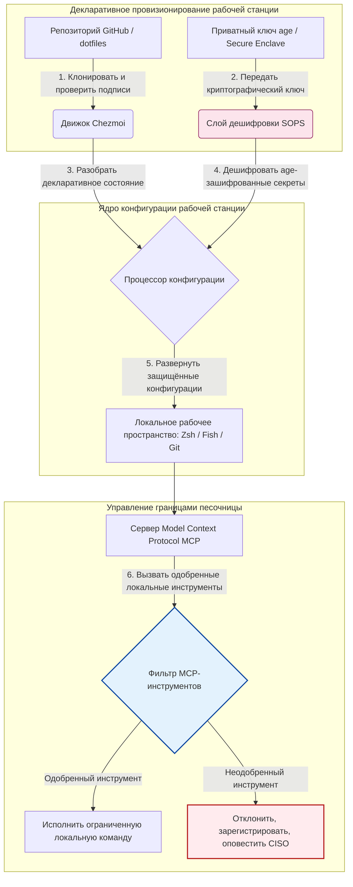

---

# Front Matter (YAML)

author: "contact@sebastienrousseau.com (Sebastien Rousseau)"
banner_alt: "Рабочая станция разработчика в приглушённом свете — символ AI-осознанных, воспроизводимых и защищённых dotfiles для MCP-серверов, подписи SLSA, секретов age/SOPS и многооболочечного паритета"
banner_height: "1597"
banner_width: "2584"
banner: "https://cloudcdn.pro/stocks/images/almas-salakhov-Vq2ap8aFFEs.webp"
cdn: "https://cloudcdn.pro"
charset: "UTF-8"
cname: "sebastienrousseau.com"
copyright: "© Copyright 2025 - 2026 - Sebastien Rousseau. All rights reserved."
date: "June 16, 2026"
description: "AI-осознанные dotfiles — это паттерн защищённой воспроизводимой рабочей станции эпохи MCP: декларативная конфигурация через Chezmoi, секреты SOPS/age, происхождение SLSA Level 3, многооболочечный паритет и ограниченные границы песочницы для локальных ИИ-агентов."
format-detection: "telephone=no"
hreflang: "ru"
icon: "https://cloudcdn.pro/clients/sebastienrousseau/v1/logos/sebastienrousseau.svg"
id: "https://sebastienrousseau.com/2026-06-16-ai-aware-dotfiles-secure-reproducible-workstation-2026"
image_alt: "Чёрно-белый портрет Себастьяна Руссо"
image_height: "162"
image_width: "162"
image: "https://cloudcdn.pro/stocks/images/sebastien-rousseau.png"
keywords: "dotfiles, Chezmoi, MCP, Model Context Protocol, SLSA, SOPS, шифрование age, декларативная конфигурация, рабочая станция разработчика, DORA статья 5, NIST CSF 2.0, безопасность цепочки поставок, агентный ИИ, многооболочечный паритет, Zsh, Fish, Nushell"
language: "ru-RU"
last_reviewed: "2026-06-16"
layout: "report"
locale: "ru_RU"
logo_alt: "Логотип Себастьяна Руссо"
logo_height: "44"
logo_width: "44"
logo: "https://cloudcdn.pro/clients/sebastienrousseau/v1/logos/sebastienrousseau.svg"
menu: ""
measurementID: "G-169G4ET5HQ"
name: "Sebastien Rousseau"
permalink: "https://sebastienrousseau.com/2026-06-16-ai-aware-dotfiles-secure-reproducible-workstation-2026"
rating: "general"
referrer: "no-referrer"
robots: "index, follow"
schema: "FAQPage, Article"
seo_title: "AI-осознанные dotfiles для защищённой рабочей станции"
short_name: "sebastienrousseau"
subtitle: "Рабочая станция разработчика стала частью цепочки поставок ИИ; dotfiles требуют безопасности, воспроизводимости, гигиены секретов и MCP-осознанных рабочих процессов."
tags: "dotfiles, инструменты разработчика, MCP, SLSA, защищённая рабочая станция, chezmoi, macOS, Linux, WSL"
theme-color: "0, 83, 191"
title: "AI-осознанные dotfiles 2026: защищённая воспроизводимая рабочая станция для MCP, SLSA и многооболочечного паритета"
url: "https://sebastienrousseau.com/2026-06-16-ai-aware-dotfiles-secure-reproducible-workstation-2026"
viewport: "width=device-width, initial-scale=1, shrink-to-fit=no"

# RSS - The RSS feed front matter (YAML).
atom_link: "https://sebastienrousseau.com/2026-06-16-ai-aware-dotfiles-secure-reproducible-workstation-2026/rss.xml"
category: "Technology"
docs: https://validator.w3.org/feed/docs/rss2.html
generator: "Static Site Generator (SSG) (version 0.0.26)"
item_description: "Обзор декларативных dotfiles для защищённой воспроизводимой рабочей станции разработчика на macOS, Linux и WSL — с MCP-осознанностью, SLSA, age, SOPS и многооболочечным паритетом."
item_guid: "https://sebastienrousseau.com/2026-06-16-ai-aware-dotfiles-secure-reproducible-workstation-2026/rss.xml"
item_link: "https://sebastienrousseau.com/2026-06-16-ai-aware-dotfiles-secure-reproducible-workstation-2026/rss.xml"
item_pub_date: "Tue, 16 Jun 2026 06:06:06 +0000"
item_title: "AI-осознанные dotfiles 2026: защищённая воспроизводимая рабочая станция для MCP, SLSA и многооболочечного паритета"
last_build_date: "Tue, 16 Jun 2026 06:06:06 +0000"
managing_editor: "contact@sebastienrousseau.com (Sebastien Rousseau)"
pub_date: "Tue, 16 Jun 2026 06:06:06 +0000"
ttl: "60"
type: "article"
webmaster: "contact@sebastienrousseau.com"

# Apple - The Apple front matter (YAML).
apple_mobile_web_app_orientations: "portrait"
apple_touch_icon_sizes: "192x192"
apple-mobile-web-app-capable: "yes"
apple-mobile-web-app-status-bar-inset: "black"
apple-mobile-web-app-status-bar-style: "black-translucent"
apple-mobile-web-app-title: "AI-осознанные dotfiles для защищённой рабочей станции"
apple-touch-fullscreen: "yes"

# MS Application - The MS Application front matter (YAML).

msapplication-navbutton-color: "0, 83, 191"

# Twitter Card - The Twitter Card front matter (YAML).

twitter_card: "summary_large_image"
twitter_creator: "@wwdseb"
twitter_description: "Обзор декларативных dotfiles для защищённой воспроизводимой рабочей станции разработчика на macOS, Linux и WSL — с MCP-осознанностью, SLSA, age, SOPS и многооболочечным паритетом."
twitter_image: "https://cloudcdn.pro/clients/sebastienrousseau/v1/logos/sebastienrousseau.svg"
twitter_image_alt: "Логотип Себастьяна Руссо"
twitter_site: "@wwdseb"
twitter_title: "AI-осознанные dotfiles для защищённой рабочей станции"
twitter_url: "https://sebastienrousseau.com/2026-06-16-ai-aware-dotfiles-secure-reproducible-workstation-2026"

excerpt: "AI-осознанные dotfiles в 2026 году трактуют рабочую станцию разработчика как инфраструктуру цепочки поставок — декларативная конфигурация под управлением chezmoi, MCP-осознанность, релизы с подписью SLSA, секреты age/SOPS, субсекундный запуск и паритет macOS/Linux/WSL."

# Humans.txt - The Humans.txt front matter (YAML).
author_website: "https://sebastienrousseau.com"
author_twitter: "@wwdseb"
author_location: "London, UK"
thanks: "Спасибо за прочтение!"
site_last_updated: "2026-06-16"
site_standards: "HTML5, CSS3, RSS, Atom, JSON, XML, YAML, Markdown, TOML"
site_components: "Kaishi, Kaishi Builder, Kaishi CLI, Kaishi Templates, Kaishi Themes"
site_software: "Static Site Generator, Rust"

---

# AI-осознанные dotfiles 2026: защищённая воспроизводимая рабочая станция для MCP, SLSA и многооболочечного паритета

<!-- lead-start -->
<aside class="post-lead" aria-label="Краткое содержание статьи">

<strong>Кратко.</strong> Рабочая станция разработчика больше не просто конечная точка; это активный участник цепочки поставок программного обеспечения и прямой интерфейс к локальной плоскости управления ИИ. Терминальные ИИ-ассистенты и серверы <a href="https://modelcontextprotocol.io">Model Context Protocol (MCP)</a> исполняют локальные команды оболочки, инспектируют репозитории и читают чувствительные файлы конфигурации напрямую. <a href="https://github.com/sebastienrousseau/dotfiles">Dotfiles Себастьяна Руссо</a> — декларативный open-source-фреймворк, который собирает защищённые воспроизводимые рабочие станции на macOS, Linux и Windows Subsystem for Linux (WSL), интегрируя <a href="https://www.chezmoi.io/">Chezmoi</a>, <a href="https://github.com/getsops/sops">SOPS, age</a> и происхождение сборки SLSA Level 3 для изоляции секретов с памятебезопасностью и ограниченных путей исполнения для локальных моделей ИИ.

<strong>Ключевые выводы</strong>

<ul class="post-lead-takeaways">
  <li><strong>Рабочие станции — это инфраструктура цепочки поставок.</strong> Конфигурации сред разработки должны управляться с той же декларативной строгостью, что и развёртывания продуктивных серверов, устраняя дрейф ручной настройки.</li>
  <li><strong>Вызов плоскости управления ИИ.</strong> Терминальные модели ИИ и MCP-инструменты могут обращаться к локальным каталогам. Dotfiles обязаны навязывать ограниченные границы песочницы, строгие списки разрешённых инструментов и неизменяемые локальные журналы, чтобы предотвратить утечку данных.</li>
  <li><strong>Абсолютный кроссплатформенный паритет.</strong> Идентичная субсекундная производительность оболочки и идентичные профили безопасности на macOS, Linux (Zsh, Fish, Nushell) и WSL, сокращающие время онбординга разработчика с недель до минут.</li>
  <li><strong>Криптографически защищённая изоляция секретов.</strong> Шифрование файлов SOPS и age не даёт жёстко прописанным учётным данным (токены GitHub, ключи доступа к облаку) попасть в Git или быть прочитанными локальными LLM.</li>
  <li><strong>Фидуциарная ценность на уровне правления.</strong> Переводит комплаенс конфигурации рабочей станции в чёткие приоритеты совета директоров, поддерживая DORA статья 5, стандарты конечных точек NIST CSF 2.0 и снижение операционного риска Basel III.</li>
</ul>

<strong>По теме:</strong> <a href="https://sebastienrousseau.com/2026-05-23-agentic-payments-banking-consent-liability-new-payment-ux-2026">Агентные платежи в банкинге: согласие, ответственность и новый UX платежей в 2026 году</a>, <a href="https://sebastienrousseau.com/2024-03-12-revolutionising-real-time-speech-recognition-on-macos-with-openai-whisper/index.html">Быстрое распознавание речи в реальном времени на macOS: OpenAI Whisper</a>, <a href="https://sebastienrousseau.com/2024-02-26-google-gemma-ai-transforming-open-source-ai-development/index.html">Google Gemma AI: трансформация open-source-разработки ИИ</a>.

</aside>
<!-- lead-end -->

Мост между декларативной конфигурацией рабочей станции и защищёнными цепочками поставок программного обеспечения в эпоху локальных моделей ИИ и агентных инструментов разработчика.

Эталонной open-source-точкой для этой статьи служит [dotfiles ⧉](https://github.com/sebastienrousseau/dotfiles "dotfiles — декларативная конфигурация рабочей станции"). Репозиторий позиционируется как: декларативные dotfiles для macOS, Linux и WSL с многооболочечным паритетом, субсекундным запуском, релизами с подписью SLSA и конфигурацией, осознающей ИИ/MCP.

## Почему этот open-source-проект важен в 2026 году

В июне 2026 года рабочая станция разработчика — самое слабое звено цепочки поставок программного обеспечения и высокоценная цель для изощрённых государственных и криминальных киберсиндикатов.

Среда безопасности разработки радикально сместилась с появлением терминальных ИИ-ассистентов программирования (таких как Claude Code) и принятием Model Context Protocol (MCP). Локальные терминалы разработчиков теперь хостят активные автономные ИИ-агенты, способные:

- Читать и редактировать локальные исходные файлы.
- Вызывать локальные CLI-инструменты (`git`, `npm`, `aws`, `kubectl`).
- Инспектировать переменные окружения оболочки, локальные базы данных и настройки конфигурации.

Если локальная среда разработчика лишена строгих границ, эти автономные ИИ-инструменты могут непреднамеренно прочитать чувствительные персональные данные, утечь облачные учётные данные в публичные LLM-API или исполнить вредоносные пакеты во время автоматических сборок.

В рамках Digital Operational Resilience Act (DORA) и NIST Cybersecurity Framework (CSF) 2.0 финансовые институты юридически обязаны проверять происхождение и целостность безопасности каждого устройства, обращающегося к цепочке поставок программного обеспечения. «Ноутбуки-снежинки» — настроенные вручную, неаудируемые, дрейфующие конфигурации — больше не соответствуют глобальным банковским стандартам.

[Dotfiles Себастьяна Руссо](https://github.com/sebastienrousseau/dotfiles) решают эту проблему. Это open-source-фреймворк декларативного управления рабочей станцией, который устанавливает защищённые воспроизводимые рабочие станции разработчика. Навязывая стандартизированную аудируемую базовую конфигурацию, проект обеспечивает высокую Return on Resilience (RoR), сокращая время онбординга разработчика с недель до часов и защищая чувствительные финансовые цепочки поставок от уязвимостей конечных точек.

## Архитектурный ракурс AI-осознанной рабочей станции 2026

Фреймворк dotfiles работает как защищённый декларативный менеджер среды — все локальные оболочки, инструменты и секреты систематически управляются, аудируются и изолируются:

| Слой | Проектное решение | Почему это важно | Риск при ошибке |
|---|---|---|---|
| **Слой провизионирования** | Декларативное управление конфигурацией через Chezmoi | Собирает полностью воспроизводимые рабочие станции на macOS, Linux и WSL, устраняя дрейф. | «Снежиночные» конфигурации с неаудируемыми уязвимыми локальными состояниями. |
| **Слой оболочек** | Многооболочечный паритет (Zsh, Fish, Nushell) | Обеспечивает идентичный субсекундный запуск и согласованное поведение алиасов в разных средах. | Несогласованность команд оболочки, приводящая к непредсказуемым результатам скриптов. |
| **Слой секретов** | Шифрование файлов через SOPS и age | Не даёт жёстко прописанным учётным данным и сырым ключам попасть в Git или быть раскрытыми локальным LLM. | Учётные данные утекают в историю публичных репозиториев или компрометируются локальными агентами. |
| **Слой ИИ/MCP** | Управление границами Model Context Protocol | Ограничивает локальных ИИ-агентов конкретным списком одобренных инструментов, регистрируя все локальные исполнения. | Неограниченные ИИ-агенты, исполняющие неконтролируемые или разрушительные команды локально. |
| **Слой цепочки поставок** | Релизы с подписью SLSA и верификация Sigstore | Криптографически доказывает подлинность bootstrap-скриптов и файлов конфигурации. | Скомпрометированные скрипты настройки, внедряющие вредоносные бэкдоры в среды разработчиков. |

## Ключевые сигналы безопасности и автоматизации рабочей станции

Чтобы поддерживать абсолютную безопасность по всему парку разработки, директорам по информационной безопасности (CISO) и руководителям технологий следует отслеживать конкретные количественные операционные показатели:

| Сигнал | Метрика / Операционный бенчмарк | Привязка к NIST CSF / DORA | Реализация на технической платформе |
|---|---|---|---|
| **Воспроизводимость рабочей станции** | % ноутбуков разработчиков, полностью управляемых через декларативные репозитории dotfiles без дрейфа конфигурации. | NIST CSF 2.0 (PR.DS-01) | Аудиты обнаружения дрейфа Chezmoi, исполняемые автоматически при запуске терминала. |
| **Гигиена учётных данных** | Ноль незашифрованных секретов или ключей, хранящихся в открытом виде в локальных файлах конфигурации. | DORA статья 6 (Безопасность ИКТ) | Git pre-commit hooks и локальные сканирования, отклоняющие незашифрованные файлы. |
| **Происхождение сборки** | 100% утилит bootstrap рабочей станции, верифицированных через криптографически подписанные манифесты. | DORA статья 30 (Цепочка поставок) | Sigstore и верификация SLSA Level 3, встроенные в конвейеры настройки. |
| **Время онбординга разработчика** | Время от сырого провизионирования оборудования до полностью настроенного соответствующего рабочего пространства разработки. | Return on Resilience (RoR) | Автоматизированные декларативные скрипты настройки, компилирующие среду менее чем за 15 минут. |
| **Ограниченный доступ ИИ-агента** | Подтверждение того, что локальные ИИ-инструменты работают в определённых границах каталогов с настройками только для чтения по умолчанию. | Управление модельным риском | Профили конфигурации MCP, ограничивающие каталоги инструментов агента одобренными операциями. |

## Почему декларативная конфигурация — основа безопасности рабочей станции

Традиционные подходы к настройке рабочей станции разработчика крайне ручные и приводят к «ноутбукам-снежинкам» — средам, где конфигурации дрейфуют со временем, по мере того как разработчики устанавливают кастомные инструменты, корректируют переменные и модифицируют локальные скрипты. Этот дрейф создаёт несколько критических уязвимостей:

1. **Неотслеживаемые теневые конфигурации.** Дрейфующие ноутбуки часто запускают устаревшие уязвимые пакеты программного обеспечения или локальные скрипты, обходящие корпоративные инструменты безопасности.
2. **Утечка секретов.** Разработчики часто жёстко прописывают API-ключи, токены GitHub или учётные данные AWS прямо в открытых скриптах или профилях оболочки, делая их крайне уязвимыми к краже.
3. **Неэффективный онбординг.** Ручная настройка новой рабочей станции разработчика может занять до двух недель инженерного времени, что бьёт по скорости команды.

При переходе на декларативную, моделируемую конфигурацию через Chezmoi всё рабочее пространство разработчика становится версионируемой воспроизводимой системой записей. Каждое изменение, алиас, пакетная зависимость и настройка безопасности по умолчанию документируется в Git, валидируется против политик организационного комплаенса и криптографически верифицируется до применения на физическом ноутбуке.

## Проектирование ограниченной среды ИИ-разработки

Чтобы локальные ИИ-агенты и MCP-инструменты не получали неограниченный доступ к локальным активам, рабочая станция должна функционировать как ограниченная плоскость исполнения.

Операционный поток ниже показывает, как фреймворк dotfiles координирует Chezmoi, SOPS и age для дешифровки и развёртывания защищённых dotfiles, поддерживая изолированную песочничную границу исполнения для локальных ИИ-агентов, вызывающих MCP-инструменты:

## Сценарий для правления и фидуциарная ответственность

Безопасность рабочей станции разработчика и целостность цепочки поставок — критические приоритеты совета директоров. Старшие руководители обязаны рассматривать риск среды разработчика через призму фидуциарной ответственности, регуляторного комплаенса и сохранения бизнес-ценности:

- **DORA статья 5 (Подотчётность правления).** Обязывает управляющий орган (правление) нести предельную ответственность за управление ИКТ-рисками института. Поскольку рабочие станции разработчиков — шлюз к цепочке поставок программного обеспечения, директора правления обязаны проверять, что конечные точки защищены, полностью аудируемы и управляются в рамках строгих воспроизводимых конфигурационных фреймворков, чтобы удовлетворить регуляторные аудиты.
- **Комплаенс NIST CSF 2.0 (Безопасность конечных точек).** Требует, чтобы только авторизованные и валидированные устройства, работающие на стандартизированных защищённых конфигурациях, могли обращаться к корпоративным сетям и репозиториям. Декларативные dotfiles позволяют командам безопасности математически доказать, что все среды разработчиков соответствуют базе безопасности организации, устраняя риск неаудируемых «снежиночных» сборок.
- **Сохранение стоимости баланса.** Одна скомпрометированная учётная запись разработчика или брешь цепочки поставок может стоить институту миллионов долларов в виде устранения последствий, регуляторных штрафов и репутационного ущерба. Переход на защищённую декларативную среду разработчика напрямую минимизирует этот риск, сохраняя стоимость баланса и защищая доверие клиентов.

## Что это значит по типам банков

### Глобальные системно значимые банки (G-SIB)

G-SIB управляют тысячами рабочих станций разработчиков на разных континентах и в разных регуляторных юрисдикциях. Их основной вызов — поддержание согласованности конфигурации и предотвращение утечки учётных данных в массивных инженерных командах. Принимая декларативную open-source-модель dotfiles на базе Chezmoi, G-SIB могут стандартизировать безопасность конечных точек, автоматизировать аудит комплаенса и сократить время онбординга разработчика с недель до минут по всей глобальной организации.

### Транзакционные и корпоративные банки

Транзакционные банки эксплуатируют чувствительные платёжные шлюзы и оптовые клиринговые инфраструктуры. Доказательство абсолютной целостности кода, развёрнутого в этих продуктивных средах — это non-negotiable регуляторное требование. Стандартизация рабочих станций разработчиков в рамках защищённого SLSA-совместимого фреймворка dotfiles гарантирует, что цепочка поставок программного обеспечения полностью аудируема и защищена от уязвимостей локальных конечных точек разработчиков.

### Региональные и небольшие банки

Региональные банки обязаны поддерживать высокие стандарты кибербезопасности без массивных бюджетов безопасности G-SIB. Этот open-source-фреймворк dotfiles предоставляет лёгкое, экономичное и высокозащищённое Python- и Rust-дружественное решение, позволяя меньшим институтам внедрять безопасность конечных точек уровня предприятия и защиту цепочки поставок без дорогих лицензий на проприетарное ПО.

## Заключение: дорожная карта рабочей станции разработчика

Рабочая станция разработчика больше не периферийное устройство; это критическая плоскость управления цепочки поставок программного обеспечения. Позволять настроенным вручную неаудируемым «ноутбукам-снежинкам» обращаться к корпоративным активам — это серьёзный операционный и регуляторный риск.

Чтобы защитить цепочку поставок программного обеспечения и оградить конечные точки от уязвимостей локальных ИИ-агентов, старшие технологические и безопасностные руководители должны исполнить чёткую дорожную карту разработки уже сегодня:

1. **Обязательное декларативное провизионирование.** Постепенно отказаться от ручных документо-управляемых процессов настройки и обязать провизионировать все среды разработчиков декларативно через Chezmoi.
2. **Навязать гигиену секретов.** Применять строгие pre-commit hooks и сканирующие утилиты, чтобы гарантировать ноль сырых учётных данных, ключей или API-токенов в открытом виде в локальных конфигурациях рабочих станций.
3. **Установить границы ИИ-песочницы.** Реализовать защищённые ограниченные профили конфигурации MCP, чтобы ограничить локальных ИИ-ассистентов программирования и агентов одобренными инструментами и каталогами только для чтения.
4. **Защитить цепочку поставок.** Гарантировать, что все bootstrap-скрипты и конфигурации сред криптографически верифицируются через происхождение SLSA Level 3 до развёртывания.

## Часто задаваемые вопросы

**Что такое Chezmoi и почему он используется для dotfiles?**

Chezmoi — это open-source, защищённый декларативный менеджер dotfiles. Он позволяет разработчикам управлять локальными конфигурациями как версионируемым репозиторием, обеспечивая абсолютную согласованность и воспроизводимость на разных операционных системах (macOS, Linux, WSL).

**Как фреймворк защищает секреты?**

Фреймворк использует SOPS (Secrets Operations) и шифрование файлов age для шифрования чувствительных учётных данных (таких как токены GitHub или ключи доступа к облаку) прямо внутри репозитория dotfiles. Это не даёт ключам попадать в открытом виде в коммиты или быть прочитанными неавторизованными локальными ИИ-агентами.

**Что такое Model Context Protocol (MCP) и как он влияет на безопасность?**

MCP — открытый стандарт, позволяющий моделям ИИ безопасно исполнять локальные инструменты и обращаться к файлам. Фреймворк dotfiles реализует строгие файлы конфигурации MCP, чтобы ограничить локальные ИИ-инструменты и агентов одобренными каталогами и командами.

**Какие оболочки поддерживает фреймворк?**

Bash, Zsh, Fish, Nushell и PowerShell — с паритетом на macOS, Linux и WSL, чтобы поведение команд оставалось идентичным независимо от того, какой терминал открывает разработчик.

## Источники

- Open Source Security Foundation (OpenSSF), (2024). *Supply-chain Levels for Software Artifacts (SLSA)*. Доступно по адресу: [Фреймворк SLSA ⧉](https://slsa.dev/ "фреймворк SLSA").
- NIST, (2024). *NIST Cybersecurity Framework 2.0*. Гейтерсбург: National Institute of Standards and Technology. Доступно по адресу: [NIST CSF 2.0 ⧉](https://www.nist.gov/cyberframework "NIST Cybersecurity Framework 2.0").
- Европейский парламент и Совет Европейского Союза, (2022). *Regulation (EU) 2022/2554 о цифровой операционной устойчивости для финансового сектора (DORA)*. Брюссель: Официальный журнал Европейского Союза. Доступно по адресу: [Регламент DORA ⧉](https://eur-lex.europa.eu/legal-content/EN/TXT/?uri=CELEX%3A32022R2554 "регламент DORA").
- GitHub, (2026). *Open-source-репозиторий dotfiles*. Доступно по адресу: [Репозиторий dotfiles ⧉](https://github.com/sebastienrousseau/dotfiles "репозиторий dotfiles").

<!-- enrich-start -->
<aside class="author-card" aria-label="Об авторе"><strong class="author-card-name"><a href="/about/index.html">Себастьян Руссо</a></strong>Старший банковский технолог, пишет о прикладном ИИ, миграции ISO 20022, постквантовой криптографии для финансовых услуг и структурной трансформации оптовых платежей.Более 20 лет в HSBC Commercial &amp; Investment Bank, PayPal, Barclays, Shazam, AKQA, Virgin Group. <a href="/about/index.html">Полный профиль</a> &middot; <a href="https://www.linkedin.com/in/sebastienrousseau/" rel="external noopener">LinkedIn</a> &middot; <a href="https://github.com/sebastienrousseau" rel="external noopener">GitHub</a></aside>

Последняя проверка <time datetime="2026-06-16">2026-06-16</time>.

<aside class="related-posts" aria-labelledby="related-heading">
<h2 id="related-heading" class="related-heading">По теме</h2>

<article class="related-card"><footer class="related-body"><h3><a href="https://sebastienrousseau.com/2026-05-23-agentic-payments-banking-consent-liability-new-payment-ux-2026">Агентные платежи в банкинге: согласие, ответственность и новый UX платежей в 2026 году</a></h3>
<time datetime="2026-05-23">2026-05-23</time>
</footer></article>
<article class="related-card"><footer class="related-body"><h3><a href="https://sebastienrousseau.com/2024-03-12-revolutionising-real-time-speech-recognition-on-macos-with-openai-whisper/index.html">Быстрое распознавание речи в реальном времени на macOS: OpenAI Whisper</a></h3>
<time datetime="2024-03-12">2024-03-12</time>
</footer></article>
<article class="related-card"><footer class="related-body"><h3><a href="https://sebastienrousseau.com/2024-02-26-google-gemma-ai-transforming-open-source-ai-development/index.html">Google Gemma AI: трансформация open-source-разработки ИИ</a></h3>
<time datetime="2024-02-26">2024-02-26</time>
</footer></article>

</aside>
<!-- enrich-end -->
